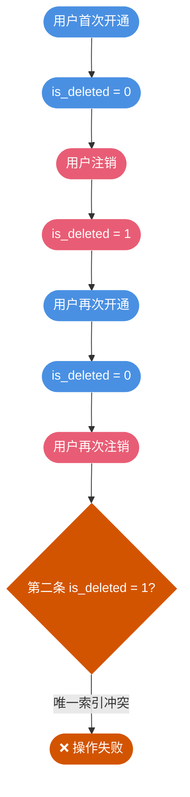

import PaidCTA from '@site/src/components/PaidCTA';

# 逻辑删除与唯一性约束设计

## 逻辑删除的业务背景

### 为什么采用逻辑删除

在实际业务系统中，数据删除通常采用逻辑删除而非物理删除。物理删除意味着数据彻底消失，无法用于后续的数据分析、审计追溯和业务报表生成。

以会员服务开通系统为例，表结构设计如下：

| 字段名 | 数据类型 | 允许为空 | 说明 |
|--------|---------|---------|------|
| id | BIGINT | 否 | 主键 |
| create_time | DATETIME | 否 | 创建时间 |
| update_time | DATETIME | 否 | 更新时间 |
| user_phone | VARCHAR(20) | 否 | 用户手机号 |
| service_code | VARCHAR(50) | 否 | 服务编码 |
| status | VARCHAR(20) | 否 | 状态 |
| is_deleted | TINYINT | 否 | 删除标记 0-正常 1-已删除 |

### 唯一性约束的困境

当用户注销服务时，我们将 `is_deleted` 设置为 1 表示逻辑删除。但问题随之而来：如何防止同一用户重复开通同一服务？

**常规思路是使用唯一索引**，但直接对 `user_phone + service_code` 建立唯一索引会导致：

- 用户无法重新开通曾经注销过的服务
- 因为逻辑删除的记录仍然存在，唯一索引会判定为重复

**尝试加入删除标记**，对 `user_phone + service_code + is_deleted` 建立唯一索引：

- 可以区分正常记录和已删除记录
- 但用户多次开通再注销后，会存在多条 `is_deleted = 1` 的记录，导致唯一索引冲突

## 解决方案详解

### 方案一：物理删除 + 归档表

最直接的解决思路是回归物理删除，但通过归档表保留历史数据以满足审计需求。

<PaidCTA />