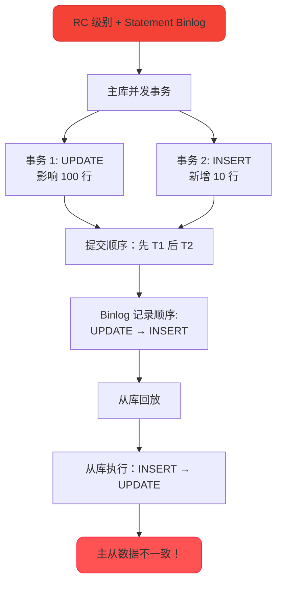
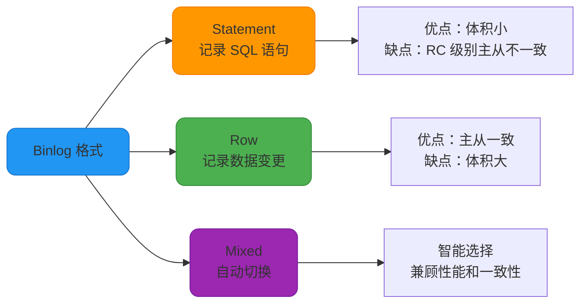
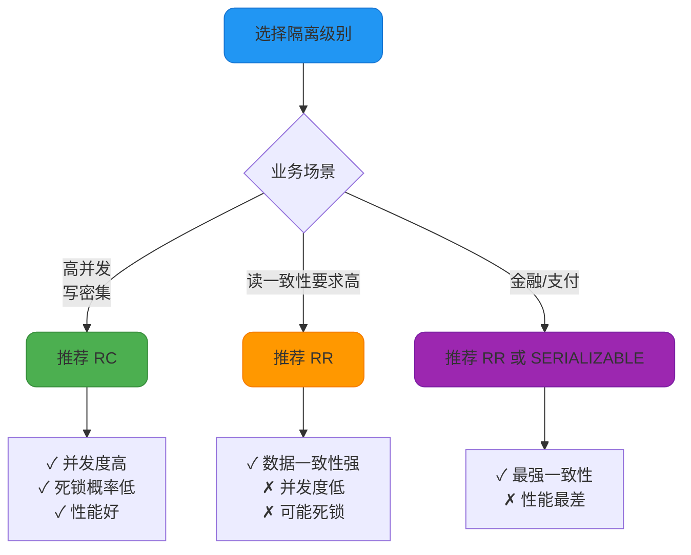

# MySQL事务隔离级别选择策略

## MySQL 默认使用 RR 的历史原因

MySQL InnoDB 存储引擎默认使用 **REPEATABLE READ（可重复读）** 隔离级别，而大多数其他数据库（如 Oracle、SQL Server、PostgreSQL）默认使用 **READ COMMITTED（读已提交）**。

这个设计选择与 MySQL 的历史架构和主从复制机制密切相关。

### 历史背景：Statement 格式的 Binlog

在 MySQL 早期版本中，Binlog 主要使用 **Statement 格式**，即记录执行的原始 SQL 语句。

```sql
-- 主库执行的 SQL
UPDATE orders SET status = 'SHIPPED' WHERE created_at < '2024-01-01';

-- Binlog 记录（Statement 格式）
UPDATE orders SET status = 'SHIPPED' WHERE created_at < '2024-01-01';
-- 从库执行这条 SQL
```

**Statement 格式的优势：**
- Binlog 体积小，节省存储空间
- 网络传输效率高

**Statement 格式的问题：**
在 RC 隔离级别下，Statement 格式的 Binlog 可能导致主从数据不一致。



### RC + Statement 格式的主从不一致问题

**场景示例：**

主库有订单表：

```sql
CREATE TABLE orders (
    order_id INT PRIMARY KEY,
    customer_id INT,
    status VARCHAR(20),
    created_at DATETIME
);

INSERT INTO orders VALUES 
(1, 101, 'PENDING', '2024-01-15 10:00:00'),
(2, 102, 'PENDING', '2024-01-16 10:00:00');
```

**主库事务执行：**

```sql
-- 设置隔离级别为 RC
SET SESSION TRANSACTION ISOLATION LEVEL READ COMMITTED;

-- 时间线
-- T1: 事务 A 开始
BEGIN;
UPDATE orders SET status = 'PROCESSING' 
WHERE created_at < '2024-01-16';
-- 更新 order_id=1

-- T2: 事务 B 开始并提交
BEGIN;
INSERT INTO orders VALUES (3, 103, 'PENDING', '2024-01-15 12:00:00');
COMMIT;
-- 事务 B 先提交

-- T3: 事务 A 提交
COMMIT;
-- 事务 A 后提交
```

**主库 Binlog 记录顺序（按提交顺序）：**

```plaintext
1. INSERT INTO orders VALUES (3, 103, 'PENDING', '2024-01-15 12:00:00');
2. UPDATE orders SET status = 'PROCESSING' WHERE created_at < '2024-01-16';
```

**从库回放 Binlog：**

```sql
-- 从库先执行 INSERT
INSERT INTO orders VALUES (3, 103, 'PENDING', '2024-01-15 12:00:00');
-- 此时从库有 3 条记录：order_id=1,2,3

-- 从库再执行 UPDATE
UPDATE orders SET status = 'PROCESSING' 
WHERE created_at < '2024-01-16';
-- 更新了 order_id=1 和 3（比主库多更新了 order_id=3！）
```

**结果对比：**

| **库** | **order_id=1** | **order_id=2** | **order_id=3** |
|---|---|---|---|
| 主库 | status='PROCESSING' | status='PENDING' | status='PENDING' |
| 从库 | status='PROCESSING' | status='PENDING' | status='**PROCESSING**' |

**主从数据不一致！**

### RR 级别如何解决这个问题

在 RR 隔离级别下，通过 **间隙锁（Gap Lock）** 防止其他事务插入新记录。

```sql
-- 设置隔离级别为 RR
SET SESSION TRANSACTION ISOLATION LEVEL REPEATABLE READ;

-- 事务 A
BEGIN;
UPDATE orders SET status = 'PROCESSING' 
WHERE created_at < '2024-01-16';
-- 不仅锁定 order_id=1，还锁定 created_at < '2024-01-16' 的间隙

-- 事务 B
BEGIN;
INSERT INTO orders VALUES (3, 103, 'PENDING', '2024-01-15 12:00:00');
-- 阻塞！因为 created_at='2024-01-15' 在锁定的间隙内
-- 等待事务 A 提交...

-- 事务 A 提交
COMMIT;
-- 释放锁

-- 事务 B 继续执行
COMMIT;
```

**Binlog 记录顺序（按提交顺序）：**

```plaintext
1. UPDATE orders SET status = 'PROCESSING' WHERE created_at < '2024-01-16';
2. INSERT INTO orders VALUES (3, 103, 'PENDING', '2024-01-15 12:00:00');
```

从库按此顺序回放，与主库执行顺序一致，**主从数据一致**。

### Row 格式 Binlog 的出现

MySQL 5.1 版本引入了 **Row 格式** 的 Binlog，记录数据的实际变更，而非 SQL 语句。

```sql
-- 主库执行
UPDATE orders SET status = 'SHIPPED' WHERE created_at < '2024-01-01';
-- 假设更新了 100 行

-- Binlog 记录（Row 格式）
### UPDATE `ecommerce`.`orders`
### WHERE
###   @1=1 @2='PENDING'  -- order_id=1, status='PENDING'
### SET
###   @1=1 @2='SHIPPED'  -- order_id=1, status='SHIPPED'
-- 记录 100 行的实际变更
```

**Row 格式的优势：**
- 记录数据实际变更，主从一致性有保障
- 支持 RC 隔离级别
- 更适合复杂的 SQL 操作

**Row 格式的劣势：**
- Binlog 体积大（特别是批量更新）
- 网络传输和存储成本高

**MySQL 5.1.8 引入 Mixed 格式：**
- 默认使用 Statement 格式
- 遇到可能导致不一致的 SQL，自动切换为 Row 格式



## 为什么大厂要从 RR 改为 RC

虽然 MySQL 默认使用 RR 隔离级别，但许多大型互联网公司（如阿里、美团、字节跳动）会将数据库的隔离级别调整为 **READ COMMITTED**。

### RR vs RC 对比分析

#### 1. 一致性读（快照读）

| **隔离级别** | **ReadView 生成时机** | **读取行为** |
|---|---|---|
| **RC** | 每次 SELECT 生成新 ReadView | 读取最新已提交的版本 |
| **RR** | 事务第一次 SELECT 生成 ReadView | 读取事务开始时的快照版本 |

```sql
-- RC 示例
SET SESSION TRANSACTION ISOLATION LEVEL READ COMMITTED;
BEGIN;
SELECT balance FROM account WHERE user_id = 1001;  -- ReadView_1，读取 1000
-- 其他事务修改并提交：balance=800
SELECT balance FROM account WHERE user_id = 1001;  -- ReadView_2，读取 800
COMMIT;

-- RR 示例
SET SESSION TRANSACTION ISOLATION LEVEL REPEATABLE READ;
BEGIN;
SELECT balance FROM account WHERE user_id = 1001;  -- ReadView，读取 1000
-- 其他事务修改并提交：balance=800
SELECT balance FROM account WHERE user_id = 1001;  -- 复用 ReadView，读取 1000
COMMIT;
```

#### 2. 锁机制

| **隔离级别** | **锁类型** | **锁粒度** |
|---|---|---|
| **RC** | Record Lock（行锁） | 只锁定匹配的行 |
| **RR** | Next-Key Lock（行锁 + 间隙锁） | 锁定行和间隙 |

```sql
-- 表数据
CREATE TABLE product (id INT PRIMARY KEY, price INT, INDEX(price));
INSERT INTO product VALUES (10, 100), (20, 200), (30, 300);

-- RC 级别
SET SESSION TRANSACTION ISOLATION LEVEL READ COMMITTED;
BEGIN;
SELECT * FROM product WHERE price = 200 FOR UPDATE;
-- 只锁定 id=20 这一行

-- 其他事务可以插入 price=150 的记录
INSERT INTO product VALUES (15, 150);  -- 成功

-- RR 级别
SET SESSION TRANSACTION ISOLATION LEVEL REPEATABLE READ;
BEGIN;
SELECT * FROM product WHERE price = 200 FOR UPDATE;
-- 锁定 id=20 这一行 + (100, 200] 和 (200, 300) 的间隙

-- 其他事务无法插入 price=150 的记录
INSERT INTO product VALUES (15, 150);  -- 阻塞
```

#### 3. 半一致性读（Semi-Consistent Read）

RC 级别支持半一致性读，减少锁冲突。

```sql
-- RC 级别
SET SESSION TRANSACTION ISOLATION LEVEL READ COMMITTED;
BEGIN;
UPDATE product SET stock = stock - 1 WHERE id = 20;
-- 如果 id=20 已被其他事务锁定，InnoDB 返回最近提交的版本
-- 由 MySQL Server 层判断是否需要真正加锁
-- 如果不满足 WHERE 条件，可以提前释放锁
```

RR 级别不支持半一致性读，必须等待锁释放。

#### 4. Binlog 格式限制

| **隔离级别** | **支持的 Binlog 格式** |
|---|---|
| **RC** | Row、Mixed（强制使用 Row） |
| **RR** | Statement、Row、Mixed |

```sql
-- RC 级别
SET SESSION TRANSACTION ISOLATION LEVEL READ COMMITTED;
SET SESSION binlog_format = 'STATEMENT';  -- 无效
SHOW VARIABLES LIKE 'binlog_format';
-- 返回：ROW（自动转为 Row 格式）
```

### 大厂选择 RC 的原因

#### 原因 1：提升并发性能

**问题：** RR 的间隙锁会锁定大范围，降低并发度。

```sql
-- RR 级别
BEGIN;
DELETE FROM orders WHERE status = 'CANCELLED' AND created_at < '2023-01-01';
-- 锁定所有 status='CANCELLED' 且 created_at < '2023-01-01' 的记录和间隙
-- 其他事务无法插入 status='CANCELLED' 的新记录

-- RC 级别
BEGIN;
DELETE FROM orders WHERE status = 'CANCELLED' AND created_at < '2023-01-01';
-- 只锁定匹配的行
-- 其他事务可以插入 status='CANCELLED' 的新记录（不同的 created_at）
```

**性能对比：**
- **RR**：锁粒度大，锁等待多，并发度低
- **RC**：锁粒度小，锁等待少，并发度高

在高并发场景下（如双 11、618），RC 的性能优势明显。

#### 原因 2：减少死锁概率

间隙锁增加了死锁的风险。

```sql
-- RR 级别死锁示例
-- 事务 A
BEGIN;
SELECT * FROM product WHERE id > 10 AND id < 20 FOR UPDATE;
-- 锁定 (10, 20) 间隙

-- 事务 B
BEGIN;
SELECT * FROM product WHERE id > 15 AND id < 25 FOR UPDATE;
-- 锁定 (15, 25) 间隙

-- 事务 A
INSERT INTO product VALUES (18, 1000);  -- 等待事务 B 释放 (15, 25)

-- 事务 B
INSERT INTO product VALUES (12, 2000);  -- 等待事务 A 释放 (10, 20)

-- 死锁！
```

RC 级别没有间隙锁，大大降低死锁概率。

#### 原因 3：使用 Row 格式 Binlog 解决主从一致性

现代 MySQL 版本（5.1+）推荐使用 Row 格式 Binlog：

```sql
-- 配置文件设置
[mysqld]
binlog_format = ROW
transaction_isolation = READ-COMMITTED
```

Row 格式保证主从一致性，不再依赖 RR 级别。

#### 原因 4：业务可以容忍不可重复读

在互联网业务中，不可重复读通常是可以接受的：

```sql
-- 用户查询余额
SELECT balance FROM account WHERE user_id = 1001;
-- 返回 1000 元

-- 其他事务转账
UPDATE account SET balance = 800 WHERE user_id = 1001;

-- 用户再次查询
SELECT balance FROM account WHERE user_id = 1001;
-- 返回 800 元（不可重复读）

-- 这是合理的！余额确实变化了
```

**解决方案：** 对于关键操作，使用乐观锁或悲观锁。

```sql
-- 乐观锁示例
UPDATE account SET balance = balance - 100, version = version + 1
WHERE user_id = 1001 AND version = 5;
-- 只有 version 匹配才更新

-- 悲观锁示例
BEGIN;
SELECT balance FROM account WHERE user_id = 1001 FOR UPDATE;
-- 加排他锁
UPDATE account SET balance = balance - 100 WHERE user_id = 1001;
COMMIT;
```

### RR 和 RC 的选择建议



**使用 RC 的场景：**
- 互联网高并发业务（电商、社交、游戏）
- 写操作频繁的系统
- 可以容忍不可重复读
- 已使用 Row 格式 Binlog
- 需要降低死锁概率

**使用 RR 的场景：**
- 对数据一致性要求高的业务
- 读多写少的系统
- 需要避免幻读的场景
- 遗留系统（使用 Statement Binlog）

**使用 SERIALIZABLE 的场景：**
- 金融交易系统
- 账务结算系统
- 对一致性要求极高的核心业务

## 实战配置建议

### 切换到 RC 隔离级别

```sql
-- 临时设置（当前会话）
SET SESSION TRANSACTION ISOLATION LEVEL READ COMMITTED;

-- 全局设置（所有新连接）
SET GLOBAL TRANSACTION ISOLATION LEVEL READ COMMITTED;

-- 永久配置（my.cnf）
[mysqld]
transaction_isolation = READ-COMMITTED
binlog_format = ROW  -- 必须使用 Row 格式
```

### 兼容性注意事项

切换到 RC 后，需要注意：

1. **确保使用 Row 格式 Binlog**
2. **核心业务加乐观锁或悲观锁**
3. **监控死锁情况**
4. **压测验证性能提升**

```sql
-- 添加乐观锁
ALTER TABLE orders ADD COLUMN version INT DEFAULT 0;

UPDATE orders SET status = 'PAID', version = version + 1
WHERE order_id = 1001 AND version = 5;
```

## 总结

**MySQL 默认 RR 的历史原因：**
- 早期使用 Statement 格式 Binlog
- RC + Statement 会导致主从数据不一致
- RR 通过间隙锁保证主从一致

**大厂改用 RC 的原因：**
1. ✓ 提升并发性能（锁粒度小）
2. ✓ 减少死锁概率（无间隙锁）
3. ✓ Row 格式 Binlog 保证一致性
4. ✓ 业务可容忍不可重复读

**技术选择是一种权衡的艺术：**
- 性能 vs 一致性
- 并发度 vs 隔离性
- 业务需求 vs 技术实现

根据实际业务场景选择合适的隔离级别，才能在性能和可靠性之间取得最佳平衡。
