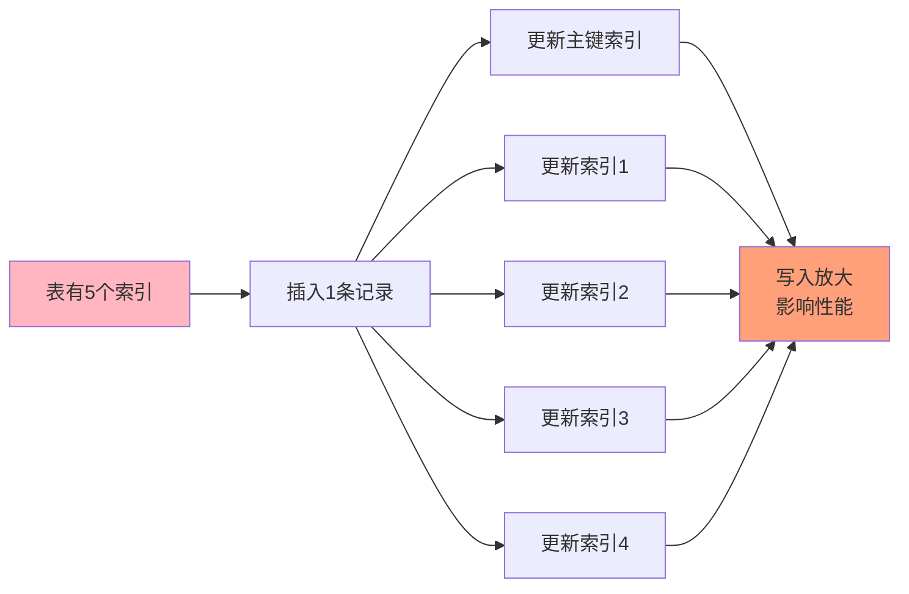
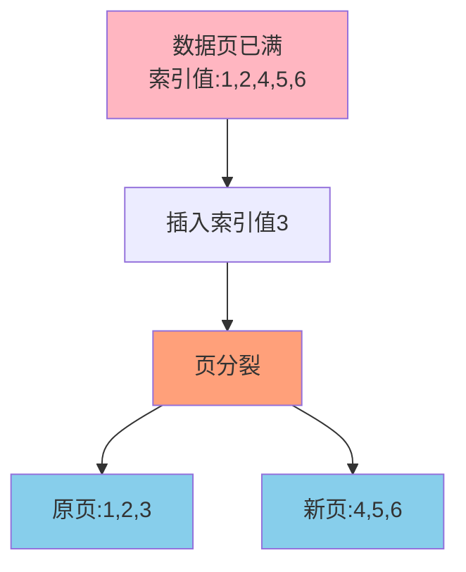
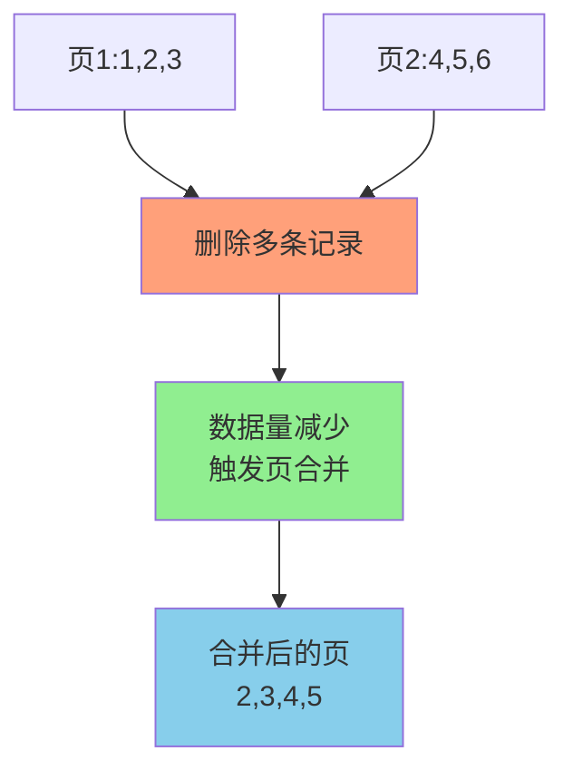

# MySQL索引设计最佳实践
## 索引设计原则

合理的索引设计是数据库性能优化的基础。在设计索引时,需要综合考虑查询性能、存储空间、写入性能等多个方面。

### 选择合适的字段创建索引

**1. 频繁作为查询条件的字段**

分析业务中的高频查询场景,为WHERE子句中经常出现的字段建立索引:

```sql
-- 如果经常按用户ID查询订单
SELECT * FROM orders WHERE user_id = ?;
-- 应该创建索引
CREATE INDEX idx_user_id ON orders(user_id);

-- 如果经常按时间范围查询
SELECT * FROM logs WHERE create_time BETWEEN ? AND ?;
-- 应该创建索引
CREATE INDEX idx_create_time ON logs(create_time);
```

**2. 频繁用于JOIN连接的字段**

关联查询中的连接字段应该建立索引:

```sql
-- 订单表和用户表经常关联查询
SELECT o.*, u.username 
FROM orders o 
JOIN users u ON o.user_id = u.user_id;

-- 应该在orders表的user_id上创建索引
CREATE INDEX idx_user_id ON orders(user_id);
```

**3. 频繁用于排序和分组的字段**

```sql
-- 如果经常按创建时间排序
SELECT * FROM articles ORDER BY publish_time DESC LIMIT 20;
-- 创建索引可以避免文件排序
CREATE INDEX idx_publish_time ON articles(publish_time);

-- 如果经常按类别分组统计
SELECT category, COUNT(*) FROM products GROUP BY category;
-- 创建索引可以优化分组操作
CREATE INDEX idx_category ON products(category);
```

**4. 区分度高的字段**

字段的区分度(选择性)是指不重复值的数量占总行数的比例:

```sql
-- 计算字段区分度
SELECT COUNT(DISTINCT column_name) / COUNT(*) AS selectivity
FROM table_name;
```

一般来说:
- 选择性 > 0.8: 适合建索引
- 选择性 0.5-0.8: 根据情况决定
- 选择性 < 0.5: 通常不适合建索引

**但也有例外**: 如果数据分布极度倾斜,即使区分度低也可能需要索引。

**示例**:

```sql
-- 订单状态字段,虽然区分度低
-- 但如果95%的订单是已完成,只有5%是待处理
-- 查询待处理订单时索引仍然有效
SELECT * FROM orders WHERE status = 'PENDING';
```

### 避免在频繁更新的字段上建索引

索引虽然能加速查询,但会降低写入性能:

```sql
-- 不推荐:在频繁更新的字段上建索引
CREATE TABLE user_sessions (
    session_id VARCHAR(64) PRIMARY KEY,
    user_id BIGINT NOT NULL,
    last_active TIMESTAMP NOT NULL,  -- 每次用户操作都会更新
    KEY idx_last_active (last_active)  -- 索引维护成本高
);

-- 如果确实需要查询,可以考虑定期归档+查询归档表
```

### 限制每张表的索引数量

**建议单张表索引不超过5个**,原因包括:

1. **占用存储空间**: 每个索引都是一棵B+树,占用磁盘空间
2. **降低写入性能**: 每次INSERT/UPDATE/DELETE都要维护所有索引
3. **增加优化器负担**: 索引越多,优化器选择合适索引的时间越长



### 优先考虑联合索引

联合索引相比多个单列索引有明显优势:

**空间效率**:

```sql
-- 方案1: 创建两个单列索引(占用空间大)
CREATE INDEX idx_user ON orders(user_id);
CREATE INDEX idx_status ON orders(status);

-- 方案2: 创建一个联合索引(占用空间小)
CREATE INDEX idx_user_status ON orders(user_id, status);
```

**查询效率**:

```sql
-- 联合索引可以覆盖多种查询场景
SELECT * FROM orders WHERE user_id = 10086;  -- 使用联合索引
SELECT * FROM orders WHERE user_id = 10086 AND status = 1;  -- 使用联合索引

-- 还可以实现覆盖索引
SELECT user_id, status FROM orders WHERE user_id = 10086;  -- 无需回表
```

**联合索引字段顺序原则**:

1. 区分度高的字段放在前面
2. 查询频率高的字段放在前面
3. 考虑覆盖索引,将SELECT字段包含进来

### 避免冗余索引

冗余索引会浪费存储空间并降低写入性能:

```sql
-- 冗余示例
CREATE INDEX idx_user_status ON orders(user_id, status);
CREATE INDEX idx_user ON orders(user_id);  -- 冗余!被上面的索引覆盖

-- 正确做法:删除冗余索引
DROP INDEX idx_user ON orders;
```

**如何识别冗余索引**:

- 如果索引idx_a(a, b)存在,索引idx_a_only(a)就是冗余的
- 使用工具检测:pt-duplicate-key-checker

## 前缀索引的使用

前缀索引是针对较长的字符串字段,只对前N个字符建立索引。

### 基本用法

```sql
-- 对URL字段的前50个字符创建索引
CREATE TABLE web_pages (
    page_id BIGINT PRIMARY KEY,
    url VARCHAR(500) NOT NULL,
    title VARCHAR(200),
    KEY idx_url_prefix (url(50))
) ENGINE=InnoDB;

-- 对邮箱地址的前20个字符创建索引
CREATE INDEX idx_email ON users(email(20));
```

### 前缀长度的选择

选择合适的前缀长度需要在空间效率和查询效率之间平衡:

```sql
-- 计算不同前缀长度的选择性
SELECT 
    COUNT(DISTINCT LEFT(email, 5)) / COUNT(*) AS prefix_5,
    COUNT(DISTINCT LEFT(email, 10)) / COUNT(*) AS prefix_10,
    COUNT(DISTINCT LEFT(email, 15)) / COUNT(*) AS prefix_15,
    COUNT(DISTINCT LEFT(email, 20)) / COUNT(*) AS prefix_20,
    COUNT(DISTINCT email) / COUNT(*) AS full_column
FROM users;
```

**选择原则**:

选择能达到接近完整字段选择性的最小前缀长度。

例如结果是:
- prefix_5: 0.45
- prefix_10: 0.78
- prefix_15: 0.95
- prefix_20: 0.98
- full_column: 0.98

可以选择15作为前缀长度,因为选择性已经接近完整字段。

### 前缀索引的限制

**1. 无法用于覆盖索引**

```sql
-- 即使有前缀索引,以下查询仍需回表
SELECT email FROM users WHERE email = 'user@example.com';
```

**2. 无法用于排序**

```sql
-- 无法利用前缀索引优化排序
SELECT * FROM users ORDER BY email;
```

**3. 精确匹配能力下降**

如果前缀长度选择不当,可能导致大量重复值:

```sql
-- 如果很多用户的邮箱都是user001@..., user002@...
-- 前缀索引(email(7))会有大量重复
-- 导致回表次数增加
```

### 适用场景

前缀索引适用于:
- URL、文件路径等较长字段
- 邮箱地址
- 长文本描述字段

不适用于:
- 身份证号(前几位区分度很低)
- 手机号(前几位区分度很低)
- 经常需要精确匹配的字段

## InnoDB页分裂与页合并

### 什么是页分裂

InnoDB以页(默认16KB)为单位存储数据。当向一个已满的页插入数据时,会触发页分裂。

**页分裂过程**:



**触发条件**:
1. 当前页已满(接近16KB)
2. 需要插入的数据在页中间(非末尾)

**页分裂的危害**:

1. **性能下降**: 涉及大量数据移动和I/O操作
2. **空间浪费**: 新分裂的页通常有较多空闲空间
3. **碎片增加**: 导致磁盘碎片化

### 什么是页合并

当删除数据后,相邻的两个页可以合并成一个页,这个过程叫页合并。



**触发条件**:
- 页的填充度低于阈值(默认50%)
- 相邻页可以合并

**页合并的影响**:
- 减少磁盘碎片
- 但合并操作本身也有性能开销

### 如何避免页分裂

**1. 使用自增主键**

```sql
-- 推荐:使用自增主键
CREATE TABLE orders (
    order_id BIGINT PRIMARY KEY AUTO_INCREMENT,
    order_no VARCHAR(32) NOT NULL,
    ...
) ENGINE=InnoDB;

-- 不推荐:使用UUID作为主键
CREATE TABLE orders (
    order_id CHAR(36) PRIMARY KEY DEFAULT (UUID()),  -- 无序,导致页分裂
    ...
) ENGINE=InnoDB;
```

使用自增主键,数据总是插入到页的末尾,避免页分裂。

**2. 使用有序的业务主键**

如果必须使用业务字段作为主键,选择有序的字段:

```sql
-- 如果使用时间戳作为主键,相对有序
CREATE TABLE logs (
    log_id BIGINT PRIMARY KEY,  -- 时间戳,相对有序
    ...
);
```

**3. 批量插入代替逐条插入**

```sql
-- 不推荐:逐条插入
INSERT INTO orders VALUES (...);
INSERT INTO orders VALUES (...);
INSERT INTO orders VALUES (...);

-- 推荐:批量插入
INSERT INTO orders VALUES (...), (...), (...);
```

**4. 使用逻辑删除代替物理删除**

```sql
-- 不推荐:物理删除(可能导致页合并)
DELETE FROM users WHERE user_id = 12345;

-- 推荐:逻辑删除
UPDATE users SET is_deleted = 1 WHERE user_id = 12345;
```

### 监控页分裂

可以通过InnoDB状态查看页分裂情况:

```sql
SHOW ENGINE INNODB STATUS;
```

关注以下指标:
- Merges: 页合并次数
- Splits: 页分裂次数

## 索引设计实战案例

### 案例1: 电商订单表索引设计

**需求分析**:

```sql
-- 高频查询场景
-- 1. 查询用户的订单列表
SELECT * FROM orders WHERE user_id = ? ORDER BY create_time DESC LIMIT 20;

-- 2. 查询用户的待支付订单
SELECT * FROM orders WHERE user_id = ? AND status = 'PENDING_PAY';

-- 3. 查询某个时间段的订单
SELECT * FROM orders WHERE create_time BETWEEN ? AND ?;

-- 4. 统计每个状态的订单数量
SELECT status, COUNT(*) FROM orders GROUP BY status;
```

**索引设计**:

```sql
CREATE TABLE orders (
    order_id BIGINT PRIMARY KEY AUTO_INCREMENT,
    order_no VARCHAR(32) NOT NULL,
    user_id BIGINT NOT NULL,
    status VARCHAR(20) NOT NULL,
    total_amount DECIMAL(10,2) NOT NULL,
    create_time DATETIME NOT NULL,
    update_time DATETIME NOT NULL,
    
    -- 唯一索引:保证订单号唯一
    UNIQUE KEY uk_order_no (order_no),
    
    -- 联合索引:覆盖场景1和2
    KEY idx_user_time (user_id, create_time),
    
    -- 普通索引:覆盖场景3和4
    KEY idx_create_time (create_time),
    KEY idx_status (status)
) ENGINE=InnoDB;
```

### 案例2: 社交应用用户表索引设计

**需求分析**:

```sql
-- 1. 手机号登录
SELECT * FROM users WHERE phone = ?;

-- 2. 邮箱登录
SELECT * FROM users WHERE email = ?;

-- 3. 用户名搜索
SELECT user_id, username, avatar FROM users WHERE username LIKE '张%';

-- 4. 查询活跃用户
SELECT * FROM users WHERE last_login_time > ? ORDER BY last_login_time DESC;
```

**索引设计**:

```sql
CREATE TABLE users (
    user_id BIGINT PRIMARY KEY AUTO_INCREMENT,
    username VARCHAR(50) NOT NULL,
    phone VARCHAR(20) NOT NULL,
    email VARCHAR(100),
    avatar VARCHAR(200),
    last_login_time DATETIME,
    
    -- 唯一索引:保证手机号和邮箱唯一,同时加速查询
    UNIQUE KEY uk_phone (phone),
    UNIQUE KEY uk_email (email),
    
    -- 普通索引:支持用户名前缀搜索
    KEY idx_username (username),
    
    -- 普通索引:支持活跃用户查询和排序
    KEY idx_last_login (last_login_time)
) ENGINE=InnoDB;
```

### 案例3: 日志表索引设计

**特殊考虑**:
- 日志表写入量大,读取相对较少
- 通常按时间查询
- 不适合建立过多索引

**索引设计**:

```sql
CREATE TABLE access_logs (
    log_id BIGINT PRIMARY KEY AUTO_INCREMENT,
    user_id BIGINT,
    request_path VARCHAR(500),
    request_method VARCHAR(10),
    response_time INT,
    create_time DATETIME NOT NULL,
    
    -- 只建立必要的索引
    KEY idx_user_time (user_id, create_time),
    KEY idx_create_time (create_time)
    
    -- request_path不建索引(查询频率低,字段过长)
) ENGINE=InnoDB;

-- 配合分区表使用
ALTER TABLE access_logs PARTITION BY RANGE (YEAR(create_time)) (
    PARTITION p2023 VALUES LESS THAN (2024),
    PARTITION p2024 VALUES LESS THAN (2025),
    PARTITION p2025 VALUES LESS THAN (2026)
);
```

## 索引维护与优化

### 定期分析和优化表

```sql
-- 分析表,更新索引统计信息
ANALYZE TABLE orders;

-- 优化表,整理碎片
OPTIMIZE TABLE orders;
```

### 删除长期未使用的索引

**MySQL 5.7+可以查询未使用的索引**:

```sql
SELECT * FROM sys.schema_unused_indexes;
```

**谨慎删除索引的步骤**:

1. 先设置索引为不可见(MySQL 8.0+)
2. 观察一段时间业务是否正常
3. 确认无影响后再删除

```sql
-- 设置索引不可见
ALTER TABLE orders ALTER INDEX idx_old_column INVISIBLE;

-- 观察一段时间后,确认可以删除
DROP INDEX idx_old_column ON orders;
```

### 监控索引使用情况

```sql
-- 查看索引统计信息
SHOW INDEX FROM orders;

-- 查看表的索引使用情况
SELECT * FROM sys.schema_index_statistics
WHERE table_schema = 'your_database'
  AND table_name = 'orders';
```

## 索引设计最佳实践总结

1. **选择性原则**: 为查询频繁、区分度高的字段建索引
2. **最少原则**: 控制索引数量,避免过度索引
3. **联合原则**: 优先使用联合索引代替多个单列索引
4. **覆盖原则**: 设计联合索引时考虑索引覆盖,避免回表
5. **有序原则**: 主键使用自增字段,避免页分裂
6. **长度原则**: 对于长字段使用前缀索引
7. **维护原则**: 定期分析和优化,删除无用索引

通过遵循这些原则,可以设计出高效的索引体系,显著提升数据库性能。
