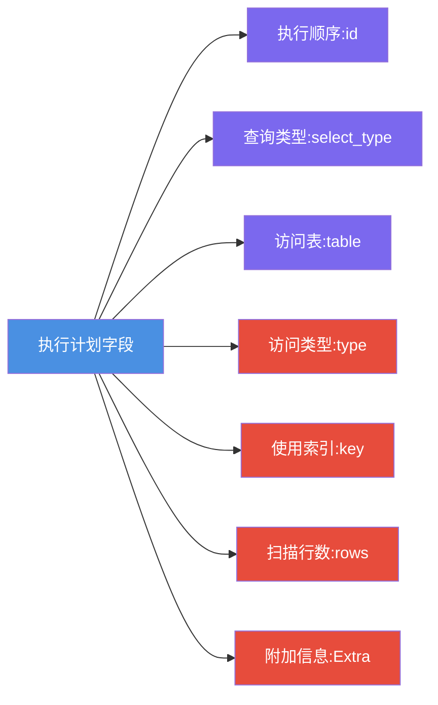
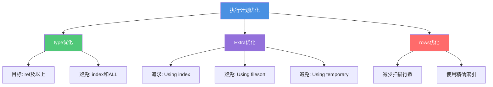

# 执行计划深度解析与实战

## 什么是SQL执行计划

SQL执行计划描述了MySQL查询优化器针对特定SQL语句选择的具体执行策略。通过执行计划,我们能够深入了解查询过程中的表访问顺序、索引使用情况、数据扫描量等关键信息,为SQL性能优化提供重要依据。

执行计划主要用于分析SQL性能瓶颈、诊断查询慢的根本原因,是数据库性能调优的第一步。

## 获取执行计划的方法

MySQL提供了`EXPLAIN`命令来获取执行计划信息。需要注意的是,`EXPLAIN`只是模拟优化器执行SQL的过程,并不会真正执行查询语句。

### 基本语法

```sql
EXPLAIN SELECT * FROM products WHERE category_id = 10;
```

### 支持的语句类型

`EXPLAIN`支持多种DML语句的分析:
- SELECT查询(最常用)
- DELETE删除
- INSERT插入
- REPLACE替换
- UPDATE更新

### 查看示例

```sql
EXPLAIN SELECT * FROM orders WHERE customer_id IN (
    SELECT customer_id FROM customers GROUP BY customer_id HAVING COUNT(*) > 1
);
```

执行结果包含12个字段:



## 执行计划核心字段解析

### id字段 - 执行顺序

`id`字段标识SQL中每个SELECT语句的执行顺序号:
- id相同时,按从上到下的顺序依次执行
- id不同时,id值越大优先级越高,越先执行
- id为NULL时,表示这是一个结果集,不需要查询

### select_type字段 - 查询类型

常见的查询类型包括:

| 类型 | 说明 |
|------|------|
| SIMPLE | 简单查询,不含子查询或UNION |
| PRIMARY | 外层查询(包含子查询时) |
| SUBQUERY | 子查询中的第一个SELECT |
| UNION | UNION语句中第二个及之后的SELECT |
| DERIVED | FROM子句中的派生表 |
| UNION RESULT | UNION查询的结果集 |

### table字段 - 数据来源

指明当前操作涉及的表名,可能的值:
- 实际表名
- `<unionM,N>` - 引用id为M和N的UNION结果
- `<derivedN>` - 引用id为N的派生表
- `<subqueryN>` - 引用id为N的物化子查询

### type字段 - 访问类型(重要)

访问类型反映了MySQL如何查找表中的数据行,性能从优到劣排序:

```
system > const > eq_ref > ref > range > index > ALL
```

#### 各类型详解

**system/const** - 最优访问
- system: 表中仅有一行记录(MyISAM引擎)
- const: 通过主键或唯一索引精确匹配一行

```sql
-- const示例
SELECT * FROM products WHERE product_id = 100;
```

**eq_ref** - 唯一索引扫描
- 多表连接时,对于前表的每一行,后表中只有一行匹配
- 通常使用主键或唯一索引进行连接

```sql
-- eq_ref示例
SELECT * FROM orders o
INNER JOIN customers c ON o.customer_id = c.id;
```

**ref** - 非唯一索引扫描
- 使用普通索引或唯一索引的前缀
- 可能返回多条匹配记录

```sql
-- ref示例
SELECT * FROM products WHERE category_id = 5;
```

**range** - 索引范围扫描
- 使用索引进行范围查询,如 `<`、`>`、`BETWEEN`、`IN`

```sql
-- range示例
SELECT * FROM orders WHERE order_date BETWEEN '2024-01-01' AND '2024-01-31';
```

**index** - 全索引扫描
- 遍历整个索引树
- 比ALL快,因为索引文件通常比数据文件小

**ALL** - 全表扫描
- 最差的访问方式,需要优化

### possible_keys与key字段

- **possible_keys**: MySQL认为可能使用的索引列表
- **key**: 实际使用的索引
  - 为NULL表示未使用索引
  - 应重点关注此字段

### key_len字段 - 索引长度

表示MySQL使用的索引的实际字节长度:
- 对于联合索引,可判断使用了几个字段
- 在满足需求的前提下,越短越好

### rows字段 - 扫描行数

MySQL预估需要扫描的行数:
- 这是一个估算值,不是精确值
- 数值越小,说明查询效率越高

### filtered字段 - 过滤百分比

表示经过WHERE条件过滤后保留的记录百分比(0-100):


#### filtered的实际意义

对于单表查询,filtered参考价值有限:
- filtered=100: 索引过滤效果好,所有行都满足条件
- filtered很小: 可能需要优化索引设计,如增加联合索引字段

对于多表JOIN,filtered非常重要:
- 下一个表需要处理的行数 = rows × filtered%
- filtered越小,传递给下一表的数据越少,JOIN效率越高

示例:
```sql
-- 假设执行计划显示:
-- Table: products, rows: 10000, filtered: 10.00
-- 实际传递给下一表的行数 = 10000 × 10% = 1000
```

### Extra字段 - 附加信息(重要)

Extra字段提供查询执行的额外细节,常见值及含义:

#### 性能优化相关

**Using index** - 覆盖索引
- 查询列都在索引中,无需回表
- 性能最优

```sql
-- 假设存在索引idx_name_age(name, age)
SELECT name, age FROM users WHERE name = '张三';
```

**Using index condition** - 索引下推
- 将部分WHERE条件下推到存储引擎层
- 减少回表次数

**Using where** - WHERE过滤
- 在Server层进行WHERE条件过滤
- 通常表示未使用索引或索引不完全匹配

#### 需要优化的情况

**Using filesort** - 文件排序
- 无法使用索引完成排序
- 需要额外的排序操作,影响性能

```sql
-- 触发filesort
SELECT * FROM products WHERE category_id = 5 ORDER BY price;
```

优化建议:
1. 创建包含排序字段的索引
2. 调整`sort_buffer_size`参数
3. 减少排序字段数量

**Using temporary** - 临时表
- 需要创建临时表存储中间结果
- 常见于GROUP BY、DISTINCT、UNION

```sql
-- 触发临时表
SELECT category, COUNT(*) FROM products GROUP BY category;
```

**Using join buffer** - JOIN缓冲区
- 被驱动表没有使用索引
- MySQL先将驱动表数据放入join buffer,再与被驱动表匹配

#### 其他常见值

- **Using index for group-by**: 使用索引优化GROUP BY
- **Range checked for each record**: 每行都检查索引范围
- **Impossible WHERE**: WHERE条件总是false

## 执行计划实战分析

### 判断是否使用了索引

并非key有值就表示高效使用了索引,需要结合type和Extra综合判断:

#### 场景一:全索引扫描

```sql
EXPLAIN SELECT product_name FROM products WHERE price > 100;
```

```
+------+-------+---------------+----------+--------------------------+
| type | key   | rows          | filtered | Extra                    |
+------+-------+---------------+----------+--------------------------+
| index| idx_p |  50000        |   20.00  | Using where; Using index |
+------+-------+---------------+----------+--------------------------+
```

分析:
- type=index表示扫描了整个索引树
- Extra包含"Using where"表示还需要额外过滤
- **并非高效使用索引,性能一般**

#### 场景二:索引精确匹配

```sql
EXPLAIN SELECT * FROM products WHERE category_id = 10;
```

```
+------+---------------+------+----------+-------+
| type | key           | rows | filtered | Extra |
+------+---------------+------+----------+-------+
| ref  | idx_category  |  100 |  100.00  | NULL  |
+------+---------------+------+----------+-------+
```

分析:
- type=ref表示使用非唯一索引
- **高效使用索引**

#### 场景三:覆盖索引

```sql
-- 索引: idx_category_name(category_id, product_name)
EXPLAIN SELECT product_name FROM products WHERE category_id = 10;
```

```
+------+-------------------+------+----------+---------------+
| type | key               | rows | filtered | Extra         |
+------+-------------------+------+----------+---------------+
| ref  | idx_category_name |  100 |  100.00  | Using index   |
+------+-------------------+------+----------+---------------+
```

分析:
- Extra只有"Using index"
- **使用覆盖索引,性能最优**

#### 场景四:未使用索引

```sql
EXPLAIN SELECT * FROM products WHERE description LIKE '%优惠%';
```

```
+------+------+-------+----------+-------------+
| type | key  | rows  | filtered | Extra       |
+------+------+-------+----------+-------------+
| ALL  | NULL | 50000 |  100.00  | Using where |
+------+------+-------+----------+-------------+
```

分析:
- type=ALL表示全表扫描
- key=NULL表示未使用索引
- **需要优化**

### key有值但查询仍然很慢

出现`type=index, key有值`的情况,很多人误以为走了索引,实际上这只是扫描了整个索引树:

```sql
-- 联合索引: idx_abc(a,b,c)
EXPLAIN SELECT * FROM orders WHERE b = '特定值';
```

```
+------+-------+---------+----------+--------------------------+
| type | key   | rows    | filtered | Extra                    |
+------+-------+---------+----------+--------------------------+
| index| idx_abc| 100000 |   10.00  | Using where; Using index |
+------+-------+---------+----------+--------------------------+
```

**问题分析**:
- 违反了最左前缀匹配原则
- 虽然用了索引树,但是全索引扫描,效率不高

**优化方案**:
1. 调整查询条件,遵循最左前缀
2. 针对b字段单独创建索引
3. 调整联合索引顺序为idx_bac

## 查看查询成本

MySQL 8.0支持使用JSON格式查看详细的成本信息:

```sql
EXPLAIN FORMAT=JSON SELECT * FROM orders WHERE status = 'pending';
```

```json
{
  "query_block": {
    "select_id": 1,
    "cost_info": {
      "query_cost": "1250.75",
      "read_cost": "1200.50",
      "eval_cost": "50.25",
      "prefix_cost": "1250.75",
      "data_read_per_join": "2M"
    },
    "table": {
      "table_name": "orders",
      "access_type": "range",
      "rows_examined_per_scan": 500
    }
  }
}
```

### 成本字段说明

| 字段 | 含义 |
|------|------|
| query_cost | 总成本 = read_cost + eval_cost |
| read_cost | IO成本(从磁盘/内存读取数据) |
| eval_cost | CPU成本(Server层计算) |
| prefix_cost | 当前表及之前表的累计成本 |
| data_read_per_join | 读取的数据总字节数 |

### MySQL成本计算公式

```
总成本 = CPU成本 + IO成本
```

#### CPU成本参数

可通过`SELECT * FROM mysql.server_cost`查看(MySQL 8.0):

| 参数 | 默认值 | 说明 |
|------|--------|------|
| row_evaluate_cost | 0.1 | 记录间比较成本 |
| key_compare_cost | 0.05 | 索引键值比较成本 |
| memory_temptable_create_cost | 1.0 | 创建内存临时表成本 |
| disk_temptable_create_cost | 20.0 | 创建磁盘临时表成本 |

#### IO成本参数

可通过`SELECT * FROM mysql.engine_cost`查看:

| 参数 | 默认值 | 说明 |
|------|--------|------|
| io_block_read_cost | 1.0 | 从磁盘读取一页的成本 |
| memory_block_read_cost | 0.25 | 从内存读取一页的成本 |

**关键发现**: 磁盘IO成本是内存的4倍,因此:
- 尽可能让数据缓存在内存中
- 减少磁盘随机IO(如回表操作)
- 增大`innodb_buffer_pool_size`提升缓存命中率

### 成本分析实战

如果发现query_cost很高,可按以下思路优化:

**read_cost高** → IO成本高
- 可能原因: 大量回表、全表扫描、索引不当
- 优化方向: 使用覆盖索引、减少扫描行数、优化索引设计

**eval_cost高** → CPU成本高
- 可能原因: 大量数据运算、复杂表达式、临时表操作
- 优化方向: 简化计算逻辑、减少临时表、优化聚合查询

## 执行计划优化建议

### 基本原则



### 优化检查清单

1. **type字段检查**
   - ✓ 理想: system、const、eq_ref、ref
   - ✗ 需优化: index、ALL

2. **key字段检查**
   - ✓ key有值且type合理
   - ✗ key为NULL

3. **Extra字段检查**
   - ✓ Using index(覆盖索引)
   - ✗ Using filesort、Using temporary

4. **rows字段检查**
   - ✓ 扫描行数尽可能少
   - ✗ 扫描行数过多(如超过表总行数的20%)

5. **filtered字段检查(多表JOIN)**
   - ✓ filtered较高,传递数据少
   - ✗ filtered很低,考虑优化索引

## 总结

执行计划分析是SQL优化的基础技能,需要重点关注:
- **type字段**: 反映访问效率,越靠前越好
- **key字段**: 确认索引使用情况
- **Extra字段**: 发现性能瓶颈,如filesort、temporary
- **rows字段**: 评估扫描成本
- **filtered字段**: 多表JOIN时评估数据传递量

通过系统分析执行计划,我们可以准确定位SQL性能问题,并采取针对性的优化措施。
