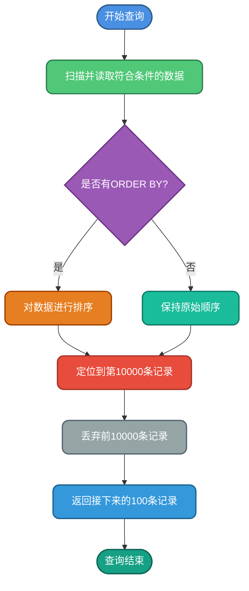
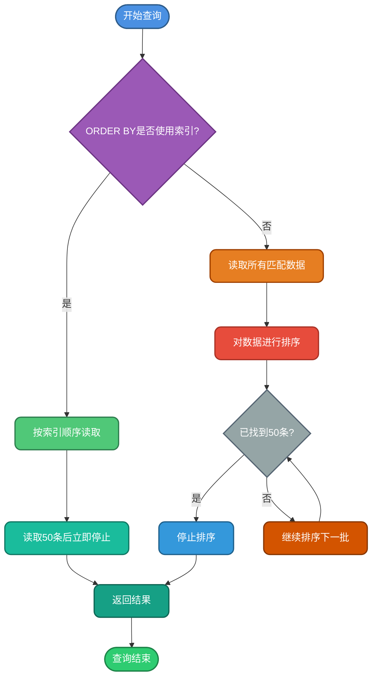
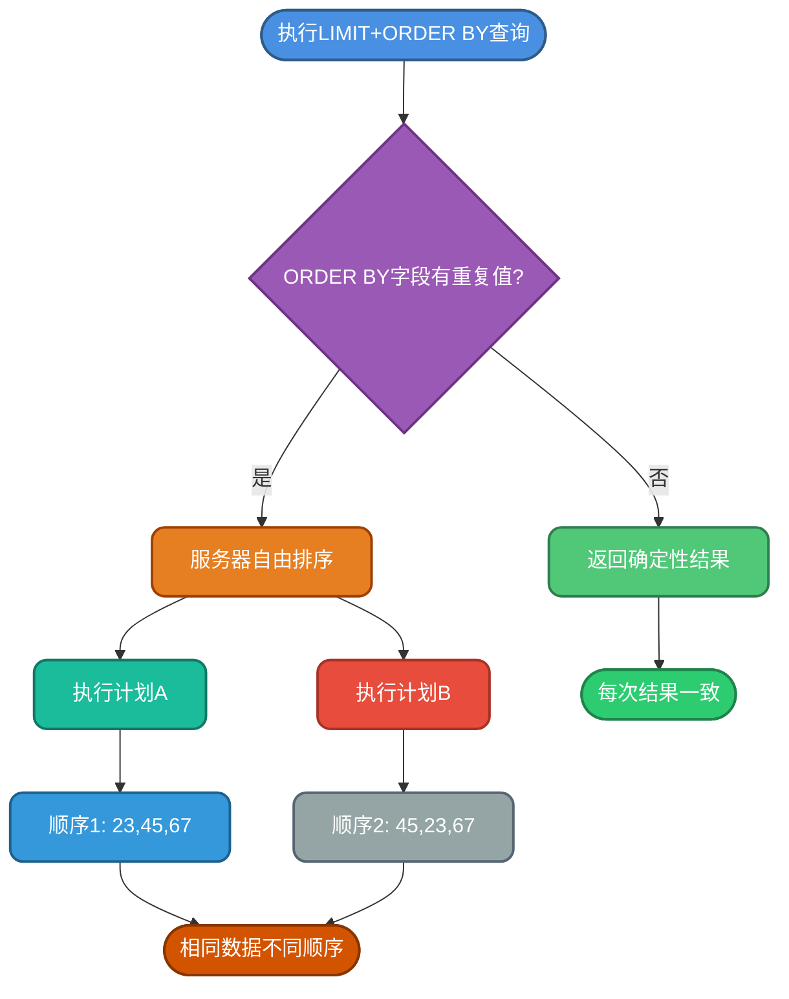
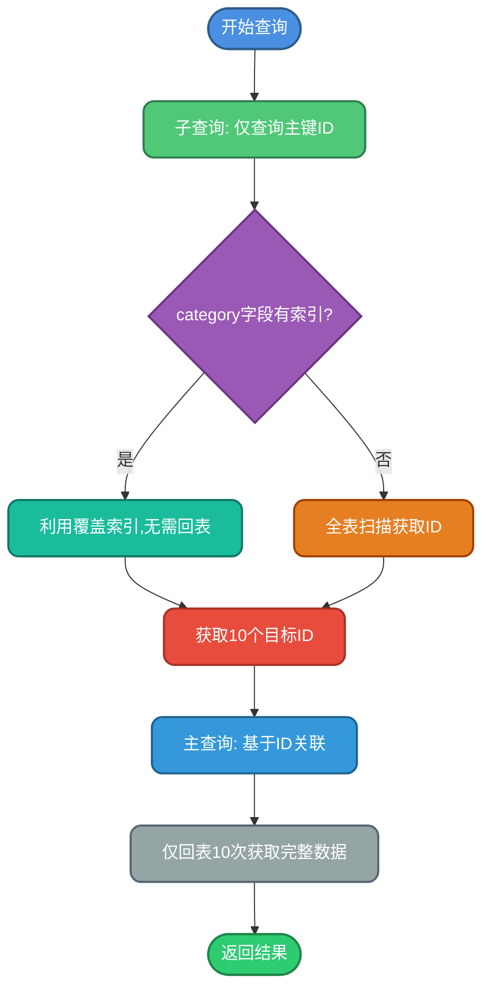
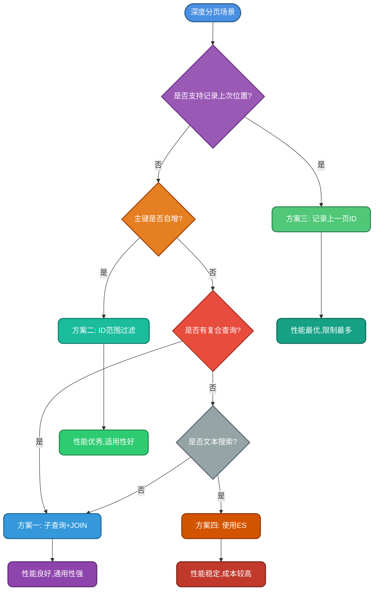

## LIMIT语法与基本原理

在MySQL中，`LIMIT`关键字用于限制查询结果返回的记录数量，它通过控制结果集的返回范围来提升查询效率。`LIMIT`支持单参数和双参数两种使用方式。

### 基本语法格式

```sql
-- 返回前N条记录
SELECT * FROM products LIMIT 10;

-- 从指定位置开始返回N条记录
SELECT * FROM products LIMIT 100, 20;
```

第一种形式返回结果集的前10条记录，第二种形式表示跳过前100条记录，从第101条开始返回20条数据。

### LIMIT的执行时机

在SQL语句的执行过程中，`LIMIT`是在最后阶段执行的，具体的执行顺序如下：


由于`LIMIT`在最后执行，因此它是对已经完成筛选、分组、排序等操作后的最终结果集进行限制，确保返回的数据已经过完整处理。

### LIMIT的执行过程

对于形如`LIMIT 10000, 100`的查询，MySQL的执行过程如下：



这个过程说明，MySQL需要先检索所有符合条件的数据（10000+100条），然后丢弃前面的10000条，最后返回需要的100条。这也解释了为什么偏移量越大，查询性能越差。

### 为什么不直接跳过前面的数据

很多人会疑惑，为什么MySQL不直接跳过前面的数据，而要全部查询后再丢弃？主要原因如下：

**确保排序的正确性**：当查询包含`ORDER BY`子句时，必须先对整个结果集进行排序，才能确定哪些记录应该被跳过。如果不进行完整排序，就无法准确知道前10000条是哪些数据。

**维护数据一致性**：即使没有显式的`ORDER BY`，MySQL也需要按照某种顺序读取数据，这个顺序可能基于存储引擎的物理存储顺序或索引顺序，必须完整扫描才能保证结果的一致性。

## LIMIT性能优化机制

虽然`LIMIT`在深度分页时性能较差，但MySQL针对`LIMIT`实现了多项优化策略，这些优化在不使用`HAVING`子句的情况下会自动生效。

### 索引优先策略

当查询仅返回少量记录时，MySQL会优先考虑使用索引，而不是执行全表扫描。

```sql
-- MySQL可能选择索引扫描
SELECT * FROM orders WHERE status = 'pending' LIMIT 10;
```

由于索引本身具有天然的有序性，这样可以在扫描时直接按照索引顺序进行，大幅减少读取和排序的开销。

### ORDER BY早停优化

当`LIMIT row_count`与`ORDER BY`结合使用时，MySQL会采用早停策略：

```sql
SELECT * FROM transactions 
ORDER BY created_time DESC 
LIMIT 50;
```

执行流程优化：



**重要区分**：这里需要注意两种不同的使用场景：

- **LIMIT row_count**：如`LIMIT 50`，MySQL在找到前50条排序结果后立即停止
- **LIMIT offset, row_count**：如`LIMIT 10000, 50`，MySQL必须对整个结果集完成排序，然后跳过前10000条

### DISTINCT早停优化

当`LIMIT row_count`与`DISTINCT`结合使用时，MySQL在找到指定数量的唯一行后立即停止：

```sql
SELECT DISTINCT category FROM products LIMIT 20;
```

一旦找到20个不同的分类，查询就会终止，无需扫描整个表。

### 空结果集快速检测

`LIMIT 0`可以快速返回空结果集，这在验证查询语句有效性时非常有用：

```sql
-- 用于检测查询是否有效，不返回实际数据
SELECT * FROM inventory WHERE warehouse_id = 5 LIMIT 0;
```

### 内存排序优化

当`ORDER BY`无法使用索引，但查询包含`LIMIT`子句时，优化器可能避免使用磁盘临时文件，而是使用内存中的排序操作：

```sql
-- 如果结果集较小，可能使用内存排序
SELECT * FROM logs 
WHERE log_level = 'ERROR' 
ORDER BY log_message 
LIMIT 100;
```

## ORDER BY与LIMIT的数据重复问题

### 问题现象

在使用`LIMIT`配合`ORDER BY`进行分页查询时，可能会遇到一个奇怪的现象：同一条SQL语句，多次执行得到的结果可能不同，在分页场景下，同一条记录可能出现在不同的页中。

```sql
-- 第一次执行
SELECT * FROM reviews ORDER BY score LIMIT 10, 5;
-- 结果：id为 23, 45, 67, 89, 12

-- 第二次执行（数据未变化）
SELECT * FROM reviews ORDER BY score LIMIT 10, 5;
-- 结果：id为 45, 23, 89, 67, 12  -- 顺序发生变化
```

### 问题根源

这个问题的根本原因在于MySQL的实现机制。根据MySQL官方文档：

> If multiple rows have identical values in the ORDER BY columns, the server is free to return those rows in any order, and may do so differently depending on the overall execution plan.

**当`ORDER BY`的列中存在多个相同值的行时，MySQL可以自由地以任何顺序返回这些行，并且根据执行计划的不同可能返回不同的顺序。**



### 解决方案

要解决这个问题，需要确保排序字段的组合具有唯一性。最佳实践是在`ORDER BY`中增加主键或唯一索引字段：

```sql
-- 问题SQL：评分相同时顺序不确定
SELECT * FROM reviews ORDER BY score LIMIT 10, 5;

-- 优化SQL：增加主键保证顺序确定性
SELECT * FROM reviews ORDER BY score, id LIMIT 10, 5;
```

**示例对比**：

```sql
-- 原始数据
mysql> SELECT * FROM reviews ORDER BY score;
+----+-------+---------+
| id | score | content |
+----+-------+---------+
|  3 |   4.5 | Good    |
|  7 |   4.5 | Nice    |
|  2 |   4.8 | Great   |
|  5 |   4.8 | Perfect |
|  9 |   4.8 | Amazing |
| 11 |   5.0 | Excellent|
+----+-------+---------+

-- 不确定的分页结果
mysql> SELECT * FROM reviews ORDER BY score LIMIT 3;
-- 第一次可能返回：id 3, 7, 5
-- 第二次可能返回：id 7, 3, 2

-- 确定的分页结果
mysql> SELECT * FROM reviews ORDER BY score, id LIMIT 3;
-- 每次都返回：id 3, 7, 2
```

通过添加唯一性字段（如主键ID），可以确保即使评分相同，记录也会按照ID的顺序排列，从而保证每次查询结果的一致性。

## 深度分页问题与优化方案

### 什么是深度分页

深度分页是指在数据库查询中，访问分页结果集的后面部分（即深层页码）时遇到的性能问题。

**性能对比示例**：

```sql
-- 浅分页：性能良好
SELECT * FROM products LIMIT 0, 100;  -- 耗时约10ms

-- 深度分页：性能显著下降
SELECT * FROM products LIMIT 10000000, 100;  -- 耗时可能达到数秒
```

对于包含数百万条记录的表，当用户请求第10000页数据（假设每页显示10条）时，SQL语句为`LIMIT 99990, 10`，数据库必须先扫描前99990条记录，才能返回第10000页的10条数据，这会导致严重的性能问题。

**起始位置计算公式**：
- 起始ID = (页数 - 1) × 每页项目数 + 1
- 第1页：起始ID = 1，结束ID = 10
- 第2页：起始ID = 11，结束ID = 20
- 第10000页：起始ID = 99991，结束ID = 100000

### 优化方案一：子查询与JOIN优化

**核心思想**：先通过覆盖索引查询出主键ID，然后再关联查询完整数据，减少回表次数。

```sql
-- 原始低效SQL
SELECT product_id, product_name, price, description 
FROM products 
WHERE category = 'Electronics' 
LIMIT 1000000, 10;

-- 优化后的SQL
SELECT p.product_id, p.product_name, p.price, p.description
FROM products p
INNER JOIN (
    SELECT product_id
    FROM products
    WHERE category = 'Electronics'
    ORDER BY product_id
    LIMIT 1000000, 10
) AS sub ON p.product_id = sub.product_id;
```

**优化原理**：



在category字段有索引的情况下，子查询中仅查询ID不需要回表。当查询出需要的10个ID后，基于主键ID查询不仅速度快，而且查询的数据量也很少（仅10条）。

### 优化方案二：子查询与ID范围过滤

**核心思想**：通过子查询获取起始ID，然后使用范围查询替代偏移量。

```sql
-- 优化SQL
SELECT product_id, product_name, price, description
FROM products
WHERE category = 'Electronics'
  AND product_id >= (
      SELECT product_id 
      FROM products 
      WHERE category = 'Electronics' 
      ORDER BY product_id 
      LIMIT 1000000, 1
  )
ORDER BY product_id
LIMIT 10;
```

**注意事项**：这个方案要求主键必须是自增的，否则可能出现数据遗漏。

**性能对比**：

| 方案 | 扫描行数 | 回表次数 | 耗时 |
|------|----------|----------|------|
| 原始LIMIT | 1000010行 | 1000010次 | 5000ms |
| 子查询+JOIN | 1000010行(索引) | 10次 | 800ms |
| ID范围过滤 | 1000001行(索引) + 10行 | 10次 | 750ms |

### 优化方案三：记录上一页最大ID

**核心思想**：利用上一页的最后一条记录的ID作为下一页查询的起点，避免使用偏移量。

```sql
-- 第一页
SELECT product_id, product_name, price 
FROM products 
WHERE category = 'Electronics' 
ORDER BY product_id 
LIMIT 10;
-- 返回结果，最大ID为100

-- 第二页（记住上一页的最大ID）
SELECT product_id, product_name, price 
FROM products 
WHERE category = 'Electronics' 
  AND product_id > 100
ORDER BY product_id 
LIMIT 10;
-- 返回结果，最大ID为210

-- 第三页
SELECT product_id, product_name, price 
FROM products 
WHERE category = 'Electronics' 
  AND product_id > 210
ORDER BY product_id 
LIMIT 10;
```

**方案优势**：
- 查询速度稳定，不受页码深度影响
- 充分利用主键索引，避免大范围扫描
- 实现简单，易于维护

**适用场景**：
- 支持"下一页"导航的应用
- 移动端上拉加载更多
- 数据流式展示场景

**局限性**：
- 不支持随机跳转到指定页码
- 无法实现"上一页"功能（除非同时记录最小ID）
- 主键必须是连续且有序的

### 优化方案四：使用搜索引擎

对于基于文本内容的复杂搜索场景，可以使用Elasticsearch等全文搜索引擎来优化深度分页性能。

```java
// Elasticsearch深度分页示例
SearchRequest searchRequest = new SearchRequest("products");
SearchSourceBuilder sourceBuilder = new SearchSourceBuilder();
sourceBuilder.query(QueryBuilders.matchQuery("category", "Electronics"));
sourceBuilder.from(1000000);  // 偏移量
sourceBuilder.size(10);       // 每页大小

// 使用search_after进行深度分页优化
sourceBuilder.searchAfter(new Object[]{lastProductId});
sourceBuilder.size(10);
```

**Elasticsearch优势**：
- 针对深度分页有scroll API和search_after API
- 分布式架构，性能优于单机MySQL
- 原生支持全文检索和复杂查询

**注意事项**：
- Elasticsearch也存在深度分页问题，但影响相对较小
- 需要维护数据同步机制
- 增加了系统复杂度和维护成本

### 深度分页优化方案对比



## 最佳实践建议

### 分页查询设计原则

1. **避免深度分页**：在产品设计上限制最大页码，引导用户使用搜索或筛选功能
2. **优先使用游标分页**：对于支持"下一页"的场景，采用基于ID的游标分页
3. **合理设置每页大小**：通常建议10-50条，避免单页数据过多
4. **确保排序唯一性**：ORDER BY必须包含唯一性字段，避免数据重复

### 索引优化建议

```sql
-- 为分页查询创建合适的索引
CREATE INDEX idx_category_id ON products(category, product_id);

-- 覆盖索引优化深度分页
CREATE INDEX idx_category_id_name ON products(category, product_id, product_name);
```

### 业务层面优化

1. **限制深度分页访问**：超过一定页数后，提示用户优化搜索条件
2. **使用缓存**：对热门数据的分页结果进行缓存
3. **异步加载**：采用滚动加载替代传统分页
4. **数据归档**：将历史数据归档，减少活跃表的数据量

通过合理运用这些优化策略，可以有效解决MySQL分页查询的性能问题，提升系统的整体响应速度和用户体验。
