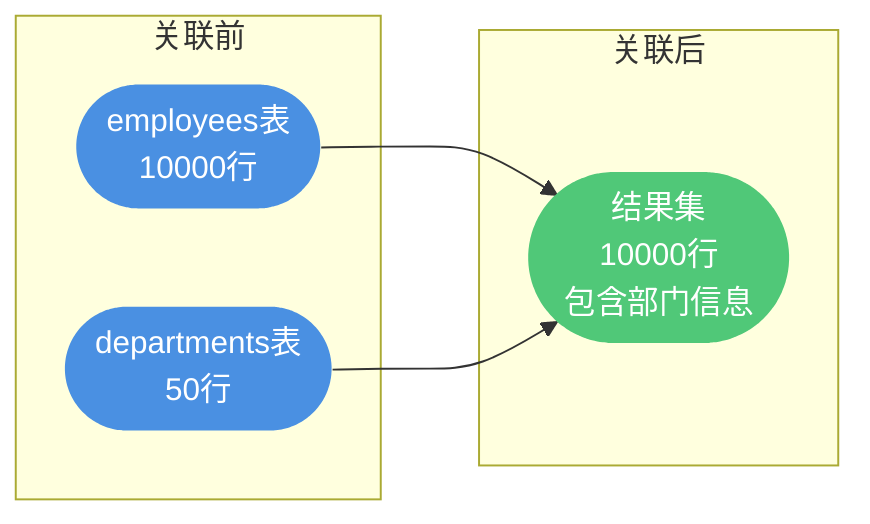

## MySQL 基础架构概览

MySQL 作为最流行的关系型数据库之一,采用了经典的分层架构设计。理解 MySQL 的内部架构,有助于我们深入理解 SQL 语句的执行原理,从而编写出更高效的数据库应用。

### 核心组件分层

MySQL 的架构可以分为两个主要层次:**Server 层**和**存储引擎层**。


**Server 层**包含了 MySQL 的核心功能组件:

- **连接器**:负责客户端连接管理、身份验证和权限控制
- **查询缓存**:缓存 SELECT 查询结果(MySQL 8.0 已废弃)
- **分析器**:对 SQL 语句进行词法和语法解析
- **优化器**:生成最优的查询执行计划
- **执行器**:调用存储引擎接口执行 SQL
- **binlog**:记录所有数据变更操作的二进制日志

**存储引擎层**负责数据的实际存储和读取,采用可插拔式架构,支持多种存储引擎。最常用的 InnoDB 引擎自 MySQL 5.5 起成为默认引擎,它拥有独立的 redo log(重做日志)模块。

## Server 层组件详解

### 连接器

连接器是 MySQL 的"门卫",负责与客户端建立连接、进行身份认证和权限校验。

当客户端发起连接请求时,连接器会执行以下操作:

1. **身份验证**:校验用户名和密码是否正确
2. **权限查询**:从权限表中读取该用户的所有权限信息
3. **权限缓存**:将权限信息缓存在连接中


**重要特性**:连接建立后,即使管理员修改了该用户的权限,也不会影响当前连接。只有重新建立连接,才会使用新的权限设置。

### 查询缓存(已废弃)

MySQL 8.0 之前,查询缓存会以 Key-Value 形式缓存 SELECT 语句及其结果集:

- **Key**:查询语句的文本
- **Value**:查询结果集

虽然看似能提升性能,但查询缓存在实际应用中问题较多:

1. **失效频繁**:对表的任何更新操作都会清空该表的所有查询缓存
2. **命中率低**:查询语句必须完全相同才能命中缓存
3. **维护成本高**:缓存的维护和失效处理消耗较多资源

因此,MySQL 8.0 官方直接移除了查询缓存功能。

### 分析器

当 SQL 语句到达分析器后,会经历两个关键步骤:

**第一步:词法分析**

将 SQL 语句拆解为多个词法单元(Token),识别出关键字、表名、字段名、条件等元素。

```sql
SELECT product_name, price 
FROM products 
WHERE category = 'electronics' AND price > 500;
```

词法分析会识别出:
- 关键字:`SELECT`, `FROM`, `WHERE`, `AND`
- 表名:`products`
- 字段名:`product_name`, `price`, `category`
- 条件:`category = 'electronics'`, `price > 500`

**第二步:语法分析**

根据 MySQL 语法规则,检查 SQL 语句是否符合语法规范。如果语法错误,会直接返回错误信息。


### 优化器

优化器负责选择最优的执行方案。即使语法正确的 SQL,也可能有多种执行方式,优化器会根据成本模型选择效率最高的方案。

优化器主要解决以下问题:

1. **索引选择**:当表有多个索引可用时,选择哪个索引?
2. **关联顺序**:多表 JOIN 时,以什么顺序关联效率最高?
3. **条件下推**:是否可以将过滤条件提前执行?

**示例**:查询订单管理系统中的数据

```sql
SELECT * FROM orders 
WHERE customer_id = 10001 AND order_date = '2024-11-20';
```

假设 `customer_id` 和 `order_date` 都建有索引,优化器可能有两种方案:

- **方案 A**:先通过 customer_id 索引找到用户的所有订单,再过滤日期
- **方案 B**:先通过 order_date 索引找到当天的所有订单,再过滤用户

优化器会根据统计信息(如索引选择性、数据分布)选择成本更低的方案。


### 执行器

执行器是真正执行 SQL 的组件,主要工作流程:

1. **权限校验**:再次检查用户是否有操作该表的权限
2. **调用引擎接口**:根据执行计划调用存储引擎的读写接口
3. **返回结果**:将存储引擎返回的数据传递给客户端

## SQL 语句执行流程分析

### 查询语句执行流程

以一个实际的查询为例:

```sql
SELECT product_name, stock_quantity 
FROM inventory 
WHERE warehouse_id = 'WH-001' AND stock_quantity > 100;
```

完整的执行流程如下:


### 更新语句执行流程

更新操作涉及日志模块,执行流程更加复杂。以修改库存数量为例:

```sql
UPDATE inventory 
SET stock_quantity = 150 
WHERE product_id = 'PROD-8888';
```

执行流程包含关键的**两阶段提交**机制:


**两阶段提交的必要性**:

MySQL 同时维护两种日志:
- **redo log**(InnoDB 引擎独有):用于崩溃恢复,保证事务持久性
- **binlog**(Server 层):用于主从复制和数据备份

如果不使用两阶段提交,可能出现数据不一致:

**场景 1:先写 redo log,再写 binlog**

1. redo log 写入成功并提交
2. 系统崩溃,binlog 未写入
3. 重启后通过 redo log 恢复了数据
4. 但 binlog 中没有这条记录,导致主从数据不一致

**场景 2:先写 binlog,再写 redo log**

1. binlog 写入成功
2. 系统崩溃,redo log 未写入
3. 重启后本机无法恢复这条数据
4. 但 binlog 有记录,导致主从数据不一致

**两阶段提交的容错处理**:


这种设计确保了即使在系统崩溃的情况下,也能保证 redo log 和 binlog 的一致性。

## SQL 查询语句的执行顺序

在了解了 MySQL 的整体架构后,我们来深入分析一个复杂 SQL 查询语句的逗辑执行顺序。理解这个顺序有助于我们编写更高效的 SQL 语句。

### 典型查询语句示例

以下是一个包含多个子句的典型查询语句:

```sql
-- 查找薄水超过50000且员工人数超过10人的前5个部门
SELECT dept_name, COUNT(*) AS employee_count
FROM employees
JOIN departments ON employees.dept_id = departments.id
WHERE employees.salary > 50000
GROUP BY departments.dept_name
HAVING COUNT(*) > 10
ORDER BY dept_name
LIMIT 5;
```

这个 SQL 包含了 SELECT、FROM、JOIN、WHERE、GROUP BY、HAVING、ORDER BY 和 LIMIT 多个子句。

### 逗辑执行顺序

需要注意的是,这里讲的是**逗辑执行顺序**,实际的物理执行可能会有所不同。数据库优化器会根据统计信息、索引、查询类型等因素优化执行计划。


#### 步骤1: FROM - 确定数据源

首先识别查询中涉及的所有表。

```sql
-- 识别数据源表
FROM employees  -- 主表: 员工表
```

**作用**: 确定查询的基础数据来源。

#### 步骤2: JOIN - 执行表关联

根据 FROM 子句中的表,执行 JOIN 操作。如果有多个 JOIN,数据库会根据内部算法和统计信息确定 JOIN 的顺序。

```sql
-- 关联部门表
JOIN departments ON employees.dept_id = departments.id
```



**作用**: 将多表数据按照关联条件合并。

#### 步骤3: WHERE - 行级过滤

对 JOIN 操作的结果应用 WHERE 中的过滤条件,排除不符合条件的行。

```sql
-- 过滤薄水低于50000的员工
WHERE employees.salary > 50000
```


**作用**: 在分组前过滤掉不需要的数据,减少后续处理量。

#### 步骤4: GROUP BY - 数据分组

如果查询包含 GROUP BY 子句,此时对数据进行分组。分组操作通常在 WHERE 条件过滤之后进行。

```sql
-- 按部门名称分组
GROUP BY departments.dept_name
```


**作用**: 将数据按照指定字段分组,为聚合计算做准备。

#### 步骤5: HAVING - 分组过滤

如果有 HAVING 子句,它会在 GROUP BY 之后应用。HAVING 用于筛选分组后的数据集。

```sql
-- 筛选出员工人数超过10人的部门
HAVING COUNT(*) > 10
```


**对比**:
- **WHERE**: 在分组前过滤行,不能使用聚合函数
- **HAVING**: 在分组后过滤组,可以使用聚合函数

#### 步骤6: SELECT - 选择列

选择特定的列。实际上,所需列的数据可能在执行过程的早期就已经被获取,但在此阶段会根据 SELECT 子句确定最终输出的列。

```sql
-- 选择部门名称和员工数量
SELECT dept_name, COUNT(*) AS employee_count
```

**作用**: 确定最终输出的字段和计算结果。

#### 步骤7: DISTINCT - 去除重复

如果指定了 DISTINCT 关键字,此时会去除重复的行。

```sql
-- 本例中未使用 DISTINCT
-- 如果使用: SELECT DISTINCT dept_name, COUNT(*) ...
```


**作用**: 保证结果集中每一行都是唯一的。

#### 步骤8: ORDER BY - 排序

如果查询指定了 ORDER BY,现在将对结果进行排序。

```sql
-- 按部门名称排序
ORDER BY dept_name
```


**注意**: 如果使用了 GROUP BY,MySQL 可能会利用这个排序作为 GROUP BY 的一部分。

#### 步骤9: LIMIT - 限制结果集

最后,应用 LIMIT 子句来限制返回的行数。这通常是整个查询过程的最后一步。

```sql
-- 只返回前5条记录
LIMIT 5;
```


**作用**: 控制返回结果的数量,常用于分页查询。

### 完整执行流程示例

以前面的 SQL 为例,完整执行流程如下:


**执行过程详解**:

- **FROM**: 确定数据源为 `employees` 和 `departments` 两张表
- **JOIN**: 根据 `employees.dept_id = departments.id` 关联两表
- **WHERE**: 过滤出薄水超过 50000 的员工记录
- **GROUP BY**: 按照 `dept_name` 对结果集进行分组
- **HAVING**: 筛选出员工人数超过 10 人的部门
- **SELECT**: 选择要显示的列:`dept_name` 和 `COUNT(*)`
- **ORDER BY**: 按照 `dept_name` 对结果集进行排序
- **LIMIT**: 只返回前 5 条记录

### 关键要点总结

**1. WHERE vs HAVING 的区别**

```sql
-- WHERE: 在分组前过滤,不能使用聚合函数
WHERE salary > 50000  -- ✔️ 正确
-- WHERE COUNT(*) > 10  -- ❌ 错误

-- HAVING: 在分组后过滤,可以使用聚合函数
HAVING COUNT(*) > 10  -- ✔️ 正确
```

**2. 执行顺序对性能的影响**

```sql
-- 不推荐: WHERE 在 GROUP BY 之后会影响性能
SELECT dept_name, COUNT(*)
FROM employees
GROUP BY dept_name
HAVING salary > 50000;  -- salary 应该在 WHERE 中过滤

-- 推荐: 在 WHERE 中尽早过滤
SELECT dept_name, COUNT(*)
FROM employees
WHERE salary > 50000  -- 提前过滤,减少分组数据量
GROUP BY dept_name;
```

**3. 逻辑顺序 vs 物理执行**

虽然逻辑顾序是固定的,但 MySQL 优化器会根据以下因素调整物理执行:

- 索引可用性
- 表统计信息
- JOIN 算法选择(Nested Loop, Hash Join, Merge Join)
- 数据分布情况

理解这些执行顺序,可以帮助我们:

- 编写更高效的 SQL 语句
- 合理使用 WHERE 和 HAVING
- 优化查询性能
- 理解查询计划(EXPLAIN)

## 总结

MySQL 的分层架构设计清晰,职责分明:

1. **Server 层**:处理 SQL 解析、优化、执行等通用逻辑
   - 连接器负责连接管理和权限控制
   - 分析器进行词法和语法解析
   - 优化器生成最优执行计划
   - 执行器调用存储引擎接口

2. **存储引擎层**:负责数据的实际存储和读取
   - InnoDB 支持事务和行级锁,是默认引擎
   - 采用可插拔架构,支持多种存储引擎

3. **日志系统**:
   - binlog 用于归档和主从复制
   - redo log 用于崩溃恢复
   - 两阶段提交保证日志一致性

理解这些核心原理,能够帮助我们:
- 编写更高效的 SQL 语句
- 合理设计索引策略
- 排查性能问题
- 理解事务和数据安全机制
