## 主键设计原则

主键是数据表中唯一标识每条记录的字段,在 MySQL 的 InnoDB 存储引擎中具有特殊意义。合理的主键设计直接影响数据库的查询性能、存储效率和维护成本。

### 主键是否必须自增?

**主键不是必须自增的**,你可以选择任何数据类型作为主键,如字符串、UUID、复合主键等。但实践中,绝大多数场景推荐使用自增整数作为主键。

```sql
-- 方案1: 自增整数主键(推荐)
CREATE TABLE products (
    id BIGINT UNSIGNED PRIMARY KEY AUTO_INCREMENT,
    product_code VARCHAR(50) UNIQUE NOT NULL,
    name VARCHAR(200) NOT NULL,
    price DECIMAL(10, 2) NOT NULL
);

-- 方案2: 字符串主键(不推荐)
CREATE TABLE products_v2 (
    product_code VARCHAR(50) PRIMARY KEY,
    name VARCHAR(200) NOT NULL,
    price DECIMAL(10, 2) NOT NULL
);

-- 方案3: UUID主键(特殊场景)
CREATE TABLE products_v3 (
    id CHAR(36) PRIMARY KEY,
    product_code VARCHAR(50) UNIQUE NOT NULL,
    name VARCHAR(200) NOT NULL,
    price DECIMAL(10, 2) NOT NULL
);
```

### 自增主键的优势

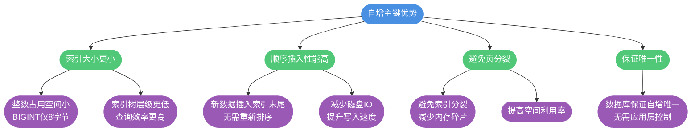

**详细说明**:

1. **索引大小优化**: BIGINT 主键仅占 8 字节,而 UUID 字符串需要 36 字节,索引体积相差 4 倍以上
2. **顺序写入**: InnoDB 按主键顺序组织数据,自增主键确保新数据追加到末尾,避免随机 IO
3. **页分裂**: 非顺序主键(如 UUID)插入时可能在中间位置,触发页分裂,降低性能

### 页分裂与页合并

InnoDB 以页(Page)为单位管理数据,默认页大小为 16KB。当使用非顺序主键时,可能触发页分裂:


## 自增主键的存储机制

### 自增值保存位置

不同存储引擎对自增值的保存策略不同:

| 存储引擎 | 自增值保存位置 | 持久化 |
|---------|--------------|--------|
| MyISAM | 数据文件 | 是 |
| InnoDB(MySQL 5.7) | 内存 | 否(重启后重新计算) |
| InnoDB(MySQL 8.0+) | redo log | 是(支持持久化) |

```sql
-- 查看表定义中的自增值
SHOW CREATE TABLE products;

-- 结果示例
-- AUTO_INCREMENT=1001 表示下一个自增值是 1001
```

### MySQL 8.0 前后的差异

**MySQL 5.7 及之前**:

```sql
-- 插入数据
INSERT INTO products (product_code, name, price) VALUES ('P001', 'Laptop', 5999.00);
-- AUTO_INCREMENT = 2

-- 删除最大ID的记录
DELETE FROM products WHERE id = 1;

-- 重启 MySQL 服务
-- 重启后 AUTO_INCREMENT 会重新计算为 1(因为表中无数据)
```

**MySQL 8.0+**:

自增值变更被记录到 redo log,重启后能够恢复到重启前的值,避免了主键重复的问题。

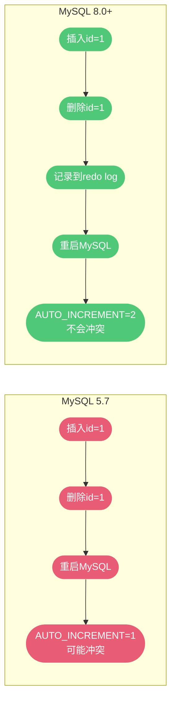

## 自增值不连续的场景

虽然使用了自增主键,但实际存储的 ID 可能并不连续。以下是几种常见原因:

### 场景1: 自增参数配置

MySQL 提供两个参数控制自增行为:

- `auto_increment_offset`: 自增起始值(默认 1)
- `auto_increment_increment`: 自增步长(默认 1)

```sql
-- 双主复制场景,避免主键冲突
-- 主库1: 奇数ID
SET auto_increment_offset = 1;
SET auto_increment_increment = 2;  -- 1, 3, 5, 7...

-- 主库2: 偶数ID
SET auto_increment_offset = 2;
SET auto_increment_increment = 2;  -- 2, 4, 6, 8...
```

### 场景2: 唯一键冲突

```sql
-- 创建带唯一索引的表
CREATE TABLE users (
    id BIGINT UNSIGNED PRIMARY KEY AUTO_INCREMENT,
    email VARCHAR(100) UNIQUE NOT NULL,
    username VARCHAR(50) NOT NULL
);

-- 插入第一条记录
INSERT INTO users (email, username) VALUES ('alice@example.com', 'Alice');
-- id=1, AUTO_INCREMENT=2

-- 尝试插入重复邮箱(失败)
INSERT INTO users (email, username) VALUES ('alice@example.com', 'Alice2');
-- 报错: Duplicate entry 'alice@example.com'
-- 但 AUTO_INCREMENT 已增加到 3

-- 再次插入新记录
INSERT INTO users (email, username) VALUES ('bob@example.com', 'Bob');
-- id=3 (跳过了2)
```

**执行流程**:

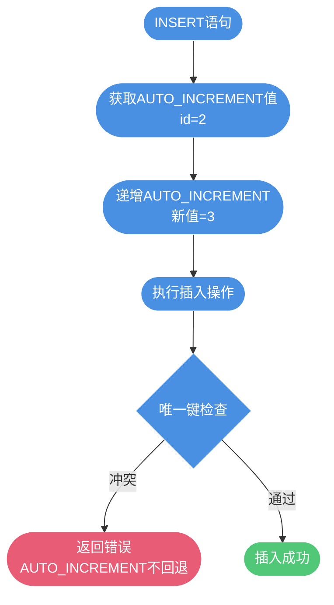

为什么不回退? 因为回退会导致并发问题:

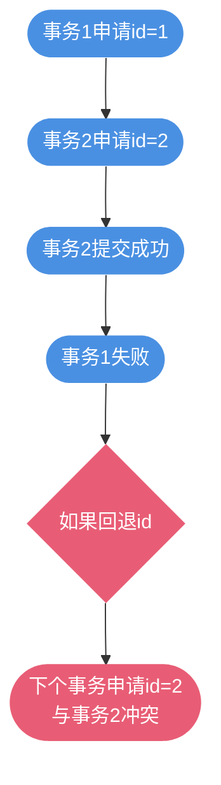

### 场景3: 事务回滚

```sql
-- 开启事务
START TRANSACTION;

-- 插入记录(假设当前 AUTO_INCREMENT=5)
INSERT INTO products (product_code, name, price) 
VALUES ('P005', 'Mouse', 99.00);
-- id=5, AUTO_INCREMENT=6

-- 回滚事务
ROLLBACK;

-- 插入新记录
INSERT INTO products (product_code, name, price) 
VALUES ('P006', 'Keyboard', 299.00);
-- id=6 (跳过了5)
```

### 场景4: 批量插入

对于 `INSERT ... SELECT`、`REPLACE ... SELECT` 和 `LOAD DATA` 等批量操作,MySQL 采用**批量申请策略**:

1. 第一次申请 1 个 ID
2. 第二次申请 2 个 ID
3. 第三次申请 4 个 ID
4. 第 N 次申请 2^(N-1) 个 ID

```sql
-- 原始表数据
SELECT * FROM products;
-- id: 1, 2, 3, 4, 5

-- 批量插入
INSERT INTO products_backup SELECT * FROM products;

-- 批量申请过程:
-- 第1次: 申请1个 -> id=1
-- 第2次: 申请2个 -> id=2,3
-- 第3次: 申请4个 -> id=4,5,6,7 (只用了4,5)
-- AUTO_INCREMENT=8 (浪费了6,7)
```


## UUID vs 自增ID 对比

### UUID 的特点

UUID(Universally Unique Identifier)是 128 位的全局唯一标识符:

```sql
-- UUID 示例
CREATE TABLE distributed_orders (
    order_id CHAR(36) PRIMARY KEY,  -- '550e8400-e29b-41d4-a716-446655440000'
    user_id BIGINT NOT NULL,
    amount DECIMAL(10, 2) NOT NULL,
    created_at DATETIME NOT NULL
);

-- 插入数据(应用层生成UUID)
INSERT INTO distributed_orders VALUES 
(UUID(), 1001, 299.00, NOW());
```

**UUID 优势**:

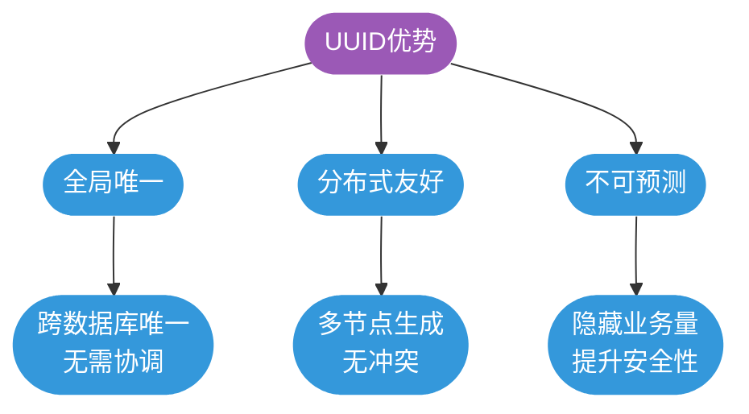

**UUID 劣势**:

1. **存储空间大**: 36 字节(字符串形式)或 16 字节(二进制形式)
2. **索引效率低**: 
   - 索引树占用空间大,缓存命中率低
   - 随机插入导致频繁页分裂
3. **不支持范围查询**: UUID 无序,无法按 ID 范围分页
4. **不便于展示**: 对用户不友好

```sql
-- UUID 导致的性能问题示例
-- 索引大小对比(假设100万条记录)
-- BIGINT主键索引: 约 8MB
-- UUID(CHAR36)主键索引: 约 36MB,差距4.5倍
```

### 自增ID 的特点

**优势**:
- 占用空间小(BIGINT 仅 8 字节)
- 索引效率高(B+树层级低)
- 支持范围查询和分页
- 便于展示和排序

**劣势**:
- 分库分表需要额外方案(如雪花算法)
- ID 可预测,存在安全隐患
- 可能用尽(BIGINT UNSIGNED 最大 2^64-1)

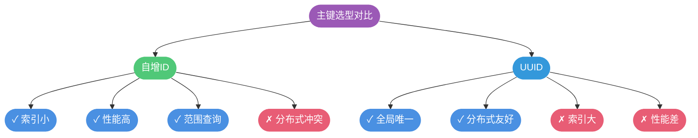

### 推荐方案

**单库场景**: 优先使用自增 BIGINT

```sql
CREATE TABLE orders (
    id BIGINT UNSIGNED PRIMARY KEY AUTO_INCREMENT,
    order_no VARCHAR(32) UNIQUE NOT NULL,  -- 业务订单号
    user_id BIGINT NOT NULL,
    amount DECIMAL(10, 2) NOT NULL
);
```

**分布式场景**: 使用分布式ID生成方案

```sql
-- 雪花算法: 64位整数,包含时间戳+机器ID+序列号
CREATE TABLE orders (
    id BIGINT PRIMARY KEY,  -- 应用层生成(雪花ID)
    order_no VARCHAR(32) UNIQUE NOT NULL,
    user_id BIGINT NOT NULL,
    amount DECIMAL(10, 2) NOT NULL
);
```

## 如果没有定义主键

InnoDB 要求每个表必须有主键,如果用户未定义,InnoDB 会自动处理:

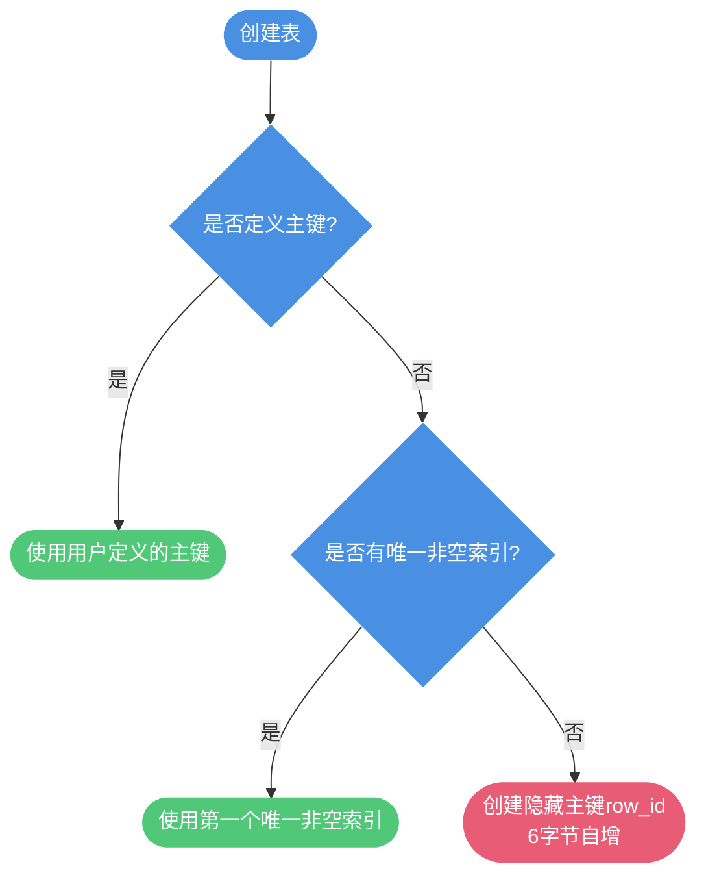

**隐藏主键的问题**:
- 用户无法直接使用
- 全局共享计数器,可能溢出
- 占用额外空间

**建议**: 始终显式定义主键,避免使用隐藏主键。

## 自增主键用完了怎么办

自增主键虽然取值范围巨大,但在极端场景下仍然可能耗尽。不同类型的主键在耗尽时的表现和处理方式完全不同。

### 自增主键的类型与范围

MySQL 中的自增主键有两种形式:

**1. 显式定义的自增主键**

由开发者明确指定 `AUTO_INCREMENT` 属性的主键。

```sql
-- 常见类型及其范围
CREATE TABLE orders (
    id INT UNSIGNED PRIMARY KEY AUTO_INCREMENT,        -- 0 到 4,294,967,295
    -- id BIGINT UNSIGNED PRIMARY KEY AUTO_INCREMENT,  -- 0 到 18,446,744,073,709,551,615
    order_no VARCHAR(32) NOT NULL
);
```

| 类型 | 有符号范围 | 无符号范围 | 推荐 |
|------|-----------|-----------|------|
| INT | -2,147,483,648 到 2,147,483,647 | 0 到 4,294,967,295 | 不推荐 |
| BIGINT | -9,223,372,036,854,775,808 到 9,223,372,036,854,775,807 | 0 到 18,446,744,073,709,551,615 | ✔️ 推荐 |

**2. 隐式的 row_id 主键**

当表没有显式定义主键时,InnoDB 自动创建的隐藏主键。

```sql
-- 没有显式主键的表
CREATE TABLE logs (
    log_time DATETIME,
    log_message TEXT
);  -- InnoDB 会自动创建 6 字节的 row_id
```

**row_id 特点**:
- 长度: 6 字节 (48 位)
- 范围: 0 到 2^48 - 1 (281,474,976,710,655)
- 全局共享: 所有使用 row_id 的表共享同一个计数器

### 显式主键用完的表现

当显式定义的自增 ID 达到上限时,再次申请 ID 会得到最大值,导致**主键冲突错误**。

```sql
-- 演示: INT UNSIGNED 用完的情况
CREATE TABLE test_int_limit (
    id INT UNSIGNED PRIMARY KEY AUTO_INCREMENT,
    data VARCHAR(50)
) ENGINE=InnoDB;

-- 假设当前 AUTO_INCREMENT 已达到 4294967295
-- 再次插入数据
INSERT INTO test_int_limit (data) VALUES ('new data');

-- 错误信息:
-- ERROR 1062 (23000): Duplicate entry '4294967295' for key 'PRIMARY'
```

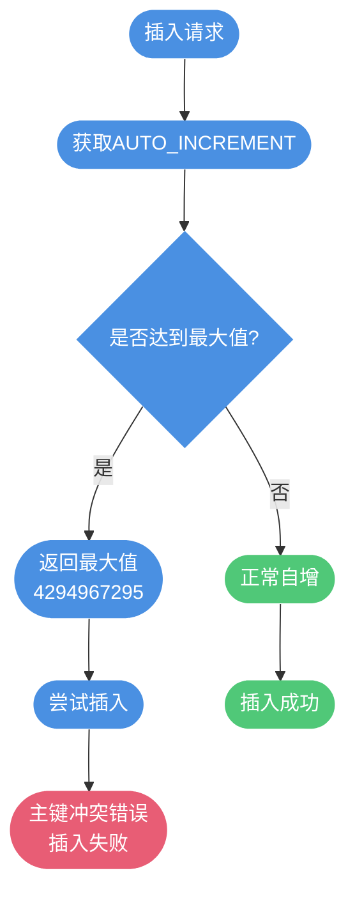

**优点**: 错误可感知,不会造成数据损坏。

### 隐藏 row_id 用完的表现

当 row_id 达到上限时,会**从 0 重新开始**,导致数据被默默覆盖,非常危险。

```sql
-- 没有主键的表
CREATE TABLE dangerous_logs (
    log_time DATETIME,
    log_message TEXT
) ENGINE=InnoDB;

-- 假设 row_id 已达到 281,474,976,710,655
-- 再次插入数据
INSERT INTO dangerous_logs VALUES (NOW(), 'New log entry');

-- 行为:
-- 1. row_id 从 0 重新开始
-- 2. 新数据被分配 row_id = 0
-- 3. 直接覆盖原有 row_id = 0 的数据
-- 4. 没有任何错误提示!
```

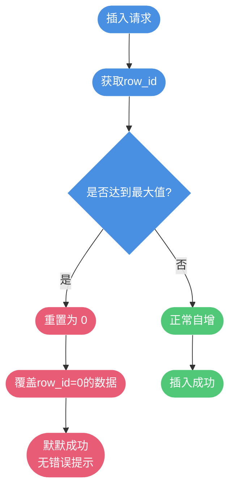

**危险性**: 数据被默默覆盖,可能很久才能发现。

### 对比总结

| 类型 | 用完后表现 | 是否报错 | 数据安全 | 推荐度 |
|------|-----------|---------|---------|--------|
| 显式自增 ID | 主键冲突错误 | ✔️ 是 | ✔️ 安全 | ✔️✔️✔️ 强烈推荐 |
| 隐藏 row_id | 覆盖历史数据 | ❌ 否 | ❌ 危险 | ❌ 禁止 |

**结论**: 必须显式定义主键,避免依赖隐藏 row_id。

### 应对策略

虽然 BIGINT UNSIGNED 的上限非常巨大,但在极端情况下仍可能耗尽。以下是几种应对方案:

#### 方案1: 历史数据归档(推荐)

将不常访问的历史数据迁移到归档表,释放主键空间。

```sql
-- 创建归档表
CREATE TABLE orders_archive (
    id BIGINT UNSIGNED PRIMARY KEY,
    order_no VARCHAR(32) NOT NULL,
    user_id BIGINT NOT NULL,
    total_amount DECIMAL(10, 2),
    created_at DATETIME NOT NULL,
    archive_time DATETIME DEFAULT CURRENT_TIMESTAMP
) ENGINE=InnoDB;

-- 按月归档旧数据
START TRANSACTION;

-- 插入到归档表
INSERT INTO orders_archive (id, order_no, user_id, total_amount, created_at)
SELECT id, order_no, user_id, total_amount, created_at
FROM orders
WHERE created_at < DATE_SUB(NOW(), INTERVAL 2 YEAR);

-- 从原表删除
DELETE FROM orders
WHERE created_at < DATE_SUB(NOW(), INTERVAL 2 YEAR);

COMMIT;

-- 定期执行归档任务,保持活跃表数据量可控
```

**优点**:
- 降低主表数据量
- 提升查询性能
- 历史数据不丢失,需要时可查询

#### 方案2: 分库分表

将数据按照业务规则拆分到多个表或数据库。

```sql
-- 按年份分表
CREATE TABLE orders_2023 (
    id BIGINT UNSIGNED PRIMARY KEY AUTO_INCREMENT,
    ...
) ENGINE=InnoDB;

CREATE TABLE orders_2024 (
    id BIGINT UNSIGNED PRIMARY KEY AUTO_INCREMENT,
    ...
) ENGINE=InnoDB;

-- 或者按用户ID范围分表
CREATE TABLE orders_0 (  -- user_id % 10 = 0
    id BIGINT UNSIGNED PRIMARY KEY AUTO_INCREMENT,
    ...
) ENGINE=InnoDB;

CREATE TABLE orders_1 (  -- user_id % 10 = 1
    id BIGINT UNSIGNED PRIMARY KEY AUTO_INCREMENT,
    ...
) ENGINE=InnoDB;
```

**优点**:
- 每个表都有独立的自增空间
- 数据分散,减轻单表压力

**缺点**:
- 增加业务复杂度
- 跨表查询较复杂

#### 方案3: 使用分布式ID生成器

当需要全局唯一ID时,使用雪花算法等分布式ID生成方案。

```sql
-- 使用雪花ID
CREATE TABLE orders (
    id BIGINT PRIMARY KEY,  -- 应用层生成雪花ID
    order_no VARCHAR(32) UNIQUE NOT NULL,
    user_id BIGINT NOT NULL,
    created_at DATETIME NOT NULL
) ENGINE=InnoDB;
```

**雪花ID结构** (64位):
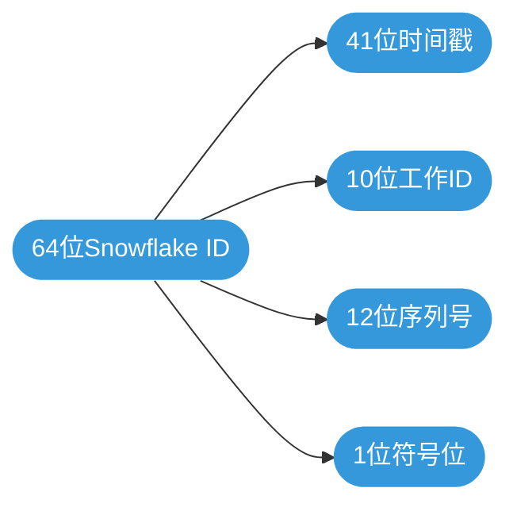

**优点**:
- 全局唯一,无冲突
- 趋势自增,有序性
- 分布式生成,高性能

#### 方案4: 重用删除的ID(不推荐)

查找已删除记录留下的空缺 ID,重新使用。

```sql
-- 查找空缺的ID范围
SELECT t1.id + 1 AS gap_start,
       (SELECT MIN(id) - 1 FROM orders t3 WHERE t3.id > t1.id) AS gap_end
FROM orders t1
WHERE NOT EXISTS (
    SELECT 1 FROM orders t2 WHERE t2.id = t1.id + 1
)
AND t1.id < (SELECT MAX(id) FROM orders)
LIMIT 10;

-- 手动指定ID插入
INSERT INTO orders (id, order_no, user_id, created_at)
VALUES (12345, 'ORD2024001', 1001, NOW());
```

**缺点**:
- 破坏ID连续性
- 增加业务复杂度
- 可能影响性能

**不推荐原因**: 破坏数据一致性,维护成本高。

#### 方案5: 使用UUID(不推荐)

改用 UUID 作为主键。

```sql
CREATE TABLE orders (
    id CHAR(36) PRIMARY KEY,  -- UUID
    order_no VARCHAR(32) NOT NULL,
    user_id BIGINT NOT NULL,
    created_at DATETIME NOT NULL
) ENGINE=InnoDB;

-- 插入数据
INSERT INTO orders (id, order_no, user_id, created_at)
VALUES (UUID(), 'ORD2024001', 1001, NOW());
```

**缺点**:
- 存储空间大(36字节 vs 8字节)
- 索引效率低
- 无序插入,频繁页分裂
- 不支持范围查询

**不推荐原因**: 性能严重下降,存储开销大。

### 最佳实践

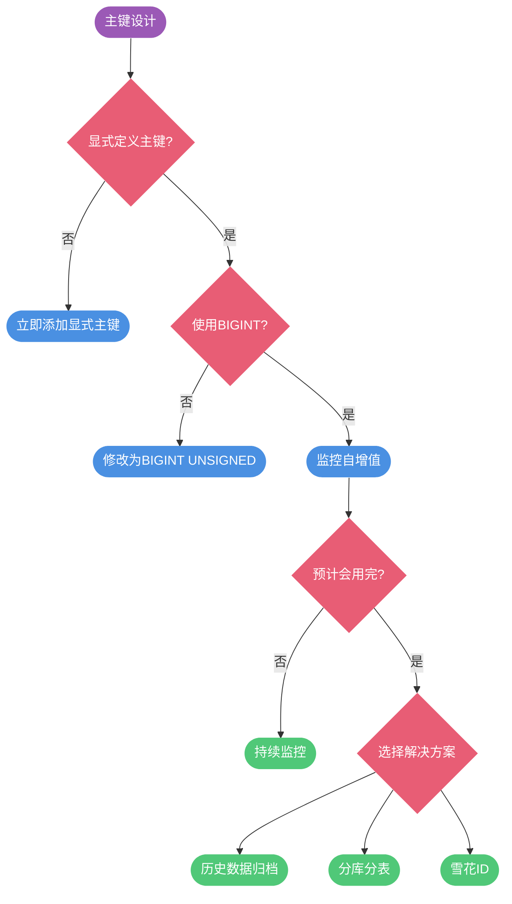

**核心建议**:

1. **始终显式定义主键**: 避免依赖 row_id
2. **优先使用 BIGINT UNSIGNED**: 18 亿亿的容量几乎不会用完
3. **监控自增值**: 定期检查 AUTO_INCREMENT 的使用情况
4. **提前规划**: 数据量大的表提前考虑归档或分表
5. **分布式场景**: 使用雪花算法生成全局唯一ID

```sql
-- 查询当前自增值使用情况
SELECT 
    TABLE_NAME,
    AUTO_INCREMENT,
    CASE 
        WHEN COLUMN_TYPE LIKE '%unsigned%' THEN 18446744073709551615
        ELSE 9223372036854775807
    END AS max_value,
    ROUND(AUTO_INCREMENT * 100.0 / 
        CASE 
            WHEN COLUMN_TYPE LIKE '%unsigned%' THEN 18446744073709551615
            ELSE 9223372036854775807
        END, 2) AS usage_percent
FROM INFORMATION_SCHEMA.TABLES t
JOIN INFORMATION_SCHEMA.COLUMNS c 
    ON t.TABLE_SCHEMA = c.TABLE_SCHEMA 
    AND t.TABLE_NAME = c.TABLE_NAME
WHERE t.TABLE_SCHEMA = 'your_database'
    AND c.COLUMN_KEY = 'PRI'
    AND c.EXTRA LIKE '%auto_increment%'
ORDER BY usage_percent DESC;
```

通过合理的主键设计和提前规划,可以有效避免自增主键用完的问题,保证系统的长期稳定运行。

## 总结

主键设计对数据库性能影响重大:

1. **推荐使用自增 BIGINT 主键**:
   - 索引小、性能高、支持范围查询
   - 单库场景的最佳选择

2. **自增值不连续的原因**:
   - 自增参数配置(步长、起始值)
   - 唯一键冲突
   - 事务回滚
   - 批量插入

3. **UUID 适用场景**:
   - 分布式系统(但推荐雪花算法)
   - 需要全局唯一且不可预测

4. **InnoDB 必须有主键**:
   - 未定义时自动选择或创建隐藏主键
   - 建议显式定义主键

合理的主键设计能够显著提升数据库的查询性能和存储效率,是数据库设计的基础。
