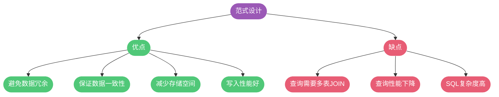
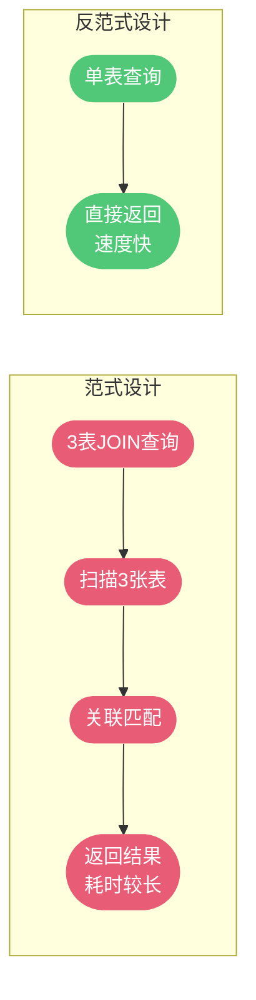
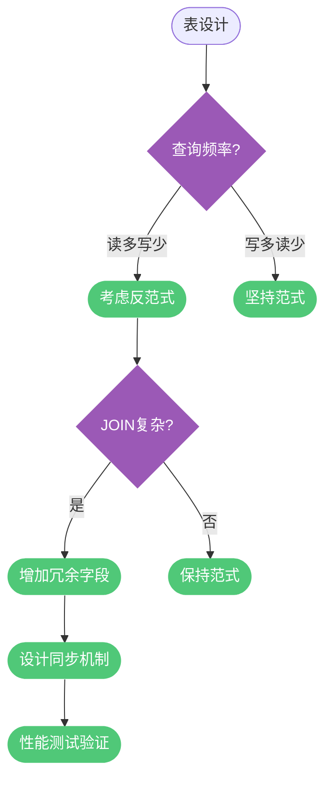
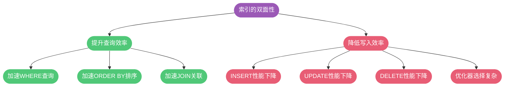
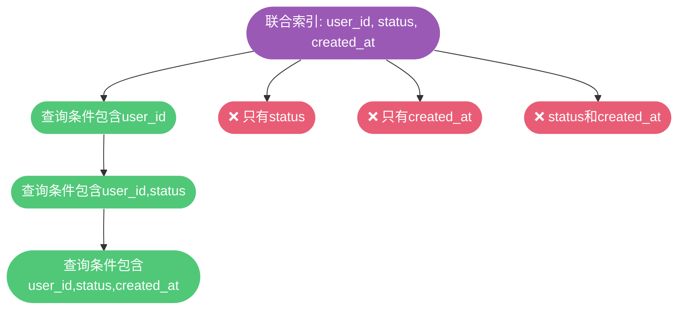

## 数据库命名与基础规范

良好的命名规范是团队协作和长期维护的基础。

### 命名规范要点

1. **统一使用小写字母和下划线**: 避免大小写敏感问题
2. **禁止使用保留关键字**: 如 `order`、`group`、`user` 等
3. **名称具有业务含义**: 见名知意,长度不超过 32 字符
4. **临时表和备份表加前缀**: `tmp_` 和 `bak_` 加日期后缀

```sql
-- 推荐命名
CREATE TABLE user_profiles (
    user_id BIGINT PRIMARY KEY,
    username VARCHAR(50) NOT NULL,
    created_at DATETIME NOT NULL
);

-- 临时表
CREATE TABLE tmp_user_import_20241120 (
    ...
);

-- 备份表
CREATE TABLE bak_user_profiles_20241120 (
    ...
);

-- 不推荐:使用关键字
-- CREATE TABLE order (...);  -- order 是关键字
-- CREATE TABLE User (...);   -- 大小写不统一
```

### 表设计基础规范

**必须使用 InnoDB 存储引擎**:

```sql
-- 明确指定存储引擎
CREATE TABLE products (
    id BIGINT PRIMARY KEY AUTO_INCREMENT,
    name VARCHAR(200) NOT NULL
) ENGINE=InnoDB DEFAULT CHARSET=utf8mb4;
```

**InnoDB 的优势**:
- 支持事务(ACID 特性)
- 支持行级锁(并发性能好)
- 支持外键约束
- 崩溃恢复能力强(redo log)

**统一使用 UTF8MB4 字符集**:

```sql
-- 数据库级别
CREATE DATABASE ecommerce 
CHARACTER SET utf8mb4 
COLLATE utf8mb4_unicode_ci;

-- 表级别
CREATE TABLE products (
    ...
) ENGINE=InnoDB DEFAULT CHARSET=utf8mb4 COLLATE=utf8mb4_unicode_ci;
```

**为什么用 utf8mb4**:
- 兼容性最好,支持全球所有语言
- 支持 Emoji 表情(utf8 不支持)
- 避免字符集转换导致的乱码和索引失效

**所有表和字段都要添加注释**:

```sql
CREATE TABLE order_items (
    id BIGINT PRIMARY KEY AUTO_INCREMENT COMMENT '主键ID',
    order_id BIGINT NOT NULL COMMENT '订单ID',
    product_id BIGINT NOT NULL COMMENT '商品ID',
    quantity INT NOT NULL COMMENT '购买数量',
    unit_price DECIMAL(10, 2) NOT NULL COMMENT '单价',
    total_price DECIMAL(10, 2) NOT NULL COMMENT '小计金额',
    created_at DATETIME NOT NULL COMMENT '创建时间'
) ENGINE=InnoDB DEFAULT CHARSET=utf8mb4 COMMENT='订单明细表';
```

### 表结构设计注意事项

**控制单表数据量**:
- 建议控制在 500 万以内
- 超过后考虑历史数据归档或分库分表

```sql
-- 订单表按月分表
CREATE TABLE orders_202401 (...);
CREATE TABLE orders_202402 (...);

-- 历史数据归档
CREATE TABLE orders_archive (...);
```

**避免预留字段**:

```sql
-- 不推荐:预留字段
CREATE TABLE users (
    id BIGINT PRIMARY KEY,
    username VARCHAR(50),
    reserve1 VARCHAR(100),  -- 含义不明
    reserve2 INT,           -- 类型不确定
    reserve3 TEXT           -- 后期修改要锁表
);

-- 推荐:按需扩展
ALTER TABLE users ADD COLUMN phone VARCHAR(20);
```

**禁止在数据库存储文件**:

```sql
-- 不推荐:存储二进制文件
CREATE TABLE product_images (
    id BIGINT PRIMARY KEY,
    product_id BIGINT,
    image_data MEDIUMBLOB  -- 严重影响性能
);

-- 推荐:存储文件路径
CREATE TABLE product_images (
    id BIGINT PRIMARY KEY,
    product_id BIGINT,
    image_url VARCHAR(500),  -- OSS URL
    created_at DATETIME
);
```

### 数据库范式与反范式设计

数据库范式是数据库设计中的一套规范,这些规范可以让数据库设计更加简洁清晰,同时更好地保证数据一致性。但在实际业务中,我们往往需要在范式设计和性能之间做出权衡。

#### 三大范式

**第一范式(1NF):属性原子性**

要求数据库表中的属性具有原子性,不可再被拆分。

```sql
-- 不符合第一范式:地址字段包含多个信息
CREATE TABLE customers (
    id BIGINT PRIMARY KEY,
    name VARCHAR(50),
    address VARCHAR(500)  -- "北京市朝阳区建国路88号SOHO现代城"
);

-- 符合第一范式:地址拆分为多个原子字段
CREATE TABLE customers (
    id BIGINT PRIMARY KEY,
    name VARCHAR(50),
    province VARCHAR(50),   -- 省份
    city VARCHAR(50),       -- 城市
    district VARCHAR(50),   -- 区县
    street VARCHAR(200),    -- 街道
    building VARCHAR(100)   -- 建筑物
);
```

**第二范式(2NF):消除部分依赖**

要求每个表必须有主键,其他字段都完全依赖于主键,不能只依赖主键的一部分(针对联合主键)。

```sql
-- 不符合第二范式:学生选课表
CREATE TABLE student_courses (
    student_id BIGINT,
    course_id BIGINT,
    student_name VARCHAR(50),  -- 只依赖student_id
    course_name VARCHAR(100),  -- 只依赖course_id
    score INT,
    PRIMARY KEY (student_id, course_id)
);

-- 符合第二范式:拆分为三张表
-- 学生表
CREATE TABLE students (
    id BIGINT PRIMARY KEY,
    name VARCHAR(50)
);

-- 课程表
CREATE TABLE courses (
    id BIGINT PRIMARY KEY,
    name VARCHAR(100)
);

-- 选课表
CREATE TABLE student_courses (
    student_id BIGINT,
    course_id BIGINT,
    score INT,
    PRIMARY KEY (student_id, course_id),
    FOREIGN KEY (student_id) REFERENCES students(id),
    FOREIGN KEY (course_id) REFERENCES courses(id)
);
```

**第三范式(3NF):消除传递依赖**

要求非主键字段之间不能存在依赖关系,所有非主键字段必须直接依赖于主键。

```sql
-- 不符合第三范式:订单表包含传递依赖
CREATE TABLE orders (
    id BIGINT PRIMARY KEY,
    order_no VARCHAR(32),
    user_id BIGINT,
    user_name VARCHAR(50),      -- 依赖于user_id,不直接依赖主键
    user_phone VARCHAR(20),     -- 依赖于user_id,不直接依赖主键
    product_id BIGINT,
    product_name VARCHAR(200),  -- 依赖于product_id,不直接依赖主键
    quantity INT
);

-- 符合第三范式:拆分关联表
CREATE TABLE orders (
    id BIGINT PRIMARY KEY,
    order_no VARCHAR(32),
    user_id BIGINT,           -- 通过外键关联users表
    product_id BIGINT,        -- 通过外键关联products表
    quantity INT,
    FOREIGN KEY (user_id) REFERENCES users(id),
    FOREIGN KEY (product_id) REFERENCES products(id)
);
```

#### 范式设计的优劣



#### 反范式设计

反范式化是一种针对遵从设计范式的数据库的性能优化策略。**反范式不等于非范式化**,反范式一定发生在满足范式设计的基础之上。

**核心思想:用空间换时间**

通过增加冗余字段,减少表关联,提升查询性能。

```sql
-- 范式设计:需要JOIN查询
SELECT o.order_no, u.username, u.phone, p.product_name
FROM orders o
JOIN users u ON o.user_id = u.id
JOIN products p ON o.product_id = p.id
WHERE o.id = 1001;

-- 反范式设计:冗余字段,无需JOIN
CREATE TABLE orders (
    id BIGINT PRIMARY KEY,
    order_no VARCHAR(32),
    user_id BIGINT,
    username VARCHAR(50),       -- 冗余字段
    user_phone VARCHAR(20),     -- 冗余字段
    product_id BIGINT,
    product_name VARCHAR(200),  -- 冗余字段
    quantity INT,
    INDEX idx_user_id (user_id),
    INDEX idx_product_id (product_id)
);

SELECT order_no, username, user_phone, product_name
FROM orders
WHERE id = 1001;  -- 单表查询,性能更好
```

**实际应用场景**:

```sql
-- 电商订单表:冗余商品快照信息
CREATE TABLE order_items (
    id BIGINT PRIMARY KEY AUTO_INCREMENT,
    order_id BIGINT NOT NULL,
    product_id BIGINT NOT NULL,
    product_name VARCHAR(200) NOT NULL,     -- 冗余:下单时商品名称
    product_image VARCHAR(500),             -- 冗余:商品图片
    product_price DECIMAL(10, 2) NOT NULL,  -- 冗余:下单时价格
    quantity INT NOT NULL,
    -- 商品信息可能会变化,但订单要保留下单时的快照
    INDEX idx_order_id (order_id),
    INDEX idx_product_id (product_id)
);

-- 用户统计表:冗余统计数据
CREATE TABLE users (
    id BIGINT PRIMARY KEY AUTO_INCREMENT,
    username VARCHAR(50) NOT NULL,
    order_count INT DEFAULT 0,              -- 冗余:订单总数
    total_amount DECIMAL(12, 2) DEFAULT 0,  -- 冗余:消费总额
    last_order_time DATETIME                -- 冗余:最后下单时间
);
```



**反范式的代价**:

1. **数据冗余**:占用更多存储空间
2. **数据一致性**:需要应用层保证冗余字段的一致性
3. **写入性能**:更新时需要同步修改多个冗余字段

```sql
-- 示例:更新商品价格时,需要同时处理冗余数据
-- 方案1:不更新历史订单(保留快照)
UPDATE products SET price = 6999.00 WHERE id = 1001;
-- 历史订单保留下单时价格,不修改

-- 方案2:更新用户统计(需要保证一致性)
START TRANSACTION;
-- 创建订单
INSERT INTO orders (user_id, amount) VALUES (2001, 599.00);
-- 更新用户统计
UPDATE users 
SET order_count = order_count + 1,
    total_amount = total_amount + 599.00,
    last_order_time = NOW()
WHERE id = 2001;
COMMIT;
```

**何时使用反范式**:

1. **高并发查询场景**:查询频率远高于写入
2. **复杂多表关联**:JOIN 表数量多,性能瓶颈明显
3. **历史快照需求**:需要保留某个时间点的数据状态
4. **统计汇总数据**:避免实时计算,直接存储结果

**设计原则**:



在互联网业务中,由于数据量大、并发高、查询频率远高于写入频率的特点,适当地进行反范式设计,通过字段冗余来提升查询性能、降低响应时长,从而提升系统的并发处理能力,是一种常见且有效的优化手段。

## 索引设计规范

索引是提升查询性能的关键,但设计不当反而会降低性能。

### 索引数量控制

**单表索引不超过 5 个**:



**索引过多的问题**:
- 每次写入都要更新所有索引
- 优化器评估时间增加
- 占用更多磁盘空间

### 主键索引设计

**每个 InnoDB 表必须有主键**:

```sql
-- 推荐:自增主键
CREATE TABLE orders (
    id BIGINT UNSIGNED PRIMARY KEY AUTO_INCREMENT,
    order_no VARCHAR(32) UNIQUE NOT NULL,
    ...
);

-- 不推荐:无主键
CREATE TABLE logs (
    log_time DATETIME,
    log_message TEXT
);  -- InnoDB 会创建隐藏主键,浪费空间
```

**主键设计原则**:
- 不使用更新频繁的列
- 不使用多列联合主键
- 不使用 UUID、MD5、字符串(无序,影响性能)
- 优先使用自增 ID

### 普通索引设计

**常见索引列**:

```sql
CREATE TABLE order_records (
    id BIGINT PRIMARY KEY AUTO_INCREMENT,
    order_no VARCHAR(32) NOT NULL,
    user_id BIGINT NOT NULL,
    status TINYINT NOT NULL,
    total_amount DECIMAL(10, 2) NOT NULL,
    created_at DATETIME NOT NULL,
    updated_at DATETIME NOT NULL,
    
    -- WHERE 条件列
    INDEX idx_user_id (user_id),
    INDEX idx_status (status),
    INDEX idx_created_at (created_at),
    
    -- 唯一索引
    UNIQUE INDEX uk_order_no (order_no)
);
```

**适合建索引的场景**:
1. WHERE 条件中的列
2. ORDER BY、GROUP BY、DISTINCT 中的字段
3. 多表 JOIN 的关联列

**联合索引优于多个单列索引**:

```sql
-- 不推荐:多个单列索引
CREATE INDEX idx_user ON orders (user_id);
CREATE INDEX idx_status ON orders (status);
CREATE INDEX idx_date ON orders (created_at);

-- 推荐:联合索引
CREATE INDEX idx_user_status_date ON orders (user_id, status, created_at);
```

### 联合索引列顺序

**最左前缀原则**:

```sql
-- 联合索引 (user_id, status, created_at)

-- 能使用索引的查询:
SELECT * FROM orders WHERE user_id = 1001;
SELECT * FROM orders WHERE user_id = 1001 AND status = 1;
SELECT * FROM orders WHERE user_id = 1001 AND status = 1 AND created_at > '2024-01-01';

-- 不能使用索引:
SELECT * FROM orders WHERE status = 1;
SELECT * FROM orders WHERE created_at > '2024-01-01';
```



**列顺序选择原则**:

1. **区分度最高的列放最左侧**:

```sql
-- 计算区分度
SELECT 
    COUNT(DISTINCT user_id) / COUNT(*) AS user_selectivity,
    COUNT(DISTINCT status) / COUNT(*) AS status_selectivity,
    COUNT(DISTINCT DATE(created_at)) / COUNT(*) AS date_selectivity
FROM orders;

-- 假设结果:
-- user_selectivity: 0.85 (区分度高)
-- status_selectivity: 0.05 (区分度低,状态就几种)
-- date_selectivity: 0.30 (区分度中等)

-- 推荐顺序: (user_id, created_at, status)
CREATE INDEX idx_user_date_status ON orders (user_id, created_at, status);
```

2. **最常用的列放最左侧**:

```sql
-- 90%的查询都包含 user_id
-- 60%的查询包含 created_at
-- 20%的查询包含 status

-- 推荐顺序: (user_id, created_at, status)
```

### 避免冗余索引和重复索引

```sql
-- 重复索引(浪费空间)
PRIMARY KEY (id),
UNIQUE INDEX uk_id (id),  -- 与主键重复
INDEX idx_id (id);        -- 与主键重复

-- 冗余索引
INDEX idx_abc (user_id, status, created_at),
INDEX idx_ab (user_id, status),  -- 被 idx_abc 包含,冗余
INDEX idx_a (user_id);            -- 被 idx_abc 包含,冗余
```

### 覆盖索引

覆盖索引是指查询列全部包含在索引中,无需回表查询:

```sql
-- 普通查询(需要回表)
CREATE INDEX idx_user_status ON orders (user_id, status);

SELECT order_no, total_amount 
FROM orders 
WHERE user_id = 1001 AND status = 1;
-- 流程: 索引查找 -> 回表查询 order_no 和 total_amount

-- 覆盖索引(无需回表)
CREATE INDEX idx_user_status_cover 
ON orders (user_id, status, order_no, total_amount);

SELECT order_no, total_amount 
FROM orders 
WHERE user_id = 1001 AND status = 1;
-- 流程: 索引直接返回所有需要的列
```


## SQL 开发规范

### 避免 SELECT *

```sql
-- 不推荐
SELECT * FROM products WHERE id = 1001;

-- 推荐:明确指定列
SELECT id, product_name, price, stock_quantity 
FROM products 
WHERE id = 1001;
```

**SELECT * 的问题**:
1. 消耗更多 CPU 和网络带宽
2. 无法使用覆盖索引优化
3. 表结构变更影响业务代码

### 禁止不带字段列表的 INSERT

```sql
-- 不推荐
INSERT INTO products VALUES (1001, 'Laptop', 5999.00, 100);

-- 推荐
INSERT INTO products (id, product_name, price, stock_quantity)
VALUES (1001, 'Laptop', 5999.00, 100);
```

### 使用预编译语句

```java
// 推荐:预编译(防止SQL注入,提高性能)
String sql = "SELECT * FROM users WHERE username = ? AND password = ?";
PreparedStatement ps = conn.prepareStatement(sql);
ps.setString(1, username);
ps.setString(2, password);
ResultSet rs = ps.executeQuery();

// 不推荐:字符串拼接(有SQL注入风险)
String sql = "SELECT * FROM users WHERE username = '" + username + 
             "' AND password = '" + password + "'";
Statement st = conn.createStatement();
ResultSet rs = st.executeQuery(sql);
```

### 优化子查询

```sql
-- 不推荐:子查询
SELECT * FROM orders 
WHERE user_id IN (
    SELECT id FROM users WHERE city = 'Beijing'
);

-- 推荐:JOIN
SELECT o.* 
FROM orders o
INNER JOIN users u ON o.user_id = u.id
WHERE u.city = 'Beijing';
```

**子查询的问题**:
- 结果集无法使用索引
- 可能生成临时表(内存或磁盘)
- 性能不稳定

### 限制 JOIN 表数量

```sql
-- 不推荐:关联过多表
SELECT *
FROM orders o
JOIN order_items oi ON o.id = oi.order_id
JOIN products p ON oi.product_id = p.id
JOIN users u ON o.user_id = u.id
JOIN user_addresses ua ON u.id = ua.user_id
JOIN regions r ON ua.region_id = r.id
JOIN promotions pr ON o.promotion_id = pr.id;  -- 7张表

-- 推荐:控制在5张表以内,或分步查询
```

**JOIN 过多的问题**:
- 每个 JOIN 分配一个 join_buffer
- 容易导致内存溢出
- 生成执行计划时间长

### 禁止在 WHERE 中对列进行函数运算

```sql
-- 不推荐:函数运算导致索引失效
SELECT * FROM orders 
WHERE DATE(created_at) = '2024-11-20';

-- 推荐:使用范围查询
SELECT * FROM orders 
WHERE created_at >= '2024-11-20 00:00:00' 
  AND created_at < '2024-11-21 00:00:00';
```

### 使用 UNION ALL 代替 UNION

```sql
-- UNION:会去重(性能差)
SELECT user_id FROM orders_2024
UNION
SELECT user_id FROM orders_2023;

-- UNION ALL:不去重(性能好)
SELECT user_id FROM orders_2024
UNION ALL
SELECT user_id FROM orders_2023;
```

**UNION 的去重成本**:
1. 将两个结果集放入临时表
2. 对临时表去重(可能触发磁盘排序)
3. 返回结果

### 禁止使用 ORDER BY RAND()

```sql
-- 不推荐:随机排序(性能极差)
SELECT * FROM products ORDER BY RAND() LIMIT 10;

-- 推荐:应用层生成随机值
SELECT * FROM products WHERE id >= (
    SELECT FLOOR(RAND() * (SELECT MAX(id) FROM products))
) LIMIT 10;
```

### 使用 LIMIT 优化分页

```sql
-- 深度分页性能差
SELECT * FROM orders ORDER BY id LIMIT 1000000, 20;
-- 需要扫描100万+20行,再丢弃100万行

-- 优化方案1:使用主键范围
SELECT * FROM orders 
WHERE id > 1000000 
ORDER BY id 
LIMIT 20;

-- 优化方案2:延迟关联
SELECT o.* 
FROM orders o
INNER JOIN (
    SELECT id FROM orders ORDER BY id LIMIT 1000000, 20
) t ON o.id = t.id;
```

## 数据库操作行为规范

### 批量操作分批进行

```sql
-- 不推荐:一次性操作100万行
UPDATE orders SET status = 2 WHERE status = 1;

-- 推荐:分批操作
UPDATE orders SET status = 2 
WHERE status = 1 
LIMIT 5000;
-- 重复执行,直到影响行数为0
```

**大批量操作的问题**:
1. 主从延迟严重
2. binlog 日志暴涨
3. 长时间锁表,阻塞其他操作

### 使用工具修改表结构

对于大表(超过百万行),使用 `pt-online-schema-change` 工具:

```bash
# 传统 ALTER TABLE(锁表)
ALTER TABLE orders ADD COLUMN remark VARCHAR(500);

# pt-online-schema-change(不锁表)
pt-online-schema-change \
  --alter "ADD COLUMN remark VARCHAR(500)" \
  D=ecommerce,t=orders \
  --execute
```

**工作原理**:
1. 创建新表结构
2. 复制数据(分批)
3. 通过触发器同步增量数据
4. 交换表名

### 权限最小化原则

```sql
-- 不推荐:应用账号拥有 DROP 权限
GRANT ALL PRIVILEGES ON ecommerce.* TO 'app_user'@'%';

-- 推荐:只授予必要权限
GRANT SELECT, INSERT, UPDATE ON ecommerce.* TO 'app_user'@'%';

-- DBA 账号才有 DROP 权限
GRANT ALL PRIVILEGES ON *.* TO 'dba_user'@'localhost';
```

## 总结

MySQL 性能优化和开发规范是一个系统工程:

1. **命名与基础规范**:
   - 统一命名风格(小写+下划线)
   - 使用 InnoDB + utf8mb4
   - 添加表和字段注释

2. **索引设计**:
   - 单表索引不超过 5 个
   - 联合索引优于多个单列索引
   - 注意列顺序(区分度+使用频率)
   - 利用覆盖索引避免回表

3. **SQL 开发**:
   - 避免 `SELECT *`
   - 使用预编译语句
   - 避免隐式类型转换
   - JOIN 不超过 5 张表
   - WHERE 条件不使用函数

4. **操作规范**:
   - 批量操作分批进行
   - 大表变更使用工具
   - 权限最小化

遵循这些规范,能够有效提升数据库性能,降低维护成本,避免线上故障。
