# Redis数据类型详解与应用场景

## 概述

Redis之所以被广泛使用，很大程度上得益于它丰富的数据类型。不同于传统的键值存储只支持简单的字符串，Redis提供了**五种基础数据类型**和**多种高级数据类型**，让我们能够优雅地解决各种业务场景。

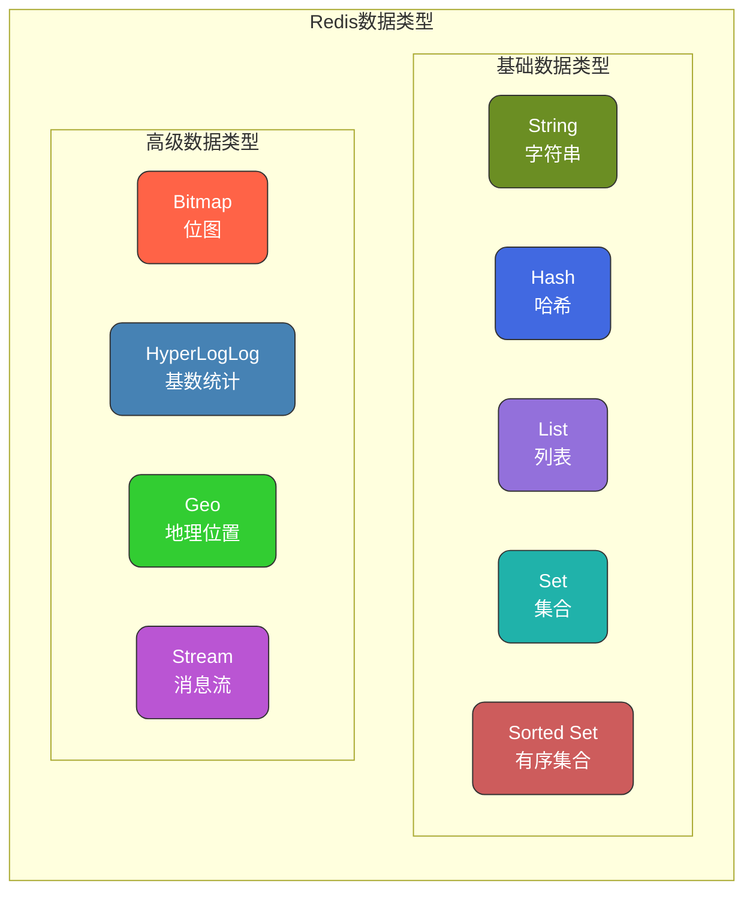

---

## 五种基础数据类型

### String（字符串）

#### 是什么

String是Redis最基础、最常用的数据类型。它是**二进制安全**的，意味着你可以存储任何数据：普通字符串、数字、JSON、甚至是图片的二进制数据。单个String值最大可以存储**512MB**。

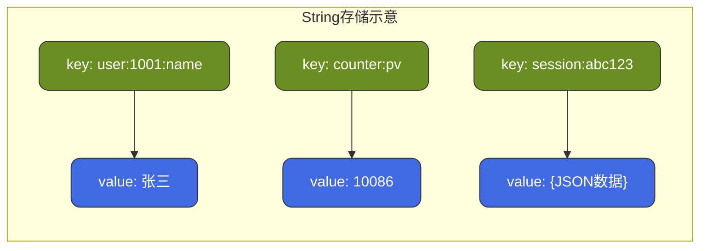

#### 能干什么

| 应用场景 | 说明 | 示例 |
|---------|------|------|
| **缓存** | 缓存热点数据，减少数据库压力 | 用户信息、商品详情 |
| **计数器** | 原子递增/递减操作 | 页面PV、点赞数、库存 |
| **分布式锁** | SETNX实现互斥锁 | 防止重复提交、资源竞争 |
| **Session共享** | 分布式系统Session存储 | 登录状态、用户会话 |
| **限流** | 配合过期时间实现 | 接口调用频率限制 |

#### 常用命令

```bash
# 基本操作
SET key value              # 设置值
GET key                    # 获取值
DEL key                    # 删除

# 带过期时间
SET key value EX 3600      # 设置并指定过期时间（秒）
SETEX key 3600 value       # 等价写法
TTL key                    # 查看剩余过期时间

# 原子操作
INCR counter               # 自增1
INCRBY counter 10          # 自增指定值
DECR counter               # 自减1

# 分布式锁
SETNX lock_key value       # 不存在时才设置（原子操作）
SET lock_key value NX EX 30  # 推荐：不存在时设置，30秒过期
```

#### 实战案例

**场景1：商品库存扣减**

```java
// 商品库存key
String stockKey = "stock:product:10086";

// 初始化库存
redisTemplate.opsForValue().set(stockKey, "1000");

// 下单时扣减库存（原子操作）
Long stock = redisTemplate.opsForValue().decrement(stockKey);
if (stock < 0) {
    // 库存不足，回滚
    redisTemplate.opsForValue().increment(stockKey);
    throw new RuntimeException("库存不足");
}
```

**场景2：接口限流**

```java
public boolean isAllowed(String userId, int maxRequests, int timeWindow) {
    String key = "rate_limit:" + userId;
    Long count = redisTemplate.opsForValue().increment(key);
    
    if (count == 1) {
        // 第一次请求，设置过期时间
        redisTemplate.expire(key, timeWindow, TimeUnit.SECONDS);
    }
    
    return count <= maxRequests;
}
```

---

### Hash（哈希）

#### 是什么

Hash是一个键值对集合，类似于Java中的`HashMap<String, String>`。它特别适合存储**对象**，因为可以只修改对象的某个字段，而不用读取整个对象再写回。

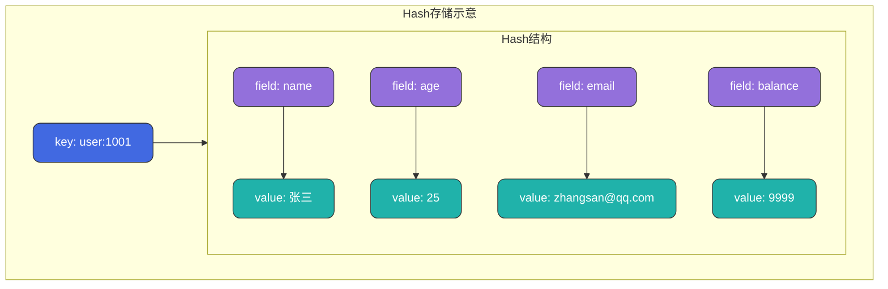

#### Hash vs String存储对象

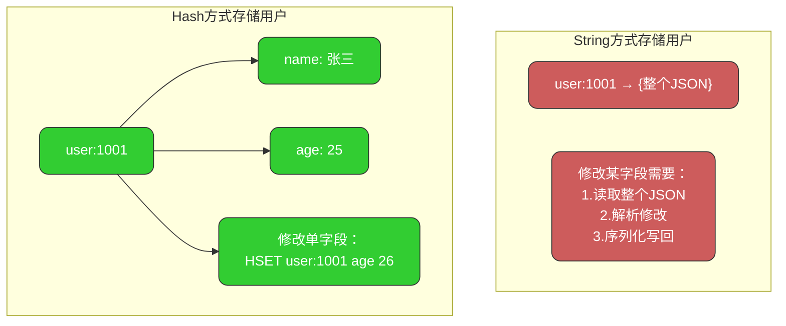

#### 能干什么

| 应用场景 | 说明 | 示例 |
|---------|------|------|
| **对象缓存** | 存储用户、商品等对象 | 用户信息、购物车 |
| **购物车** | 商品ID作为field，数量作为value | 电商购物车 |
| **计数器组** | 一个key存多个计数器 | 文章的阅读、点赞、评论数 |
| **配置信息** | 存储配置项 | 系统配置、功能开关 |

#### 常用命令

```bash
# 基本操作
HSET user:1001 name "张三"      # 设置单个字段
HGET user:1001 name             # 获取单个字段
HDEL user:1001 name             # 删除字段

# 批量操作
HMSET user:1001 name "张三" age 25 city "北京"  # 设置多个字段
HMGET user:1001 name age        # 获取多个字段
HGETALL user:1001               # 获取所有字段和值

# 其他操作
HKEYS user:1001                 # 获取所有field
HVALS user:1001                 # 获取所有value
HLEN user:1001                  # 获取字段数量
HEXISTS user:1001 name          # 判断字段是否存在
HINCRBY user:1001 age 1         # 字段值自增
```

#### 实战案例：购物车

```java
// 购物车key = cart:用户ID，field = 商品ID，value = 数量
String cartKey = "cart:" + userId;

// 添加商品
public void addToCart(Long userId, Long productId, int quantity) {
    String cartKey = "cart:" + userId;
    redisTemplate.opsForHash().increment(cartKey, productId.toString(), quantity);
}

// 获取购物车
public Map<String, Integer> getCart(Long userId) {
    String cartKey = "cart:" + userId;
    return redisTemplate.opsForHash().entries(cartKey);
}

// 修改数量
public void updateQuantity(Long userId, Long productId, int quantity) {
    String cartKey = "cart:" + userId;
    redisTemplate.opsForHash().put(cartKey, productId.toString(), quantity);
}

// 删除商品
public void removeFromCart(Long userId, Long productId) {
    String cartKey = "cart:" + userId;
    redisTemplate.opsForHash().delete(cartKey, productId.toString());
}

// 清空购物车
public void clearCart(Long userId) {
    String cartKey = "cart:" + userId;
    redisTemplate.delete(cartKey);
}
```

---

### List（列表）

#### 是什么

List是一个**有序**的字符串列表，按照插入顺序排序。你可以从头部（左边）或尾部（右边）添加元素。底层是**双向链表**，所以在两端插入/删除操作的时间复杂度是O(1)，但按索引访问是O(N)。

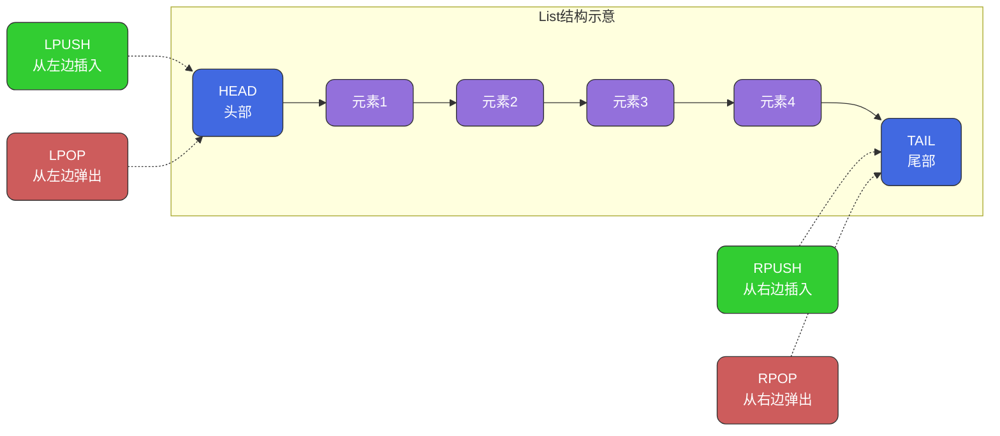

#### 能干什么

| 应用场景 | 说明 | 实现方式 |
|---------|------|----------|
| **消息队列** | 简单的队列实现 | LPUSH + RPOP（或BRPOP阻塞） |
| **最新消息** | 展示最新N条数据 | LPUSH + LRANGE + LTRIM |
| **排行榜** | 固定数量排名（简单场景） | 配合LTRIM保持长度 |
| **时间线** | 微博、朋友圈时间线 | LPUSH最新消息 |

#### 常用命令

```bash
# 插入操作
LPUSH mylist "a" "b" "c"    # 从左边插入，结果：c b a
RPUSH mylist "x" "y" "z"    # 从右边插入

# 弹出操作
LPOP mylist                 # 从左边弹出
RPOP mylist                 # 从右边弹出
BLPOP mylist 10             # 阻塞式弹出，最多等10秒

# 查询操作
LRANGE mylist 0 -1          # 获取全部元素
LRANGE mylist 0 9           # 获取前10个元素
LINDEX mylist 0             # 获取指定位置元素
LLEN mylist                 # 获取列表长度

# 修剪操作
LTRIM mylist 0 99           # 只保留前100个元素
```

#### 实战案例：最新消息列表

```java
// 用户动态时间线
public void addNews(Long userId, String newsId) {
    String key = "timeline:" + userId;
    
    // 1. 新消息插入头部
    redisTemplate.opsForList().leftPush(key, newsId);
    
    // 2. 只保留最新1000条
    redisTemplate.opsForList().trim(key, 0, 999);
}

// 获取最新动态
public List<String> getLatestNews(Long userId, int page, int size) {
    String key = "timeline:" + userId;
    int start = page * size;
    int end = start + size - 1;
    
    return redisTemplate.opsForList().range(key, start, end);
}
```

#### 实战案例：简单消息队列

```java
// 生产者：发送消息
public void sendMessage(String queue, String message) {
    redisTemplate.opsForList().leftPush(queue, message);
}

// 消费者：接收消息（阻塞方式）
public String receiveMessage(String queue, long timeout) {
    return redisTemplate.opsForList()
        .rightPop(queue, timeout, TimeUnit.SECONDS);
}
```

---

### Set（集合）

#### 是什么

Set是一个**无序**的字符串集合，最大的特点是**自动去重**。集合中的元素是唯一的，不会有重复值。Redis的Set支持交集、并集、差集等集合运算，这使得它在某些场景下非常强大。

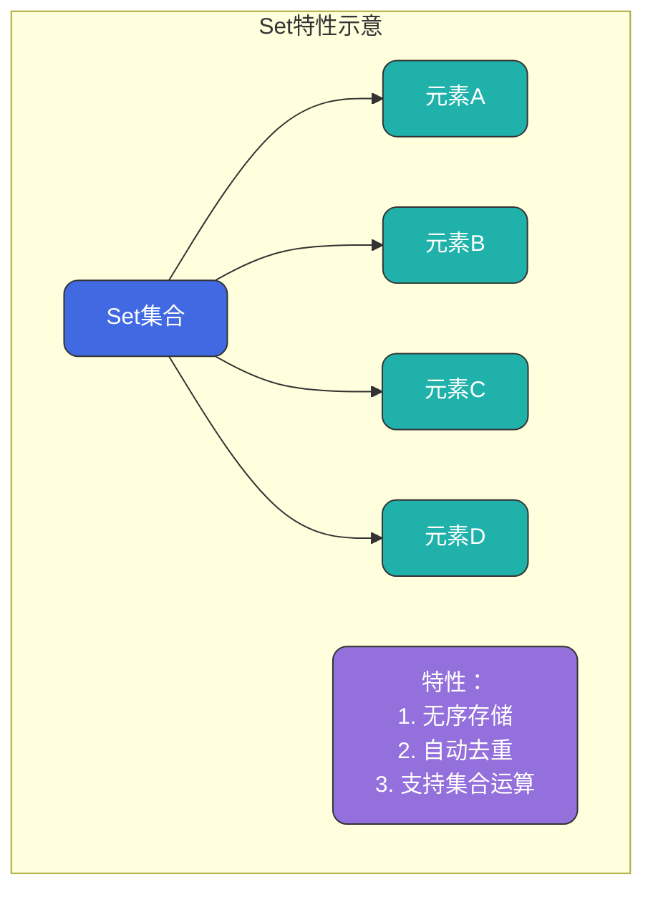

#### Set集合运算

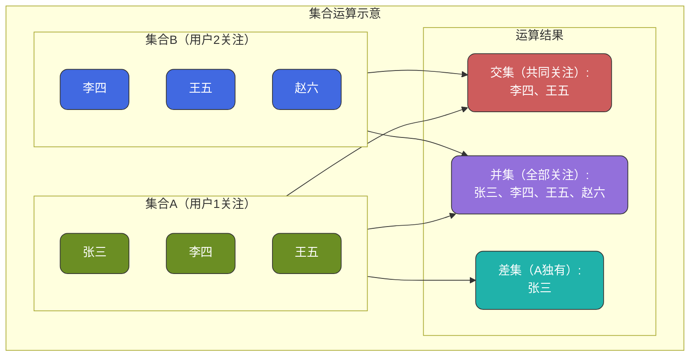

#### 能干什么

| 应用场景 | 说明 | 命令 |
|---------|------|------|
| **标签系统** | 文章/用户标签 | SADD, SMEMBERS |
| **共同好友** | 两个用户的共同好友 | SINTER |
| **可能认识** | 好友推荐 | SDIFF |
| **抽奖活动** | 随机抽取中奖用户 | SRANDMEMBER, SPOP |
| **点赞/收藏** | 判断是否点赞、点赞列表 | SADD, SISMEMBER |
| **UV统计** | 去重统计访问用户 | SADD, SCARD |

#### 常用命令

```bash
# 基本操作
SADD myset "a" "b" "c"      # 添加元素
SREM myset "a"              # 删除元素
SMEMBERS myset              # 获取所有元素
SCARD myset                 # 获取元素数量
SISMEMBER myset "a"         # 判断元素是否存在

# 随机操作
SRANDMEMBER myset 3         # 随机获取3个元素（不删除）
SPOP myset 3                # 随机弹出3个元素（删除）

# 集合运算
SINTER set1 set2            # 交集
SUNION set1 set2            # 并集
SDIFF set1 set2             # 差集（set1有但set2没有）
```

#### 实战案例：点赞功能

```java
// 点赞key = like:文章ID
public void like(Long articleId, Long userId) {
    String key = "like:" + articleId;
    redisTemplate.opsForSet().add(key, userId.toString());
}

// 取消点赞
public void unlike(Long articleId, Long userId) {
    String key = "like:" + articleId;
    redisTemplate.opsForSet().remove(key, userId.toString());
}

// 是否已点赞
public boolean isLiked(Long articleId, Long userId) {
    String key = "like:" + articleId;
    return redisTemplate.opsForSet().isMember(key, userId.toString());
}

// 点赞数
public Long getLikeCount(Long articleId) {
    String key = "like:" + articleId;
    return redisTemplate.opsForSet().size(key);
}

// 点赞用户列表
public Set<String> getLikeUsers(Long articleId) {
    String key = "like:" + articleId;
    return redisTemplate.opsForSet().members(key);
}
```

#### 实战案例：共同关注

```java
// 获取共同关注
public Set<String> getCommonFollows(Long userId1, Long userId2) {
    String key1 = "follow:" + userId1;
    String key2 = "follow:" + userId2;
    
    return redisTemplate.opsForSet().intersect(key1, key2);
}

// 推荐关注（我关注的人关注了，但我没关注）
public Set<String> getRecommendFollows(Long myId, Long friendId) {
    String myKey = "follow:" + myId;
    String friendKey = "follow:" + friendId;
    
    // 朋友关注的 - 我关注的 = 推荐给我的
    return redisTemplate.opsForSet().difference(friendKey, myKey);
}
```

---

### Sorted Set（有序集合）

#### 是什么

Sorted Set（简称ZSet）是一个**有序**的集合，每个元素关联一个**分数（score）**，Redis根据分数对元素进行从小到大排序。与Set一样，元素不能重复，但分数可以相同。

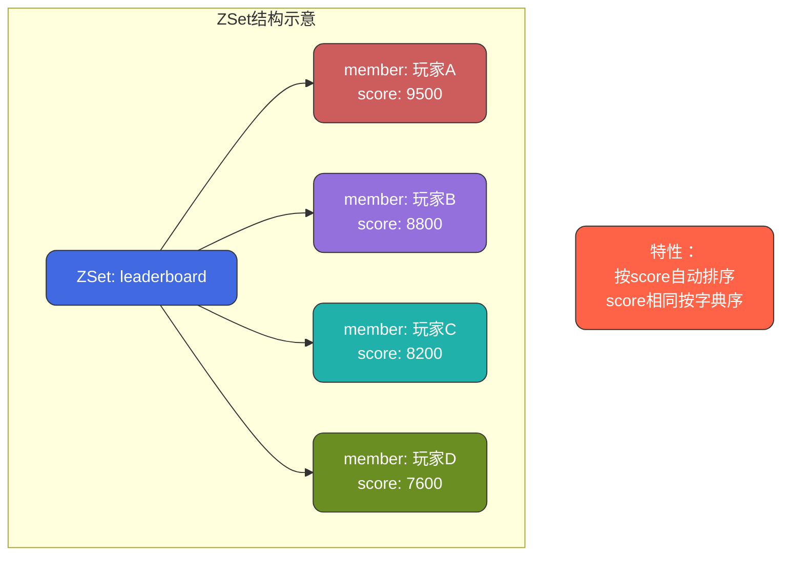

#### 能干什么

| 应用场景 | 说明 | score含义 |
|---------|------|-----------|
| **排行榜** | 游戏排名、销量排名 | 分数/销量 |
| **热搜榜** | 微博热搜、新闻热度 | 热度值 |
| **延迟队列** | 定时任务调度 | 执行时间戳 |
| **范围查询** | 价格区间、时间范围 | 价格/时间 |
| **优先级队列** | 按优先级处理任务 | 优先级值 |

#### 常用命令

```bash
# 添加/更新
ZADD leaderboard 9500 "玩家A"    # 添加元素及分数
ZINCRBY leaderboard 100 "玩家A"  # 增加分数

# 查询排名（从小到大）
ZRANK leaderboard "玩家A"        # 获取排名（从0开始）
ZRANGE leaderboard 0 9           # 获取前10名（按分数升序）
ZRANGE leaderboard 0 9 WITHSCORES  # 同时返回分数

# 查询排名（从大到小）
ZREVRANK leaderboard "玩家A"     # 逆序排名
ZREVRANGE leaderboard 0 9        # 前10名（按分数降序）

# 按分数范围查询
ZRANGEBYSCORE leaderboard 1000 5000  # 分数在1000-5000的成员
ZCOUNT leaderboard 1000 5000         # 该范围内的成员数量

# 其他操作
ZSCORE leaderboard "玩家A"       # 获取成员分数
ZCARD leaderboard                # 获取成员总数
ZREM leaderboard "玩家A"         # 删除成员
```

#### 实战案例：游戏排行榜

```java
// 排行榜key
private static final String LEADERBOARD = "game:leaderboard";

// 更新玩家分数
public void updateScore(String playerId, double score) {
    redisTemplate.opsForZSet().add(LEADERBOARD, playerId, score);
}

// 增加分数
public void addScore(String playerId, double delta) {
    redisTemplate.opsForZSet().incrementScore(LEADERBOARD, playerId, delta);
}

// 获取前N名（降序）
public List<PlayerRank> getTopN(int n) {
    Set<ZSetOperations.TypedTuple<String>> tuples = 
        redisTemplate.opsForZSet().reverseRangeWithScores(LEADERBOARD, 0, n - 1);
    
    List<PlayerRank> result = new ArrayList<>();
    int rank = 1;
    for (ZSetOperations.TypedTuple<String> tuple : tuples) {
        result.add(new PlayerRank(rank++, tuple.getValue(), tuple.getScore()));
    }
    return result;
}

// 获取玩家排名（从1开始）
public Long getPlayerRank(String playerId) {
    Long rank = redisTemplate.opsForZSet().reverseRank(LEADERBOARD, playerId);
    return rank != null ? rank + 1 : null;
}

// 获取玩家分数
public Double getPlayerScore(String playerId) {
    return redisTemplate.opsForZSet().score(LEADERBOARD, playerId);
}
```

#### 实战案例：延迟队列

```java
// 添加延迟任务（score = 执行时间戳）
public void addDelayTask(String taskId, long executeTime) {
    redisTemplate.opsForZSet().add("delay:queue", taskId, executeTime);
}

// 轮询获取到期任务
public List<String> pollExpiredTasks() {
    long now = System.currentTimeMillis();
    
    // 获取所有到期任务（score <= 当前时间）
    Set<String> tasks = redisTemplate.opsForZSet()
        .rangeByScore("delay:queue", 0, now);
    
    if (tasks != null && !tasks.isEmpty()) {
        // 删除这些任务
        redisTemplate.opsForZSet().remove("delay:queue", tasks.toArray());
    }
    
    return new ArrayList<>(tasks);
}
```

---

## 五种基础类型对比

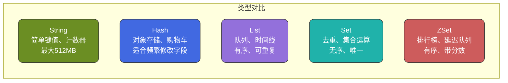

| 类型 | 存储结构 | 是否有序 | 是否唯一 | 典型场景 |
|------|---------|---------|---------|---------|
| **String** | 单一值 | - | - | 缓存、计数器、分布式锁 |
| **Hash** | field-value | 无序 | field唯一 | 对象存储、购物车 |
| **List** | 链表 | 有序 | 可重复 | 消息队列、时间线 |
| **Set** | 哈希表 | 无序 | 唯一 | 点赞、共同好友、抽奖 |
| **ZSet** | 跳表+哈希 | 有序 | 唯一 | 排行榜、延迟队列 |

---

## 高级数据类型

除了五种基础类型，Redis还提供了几种高级数据结构，它们针对特定场景进行了高度优化，能够以极低的内存占用解决特定问题。

### Bitmap（位图）

#### 是什么

Bitmap本质上不是一种新的数据类型，而是String类型的**位操作**扩展。它将一个String看作是一个由二进制位组成的数组，每个位只能是0或1。

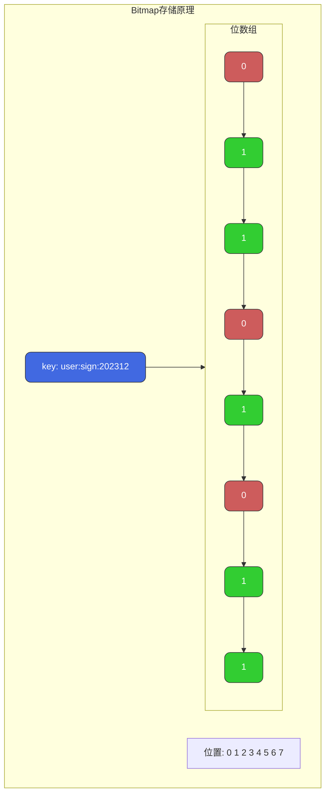

**核心优势：极致的空间效率**

- 存储1亿用户的签到状态，只需要 `1亿 / 8 = 12.5MB`
- 如果用String或Set存储，可能需要几个GB

#### 能干什么

| 应用场景 | 说明 | 位的含义 |
|---------|------|----------|
| **用户签到** | 记录每日签到情况 | 偏移量=日期，值=是否签到 |
| **活跃用户** | 统计日/周/月活跃用户 | 偏移量=用户ID，值=是否活跃 |
| **功能开关** | 用户功能权限控制 | 偏移量=功能ID，值=是否开启 |
| **在线状态** | 用户是否在线 | 偏移量=用户ID，值=是否在线 |
| **布隆过滤器** | Bitmap是布隆过滤器的底层实现 | 哈希位置标记 |

#### 常用命令

```bash
# 基本操作
SETBIT sign:202312:1001 5 1    # 用户1001在12月第5天签到
GETBIT sign:202312:1001 5      # 查询第5天是否签到

# 统计操作
BITCOUNT sign:202312:1001      # 统计12月签到总天数
BITCOUNT sign:202312:1001 0 3  # 统计前4个字节的签到天数

# 位运算（多个Bitmap）
BITOP AND result sign:day1 sign:day2  # 两天都签到的用户
BITOP OR result sign:day1 sign:day2   # 任一天签到的用户
BITOP XOR result sign:day1 sign:day2  # 只签到一天的用户

# 查找第一个指定位
BITPOS sign:202312:1001 1      # 第一次签到是哪天
BITPOS sign:202312:1001 0      # 第一次未签到是哪天
```

#### 实战案例：用户签到系统

```java
/**
 * 签到服务
 * key设计: sign:{年月}:{用户ID}
 * offset: 当月第几天(从0开始)
 */
public class SignService {
    
    // 签到
    public boolean sign(Long userId, LocalDate date) {
        String key = buildKey(userId, date);
        int offset = date.getDayOfMonth() - 1;
        
        // 设置对应位为1
        return redisTemplate.opsForValue().setBit(key, offset, true);
    }
    
    // 查询某天是否签到
    public boolean isSign(Long userId, LocalDate date) {
        String key = buildKey(userId, date);
        int offset = date.getDayOfMonth() - 1;
        
        return redisTemplate.opsForValue().getBit(key, offset);
    }
    
    // 统计本月签到天数
    public Long countMonthSign(Long userId, LocalDate date) {
        String key = buildKey(userId, date);
        
        // BITCOUNT命令
        return redisTemplate.execute((RedisCallback<Long>) conn ->
            conn.bitCount(key.getBytes())
        );
    }
    
    // 获取连续签到天数
    public int getConsecutiveDays(Long userId, LocalDate date) {
        String key = buildKey(userId, date);
        int dayOfMonth = date.getDayOfMonth();
        
        // 获取本月到今天为止的签到数据
        List<Long> result = redisTemplate.opsForValue()
            .bitField(key, BitFieldSubCommands.create()
                .get(BitFieldSubCommands.BitFieldType.unsigned(dayOfMonth))
                .valueAt(0));
        
        if (result == null || result.isEmpty()) {
            return 0;
        }
        
        long bits = result.get(0);
        int count = 0;
        
        // 从最低位开始检查连续的1
        while ((bits & 1) == 1) {
            count++;
            bits >>>= 1;
        }
        
        return count;
    }
    
    private String buildKey(Long userId, LocalDate date) {
        return String.format("sign:%d%02d:%d", 
            date.getYear(), date.getMonthValue(), userId);
    }
}
```

#### 实战案例：统计活跃用户

```java
// 记录用户活跃（用户ID作为offset）
public void recordActive(Long userId) {
    String key = "active:" + LocalDate.now().toString();
    redisTemplate.opsForValue().setBit(key, userId, true);
}

// 统计日活跃用户数
public Long getDailyActiveUsers(LocalDate date) {
    String key = "active:" + date.toString();
    return redisTemplate.execute((RedisCallback<Long>) conn ->
        conn.bitCount(key.getBytes())
    );
}

// 统计连续N天都活跃的用户数
public Long getConsecutiveActiveUsers(LocalDate endDate, int days) {
    List<String> keys = new ArrayList<>();
    for (int i = 0; i < days; i++) {
        keys.add("active:" + endDate.minusDays(i).toString());
    }
    
    String destKey = "active:consecutive:" + days;
    // AND运算：所有天都活跃
    redisTemplate.execute((RedisCallback<Long>) conn -> {
        byte[][] keyBytes = keys.stream()
            .map(String::getBytes)
            .toArray(byte[][]::new);
        return conn.bitOp(RedisStringCommands.BitOperation.AND, 
            destKey.getBytes(), keyBytes);
    });
    
    return redisTemplate.execute((RedisCallback<Long>) conn ->
        conn.bitCount(destKey.getBytes())
    );
}
```

---

### HyperLogLog（基数统计）

#### 是什么

HyperLogLog是一种**概率性数据结构**，用于统计集合中不重复元素的数量（基数）。它的神奇之处在于：

- 固定占用**12KB**内存
- 可以统计**2^64**个不同元素
- 标准误差仅**0.81%**

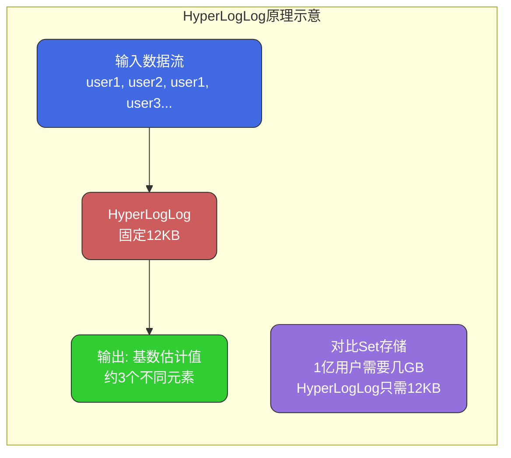

**适用场景：允许一定误差的大规模去重计数**

#### 能干什么

| 应用场景 | 说明 | 为什么用HyperLogLog |
|---------|------|--------------------|
| **UV统计** | 页面独立访客数 | 用户量大，允许误差 |
| **搜索词统计** | 搜索关键词去重计数 | 关键词极多，精确计数成本高 |
| **IP统计** | 独立IP数量 | IP数量庞大 |
| **在线用户** | 在线用户数估算 | 实时性要求高 |

#### 常用命令

```bash
# 添加元素
PFADD page:uv:20231201 user1 user2 user3
PFADD page:uv:20231201 user1 user4          # user1重复，不会重复计数

# 获取基数估计值
PFCOUNT page:uv:20231201                    # 返回约4

# 合并多个HyperLogLog
PFMERGE page:uv:week page:uv:20231201 page:uv:20231202 page:uv:20231203
PFCOUNT page:uv:week                        # 获取一周的UV
```

#### 实战案例：页面UV统计

```java
/**
 * UV统计服务
 * 适用于大流量页面的访客统计，允许约1%的误差
 */
public class UVStatisticsService {
    
    // 记录页面访问
    public void recordPageView(String pageId, String visitorId) {
        String key = "uv:" + pageId + ":" + LocalDate.now();
        redisTemplate.opsForHyperLogLog().add(key, visitorId);
    }
    
    // 获取今日UV
    public Long getTodayUV(String pageId) {
        String key = "uv:" + pageId + ":" + LocalDate.now();
        return redisTemplate.opsForHyperLogLog().size(key);
    }
    
    // 获取日期范围内的UV（去重合并）
    public Long getUVInRange(String pageId, LocalDate start, LocalDate end) {
        List<String> keys = new ArrayList<>();
        LocalDate current = start;
        
        while (!current.isAfter(end)) {
            keys.add("uv:" + pageId + ":" + current);
            current = current.plusDays(1);
        }
        
        String destKey = "uv:" + pageId + ":range:" + start + ":" + end;
        
        // 合并多天数据
        redisTemplate.opsForHyperLogLog()
            .union(destKey, keys.toArray(new String[0]));
        
        Long count = redisTemplate.opsForHyperLogLog().size(destKey);
        
        // 删除临时key
        redisTemplate.delete(destKey);
        
        return count;
    }
}
```

#### HyperLogLog vs Set 对比

| 维度 | HyperLogLog | Set |
|-----|-------------|-----|
| **内存占用** | 固定12KB | 随元素增加而增长 |
| **精确度** | 约0.81%误差 | 100%精确 |
| **支持操作** | 添加、计数、合并 | 丰富的集合操作 |
| **适用场景** | 大规模UV统计 | 精确去重、集合运算 |
| **1亿用户** | 12KB | 约1.2GB（假设每个ID 12字节） |

---

### Geo（地理位置）

#### 是什么

Geo是Redis 3.2引入的地理位置数据类型，底层使用**Sorted Set**实现。它可以存储地理坐标（经度、纬度），并支持计算两点距离、查找附近的点等操作。

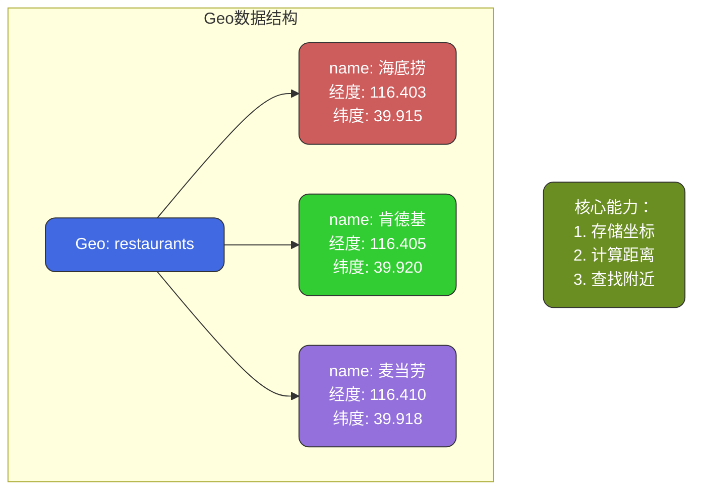

#### 能干什么

| 应用场景 | 说明 |
|---------|------|
| **附近的人** | 社交App查找附近用户 |
| **附近门店** | 查找最近的门店/餐厅 |
| **打车服务** | 查找附近的司机 |
| **外卖配送** | 骑手位置、配送范围 |
| **签到功能** | 基于位置的签到打卡 |

#### 常用命令

```bash
# 添加地理位置
GEOADD restaurants 116.403963 39.915119 "海底捞"
GEOADD restaurants 116.405285 39.920328 "肯德基" 116.410872 39.918473 "麦当劳"

# 获取坐标
GEOPOS restaurants "海底捞"

# 计算两点距离
GEODIST restaurants "海底捞" "肯德基" km   # 返回千米
GEODIST restaurants "海底捞" "肯德基" m    # 返回米

# 查找附近（圆形范围）
GEORADIUS restaurants 116.405 39.918 1 km WITHDIST COUNT 10 ASC
# 以坐标为中心，1公里内，返回距离，最多10个，按距离升序

# 以某成员为中心查找
GEORADIUSBYMEMBER restaurants "海底捞" 2 km WITHDIST

# Redis 6.2+ 新命令
GEOSEARCH restaurants FROMMEMBER "海底捞" BYRADIUS 2 km
GEOSEARCH restaurants FROMLONLAT 116.405 39.918 BYBOX 2 2 km
```

#### 实战案例：附近的餐厅

```java
/**
 * 位置服务
 */
public class LocationService {
    
    private static final String GEO_KEY = "geo:restaurants";
    
    // 添加餐厅位置
    public void addRestaurant(String restaurantId, double lng, double lat) {
        redisTemplate.opsForGeo().add(GEO_KEY, 
            new Point(lng, lat), restaurantId);
    }
    
    // 批量添加
    public void addRestaurants(List<Restaurant> restaurants) {
        List<RedisGeoCommands.GeoLocation<String>> locations = 
            restaurants.stream()
                .map(r -> new RedisGeoCommands.GeoLocation<>(
                    r.getId(), new Point(r.getLng(), r.getLat())))
                .collect(Collectors.toList());
        
        redisTemplate.opsForGeo().add(GEO_KEY, locations);
    }
    
    // 查找附近餐厅
    public List<NearbyRestaurant> findNearby(double lng, double lat, 
                                             double radiusKm, int limit) {
        // 构建圆形查询条件
        Circle circle = new Circle(
            new Point(lng, lat), 
            new Distance(radiusKm, Metrics.KILOMETERS));
        
        // 查询参数：返回距离、按距离升序、限制数量
        RedisGeoCommands.GeoRadiusCommandArgs args = 
            RedisGeoCommands.GeoRadiusCommandArgs.newGeoRadiusArgs()
                .includeDistance()
                .sortAscending()
                .limit(limit);
        
        GeoResults<RedisGeoCommands.GeoLocation<String>> results = 
            redisTemplate.opsForGeo().radius(GEO_KEY, circle, args);
        
        return results.getContent().stream()
            .map(r -> new NearbyRestaurant(
                r.getContent().getName(),
                r.getDistance().getValue()))
            .collect(Collectors.toList());
    }
    
    // 计算两点距离
    public Double getDistance(String id1, String id2) {
        Distance distance = redisTemplate.opsForGeo()
            .distance(GEO_KEY, id1, id2, Metrics.KILOMETERS);
        return distance != null ? distance.getValue() : null;
    }
    
    // 获取坐标
    public Point getPosition(String restaurantId) {
        List<Point> positions = redisTemplate.opsForGeo()
            .position(GEO_KEY, restaurantId);
        return positions != null && !positions.isEmpty() 
            ? positions.get(0) : null;
    }
}
```

#### 实战案例：司机位置上报与匹配

```java
/**
 * 打车服务 - 司机位置管理
 */
public class DriverLocationService {
    
    private static final String ONLINE_DRIVERS = "geo:drivers:online";
    
    // 司机上报位置（通常每隔几秒上报一次）
    public void updateDriverLocation(String driverId, double lng, double lat) {
        redisTemplate.opsForGeo().add(ONLINE_DRIVERS, 
            new Point(lng, lat), driverId);
        
        // 设置位置过期时间（司机掉线自动清除）
        // 注意：Geo底层是ZSet，需要额外维护过期
        redisTemplate.opsForValue().set(
            "driver:heartbeat:" + driverId, "1", 30, TimeUnit.SECONDS);
    }
    
    // 为乘客匹配最近的司机
    public List<String> findNearestDrivers(double lng, double lat, 
                                           double radiusKm, int count) {
        Circle circle = new Circle(
            new Point(lng, lat),
            new Distance(radiusKm, Metrics.KILOMETERS));
        
        RedisGeoCommands.GeoRadiusCommandArgs args = 
            RedisGeoCommands.GeoRadiusCommandArgs.newGeoRadiusArgs()
                .includeDistance()
                .sortAscending()
                .limit(count);
        
        GeoResults<RedisGeoCommands.GeoLocation<String>> results = 
            redisTemplate.opsForGeo().radius(ONLINE_DRIVERS, circle, args);
        
        // 过滤掉已掉线的司机
        return results.getContent().stream()
            .map(r -> r.getContent().getName())
            .filter(this::isDriverOnline)
            .collect(Collectors.toList());
    }
    
    private boolean isDriverOnline(String driverId) {
        return redisTemplate.hasKey("driver:heartbeat:" + driverId);
    }
}
```

---

### Stream（消息流）

#### 是什么

Stream是Redis 5.0引入的数据类型，专为**消息队列**场景设计。它结合了List的有序性和Pub/Sub的消息广播能力，还支持**消费者组**、**消息确认**、**消息回溯**等高级特性。

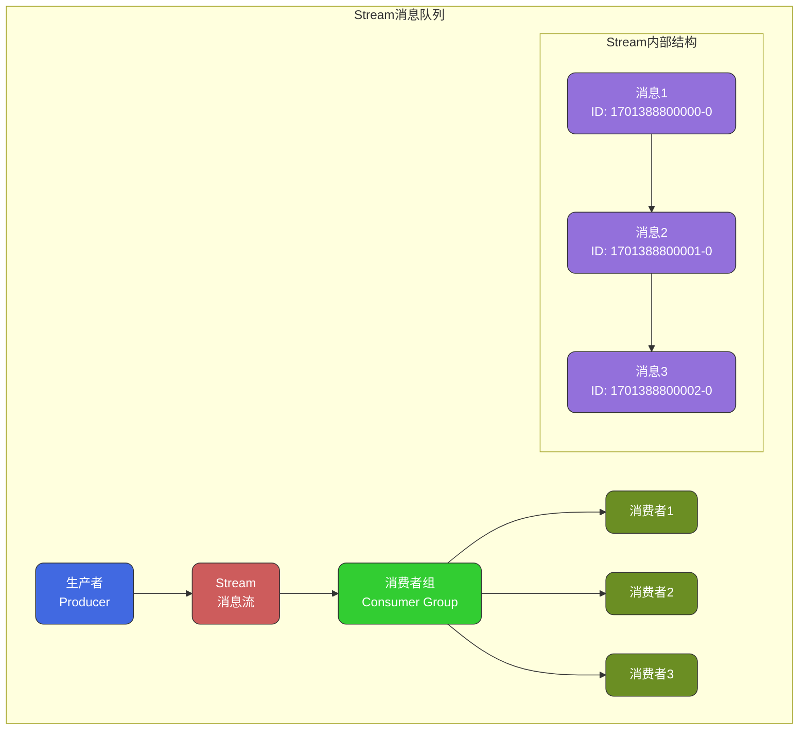

#### Stream vs List vs Pub/Sub

| 特性 | List | Pub/Sub | Stream |
|-----|------|---------|--------|
| **消息持久化** | 支持 | 不支持 | 支持 |
| **消息回溯** | 不支持 | 不支持 | 支持 |
| **消费者组** | 不支持 | 不支持 | 支持 |
| **消息确认** | 不支持 | 不支持 | 支持 |
| **广播消费** | 不支持 | 支持 | 支持 |
| **阻塞读取** | 支持 | 支持 | 支持 |

#### 能干什么

| 应用场景 | 说明 |
|---------|------|
| **消息队列** | 替代简单的List队列 |
| **事件驱动** | 微服务间事件传递 |
| **日志收集** | 日志流式处理 |
| **实时数据** | 实时数据管道 |
| **任务分发** | 多消费者任务处理 |

#### 常用命令

```bash
# 添加消息（*表示自动生成ID）
XADD mystream * name "order" action "create" orderId "10086"
# 返回: 1701388800000-0 （时间戳-序号）

# 读取消息
XRANGE mystream - +                    # 读取所有消息
XRANGE mystream - + COUNT 10           # 读取10条
XREVRANGE mystream + - COUNT 10        # 逆序读取10条
XLEN mystream                          # 消息数量

# 阻塞读取
XREAD BLOCK 5000 STREAMS mystream 0    # 从头开始读，阻塞5秒
XREAD BLOCK 0 STREAMS mystream $       # 只读取新消息，永久阻塞

# 消费者组
XGROUP CREATE mystream mygroup $ MKSTREAM  # 创建消费者组
XREADGROUP GROUP mygroup consumer1 COUNT 1 BLOCK 5000 STREAMS mystream >
# 以consumer1身份从mygroup读取1条新消息

# 确认消息
XACK mystream mygroup 1701388800000-0  # 确认消息已处理

# 查看待确认消息
XPENDING mystream mygroup              # 查看待处理消息概况
XPENDING mystream mygroup - + 10      # 查看详细待处理消息

# 消息转移（处理超时消息）
XCLAIM mystream mygroup consumer2 60000 1701388800000-0
# 将消息转给consumer2（超时60秒的消息）
```

#### 实战案例：订单事件处理

```java
/**
 * 基于Stream的订单事件队列
 */
public class OrderEventService {
    
    private static final String STREAM_KEY = "stream:order:events";
    private static final String GROUP_NAME = "order-processor";
    
    // 初始化消费者组
    @PostConstruct
    public void initConsumerGroup() {
        try {
            redisTemplate.opsForStream().createGroup(STREAM_KEY, GROUP_NAME);
        } catch (Exception e) {
            // 组已存在，忽略
        }
    }
    
    // 发布订单事件
    public String publishEvent(OrderEvent event) {
        Map<String, String> message = new HashMap<>();
        message.put("orderId", event.getOrderId());
        message.put("action", event.getAction());
        message.put("timestamp", String.valueOf(System.currentTimeMillis()));
        message.put("data", JSON.toJSONString(event.getData()));
        
        RecordId recordId = redisTemplate.opsForStream()
            .add(STREAM_KEY, message);
        
        return recordId.getValue();
    }
    
    // 消费消息
    public void consumeEvents(String consumerName) {
        while (true) {
            try {
                // 阻塞读取新消息
                List<MapRecord<String, String, String>> records = 
                    redisTemplate.opsForStream().read(
                        Consumer.from(GROUP_NAME, consumerName),
                        StreamReadOptions.empty()
                            .count(10)
                            .block(Duration.ofSeconds(5)),
                        StreamOffset.create(STREAM_KEY, ReadOffset.lastConsumed())
                    );
                
                if (records == null || records.isEmpty()) {
                    continue;
                }
                
                for (MapRecord<String, String, String> record : records) {
                    try {
                        // 处理消息
                        processEvent(record.getValue());
                        
                        // 确认消息
                        redisTemplate.opsForStream()
                            .acknowledge(STREAM_KEY, GROUP_NAME, record.getId());
                            
                    } catch (Exception e) {
                        log.error("处理消息失败: {}", record.getId(), e);
                        // 不确认，消息会保留在pending列表
                    }
                }
                
            } catch (Exception e) {
                log.error("读取Stream异常", e);
                Thread.sleep(1000);
            }
        }
    }
    
    // 处理死信（长时间未确认的消息）
    public void handleDeadLetters(long idleTimeMs) {
        // 获取待处理消息
        PendingMessagesSummary summary = redisTemplate.opsForStream()
            .pending(STREAM_KEY, GROUP_NAME);
        
        if (summary.getTotalPendingMessages() == 0) {
            return;
        }
        
        // 获取详细的待处理消息
        PendingMessages pending = redisTemplate.opsForStream()
            .pending(STREAM_KEY, GROUP_NAME, Range.unbounded(), 100);
        
        for (PendingMessage pm : pending) {
            // 检查消息是否超时
            if (pm.getElapsedTimeSinceLastDelivery().toMillis() > idleTimeMs) {
                // 转移给当前消费者重新处理
                redisTemplate.opsForStream().claim(
                    STREAM_KEY, GROUP_NAME, "dead-letter-handler",
                    Duration.ofMillis(idleTimeMs), pm.getId());
            }
        }
    }
    
    private void processEvent(Map<String, String> eventData) {
        String action = eventData.get("action");
        String orderId = eventData.get("orderId");
        
        switch (action) {
            case "CREATE":
                handleOrderCreate(orderId, eventData);
                break;
            case "PAY":
                handleOrderPay(orderId, eventData);
                break;
            case "CANCEL":
                handleOrderCancel(orderId, eventData);
                break;
        }
    }
}
```

---

## 高级类型对比

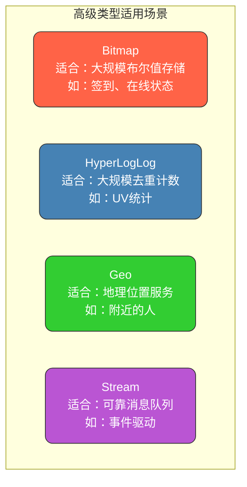

| 类型 | 核心特点 | 内存占用 | 精确度 | 典型场景 |
|------|---------|---------|--------|----------|
| **Bitmap** | 位级别操作 | 极低（1亿=12.5MB） | 精确 | 签到、活跃统计 |
| **HyperLogLog** | 概率去重计数 | 固定12KB | 约0.81%误差 | UV统计 |
| **Geo** | 地理位置计算 | 中等（ZSet） | 精确 | 附近的人/店 |
| **Stream** | 可靠消息队列 | 随消息增长 | 精确 | 事件驱动、消息队列 |

---

## 总结：如何选择数据类型

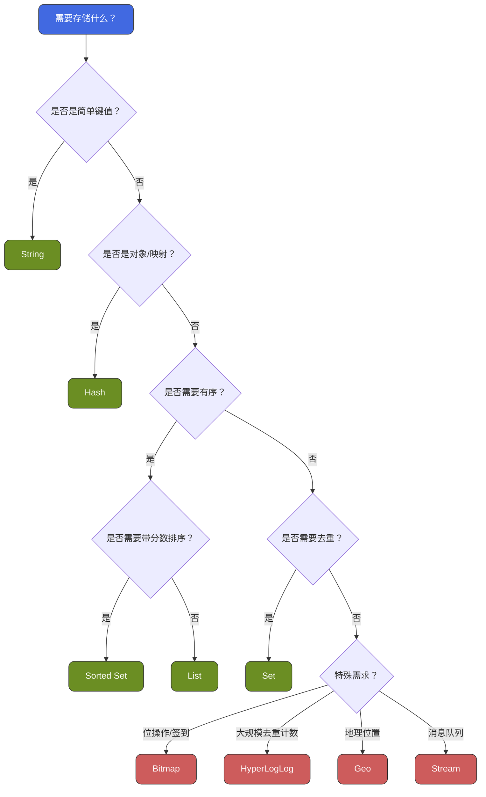

**选型建议：**

1. **缓存对象**：小对象用String（JSON），频繁修改字段用Hash
2. **计数器**：String的INCR系列命令
3. **排行榜**：Sorted Set
4. **消息队列**：简单场景用List，可靠消息用Stream
5. **去重统计**：精确用Set，大规模允许误差用HyperLogLog
6. **签到/在线**：Bitmap
7. **位置服务**：Geo
