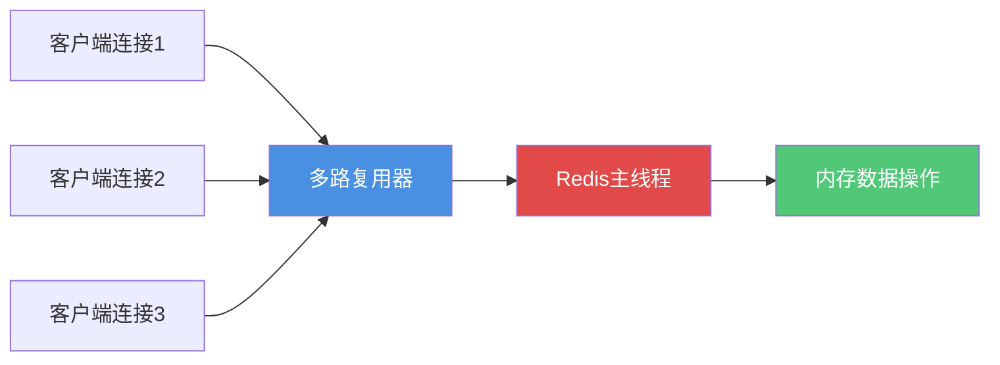
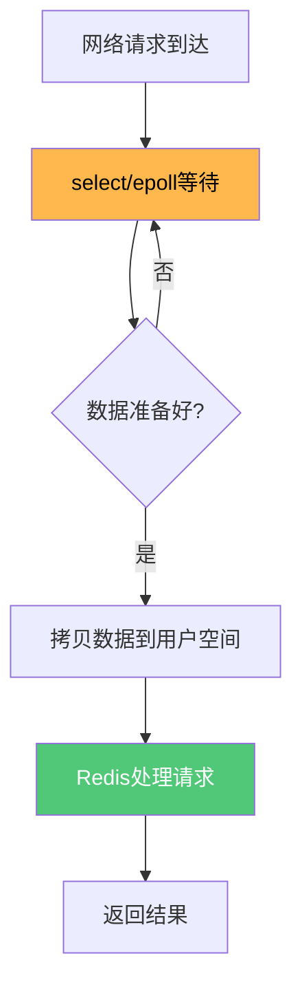
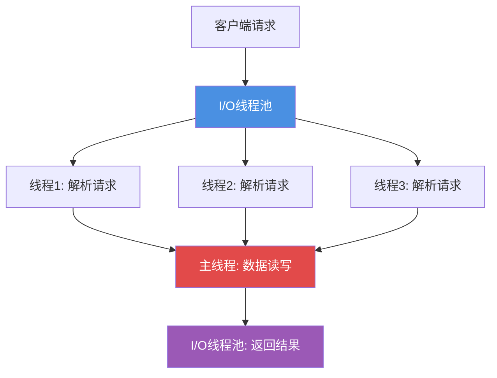

# Redis线程模型与性能优化

## Redis的线程模型演进

Redis的线程模型经历了从单线程到多线程的演进过程。理解这一演进历程,对于深入掌握Redis的性能优化至关重要。

### 单线程设计的初衷

很多人说"Redis是单线程的",这种说法并不完全准确。准确地说,**Redis的网络IO和键值对读写操作由单线程完成**,而持久化、集群管理等模块早就采用了多线程。

Redis在网络请求和数据操作模块采用单线程设计,主要基于以下考虑:

#### CPU不是性能瓶颈

程序的执行过程主要涉及两类操作:

1. **I/O操作**: 包括网络I/O和磁盘I/O
2. **计算操作**: 主要消耗CPU资源

**Redis的数据操作主要基于内存,CPU根本不是性能瓶颈**。大多数操作都能在极短时间内完成,没有必要通过多线程来提升CPU利用率。

#### 避免多线程的复杂性

多线程虽然能提升CPU和I/O利用率,但也带来了诸多问题:

1. **并发控制复杂**: 需要处理共享资源的线程安全问题
2. **线程切换开销**: 多线程间的上下文切换会消耗性能
3. **开发维护成本高**: 调试、排查问题的难度大幅增加

### 单线程如何保证高性能

虽然采用单线程模型,但Redis依然能够提供极高的性能,主要依靠以下技术:

#### 多路复用I/O技术

Redis使用I/O多路复用技术,实现单线程处理多个客户端连接的能力。

**多路复用原理:**

Linux的多路复用允许多个进程的I/O注册到同一个管道,该管道统一与内核交互。当某个请求的数据准备完成后,进程再将数据从内核空间拷贝到用户空间。

**技术实现:**

Redis在不同操作系统下使用不同的多路复用实现:

- **Linux**: epoll
- **macOS/FreeBSD**: kqueue  
- **通用**: select/poll

每个I/O多路复用库在Redis源码中都有对应的实现文件。当套接字准备好进行连接应答、读写等操作时,会产生文件事件。通过多路复用器,一个Redis线程就能高效处理多个I/O流。

#### 高性能的其他因素

除了多路复用技术,Redis的高性能还得益于:

1. **纯内存操作**: 数据存储在内存中,访问速度极快
2. **高效数据结构**: 哈希表、跳表等结构的时间复杂度都很低
3. **无上下文切换**: 单线程避免了线程切换的开销

## Redis 6.0的多线程优化

### 引入多线程的背景

Redis单线程模型已经能满足大多数场景,测算显示Redis可处理8万到10万QPS。但随着业务规模的扩大,一些大型互联网公司需要更高的QPS。

**性能瓶颈分析:**

虽然采用了多路复用技术,但多路复用本质上仍是同步阻塞型I/O模型。在处理网络请求时,调用select/epoll的过程会阻塞线程。

在高并发场景下,大量CPU时间耗费在网络I/O的同步处理上,无法充分发挥多核CPU的优势。

### 多线程优化方案

Redis 6.0引入多线程专门用于处理网络请求,而数据读写仍由单线程完成。

**工作流程:**

1. 多个I/O线程并发处理网络请求的接收和解析
2. 解析后的请求交由主线程进行内存读写
3. 读写完成后,I/O线程负责将结果返回给客户端

### 多线程的优势

1. **提升网络I/O并行度**: 多个线程同时处理网络请求,减少等待时间
2. **充分利用多核CPU**: 不再受限于单核性能
3. **保持数据操作的简单性**: 读写仍是单线程,无需处理并发问题
4. **性能大幅提升**: 在高并发场景下QPS显著提高

### 为什么不影响线程安全

**关键设计:** 只有网络请求的接收、解析和结果返回使用多线程,数据的读写操作仍由单线程处理。

这样的设计既提升了网络I/O的处理能力,又避免了数据并发访问的线程安全问题,可谓一举两得。

## 性能优化总结

Redis从单线程到多线程的演进,体现了性能优化的几个重要原则:

1. **找准瓶颈**: Redis的瓶颈在网络I/O而非CPU
2. **权衡取舍**: 在性能和复杂度之间找到平衡点
3. **渐进优化**: 先用单线程+多路复用,再引入多线程优化I/O
4. **保持简单**: 核心的数据操作仍保持单线程,降低复杂度

通过这样的设计,Redis在保持简单高效的同时,也能满足高性能场景的需求。
