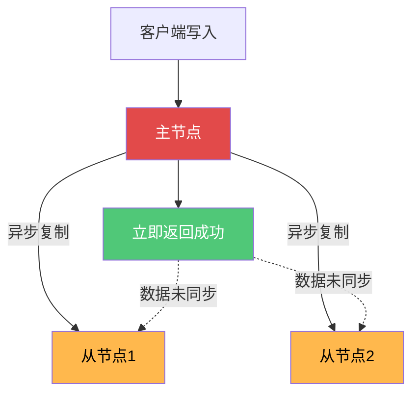
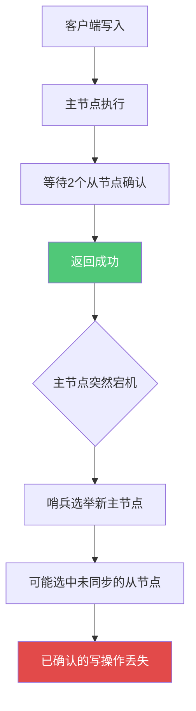
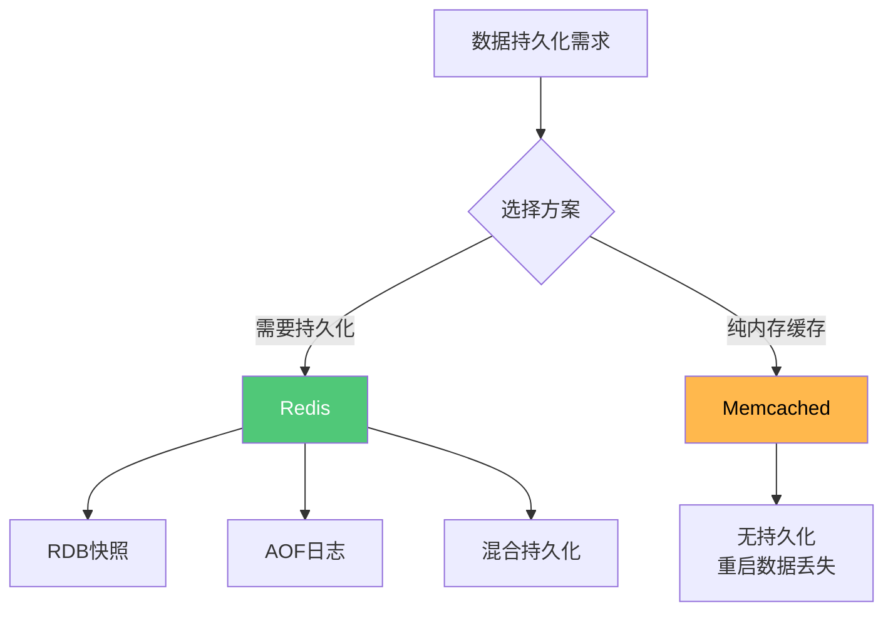
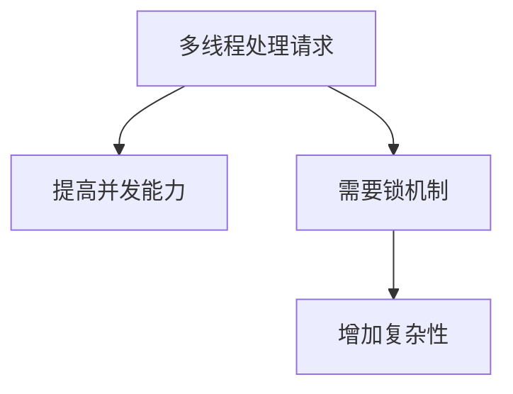

# Redis分布式特性与对比分析

## Redis在CAP理论中的定位

### CAP理论回顾

CAP理论是分布式系统的基础理论,指出分布式系统无法同时满足以下三个特性:

- **C (Consistency)**: 一致性,所有节点同时看到相同的数据
- **A (Availability)**: 可用性,系统持续提供服务
- **P (Partition Tolerance)**: 分区容错性,网络分区时系统仍能工作

**核心观点:** 在网络分区(P)不可避免的情况下,只能在C和A之间选择。

### Redis是AP还是CP?

这是一个常见的面试问题,答案需要分场景讨论。

#### 单机Redis的特殊性

有人认为单机Redis是CP的,因为:
- 只有一个实例,数据天然一致
- 节点挂掉后完全不可用

**但这个说法不准确。** CAP是分布式场景的理论,单机Redis不涉及分区(P),谈论AP或CP没有意义。

#### 集群Redis是AP的

Redis集群(包括主从复制、哨兵模式、Cluster模式)明确定位为**AP系统**。

**核心设计特点:**



**为什么是AP:**

1. **异步复制**: 主节点接收写操作后立即返回,不等待从节点同步完成
2. **最终一致性**: 从节点数据存在同步延迟,某个时间点可能不一致
3. **优先可用性**: 主节点故障时,从节点可以快速提升为主,保证服务可用

#### 不一致的表现

**场景1: 主从复制延迟**

```java
// T1时刻: 写入主节点
SET user:balance:10086 1000
// 主节点立即返回OK

// T2时刻(10ms后): 从节点还未同步
// 客户端从从节点读取
GET user:balance:10086
// 可能读到旧值或null

// T3时刻(50ms后): 同步完成
// 最终一致
```

**场景2: 故障转移期间**

```java
// 主节点已接收写操作,但未同步到从节点
SET order:status:123456 "paid"

// 主节点突然宕机
// 从节点提升为新主节点
// 这条写操作丢失

// 客户端查询
GET order:status:123456
// 返回null,数据丢失
```

### WAIT命令能实现CP吗?

Redis提供了`WAIT`命令,可以等待数据同步到指定数量的从节点:

```java
SET user:vip:10086 1
WAIT 2 1000  // 等待至少2个从节点确认,超时1秒
```

**但是,即使使用WAIT,Redis仍然不是CP系统。**

官方文档明确说明:

> WAIT命令只能确保数据在指定数量的副本中被确认,它并不能将Redis转变为具有强一致性的CP系统。在故障转移期间,已确认的写操作仍然可能丢失。

**原因:**



**WAIT的价值:**

- 降低数据丢失概率
- 在特定故障模式下提供更好的保障
- 但无法完全避免数据丢失

### 总结

**Redis的设计目标是高性能和高可用性,而不是强一致性。**

需要强一致性的场景应该选择:
- 关系型数据库 (MySQL的事务)
- 分布式协调服务 (ZooKeeper, etcd)
- CP型分布式数据库 (HBase, TiDB)

Redis更适合:
- 缓存场景,允许短暂不一致
- 会话存储,可接受少量数据丢失  
- 实时统计,追求性能而非绝对准确

## Redis事务与回滚机制

### Redis为什么不支持回滚

这是Redis与关系型数据库的重要区别。即使使用MULTI/EXEC事务或Lua脚本,Redis也不支持回滚。

**官方立场:**

Redis官方文档和博客明确表示:不支持回滚是设计选择,而非技术限制。

### 不支持回滚的原因

#### 1. 使用场景差异

```java
// MySQL场景: 复杂业务事务
BEGIN;
UPDATE account SET balance = balance - 100 WHERE id = 1;
UPDATE account SET balance = balance + 100 WHERE id = 2;
INSERT INTO transfer_log VALUES (...);
COMMIT;  // 任何步骤失败都需要回滚

// Redis场景: 简单缓存操作
MULTI
SET cache:user:10086 "data1"
INCR counter:pv
EXPIRE session:abc123 3600
EXEC  // 失败概率极低,无需复杂的回滚机制
```

Redis定位为缓存和简单数据存储,不需要关系型数据库级别的事务支持。

#### 2. 性能优先原则


回滚机制会带来:
- 事务日志的存储开销
- 锁机制的复杂性
- 回滚操作的性能损耗

这与Redis追求极致性能的设计理念相悖。

#### 3. 简化设计

Redis事务的执行模型:

```java
// Redis事务: 提交后一次性执行
MULTI
命令1
命令2
命令3
EXEC  // 单线程中一次性执行所有命令
```

**与MySQL的差异:**

| 特性 | Redis | MySQL |
|------|-------|-------|
| 执行模式 | 单线程批量执行 | 多线程交互执行 |
| 并发控制 | 天然串行,无需锁 | 需要复杂的锁机制 |
| 失败处理 | 继续执行其他命令 | 回滚整个事务 |

Redis的单线程模型使并发更新异常的概率极低,不需要复杂的回滚机制。

#### 4. 错误发生概率低

Redis命令失败的原因有限:

1. **语法错误**: 应该在开发阶段发现
2. **类型错误**: 比如对String执行LPUSH,编码时应避免
3. **资源不足**: 内存不足等,属于系统问题

这些问题都应该在编码和测试阶段解决,而非依赖运行时回滚。

```java
// 不好的代码: 类型错误
SET mykey "string_value"
LPUSH mykey "item"  // 错误: mykey是String不是List

// 好的代码: 类型正确
DEL mykey  // 先删除
LPUSH mykey "item"
```

### Redis事务的原子性

**问题: 不支持回滚,如何保证原子性?**

Redis的原子性保证与数据库的ACID不同:

**并发编程的原子性:**
- 操作不可分割,要么全部执行,要么全部不执行(从执行角度)
- Redis通过单线程保证一组命令串行执行,不被打断

**数据库ACID的原子性:**
- 事务内所有操作要么全部成功,要么全部失败(从结果角度)
- 需要回滚机制支持

```java
// Redis事务示例
MULTI
SET key1 "value1"
SET key2 "value2"  // 假设这条失败
SET key3 "value3"
EXEC

// 结果:
// key1 设置成功
// key2 设置失败
// key3 设置成功

// 这符合Redis的原子性定义(执行过程不被打断)
// 但不符合数据库的原子性定义(全部成功或全部失败)
```

### Lua脚本的原子性

Lua脚本提供了更强的原子性保证:

```lua
-- 秒杀扣减库存
local stock = redis.call('GET', KEYS[1])
if tonumber(stock) > 0 then
    redis.call('DECR', KEYS[1])
    return 1
else
    return 0
end
```

**Lua脚本的原子性:**

1. 整个脚本作为一个整体执行
2. 执行期间其他命令无法插入
3. 通过单线程保证,而非事务和锁

## Redis与Memcached对比

Redis和Memcached都是流行的缓存系统,但设计理念和应用场景存在显著差异。

### 核心差异对比

#### 1. 数据结构丰富度

**Redis:**

```java
// 字符串
SET user:name:10086 "张三"

// 哈希
HSET user:info:10086 name "张三" age 25

// 列表
LPUSH user:orders:10086 "order1" "order2"

// 集合
SADD user:tags:10086 "tech" "sports"

// 有序集合
ZADD ranking:score 95.5 "user:10086"
```

**Memcached:**

只支持简单的键值对:

```java
// 只能存储字符串
set user_10086 "serialized_json_data"
```

**影响:**

Redis的丰富数据结构使其能胜任更复杂的业务场景,而Memcached只适合简单缓存。

#### 2. 持久化能力



**Redis**: 支持RDB、AOF、混合持久化,可作为数据库使用

**Memcached**: 完全不支持持久化,重启后数据全部丢失

#### 3. 分片策略

**Redis Cluster:**

```java
// 使用哈希槽实现自动分片
// 16384个槽位均匀分配到各节点

// 客户端写入
SET product:10001 "data"
// Redis自动计算槽位,路由到对应节点

// 支持:
// - 自动故障转移
// - 数据重新分布
// - 在线扩容
```

**Memcached:**

```java
// 客户端手动分片
// 一致性哈希算法

servers = ["192.168.1.1:11211", "192.168.1.2:11211"]
key = "user:10086"
server = consistentHash(key, servers)
memcachedClient.set(server, key, value)

// 缺点:
// - 客户端实现复杂
// - 扩容需要迁移数据
// - 无自动故障转移
```

#### 4. 并发模型

**Redis:**


- 命令处理单线程,天然线程安全
- I/O可多线程处理(6.0+)
- 支持事务、Lua脚本等高级特性

**Memcached:**



- 多线程处理,更高并发
- 只支持基本的GET/SET操作
- 无事务支持

#### 5. 协议和功能

**Redis:**

- 自定义RESP协议
- 支持多数据库(0-15)
- 支持密码认证
- 支持发布订阅
- 支持Lua脚本

**Memcached:**

- 简单文本协议
- 单一命名空间
- 无认证机制
- 功能简单

### 内存管理差异

**Redis:**

```java
// 内存管理策略
maxmemory 2gb
maxmemory-policy allkeys-lru

// 支持:
// - 多种淘汰策略
// - 内存优化(ziplist等)
// - 内存碎片整理
```

**Memcached:**

```java
// Slab分配机制
// 预分配不同大小的内存块
// 减少碎片,但可能浪费空间

// 淘汰策略: LRU
// 相对简单
```

### 选择建议

**选择Redis的场景:**

```java
// 1. 需要丰富数据结构
ZADD leaderboard score "user"  // 排行榜
SETBIT signin:20231201 10086 1  // 签到
GEOADD locations 116.4 39.9 "北京"  // 地理位置

// 2. 需要持久化
// 会话存储、购物车等不能丢失的数据

// 3. 需要高级功能
// 事务、Lua脚本、发布订阅

// 4. 需要集群自动管理
// Redis Cluster自动分片和故障转移
```

**选择Memcached的场景:**

```java
// 1. 纯粹的缓存场景
// 页面片段缓存
// API响应缓存

// 2. 多线程性能要求
// 极高的并发量(百万级QPS)

// 3. 简单的键值存储
// 无需复杂数据结构

// 4. 已有Memcached生态
// 历史系统维护
```

### 性能对比

**基准测试(参考):**

| 操作类型 | Redis | Memcached |
|---------|-------|-----------|
| 简单SET | 10万QPS | 15万QPS |
| 简单GET | 10万QPS | 15万QPS |
| 复杂数据结构 | 支持 | 不支持 |
| 持久化开销 | 有(可配置) | 无 |

**结论:**

- 纯KV操作: Memcached略快
- 复杂场景: Redis功能更强大
- 现代应用: Redis更全能

### 迁移建议

```java
// 从Memcached迁移到Redis

// 1. 兼容性层
public class CacheService {
    
    public void set(String key, Object value, int expireSeconds) {
        // 原Memcached代码
        // memcachedClient.set(key, expireSeconds, value);
        
        // 迁移到Redis
        redisTemplate.opsForValue()
            .set(key, value, expireSeconds, TimeUnit.SECONDS);
    }
    
    public Object get(String key) {
        return redisTemplate.opsForValue().get(key);
    }
}

// 2. 利用Redis高级特性
public void setUserInfo(Long userId, UserInfo info) {
    // Memcached只能存JSON
    // String json = JSON.toJSONString(info);
    // memcachedClient.set("user:" + userId, json);
    
    // Redis使用Hash结构
    String key = "user:info:" + userId;
    redisTemplate.opsForHash().put(key, "name", info.getName());
    redisTemplate.opsForHash().put(key, "age", info.getAge());
    redisTemplate.opsForHash().put(key, "city", info.getCity());
}
```

通过理解Redis与Memcached的差异,可以在不同场景下做出最优选择。对于新项目,Redis通常是更好的选择,它在保持高性能的同时提供了更丰富的功能。
