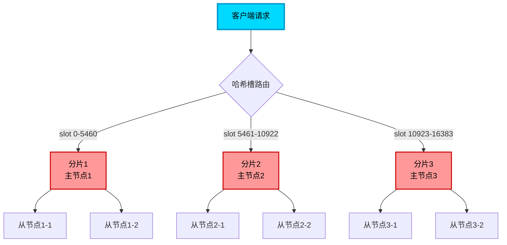

import PaidCTA from '@site/src/components/PaidCTA';


# Redis Cluster集群操作限制与解决方案

## Redis Cluster 的数据分片机制

Redis Cluster 采用主从复制和数据分片相结合的架构模式来实现高可用和水平扩展。在这种架构下，整个数据集被分散存储到多个节点上，每个分片（Shard）由一个主节点和若干从节点组成。主节点负责处理写操作和部分读操作，从节点则复制主节点数据并承担读请求。

这种设计思想与 MySQL 的分库分表非常相似，都是通过特定的分片算法将数据分布到不同的存储节点上，从而突破单节点的性能和容量瓶颈。



## 集群模式下的事务限制

### 跨节点事务无法执行

与 MySQL 跨库事务面临的限制相同，**Redis Cluster 中的事务操作不能跨越多个节点执行**。事务中涉及的所有键必须位于同一个哈希槽（Slot），进而保证它们存储在同一个节点上。如果尝试在单个事务中操作分布在不同分片的键，Redis 将直接拒绝执行该事务。

```java
// 订单支付场景 - 错误示例（跨节点事务失败）
Jedis jedis = new Jedis("127.0.0.1", 7000);

Transaction tx = jedis.multi();
// 假设 order:1001 和 account:user123 分布在不同节点
tx.decrBy("order:1001:stock", 1);        // 在节点A
tx.incrBy("account:user123:balance", -299);  // 在节点B
// 执行时会报错：CROSSSLOT Keys in request don't hash to the same slot
tx.exec();
```

### WATCH 命令的同样限制

Redis 的 `WATCH` 命令用于实现乐观锁机制，它同样要求被监视的键必须位于同一个哈希槽。跨节点的 WATCH 操作会导致命令执行失败。

```java
// 库存扣减乐观锁 - 错误示例
jedis.watch("product:phone:stock", "order:1001:status");  // 可能在不同节点
Transaction tx = jedis.multi();
// ... 业务逻辑
tx.exec();  // 如果键在不同节点，WATCH 将失败
```

<PaidCTA />