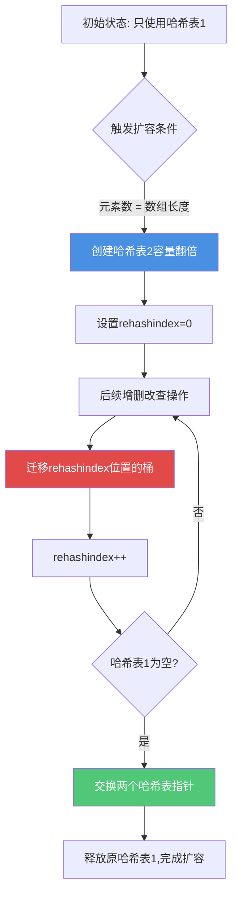
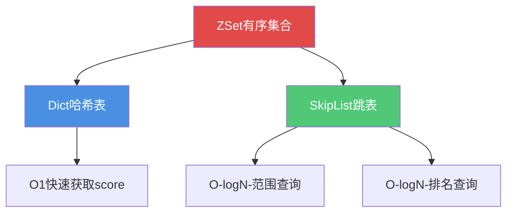
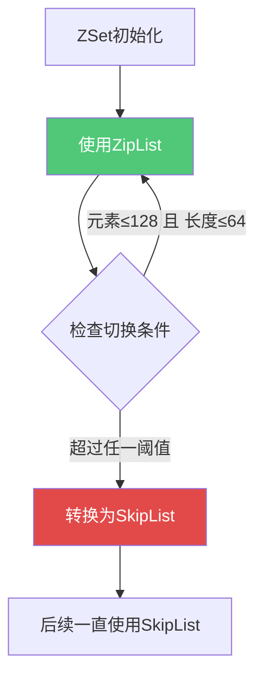
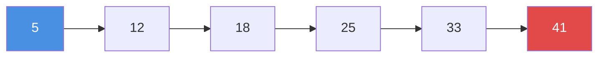
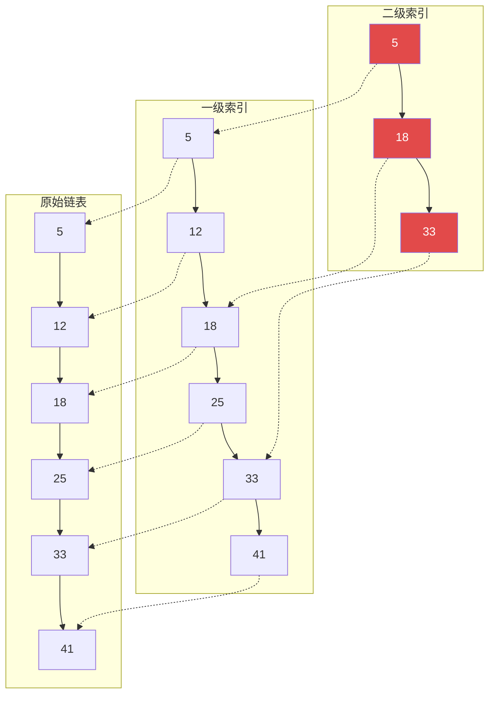
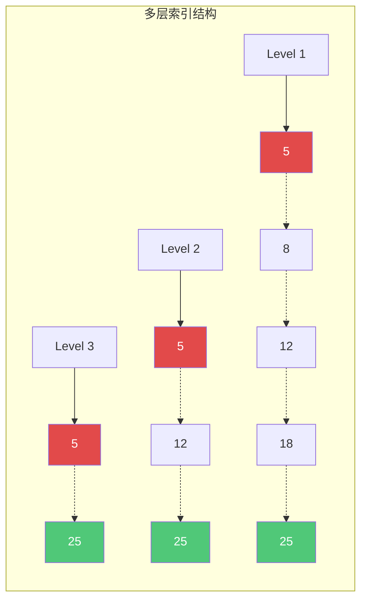
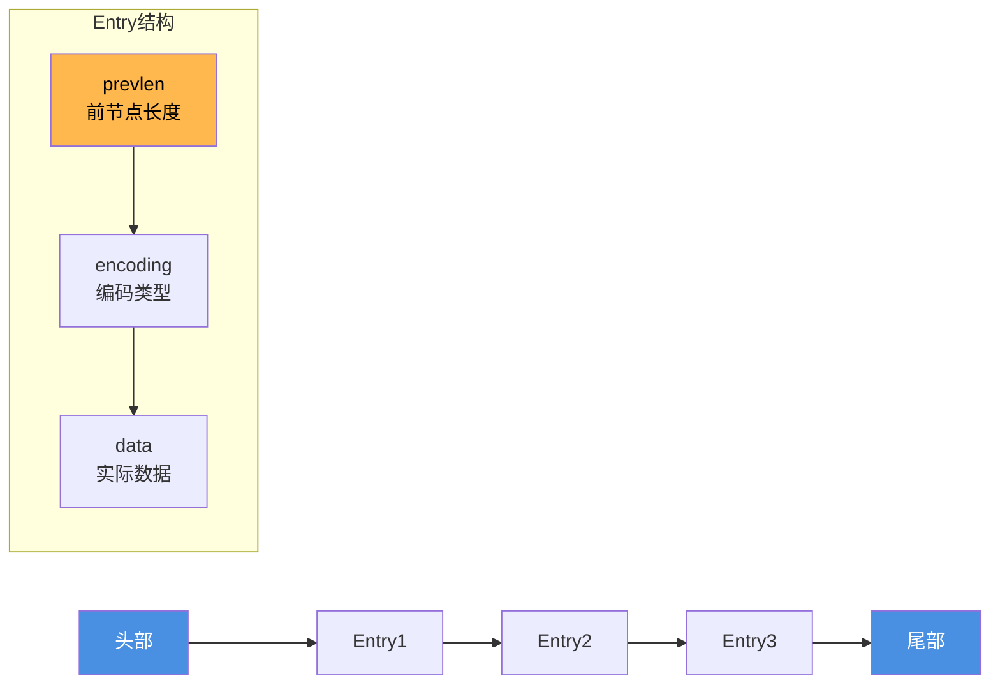
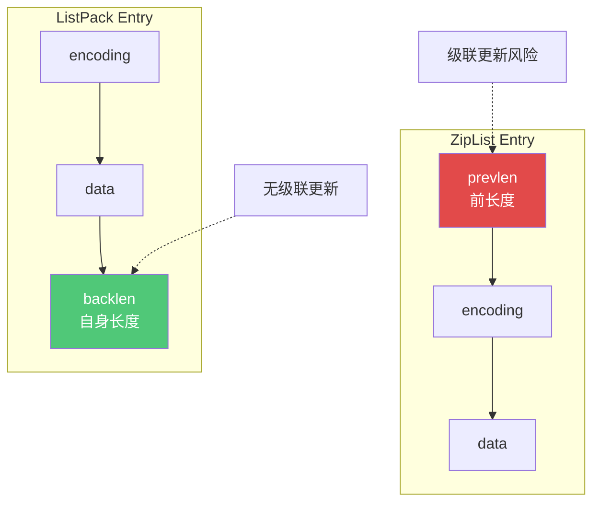
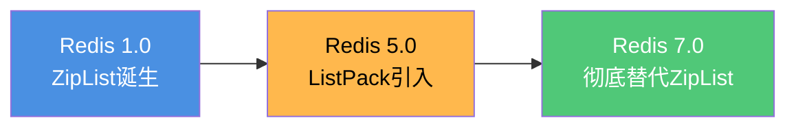
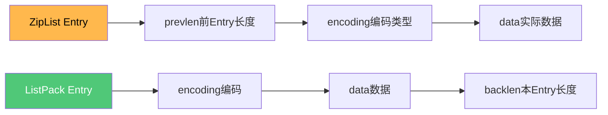

# Redis高级数据结构实现原理

## Hash结构的底层实现

### Redis Hash vs Java HashMap

Redis的Hash和Java的HashMap虽然都是哈希结构,但在设计上有显著差异。主要体现在三个方面:

#### 底层数据结构差异

**Redis Hash的实现:**

Redis的Hash底层基于ziplist(压缩列表)和hashtable实现,在Redis 6.0中ziplist被改为了listpack。系统会根据数据规模自动选择合适的结构:

- **小数据量**: 使用ziplist/listpack,内存紧凑
- **大数据量**: 使用hashtable,性能更优

触发条件(同时满足时使用ziplist):
- Hash中键值对数量 ≤ `hash-max-ziplist-entries`(默认512)
- 所有key和value的长度 ≤ `hash-max-ziplist-value`(默认64字节)

**Java HashMap的实现:**

Java HashMap采用数组+链表+红黑树的结构,当链表长度超过8且数组长度大于64时,链表会转换为红黑树。

#### 并发安全性

**Redis Hash**: 由于Redis本身是单线程执行命令,所有对Hash的操作天然线程安全。

**Java HashMap**: 本身不是线程安全的,多线程环境需要使用`ConcurrentHashMap`或`Collections.synchronizedMap()`。

#### 扩容机制

这是两者最大的差异之一。

**Redis的渐进式rehash:**

Redis采用平滑扩容方案,避免一次性迁移导致的请求延迟。缺点是在迁移期间内存占用翻倍。

**Java HashMap的一次性扩容:**

HashMap会一次性完成所有元素的迁移,优点是不占用过多空间,缺点是迁移过程会阻塞。但对于HashMap来说影响不大,因为通常存储的数据量较小。

## 渐进式rehash详解

### 为什么需要渐进式rehash

随着数据量增加,哈希表需要扩容以保持性能。传统的rehash会一次性迁移所有数据,在大数据量场景下可能导致:

- 长时间IO阻塞
- 请求延迟飙升
- 用户体验下降

Redis的渐进式rehash通过分步骤逐渐完成数据迁移,在提供服务的同时完成扩容,对性能影响最小化。

### 渐进式rehash的实现原理

**核心设计:**

Redis使用两个全局哈希表:

- **哈希表1**: 当前使用的主表
- **哈希表2**: 扩容时的目标表
- **rehashindex**: 记录当前rehash的位置,初始值为-1

### 渐进式rehash流程



**详细步骤:**

1. **初始阶段**: 数据存储在哈希表1中

2. **触发扩容**: 当元素个数等于数组长度时,创建容量翻倍的哈希表2

3. **渐进迁移**: 
   - 不会立即迁移所有数据
   - 每次增删改查操作时,从rehashindex开始迁移一个桶的数据
   - 迁移完成后rehashindex递增

4. **新增操作**: 在迁移期间,新增的数据直接写入哈希表2

5. **查询操作**: 
   - 先在哈希表1中查找
   - 未找到则在哈希表2中查找
   - 保证所有数据可查询

6. **完成扩容**: 
   - 哈希表1所有数据迁移完成
   - 交换两个哈希表的指针
   - 释放原哈希表1的内存

### 实战示例

```java
// 场景: 用户会话存储
// 初始状态: 哈希表1存储100个用户会话

// 新增第101个会话,触发扩容
HSET session:user:10086 token "abc123xyz"
// 1. 创建容量为200的哈希表2
// 2. 迁移rehashindex=0位置的桶到哈希表2
// 3. 将新数据写入哈希表2
// 4. rehashindex变为1

// 后续操作继续逐步迁移
HGET session:user:10001 token
// 1. 迁移rehashindex=1的桶
// 2. 在哈希表1和2中查找数据
// 3. rehashindex变为2

// 经过多次操作后,所有数据迁移完成
```

## ZSet有序集合的底层实现

### ZSet的数据结构演进

ZSet(Sorted Set)是Redis中非常重要的数据结构,它既能保持元素有序,又能快速查询。ZSet的底层实现经历了版本演进:

**Redis 7.0之前:**
- **小数据量**: ZipList(压缩列表)
- **大数据量**: SkipList(跳表) + Dict(字典)

**Redis 7.0之后:**
- **小数据量**: ListPack(紧凑列表)
- **大数据量**: SkipList(跳表) + Dict(字典)

ListPack完全替代了ZipList,解决了级联更新问题,成为小数据量场景的首选。

### SkipList + Dict 双引擎架构

当ZSet数据量较大时,Redis采用了创新的双数据结构设计:

```c
// ZSet的核心数据结构
typedef struct zset {
    dict *dict;        // 哈希表: member -> score映射
    zskiplist *zsl;    // 跳表: 按score有序存储
} zset;
```



**为什么需要两个数据结构?**

这种设计看似冗余,实际上是为了同时满足两种需求:

1. **Dict的作用**: 实现member到score的快速映射
   - 时间复杂度: O(1)
   - 使用场景: `ZSCORE key member` 获取元素分数

2. **SkipList的作用**: 维护元素的有序性
   - 时间复杂度: O(log N)
   - 使用场景: `ZRANGE`、`ZRANK` 等范围和排名查询

### 实战场景分析

```java
// 场景: 电商平台实时销量排行榜

// 1. 更新商品销量(使用Dict快速定位)
ZADD product:sales 15800 "iphone15"     // Dict: O(1)查找是否存在
ZADD product:sales 12500 "huawei_mate60" // SkipList: O(log N)插入有序位置

// 2. 获取指定商品销量(Dict优势)
ZSCORE product:sales "iphone15"  
// Dict直接映射: member -> score, O(1)时间复杂度
// 返回: 15800

// 3. 获取销量前10名(SkipList优势)
ZREVRANGE product:sales 0 9 WITHSCORES
// SkipList有序存储: 直接取前10个, O(log N + M)
// 返回: [("iphone15", 15800), ("huawei_mate60", 12500), ...]

// 4. 查询商品排名(SkipList优势)
ZREVRANK product:sales "iphone15"
// SkipList从高到低遍历计数: O(log N)
// 返回: 0 (第一名)
```

**性能对比:**

| 操作 | 使用Dict | 使用SkipList | ZSet实际实现 |
|------|---------|--------------|-------------|
| 获取score | O(1) ✓ | O(log N) | Dict - O(1) |
| 范围查询 | 无法实现 | O(log N + M) ✓ | SkipList - O(log N) |
| 获取排名 | 需遍历O(N) | O(log N) ✓ | SkipList - O(log N) |
| 插入元素 | O(1) | O(log N) | 两者都需更新 |

### 为什么ZSet要使用两种结构

### 内存占用对比

**ZipList的优势:**

ZipList是一种压缩的连续存储结构,类似数组:

- 元素紧密排列,内存局部性好
- 无需指针开销,内存占用极小
- 适合小规模数据存储

**SkipList的开销:**

跳表通过多层链表索引实现:

- 每个元素需要多个指针维护层级
- 内存开销显著大于ZipList
- 但查询性能更优

### 性能对比

**ZipList的性能特征:**

- 查找: O(N) - 需要遍历整个列表
- 插入: O(N) - 可能需要移动后续元素
- 删除: O(N) - 同样需要移动元素

**SkipList的性能特征:**

- 查找: O(log N) - 通过多级索引快速定位
- 插入: O(log N) - 找到位置后插入
- 删除: O(log N) - 找到位置后删除

### 切换策略

**使用ZipList的条件(同时满足):**

```
元素数量 ≤ 128  (配置: zset-max-ziplist-entries)
每个元素长度 ≤ 64字节  (配置: zset-max-ziplist-value)
```

**切换逻辑:**



**为什么这样设计:**

1. **小数据量场景**: N很小时,O(N)和O(log N)差距不大,ZipList的内存优势更重要

2. **大数据量场景**: N增大后,O(log N)的性能优势显著,值得牺牲额外的内存开销

3. **典型应用**: 
   - 小型排行榜(前100名): 使用ZipList节省内存
   - 大型排行榜(百万用户): 使用SkipList保证性能

### 跳表SkipList的原理

跳表是一种基于有序链表的多层索引结构,通过"空间换时间"的策略实现高效查询。

**传统有序链表的问题:**



查找元素25需要遍历: 5 → 12 → 18 → 25,时间复杂度O(N)

**跳表的多级索引优化:**



**查找25的过程:**

1. 从二级索引开始: 5 → 18 (发现25在18和33之间)
2. 下降到一级索引: 18 → 25 (找到目标)
3. 总共遍历4个节点,而不是5个

**跳表的性能特征:**

- 查找: O(log N)
- 插入: O(log N) - 查找位置 + 随机层级
- 删除: O(log N)
- 空间复杂度: O(N) - 需要额外的索引指针

### 实战案例

```java
// 场景1: 部门绩效考核系统(30人)
ZADD team:performance:202312 92.5 "emp:1001" 
ZADD team:performance:202312 88.5 "emp:1002"
ZADD team:performance:202312 95.0 "emp:1003"
// ... 添加30个员工
// 数据量小,使用ListPack,内存占用约3KB

// 获取绩效排名
ZREVRANGE team:performance:202312 0 4 WITHSCORES
// ListPack: O(N)遍历,但N=30,性能完全够用

// 场景2: 全国游戏排行榜(500万玩家)
ZADD game:ranking:global 158000 "player:uuid_abc123"
ZADD game:ranking:global 125000 "player:uuid_def456"
// ... 百万级玩家数据
// 自动转为SkipList+Dict,保证性能

// 获取玩家排名
ZREVRANK game:ranking:global "player:uuid_abc123"
// SkipList: O(log N),即使500万数据也只需log₂(5000000)≈22次比较

// 获取玩家分数
ZSCORE game:ranking:global "player:uuid_abc123"
// Dict: O(1),瞬间返回158000

// 获取前100名
ZREVRANGE game:ranking:global 0 99 WITHSCORES  
// SkipList: O(log N + 100),快速定位+取100个元素
```

## ZipList vs SkipList vs ListPack 全面对比

这三种数据结构都用于ZSet的实现,但各有优缺点。理解它们的差异对于选择合适的数据结构至关重要。

### 核心特征对比

| 特性 | SkipList(跳表) | ZipList(压缩列表) | ListPack(紧凑列表) |
|------|----------------|-----------------|------------------|
| **设计目标** | 高效范围查询和有序访问 | 内存紧凑,减少碎片 | 解决级联更新问题 |
| **内存布局** | 多层链表结构 | 连续内存块 | 连续内存块 |
| **查询复杂度** | **O(log N)** ✓ | O(N) | O(N) |
| **插入复杂度** | O(log N) | O(1)~O(N²) 级联更新 | **O(1) 无级联更新** ✓ |
| **删除复杂度** | O(log N) | O(1)~O(N²) 级联更新 | **O(1) 无级联更新** ✓ |
| **内存占用** | 高(有指针开销) | 低 | **极低** ✓ |
| **版本支持** | 所有版本 | Redis ≤6.2 | **Redis ≥5.0 (7.0+默认)** |
| **核心优势** | 高效有序访问 | 小数据内存优化 | 无级联更新+内存紧凑 |
| **主要缺点** | **内存占用高** | **级联更新** | 范围查询效率低 |
| **应用场景** | 有序集合(ZSet)大数据 | 小规模Hash/Set/ZSet | 全类型小规模存储 |

### SkipList - 跳表详解

**数据结构:**



**优势:**
- 查询、插入、删除均为O(log N),性能稳定
- 天然支持范围查询
- 实现简单,比平衡树更易维护

**缺点:**
- 每个节点需要多个指针(平均64字节额外开销)
- 内存局部性较差,缓存命中率低

### ZipList - 压缩列表详解

**数据结构:**



**优势:**
- 内存连续分配,缓存命中率高
- 无指针开销,内存占用极小
- 小数据集性能优秀

**缺点(级联更新):**

```java
// 场景: 订单商品列表
// 初始状态: [商品A(50字节), 商品B(60字节), 商品C(70字节)]

// 插入大商品到中间
LINSERT order:items BEFORE "商品B" "超大套装(300字节)"

// 问题:
// 1. 商品B的prevlen需要从1字节扩展到5字节(因为前节点300>254)
// 2. 商品B长度变成64字节,商品C的prevlen也需要扩展
// 3. 形成连锁反应,性能O(N²)
```

### ListPack - 紧凑列表详解

**数据结构创新:**



**关键优化:**

1. **废弃prevlen**: 不再记录前节点长度,根绝级联更新源头
2. **增backlen**: 在末尾记录自身长度,支持反向遍历
3. **变长编码**: backlen使用1-5字节,灵活适应不同大小

**性能对比:**

```java
// 场景: 频繁插入删除操作

// ZipList: 最坏情况O(N²)
LPUSH product:attrs "color:red"      // 可能触发级联更新
LPUSH product:attrs "size:large"    // 可能触发级联更新
LPUSH product:attrs "brand:nike"    // 可能触发级联更新

// ListPack: 稳定O(1)
LPUSH product:attrs:v2 "color:red"   // 只影响自身,无连锁
LPUSH product:attrs:v2 "size:large"  // 只影响自身,无连锁
LPUSH product:attrs:v2 "brand:nike"  // 只影响自身,无连锁
```

### 版本演进时间线



**重要里程碑:**

- **Redis 5.0**: ListPack首次亮相,但仅用于Stream数据类型
- **Redis 7.0**: ListPack成为主流,ZSet/Hash/List全部采用
- **当前Redis**: ZipList已成为历史,不再推荐使用

### 选型建议

**使用SkipList的场景:**

```java
// 1. 大量数据(>128元素)
ZADD global:leaderboard 95000 "player:1" 
// ... 10万个玩家
// 自动使用SkipList

// 2. 频繁范围查询
ZRANGEBYSCORE global:leaderboard 80000 100000
// SkipList的O(log N)优势明显

// 3. 需要排名功能
ZRANK global:leaderboard "player:1"
// SkipList高效计算排名
```

**使用ListPack的场景:**

```java
// 1. 小量数据(<128元素)
ZADD dept:ranking 92 "emp:1001"
ZADD dept:ranking 88 "emp:1002"
// ... 30个员工
// 自动使用ListPack,节省内存

// 2. 内存敏感场景
HSET user:session:10086 token "abc" expire "3600"
// ListPack内存占用只有SkipList的20%-30%

// 3. 少量增删操作
LPUSH order:logs "log1" "log2" "log3"
// ListPack无级联更新,性能稳定
```

### 性能测试对比

| 操作 | 100元素 | 1000元素 | 10000元素 |
|------|---------|----------|----------|
| **SkipList插入** | 7 次比较 | 10 次比较 | 13 次比较 |
| **ListPack插入** | 50 次移动 | 500 次移动 | 5000 次移动 |
| **SkipList查询** | O(7) | O(10) | O(13) |
| **ListPack查询** | O(100) | O(1000) | O(10000) |
| **SkipList内存** | ~10KB | ~100KB | ~1MB |
| **ListPack内存** | ~2KB | ~20KB | ~200KB |

**结论:**
- 元素数量少于128: ListPack综合性能更优
- 元素数量超过128: SkipList性能优势显著
- 临界点128是Redis经过大量测试优化的结果

### ZipList的级联更新问题

ZipList的每个Entry包含一个`prevlen`字段,记录前一个Entry的长度。这个字段可能占用1个或5个字节:

- 前一个Entry长度 < 254字节: prevlen占1字节
- 前一个Entry长度 ≥ 254字节: prevlen占5字节

**级联更新问题:**

当在ZipList中间插入一个较大的Entry时:

1. 后一个Entry的prevlen需要从1字节扩展到5字节
2. 导致该Entry长度增加4字节
3. 可能触发下一个Entry的prevlen也需要扩展
4. 形成连锁反应,多个Entry都需要调整

这会导致性能急剧下降。

### ListPack如何解决

Redis 5.0引入ListPack替代ZipList,核心改动:

**废弃prevlen,改用backlen:**

- 每个Entry末尾记录自己的总长度
- 使用1-5个字节的变长编码
- 位于Entry末尾而非开头



**优势:**

1. **无级联更新**: 每个Entry只记录自己的长度,插入删除只影响自身
2. **向后遍历支持**: 通过backlen可以反向遍历
3. **性能稳定**: 避免了最坏情况下的O(N²)复杂度

## ListPack的级联更新解决方案

### ZipList的级联更新问题

ZipList的每个Entry包含一个`prevlen`字段,记录前一个Entry的长度。这个字段可能占用1个或5个字节:

- 前一个Entry长度 < 254字节: prevlen占1字节
- 前一个Entry长度 ≥ 254字节: prevlen占5字节

**级联更新问题:**

当在ZipList中间插入一个较大的Entry时:

1. 后一个Entry的prevlen需要从1字节扩展到5字节
2. 导致该Entry长度增加4字节
3. 可能触发下一个Entry的prevlen也需要扩展
4. 形成连锁反应,多个Entry都需要调整

这会导致性能急剧下降。

### ListPack如何解决

Redis 5.0引入ListPack替代ZipList,核心改动:

**废弃prevlen,改用backlen:**

- 每个Entry末尾记录自己的总长度
- 使用1-5个字节的变长编码
- 位于Entry末尾而非开头


**优势:**

1. **无级联更新**: 每个Entry只记录自己的长度,插入删除只影响自身
2. **向后遍历支持**: 通过backlen可以反向遍历
3. **性能稳定**: 避免了最坏情况下的O(N²)复杂度

### 应用场景

```java
// 场景: 订单商品列表
// 使用ListPack存储,频繁增删商品不会触发级联更新

// 添加商品
LPUSH order:items:20231201001 "商品A:1件:99元"
LPUSH order:items:20231201001 "商品B:2件:158元"

// 中间插入商品
LINSERT order:items:20231201001 BEFORE "商品B:2件:158元" "商品C:1件:299元"

// ListPack优势: 插入只影响新Entry本身,不会连锁更新其他Entry
```

通过这些精妙的数据结构设计,Redis在内存效率和性能之间实现了完美平衡。

