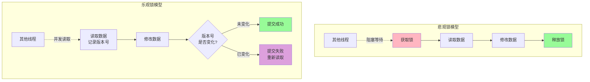
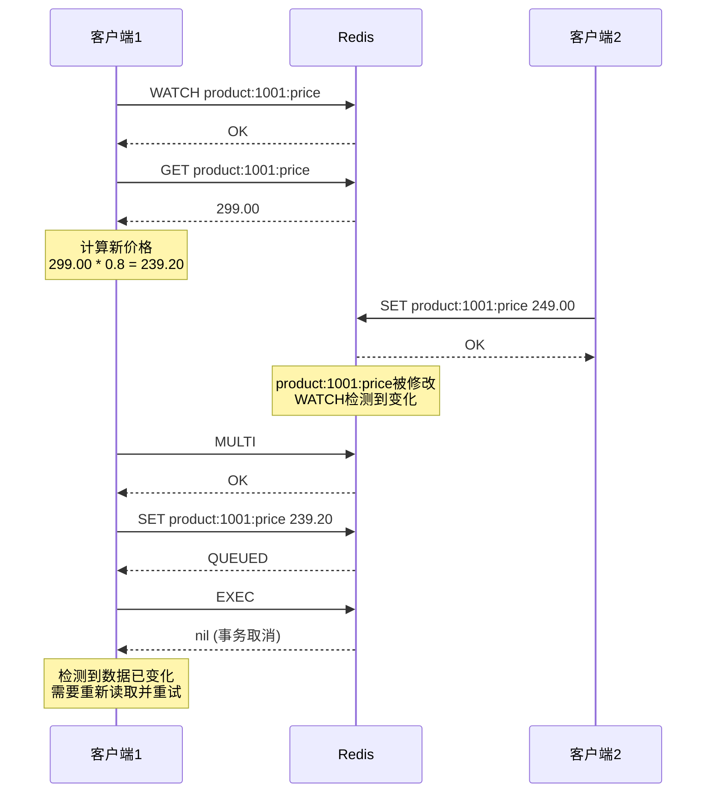
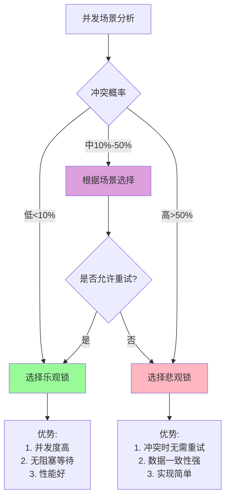

# Redis乐观锁机制与并发控制

## 乐观锁的核心思想

在并发编程中,锁机制分为悲观锁和乐观锁两大类。悲观锁假设冲突总会发生,因此在操作数据前先加锁。而乐观锁则假设冲突很少发生,在更新数据时才检查是否有冲突。

### 乐观锁与悲观锁的对比



**核心区别:**

| 特性 | 悲观锁 | 乐观锁 |
|------|--------|--------|
| 冲突假设 | 假设冲突频繁发生 | 假设冲突很少发生 |
| 并发性能 | 串行化执行,并发度低 | 允许并发读写,并发度高 |
| 实现机制 | 加锁(分布式锁、数据库锁) | 版本号或时间戳 |
| 适用场景 | 写冲突频繁的场景 | 读多写少的场景 |
| 典型应用 | 库存扣减、订单支付 | 商品信息更新、用户资料编辑 |

### 乐观锁的实现原理

乐观锁的核心是**CAS(Compare And Swap)**机制:

1. **读取数据时**:记录数据的当前版本(版本号或时间戳)
2. **修改数据**:在应用层完成数据修改
3. **提交更新时**:比较当前版本与读取时的版本是否一致
   - 如果一致,说明没有其他线程修改过数据,提交成功
   - 如果不一致,说明数据已被修改,提交失败,需要重新读取

**伪代码示例:**

```java
// 乐观锁的典型流程
while (true) {
    // 1. 读取数据及其版本号
    Data data = readData(key);
    int oldVersion = data.getVersion();
    
    // 2. 基于读取的数据进行业务处理
    Data newData = processBusinessLogic(data);
    int newVersion = oldVersion + 1;
    
    // 3. 尝试更新,只有版本号未变时才更新成功
    boolean success = compareAndSwap(key, oldVersion, newVersion, newData);
    
    if (success) {
        // 更新成功,退出循环
        break;
    } else {
        // 更新失败,重新读取并重试
        continue;
    }
}
```

## Redis的WATCH命令实现乐观锁

Redis提供了WATCH命令来实现乐观锁机制。WATCH可以监视一个或多个键,在事务执行时检查这些键是否被修改过。

### WATCH命令的工作原理



**关键点:**

1. **WATCH命令**:标记需要监控的键,直到EXEC命令执行
2. **监控期间**:如果被监控的键被其他客户端修改,WATCH会检测到变化
3. **事务执行**:执行EXEC时,如果监控的键被修改过,返回nil,事务不执行
4. **UNWATCH命令**:取消对所有键的监控

### 基本使用示例

```bash
# 客户端1的操作流程
WATCH inventory:product:2001
GET inventory:product:2001
# 假设返回: "100"

MULTI
SET inventory:product:2001 "95"  # 扣减5个库存
EXEC
# 如果期间没有其他客户端修改,返回: 1) OK
# 如果期间有其他客户端修改,返回: nil
```

### Java实现乐观锁

使用Jedis客户端实现基于WATCH的乐观锁:

```java
import redis.clients.jedis.Jedis;
import redis.clients.jedis.Transaction;

public class RedisOptimisticLock {
    private Jedis jedis;
    
    public RedisOptimisticLock(Jedis jedis) {
        this.jedis = jedis;
    }
    
    /**
     * 使用乐观锁更新商品库存
     * @param productId 商品ID
     * @param quantity 扣减数量
     * @return 是否扣减成功
     */
    public boolean deductStock(String productId, int quantity) {
        String stockKey = "inventory:product:" + productId;
        int maxRetries = 3;  // 最大重试次数
        
        for (int i = 0; i < maxRetries; i++) {
            try {
                // 1. 监控库存键
                jedis.watch(stockKey);
                
                // 2. 读取当前库存
                String stockStr = jedis.get(stockKey);
                if (stockStr == null) {
                    jedis.unwatch();
                    return false;  // 商品不存在
                }
                
                int currentStock = Integer.parseInt(stockStr);
                
                // 3. 检查库存是否足够
                if (currentStock < quantity) {
                    jedis.unwatch();
                    System.out.println("库存不足: 当前库存=" + currentStock);
                    return false;
                }
                
                // 4. 开启事务
                Transaction tx = jedis.multi();
                
                // 5. 执行库存扣减
                int newStock = currentStock - quantity;
                tx.set(stockKey, String.valueOf(newStock));
                
                // 6. 提交事务
                if (tx.exec() != null) {
                    // 事务执行成功
                    System.out.println("库存扣减成功: " + currentStock + " -> " + newStock);
                    return true;
                } else {
                    // 事务执行失败,说明库存被其他客户端修改,进行重试
                    System.out.println("检测到并发修改,进行第 " + (i + 1) + " 次重试");
                }
            } catch (Exception e) {
                jedis.unwatch();
                e.printStackTrace();
                return false;
            }
        }
        
        System.out.println("重试次数超过限制,操作失败");
        return false;
    }
}
```

**使用示例:**

```java
public class StockService {
    public static void main(String[] args) {
        Jedis jedis = new Jedis("localhost", 6379);
        
        // 初始化商品库存
        jedis.set("inventory:product:1001", "100");
        
        RedisOptimisticLock lock = new RedisOptimisticLock(jedis);
        
        // 模拟并发扣减库存
        Thread t1 = new Thread(() -> {
            boolean success = lock.deductStock("1001", 5);
            System.out.println("线程1扣减结果: " + success);
        });
        
        Thread t2 = new Thread(() -> {
            boolean success = lock.deductStock("1001", 8);
            System.out.println("线程2扣减结果: " + success);
        });
        
        t1.start();
        t2.start();
        
        try {
            t1.join();
            t2.join();
        } catch (InterruptedException e) {
            e.printStackTrace();
        }
        
        // 查看最终库存
        String finalStock = jedis.get("inventory:product:1001");
        System.out.println("最终库存: " + finalStock);  // 应该是87
        
        jedis.close();
    }
}
```

### 实现自增操作的乐观锁

假设Redis没有提供INCR命令,我们可以使用WATCH来实现原子性的自增操作:

```java
public class OptimisticIncrement {
    private Jedis jedis;
    
    public OptimisticIncrement(Jedis jedis) {
        this.jedis = jedis;
    }
    
    /**
     * 使用乐观锁实现计数器自增
     * @param counterKey 计数器键名
     * @param increment 增量
     * @return 自增后的值
     */
    public Integer incrementCounter(String counterKey, int increment) {
        while (true) {
            try {
                // 1. 监控计数器
                jedis.watch(counterKey);
                
                // 2. 读取当前值
                String currentValueStr = jedis.get(counterKey);
                int currentValue = (currentValueStr == null) ? 0 : Integer.parseInt(currentValueStr);
                
                // 3. 计算新值
                int newValue = currentValue + increment;
                
                // 4. 开启事务并更新
                Transaction tx = jedis.multi();
                tx.set(counterKey, String.valueOf(newValue));
                
                // 5. 尝试提交
                if (tx.exec() != null) {
                    // 提交成功,返回新值
                    return newValue;
                } else {
                    // 提交失败,自动重试
                    System.out.println("检测到并发修改,自动重试...");
                }
            } catch (Exception e) {
                jedis.unwatch();
                throw new RuntimeException("自增操作失败", e);
            }
        }
    }
}
```

**应用场景:**

```java
// 场景:统计文章浏览量
public class ArticleViewCounter {
    private OptimisticIncrement counter;
    
    public void recordView(String articleId) {
        String viewKey = "article:views:" + articleId;
        
        // 每次浏览,浏览量+1
        Integer newViews = counter.incrementCounter(viewKey, 1);
        
        System.out.println("文章 " + articleId + " 的浏览量: " + newViews);
    }
}
```

## WATCH命令的高级应用

### 多键监控

WATCH支持同时监控多个键,适用于需要保证多个数据一致性的场景:

```java
/**
 * 场景:转账操作,需要同时监控两个账户
 */
public boolean transfer(String fromAccount, String toAccount, int amount) {
    String fromKey = "account:balance:" + fromAccount;
    String toKey = "account:balance:" + toAccount;
    
    try {
        // 同时监控两个账户
        jedis.watch(fromKey, toKey);
        
        // 读取两个账户的余额
        String fromBalanceStr = jedis.get(fromKey);
        String toBalanceStr = jedis.get(toKey);
        
        if (fromBalanceStr == null || toBalanceStr == null) {
            jedis.unwatch();
            return false;
        }
        
        int fromBalance = Integer.parseInt(fromBalanceStr);
        int toBalance = Integer.parseInt(toBalanceStr);
        
        // 检查余额是否足够
        if (fromBalance < amount) {
            jedis.unwatch();
            System.out.println("余额不足");
            return false;
        }
        
        // 开启事务
        Transaction tx = jedis.multi();
        
        // 扣减转出账户
        tx.set(fromKey, String.valueOf(fromBalance - amount));
        
        // 增加转入账户
        tx.set(toKey, String.valueOf(toBalance + amount));
        
        // 执行事务
        if (tx.exec() != null) {
            System.out.println("转账成功: " + fromAccount + " -> " + toAccount + ", 金额: " + amount);
            return true;
        } else {
            System.out.println("检测到并发修改,转账失败");
            return false;
        }
    } catch (Exception e) {
        jedis.unwatch();
        e.printStackTrace();
        return false;
    }
}
```

### UNWATCH命令

如果在开启事务前需要取消监控,可以使用UNWATCH命令:

```java
public void complexOperation(String key) {
    try {
        // 开始监控
        jedis.watch(key);
        
        // 执行一些检查逻辑
        String value = jedis.get(key);
        
        if (!isValid(value)) {
            // 检查不通过,取消监控,不执行事务
            jedis.unwatch();
            System.out.println("数据校验失败,取消操作");
            return;
        }
        
        // 检查通过,开启事务
        Transaction tx = jedis.multi();
        tx.set(key, processValue(value));
        tx.exec();
        
    } catch (Exception e) {
        jedis.unwatch();
        e.printStackTrace();
    }
}

private boolean isValid(String value) {
    // 数据校验逻辑
    return value != null && !value.isEmpty();
}

private String processValue(String value) {
    // 数据处理逻辑
    return value.toUpperCase();
}
```

## 乐观锁的实际应用场景

### 场景1:商品秒杀库存扣减

```java
public class SeckillService {
    private Jedis jedis;
    
    /**
     * 秒杀商品库存扣减
     * @param activityId 活动ID
     * @param userId 用户ID
     * @return 是否秒杀成功
     */
    public boolean seckill(String activityId, String userId) {
        String stockKey = "seckill:" + activityId + ":stock";
        String orderKey = "seckill:" + activityId + ":orders";
        String userRecordKey = "seckill:" + activityId + ":user:" + userId;
        
        int maxRetries = 5;
        
        for (int i = 0; i < maxRetries; i++) {
            try {
                // 监控库存键
                jedis.watch(stockKey);
                
                // 检查用户是否已参与
                if (jedis.exists(userRecordKey)) {
                    jedis.unwatch();
                    System.out.println("用户已参与过此活动");
                    return false;
                }
                
                // 读取当前库存
                String stockStr = jedis.get(stockKey);
                if (stockStr == null) {
                    jedis.unwatch();
                    return false;
                }
                
                int currentStock = Integer.parseInt(stockStr);
                
                // 库存不足
                if (currentStock <= 0) {
                    jedis.unwatch();
                    System.out.println("库存已售罄");
                    return false;
                }
                
                // 开启事务
                Transaction tx = jedis.multi();
                
                // 扣减库存
                tx.decr(stockKey);
                
                // 记录订单
                String orderInfo = userId + ":" + System.currentTimeMillis();
                tx.sadd(orderKey, orderInfo);
                
                // 标记用户已参与
                tx.setex(userRecordKey, 86400, "1");  // 24小时过期
                
                // 执行事务
                if (tx.exec() != null) {
                    System.out.println("秒杀成功! 用户: " + userId + ", 剩余库存: " + (currentStock - 1));
                    return true;
                } else {
                    System.out.println("并发冲突,第 " + (i + 1) + " 次重试");
                }
            } catch (Exception e) {
                jedis.unwatch();
                e.printStackTrace();
                return false;
            }
        }
        
        System.out.println("秒杀失败,请稍后重试");
        return false;
    }
}
```

### 场景2:用户积分更新

```java
public class PointsService {
    private Jedis jedis;
    
    /**
     * 用户完成任务获得积分
     * @param userId 用户ID
     * @param taskId 任务ID
     * @param points 获得的积分
     * @return 是否更新成功
     */
    public boolean addPoints(String userId, String taskId, int points) {
        String pointsKey = "user:" + userId + ":points";
        String taskRecordKey = "user:" + userId + ":completed:task:" + taskId;
        
        while (true) {
            try {
                // 监控积分键
                jedis.watch(pointsKey);
                
                // 检查任务是否已完成
                if (jedis.exists(taskRecordKey)) {
                    jedis.unwatch();
                    System.out.println("任务已完成,不能重复获得积分");
                    return false;
                }
                
                // 读取当前积分
                String currentPointsStr = jedis.get(pointsKey);
                int currentPoints = (currentPointsStr == null) ? 0 : Integer.parseInt(currentPointsStr);
                
                // 计算新积分
                int newPoints = currentPoints + points;
                
                // 开启事务
                Transaction tx = jedis.multi();
                
                // 更新积分
                tx.set(pointsKey, String.valueOf(newPoints));
                
                // 记录任务完成状态
                tx.set(taskRecordKey, String.valueOf(System.currentTimeMillis()));
                
                // 执行事务
                if (tx.exec() != null) {
                    System.out.println("积分更新成功: " + currentPoints + " -> " + newPoints);
                    return true;
                } else {
                    // 冲突,自动重试
                    System.out.println("检测到并发修改,自动重试...");
                }
            } catch (Exception e) {
                jedis.unwatch();
                e.printStackTrace();
                return false;
            }
        }
    }
}
```

### 场景3:商品信息更新

```java
public class ProductService {
    private Jedis jedis;
    
    /**
     * 更新商品信息(使用乐观锁防止覆盖其他人的修改)
     * @param productId 商品ID
     * @param newInfo 新的商品信息
     * @return 是否更新成功
     */
    public boolean updateProductInfo(String productId, String newInfo) {
        String productKey = "product:info:" + productId;
        String versionKey = "product:version:" + productId;
        
        int maxRetries = 3;
        
        for (int i = 0; i < maxRetries; i++) {
            try {
                // 监控商品信息和版本号
                jedis.watch(productKey, versionKey);
                
                // 读取当前版本
                String versionStr = jedis.get(versionKey);
                long currentVersion = (versionStr == null) ? 0 : Long.parseLong(versionStr);
                
                // 读取当前商品信息
                String currentInfo = jedis.get(productKey);
                
                System.out.println("读取到的版本: " + currentVersion);
                System.out.println("当前商品信息: " + currentInfo);
                
                // 开启事务
                Transaction tx = jedis.multi();
                
                // 更新商品信息
                tx.set(productKey, newInfo);
                
                // 版本号+1
                tx.set(versionKey, String.valueOf(currentVersion + 1));
                
                // 执行事务
                if (tx.exec() != null) {
                    System.out.println("商品信息更新成功,版本: " + currentVersion + " -> " + (currentVersion + 1));
                    return true;
                } else {
                    System.out.println("检测到其他用户的修改,第 " + (i + 1) + " 次重试");
                }
            } catch (Exception e) {
                jedis.unwatch();
                e.printStackTrace();
                return false;
            }
        }
        
        System.out.println("更新失败,请刷新页面后重试");
        return false;
    }
}
```

## 乐观锁与悲观锁的选择

### 性能对比



### 选择建议

**使用乐观锁的场景:**

1. **读多写少**:如商品信息更新、用户资料编辑
2. **冲突概率低**:如点赞、浏览量统计
3. **允许失败重试**:如秒杀(可以提示用户重试)
4. **性能要求高**:需要高并发处理能力

**使用悲观锁的场景:**

1. **写冲突频繁**:如热门商品的库存扣减
2. **不允许失败**:如支付、转账等金融操作
3. **操作耗时长**:业务逻辑复杂,不适合频繁重试
4. **强一致性要求**:必须保证数据的绝对一致性

### 混合策略

在实际应用中,可以结合两种锁的优势:

```java
public class HybridLockStrategy {
    private Jedis jedis;
    
    /**
     * 混合锁策略:先尝试乐观锁,失败后降级为悲观锁
     */
    public boolean updateWithHybridLock(String key, String newValue) {
        // 第一阶段:尝试乐观锁(快速路径)
        for (int i = 0; i < 3; i++) {
            if (tryOptimisticUpdate(key, newValue)) {
                System.out.println("乐观锁更新成功");
                return true;
            }
        }
        
        // 第二阶段:降级为悲观锁(可靠路径)
        System.out.println("乐观锁重试失败,切换为悲观锁");
        return tryPessimisticUpdate(key, newValue);
    }
    
    private boolean tryOptimisticUpdate(String key, String newValue) {
        try {
            jedis.watch(key);
            String current = jedis.get(key);
            
            Transaction tx = jedis.multi();
            tx.set(key, newValue);
            
            return tx.exec() != null;
        } catch (Exception e) {
            jedis.unwatch();
            return false;
        }
    }
    
    private boolean tryPessimisticUpdate(String key, String newValue) {
        String lockKey = "lock:" + key;
        String requestId = UUID.randomUUID().toString();
        
        try {
            // 获取分布式锁
            String result = jedis.set(lockKey, requestId, "NX", "EX", 10);
            
            if ("OK".equals(result)) {
                // 在锁的保护下更新数据
                jedis.set(key, newValue);
                return true;
            }
            return false;
        } finally {
            // 释放锁
            releaseLock(lockKey, requestId);
        }
    }
    
    private void releaseLock(String lockKey, String requestId) {
        String script = 
            "if redis.call('get', KEYS[1]) == ARGV[1] then " +
            "  return redis.call('del', KEYS[1]) " +
            "else " +
            "  return 0 " +
            "end";
        
        jedis.eval(script, 
            Collections.singletonList(lockKey), 
            Collections.singletonList(requestId)
        );
    }
}
```

## 乐观锁的注意事项

### 1. ABA问题

**问题描述:**  
值从A变为B,再变回A,乐观锁可能无法检测到这种变化。

**解决方案:**  
使用版本号而不是直接比较值:

```java
// 不推荐:直接比较值
WATCH balance
GET balance  // 返回100
MULTI
SET balance 95
EXEC  // 如果期间值变为90再变回100,无法检测

// 推荐:使用版本号
WATCH balance, balance_version
GET balance  // 返回100
GET balance_version  // 返回5
MULTI
SET balance 95
SET balance_version 6  // 版本号递增
EXEC  // 即使值变回100,版本号变化也能检测到
```

### 2. 重试次数限制

**问题描述:**  
在高并发场景下,无限重试可能导致性能下降甚至死循环。

**解决方案:**  
设置最大重试次数,超过后返回失败:

```java
public boolean updateWithRetryLimit(String key, String newValue) {
    int maxRetries = 5;  // 最大重试5次
    
    for (int i = 0; i < maxRetries; i++) {
        if (tryOptimisticUpdate(key, newValue)) {
            return true;
        }
        
        // 可选:添加退避策略
        try {
            Thread.sleep((long) Math.pow(2, i) * 10);  // 指数退避
        } catch (InterruptedException e) {
            Thread.currentThread().interrupt();
            return false;
        }
    }
    
    return false;  // 超过重试次数,返回失败
}
```

### 3. WATCH的自动取消

**注意事项:**  
WATCH会在以下情况自动取消:

1. 执行EXEC或DISCARD命令后
2. 客户端连接断开时
3. 执行UNWATCH命令后

**最佳实践:**  
始终在finally块中调用UNWATCH,确保资源释放:

```java
try {
    jedis.watch(key);
    // 业务逻辑
    Transaction tx = jedis.multi();
    tx.set(key, value);
    tx.exec();
} catch (Exception e) {
    e.printStackTrace();
} finally {
    jedis.unwatch();  // 确保取消监控
}
```

## 最佳实践总结

1. **合理选择锁类型**:根据冲突概率和业务特性选择乐观锁或悲观锁
2. **限制重试次数**:避免无限重试导致的性能问题
3. **使用版本号**:防止ABA问题
4. **添加退避策略**:重试时使用指数退避,减少资源竞争
5. **及时释放资源**:确保在finally块中调用UNWATCH
6. **监控失败率**:监控乐观锁的失败率,及时调整策略
7. **考虑降级方案**:乐观锁重试失败后,考虑降级为悲观锁
8. **合理设置超时**:在事务中设置合理的执行超时时间

通过合理使用Redis的WATCH命令实现乐观锁,可以在保证数据一致性的同时,获得更高的并发性能。在实际应用中,需要根据具体场景权衡乐观锁和悲观锁的选择,必要时可以采用混合策略以获得最佳效果。
