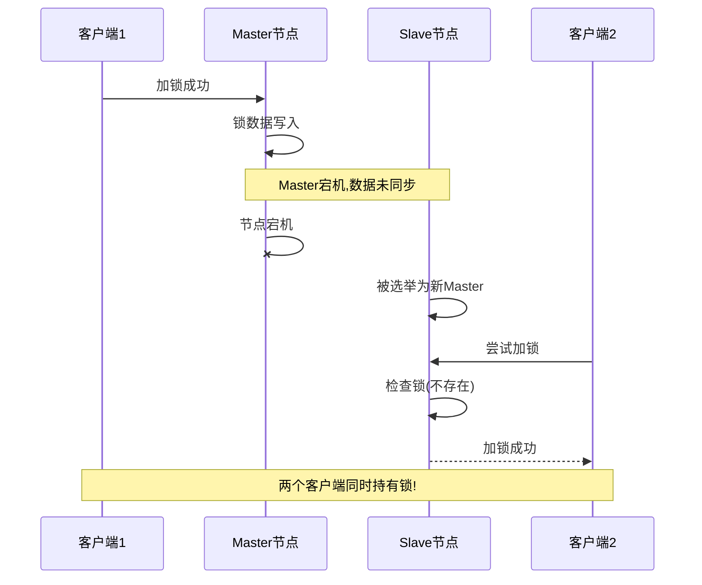
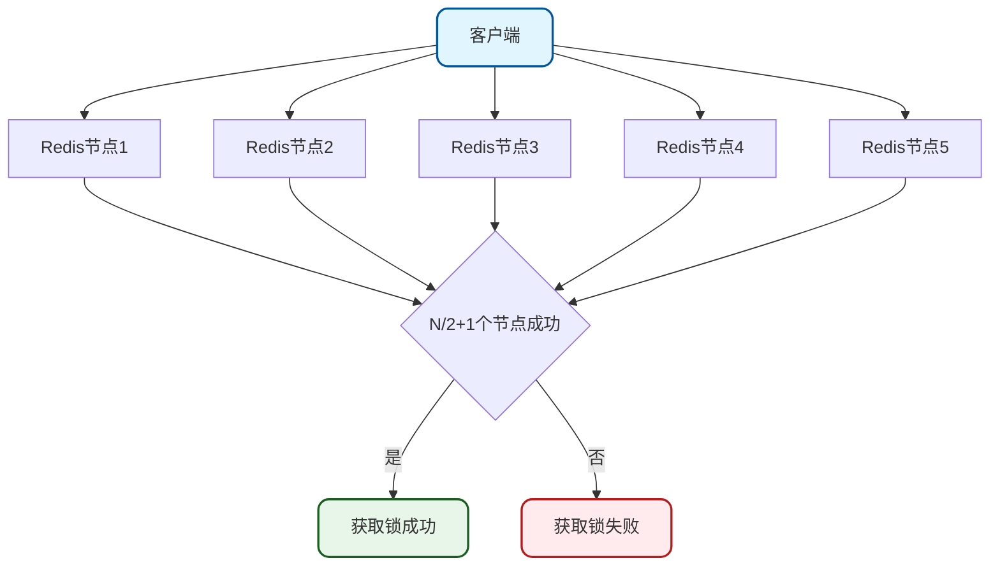
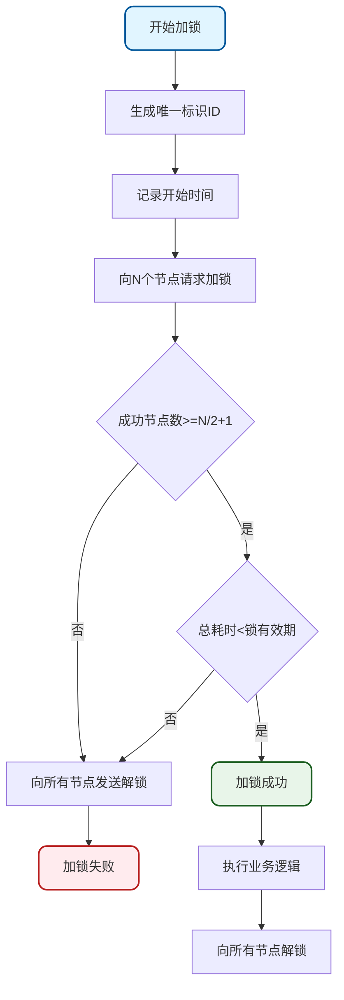
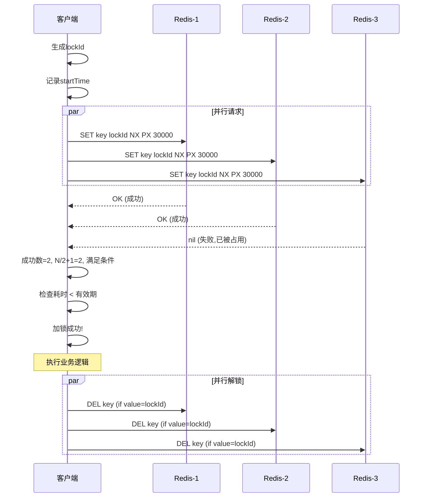
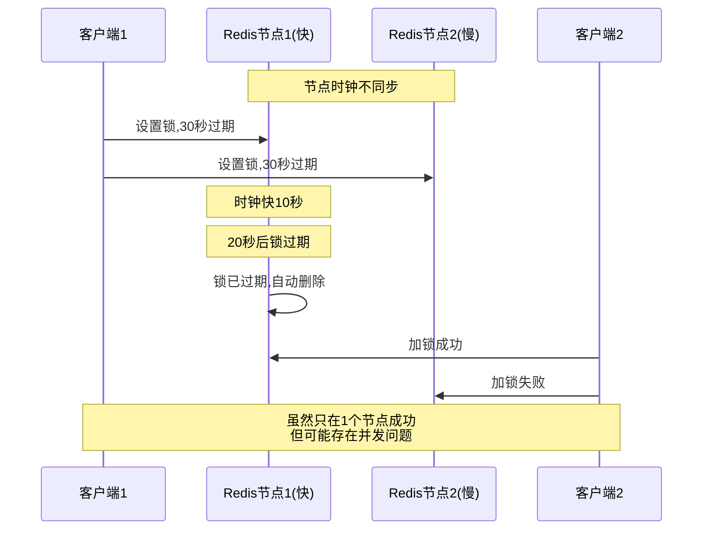
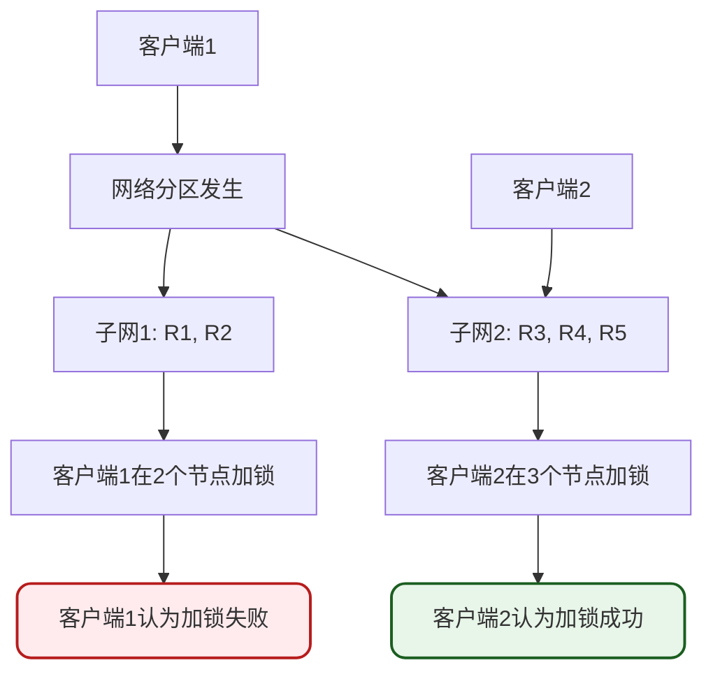
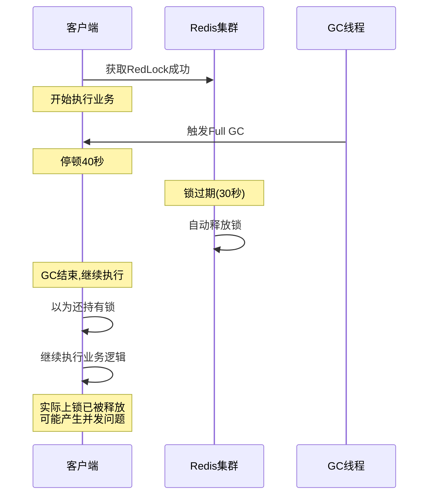
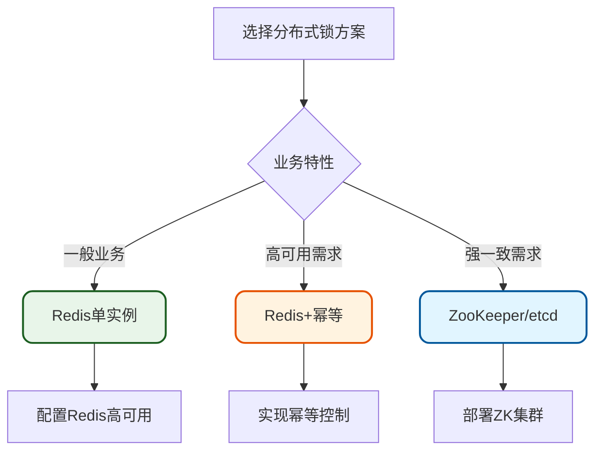

# RedLock算法原理与实践

## RedLock算法概述

RedLock是Redis作者Antirez提出的一种多节点分布式锁算法,旨在解决单节点Redis分布式锁存在的单点故障问题。

官方文档: [https://redis.io/docs/manual/patterns/distributed-locks/](https://redis.io/docs/manual/patterns/distributed-locks/)

### 单节点Redis的问题

在使用单节点Redis实现分布式锁时,存在以下风险:

**问题一: 单点故障**

如果Redis实例宕机,所有依赖该实例的客户端都无法获取锁,导致系统不可用。

**问题二: 主从同步延迟**



时序说明:
1. 客户端1在Master节点加锁成功
2. Master节点宕机,锁数据未同步到Slave
3. Slave被选举为新Master
4. 客户端2在新Master上加锁成功
5. 出现两个客户端同时持有锁的情况

### RedLock解决方案

RedLock通过引入多个独立的Redis节点来提供容错能力:



## RedLock算法流程

### 加锁流程



### 详细步骤说明

**步骤1: 生成唯一标识**

客户端生成全局唯一ID(建议使用时间戳+随机数):

```java
String lockId = System.currentTimeMillis() + "-" + UUID.randomUUID();
```

**步骤2: 向所有节点请求加锁**

使用相同的key和唯一ID向所有Redis节点发送SETNX命令:

```
SET lockKey lockId NX PX 30000
```

**步骤3: 统计成功节点数**

记录在所有节点上加锁成功的数量,同时记录总耗时。

**步骤4: 判断加锁是否成功**

满足以下两个条件才算加锁成功:
1. 成功获取锁的节点数 >= N/2 + 1
2. 总耗时 < 锁的有效期

**步骤5: 处理失败情况**

如果加锁失败,向所有节点(包括加锁成功的)发送解锁命令。

### 三节点示例



## Redisson中的RedLock实现

### 代码示例

```java
@Configuration
public class RedLockConfiguration {
    
    @Bean
    public RedissonClient redissonClient1() {
        Config config = new Config();
        config.useSingleServer()
              .setAddress("redis://192.168.1.101:6379");
        return Redisson.create(config);
    }
    
    @Bean
    public RedissonClient redissonClient2() {
        Config config = new Config();
        config.useSingleServer()
              .setAddress("redis://192.168.1.102:6379");
        return Redisson.create(config);
    }
    
    @Bean
    public RedissonClient redissonClient3() {
        Config config = new Config();
        config.useSingleServer()
              .setAddress("redis://192.168.1.103:6379");
        return Redisson.create(config);
    }
}
```

### 使用RedLock

```java
@Service
public class OrderService {
    @Autowired
    private RedissonClient redissonClient1;
    @Autowired
    private RedissonClient redissonClient2;
    @Autowired
    private RedissonClient redissonClient3;
    
    public void processOrder(String orderId) throws InterruptedException {
        RLock lock1 = redissonClient1.getLock("order:" + orderId);
        RLock lock2 = redissonClient2.getLock("order:" + orderId);
        RLock lock3 = redissonClient3.getLock("order:" + orderId);
        
        RedissonRedLock redLock = new RedissonRedLock(lock1, lock2, lock3);
        
        // 等待时间3秒,锁持有时间30秒
        boolean isLocked = redLock.tryLock(3, 30, TimeUnit.SECONDS);
        
        if (isLocked) {
            try {
                // 处理订单业务
                updateOrderStatus(orderId);
                reduceInventory(orderId);
            } finally {
                redLock.unlock();
            }
        } else {
            throw new BusinessException("订单处理失败,请稍后重试");
        }
    }
}
```

### 其他RedLock实现库

除了Redisson,还有其他工具支持RedLock:

**Java**: Redlock-java库
```xml
<dependency>
    <groupId>com.github.alturkovic</groupId>
    <artifactId>distributed-lock-redis</artifactId>
    <version>latest</version>
</dependency>
```

**Go**: Redsync库
```go
import "github.com/go-redsync/redsync/v4"
```

**Python**: Pottery库
```python
from pottery import Redlock
```

## RedLock的争议与问题

### Martin Kleppmann的批评

Martin Kleppmann是分布式系统专家,《数据密集型应用系统设计》作者,他在博客文章中指出RedLock存在的问题:

文章链接: [https://martin.kleppmann.com/2016/02/08/how-to-do-distributed-locking.html](https://martin.kleppmann.com/2016/02/08/how-to-do-distributed-locking.html)

### 主要问题分析

**问题一: 时钟漂移**



不同机器的时钟可能存在微小漂移,导致锁的失效时间不一致,可能产生安全问题。

**问题二: 网络分区**



在网络分区情况下,不同的客户端可能在不同子网中获取到"有效"的锁。

**问题三: GC停顿**



客户端发生长时间GC停顿,导致锁过期被释放,但客户端恢复后仍认为持有锁。

### Antirez的回应

Redis作者Antirez对批评进行了回应:

文章链接: [http://antirez.com/news/101](http://antirez.com/news/101)

**主要观点**:

1. **时钟漂移可控**: 使用NTP等工具同步时钟,将漂移控制在可接受范围

2. **网络分区概率低**: 分区恢复后RedLock会自动解锁,问题窗口期很短

3. **合理的权衡**: RedLock在可用性和一致性之间做了合理权衡,适合大多数场景

## Redisson废弃RedLock

### 废弃公告

Redisson在后续版本中将RedLock标记为Deprecated:

GitHub链接: [https://github.com/redisson/redisson/blob/master/redisson/src/main/java/org/redisson/RedissonRedLock.java#L26](https://github.com/redisson/redisson/blob/master/redisson/src/main/java/org/redisson/RedissonRedLock.java#L26)

```java
/**
 * @deprecated Use {@link RLock#lock()} or {@link RLock#tryLock()} instead
 */
@Deprecated
public class RedissonRedLock extends RedissonMultiLock {
    // ...
}
```

### 废弃原因分析

**原因一: 缺乏官方认证**

Redis作者虽然提出了RedLock算法,但后来表示该算法未经彻底验证,不推荐在需要严格一致性的场景中使用。

**原因二: 安全性担忧**

在网络分区、节点故障等情况下,RedLock可能无法保证完全的互斥性。

**原因三: 维护复杂性**

需要管理多个独立Redis实例,增加了部署复杂度和出错概率。

**原因四: 学术界质疑**

分布式系统专家Martin Kleppmann的批评文章影响广泛,指出了算法的多个关键问题。

## 替代方案

### 方案一: 单实例Redis锁

```java
@Service
public class SimpleRedisLockService {
    @Autowired
    private RedissonClient redissonClient;
    
    public void processOrder(String orderId) {
        RLock lock = redissonClient.getLock("order:" + orderId);
        lock.lock();
        try {
            // 业务处理
            handleOrder(orderId);
        } finally {
            lock.unlock();
        }
    }
}
```

**适用场景**:
- 可以容忍短暂服务中断
- 对一致性要求不是特别严格
- 系统规模不大

**优点**:
- 实现简单
- 性能高
- 易于维护

**缺点**:
- 存在单点故障风险

### 方案二: 业务层幂等+对账

```java
@Service
public class IdempotentOrderService {
    @Autowired
    private RedissonClient redissonClient;
    @Autowired
    private OrderRepository orderRepository;
    
    @Transactional
    public void createOrder(OrderDTO orderDTO) {
        RLock lock = redissonClient.getLock("order:" + orderDTO.getOrderId());
        lock.lock();
        try {
            // 幂等性检查
            Order existing = orderRepository.findByOrderId(orderDTO.getOrderId());
            if (existing != null) {
                log.warn("订单已存在,orderId: {}", orderDTO.getOrderId());
                return;
            }
            
            // 创建订单
            Order order = new Order();
            order.setOrderId(orderDTO.getOrderId());
            order.setStatus(OrderStatus.CREATED);
            
            // 数据库唯一约束保证
            orderRepository.save(order);
            
        } catch (DuplicateKeyException e) {
            log.warn("订单重复创建被拦截", e);
        } finally {
            lock.unlock();
        }
    }
    
    // 定时对账任务
    @Scheduled(cron = "0 0 2 * * ?")
    public void reconciliation() {
        // 检查订单状态一致性
        // 修复不一致数据
    }
}
```

**核心思路**:
1. 使用普通Redis锁
2. 在业务层实现幂等性控制
3. 使用数据库唯一约束兜底
4. 定期执行对账修复

**优点**:
- 即使锁出现问题,业务也不会错
- 多层防护,安全性高

### 方案三: 强一致性组件

使用ZooKeeper、etcd或Consul等强一致性组件:

```java
@Configuration
public class ZookeeperLockConfiguration {
    
    @Bean
    public CuratorFramework curatorFramework() {
        CuratorFramework client = CuratorFrameworkFactory.builder()
            .connectString("192.168.1.101:2181,192.168.1.102:2181,192.168.1.103:2181")
            .sessionTimeoutMs(5000)
            .retryPolicy(new ExponentialBackoffRetry(1000, 3))
            .build();
        client.start();
        return client;
    }
}

@Service
public class ZookeeperLockService {
    @Autowired
    private CuratorFramework curatorFramework;
    
    public void processWithZkLock(String resourceId) throws Exception {
        InterProcessMutex lock = new InterProcessMutex(
            curatorFramework, 
            "/locks/" + resourceId
        );
        
        if (lock.acquire(5, TimeUnit.SECONDS)) {
            try {
                // 业务处理
                handleBusiness(resourceId);
            } finally {
                lock.release();
            }
        }
    }
}
```

**特点**:
- 基于Raft/Paxos算法保证强一致性
- 天然支持分布式协调
- 可靠性高

**适用场景**:
- 对一致性要求极高
- 可接受稍高延迟
- 已有ZK等组件

**对比分析**:

| 特性 | Redis单实例 | RedLock | ZooKeeper |
| --- | --- | --- | --- |
| 一致性 | 弱 | 中 | 强 |
| 可用性 | 中 | 高 | 高 |
| 性能 | 高 | 中 | 中 |
| 复杂度 | 低 | 高 | 中 |
| 适用场景 | 普通业务 | 已废弃 | 强一致需求 |

## 实践建议

### 建议一: 优先选择简单方案



### 建议二: 多层防护

不要完全依赖分布式锁,要在业务层实现多层防护:

```java
public class MultiLayerProtection {
    
    // 第一层: 分布式锁
    public boolean processWithLock(String bizId) {
        RLock lock = redissonClient.getLock("biz:" + bizId);
        if (!lock.tryLock()) {
            return false;
        }
        
        try {
            // 第二层: 状态检查
            if (alreadyProcessed(bizId)) {
                return false;
            }
            
            // 第三层: 数据库唯一约束
            return saveWithUniqueConstraint(bizId);
            
        } finally {
            lock.unlock();
        }
    }
}
```

### 建议三: 避免使用RedLock

鉴于RedLock已被废弃且存在争议,建议:
1. 新项目不要使用RedLock
2. 老项目逐步迁移到其他方案
3. 优先考虑业务层幂等性

## 核心要点总结

1. **RedLock设计**: 通过多节点投票解决单点故障,需要N/2+1个节点加锁成功

2. **存在问题**: 时钟漂移、网络分区、GC停顿等问题可能导致安全性问题

3. **已被废弃**: Redisson已将RedLock标记为Deprecated,不建议使用

4. **替代方案**: 
   - 单实例Redis + 高可用部署
   - 业务幂等 + 数据库约束 + 定期对账
   - ZooKeeper/etcd等强一致性组件

5. **选型原则**: 根据业务特性选择合适方案,不追求过度复杂的技术方案

6. **多层防护**: 不完全依赖分布式锁,在业务层实现幂等和对账机制
