# Redis与数据库一致性保障方案

## 数据一致性问题产生的根本原因

在实际的生产环境中,Redis缓存与数据库之间的数据一致性问题是一个必须重视的技术挑战。由于缓存操作和数据库操作存在时间差,且这两个操作无法保证原子性,因此必然会出现一个操作成功而另一个操作失败的情况,从而导致数据不一致。

### 非并发场景的不一致问题

即使在单线程环境下,由于缓存和数据库是两个独立的存储系统,它们的操作无法组成原子事务。当更新其中一个成功但另一个失败时,就会产生数据不一致。这种情况相对容易理解和处理。

### 写写并发导致的数据不一致

在高并发写入场景下,如果多个线程同时对数据库和缓存进行更新操作,由于执行顺序的不确定性,即使两个操作都成功,也可能导致最终数据不一致。

**场景一:先写数据库再更新缓存**

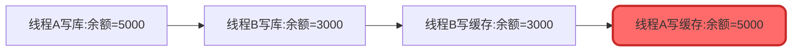

在这个例子中,两个线程分别处理用户账户余额的更新。虽然数据库中最终余额是3000(后写入的值),但缓存中却是5000,造成数据不一致。

**场景二:先更新缓存再写数据库**

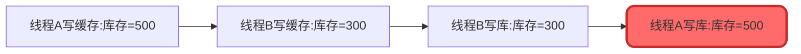

这个场景中,缓存中是300,但数据库中是500,同样导致了数据不一致。

### 读写并发导致的数据不一致

读写并发是一个容易被忽视但非常重要的场景。当使用缓存时,读操作的完整流程包括:

1. 查询缓存,如果命中则直接返回
2. 缓存未命中时查询数据库
3. 将数据库查询结果写入缓存

这意味着读线程虽然不会修改数据库,但会更新缓存。在特定的时序下,就会出现问题:

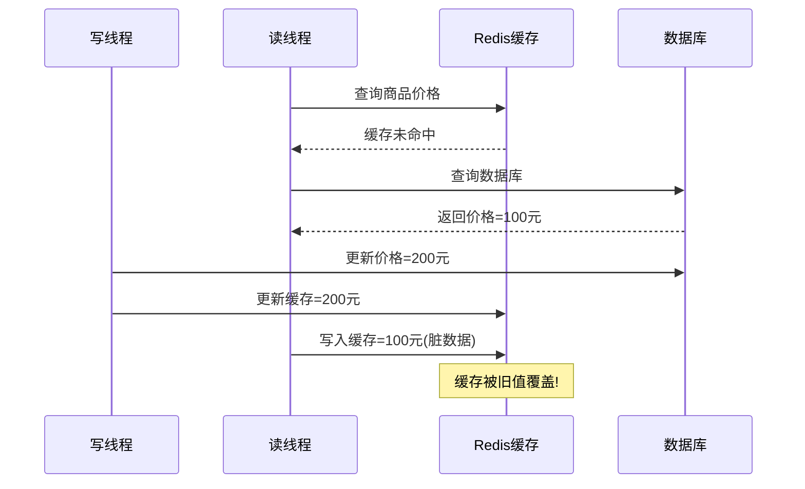

在这个商品价格更新的例子中,读线程查询到旧价格100元后,在写入缓存之前,写线程已经将价格更新为200元。但读线程并不知情,仍然将100元写入缓存,导致缓存中是脏数据。

虽然这种情况发生概率相对较低(因为读操作通常很快,在十几毫秒内完成),但根据墨菲定律,只要有可能发生就一定会发生,因此必须重视。

## 缓存更新策略选择

### 删除缓存 vs 更新缓存

在保证数据一致性时,首要决策是选择"删除缓存"还是"更新缓存"。**强烈建议优先选择删除缓存策略**,原因如下:

**操作复杂度对比**

缓存中存储的数据往往不是简单的字符串,可能是复杂的JSON对象、Map结构等。以电商订单为例:

```java
@Service
public class OrderService {
    
    @Autowired
    private RedisTemplate<String, Object> redisTemplate;
    
    @Autowired
    private OrderRepository orderRepository;
    
    // 更新缓存方式 - 复杂且容易出错
    public void updateOrderCache(Long orderId, Integer quantity) {
        // 1. 从缓存读取完整订单对象
        String cacheKey = "order:" + orderId;
        OrderDTO order = (OrderDTO) redisTemplate.opsForValue().get(cacheKey);
        
        // 2. 反序列化、修改字段
        if (order != null) {
            order.setQuantity(quantity);
            order.setUpdateTime(LocalDateTime.now());
            
            // 3. 重新序列化并写入缓存
            redisTemplate.opsForValue().set(cacheKey, order);
        }
    }
    
    // 删除缓存方式 - 简单直接
    public void deleteOrderCache(Long orderId) {
        String cacheKey = "order:" + orderId;
        redisTemplate.delete(cacheKey);
    }
}
```

可以看出,删除操作简单直接,不易出错;而更新操作需要多个步骤,每一步都可能引入bug。

**一致性保障对比**

在写写并发场景下,删除缓存能够天然避免数据不一致:

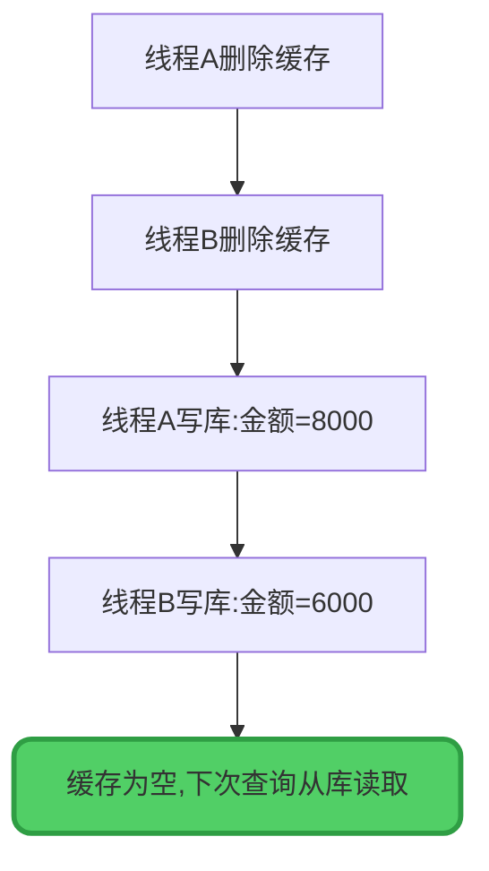

由于删除操作具有幂等性,多次删除的结果相同,因此不会产生数据不一致。而更新操作则会因为执行顺序导致最终值不同。

**删除缓存的小缺点**

删除缓存会带来一次cache miss,下次查询需要访问数据库。在极端情况下,如果缓存删除后立即有大量相同key的请求,可能导致缓存击穿。但这个问题可以通过加锁机制轻松解决:

```java
@Service
public class ProductService {
    
    @Autowired
    private RedissonClient redissonClient;
    
    public ProductDTO getProduct(Long productId) {
        String cacheKey = "product:" + productId;
        ProductDTO product = getFromCache(cacheKey);
        
        if (product == null) {
            // 使用分布式锁防止缓存击穿
            String lockKey = "lock:product:" + productId;
            RLock lock = redissonClient.getLock(lockKey);
            
            try {
                lock.lock();
                // 双重检查
                product = getFromCache(cacheKey);
                if (product == null) {
                    product = loadFromDatabase(productId);
                    saveToCache(cacheKey, product);
                }
            } finally {
                lock.unlock();
            }
        }
        return product;
    }
}
```

### 先写数据库 vs 先删缓存

在确定采用删除缓存策略后,下一个决策是操作顺序的选择。

**先删缓存的特点**

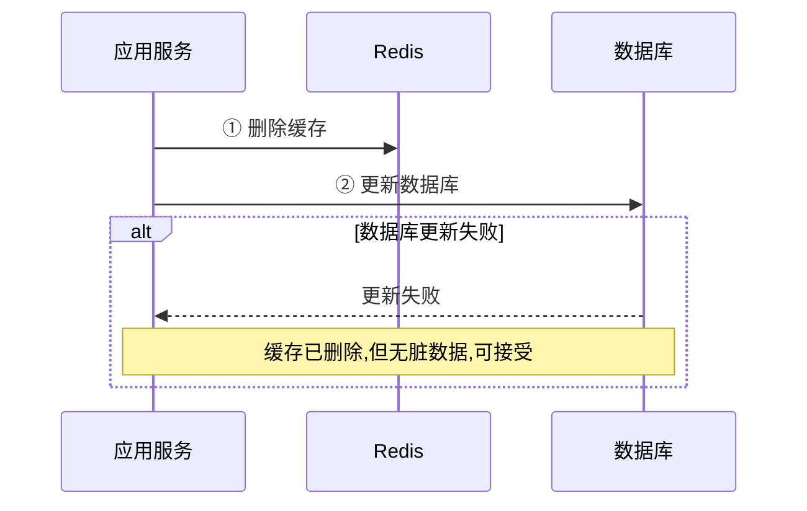

优点是如果第二步数据库更新失败,虽然缓存被删除了,但不会有脏数据,只需重试即可。

但缺点是会放大读写并发问题。由于缓存被提前清空,读线程更容易发生cache miss并从数据库读取,增加了读写并发导致数据不一致的概率。

**先写数据库的特点**

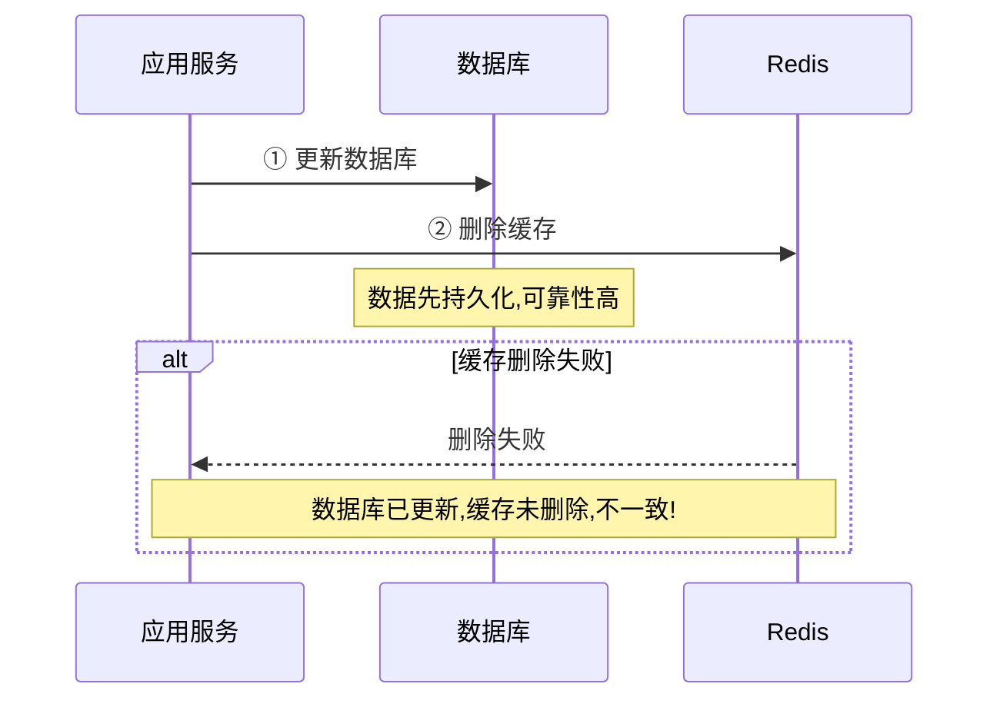

优点是数据先持久化到数据库,保证了数据可靠性。删除缓存失败的概率相对较低(除非网络问题或服务宕机)。

缺点是如果第二步删除缓存失败,会导致数据库已更新但缓存是旧数据的不一致情况。

## 数据一致性解决方案详解

### 方案一:先更新数据库后删除缓存

这是最简单直接的方案,适合95%的普通业务场景,尤其是并发量不大或对一致性要求不是特别严格的场景。

```java
@Service
public class UserService {
    
    @Autowired
    private UserRepository userRepository;
    
    @Autowired
    private StringRedisTemplate redisTemplate;
    
    @Transactional
    public void updateUserBalance(Long userId, BigDecimal amount) {
        // 1. 更新数据库
        User user = userRepository.findById(userId)
            .orElseThrow(() -> new BusinessException("用户不存在"));
        user.setBalance(amount);
        user.setUpdateTime(LocalDateTime.now());
        userRepository.save(user);
        
        // 2. 删除缓存
        String cacheKey = "user:balance:" + userId;
        redisTemplate.delete(cacheKey);
    }
}
```

**潜在风险:** 如果删除缓存这一步失败,会导致数据库和缓存不一致。需要考虑重试机制或者使用后续的优化方案。

### 方案二:延迟双删策略

延迟双删是在先删缓存方案基础上的增强版本,通过两次删除操作来提高数据一致性保障。

**执行流程:**

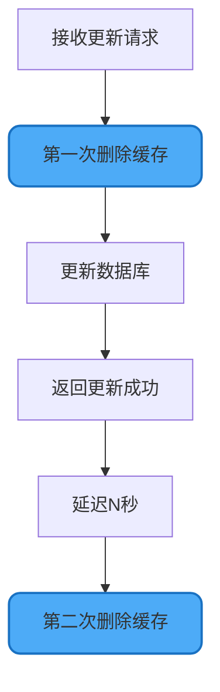

**代码实现:**

```java
@Service
public class InventoryService {
    
    @Autowired
    private RedisTemplate<String, Object> redisTemplate;
    
    @Autowired
    private InventoryRepository inventoryRepository;
    
    // 创建延迟任务线程池
    private final ScheduledExecutorService scheduler = 
        Executors.newScheduledThreadPool(5);
    
    public void updateInventory(Long skuId, Integer quantity) {
        String cacheKey = "inventory:" + skuId;
        
        // 第一次删除缓存
        deleteCache(cacheKey);
        
        // 更新数据库
        Inventory inventory = inventoryRepository.findById(skuId)
            .orElseThrow(() -> new BusinessException("商品不存在"));
        inventory.setQuantity(quantity);
        inventory.setUpdateTime(LocalDateTime.now());
        inventoryRepository.save(inventory);
        
        // 延迟2秒后第二次删除缓存
        scheduler.schedule(() -> {
            deleteCache(cacheKey);
        }, 2, TimeUnit.SECONDS);
    }
    
    private void deleteCache(String cacheKey) {
        try {
            redisTemplate.delete(cacheKey);
            log.info("缓存删除成功: {}", cacheKey);
        } catch (Exception e) {
            log.error("缓存删除失败: {}", cacheKey, e);
        }
    }
}
```

**第一次删除的原因分析**

第一次删除采用"先删缓存再写库"的顺序,主要基于以下考虑:

1. **降低失败影响范围**:如果先写数据库成功但删缓存失败,会直接导致数据不一致。而先删缓存成功后写库失败,只是删除了缓存,不会产生脏数据。

2. **操作成功率考量**:相对而言,数据库操作(尤其是更新操作)失败概率高于缓存删除操作。将容易失败的操作放在后面,可以降低整体不一致的概率。

3. **原子性限制**:由于缓存和数据库操作无法组成原子事务,通过调整顺序可以让失败的影响更小。

**第二次删除的原因分析**

虽然第一次删除已经清空了缓存,但在高并发场景下,仍然可能出现读写并发问题:

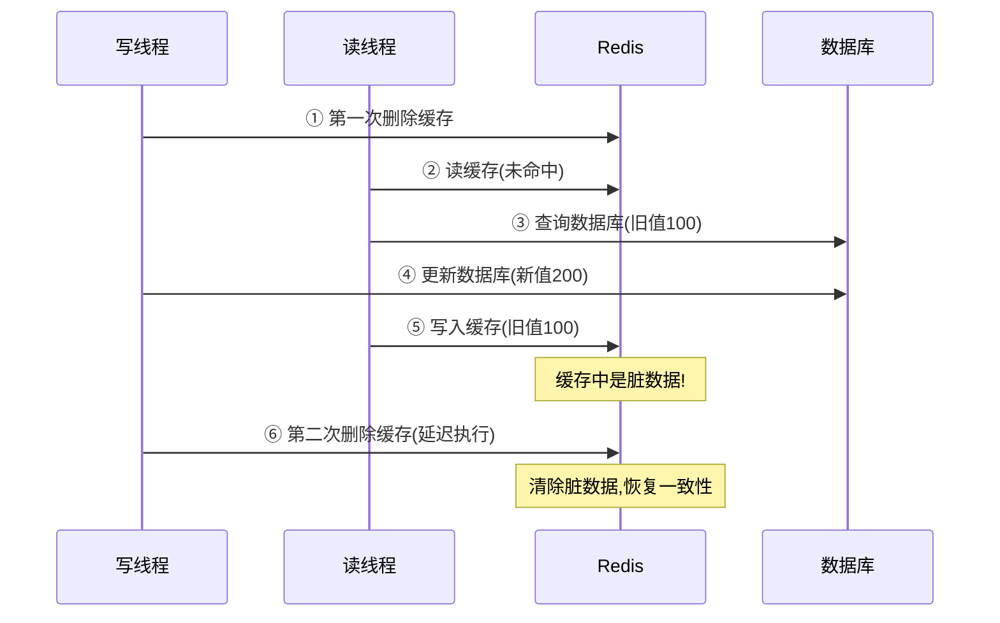

第二次删除通过延迟执行,可以在读线程将脏数据写入缓存后,再次将其清除,从而避免后续请求读取到错误数据。

**延迟时间的设定**

延迟时间需要根据实际业务情况调整:

- **太短**(如几十毫秒):可能无法覆盖读线程的执行时间,第二次删除在脏数据写入前就执行了,起不到作用
- **太长**(如5秒以上):会导致脏数据在缓存中存在较长时间,影响数据一致性
- **推荐值**:1-2秒,既能覆盖大部分读操作的执行时间,又不会让不一致状态持续太久

**方案优缺点总结**

优点:
- 通过两次删除大幅降低了读写并发导致的不一致概率
- 相比单次删除,一致性保障更强

缺点:
- 延迟时间难以精确控制,需要根据业务特点调优
- 第二次删除也有失败的可能,只是降低了不一致的概率而非完全消除
- 可能删除正确的缓存数据,增加cache miss

**适用场景:** 并发量较大,对一致性要求较高的业务场景。

### 方案三:Cache-Aside模式(旁路缓存)

Cache-Aside是Facebook推崇的缓存更新模式,核心思想是先更新数据库,然后异步删除缓存。

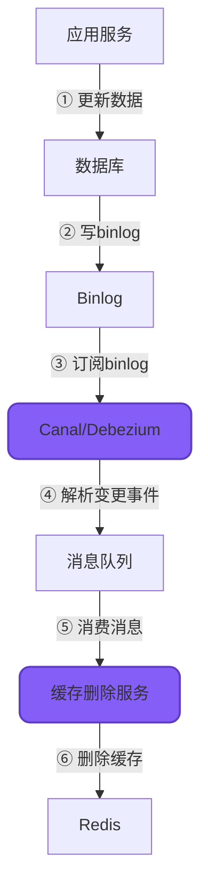

**基于Binlog的实现方案**

```java
// 1. 主业务代码只需关注数据库操作
@Service
public class OrderService {
    
    @Autowired
    private OrderRepository orderRepository;
    
    @Transactional
    public void updateOrderStatus(Long orderId, String status) {
        Order order = orderRepository.findById(orderId)
            .orElseThrow(() -> new BusinessException("订单不存在"));
        order.setStatus(status);
        order.setUpdateTime(LocalDateTime.now());
        orderRepository.save(order);
        
        // 无需手动删除缓存,由binlog监听处理
    }
}

// 2. Binlog监听服务
@Component
public class BinlogCacheInvalidator {
    
    @Autowired
    private RedisTemplate<String, Object> redisTemplate;
    
    @CanalListener(destination = "example", schema = "mall", table = {"orders"})
    public void onOrderChange(CanalEntry.EventType eventType, CanalEntry.RowData rowData) {
        if (eventType == CanalEntry.EventType.UPDATE || 
            eventType == CanalEntry.EventType.DELETE) {
            
            String orderId = getColumnValue(rowData, "id");
            String cacheKey = "order:" + orderId;
            
            // 重试删除缓存直到成功
            retryDeleteCache(cacheKey);
        }
    }
    
    private void retryDeleteCache(String cacheKey) {
        int maxRetries = 3;
        int retryCount = 0;
        
        while (retryCount < maxRetries) {
            try {
                redisTemplate.delete(cacheKey);
                log.info("缓存删除成功: {}", cacheKey);
                break;
            } catch (Exception e) {
                retryCount++;
                log.warn("缓存删除失败,重试次数: {}/{}", retryCount, maxRetries);
                if (retryCount >= maxRetries) {
                    log.error("缓存删除最终失败: {}", cacheKey, e);
                    // 发送告警或写入死信队列
                }
            }
        }
    }
}
```

**基于消息队列的实现方案**

```java
// 1. 更新数据库后发送消息
@Service
public class ProductService {
    
    @Autowired
    private ProductRepository productRepository;
    
    @Autowired
    private RocketMQTemplate rocketMQTemplate;
    
    @Transactional
    public void updateProductPrice(Long productId, BigDecimal price) {
        Product product = productRepository.findById(productId)
            .orElseThrow(() -> new BusinessException("商品不存在"));
        product.setPrice(price);
        productRepository.save(product);
        
        // 发送缓存失效消息
        CacheInvalidationMessage message = CacheInvalidationMessage.builder()
            .cacheKey("product:" + productId)
            .operationType("UPDATE")
            .timestamp(System.currentTimeMillis())
            .build();
            
        rocketMQTemplate.asyncSend("cache-invalidation-topic", message, new SendCallback() {
            @Override
            public void onSuccess(SendResult sendResult) {
                log.info("缓存失效消息发送成功");
            }
            
            @Override
            public void onException(Throwable e) {
                log.error("缓存失效消息发送失败", e);
            }
        });
    }
}

// 2. 消费消息并删除缓存
@Component
@RocketMQMessageListener(
    topic = "cache-invalidation-topic",
    consumerGroup = "cache-invalidation-consumer"
)
public class CacheInvalidationConsumer implements RocketMQListener<CacheInvalidationMessage> {
    
    @Autowired
    private RedisTemplate<String, Object> redisTemplate;
    
    @Override
    public void onMessage(CacheInvalidationMessage message) {
        String cacheKey = message.getCacheKey();
        try {
            redisTemplate.delete(cacheKey);
            log.info("异步删除缓存成功: {}", cacheKey);
        } catch (Exception e) {
            log.error("异步删除缓存失败: {}", cacheKey, e);
            // 消息会自动重试
            throw new RuntimeException("缓存删除失败", e);
        }
    }
}
```

**方案优势:**

1. **业务解耦**:主业务代码只需关注数据库操作,缓存维护由独立服务处理
2. **可靠性高**:基于binlog或消息队列,具有重试机制,可靠性有保障  
3. **一致性好**:binlog是数据库的真实变更记录,不会遗漏

**方案劣势:**

1. **复杂度高**:需要引入Canal/Debezium等中间件,增加系统复杂度
2. **延迟存在**:通常有毫秒到秒级的延迟,适合可接受短暂不一致的场景
3. **运维成本**:需要维护额外的中间件和监控

**适用场景:** 大型互联网公司,有完善中间件支持,并发极高,对一致性要求严格的核心业务。

## 其他缓存更新设计模式

除了Cache-Aside模式,还有几种其他的缓存设计模式,各有特点。

### Read/Write Through模式

在这种模式下,应用程序将缓存视为主要数据源,不直接操作数据库,所有读写操作都通过缓存来代理。

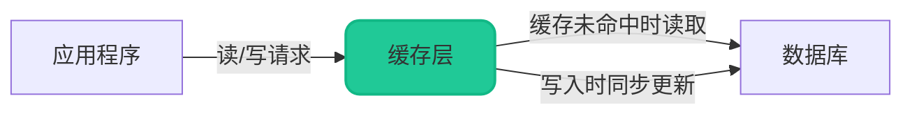

**Read Through:** 缓存配置一个加载器,当缓存未命中时,自动从数据库加载数据。

**Write Through:** 缓存配置一个写入器,当应用写入数据时,缓存先存储数据,然后同步写入数据库。

这种模式的好处是应用层逻辑简单,但缺点是需要缓存组件提供这些高级功能,且写入性能可能受影响(同步写入)。

### Write Behind Caching模式

这是一种高性能的缓存更新模式,更新数据时只写缓存,然后异步批量持久化到数据库。

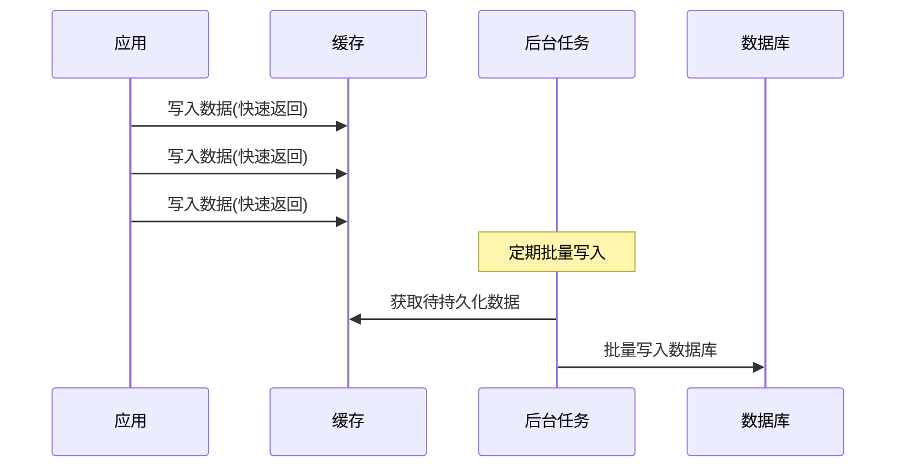

**代码示例:**

```java
@Component
public class ViewCountCache {
    
    @Autowired
    private RedisTemplate<String, Integer> redisTemplate;
    
    @Autowired
    private ArticleRepository articleRepository;
    
    // 增加文章浏览量(只写缓存,极快)
    public void incrementViewCount(Long articleId) {
        String cacheKey = "article:view:" + articleId;
        redisTemplate.opsForValue().increment(cacheKey);
    }
    
    // 定时任务:每5分钟批量持久化到数据库
    @Scheduled(fixedRate = 300000)
    public void syncViewCountToDB() {
        Set<String> keys = redisTemplate.keys("article:view:*");
        if (keys == null || keys.isEmpty()) {
            return;
        }
        
        List<Article> updateList = new ArrayList<>();
        for (String key : keys) {
            Long articleId = Long.parseLong(key.split(":")[2]);
            Integer viewCount = redisTemplate.opsForValue().get(key);
            
            if (viewCount != null && viewCount > 0) {
                Article article = new Article();
                article.setId(articleId);
                article.setViewCount(viewCount);
                updateList.add(article);
                
                // 持久化后清除缓存
                redisTemplate.delete(key);
            }
        }
        
        if (!updateList.isEmpty()) {
            articleRepository.batchUpdateViewCount(updateList);
            log.info("批量同步浏览量到数据库,数量: {}", updateList.size());
        }
    }
}
```

**优缺点分析:**

优点:
- 读写速度极快,所有操作都在内存中完成
- 减少数据库写入次数,可以批量操作提升性能

缺点:
- 可能丢失未持久化的数据(如服务突然崩溃)
- 实时性较差,数据库中的数据会有延迟

**适用场景:**
- 文章浏览量、视频播放量等统计类数据
- 用户点赞、收藏等允许少量丢失的场景
- 对实时性要求不高但对性能要求极高的业务

## 方案选型建议

在实际项目中,没有一种方案是万能的,需要根据具体业务特点进行权衡选择。

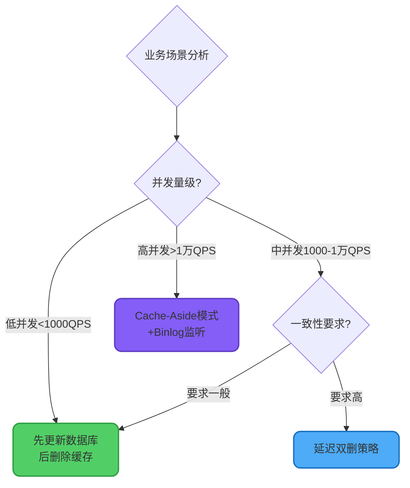

### 权衡维度

| 维度 | 先更新库后删缓存 | 延迟双删 | Cache-Aside |
|------|-----------------|---------|-------------|
| 实现复杂度 | ⭐ | ⭐⭐ | ⭐⭐⭐⭐ |
| 一致性保障 | ⭐⭐ | ⭐⭐⭐⭐ | ⭐⭐⭐⭐⭐ |
| 性能影响 | 小 | 中(延迟删除) | 小(异步) |
| 运维成本 | 低 | 低 | 高 |
| 并发承载 | 中 | 高 | 极高 |

### 具体建议

1. **小型项目或初创公司**:优先选择"先更新数据库后删除缓存",简单够用,出问题容易排查

2. **成长型业务**:当并发量上升到一定程度,可升级为延迟双删,保持代码简洁的同时提升一致性

3. **大型互联网公司**:采用Cache-Aside模式,投入中间件建设成本,换取更高的可靠性和性能

4. **统计类非核心数据**:可以考虑Write Behind模式,牺牲部分可靠性换取极致性能

记住《人月神话》作者Fred Brooks的名言:**"没有银弹"**。任何技术方案都是权衡的结果,要综合考虑业务特点、团队能力、运维成本、可维护性等多方面因素,选择最适合当前阶段的方案。
