# Redis集群架构与高可用方案

## 集群模式概述

Redis 为了满足不同业务场景下的高可用需求，提供了三种主流的集群架构方案：主从复制模式、哨兵模式以及分片集群模式。这三种架构各有特点，分别适用于不同规模和可用性要求的应用场景。

### 主从复制架构

主从复制是 Redis 最基础的集群架构方案，主要用于解决单节点故障导致服务中断的问题。通过将数据复制到多个副本节点，确保即使某个节点出现故障，其他节点仍可继续提供服务。

在主从架构中，存在一个主节点（Master）以及若干从节点（Slave）。**主节点既可以处理读请求，也负责所有的写请求，而从节点通过数据复制机制同步主节点的数据，并专注于处理读请求。**当主节点发生故障时，可通过手动方式将某个从节点提升为主节点，实现服务恢复。

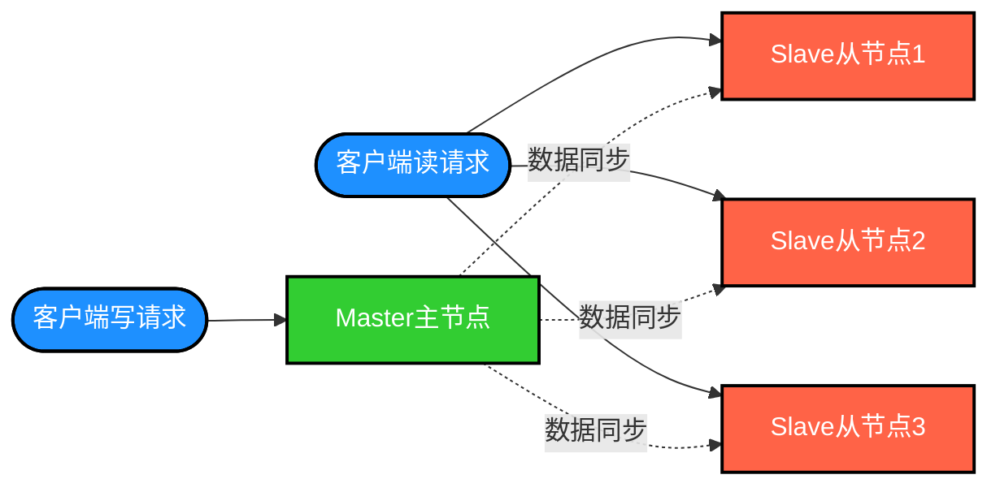

**主从复制的主要优势在于实现简单，特别适合读多写少的业务场景。**它为数据提供了备份保障，并且具有良好的扩展性——通过增加更多从节点，可以持续提升集群的读取能力。

然而，主从模式存在一个显著的缺陷，即缺乏故障自动转移能力，无法实现自动容错与恢复。

无论是主节点还是从节点宕机，都可能导致客户端的部分读写请求失败，需要运维人员手动介入，要么恢复故障节点，要么手动将某个从节点切换为主节点。此外，当主节点宕机时，如果数据尚未完全同步到从节点，还会引发数据一致性问题。

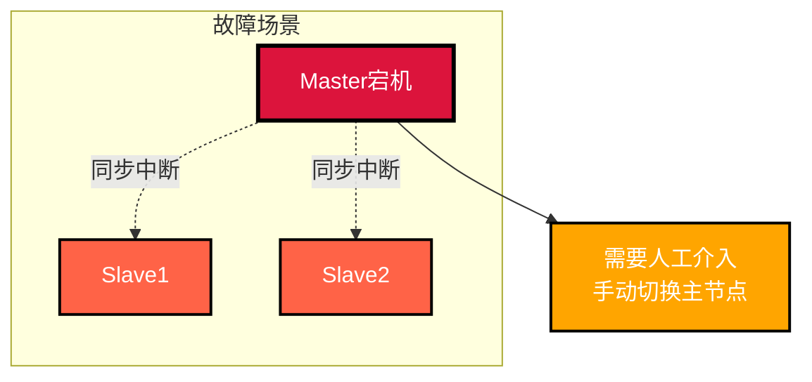

### 哨兵监控架构

为了解决主从模式无法自动容错和恢复的问题，Redis 引入了哨兵模式（Sentinel）集群架构。

哨兵模式是在主从复制架构基础上增加了哨兵节点组件。哨兵节点是一种特殊类型的 Redis 节点，专门用于监控主节点和从节点的运行状态。当主节点发生故障时，哨兵节点能够自动执行故障转移操作，从健康的从节点中选举出一个合适的节点提升为新主节点，并通知其他从节点和客户端应用进行配置更新。

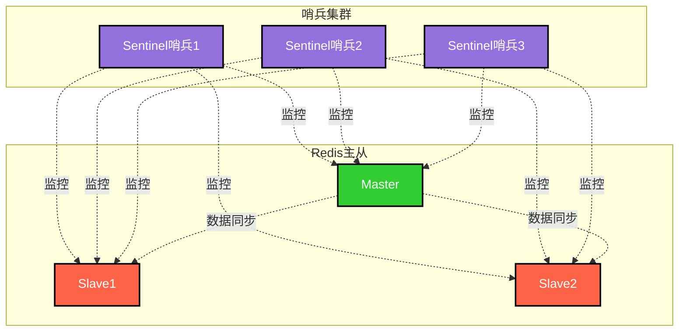

在原有的主从架构中引入哨兵节点后，哨兵的核心职责是监控 Redis 主节点和从节点的健康状态。通常需要部署多个哨兵节点（一般为奇数个），以确保故障转移决策的可靠性和准确性。

哨兵节点会定期向所有主节点和从节点发送 **PING** 心跳检测命令，如果在设定的超时时间内未收到 **PONG** 响应，哨兵节点会将该节点标记为"主观下线"。如果一个主节点被多数哨兵节点（超过半数）同时标记为"主观下线"，那么该主节点将被判定为"客观下线"。

当主节点被确认为"客观下线"后，哨兵集群会启动故障转移流程。它会从所有健康的从节点中选举出一个最优的节点作为新的主节点，并将其他从节点重新配置为跟随新主节点，实现自动化的故障转移。同时，哨兵节点会通过发布订阅机制更新所有客户端的配置信息，引导客户端连接到新的主节点。

哨兵节点通过 Redis 的发布订阅（Pub/Sub）功能，向客户端推送主节点状态变更的消息。客户端接收到消息后，会自动更新连接配置，将新的主节点信息应用到连接池中，从而使客户端能够继续与新的主节点正常交互。

哨兵模式的核心优势在于为整个集群提供了自动化的故障检测、转移和恢复能力，大大降低了人工运维成本。

### 分片集群架构

Redis Cluster 是 Redis 官方推荐的分布式集群解决方案。它通过数据**自动分片**技术将数据分布到多个节点上，每个节点负责管理一部分数据分片。

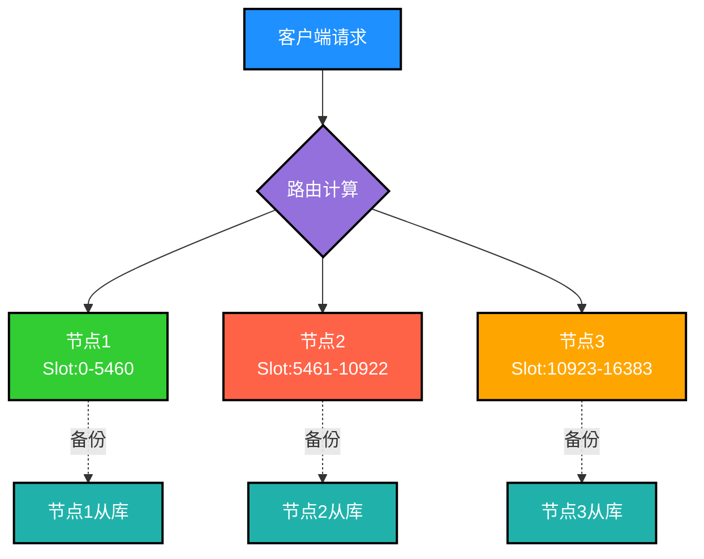

Redis Cluster 同样采用主从复制机制来提升整体可用性。每个分片都包含一个主节点和若干从节点。主节点负责处理写操作，从节点则负责复制主节点的数据并处理读请求。

Redis Cluster 具备自动故障检测能力。当某个主节点失去连接或变得不可达时，Redis Cluster 会自动将该节点标记为不可用状态，并从该分片的可用从节点中选举提升一个新的主节点。

Redis Cluster 特别适用于大规模应用场景，它提供了更强的横向扩展能力和容错能力。通过自动管理数据分片和故障转移，显著降低了运维复杂度。

Cluster 模式的核心特点是数据以分片方式存储在不同的节点上，每个节点都可以独立对外提供读写服务，消除了单点故障的风险。

## 数据分片机制

### 分片原理

Redis 的数据分片（Sharding）是一种将数据集分割成多个部分，并分别存储在不同 Redis 节点上的技术方案。它能够将单节点的 Redis 数据库扩展到多台物理服务器上，从而大幅提升 Redis 集群的性能和可扩展性。

Redis 数据分片的核心实现方式是按照特定规则（例如键的哈希值）将数据分配到不同的节点。当客户端需要访问某个键时，首先计算出该键应该存储在哪个节点，然后直接连接到目标节点进行操作。因此，从客户端角度来看，Redis 集群就像一个统一的大型数据库，无需关心数据的实际分布细节。

**在 Redis Cluster 集群模式中，采用哈希槽（Hash Slot）机制进行数据分片**，将整个数据集划分为多个槽位，每个槽位分配给一个节点管理。客户端访问数据时，先计算出数据对应的槽位编号，然后直接连接到该槽位所在的节点进行操作。Redis Cluster 还提供了自动故障转移、数据迁移和弹性扩缩容等功能，能够便捷地管理大规模的 Redis 集群。

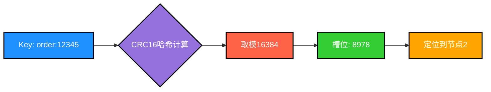

Redis Cluster 将整个数据集划分为 **16384 个槽位**，每个槽位都有唯一的编号（0~16383）。集群中的每个节点可以负责管理多个哈希槽，客户端访问数据时，首先根据键计算出对应的槽位编号，然后根据槽位编号找到负责该槽位的节点，向该节点发送请求。

在 Redis 的每个节点上，都维护着两个关键组件：一个是槽位（Slot），取值范围为 0-16383；另一个是集群管理组件（Cluster），负责集群的管理和协调。当存取某个键时，Redis 会根据 **CRC16 算法**计算出一个结果，然后对结果执行模 16384 运算，这样每个键都会对应一个编号在 0-16383 之间的哈希槽，通过这个槽位编号，找到对应的节点，然后自动路由到该节点进行存取操作。

### 分片优势

Redis Cluster 中的数据分片机制具有以下核心优势：

1. **提升性能和吞吐量**：通过在多个节点上分散数据，可以并行处理更多请求，从而大幅提升整体性能和吞吐量。这在高并发场景下尤为重要，因为单节点可能无法承受所有请求压力。

2. **提高可扩展性**：分片使得 Redis 可以实现水平扩展。通过动态添加更多节点，可以扩展数据库的存储容量和处理能力。

3. **更好的资源利用**：分片允许更高效地利用服务器资源。每个节点只处理数据的一部分，降低了单个节点的内存和计算压力。

4. **避免单点故障**：在没有分片的情况下，如果唯一的 Redis 服务器发生故障，整个服务可能会停止。在分片环境中，即使某个节点出现问题，其他节点仍然可以继续运行，保障服务的连续性。

5. **数据冗余和高可用性**：在某些分片策略中，如 Redis Cluster，每个分片的数据都可以在集群内的其他节点上进行复制。这意味着即使某个节点失败，数据也不会丢失，从而提高了系统的整体可用性。

### 槽位数量设计

**Redis Cluster 将整个数据集划分为 16384 个槽位，为什么是 16384 这个数字呢？**

这个问题在 Github 上有过讨论，Redis 的作者 Antirez 也亲自回复过：[https://github.com/redis/redis/issues/2576](https://github.com/redis/redis/issues/2576)

16384 这个数字是 2 的 14 次方（2^14）。尽管 CRC16 算法能够产生 2^16 - 1 = 65535 个不同的值，但并没有选择这个数字，主要是从消息大小和集群规模等多方面因素综合考虑的：

**1. 心跳消息开销**

集群节点之间会定期发送心跳数据包，这些心跳包携带了节点的完整配置信息，用于以幂等方式更新配置。这些配置中包含了节点的槽位分配信息（原始位图形式）。对于包含 16384 个槽位的情况，使用位图表示只需要 2KB 的空间（16384 bit = 2048 byte = 2KB），但如果使用 65535 个槽位，则需要 8KB 的空间，这会造成带宽浪费。

**2. 集群规模限制**

由于其他设计权衡的原因，Redis Cluster 实际上不太可能扩展到超过 1000 个主节点的规模。在这种情况下，如果使用 65535 个槽位，会导致每个节点上分配的槽位过多，增加节点负载，并且数据迁移成本也会相应提高。而 16384 是一个相对合适的选择，在 1000 个节点的场景下，可以使槽位均匀分布，每个分片平均分配的槽位数量适中。

**3. 其他优势**

除了上述两个主要原因，16384 这个数字还有以下优点：

1. **易于扩展**：槽位数量是一个固定的常数，便于进行集群的动态扩展和缩减。如果需要添加或删除节点，只需要重新分配槽位即可。

2. **计算效率高**：哈希算法通常基于槽位编号进行计算。**将槽位数量设置为 2 的幂次方，可以使用位运算等高效算法快速计算槽位编号，从而提升计算效率。**

3. **负载均衡**：槽位数量的选择会影响数据的负载均衡。如果槽位数量太少，会导致某些节点负载过重；如果槽位数量太多，会导致数据迁移的开销过大。**16384 这个数量在实践中被证明是一个比较合适的选择，能够在保证负载均衡的同时，减少数据迁移的开销。**

### 哈希算法原理

当存取键时，Redis 会根据 **CRC16 算法**计算出一个结果，然后对结果执行模 16384 运算，这样每个键都会对应一个编号在 0-16383 之间的哈希槽。

CRC16（Cyclic Redundancy Check，循环冗余校验码）算法是一种广泛使用的校验算法，主要应用于数据通信和数据存储等领域，例如网络通信中的错误检测和纠正、数据存储中的文件完整性校验等。

CRC16 算法基于多项式除法原理，将输入数据按位进行多项式除法运算，最终得到一个 16 位的校验码。CRC16 算法的计算过程包括以下几个步骤：

1. 初始化一个 16 位的寄存器为全 1（0xFFFF）；
2. 将输入数据的第一个字节与 16 位寄存器的低 8 位进行异或操作，结果作为新的 16 位寄存器的值；
3. 将 16 位寄存器整体右移一位，丢弃最低位；
4. 如果输入数据还没有处理完，转到第 2 步继续处理下一个字节；
5. 如果输入数据已经处理完，将 16 位寄存器的值取反，得到 CRC16 校验码。

```python
# 电商订单系统中的槽位计算示例
def calculate_slot(order_id):
    """
    计算订单ID对应的槽位
    order_id: 订单编号，如 "ORDER20231201001"
    """
    # 步骤1: 计算CRC16值
    crc = calculate_crc16(order_id)
    
    # 步骤2: 对16384取模
    slot = crc % 16384
    
    # 步骤3: 根据槽位找到对应节点
    node = get_node_by_slot(slot)
    
    return slot, node

# 示例
order_id = "ORDER20231201001"
slot, node = calculate_slot(order_id)
print(f"订单 {order_id} 分配到槽位 {slot}，存储在节点 {node}")
```

CRC16 算法的多项式是一个固定的 16 位二进制数，不同的 CRC16 算法变体使用的多项式也不相同。例如，CRC-16/CCITT 算法使用的多项式为 0x1021，而 Modbus CRC16 算法使用的多项式为 0xA001。

CRC16 算法的优点是计算速度快、校验效果好、应用范围广。缺点是只能检测错误，无法纠正错误。如果数据被篡改，CRC 校验值也会随之改变，但无法确定具体是哪一位数据被修改。因此，在数据传输和存储场景中，通常需要与其他校验算法配合使用，以保证数据的完整性和正确性。

## 集群脑裂问题

### 脑裂现象

所谓脑裂（Split-Brain），就像它的名字所暗示的那样，就好比大脑裂成了两半。在分布式系统中，脑裂是指系统被分割成两个或多个子集，每个子集都有自己的"大脑"（Leader/Master），整个分布式系统中存在多个"大脑"，而且每个子集都认为自己是正常运行的，从而导致数据不一致或重复写入等严重问题。

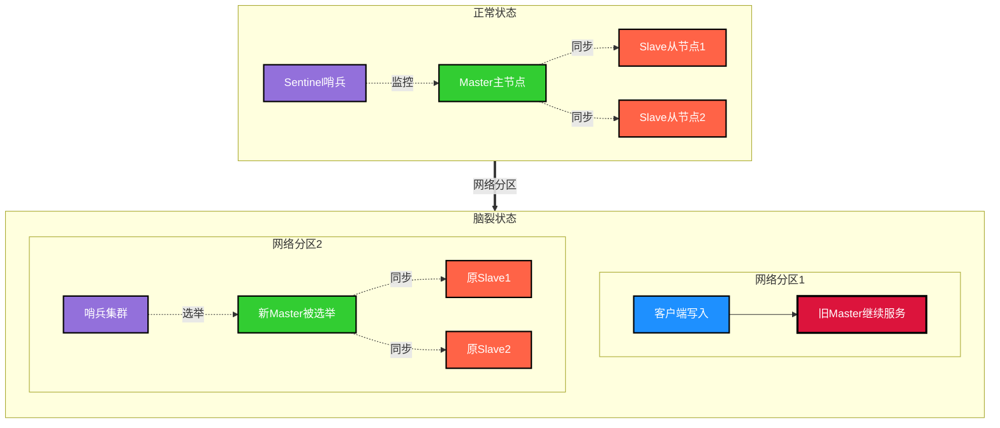

### 脑裂触发场景

**Redis 的脑裂问题可能在网络分区或者主节点出现异常的情况下发生**：

**1. 网络分区场景**

网络故障或分区导致不同子集之间的通信中断。Master 节点、哨兵和 Slave 节点被网络故障分割为两个独立的网络分区。Master 处在一个网络分区中，Slave 库和哨兵在另外一个网络分区中。此时哨兵检测到无法连接 Master，就会启动主从切换流程，选举一个新的 Master，这时候就会出现两个主节点同时存在的情况。

**2. 主节点异常场景**

集群中的主节点出现暂时性故障，导致不同的子集误认为需要选举新的主节点。Master 节点出现问题时，哨兵会开始选举新的主节点。但在选举过程中，原来的 Master 节点又恢复正常了，这时候就可能导致一部分 Slave 节点认为原节点仍是 Master，而另一部分 Slave 节点跟随新选举出的 Master。

### 脑裂危害

脑裂问题可能导致以下严重后果：

**1. 数据不一致**

不同子集之间可能对同一数据进行不同的写入操作，导致数据产生分歧和不一致。

**2. 重复写入**

在脑裂问题解决后，不同子集可能尝试将相同的写入操作应用到主节点，导致数据重复或冲突。

**3. 数据丢失**

新选举出的 Master 会向所有实例发送 `SLAVEOF` 命令，让所有实例重新进行全量同步。而全量同步的第一步就是清空实例上的现有数据，所以在主从同步期间，在原来那个 Master 上执行的写命令将会被清空，造成数据丢失。

```python
# 脑裂导致数据丢失的场景示例（电商库存系统）

# 场景：网络分区导致脑裂
# 时间线：
# T1: 原Master节点（商品库存=100）
# T2: 网络分区，哨兵选举新Master
# T3: 客户端向原Master执行：库存-50（库存变为50）
# T4: 网络恢复，原Master被降级为Slave
# T5: 原Master执行全量同步，数据被清空
# 结果：T3时刻的库存扣减操作丢失

class StockService:
    def reduce_stock(self, product_id, quantity):
        """
        扣减商品库存
        """
        # 网络分区时，如果连接到旧Master
        # 这个操作会在脑裂解决后丢失
        current_stock = redis.get(f"stock:{product_id}")
        new_stock = current_stock - quantity
        redis.set(f"stock:{product_id}", new_stock)
        
        # 这条扣减记录会在全量同步时被清空！
        return new_stock
```

### 脑裂防范方案

Redis 提供了两个配置项来帮助防范脑裂问题，分别是 `min-replicas-to-write` 和 `min-replicas-max-lag`。

**配置参数说明：**

- `min-replicas-to-write`：主库能够进行数据同步的最少从库数量；
- `min-replicas-max-lag`：主从库间进行数据复制时，从库向主库发送 ACK 确认消息的最大延迟秒数。

这两个配置项必须**同时满足**，否则主节点会拒绝写入。当无法满足 `min-replicas-to-write` 和 `min-replicas-max-lag` 的要求时，主节点就会被禁止写入，脑裂造成的数据丢失问题自然也就得到了缓解。

```properties
# Redis配置示例（电商系统）
# 至少需要1个从库成功同步
min-replicas-to-write 1

# 从库同步延迟不能超过10秒
min-replicas-max-lag 10

# 哨兵判断主节点下线的时间
down-after-milliseconds 8000
```

**工作原理示例：**

假设我们将 `min-replicas-to-write` 设置为 1，将 `min-replicas-max-lag` 设置为 10 秒。

如果 Master 节点因为某些原因宕机了 12 秒，导致哨兵判断主库客观下线，开始进行主从切换。

同时，因为原 Master 宕机了 12 秒，没有一个（`min-replicas-to-write`）从库能够在 10 秒（`min-replicas-max-lag`）内与原主库进行数据复制，这样一来，由于不满足配置要求，原 Master 也就无法再接收客户端的写请求了。

这样一来，主从切换完成后，只有新主库能够接收写请求，就避免了脑裂的发生。

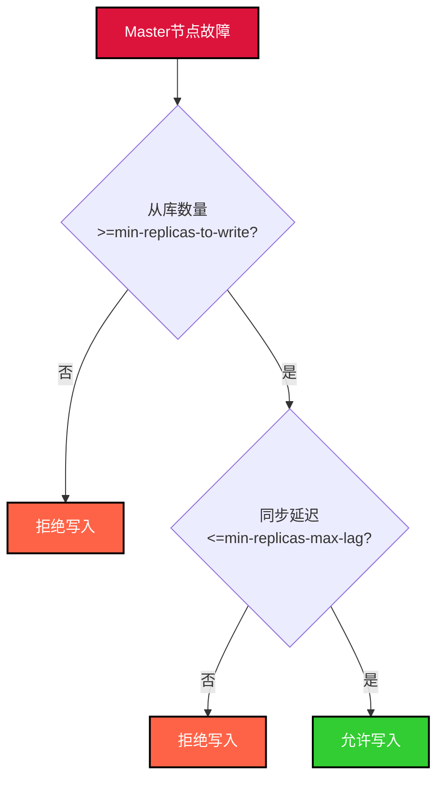

### 方案局限性

继续使用刚才的配置场景：假设我们将 `min-replicas-to-write` 设置为 1，将 `min-replicas-max-lag` 设置为 10 秒，并且 `down-after-milliseconds` 时间为 8 秒，也就是说，如果 8 秒内连不上主节点，哨兵就会启动主从切换。

但是，如果主从切换过程需要 5 秒时间的话，就会存在问题。

当 Master 节点宕机 8 秒时，哨兵判断主节点客观下线，开始进行主从切换，但这个过程总共需要 5 秒。如果在主从切换过程中，主节点恢复运行，即在第 9 秒时 Master 恢复了，而 `min-replicas-max-lag` 设置为 10 秒，那么主节点在第 9 秒时仍然是可写的。

那么就会导致第 9 秒到第 13 秒（8+5）这期间，如果有客户端写入原 Master 节点，这段时间的数据会在新的 Master 选出后，执行了 `SLAVEOF` 命令之后丢失。

```python
# 脑裂窗口期数据丢失示例（用户积分系统）

# 配置参数
min_replicas_to_write = 1
min_replicas_max_lag = 10  # 10秒
down_after_milliseconds = 8  # 8秒
failover_duration = 5  # 主从切换需要5秒

# 时间线分析：
# T0: Master正常运行
# T8: Master宕机8秒，哨兵判定客观下线，开始主从切换
# T9: Master恢复运行（宕机时长9秒 < min_replicas_max_lag 10秒）
# T9-T13: 危险窗口期！Master可写但即将被降级
# T13: 主从切换完成（8+5秒），原Master降级为Slave，数据丢失

def add_user_points(user_id, points):
    """
    在T9-T13期间，如果用户积分写入原Master
    这些积分记录会在T13时刻丢失
    """
    key = f"user:points:{user_id}"
    redis.incr(key, points)
    
    # 这个积分增加操作可能会在主从切换完成后丢失！
```

**结论：Redis 脑裂可以通过 `min-replicas-to-write` 和 `min-replicas-max-lag` 合理配置尽量规避，但无法彻底解决。**

要进一步降低风险，可以考虑：
1. 缩短 `min-replicas-max-lag` 的时间
2. 增加 `min-replicas-to-write` 的数量
3. 优化网络环境，减少网络分区发生的概率
4. 在应用层实现数据一致性校验和补偿机制

## 最佳实践建议

### 集群模式选择

1. **主从复制模式**：适用于读多写少、数据量较小、对自动故障转移要求不高的场景
2. **哨兵模式**：适用于需要自动故障转移、中等规模数据、对可用性有较高要求的场景
3. **Cluster模式**：适用于大规模数据、需要水平扩展、高并发高可用的生产环境

### 配置优化建议

1. **合理设置槽位数量**：使用默认的 16384 个槽位，既能保证负载均衡，又能降低心跳开销
2. **配置脑裂防护**：根据业务容忍度设置 `min-replicas-to-write` 和 `min-replicas-max-lag`
3. **优化心跳检测**：合理配置 `down-after-milliseconds`，避免误判又能快速发现故障
4. **主从同步优化**：根据网络情况调整 `repl-timeout` 等参数，确保数据同步及时性

### 监控告警

建议监控以下关键指标：

1. 节点存活状态
2. 主从同步延迟
3. 槽位分配情况
4. 内存使用率
5. 网络连接状态
6. 故障转移事件

通过完善的监控体系，可以及时发现和处理集群异常，保障 Redis 集群的稳定运行。

## 故障应急处理机制

即使做了充分的高可用部署，Redis 仍可能因各种原因出现不可用。作为开发人员，需要提前设计好故障应急方案，确保系统在 Redis 故障时仍能提供一定程度的服务。

### 故障检测与监控

发现 Redis 故障是应急处理的第一步，需要建立多层次的监控体系：

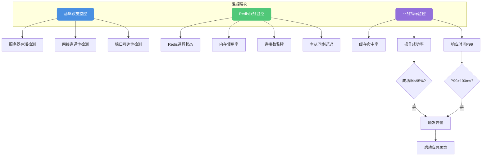

**监控指标配置示例：**

```java
/**
 * Redis健康检查服务
 * 用于监控Redis服务状态并触发告警
 */
@Service
public class RedisHealthCheckService {
    
    @Autowired
    private RedisTemplate<String, Object> redisTemplate;
    
    @Autowired
    private AlertService alertService;
    
    // 连续失败次数阈值
    private static final int FAILURE_THRESHOLD = 3;
    private AtomicInteger failureCount = new AtomicInteger(0);
    
    /**
     * 定时健康检查，每5秒执行一次
     */
    @Scheduled(fixedRate = 5000)
    public void healthCheck() {
        try {
            long startTime = System.currentTimeMillis();
            
            // 执行PING命令检测连通性
            String result = redisTemplate.execute((RedisCallback<String>) 
                connection -> connection.ping());
            
            long responseTime = System.currentTimeMillis() - startTime;
            
            if ("PONG".equals(result)) {
                failureCount.set(0);
                
                // 检查响应时间是否异常
                if (responseTime > 100) {
                    alertService.warn("Redis响应缓慢: " + responseTime + "ms");
                }
            } else {
                handleFailure("Redis返回异常响应: " + result);
            }
            
        } catch (Exception e) {
            handleFailure("Redis连接异常: " + e.getMessage());
        }
    }
    
    private void handleFailure(String reason) {
        int currentFailures = failureCount.incrementAndGet();
        
        if (currentFailures >= FAILURE_THRESHOLD) {
            // 触发告警并启动降级
            alertService.critical("Redis服务不可用: " + reason);
            triggerDegradation();
        }
    }
    
    private void triggerDegradation() {
        // 触发降级开关
        DegradationSwitch.enableFallback();
    }
}
```

### 限流与降级策略

当 Redis 故障时，如果请求直接打到数据库，可能导致数据库被压垮。此时需要结合限流和降级来保护系统：

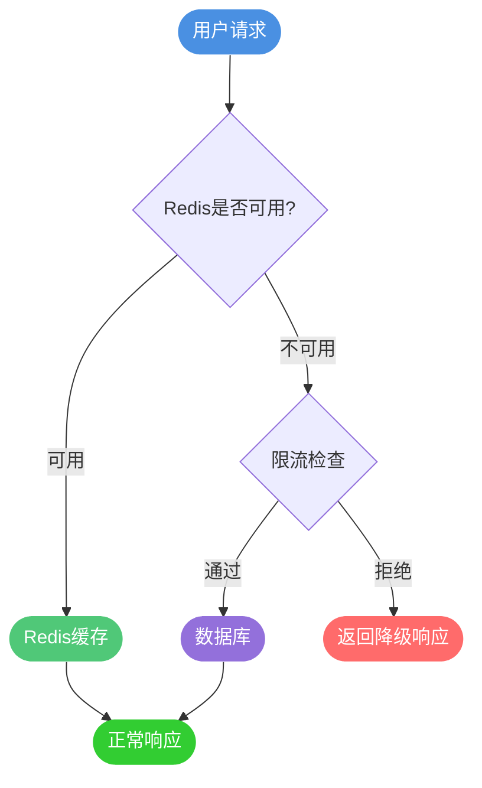

**降级策略实现：**

```java
/**
 * 商品服务 - 包含Redis降级逻辑
 */
@Service
public class ProductService {
    
    @Autowired
    private RedisTemplate<String, Object> redisTemplate;
    
    @Autowired
    private ProductMapper productMapper;
    
    @Autowired
    private RateLimiter rateLimiter;
    
    /**
     * 获取商品详情 - 带降级逻辑
     */
    public ProductVO getProductDetail(Long productId) {
        String cacheKey = "product:detail:" + productId;
        
        // 检查是否需要降级
        if (!DegradationSwitch.isRedisAvailable()) {
            return getProductWithDegradation(productId);
        }
        
        try {
            // 尝试从Redis获取
            ProductVO product = (ProductVO) redisTemplate.opsForValue().get(cacheKey);
            
            if (product != null) {
                return product;
            }
            
            // 缓存未命中，查询数据库
            product = productMapper.selectById(productId);
            
            if (product != null) {
                // 写入缓存，设置随机过期时间避免雪崩
                int expireSeconds = 3600 + ThreadLocalRandom.current().nextInt(600);
                redisTemplate.opsForValue().set(cacheKey, product, 
                    Duration.ofSeconds(expireSeconds));
            }
            
            return product;
            
        } catch (Exception e) {
            // Redis异常，触发降级
            log.warn("Redis访问异常，启用降级: {}", e.getMessage());
            return getProductWithDegradation(productId);
        }
    }
    
    /**
     * 降级处理：限流后查询数据库
     */
    private ProductVO getProductWithDegradation(Long productId) {
        // 限流检查：每秒最多100个请求
        if (!rateLimiter.tryAcquire("product:query", 100)) {
            // 限流生效，返回降级响应
            throw new DegradationException("系统繁忙，请稍后重试");
        }
        
        // 限流通过，直接查询数据库
        return productMapper.selectById(productId);
    }
}

/**
 * 降级开关 - 支持手动和自动切换
 */
public class DegradationSwitch {
    
    // 可通过配置中心动态推送
    private static volatile boolean redisAvailable = true;
    
    public static boolean isRedisAvailable() {
        return redisAvailable;
    }
    
    public static void enableFallback() {
        redisAvailable = false;
        log.warn("Redis降级开关已开启");
    }
    
    public static void disableFallback() {
        redisAvailable = true;
        log.info("Redis降级开关已关闭");
    }
}
```

### 主备切换与热备方案

除了应用层的降级策略，在架构层面也应该做好备份：

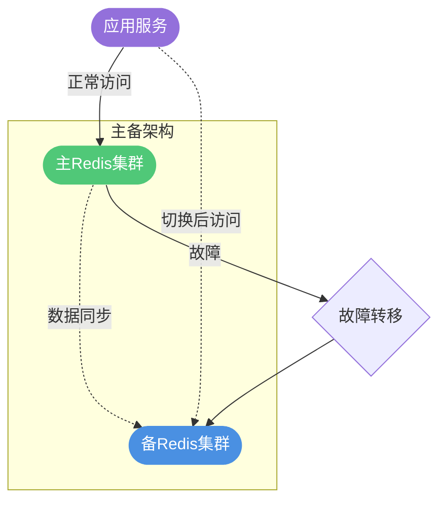

**热备方案的实现方式：**

| 方案 | 原理 | 优点 | 缺点 |
|------|------|------|------|
| 主从复制 | Slave实时同步Master数据 | 实现简单，延迟低 | 需手动切换 |
| 哨兵模式 | 自动检测故障并切换 | 自动故障转移 | 切换期间短暂不可用 |
| 异构备份 | 备份到MongoDB/Tair等 | 架构多样性强 | 数据格式需转换 |
| 双写策略 | 同时写入主备集群 | 切换无感知 | 一致性保证复杂 |

### 本地缓存兜底

当 Redis 完全不可用且限流过于严格影响用户体验时，可考虑使用本地缓存作为兜底方案：

```java
/**
 * 多级缓存服务
 * L1: 本地缓存 (Caffeine)
 * L2: 分布式缓存 (Redis)
 */
@Service
public class MultiLevelCacheService {
    
    // 本地缓存：最大10000条，10分钟过期
    private final Cache<String, Object> localCache = Caffeine.newBuilder()
        .maximumSize(10000)
        .expireAfterWrite(10, TimeUnit.MINUTES)
        .build();
    
    @Autowired
    private RedisTemplate<String, Object> redisTemplate;
    
    /**
     * 获取缓存：优先本地缓存 -> Redis -> 数据源
     */
    public <T> T get(String key, Class<T> clazz, Supplier<T> dataLoader) {
        // L1: 尝试本地缓存
        Object localValue = localCache.getIfPresent(key);
        if (localValue != null) {
            return clazz.cast(localValue);
        }
        
        // L2: 尝试Redis（如果可用）
        if (DegradationSwitch.isRedisAvailable()) {
            try {
                Object redisValue = redisTemplate.opsForValue().get(key);
                if (redisValue != null) {
                    // 回填本地缓存
                    localCache.put(key, redisValue);
                    return clazz.cast(redisValue);
                }
            } catch (Exception e) {
                log.warn("Redis访问失败，使用本地缓存兜底");
            }
        }
        
        // 从数据源加载
        T data = dataLoader.get();
        
        if (data != null) {
            // 写入本地缓存
            localCache.put(key, data);
            
            // 尝试写入Redis
            if (DegradationSwitch.isRedisAvailable()) {
                try {
                    redisTemplate.opsForValue().set(key, data, Duration.ofHours(1));
                } catch (Exception e) {
                    log.warn("Redis写入失败: {}", e.getMessage());
                }
            }
        }
        
        return data;
    }
}
```

**本地缓存的注意事项：**

1. **数据一致性问题**：多实例部署时，本地缓存之间无法同步，可能导致数据不一致
2. **内存占用控制**：需要合理设置缓存容量上限，避免OOM
3. **适用场景**：更适合读多写少、对一致性要求不高的数据
4. **过期时间**：本地缓存的过期时间应设置得较短，减少不一致窗口

### 应急预案体系

在大型系统中，应该建立完整的预案体系，实现故障与预案的关联：

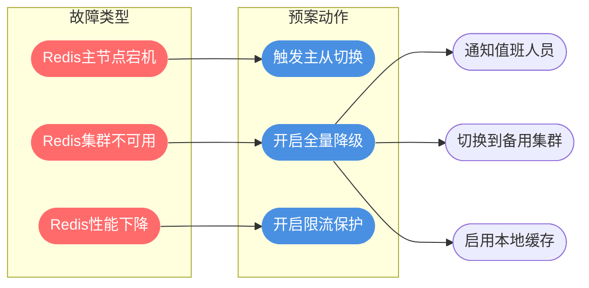

**预案配置示例：**

```yaml
# 应急预案配置
redis:
  emergency:
    # Redis不可用时的降级策略
    degradation:
      enabled: true
      # 降级开关：可通过配置中心动态修改
      switch-key: redis.fallback.enabled
    
    # 限流配置
    rate-limit:
      # 降级后的QPS限制
      qps: 100
      # 限流后的返回策略：reject/default
      strategy: default
    
    # 本地缓存配置
    local-cache:
      enabled: true
      max-size: 10000
      expire-minutes: 5
    
    # 告警配置
    alert:
      # 连续失败多少次触发告警
      failure-threshold: 3
      # 告警接收人
      receivers:
        - oncall@company.com
        - ops-group@company.com
```

通过完善的应急预案体系，可以在 Redis 故障时快速响应，将影响降到最低。核心思想是：**提前做好设计，而不是等故障发生时临时处理**。
