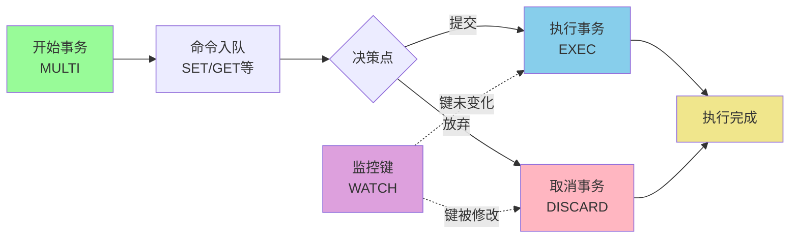
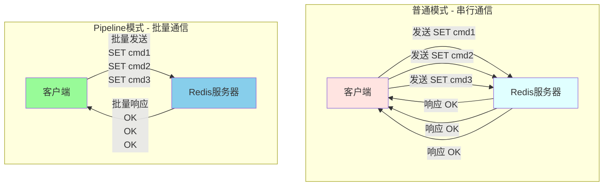
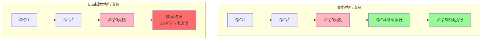
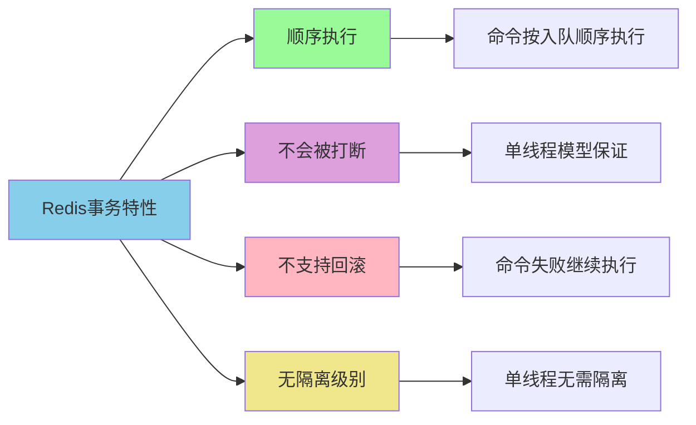
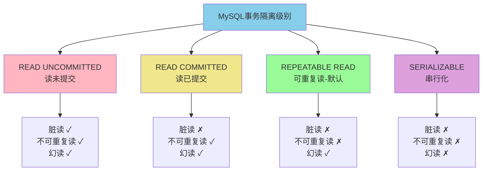

# Redis事务与原子性操作

## Redis事务的核心机制

Redis作为高性能的内存数据库，提供了简单但实用的事务机制。与传统关系型数据库不同，Redis的事务设计更注重性能和简洁性，适合特定的应用场景。

### 事务的基本概念

Redis事务允许将多个命令打包成一个原子操作单元执行，确保这些命令在执行过程中不会被其他客户端的请求打断。这种机制主要用于保证业务操作的完整性。

**关键特性：**

- **命令队列化**：通过MULTI开启事务后，后续命令不会立即执行，而是被放入队列
- **批量执行**：执行EXEC后，所有队列中的命令会按顺序依次执行
- **不支持回滚**：这是Redis事务最显著的特点，执行失败的命令不影响其他命令

### 事务相关命令

Redis提供了一组完整的事务控制命令：



**命令说明：**

- **MULTI**：标记事务的起始点，之后的命令进入等待队列
- **EXEC**：触发事务执行，按照入队顺序依次运行所有命令
- **DISCARD**：废弃事务，清空命令队列，放弃执行
- **WATCH**：对指定键进行监控，实现乐观锁机制
- **UNWATCH**：移除对所有键的监控

### 事务执行中的错误处理

Redis的事务错误分为两个阶段：

#### 命令入队阶段的错误

在MULTI到EXEC之间，如果命令存在语法错误、参数错误或内存不足等问题，Redis会在命令排队时检测并标记。当执行EXEC时，整个事务会被拒绝执行。

```java
// 示例：用户注册流程中的语法错误
Jedis jedis = new Jedis("localhost", 6379);

Transaction tx = jedis.multi();
// 正确的命令
tx.hset("user:1001", "username", "zhangsan");
tx.hset("user:1001", "email", "zhangsan@example.com");
// 语法错误：HSET命令参数不足
tx.hset("user:1001", "phone");  // 缺少value参数

// EXEC执行时会直接失败，所有命令都不会执行
List<Object> result = tx.exec();
// result为null，表示事务执行失败
```

#### 命令执行阶段的错误

执行EXEC后，如果某个命令因为数据类型不匹配等运行时错误而失败，Redis会继续执行队列中的其他命令，而不会回滚。

```java
// 示例：商品信息更新场景
Jedis jedis = new Jedis("localhost", 6379);

// 先设置一个字符串类型的商品价格
jedis.set("product:2001:price", "299.00");

Transaction tx = jedis.multi();
// 更新商品名称 - 正常执行
tx.set("product:2001:name", "无线蓝牙耳机");
// 尝试对字符串类型执行列表操作 - 运行时错误
tx.lpush("product:2001:price", "399.00");
// 更新商品库存 - 正常执行
tx.set("product:2001:stock", "500");

List<Object> result = tx.exec();
// 结果：第1和第3个命令成功执行，第2个命令失败但不影响其他命令
// result[0] = "OK"
// result[1] = 错误信息
// result[2] = "OK"
```

**Redis不支持回滚的原因：**

Redis官方认为，命令执行阶段的错误（如类型错误）是编程错误，应该在开发和测试阶段就被发现和修复。不提供回滚机制可以保持Redis的简单性和高性能。

### 实战案例：秒杀场景

```java
// 场景：电商秒杀活动库存扣减
public class SeckillService {
    private Jedis jedis = new Jedis("localhost", 6379);
    
    public boolean seckill(String activityId, String userId) {
        String stockKey = "seckill:" + activityId + ":stock";
        String orderKey = "seckill:" + activityId + ":orders";
        
        // 监控库存键，防止并发修改
        jedis.watch(stockKey);
        
        // 检查库存
        String stock = jedis.get(stockKey);
        if (Integer.parseInt(stock) <= 0) {
            jedis.unwatch();
            return false;
        }
        
        // 开启事务
        Transaction tx = jedis.multi();
        
        // 扣减库存
        tx.decr(stockKey);
        
        // 记录订单
        String orderInfo = userId + ":" + System.currentTimeMillis();
        tx.sadd(orderKey, orderInfo);
        
        // 更新用户秒杀记录
        tx.set("user:" + userId + ":seckill:" + activityId, "success");
        
        // 执行事务
        List<Object> result = tx.exec();
        
        // 如果result为null，说明库存被其他客户端修改，秒杀失败
        return result != null;
    }
}
```

## Pipeline批处理机制

### Pipeline的设计理念

Redis的Pipeline是一种网络优化技术，旨在减少客户端与服务器之间的往返通信次数（RTT - Round Trip Time）。在没有Pipeline的情况下，每执行一个Redis命令都需要完整的请求-响应周期。



### Pipeline与事务的核心区别

虽然Pipeline和事务都涉及批量命令执行，但它们的设计目的和保证机制完全不同：

**相同点：**
- 都支持批量提交多个命令
- 命令执行过程中，某个命令失败不影响其他命令
- 都不支持回滚机制

**不同点：**

| 特性 | Pipeline | 事务(Transaction) |
|------|---------|------------------|
| 原子性保证 | **无原子性保证** | **保证原子性** |
| 命令打断 | 可能被其他客户端命令打断 | 执行过程不会被打断 |
| 主要目的 | 减少网络往返，提升性能 | 保证多命令的原子执行 |
| 适用场景 | 大批量数据操作 | 业务逻辑相关的操作组合 |

### Pipeline实战应用

**场景：批量导入商品数据**

```java
import redis.clients.jedis.Jedis;
import redis.clients.jedis.Pipeline;
import java.util.List;

public class ProductBatchImport {
    
    public void importProducts(List<Product> products) {
        try (Jedis jedis = new Jedis("localhost", 6379)) {
            Pipeline pipeline = jedis.pipelined();
            
            for (Product product : products) {
                String key = "product:" + product.getId();
                
                // 设置商品基本信息
                pipeline.hset(key, "name", product.getName());
                pipeline.hset(key, "price", String.valueOf(product.getPrice()));
                pipeline.hset(key, "category", product.getCategory());
                
                // 添加到分类集合
                pipeline.sadd("category:" + product.getCategory(), key);
                
                // 如果是热门商品，加入有序集合
                if (product.isHot()) {
                    pipeline.zadd("hot:products", product.getSales(), key);
                }
            }
            
            // 批量执行所有命令
            List<Object> responses = pipeline.syncAndReturnAll();
            
            System.out.println("导入完成，执行了 " + responses.size() + " 条命令");
        }
    }
}
```

**性能对比示例：**

```java
// 场景：更新1000个用户的积分
public class PerformanceComparison {
    
    // 方式1：逐条执行（耗时长）
    public void updatePointsNormal(Jedis jedis, Map<String, Integer> userPoints) {
        long start = System.currentTimeMillis();
        
        for (Map.Entry<String, Integer> entry : userPoints.entrySet()) {
            jedis.incrBy("user:" + entry.getKey() + ":points", entry.getValue());
        }
        
        System.out.println("普通模式耗时: " + (System.currentTimeMillis() - start) + "ms");
        // 预计耗时: 2000-3000ms (假设每次RTT为2-3ms)
    }
    
    // 方式2：Pipeline批量执行（性能提升显著）
    public void updatePointsPipeline(Jedis jedis, Map<String, Integer> userPoints) {
        long start = System.currentTimeMillis();
        
        Pipeline pipeline = jedis.pipelined();
        for (Map.Entry<String, Integer> entry : userPoints.entrySet()) {
            pipeline.incrBy("user:" + entry.getKey() + ":points", entry.getValue());
        }
        pipeline.sync();
        
        System.out.println("Pipeline模式耗时: " + (System.currentTimeMillis() - start) + "ms");
        // 预计耗时: 50-100ms (只有少量RTT)
    }
}
```

## Lua脚本与原子性保障

### Lua脚本的优势

Redis从2.6版本开始支持Lua脚本，为开发者提供了更强大的原子性操作能力。相比事务，Lua脚本可以包含复杂的逻辑判断和流程控制。

### Lua脚本与事务的对比

**原子性执行差异：**



Redis事务在某个命令失败后会继续执行后续命令，而Lua脚本一旦遇到错误会立即终止整个脚本的执行。

### 核心区别详解

#### 1. 网络交互次数

**事务模式：**
```java
// 每个命令都需要单独发送到Redis
Transaction tx = jedis.multi();
tx.set("key1", "value1");  // 网络交互1
tx.set("key2", "value2");  // 网络交互2
tx.incr("counter");        // 网络交互3
tx.exec();                 // 网络交互4
// 总共4次网络往返
```

**Lua脚本：**
```java
// 整个脚本一次性发送
String script = 
    "redis.call('set', KEYS[1], ARGV[1]) " +
    "redis.call('set', KEYS[2], ARGV[2]) " +
    "redis.call('incr', KEYS[3]) " +
    "return 'OK'";

jedis.eval(script, 3, "key1", "key2", "counter", "value1", "value2");
// 只需1次网络往返
```

#### 2. 命令间依赖关系

**事务限制：**
```java
// 事务无法基于前一个命令的结果进行决策
Transaction tx = jedis.multi();
tx.get("user:1001:balance");  // 获取余额
tx.decrBy("user:1001:balance", 100);  // 无法根据余额判断是否扣减
tx.exec();
// 无法在事务内部判断余额是否足够
```

**Lua脚本的灵活性：**
```lua
-- 支付扣款场景：先查询余额，再决定是否扣款
local balance = redis.call('get', KEYS[1])
local amount = tonumber(ARGV[1])

if tonumber(balance) >= amount then
    redis.call('decrby', KEYS[1], amount)
    redis.call('lpush', KEYS[2], ARGV[2])  -- 记录交易流水
    return 1  -- 扣款成功
else
    return 0  -- 余额不足
end
```

```java
// Java调用
String luaScript = 
    "local balance = redis.call('get', KEYS[1]) " +
    "local amount = tonumber(ARGV[1]) " +
    "if tonumber(balance) >= amount then " +
    "    redis.call('decrby', KEYS[1], amount) " +
    "    redis.call('lpush', KEYS[2], ARGV[2]) " +
    "    return 1 " +
    "else " +
    "    return 0 " +
    "end";

Object result = jedis.eval(luaScript, 
    Arrays.asList("user:1001:balance", "user:1001:transactions"),
    Arrays.asList("100", "payment_order_12345"));

if ((Long) result == 1) {
    System.out.println("扣款成功");
} else {
    System.out.println("余额不足");
}
```

#### 3. 流程控制能力

Lua脚本支持丰富的编程结构：

```lua
-- 复杂的促销规则计算
local totalAmount = tonumber(ARGV[1])
local userLevel = redis.call('get', KEYS[1])
local discount = 1.0

-- 根据用户等级计算折扣
if userLevel == 'VIP' then
    discount = 0.8
elseif userLevel == 'SVIP' then
    discount = 0.7
end

-- 满减活动
if totalAmount >= 200 then
    discount = discount - 0.1
elseif totalAmount >= 100 then
    discount = discount - 0.05
end

-- 计算最终价格
local finalPrice = math.floor(totalAmount * discount)
redis.call('set', KEYS[2], finalPrice)

return finalPrice
```

### 实战案例：分布式限流器

```java
/**
 * 基于Lua脚本实现的滑动窗口限流器
 * 场景：API接口限流，限制每个用户每分钟最多调用100次
 */
public class RedisRateLimiter {
    
    private static final String RATE_LIMIT_SCRIPT = 
        "local key = KEYS[1] " +
        "local limit = tonumber(ARGV[1]) " +
        "local window = tonumber(ARGV[2]) " +
        "local current = tonumber(ARGV[3]) " +
        
        // 移除窗口外的记录
        "redis.call('zremrangebyscore', key, 0, current - window) " +
        
        // 获取当前窗口内的请求数
        "local count = redis.call('zcard', key) " +
        
        // 判断是否超过限制
        "if count < limit then " +
        "    redis.call('zadd', key, current, current) " +
        "    redis.call('expire', key, window) " +
        "    return 1 " +
        "else " +
        "    return 0 " +
        "end";
    
    private Jedis jedis;
    
    public boolean allowRequest(String userId) {
        String key = "rate_limit:user:" + userId;
        long currentTime = System.currentTimeMillis();
        
        Object result = jedis.eval(
            RATE_LIMIT_SCRIPT,
            Collections.singletonList(key),
            Arrays.asList("100", "60000", String.valueOf(currentTime))
        );
        
        return (Long) result == 1;
    }
}
```

## Redis与MySQL事务的本质差异

### 事务定义的不同取向

Redis和MySQL都声称支持事务，但两者对事务的定义和实现目标存在本质差异。这种差异源于它们的定位：Redis是高性能缓存，MySQL是可靠的持久化数据库。

### Redis事务的轻量级设计

Redis提供的是一种**简化的事务机制**，核心目标是保证一组命令按顺序执行，中间不被打断。

**Redis事务特点：**



**设计权衡：**

Redis放弃了传统事务的复杂特性，换取了极致的性能和简单性。作为缓存系统，Redis优先保证高吞吐量和低延迟，对数据一致性的要求相对宽松。

### MySQL事务的ACID保障

MySQL作为企业级数据库，严格遵循ACID事务特性：

#### Atomicity（原子性）

事务中的所有操作要么全部成功，要么全部失败回滚，不存在部分成功的状态。

```sql
-- 转账场景：原子性保证
START TRANSACTION;

-- 从张三账户扣款
UPDATE account SET balance = balance - 500 WHERE user_id = 'zhangsan';

-- 向李四账户加钱
UPDATE account SET balance = balance + 500 WHERE user_id = 'lisi';

-- 如果任何一步失败，所有操作都会回滚
COMMIT;
```

对应的Redis实现则无法保证原子性：

```java
// Redis无法保证完整的原子性
Transaction tx = jedis.multi();
tx.decrBy("account:zhangsan:balance", 500);
tx.incrBy("account:lisi:balance", 500);  // 如果这一步失败，上一步不会回滚
tx.exec();
```

#### Consistency（一致性）

数据库始终从一个一致状态转换到另一个一致状态，不会出现中间状态。

```sql
-- 库存扣减场景：一致性约束
START TRANSACTION;

-- 检查库存约束
SELECT stock FROM product WHERE id = 1001 FOR UPDATE;

-- 如果库存充足才扣减（保证库存不为负）
UPDATE product 
SET stock = stock - 1 
WHERE id = 1001 AND stock > 0;

COMMIT;
```

#### Isolation（隔离性）

MySQL支持四种隔离级别，控制并发事务之间的可见性：



**隔离级别实战：**

```sql
-- 会话1：可重复读级别下的查询
SET SESSION TRANSACTION ISOLATION LEVEL REPEATABLE READ;
START TRANSACTION;

-- 第一次查询
SELECT price FROM product WHERE id = 1001;  -- 结果：299.00

-- 此时会话2修改了价格并提交

-- 第二次查询（可重复读保证看到的仍是旧值）
SELECT price FROM product WHERE id = 1001;  -- 结果：仍然是 299.00

COMMIT;
```

Redis作为单线程模型，天然不存在并发事务，因此没有隔离级别的概念。

#### Durability（持久性）

事务提交后，数据永久保存，即使系统崩溃也能恢复。

MySQL通过以下机制保证持久性：

- **Redo Log（重做日志）**：记录数据页的物理修改，用于崩溃恢复
- **Binlog（二进制日志）**：记录逻辑SQL语句，用于主从复制和数据恢复
- **两阶段提交**：协调Redo Log和Binlog的一致性

```sql
-- MySQL持久化保证
START TRANSACTION;
INSERT INTO order (order_no, amount) VALUES ('ORD202312010001', 299.00);
COMMIT;  -- 提交后，即使服务器宕机，数据也不会丢失
```

Redis虽然支持RDB和AOF持久化，但存在数据丢失风险：
- RDB快照：两次快照之间的数据可能丢失
- AOF日志：根据配置（everysec/always），可能丢失1秒或更多数据

### 性能与可靠性的权衡

| 特性维度 | Redis | MySQL |
|---------|-------|-------|
| 事务回滚 | ✗ 不支持 | ✓ 完整支持 |
| 隔离级别 | ✗ 无隔离级别概念 | ✓ 四种隔离级别 |
| 持久化保证 | △ 可能丢失部分数据 | ✓ 事务提交后持久化 |
| 并发控制 | ✗ 单线程无需处理 | ✓ 锁机制+MVCC |
| 崩溃恢复 | △ 依赖RDB/AOF | ✓ Redo Log保证 |
| 执行性能 | ⚡ 极高（内存操作） | △ 相对较低（磁盘IO） |
| 适用场景 | 缓存、计数、排行榜 | 核心业务数据存储 |

### 实战选型建议

**选择Redis事务的场景：**

```java
// 场景1：网站访问计数（允许少量误差）
public void recordPageView(String pageId, String userId) {
    Transaction tx = jedis.multi();
    tx.incr("page:" + pageId + ":views");
    tx.sadd("page:" + pageId + ":visitors", userId);
    tx.zadd("page:views:rank", 1, pageId);
    tx.exec();
    // 即使部分命令失败，对业务影响不大
}

// 场景2：游戏排行榜更新
public void updateGameScore(String userId, int score) {
    Transaction tx = jedis.multi();
    tx.zadd("game:rank:today", score, userId);
    tx.zadd("game:rank:week", score, userId);
    tx.set("user:" + userId + ":latest_score", String.valueOf(score));
    tx.exec();
}
```

**选择MySQL事务的场景：**

```java
// 场景1：订单支付（需要严格的原子性）
@Transactional(rollbackFor = Exception.class)
public void processPayment(Order order, Payment payment) {
    // 扣减账户余额
    accountMapper.deductBalance(order.getUserId(), order.getAmount());
    
    // 更新订单状态
    orderMapper.updateStatus(order.getId(), "PAID");
    
    // 记录支付流水
    paymentMapper.insert(payment);
    
    // 扣减商品库存
    productMapper.deductStock(order.getProductId(), order.getQuantity());
    
    // 任何一步失败，整个事务回滚
}

// 场景2：银行转账（必须保证一致性）
@Transactional(isolation = Isolation.REPEATABLE_READ)
public void transfer(String fromAccount, String toAccount, BigDecimal amount) {
    // 锁定源账户
    Account from = accountMapper.selectForUpdate(fromAccount);
    
    // 检查余额
    if (from.getBalance().compareTo(amount) < 0) {
        throw new InsufficientBalanceException();
    }
    
    // 扣款
    accountMapper.updateBalance(fromAccount, from.getBalance().subtract(amount));
    
    // 加款
    accountMapper.updateBalance(toAccount, amount);
    
    // 记录交易
    transactionMapper.insert(new Transaction(fromAccount, toAccount, amount));
}
```

### 为什么Redis不支持回滚

Redis官方文档明确指出不支持回滚的原因：

**1. 保持简单性和高性能**

回滚机制需要维护大量的状态信息和日志，会显著降低Redis的性能。Redis的设计哲学是通过简单的实现获得极致的性能。

**2. Redis命令失败是编程错误**

Redis认为，执行阶段的命令失败（如类型错误）是开发者的编程错误，应该在开发和测试阶段被发现，而不是依赖运行时的回滚机制。

```java
// 典型的编程错误：类型不匹配
jedis.set("user:1001:age", "25");
// 错误：对字符串类型执行列表操作
jedis.lpush("user:1001:age", "26");  // 这是编程错误，应该在测试时发现
```

**3. 定位决定设计**

作为缓存系统，Redis优先保证性能，对数据一致性的要求相对宽松。如果需要严格的事务ACID特性，应该使用MySQL等关系型数据库。

## 总结

Redis提供了多种保证原子性操作的方式，各有特点和适用场景：

- **事务(Transaction)**：简单的命令批量执行，适合基础的原子性需求
- **Pipeline**：网络优化工具，批量提交命令提升性能，无原子性保证
- **Lua脚本**：最强大的原子性保障，支持复杂逻辑和流程控制
- **对比MySQL**：Redis追求性能和简洁，MySQL保证严格的ACID特性

在实际应用中，应根据业务场景选择合适的方案：
- 缓存、计数器、排行榜等场景：优先使用Redis事务或Lua脚本
- 涉及金钱、库存等核心数据：必须使用MySQL事务保证数据安全性
- 大批量数据操作：使用Pipeline提升性能
- 复杂业务逻辑的原子操作：使用Lua脚本实现
