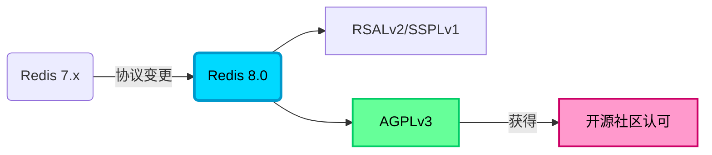
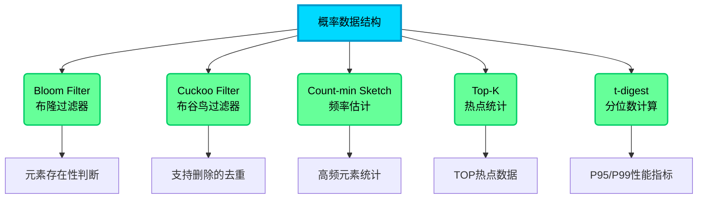
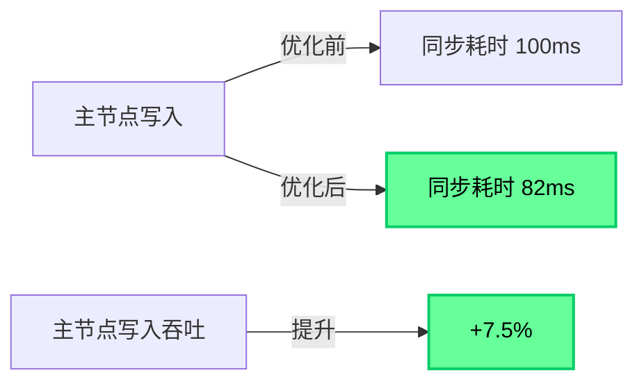
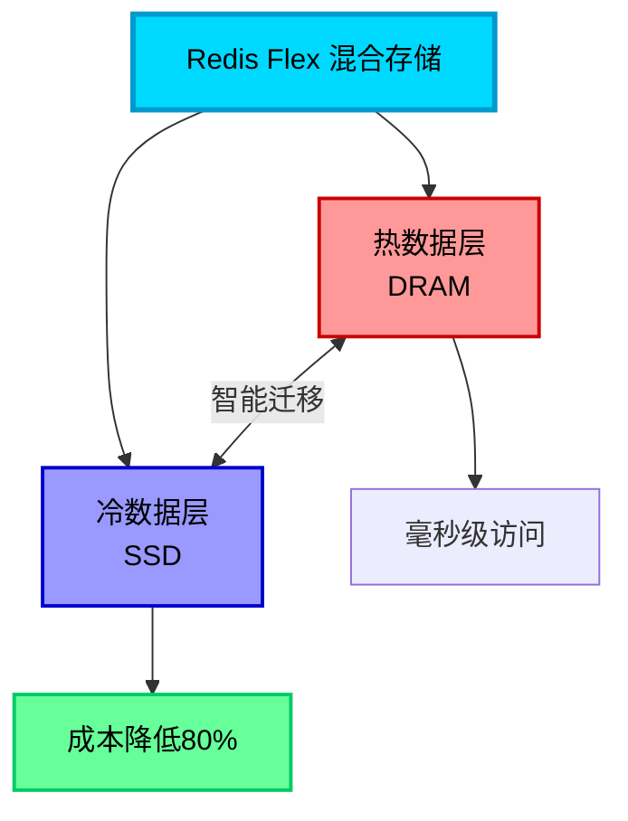
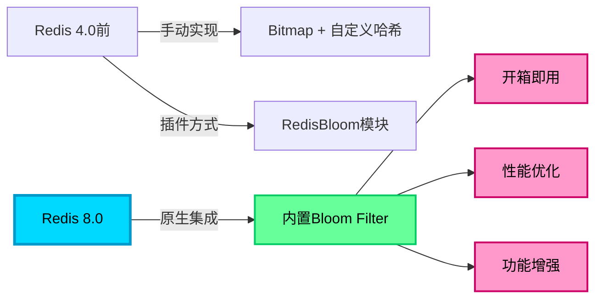

# Redis 8.0版本新特性详解

## Redis 8.0 的重要更新

2025年5月1日，Redis 正式发布了 8.0 版本，这个版本带来了诸多令人兴奋的新特性和性能优化。本文将深入解析 Redis 8.0 的核心更新内容。

官方发布公告：[https://redis.io/blog/redis-8-ga/](https://redis.io/blog/redis-8-ga/)  
详细更新文档：[https://redis.io/docs/latest/develop/whats-new/8-0/](https://redis.io/docs/latest/develop/whats-new/8-0/)

## 开源协议的重大调整

### 重新拥抱开源社区

Redis 8.0 在许可证方面做出了重要变更，在保留原有 RSALv2 和 SSPLv1 双协议授权的前提下，新增了 **AGPLv3**（Affero General Public License v3）开源协议选项。这一调整使得 Redis 重新获得了主流开源社区的广泛认可和支持。

同时，官方将免费版本的命名从 "Redis Community Edition" 正式更名为 "Redis Open Source"，进一步凸显其开源属性，彰显了对开源社区的承诺。



## 全新数据结构与功能增强

Redis 8.0 引入了 **8 种新的数据结构**，极大地扩展了其应用场景和能力边界。

### Vector Set - AI 时代的原生支持

Vector Set 是专门为人工智能应用设计的向量集合数据结构（目前处于 Beta 阶段）。它支持高维向量嵌入的高效存储与相似性检索，非常适合以下场景：
- 智能推荐系统
- 语义搜索引擎
- 图像识别与检索
- 自然语言处理应用

在基准测试中，Redis 8.0 的向量计算能力可达到每秒 **66K-160K** 次向量插入，同时支持实时索引构建和高精度相似度搜索。

### 原生 JSON 数据类型

Redis 8.0 内置了完整的 JSON 数据类型支持，无需格式转换即可直接存储和操作 JSON 文档。支持基于 JSONPath 的原子级操作，大大简化了复杂数据结构的处理流程。

```java
// 电商平台商品信息存储示例
jedis.jsonSet("product:12345", "$", "{\"name\":\"智能手表\",\"price\":1299,\"stock\":100}");

// 使用 JSONPath 原子更新库存
jedis.jsonSet("product:12345", "$.stock", "95");

// 查询商品价格
String price = jedis.jsonGet("product:12345", "$.price");
```

### 时间序列数据结构

新增的时间序列类型专门优化了带时间戳数据的处理能力，特别适用于：
- 物联网传感器数据采集
- 系统监控遥测指标
- 金融市场实时行情（股票、期货、外汇、数字货币等）
- 业务指标时序分析

### 概率型数据结构家族

Redis 8.0 新增了 **5 种概率型数据结构**，为海量数据处理提供了高效的近似计算能力：



#### Bloom Filter（布隆过滤器）

高效判断元素是否可能存在于集合中，允许一定的误判率但绝不漏判，常用于缓存穿透防护。

```java
// 用户注册时检查邮箱是否已存在
RBloomFilter<String> emailFilter = redisson.getBloomFilter("registered:emails");
emailFilter.tryInit(10000000L, 0.01); // 预期1000万条，误判率1%

// 添加已注册邮箱
emailFilter.add("user@example.com");

// 快速检查
if (emailFilter.contains("newuser@example.com")) {
    // 可能存在，需进一步数据库确认
} else {
    // 一定不存在，可直接注册
}
```

#### Cuckoo Filter（布谷鸟过滤器）

相比布隆过滤器的优势在于支持元素删除操作，更加灵活。

#### Count-min Sketch

用于估算数据流中元素出现的频率，适用于热点数据统计。

```java
// 统计文章访问频次
// BF.CMS.INCRBY article:views article:1001 1
// BF.CMS.QUERY article:views article:1001
```

#### Top-K

自动维护数据流中出现频率最高的 K 个元素，实时热榜的最佳选择。

```java
// 实时热搜榜
// TOPK.ADD trending:keywords "人工智能" "Redis8.0" "Spring Boot"
// TOPK.LIST trending:keywords  // 返回Top10热词
```

#### t-digest

精确计算数值型数据的分位数，广泛应用于性能监控指标分析（如 P95、P99 延迟）。

```java
// API响应时间分位数统计
// TDIGEST.ADD api:latency 45 67 89 120 156 200 ...
// TDIGEST.QUANTILE api:latency 0.95 0.99  // 查询P95和P99延迟
```

## 性能优化与扩展能力提升

### I/O 多线程重大改进

Redis 8.0 深度优化了 I/O 多线程的实现机制。启用 `io-threads` 参数后，在高并发场景下吞吐量最高可提升 **112%**（约 2 倍性能增长），单实例可轻松突破百万级 QPS。

```bash
# redis.conf 配置示例
io-threads 4
io-threads-do-reads yes
```

### 命令执行性能加速

通过底层算法和数据结构优化，Redis 8.0 对 90 个常用命令的执行延迟进行了全面优化：
- **BITMAP** 相关操作性能提升 **87.4%**
- **ZSET** 范围查询优化 **42.3%**
- **HASH** 批量操作延迟降低 **35.6%**
- 平均命令延迟降低范围：**5.4% - 87.4%**

### 主从复制机制优化

新的复制协议降低了主从同步耗时约 **18%**，同时主节点的写入吞吐率提升了 **7.5%**，进一步增强了主从架构的数据一致性保障能力。



### 水平与垂直扩展能力

Redis 8.0 在集群模式下支持更强大的索引管理能力，通过多进程协同处理，能够更好地应对海量数据存储和查询需求。

## AI 与大数据场景深度融合

### Redis for AI

Redis 8.0 整合了向量数据库与缓存技术，能够显著降低对大型语言模型（LLM）的直接调用依赖，提升生成式 AI 应用的响应速度：
- **向量语义缓存**：缓存常见问题的向量表示和答案
- **上下文检索加速**：快速匹配历史对话上下文
- **知识库检索**：高效的 RAG（检索增强生成）支持

### Redis Flex 混合存储

通过 DRAM 与 SSD 的智能分层存储，Redis Flex 能够在保持高性能的同时，将存储成本降低高达 **80%**。热数据保留在内存中保证访问速度，冷数据自动下沉到 SSD 节省成本。



## 开发者工具与生态整合

### Redis Copilot AI 助手

Redis 8.0 集成了自然语言 AI 助手 Redis Copilot，支持：
- 自然语言转 Redis 命令
- 代码片段智能生成
- 查询语句优化建议
- 最佳实践推荐

```plaintext
开发者: "查询最近7天访问量前10的用户"
Copilot: ZREVRANGE user:visits 0 9 WITHSCORES
```

### 可视化工具全面升级

- **Redis Insight**：原生支持 8.0 所有新特性的可视化管理
- **VS Code 插件**：完整兼容并集成 Redis Copilot 交互
- **命令行增强**：更友好的自动补全和语法提示

### 模块整合简化部署

Redis 8.0 将之前独立的扩展模块（JSON、时间序列、概率数据结构等）直接整合进核心代码库，大幅简化了部署和维护工作。开发者无需再单独安装和配置各类插件模块。

## 布隆过滤器的演进历史

### Redis 4.0 之前的实现方式

在 Redis 原生支持布隆过滤器之前，开发者主要通过以下方式实现：

1. **基于 Bitmap 手动实现**：利用 Redis 的位图数据结构，自行编写哈希函数和误判率控制逻辑，开发复杂度较高。

```java
// 手动实现布隆过滤器示例（Redis 4.0前）
public class ManualBloomFilter {
    private Jedis jedis;
    private String key;
    
    public void add(String element) {
        long hash1 = MurmurHash.hash64(element, 0);
        long hash2 = MurmurHash.hash64(element, hash1);
        
        for (int i = 0; i < 3; i++) {
            long pos = (hash1 + i * hash2) % 10000000;
            jedis.setbit(key, pos, true);
        }
    }
    
    public boolean contains(String element) {
        // 类似的检查逻辑
    }
}
```

2. **第三方 RedisBloom 模块**：需要单独安装和维护 RedisBloom 插件，增加了运维成本。

### Redis 8.0 的原生集成

Redis 8.0 将布隆过滤器及其他概率数据结构**原生整合到核心代码库**，成为开箱即用的内置功能：

**核心优势：**
- **零配置使用**：无需安装额外模块，直接使用 `BF.ADD`、`BF.EXISTS` 等命令
- **性能深度优化**：与 Redis 核心引擎深度整合，结合多线程查询优化，吞吐量大幅提升
- **功能更强大**：支持动态调整误判率（`BF.RESERVE`）、批量操作（`BF.MADD`/`BF.MEXISTS`）
- **生态协同**：与向量搜索、JSON 查询等新特性无缝配合

```java
// Redis 8.0 原生命令使用
RBloomFilter<String> filter = redisson.getBloomFilter("user:ids");
filter.tryInit(1000000L, 0.01);

// 批量添加
filter.add("user001");
filter.add("user002");

// 批量检查
boolean exists = filter.contains("user001");
```



## 总结

Redis 8.0 是一个里程碑式的版本更新，不仅在许可证层面重新拥抱开源社区，更在技术层面带来了全方位的升级：

- **8 种新数据结构**满足 AI、大数据等新兴场景需求
- **性能提升翻倍**，单实例可达百万级 QPS
- **成本降低 80%**（混合存储方案）
- **开发体验大幅优化**（AI 助手、工具链完善）

对于已经在使用 Redis 的团队，8.0 版本值得认真评估和升级；对于正在选型缓存方案的新项目，Redis 8.0 无疑是当前最强大和全面的选择之一。
