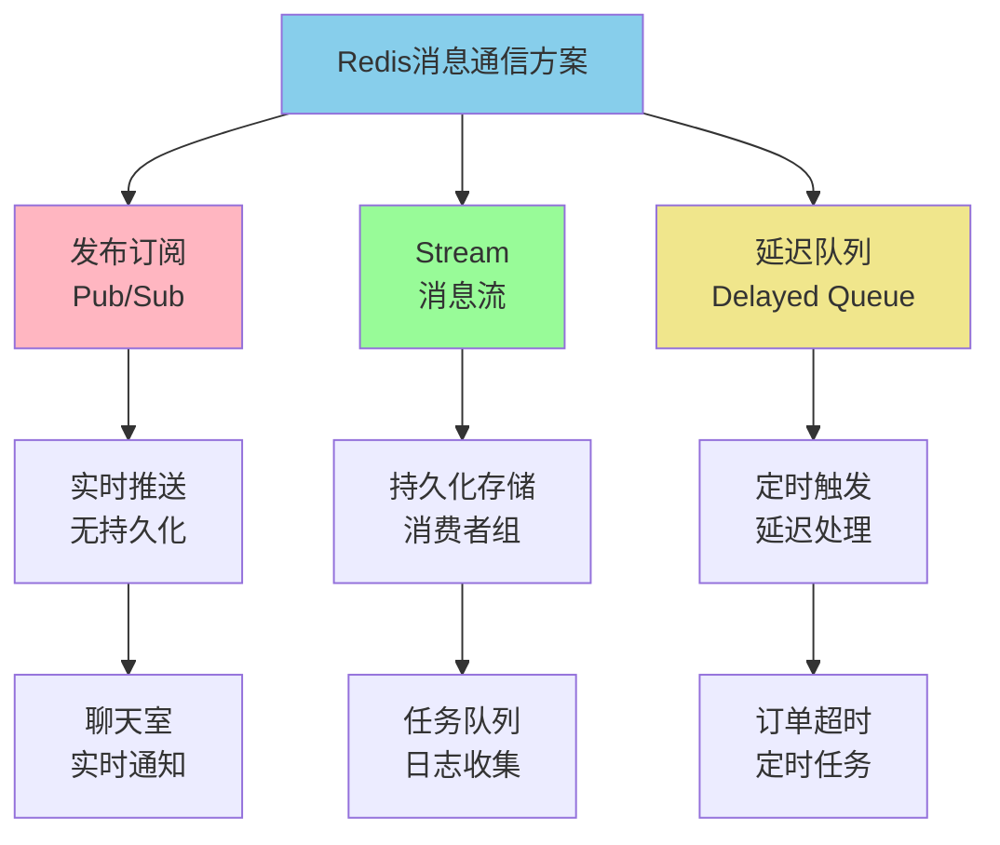
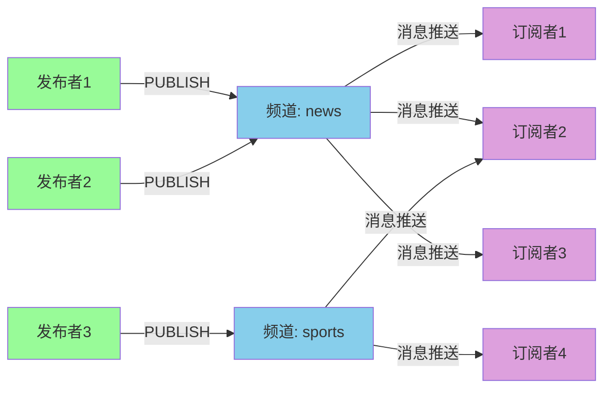
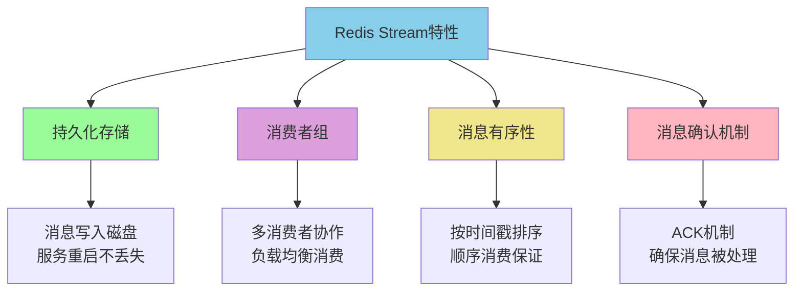
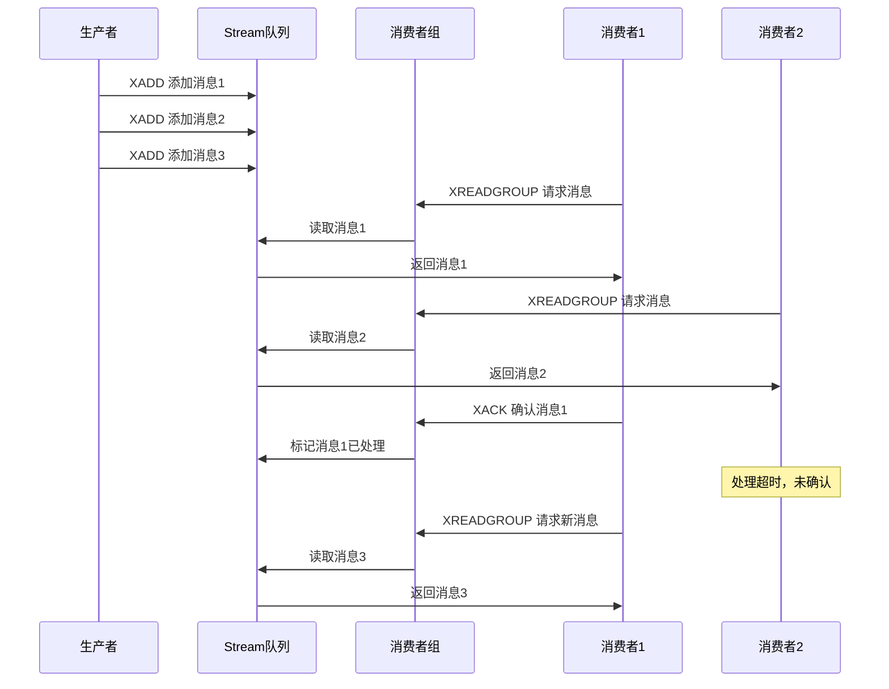
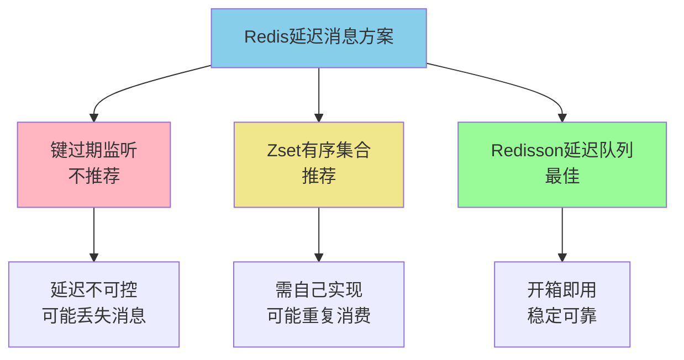

# Redis消息队列与通信模式

## Redis消息通信机制概览

Redis作为高性能的内存数据库，不仅可以用于数据缓存，还提供了多种消息通信和队列机制。从早期的Pub/Sub模式，到后来引入的Stream数据结构，Redis在消息队列领域逐渐完善。

### 消息通信方案对比



## 发布订阅模式详解

### Pub/Sub基本原理

Redis的发布订阅（Publish/Subscribe）是一种消息传递模式，发布者将消息发送到指定频道，所有订阅该频道的客户端都会实时收到消息。

**核心概念：**

- **发布者（Publisher）**：向频道发送消息的客户端
- **订阅者（Subscriber）**：订阅频道并接收消息的客户端
- **频道（Channel）**：消息传递的逻辑通道



### 实战应用场景

#### 场景1：实时聊天系统

```java
/**
 * 聊天室实现：多人在线聊天
 */
public class ChatRoomService {
    private Jedis jedis = new Jedis("localhost", 6379);
    
    // 发布消息到聊天室
    public void sendMessage(String roomId, String username, String message) {
        String channel = "chatroom:" + roomId;
        String msg = username + ": " + message;
        
        // 发布消息到频道
        jedis.publish(channel, msg);
        
        // 同时保存到历史记录（用LIST存储最近100条）
        String historyKey = "chatroom:" + roomId + ":history";
        jedis.lpush(historyKey, msg);
        jedis.ltrim(historyKey, 0, 99);
    }
    
    // 订阅聊天室消息
    public void subscribeRoom(String roomId) {
        JedisPubSub listener = new JedisPubSub() {
            @Override
            public void onMessage(String channel, String message) {
                System.out.println("[" + channel + "] " + message);
                // 在实际应用中，这里会通过WebSocket推送给客户端
            }
            
            @Override
            public void onSubscribe(String channel, int subscribedChannels) {
                System.out.println("成功订阅频道: " + channel);
            }
        };
        
        // 阻塞订阅（通常在单独的线程中执行）
        jedis.subscribe(listener, "chatroom:" + roomId);
    }
}
```

#### 场景2：系统日志监控

```java
/**
 * 日志聚合系统：实时收集各服务的错误日志
 */
public class LogMonitorService {
    
    // 日志级别频道
    private static final String ERROR_CHANNEL = "logs:error";
    private static final String WARNING_CHANNEL = "logs:warning";
    private static final String INFO_CHANNEL = "logs:info";
    
    // 发布日志
    public void publishLog(String level, String serviceName, String message) {
        Jedis jedis = new Jedis("localhost", 6379);
        String channel = "logs:" + level.toLowerCase();
        
        // 构造日志消息
        String logMessage = String.format("[%s] %s - %s - %s",
            new SimpleDateFormat("yyyy-MM-dd HH:mm:ss").format(new Date()),
            serviceName,
            level,
            message
        );
        
        jedis.publish(channel, logMessage);
    }
    
    // 监控错误日志
    public void monitorErrors() {
        Jedis jedis = new Jedis("localhost", 6379);
        
        JedisPubSub monitor = new JedisPubSub() {
            @Override
            public void onMessage(String channel, String message) {
                // 收到错误日志，触发告警
                System.err.println("⚠️ 错误告警: " + message);
                sendAlertToAdmin(message);
            }
        };
        
        // 订阅错误和警告日志
        new Thread(() -> {
            jedis.subscribe(monitor, ERROR_CHANNEL, WARNING_CHANNEL);
        }).start();
    }
    
    private void sendAlertToAdmin(String message) {
        // 发送邮件、短信或钉钉通知
    }
}
```

#### 场景3：缓存更新通知

```java
/**
 * 分布式缓存同步：缓存更新时通知其他节点
 */
public class CacheInvalidationService {
    private Jedis jedis = new Jedis("localhost", 6379);
    private LocalCache localCache = new LocalCache();
    
    // 更新数据并通知其他节点
    public void updateProduct(Product product) {
        // 1. 更新数据库
        productDao.update(product);
        
        // 2. 更新本地缓存
        localCache.put("product:" + product.getId(), product);
        
        // 3. 发布缓存失效消息
        String channel = "cache:invalidate:product";
        jedis.publish(channel, String.valueOf(product.getId()));
    }
    
    // 订阅缓存失效消息
    public void subscribeCacheInvalidation() {
        JedisPubSub listener = new JedisPubSub() {
            @Override
            public void onMessage(String channel, String productId) {
                // 收到通知，清除本地缓存
                localCache.remove("product:" + productId);
                System.out.println("已清除商品缓存: " + productId);
            }
        };
        
        new Thread(() -> {
            jedis.subscribe(listener, "cache:invalidate:product");
        }).start();
    }
}
```

#### 场景4：实时数据推送

```java
/**
 * 股票行情推送：实时推送股票价格变动
 */
public class StockPriceService {
    
    // 发布股票价格更新
    public void publishPriceUpdate(String stockCode, double price, double change) {
        Jedis jedis = new Jedis("localhost", 6379);
        String channel = "stock:price:" + stockCode;
        
        // 构造价格数据（JSON格式）
        String priceData = String.format(
            "{\"code\":\"%s\",\"price\":%.2f,\"change\":%.2f,\"time\":\"%s\"}",
            stockCode, price, change, 
            new SimpleDateFormat("HH:mm:ss").format(new Date())
        );
        
        jedis.publish(channel, priceData);
    }
    
    // 订阅自选股价格变动
    public void subscribeMyStocks(List<String> stockCodes) {
        Jedis jedis = new Jedis("localhost", 6379);
        
        JedisPubSub listener = new JedisPubSub() {
            @Override
            public void onMessage(String channel, String message) {
                // 解析价格数据
                System.out.println("价格更新: " + message);
                // 实际应用中通过WebSocket推送到前端
                notifyWebSocketClient(message);
            }
        };
        
        // 订阅多只股票
        String[] channels = stockCodes.stream()
            .map(code -> "stock:price:" + code)
            .toArray(String[]::new);
        
        new Thread(() -> {
            jedis.subscribe(listener, channels);
        }).start();
    }
}
```

### 模式匹配订阅

Redis支持通配符订阅，可以同时订阅多个符合模式的频道：

```java
/**
 * 使用模式匹配订阅多个频道
 */
public void subscribeWithPattern() {
    Jedis jedis = new Jedis("localhost", 6379);
    
    JedisPubSub listener = new JedisPubSub() {
        @Override
        public void onPMessage(String pattern, String channel, String message) {
            System.out.printf("模式[%s] 频道[%s]: %s%n", pattern, channel, message);
        }
    };
    
    // 订阅所有订单相关的频道
    // 可以匹配: order:created, order:paid, order:shipped 等
    jedis.psubscribe(listener, "order:*");
    
    // 订阅所有用户操作频道
    // 可以匹配: user:login, user:logout, user:register 等
    jedis.psubscribe(listener, "user:*");
}
```

### Pub/Sub的优缺点

**优点：**

1. **实时性高**：消息发布后立即推送给所有订阅者，延迟极低
2. **灵活性强**：订阅者可以随时订阅或取消订阅，支持模式匹配
3. **解耦合**：发布者和订阅者不需要知道对方的存在
4. **支持多订阅者**：一个消息可以被多个订阅者同时接收

**缺点：**

1. **消息不持久化**：消息发布后如果没有订阅者在线，消息会丢失
2. **可靠性低**：订阅者断线期间的消息无法恢复
3. **无消息确认机制**：发布者不知道消息是否被成功接收
4. **不适合高频场景**：大量消息会增加订阅者的处理压力

### 使用建议

Pub/Sub适合以下场景：
- ✓ 实时通知、即时消息
- ✓ 缓存同步、配置更新
- ✓ 实时数据推送、监控告警
- ✗ 不适合可靠性要求高的业务
- ✗ 不适合需要消息持久化的场景

对于需要可靠消息传递的场景，建议使用Redis Stream。

## Redis Stream深度剖析

### Stream的诞生背景

在Redis 5.0之前，开发者常用Pub/Sub实现消息队列，但存在消息易丢失的问题。Redis Stream应运而生，提供了一个功能完善、持久化的消息流数据结构。

### Stream核心特性



### Stream数据结构

Stream可以看作是一个有序的消息日志，每个消息都有一个唯一的ID（时间戳+序列号）：

```
Stream: task_queue
├── 1701234567890-0: {type: "email", to: "user@example.com", subject: "Welcome"}
├── 1701234568123-0: {type: "sms", phone: "13800138000", content: "验证码"}
├── 1701234569456-0: {type: "push", userId: "1001", message: "新订单通知"}
└── 1701234570789-0: {type: "email", to: "admin@example.com", subject: "Alert"}
```

### 核心命令详解

#### XADD - 添加消息

```java
/**
 * 向Stream中添加消息
 */
public String addMessage(Jedis jedis, String streamKey, Map<String, String> message) {
    // 使用 * 让Redis自动生成消息ID（当前时间戳）
    String messageId = jedis.xadd(streamKey, null, message);
    return messageId;
}

// 使用示例：发送邮件任务
Map<String, String> emailTask = new HashMap<>();
emailTask.put("type", "email");
emailTask.put("to", "customer@example.com");
emailTask.put("subject", "订单确认");
emailTask.put("content", "您的订单已确认");

String msgId = addMessage(jedis, "task:queue", emailTask);
System.out.println("消息ID: " + msgId);  // 输出: 1701234567890-0
```

#### XREAD - 读取消息

```java
/**
 * 从Stream中读取消息
 */
public void readMessages(Jedis jedis, String streamKey) {
    // 从头开始读取5条消息
    List<Entry<String, List<StreamEntry>>> results = 
        jedis.xread(5, 0, new AbstractMap.SimpleEntry<>(streamKey, "0-0"));
    
    for (Entry<String, List<StreamEntry>> entry : results) {
        String stream = entry.getKey();
        List<StreamEntry> messages = entry.getValue();
        
        for (StreamEntry msg : messages) {
            System.out.println("消息ID: " + msg.getID());
            System.out.println("消息内容: " + msg.getFields());
        }
    }
}

// 阻塞读取新消息
public void readNewMessages(Jedis jedis, String streamKey, String lastId) {
    // BLOCK 5000 表示最多阻塞5秒
    List<Entry<String, List<StreamEntry>>> results = 
        jedis.xread(
            XReadParams.xReadParams().block(5000),
            Collections.singletonMap(streamKey, lastId)
        );
    
    // 处理新消息
    if (results != null && !results.isEmpty()) {
        // ...
    }
}
```

#### XGROUP - 消费者组

消费者组允许多个消费者协作处理消息流，实现负载均衡：

```java
/**
 * 消费者组实战：任务分发系统
 */
public class TaskDistributionSystem {
    private Jedis jedis = new Jedis("localhost", 6379);
    private static final String STREAM_KEY = "task:queue";
    private static final String GROUP_NAME = "task_workers";
    
    // 创建消费者组
    public void createConsumerGroup() {
        try {
            // 从Stream的起始位置创建消费者组
            jedis.xgroupCreate(STREAM_KEY, GROUP_NAME, "0", false);
            System.out.println("消费者组创建成功");
        } catch (Exception e) {
            System.out.println("消费者组已存在");
        }
    }
    
    // 消费者从组中读取消息
    public void consumeMessages(String consumerName) {
        while (true) {
            // 从组中读取消息，每次最多读取10条
            List<Entry<String, List<StreamEntry>>> results = jedis.xreadGroup(
                GROUP_NAME,           // 消费者组名
                consumerName,         // 消费者名称（如worker-1, worker-2）
                10,                   // 读取消息数量
                5000,                 // 阻塞时间（毫秒）
                false,                // 不读取pending消息
                new AbstractMap.SimpleEntry<>(STREAM_KEY, ">")  // > 表示读取新消息
            );
            
            if (results != null && !results.isEmpty()) {
                for (Entry<String, List<StreamEntry>> entry : results) {
                    for (StreamEntry message : entry.getValue()) {
                        // 处理消息
                        processTask(message);
                        
                        // 确认消息已处理
                        jedis.xack(STREAM_KEY, GROUP_NAME, message.getID());
                    }
                }
            }
        }
    }
    
    private void processTask(StreamEntry message) {
        Map<String, String> task = message.getFields();
        String taskType = task.get("type");
        
        System.out.printf("[%s] 处理任务 %s: %s%n", 
            Thread.currentThread().getName(), 
            message.getID(), 
            taskType);
        
        // 模拟任务处理
        try {
            Thread.sleep(1000);
        } catch (InterruptedException e) {
            e.printStackTrace();
        }
    }
    
    // 查看待处理消息（Pending List）
    public void checkPendingMessages() {
        // 查看组中所有待处理的消息
        List<StreamPendingEntry> pending = 
            jedis.xpending(STREAM_KEY, GROUP_NAME, null, null, 10, null);
        
        for (StreamPendingEntry entry : pending) {
            System.out.println("待处理消息ID: " + entry.getID());
            System.out.println("消费者: " + entry.getConsumerName());
            System.out.println("未确认时长: " + entry.getIdleTime() + "ms");
        }
    }
}

// 启动多个消费者
public static void main(String[] args) {
    TaskDistributionSystem system = new TaskDistributionSystem();
    system.createConsumerGroup();
    
    // 启动3个工作线程
    for (int i = 1; i <= 3; i++) {
        final String workerName = "worker-" + i;
        new Thread(() -> {
            system.consumeMessages(workerName);
        }, workerName).start();
    }
}
```

### 消费者组工作流程



### Stream实战案例

#### 案例1：订单处理系统

```java
/**
 * 订单异步处理：将订单处理任务放入Stream
 */
public class OrderProcessingSystem {
    private Jedis jedis = new Jedis("localhost", 6379);
    private static final String ORDER_STREAM = "orders:processing";
    private static final String GROUP = "order_processors";
    
    // 提交订单处理任务
    public void submitOrder(Order order) {
        Map<String, String> orderData = new HashMap<>();
        orderData.put("orderId", order.getId());
        orderData.put("userId", order.getUserId());
        orderData.put("amount", String.valueOf(order.getAmount()));
        orderData.put("status", "PENDING");
        orderData.put("createTime", String.valueOf(System.currentTimeMillis()));
        
        String messageId = jedis.xadd(ORDER_STREAM, null, orderData);
        System.out.println("订单已提交到处理队列: " + messageId);
    }
    
    // 订单处理器
    public void startOrderProcessor(String processorId) {
        // 确保消费者组存在
        try {
            jedis.xgroupCreate(ORDER_STREAM, GROUP, "0", false);
        } catch (Exception ignored) {}
        
        System.out.println("订单处理器启动: " + processorId);
        
        while (true) {
            List<Entry<String, List<StreamEntry>>> results = jedis.xreadGroup(
                GROUP, processorId, 1, 5000, false,
                new AbstractMap.SimpleEntry<>(ORDER_STREAM, ">")
            );
            
            if (results != null) {
                for (Entry<String, List<StreamEntry>> entry : results) {
                    for (StreamEntry message : entry.getValue()) {
                        processOrder(message);
                        jedis.xack(ORDER_STREAM, GROUP, message.getID());
                    }
                }
            }
        }
    }
    
    private void processOrder(StreamEntry message) {
        Map<String, String> order = message.getFields();
        String orderId = order.get("orderId");
        
        try {
            // 1. 验证库存
            checkInventory(orderId);
            
            // 2. 扣减库存
            deductInventory(orderId);
            
            // 3. 创建物流单
            createShipment(orderId);
            
            // 4. 发送通知
            sendNotification(order.get("userId"), orderId);
            
            System.out.println("✓ 订单处理完成: " + orderId);
            
        } catch (Exception e) {
            System.err.println("✗ 订单处理失败: " + orderId + ", " + e.getMessage());
            // 可以将失败的订单放入死信队列
            jedis.xadd("orders:failed", null, order);
        }
    }
}
```

#### 案例2：日志收集系统

```java
/**
 * 分布式日志收集：各服务将日志发送到Stream
 */
public class LogCollectionSystem {
    private Jedis jedis = new Jedis("localhost", 6379);
    private static final String LOG_STREAM = "logs:application";
    
    // 发送日志
    public void sendLog(String service, String level, String message) {
        Map<String, String> log = new HashMap<>();
        log.put("service", service);
        log.put("level", level);
        log.put("message", message);
        log.put("timestamp", String.valueOf(System.currentTimeMillis()));
        log.put("hostname", getHostname());
        
        jedis.xadd(LOG_STREAM, null, log);
    }
    
    // 日志消费者：写入Elasticsearch
    public void startLogConsumer() {
        String consumerGroup = "log_indexers";
        String consumerName = "indexer-" + UUID.randomUUID().toString();
        
        try {
            jedis.xgroupCreate(LOG_STREAM, consumerGroup, "0", false);
        } catch (Exception ignored) {}
        
        while (true) {
            List<Entry<String, List<StreamEntry>>> results = jedis.xreadGroup(
                consumerGroup, consumerName, 100, 1000, false,
                new AbstractMap.SimpleEntry<>(LOG_STREAM, ">")
            );
            
            if (results != null) {
                List<String> processedIds = new ArrayList<>();
                List<Map<String, String>> logs = new ArrayList<>();
                
                for (Entry<String, List<StreamEntry>> entry : results) {
                    for (StreamEntry message : entry.getValue()) {
                        logs.add(message.getFields());
                        processedIds.add(message.getID().toString());
                    }
                }
                
                // 批量写入Elasticsearch
                if (!logs.isEmpty()) {
                    batchIndexToES(logs);
                    
                    // 批量确认
                    for (String id : processedIds) {
                        jedis.xack(LOG_STREAM, consumerGroup, id);
                    }
                }
            }
        }
    }
    
    private void batchIndexToES(List<Map<String, String>> logs) {
        // 实际实现中调用Elasticsearch API
        System.out.println("批量写入ES: " + logs.size() + " 条日志");
    }
}
```

### Stream与Pub/Sub对比

| 特性 | Pub/Sub | Stream |
|------|---------|--------|
| 消息持久化 | ✗ 不持久化 | ✓ 持久化到磁盘 |
| 消息丢失 | ✓ 订阅者离线会丢失 | ✗ 可重新消费历史消息 |
| 消费者组 | ✗ 不支持 | ✓ 支持负载均衡 |
| 消息确认 | ✗ 无ACK机制 | ✓ 支持ACK确认 |
| 消息顺序 | ✓ 发布顺序 | ✓ 时间戳顺序 |
| 适用场景 | 实时通知、广播 | 任务队列、日志收集 |

## Redis延迟消息实现

### 业务场景

延迟消息在许多业务场景中都有应用：

- **订单超时关闭**：下单30分钟未支付自动取消
- **定时提醒**：会议前15分钟提醒
- **延迟任务**：用户注册后3天发送关怀邮件
- **限时优惠**：优惠券到期自动失效

### 方案对比



### 方案一：键过期监听（不推荐）

```java
/**
 * 基于键过期事件的延迟消息（存在严重问题）
 */
public class KeyExpirationListener extends JedisPubSub {
    
    @Override
    public void onPMessage(String pattern, String channel, String message) {
        // message 是过期的key
        if (message.startsWith("order:timeout:")) {
            String orderId = message.replace("order:timeout:", "");
            closeOrder(orderId);
        }
    }
    
    private void closeOrder(String orderId) {
        System.out.println("关闭超时订单: " + orderId);
    }
    
    public void subscribe() {
        Jedis jedis = new Jedis("localhost", 6379);
        // 订阅键过期事件（需要配置 notify-keyspace-events Ex）
        jedis.psubscribe(this, "__keyevent@0__:expired");
    }
}

// 设置延迟任务
public void createDelayedTask(String orderId, int delaySeconds) {
    Jedis jedis = new Jedis("localhost", 6379);
    String key = "order:timeout:" + orderId;
    // 设置键和过期时间
    jedis.setex(key, delaySeconds, orderId);
}
```

**严重问题：**
1. Redis不保证立即触发过期事件，延迟可能达到数分钟
2. 基于Pub/Sub，消息不持久化，客户端离线会丢失
3. 过期删除策略是惰性的，依赖访问或定期扫描

### 方案二：Zset实现（推荐）

```java
/**
 * 基于Zset实现的延迟队列
 */
public class ZsetDelayQueue {
    private Jedis jedis = new Jedis("localhost", 6379);
    private static final String DELAY_QUEUE_KEY = "delay:queue:orders";
    
    // 添加延迟任务
    public void addDelayTask(String orderId, long delayMillis) {
        long executeTime = System.currentTimeMillis() + delayMillis;
        
        // 将订单ID作为member，执行时间作为score
        jedis.zadd(DELAY_QUEUE_KEY, executeTime, orderId);
        
        System.out.println("添加延迟任务: " + orderId + 
            ", 执行时间: " + new Date(executeTime));
    }
    
    // 扫描并执行到期任务
    public void scanAndExecute() {
        while (true) {
            long now = System.currentTimeMillis();
            
            // 获取当前时间之前的所有任务（score <= now）
            Set<String> tasks = jedis.zrangeByScore(
                DELAY_QUEUE_KEY, 
                0, 
                now,
                0,  // offset
                10  // 每次最多取10个
            );
            
            if (tasks.isEmpty()) {
                try {
                    Thread.sleep(1000);  // 没有任务，休眠1秒
                } catch (InterruptedException e) {
                    e.printStackTrace();
                }
                continue;
            }
            
            for (String orderId : tasks) {
                // 尝试删除任务（防止重复执行）
                Long removed = jedis.zrem(DELAY_QUEUE_KEY, orderId);
                
                if (removed > 0) {
                    // 删除成功，执行任务
                    executeTask(orderId);
                }
            }
        }
    }
    
    private void executeTask(String orderId) {
        System.out.println("执行延迟任务: " + orderId);
        
        // 执行订单关闭逻辑
        closeOrder(orderId);
    }
    
    private void closeOrder(String orderId) {
        // 1. 查询订单状态
        // 2. 如果未支付，关闭订单
        // 3. 释放库存
        // 4. 发送通知
        System.out.println("订单已关闭: " + orderId);
    }
}

// 使用示例
public class OrderService {
    private ZsetDelayQueue delayQueue = new ZsetDelayQueue();
    
    public void createOrder(Order order) {
        // 保存订单
        orderDao.save(order);
        
        // 添加30分钟后的关闭任务
        delayQueue.addDelayTask(order.getId(), 30 * 60 * 1000);
        
        System.out.println("订单创建成功，30分钟后自动关闭");
    }
    
    // 启动延迟队列扫描线程
    public void startDelayQueueScanner() {
        new Thread(() -> {
            delayQueue.scanAndExecute();
        }, "delay-queue-scanner").start();
    }
}
```

**优化版本：分布式锁防止重复消费**

```java
public class ZsetDelayQueueWithLock {
    private Jedis jedis = new Jedis("localhost", 6379);
    private static final String DELAY_QUEUE_KEY = "delay:queue:orders";
    
    public void scanAndExecute() {
        while (true) {
            long now = System.currentTimeMillis();
            Set<String> tasks = jedis.zrangeByScore(DELAY_QUEUE_KEY, 0, now, 0, 10);
            
            if (tasks.isEmpty()) {
                sleep(1000);
                continue;
            }
            
            for (String orderId : tasks) {
                // 使用分布式锁防止多个消费者同时处理
                String lockKey = "lock:order:" + orderId;
                String lockValue = UUID.randomUUID().toString();
                
                // 尝试获取锁（SET NX EX）
                String result = jedis.set(lockKey, lockValue, 
                    SetParams.setParams().nx().ex(10));
                
                if ("OK".equals(result)) {
                    try {
                        // 获取锁成功，从队列中移除并执行
                        jedis.zrem(DELAY_QUEUE_KEY, orderId);
                        executeTask(orderId);
                    } finally {
                        // 释放锁（Lua脚本保证原子性）
                        releaseLock(lockKey, lockValue);
                    }
                }
            }
        }
    }
    
    private void releaseLock(String lockKey, String lockValue) {
        String script = 
            "if redis.call('get', KEYS[1]) == ARGV[1] then " +
            "    return redis.call('del', KEYS[1]) " +
            "else " +
            "    return 0 " +
            "end";
        
        jedis.eval(script, Collections.singletonList(lockKey), 
            Collections.singletonList(lockValue));
    }
}
```

### 方案三：Redisson延迟队列（最佳）

Redisson是基于Redis的Java客户端，提供了开箱即用的延迟队列实现：

```java
/**
 * 使用Redisson实现延迟队列
 */
public class RedissonDelayQueueExample {
    
    public static void main(String[] args) {
        // 配置Redisson
        Config config = new Config();
        config.useSingleServer().setAddress("redis://localhost:6379");
        RedissonClient redisson = Redisson.create(config);
        
        // 获取延迟队列
        RBlockingQueue<String> blockingQueue = redisson.getBlockingQueue("order_queue");
        RDelayedQueue<String> delayedQueue = redisson.getDelayedQueue(blockingQueue);
        
        // 生产者：添加延迟任务
        String orderId = "ORDER_20231201_001";
        delayedQueue.offer(orderId, 30, TimeUnit.MINUTES);
        System.out.println("订单已创建，30分钟后自动关闭");
        
        // 消费者：处理到期任务
        new Thread(() -> {
            while (true) {
                try {
                    // 阻塞获取到期的任务
                    String order = blockingQueue.take();
                    System.out.println("处理超时订单: " + order);
                    closeOrder(order);
                } catch (InterruptedException e) {
                    e.printStackTrace();
                }
            }
        }).start();
    }
    
    private static void closeOrder(String orderId) {
        System.out.println("关闭订单: " + orderId);
        // 执行关单逻辑
    }
}
```

**Redisson延迟队列完整案例：**

```java
/**
 * 订单超时自动关闭系统
 */
@Service
public class OrderTimeoutService {
    
    @Autowired
    private RedissonClient redissonClient;
    
    // 订单任务数据结构
    @Data
    public static class OrderTask implements Serializable {
        private String orderId;
        private String userId;
        private Long createTime;
    }
    
    private RBlockingQueue<OrderTask> blockingQueue;
    private RDelayedQueue<OrderTask> delayedQueue;
    
    @PostConstruct
    public void init() {
        blockingQueue = redissonClient.getBlockingQueue("order:timeout:queue");
        delayedQueue = redissonClient.getDelayedQueue(blockingQueue);
        
        // 启动消费者线程
        startConsumer();
    }
    
    // 创建订单时添加延迟任务
    public void addOrderTimeoutTask(String orderId, String userId) {
        OrderTask task = new OrderTask();
        task.setOrderId(orderId);
        task.setUserId(userId);
        task.setCreateTime(System.currentTimeMillis());
        
        // 30分钟后执行
        delayedQueue.offer(task, 30, TimeUnit.MINUTES);
        
        log.info("订单超时任务已添加: {}", orderId);
    }
    
    // 支付成功后取消延迟任务
    public void cancelOrderTimeoutTask(String orderId) {
        // Redisson延迟队列不支持直接移除，可以通过标记位实现
        // 或者在Redis中记录已支付订单，消费时检查
        redissonClient.getBucket("order:paid:" + orderId)
            .set("true", 31, TimeUnit.MINUTES);
    }
    
    // 启动消费者
    private void startConsumer() {
        // 可以启动多个消费者线程
        for (int i = 0; i < 3; i++) {
            new Thread(() -> {
                while (true) {
                    try {
                        // 阻塞获取到期任务
                        OrderTask task = blockingQueue.take();
                        processTimeoutOrder(task);
                    } catch (Exception e) {
                        log.error("处理订单超时任务失败", e);
                    }
                }
            }, "order-timeout-consumer-" + i).start();
        }
    }
    
    private void processTimeoutOrder(OrderTask task) {
        String orderId = task.getOrderId();
        
        // 检查订单是否已支付
        RBucket<String> paidFlag = redissonClient.getBucket("order:paid:" + orderId);
        if (paidFlag.isExists()) {
            log.info("订单已支付，跳过关闭: {}", orderId);
            return;
        }
        
        // 查询订单状态
        Order order = orderMapper.selectById(orderId);
        
        if (order == null) {
            log.warn("订单不存在: {}", orderId);
            return;
        }
        
        if (!"PENDING".equals(order.getStatus())) {
            log.info("订单状态不是待支付，跳过关闭: {}", orderId);
            return;
        }
        
        // 关闭订单
        order.setStatus("CLOSED");
        order.setCloseTime(new Date());
        orderMapper.updateById(order);
        
        // 恢复库存
        inventoryService.restoreStock(order.getProductId(), order.getQuantity());
        
        // 发送通知
        notificationService.sendOrderClosedNotification(task.getUserId(), orderId);
        
        log.info("订单已自动关闭: {}", orderId);
    }
    
    @PreDestroy
    public void destroy() {
        // 销毁延迟队列
        if (delayedQueue != null) {
            delayedQueue.destroy();
        }
    }
}
```

### 三种方案对比

| 方案 | 优点 | 缺点 | 推荐度 |
|------|------|------|--------|
| 键过期监听 | 实现简单 | 延迟不可控、消息易丢失 | ⭐ |
| Zset方案 | 可控性强、支持持久化 | 需要自己实现、可能重复消费 | ⭐⭐⭐ |
| Redisson | 开箱即用、稳定可靠、支持集群 | 依赖第三方库 | ⭐⭐⭐⭐⭐ |

## 总结

Redis提供了多种消息通信和队列机制，各有特点：

### 发布订阅（Pub/Sub）
- **适用场景**：实时通知、缓存同步、实时数据推送
- **优点**：实时性高、使用简单
- **缺点**：消息不持久化、可靠性低
- **典型应用**：聊天室、系统监控、配置更新通知

### Stream消息流
- **适用场景**：任务队列、日志收集、可靠消息传递
- **优点**：持久化、支持消费者组、消息确认机制
- **缺点**：相对复杂、需要管理消费者组
- **典型应用**：订单处理、数据同步、事件溯源

### 延迟队列
- **适用场景**：定时任务、订单超时、延迟提醒
- **推荐方案**：Redisson延迟队列（生产环境）、Zset方案（简单场景）
- **不推荐**：键过期监听（不可靠）

选择建议：
- 实时通知、广播消息 → Pub/Sub
- 可靠任务队列、需要确认机制 → Stream
- 延迟任务处理 → Redisson延迟队列
- 核心业务数据处理 → 考虑使用专业MQ（如RabbitMQ、Kafka）
