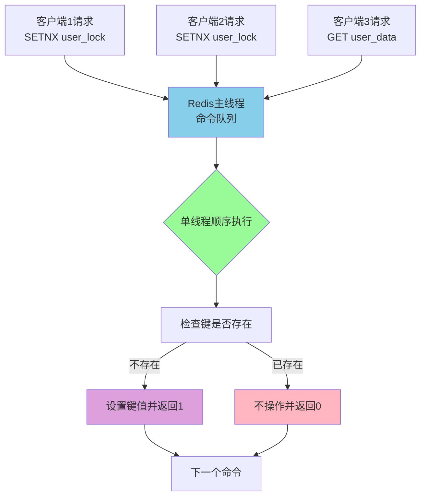

# Redis原子性操作与命令详解

## SETNX命令的原子性原理

在Redis中,SETNX(SET if Not eXists)是一个非常重要的原子性命令。理解其原子性的实现原理,对于后续使用Redis实现分布式锁等高级功能至关重要。

### 什么是SETNX命令

SETNX命令的完整含义是"SET if Not eXists",即只有当指定的键不存在时才设置值。这个命令在执行时会返回一个整数值:

- **返回1**:表示键不存在,设置成功
- **返回0**:表示键已存在,未做任何操作

```bash
# 场景:用户会话锁定机制
SETNX session:user:1001:lock "locked"
# 如果用户1001的会话未被锁定,返回1,设置成功
# 如果用户1001的会话已被锁定,返回0,设置失败
```

### 原子性的实现机制

SETNX命令的原子性源于Redis的核心架构设计——**单线程事件循环模型**。这个设计为命令执行提供了天然的原子性保障。



**核心特点:**

1. **顺序执行**:Redis主线程按照接收顺序依次处理每个命令,不存在并发执行的情况
2. **不可中断**:当SETNX命令开始执行时,整个"检查键是否存在→设置值"的过程无法被其他命令打断
3. **内存操作**:所有操作都在内存中完成,确保了极高的执行速度

### 为什么单线程能保证原子性

很多开发者会疑惑:单线程意味着同一时刻只能处理一个请求,那么多个客户端同时发送SETNX命令时会发生什么?

**执行流程分析:**

假设有三个客户端几乎同时对同一个键执行SETNX操作:

```java
// 客户端A
jedis.setnx("payment:order:20231201", "clientA");

// 客户端B (几乎同时)
jedis.setnx("payment:order:20231201", "clientB");

// 客户端C (几乎同时)
jedis.setnx("payment:order:20231201", "clientC");
```

虽然三个请求"几乎同时"到达Redis服务器,但由于单线程特性:

1. Redis会将这三个命令放入命令队列
2. 按照到达顺序(假设顺序为A→B→C)依次执行
3. 客户端A的SETNX首先执行,返回1(成功)
4. 客户端B的SETNX执行时发现键已存在,返回0(失败)
5. 客户端C的SETNX执行时发现键已存在,返回0(失败)

**关键点:** 整个过程中,键的检查和设置是一个不可分割的操作单元,不会出现多个客户端同时成功的情况。

### 原子性的应用价值

SETNX的原子性为分布式系统提供了基础的互斥机制,常用于:

- **防止重复提交**:用户提交订单时,用订单号作为键,防止重复提交
- **分布式锁**:多个服务实例竞争同一资源的访问权
- **幂等性保证**:接口调用的幂等性控制

```java
// 场景:防止用户重复下单
public class OrderService {
    private Jedis jedis = new Jedis("localhost", 6379);
    
    public boolean createOrder(String orderId, String userId) {
        String lockKey = "order:submit:" + orderId;
        
        // 利用SETNX的原子性防止重复提交
        Long result = jedis.setnx(lockKey, userId);
        
        if (result == 1) {
            // 设置10分钟过期,防止永久占用
            jedis.expire(lockKey, 600);
            
            // 执行订单创建逻辑
            processOrderCreation(orderId, userId);
            return true;
        } else {
            // 订单已提交过
            return false;
        }
    }
    
    private void processOrderCreation(String orderId, String userId) {
        // 订单创建的具体业务逻辑
        System.out.println("创建订单: " + orderId + " for user: " + userId);
    }
}
```

### 需要注意的问题

虽然SETNX本身是原子性的,但在实际应用中仍需注意:

**1. 组合命令的非原子性**

如果需要在SETNX之后执行其他操作,整体就不再具有原子性:

```bash
# 这两条命令的组合不是原子性的
SETNX inventory:product:1001 "100"
EXPIRE inventory:product:1001 3600
```

在SETNX执行成功后,EXPIRE执行前,如果Redis服务器崩溃,会导致键永久存在而无过期时间。

**2. 解决方案:使用SET命令的扩展参数**

Redis 2.6.12及以后版本提供了SET命令的扩展选项,可以原子性地完成"设置值+设置过期时间"的组合操作:

```bash
# 原子性地设置值和过期时间
SET inventory:product:1001 "100" NX EX 3600
```

参数说明:
- **NX**:只在键不存在时设置(等同于SETNX)
- **EX 3600**:设置过期时间为3600秒

**3. 事务和Lua脚本的使用**

对于更复杂的多命令组合,可以使用Redis事务或Lua脚本来保证原子性:

```java
// 使用Lua脚本保证原子性
String script = 
    "if redis.call('setnx', KEYS[1], ARGV[1]) == 1 then " +
    "  redis.call('expire', KEYS[1], ARGV[2]) " +
    "  return 1 " +
    "else " +
    "  return 0 " +
    "end";

Object result = jedis.eval(
    script, 
    Collections.singletonList("task:processing:5001"), 
    Arrays.asList("worker-node-01", "300")
);
```

## SETNX与SETEX的本质区别

在Redis的键值操作命令中,SETNX和SETEX是两个经常被混淆但实际上用途完全不同的命令。理解它们的区别,有助于在不同场景下选择合适的命令。

### 命令定义与功能

#### SETNX命令

**全称**: SET if Not eXists  
**核心功能**: 仅在键不存在时设置值

```bash
# 基本语法
SETNX key value

# 应用示例:用户登录状态标记
SETNX login:session:abc123 "user:1001"
# 如果会话abc123不存在,设置成功,返回1
# 如果会话abc123已存在,不做修改,返回0
```

**特点:**
- 具有条件性:只在键不存在时才执行
- 不支持直接设置过期时间
- 返回值:1表示成功,0表示失败
- 主要用于需要互斥性的场景

#### SETEX命令

**全称**: SET with EXpiration  
**核心功能**: 设置值并同时指定过期时间

```bash
# 基本语法
SETEX key seconds value

# 应用示例:验证码缓存
SETEX sms:verify:13800138000 300 "856432"
# 将手机号13800138000的验证码设置为856432,5分钟后自动过期
```

**特点:**
- 无条件执行:无论键是否存在都会设置
- 必须指定过期时间
- 设置和过期是原子操作
- 主要用于缓存场景

### 功能对比表

| 特性 | SETNX | SETEX |
|------|-------|-------|
| 执行条件 | 键不存在时才设置 | 无条件设置 |
| 过期时间 | 不支持直接设置 | 必须设置过期时间 |
| 返回值 | 1(成功) / 0(失败) | OK(总是成功) |
| 原子性 | 单命令原子 | 设置+过期原子 |
| 典型场景 | 分布式锁、幂等控制 | 缓存、临时数据 |

### 实际应用场景对比

#### 场景1:分布式锁(适合SETNX)

```java
// 使用SETNX实现分布式锁
public class DistributedLock {
    private Jedis jedis = new Jedis("localhost", 6379);
    
    public boolean acquireLock(String resourceId, String requestId) {
        String lockKey = "resource:lock:" + resourceId;
        
        // 使用SET命令的NX和EX参数(推荐方式)
        String result = jedis.set(
            lockKey, 
            requestId, 
            "NX",  // 等同于SETNX
            "EX", 
            30     // 30秒后自动释放锁
        );
        
        return "OK".equals(result);
    }
    
    public void releaseLock(String resourceId, String requestId) {
        String lockKey = "resource:lock:" + resourceId;
        
        // Lua脚本确保只释放自己的锁
        String script = 
            "if redis.call('get', KEYS[1]) == ARGV[1] then " +
            "  return redis.call('del', KEYS[1]) " +
            "else " +
            "  return 0 " +
            "end";
        
        jedis.eval(script, 
            Collections.singletonList(lockKey), 
            Collections.singletonList(requestId)
        );
    }
}
```

**为什么用SETNX而不是SETEX?**  
分布式锁需要互斥性,只有第一个设置成功的客户端才能获得锁。SETEX会无条件覆盖已有的锁,破坏互斥性。

#### 场景2:缓存热点数据(适合SETEX)

```java
// 使用SETEX缓存商品信息
public class ProductCache {
    private Jedis jedis = new Jedis("localhost", 6379);
    
    public void cacheProductInfo(String productId, String productJson) {
        String cacheKey = "product:info:" + productId;
        
        // 缓存商品信息,1小时后过期
        jedis.setex(cacheKey, 3600, productJson);
    }
    
    public String getProductInfo(String productId) {
        String cacheKey = "product:info:" + productId;
        String cached = jedis.get(cacheKey);
        
        if (cached == null) {
            // 缓存未命中,从数据库查询
            cached = queryFromDatabase(productId);
            // 重新缓存
            jedis.setex(cacheKey, 3600, cached);
        }
        
        return cached;
    }
    
    private String queryFromDatabase(String productId) {
        // 模拟数据库查询
        return "{\"id\":\"" + productId + "\",\"name\":\"无线蓝牙音箱\"}";
    }
}
```

**为什么用SETEX而不是SETNX?**  
缓存场景需要定期刷新数据,无论键是否存在都应该更新。同时必须设置过期时间,防止内存占用过多。

### SETNX的过期时间设置方案

虽然SETNX命令本身不支持设置过期时间,但在实际应用中几乎总是需要过期时间(防止死锁)。有以下几种方案:

#### 方案1:分离的SETNX和EXPIRE(不推荐)

```bash
SETNX task:lock:export:001 "worker-01"
EXPIRE task:lock:export:001 300
```

**问题**:两条命令不是原子操作,如果SETNX成功后Redis崩溃,锁会永久存在。

#### 方案2:使用SET命令的NX和EX参数(推荐)

```bash
SET task:lock:export:001 "worker-01" NX EX 300
```

**优点**:一条命令完成,保证原子性,是当前最佳实践。

#### 方案3:使用Lua脚本

```lua
-- setnx_with_expire.lua
if redis.call('setnx', KEYS[1], ARGV[1]) == 1 then
    redis.call('expire', KEYS[1], ARGV[2])
    return 1
else
    return 0
end
```

```java
// Java中调用Lua脚本
String script = "..."; // Lua脚本内容
Object result = jedis.eval(
    script, 
    Collections.singletonList("task:lock:export:001"),
    Arrays.asList("worker-01", "300")
);
```

**优点**:Lua脚本在Redis中以原子方式执行,可以处理更复杂的逻辑。

### 同时满足条件设置和过期时间的需求

从Redis 2.6.12版本开始,SET命令支持多个可选参数,可以完美替代SETNX+EXPIRE的组合:

```bash
# 只在键不存在时设置,并设置过期时间(秒)
SET key value NX EX seconds

# 只在键不存在时设置,并设置过期时间(毫秒)
SET key value NX PX milliseconds

# 只在键已存在时更新,并设置过期时间
SET key value XX EX seconds
```

**实际应用示例:**

```java
public class ModernRedisLock {
    private Jedis jedis = new Jedis("localhost", 6379);
    
    // 获取分布式锁
    public boolean tryLock(String lockKey, String requestId, int expireSeconds) {
        // 使用SET命令的扩展参数,一条命令完成所有操作
        String result = jedis.set(
            lockKey,           // 锁的键
            requestId,         // 锁的持有者标识
            "NX",             // 只在键不存在时设置
            "EX",             // 过期时间单位:秒
            expireSeconds     // 过期时间
        );
        
        return "OK".equals(result);
    }
    
    // 使用示例
    public void processTask() {
        String lockKey = "task:processing:daily-report";
        String requestId = UUID.randomUUID().toString();
        
        if (tryLock(lockKey, requestId, 60)) {
            try {
                // 执行业务逻辑
                generateDailyReport();
            } finally {
                // 释放锁
                releaseLock(lockKey, requestId);
            }
        } else {
            System.out.println("任务正在被其他进程处理");
        }
    }
    
    private void generateDailyReport() {
        System.out.println("生成日报...");
    }
    
    private void releaseLock(String lockKey, String requestId) {
        // 省略释放锁的逻辑(参考前面的示例)
    }
}
```

### 最佳实践建议

1. **分布式锁场景**:使用`SET key value NX EX seconds`,不要使用单独的SETNX
2. **缓存场景**:使用SETEX,明确指定过期时间
3. **临时标记**:如果需要条件设置+过期时间,使用SET命令的NX和EX参数
4. **版本兼容性**:确保Redis版本在2.6.12以上,才能使用SET命令的扩展参数

通过理解SETNX和SETEX的本质区别,以及现代Redis提供的SET命令扩展功能,我们可以更加优雅和安全地实现各种业务需求。
