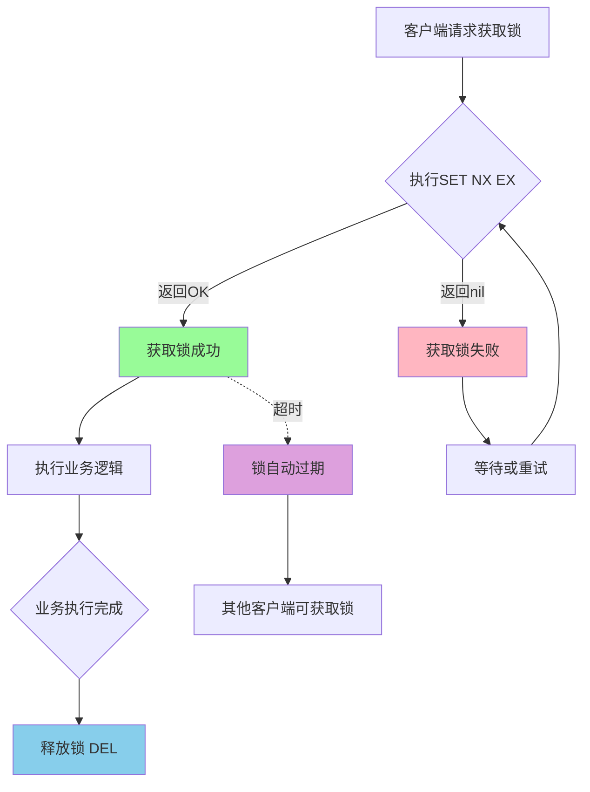
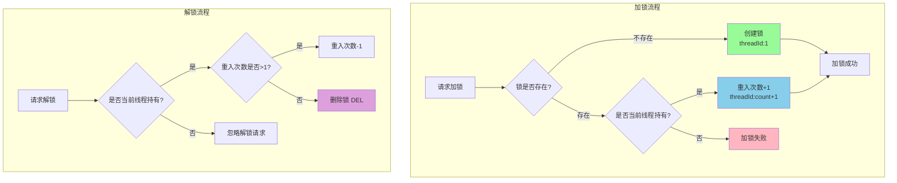
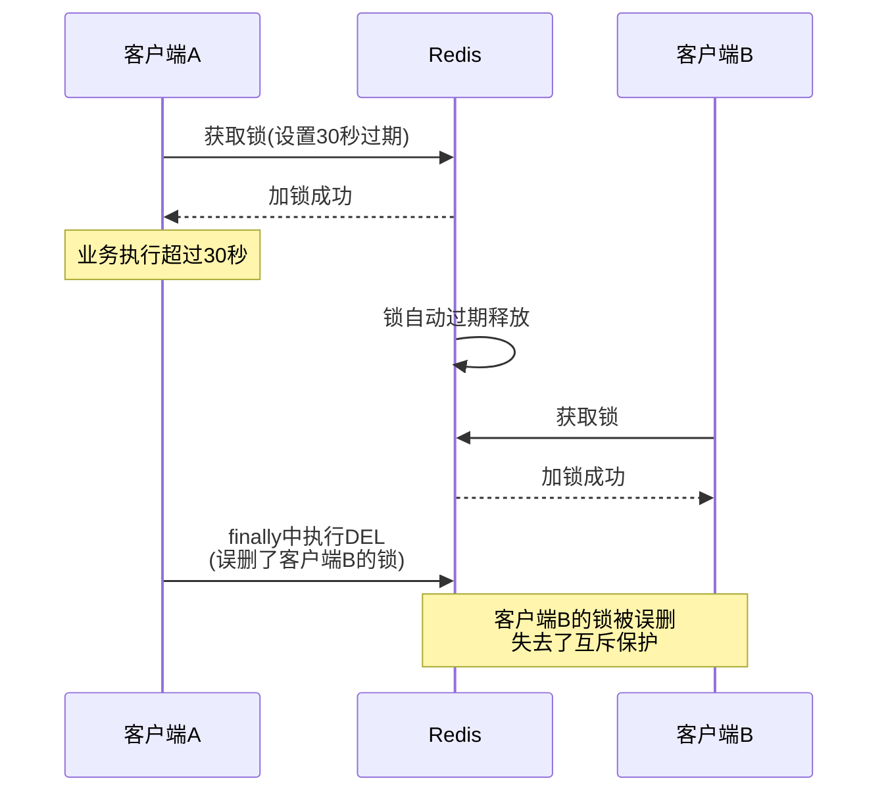
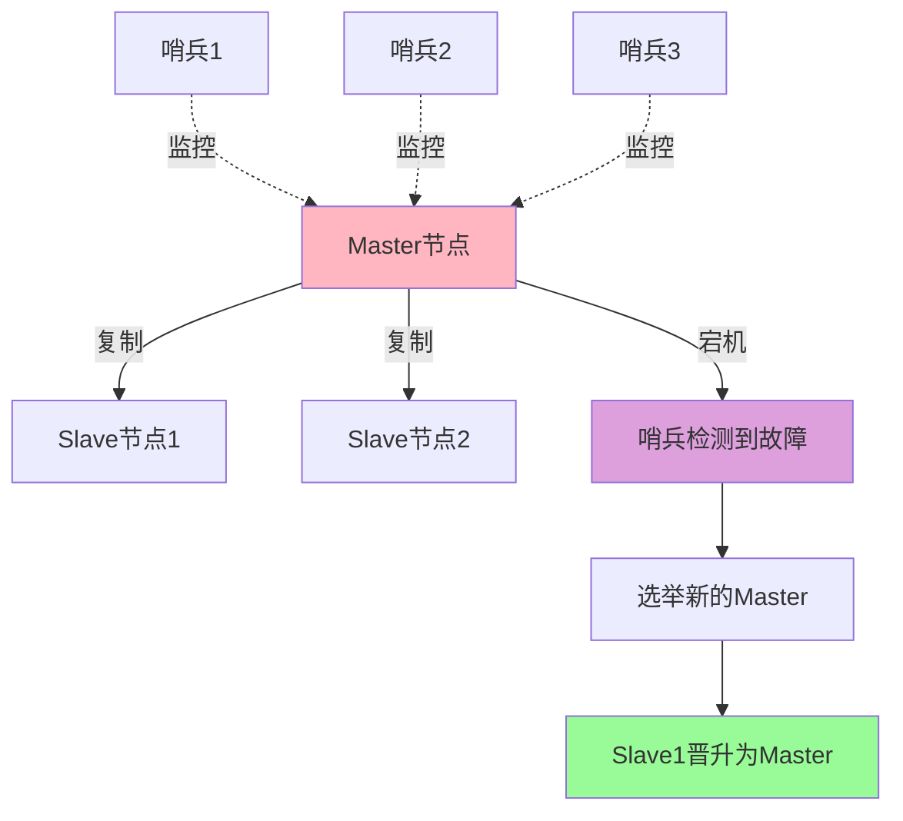
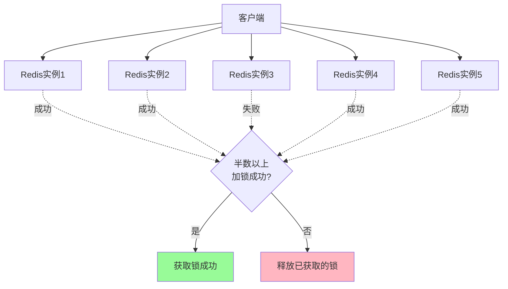
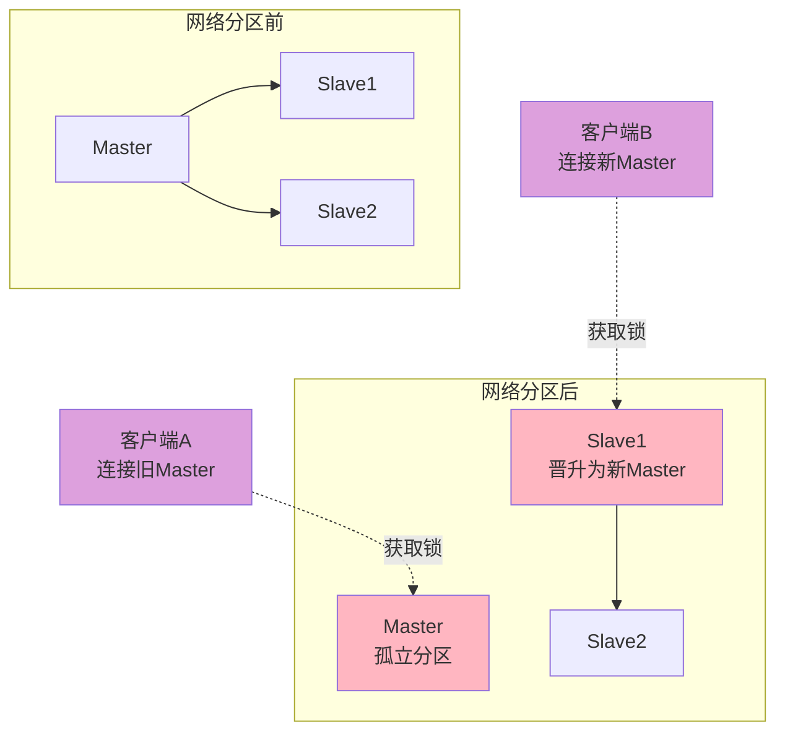

# Redis分布式锁实战指南

## 基于SETNX的分布式锁实现

分布式锁是分布式系统中控制并发访问共享资源的重要手段。Redis凭借其高性能和原子性命令,成为实现分布式锁的主流选择之一。

### 分布式锁的核心需求

在分布式环境中,一个完善的分布式锁需要满足以下核心要求:

**1. 互斥性(Mutual Exclusion)**  
在任意时刻,只能有一个客户端持有锁,其他客户端无法获取同一把锁。

**2. 安全性(Safety)**  
只有锁的持有者才能释放锁,避免误删其他客户端的锁。

**3. 容错性(Fault Tolerance)**  
即使持有锁的客户端崩溃,锁也能在一定时间后自动释放,避免死锁。

**4. 性能(Performance)**  
加锁和解锁操作的性能要足够高,不能成为系统瓶颈。

### 基础实现方案

利用Redis的SETNX命令(或SET命令的NX参数)可以实现基本的分布式锁:



**代码实现:**

```java
import redis.clients.jedis.Jedis;
import redis.clients.jedis.JedisPool;
import java.util.Collections;
import java.util.UUID;

public class RedisDistributedLock {
    private final JedisPool jedisPool;

    public RedisDistributedLock(JedisPool jedisPool) {
        this.jedisPool = jedisPool;
    }

    /**
     * 尝试获取分布式锁
     * @param lockKey 锁的键名
     * @param requestId 请求标识(用于标识锁的持有者)
     * @param expireTime 锁的过期时间(毫秒)
     * @return 是否成功获取锁
     */
    public boolean tryLock(String lockKey, String requestId, int expireTime) {
        try (Jedis jedis = jedisPool.getResource()) {
            // 使用SET命令的NX参数实现SETNX功能,PX参数设置毫秒级过期时间
            String result = jedis.set(lockKey, requestId, "NX", "PX", expireTime);
            return "OK".equals(result);
        }
    }

    /**
     * 释放分布式锁
     * @param lockKey 锁的键名
     * @param requestId 请求标识(确保只释放自己的锁)
     * @return 是否成功释放锁
     */
    public boolean unlock(String lockKey, String requestId) {
        try (Jedis jedis = jedisPool.getResource()) {
            // 使用Lua脚本确保检查和删除的原子性
            String script = 
                "if redis.call('get', KEYS[1]) == ARGV[1] then " +
                "  return redis.call('del', KEYS[1]) " +
                "else " +
                "  return 0 " +
                "end";
            
            Object result = jedis.eval(
                script, 
                Collections.singletonList(lockKey), 
                Collections.singletonList(requestId)
            );
            
            return Long.parseLong(result.toString()) == 1L;
        }
    }
}
```

**使用示例:**

```java
public class InventoryService {
    private RedisDistributedLock distributedLock;
    
    /**
     * 扣减库存(需要分布式锁保证并发安全)
     */
    public boolean deductInventory(String productId, int quantity) {
        String lockKey = "inventory:lock:" + productId;
        String requestId = UUID.randomUUID().toString();
        
        // 尝试获取锁,设置10秒超时
        if (distributedLock.tryLock(lockKey, requestId, 10000)) {
            try {
                // 执行库存扣减逻辑
                int currentStock = getCurrentStock(productId);
                
                if (currentStock >= quantity) {
                    updateStock(productId, currentStock - quantity);
                    System.out.println("库存扣减成功: " + productId);
                    return true;
                } else {
                    System.out.println("库存不足");
                    return false;
                }
            } finally {
                // 确保释放锁
                distributedLock.unlock(lockKey, requestId);
            }
        } else {
            System.out.println("获取锁失败,其他进程正在处理");
            return false;
        }
    }
    
    private int getCurrentStock(String productId) {
        // 模拟查询库存
        return 100;
    }
    
    private void updateStock(String productId, int newStock) {
        // 模拟更新库存
        System.out.println("更新库存为: " + newStock);
    }
}
```

### 基础实现的优缺点

**优点:**

1. **实现简单**:利用Redis原生命令,代码量少,易于理解
2. **性能高**:基于内存操作,加锁和解锁速度极快
3. **原子性保证**:SET命令的NX参数保证了互斥性

**缺点:**

1. **不支持可重入**:同一线程无法多次获取同一把锁
2. **锁无法续期**:如果业务执行时间超过锁的过期时间,锁会被自动释放
3. **单点故障**:依赖单个Redis实例,存在可用性风险
4. **不支持阻塞等待**:获取锁失败时需要客户端自行实现重试逻辑

## 可重入锁的实现原理

可重入锁(Reentrant Lock)是一种允许同一线程多次获取同一把锁而不会造成死锁的机制。这在复杂的业务场景中非常重要。

### 什么是可重入锁

**定义:** 可重入锁允许已持有锁的线程再次获取该锁,每次重入时增加计数,每次释放时减少计数,当计数为0时完全释放锁。

**场景示例:**

```java
// 场景:订单处理系统
public class OrderProcessor {
    private RedisReentrantLock lock;
    
    public void processOrder(String orderId) {
        lock.lock(orderId);  // 第1次加锁
        try {
            validateOrder(orderId);     // 验证订单
            calculatePrice(orderId);    // 计算价格(内部也需要加锁)
            createInvoice(orderId);     // 生成发票
        } finally {
            lock.unlock(orderId);  // 第1次解锁
        }
    }
    
    private void calculatePrice(String orderId) {
        lock.lock(orderId);  // 第2次加锁(重入)
        try {
            // 价格计算逻辑
            System.out.println("计算订单价格...");
        } finally {
            lock.unlock(orderId);  // 第2次解锁
        }
    }
    
    private void validateOrder(String orderId) {
        System.out.println("验证订单...");
    }
    
    private void createInvoice(String orderId) {
        System.out.println("生成发票...");
    }
}
```

如果没有可重入特性,`calculatePrice`方法会因为无法获取已被`processOrder`持有的锁而导致死锁。

### 实现思路

要实现可重入锁,需要解决两个核心问题:

1. **识别锁的持有者**:需要记录当前持有锁的线程或客户端标识
2. **记录重入次数**:需要维护一个计数器,跟踪锁被重入的次数

**数据结构设计:**

将锁的值设计为`线程标识:重入次数`的格式,例如:`thread-12345:3`表示线程12345持有锁,重入了3次。

### 代码实现

```java
import redis.clients.jedis.Jedis;
import java.util.UUID;

public class RedisReentrantLock {
    private Jedis jedis;

    public RedisReentrantLock(Jedis jedis) {
        this.jedis = jedis;
    }

    /**
     * 尝试获取可重入锁
     * @param lockKey 锁的键名
     * @return 是否成功获取锁
     */
    public synchronized boolean tryLock(String lockKey) {
        String currentThreadId = String.valueOf(Thread.currentThread().getId());

        // 尝试获取锁的当前值
        String lockValue = jedis.get(lockKey);
        
        if (lockValue == null) {
            // 锁不存在,首次加锁,重入次数设为1
            String result = jedis.set(
                lockKey, 
                currentThreadId + ":1", 
                "NX",   // 只在键不存在时设置
                "EX",   // 过期时间单位:秒
                30      // 30秒后自动释放
            );
            return "OK".equals(result);
        }

        // 锁已存在,检查是否由当前线程持有
        String[] parts = lockValue.split(":");
        
        if (parts.length == 2 && parts[0].equals(currentThreadId)) {
            // 当前线程持有锁,进行重入操作
            int count = Integer.parseInt(parts[1]) + 1;
            String result = jedis.set(
                lockKey, 
                currentThreadId + ":" + count, 
                "XX",   // 只在键存在时更新
                "EX",   // 刷新过期时间
                30
            );
            return "OK".equals(result);
        }

        // 锁被其他线程持有
        return false;
    }

    /**
     * 释放可重入锁
     * @param lockKey 锁的键名
     */
    public synchronized void unlock(String lockKey) {
        String currentThreadId = String.valueOf(Thread.currentThread().getId());

        String lockValue = jedis.get(lockKey);
        if (lockValue != null) {
            String[] parts = lockValue.split(":");
            
            if (parts.length == 2 && parts[0].equals(currentThreadId)) {
                int count = Integer.parseInt(parts[1]);
                
                if (count > 1) {
                    // 重入次数大于1,减少计数
                    jedis.set(
                        lockKey, 
                        currentThreadId + ":" + (count - 1), 
                        "XX", 
                        "EX", 
                        30
                    );
                } else {
                    // 重入次数为1,完全释放锁
                    jedis.del(lockKey);
                }
            }
        }
    }
}
```

### 加锁和解锁流程



### Lua脚本优化

上述实现使用`synchronized`关键字来保证并发安全,但这会降低性能。更好的方案是使用Lua脚本,利用Redis的单线程特性保证原子性。

**加锁Lua脚本:**

```lua
-- tryLock.lua
-- KEYS[1]: 锁的键名
-- ARGV[1]: 当前线程标识
-- ARGV[2]: 锁的过期时间(秒)

local lockValue = redis.call('get', KEYS[1])

if lockValue == false then
    -- 锁不存在,创建锁
    redis.call('setex', KEYS[1], ARGV[2], ARGV[1] .. ':1')
    return 1
else
    -- 解析锁的值
    local separator = string.find(lockValue, ':')
    local threadId = string.sub(lockValue, 1, separator - 1)
    local count = tonumber(string.sub(lockValue, separator + 1))
    
    if threadId == ARGV[1] then
        -- 当前线程持有锁,重入次数+1
        redis.call('setex', KEYS[1], ARGV[2], ARGV[1] .. ':' .. (count + 1))
        return 1
    end
end

return 0
```

**解锁Lua脚本:**

```lua
-- unlock.lua
-- KEYS[1]: 锁的键名
-- ARGV[1]: 当前线程标识

local lockValue = redis.call('get', KEYS[1])

if lockValue ~= false then
    local separator = string.find(lockValue, ':')
    local threadId = string.sub(lockValue, 1, separator - 1)
    local count = tonumber(string.sub(lockValue, separator + 1))
    
    if threadId == ARGV[1] then
        if count > 1 then
            -- 减少重入次数
            redis.call('set', KEYS[1], ARGV[1] .. ':' .. (count - 1))
            redis.call('expire', KEYS[1], 30)
        else
            -- 完全释放锁
            redis.call('del', KEYS[1])
        end
        return 1
    end
end

return 0
```

**Java调用Lua脚本:**

```java
public class LuaReentrantLock {
    private Jedis jedis;
    
    private static final String LOCK_SCRIPT = 
        "local lockValue = redis.call('get', KEYS[1]) " +
        "if lockValue == false then " +
        "  redis.call('setex', KEYS[1], ARGV[2], ARGV[1] .. ':1') " +
        "  return 1 " +
        "else " +
        "  local separator = string.find(lockValue, ':') " +
        "  local threadId = string.sub(lockValue, 1, separator - 1) " +
        "  local count = tonumber(string.sub(lockValue, separator + 1)) " +
        "  if threadId == ARGV[1] then " +
        "    redis.call('setex', KEYS[1], ARGV[2], ARGV[1] .. ':' .. (count + 1)) " +
        "    return 1 " +
        "  end " +
        "end " +
        "return 0";
    
    private static final String UNLOCK_SCRIPT = 
        "local lockValue = redis.call('get', KEYS[1]) " +
        "if lockValue ~= false then " +
        "  local separator = string.find(lockValue, ':') " +
        "  local threadId = string.sub(lockValue, 1, separator - 1) " +
        "  local count = tonumber(string.sub(lockValue, separator + 1)) " +
        "  if threadId == ARGV[1] then " +
        "    if count > 1 then " +
        "      redis.call('set', KEYS[1], ARGV[1] .. ':' .. (count - 1)) " +
        "      redis.call('expire', KEYS[1], 30) " +
        "    else " +
        "      redis.call('del', KEYS[1]) " +
        "    end " +
        "    return 1 " +
        "  end " +
        "end " +
        "return 0";

    public boolean tryLock(String lockKey, String threadId, int expireSeconds) {
        Object result = jedis.eval(
            LOCK_SCRIPT,
            Collections.singletonList(lockKey),
            Arrays.asList(threadId, String.valueOf(expireSeconds))
        );
        return Long.parseLong(result.toString()) == 1L;
    }

    public boolean unlock(String lockKey, String threadId) {
        Object result = jedis.eval(
            UNLOCK_SCRIPT,
            Collections.singletonList(lockKey),
            Collections.singletonList(threadId)
        );
        return Long.parseLong(result.toString()) == 1L;
    }
}
```

## 分布式锁的关键问题与解决方案

实现一个生产级别的分布式锁,需要考虑诸多边界情况和潜在问题。以下是最关键的几个问题及其解决方案。

### 问题1:误删锁(误解锁)

**问题描述:**

客户端A获取了锁,但在业务执行完成前,锁因超时自动释放。此时客户端B获取了锁。随后客户端A执行完业务逻辑,在finally块中删除了锁,实际上删除的是客户端B的锁。



**解决方案:**

在加锁时,将锁的值设置为客户端的唯一标识(如UUID或线程ID),释放锁时先检查锁的值是否与自己的标识匹配。

```java
public class SafeDistributedLock {
    private Jedis jedis;
    
    public boolean tryLock(String lockKey, String requestId, int expireSeconds) {
        String result = jedis.set(
            lockKey, 
            requestId,  // 使用唯一标识作为锁的值
            "NX", 
            "EX", 
            expireSeconds
        );
        return "OK".equals(result);
    }
    
    public boolean unlock(String lockKey, String requestId) {
        // 使用Lua脚本保证"检查+删除"的原子性
        String script = 
            "if redis.call('get', KEYS[1]) == ARGV[1] then " +
            "  return redis.call('del', KEYS[1]) " +
            "else " +
            "  return 0 " +
            "end";
        
        Object result = jedis.eval(
            script,
            Collections.singletonList(lockKey),
            Collections.singletonList(requestId)
        );
        
        return Long.parseLong(result.toString()) == 1L;
    }
}
```

**关键点:** 必须使用Lua脚本来确保GET和DEL操作的原子性,否则在GET之后、DEL之前,锁仍可能过期并被其他客户端获取。

### 问题2:锁超时问题

**问题描述:**

业务逻辑执行时间可能超过锁的过期时间,导致锁被自动释放,失去互斥保护。

**场景示例:**

```java
// 锁设置30秒过期
distributedLock.tryLock("data:export:lock", requestId, 30);

try {
    // 数据导出可能需要5分钟
    exportLargeDataSet();  
} finally {
    // 此时锁早已过期,finally中的解锁可能误删其他客户端的锁
    distributedLock.unlock("data:export:lock", requestId);
}
```

**解决方案1:设置足够长的过期时间**

简单但不优雅,需要预估业务执行的最长时间,设置一个保守的值。

```java
// 设置10分钟过期时间
distributedLock.tryLock("data:export:lock", requestId, 600);
```

**缺点:**
- 如果客户端崩溃,锁要等待很长时间才能释放
- 降低了系统的并发度

**解决方案2:Watch Dog自动续期机制**

参考Redisson的实现,启动一个后台线程,定期检查锁是否仍被持有,如果是则自动延长过期时间。

```java
public class WatchDogLock {
    private Jedis jedis;
    private ScheduledExecutorService scheduler = Executors.newScheduledThreadPool(1);
    
    public boolean tryLock(String lockKey, String requestId) {
        // 初始设置30秒过期
        String result = jedis.set(lockKey, requestId, "NX", "EX", 30);
        
        if ("OK".equals(result)) {
            // 启动看门狗,每10秒检查并续期
            startWatchDog(lockKey, requestId);
            return true;
        }
        return false;
    }
    
    private void startWatchDog(String lockKey, String requestId) {
        scheduler.scheduleAtFixedRate(() -> {
            try {
                String currentValue = jedis.get(lockKey);
                if (requestId.equals(currentValue)) {
                    // 锁仍被当前客户端持有,续期30秒
                    jedis.expire(lockKey, 30);
                } else {
                    // 锁已被释放或被其他客户端持有,停止续期
                    stopWatchDog();
                }
            } catch (Exception e) {
                // 异常处理
                stopWatchDog();
            }
        }, 10, 10, TimeUnit.SECONDS);  // 每10秒执行一次
    }
    
    private void stopWatchDog() {
        scheduler.shutdown();
    }
    
    public void unlock(String lockKey, String requestId) {
        // 先停止看门狗
        stopWatchDog();
        
        // 释放锁
        String script = 
            "if redis.call('get', KEYS[1]) == ARGV[1] then " +
            "  return redis.call('del', KEYS[1]) " +
            "else " +
            "  return 0 " +
            "end";
        
        jedis.eval(script, 
            Collections.singletonList(lockKey), 
            Collections.singletonList(requestId)
        );
    }
}
```

**注意:** Redisson的Watch Dog机制只在用户未主动设置过期时间时才会启用。如果你设置了明确的过期时间,Redisson不会自动续期。

### 问题3:单点故障问题

**问题描述:**

使用单个Redis实例时,如果Redis服务器宕机,所有客户端都无法获取锁,导致系统可用性下降。

**解决方案1:引入主从复制或哨兵模式**

通过Redis的主从复制和哨兵机制,实现故障自动转移:



**但这个方案仍有问题:**

由于Redis的主从复制是异步的,可能出现以下情况:

1. 客户端A在Master节点成功获取锁
2. Master节点在将数据同步到Slave前宕机
3. 哨兵将Slave提升为新的Master
4. 客户端B在新的Master上成功获取同一把锁(因为数据未同步)
5. 两个客户端同时持有锁,违反互斥性

**解决方案2:RedLock算法**

Redis作者提出的RedLock算法,通过在多个独立的Redis实例上同时加锁来解决单点问题:



**RedLock核心步骤:**

1. 获取当前时间戳
2. 依次尝试在N个独立的Redis实例上获取锁(N通常为5)
3. 只有在过半数实例上成功获取锁,且总耗时小于锁的有效时间,才认为加锁成功
4. 如果加锁失败,在所有实例上释放锁

```java
public class RedLockImplementation {
    private List<Jedis> redisInstances;
    
    public boolean tryLock(String lockKey, String requestId, int ttlMillis) {
        long startTime = System.currentTimeMillis();
        int successCount = 0;
        
        // 在所有Redis实例上尝试加锁
        for (Jedis jedis : redisInstances) {
            try {
                String result = jedis.set(lockKey, requestId, "NX", "PX", ttlMillis);
                if ("OK".equals(result)) {
                    successCount++;
                }
            } catch (Exception e) {
                // 某个实例异常,继续尝试其他实例
            }
        }
        
        long elapsedTime = System.currentTimeMillis() - startTime;
        
        // 判断是否成功:(1)过半数成功 (2)耗时小于锁的有效期
        if (successCount >= (redisInstances.size() / 2 + 1) 
            && elapsedTime < ttlMillis) {
            return true;
        } else {
            // 加锁失败,释放所有已获取的锁
            unlockAll(lockKey, requestId);
            return false;
        }
    }
    
    private void unlockAll(String lockKey, String requestId) {
        String script = 
            "if redis.call('get', KEYS[1]) == ARGV[1] then " +
            "  return redis.call('del', KEYS[1]) " +
            "else " +
            "  return 0 " +
            "end";
        
        for (Jedis jedis : redisInstances) {
            try {
                jedis.eval(script, 
                    Collections.singletonList(lockKey), 
                    Collections.singletonList(requestId)
                );
            } catch (Exception e) {
                // 异常处理
            }
        }
    }
}
```

### 问题4:网络分区与脑裂

**问题描述:**

在使用RedLock或集群模式时,网络分区可能导致"脑裂"现象:



**影响:**  
两个客户端可能同时持有同一把锁,破坏互斥性。

**缓解措施:**

1. **使用NTP时间同步**:确保各节点时间一致,减少时钟漂移导致的问题
2. **设置合理的超时时间**:锁的超时时间应该远小于网络分区的检测时间
3. **容忍低概率的冲突**:在大多数场景下,网络分区发生的概率极低,可以接受这种低概率的锁冲突

### 问题5:时钟漂移问题

**问题描述:**

不同服务器的系统时钟可能存在偏差,导致锁在某些节点上提前或延迟过期。

**解决方案:**

1. **使用NTP服务**:定期同步所有服务器的系统时钟
2. **容忍一定误差**:在计算锁的有效期时,预留安全边界

```java
// 考虑时钟漂移的安全边界
int ttlMillis = 10000;  // 锁的有效期10秒
int clockDriftSafety = 1000;  // 预留1秒的安全边界
int actualTTL = ttlMillis - clockDriftSafety;  // 实际使用9秒
```

## 使用Redisson简化分布式锁实现

虽然理解分布式锁的底层实现很重要,但在生产环境中,推荐使用成熟的框架如Redisson,它已经解决了上述所有问题。

### Redisson的优势

1. **内置可重入锁**:自动处理重入逻辑
2. **Watch Dog自动续期**:防止锁超时
3. **防止误删锁**:自动使用唯一标识
4. **支持RedLock**:提供多实例加锁支持
5. **丰富的锁类型**:公平锁、读写锁、信号量等

**使用示例:**

```java
import org.redisson.Redisson;
import org.redisson.api.RLock;
import org.redisson.api.RedissonClient;
import org.redisson.config.Config;

public class RedissonLockExample {
    public static void main(String[] args) {
        // 配置Redisson
        Config config = new Config();
        config.useSingleServer()
              .setAddress("redis://127.0.0.1:6379");
        
        RedissonClient redisson = Redisson.create(config);
        
        // 获取锁对象
        RLock lock = redisson.getLock("order:processing:12345");
        
        try {
            // 尝试加锁,最多等待10秒,锁定后30秒自动解锁
            boolean isLocked = lock.tryLock(10, 30, TimeUnit.SECONDS);
            
            if (isLocked) {
                try {
                    // 执行业务逻辑
                    System.out.println("处理订单...");
                } finally {
                    // 释放锁
                    lock.unlock();
                }
            } else {
                System.out.println("获取锁失败");
            }
        } catch (InterruptedException e) {
            e.printStackTrace();
        } finally {
            redisson.shutdown();
        }
    }
}
```

Redisson的可重入锁自动处理了线程标识、重入计数、Watch Dog续期等复杂逻辑,大大简化了开发工作。

## 最佳实践总结

1. **优先使用成熟框架**:如Redisson,避免重复造轮子
2. **设置合理的超时时间**:平衡死锁风险和并发性能
3. **一定要设置过期时间**:防止客户端崩溃导致死锁
4. **使用唯一标识**:防止误删其他客户端的锁
5. **原子性释放锁**:使用Lua脚本确保检查和删除的原子性
6. **考虑业务场景**:对于高可用要求极高的场景,考虑RedLock或其他分布式锁方案(如ZooKeeper)
7. **监控和告警**:监控锁的获取失败率、持有时间等指标,及时发现问题
