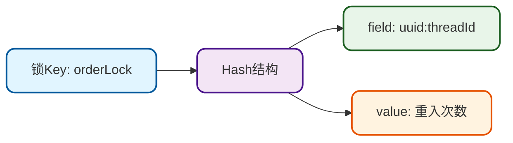
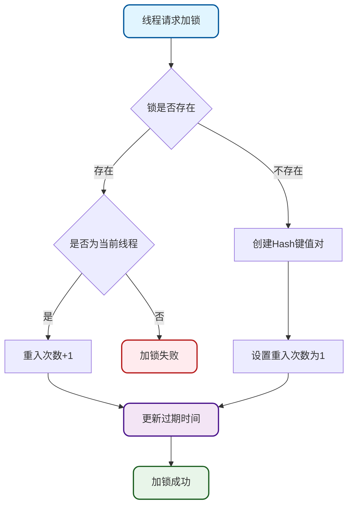
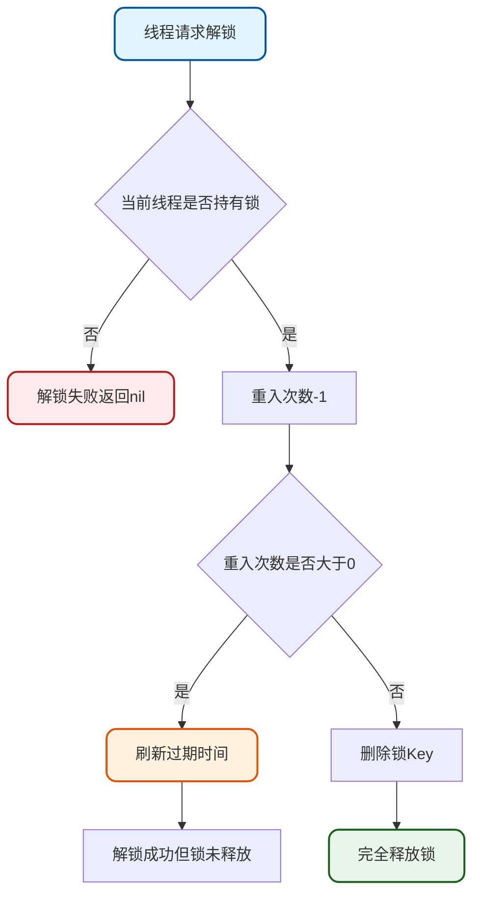
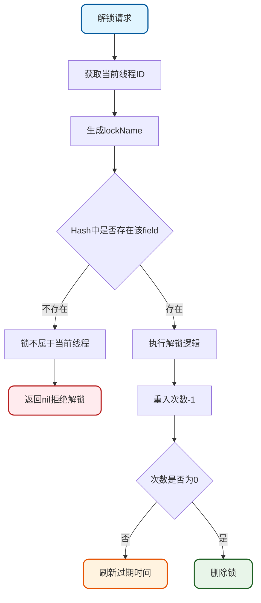
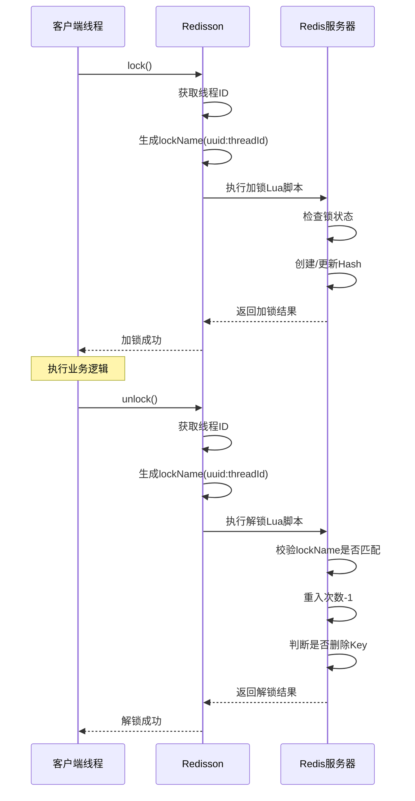

# Redisson分布式锁核心实现原理

## Redisson分布式锁概述

在分布式系统中,单纯使用SETNX实现的分布式锁存在无法自动续期的问题,容易导致并发冲突。Redisson作为成熟的Redis Java客户端,提供了功能完善的分布式锁解决方案。

Redisson官方文档: [https://redisson.org/](https://redisson.org/)  
分布式锁详细说明: [https://github.com/redisson/redisson/wiki/8.-Distributed-locks-and-synchronizers](https://github.com/redisson/redisson/wiki/8.-Distributed-locks-and-synchronizers)

## 快速开始

### 依赖引入

```xml
<dependency>
    <groupId>org.redisson</groupId>
    <artifactId>redisson</artifactId>
    <version>最新版本</version> 
</dependency>
```

### 客户端配置

```java
@Configuration
public class RedissonConfiguration {
    
    @Bean(destroyMethod="shutdown")
    public RedissonClient redissonClient() throws IOException {
        Config config = new Config();
        config.useSingleServer().setAddress("redis://192.168.1.100:6379");
        return Redisson.create(config);
    }
}
```

### 基础使用示例

```java
@Service
public class ProductService {
    @Autowired
    private RedissonClient redissonClient;
    
    public void updateInventory() {
        RLock inventoryLock = redissonClient.getLock("product:inventory:lock");
        try {
            inventoryLock.lock();
            // 执行库存更新业务逻辑
        } finally {
            inventoryLock.unlock();
        }
    }
}
```

也可以设置锁的超时时间:

```java
// 设置锁的超时时间为30秒
inventoryLock.lock(30, TimeUnit.SECONDS);
try {
    // 执行业务操作
} finally {
    inventoryLock.unlock();
}
```

## 核心实现原理

### 加锁实现机制

Redisson的加锁过程通过Lua脚本保证原子性,核心实现位于`RedissonLock#tryLockInnerAsync`方法:

```java
<T> RFuture<T> tryLockInnerAsync(long waitTime, long leaseTime, TimeUnit unit, 
                                  long threadId, RedisStrictCommand<T> command) {
    return evalWriteSyncedNoRetryAsync(getRawName(), LongCodec.INSTANCE, command,
            "if ((redis.call('exists', KEYS[1]) == 0) " +
                        "or (redis.call('hexists', KEYS[1], ARGV[2]) == 1)) then " +
                    "redis.call('hincrby', KEYS[1], ARGV[2], 1); " +
                    "redis.call('pexpire', KEYS[1], ARGV[1]); " +
                    "return nil; " +
                "end; " +
                "return redis.call('pttl', KEYS[1]);",
            Collections.singletonList(getRawName()), 
            unit.toMillis(leaseTime), getLockName(threadId));
}
```

### 数据存储结构

Redisson采用Hash数据结构存储锁信息:



例如在Redis中的实际存储:

```
KEY: orderLock
FIELD: d8f5c7a2-4b3e-4d91-9c7f-2e1a8b6d4f3c:1
VALUE: 1
```

其中Field由两部分组成:
- `d8f5c7a2-4b3e-4d91-9c7f-2e1a8b6d4f3c`: RedissonClient实例的UUID
- `1`: 当前线程ID

## 可重入锁实现

### 什么是可重入锁

可重入锁是指同一个线程在持有锁的情况下,可以再次获取该锁而不会被阻塞。这种机制能够有效避免死锁问题。

### 可重入实现原理

Redisson通过Hash结构的value字段记录重入次数:



加锁时的Lua脚本逻辑:

1. 检查锁是否存在或当前线程是否已持有锁
2. 如果满足条件,则将重入次数+1
3. 刷新锁的过期时间

### 解锁实现

解锁的核心实现位于`RedissonLock#unlockInnerAsync`方法:

```java
protected RFuture<Boolean> unlockInnerAsync(long threadId, String requestId, int timeout) {
    return evalWriteSyncedNoRetryAsync(getRawName(), LongCodec.INSTANCE, RedisCommands.EVAL_BOOLEAN,
        "local val = redis.call('get', KEYS[3]); " +
              "if val ~= false then " +
                  "return tonumber(val);" +
              "end; " +
              
              "if (redis.call('hexists', KEYS[1], ARGV[3]) == 0) then " +
                  "return nil;" +
              "end; " +
              "local counter = redis.call('hincrby', KEYS[1], ARGV[3], -1); " +
              "if (counter > 0) then " +
                  "redis.call('pexpire', KEYS[1], ARGV[2]); " +
                  "redis.call('set', KEYS[3], 0, 'px', ARGV[5]); " +
                  "return 0; " +
              "else " +
                  "redis.call('del', KEYS[1]); " +
                  "redis.call(ARGV[4], KEYS[2], ARGV[1]); " +
                  "redis.call('set', KEYS[3], 1, 'px', ARGV[5]); " +
                  "return 1; " +
              "end; ",
          Arrays.asList(getRawName(), getChannelName(), getUnlockLatchName(requestId)),
          LockPubSub.UNLOCK_MESSAGE, internalLockLeaseTime,
          getLockName(threadId), getSubscribeService().getPublishCommand(), timeout);
}
```

解锁流程:



关键逻辑说明:
1. 检查Hash中是否存在当前线程的field
2. 如果不存在,说明锁不属于当前线程,返回nil
3. 如果存在,将重入次数减1
4. 如果减1后仍大于0,说明存在可重入,只刷新过期时间
5. 如果减1后等于0,删除整个锁Key,完全释放锁

## 防止误删锁机制

### 误删问题场景

在以下场景中可能发生误删锁的问题:

| 时间序列 | 线程A | 线程B |
| --- | --- | --- |
| T1 | 加锁成功(设置超时时间) | |
| T2 | 执行业务逻辑 | |
| T3 | 锁到期自动删除 |  |
| T4 |  | 加锁成功 |
| T5 |  | 执行业务逻辑 |
| T6 | 业务执行完成,调用解锁 | |

此时线程A解锁时可能会误删线程B的锁,导致并发安全问题。

### 线程身份标识

Redisson通过`getLockName`方法生成唯一的线程标识:

```java
protected String getLockName(long threadId) {
    return id + ":" + threadId;
}
```

生成格式: `UUID:线程ID`

示例: `d8f5c7a2-4b3e-4d91-9c7f-2e1a8b6d4f3c:23`

### 解锁时的身份校验



### 完整加锁解锁流程



## 多种锁类型支持

### 公平锁

公平锁保证多个线程按照请求锁的顺序获取锁:

```java
RLock fairLock = redissonClient.getFairLock("orderLock");
fairLock.lock();
try {
    // 业务逻辑
} finally {
    fairLock.unlock();
}
```

### 联锁

联锁可以同时对多个资源加锁,所有锁都成功才算加锁成功:

```java
RLock inventoryLock = redissonClient1.getLock("inventory:lock");
RLock orderLock = redissonClient2.getLock("order:lock");
RLock paymentLock = redissonClient3.getLock("payment:lock");

RedissonMultiLock multiLock = new RedissonMultiLock(inventoryLock, orderLock, paymentLock);
multiLock.lock();
try {
    // 同时操作库存、订单、支付
} finally {
    multiLock.unlock();
}
```

### 读写锁

读写锁允许多个读操作并发执行,但写操作独占:

```java
RReadWriteLock rwLock = redissonClient.getReadWriteLock("configLock");

// 读操作
rwLock.readLock().lock();
try {
    // 读取配置
} finally {
    rwLock.readLock().unlock();
}

// 写操作
rwLock.writeLock().lock();
try {
    // 更新配置
} finally {
    rwLock.writeLock().unlock();
}
```

## 核心要点总结

1. **Hash结构存储**: Redisson使用Hash数据结构存储锁信息,key为锁名,field为线程标识,value为重入次数

2. **可重入实现**: 通过在Hash的value中记录重入次数实现可重入,每次加锁+1,解锁-1,直到为0才真正释放

3. **防误删机制**: 加锁时将UUID和线程ID组合作为field存储,解锁时校验field是否匹配,只能解除自己加的锁

4. **Lua脚本保证原子性**: 加锁和解锁操作都通过Lua脚本执行,保证操作的原子性

5. **多种锁类型**: 支持可重入锁、公平锁、联锁、读写锁等多种类型,满足不同业务场景需求
