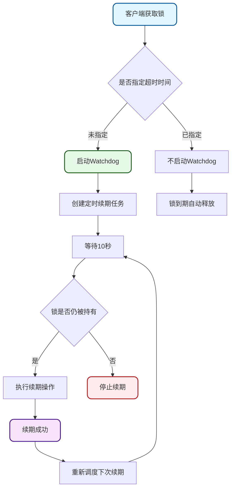
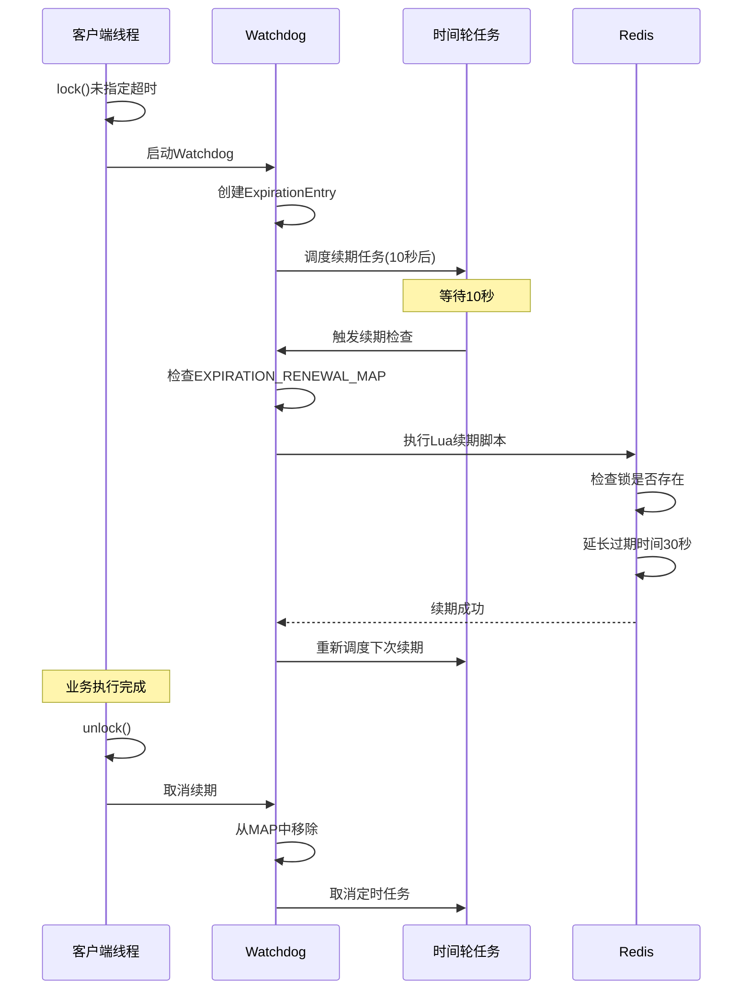
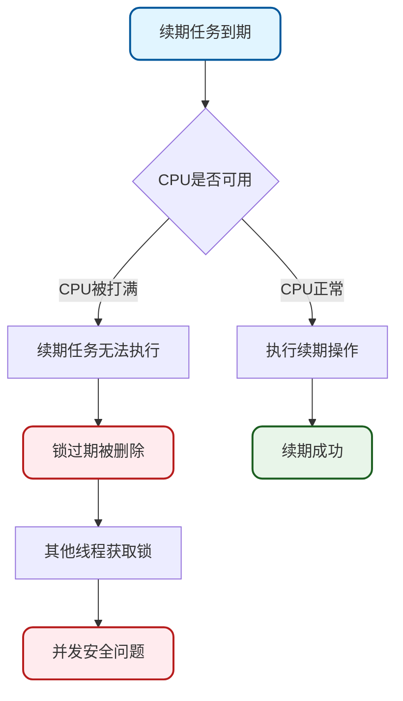
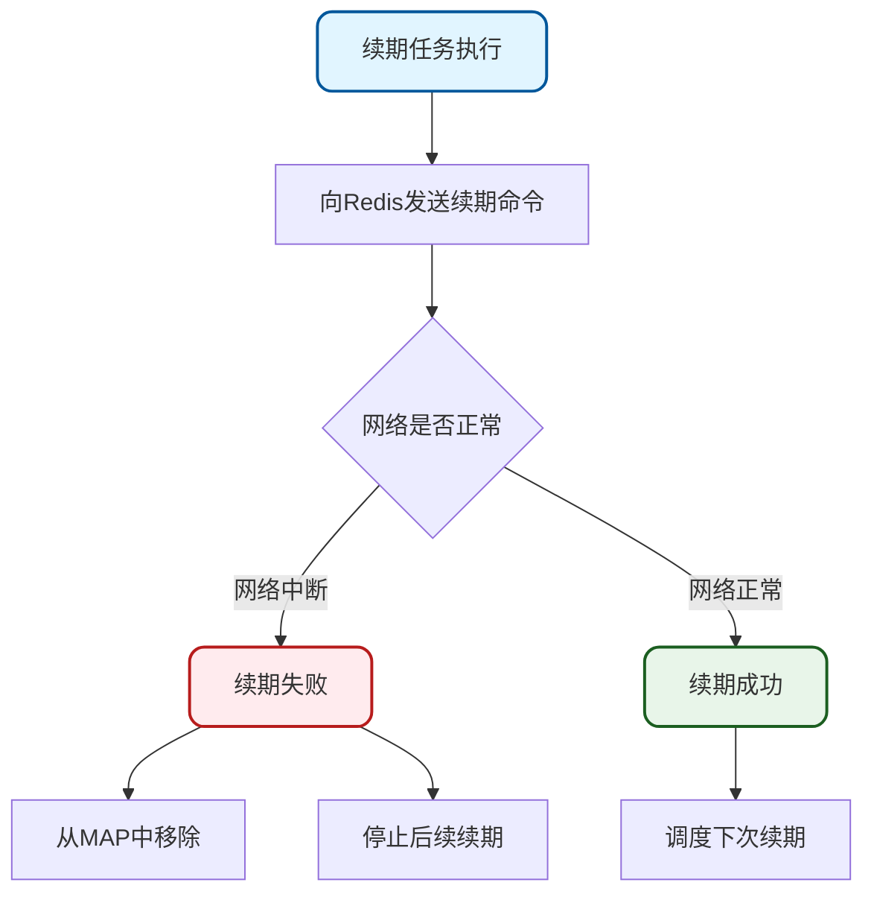
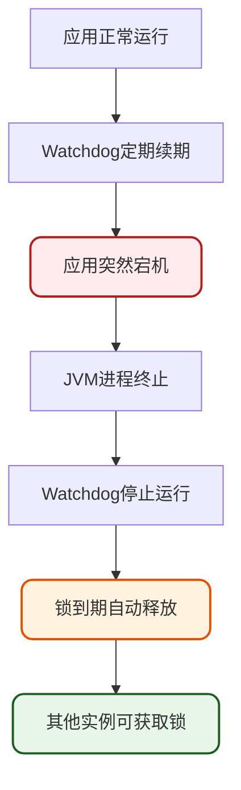
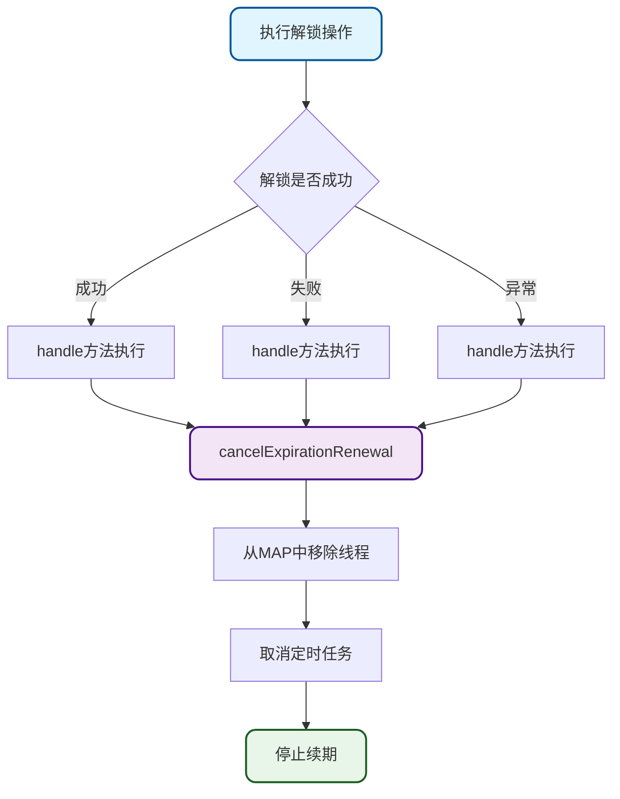
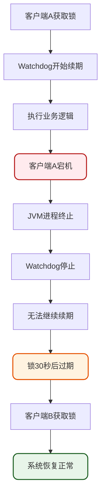
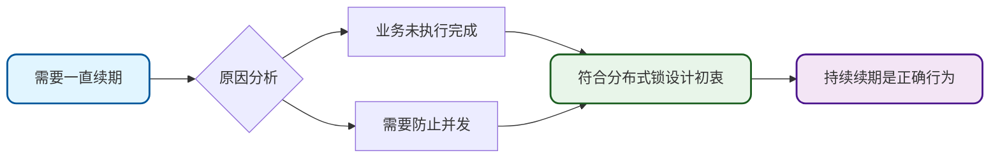

# Redisson Watchdog自动续期机制深度剖析

## Watchdog机制概述

为了解决Redis分布式锁超时导致的并发问题,Redisson引入了Watchdog(看门狗)机制。该机制能够在Redisson实例关闭前,自动延长锁的有效期,确保业务逻辑执行完成前锁不会过期。

### 核心特性

**自动续租**: 当Redisson客户端获取分布式锁时,如果未指定锁的超时时间,Watchdog会基于Netty的时间轮启动后台任务,定期向Redis发送续期命令。

**续期参数**:
- 默认续期间隔: 每10秒执行一次续期
- 默认续期时长: 每次续期30秒
- 续期时机: 通常为锁租约时间的1/3时执行续期

**停止续期**: 当锁被主动释放或客户端实例关闭时,Watchdog会自动停止续租任务。

## Watchdog工作流程

### 整体流程图



### 时序交互图



## 源码实现分析

### 启动续期任务

核心实现位于`scheduleExpirationRenewal`方法:

```java
protected void scheduleExpirationRenewal(long threadId) {
    ExpirationEntry entry = new ExpirationEntry();
    ExpirationEntry oldEntry = EXPIRATION_RENEWAL_MAP.putIfAbsent(getEntryName(), entry);
    if (oldEntry != null) {
        oldEntry.addThreadId(threadId);
    } else {
        entry.addThreadId(threadId);
        try {
            renewExpiration();
        } finally {
            if (Thread.currentThread().isInterrupted()) {
                cancelExpirationRenewal(threadId);
            }
        }
    }
}
```

### 定时任务执行续期

```java
private void renewExpiration() {
    ExpirationEntry ee = EXPIRATION_RENEWAL_MAP.get(getEntryName());
    if (ee == null) {
        return;
    }
    
    Timeout task = getServiceManager().newTimeout(new TimerTask() {
        @Override
        public void run(Timeout timeout) throws Exception {
            ExpirationEntry ent = EXPIRATION_RENEWAL_MAP.get(getEntryName());
            if (ent == null) {
                return;
            }
            Long threadId = ent.getFirstThreadId();
            if (threadId == null) {
                return;
            }
            
            CompletionStage<Boolean> future = renewExpirationAsync(threadId);
            future.whenComplete((res, e) -> {
                if (e != null) {
                    log.error("Can't update lock expiration", getRawName(), e);
                    EXPIRATION_RENEWAL_MAP.remove(getEntryName());
                    return;
                }
                
                if (res) {
                    // 续期成功,递归调度下次续期
                    renewExpiration();
                } else {
                    cancelExpirationRenewal(null);
                }
            });
        }
    }, internalLockLeaseTime / 3, TimeUnit.MILLISECONDS);
    
    ee.setTimeout(task);
}
```

### Lua脚本续期

```java
protected CompletionStage<Boolean> renewExpirationAsync(long threadId) {
    return evalWriteAsync(getRawName(), LongCodec.INSTANCE, RedisCommands.EVAL_BOOLEAN,
            "if (redis.call('hexists', KEYS[1], ARGV[2]) == 1) then " +
                    "redis.call('pexpire', KEYS[1], ARGV[1]); " +
                    "return 1; " +
                    "end; " +
                    "return 0;",
            Collections.singletonList(getRawName()),
            internalLockLeaseTime, getLockName(threadId));
}
```

续期逻辑说明:
1. 检查Hash中是否存在当前线程的field
2. 如果存在,更新锁的过期时间
3. 如果不存在,返回0表示续期失败

## 续期触发条件

### 何时启动续期

查看加锁过程的源码实现:

```java
private RFuture<Long> tryAcquireAsync(long waitTime, long leaseTime, TimeUnit unit, long threadId) {
    RFuture<Long> ttlRemainingFuture;
    if (leaseTime > 0) {
        ttlRemainingFuture = tryLockInnerAsync(waitTime, leaseTime, unit, threadId, RedisCommands.EVAL_LONG);
    } else {
        ttlRemainingFuture = tryLockInnerAsync(waitTime, internalLockLeaseTime,
                TimeUnit.MILLISECONDS, threadId, RedisCommands.EVAL_LONG);
    }
    
    // ... 省略部分代码
    
    CompletionStage<Long> f = ttlRemainingFuture.thenApply(ttlRemaining -> {
        if (ttlRemaining == null) {
            if (leaseTime > 0) {
                internalLockLeaseTime = unit.toMillis(leaseTime);
            } else {
                // 只有未指定超时时间才启动续期
                scheduleExpirationRenewal(threadId);
            }
        }
        return ttlRemaining;
    });
    return new CompletableFutureWrapper<>(f);
}
```

**关键结论**: 只有`leaseTime <= 0`时才会启动Watchdog续期机制。

使用示例对比:

```java
// 会启动Watchdog自动续期
inventoryLock.lock();

// 不会启动Watchdog,锁到期自动释放
inventoryLock.lock(30, TimeUnit.SECONDS);
```

## 续期停止机制

### 主动解锁停止续期

```java
@Override
public void unlock() {
    try {
        get(unlockAsync(Thread.currentThread().getId()));
    } catch (RedisException e) {
        if (e.getCause() instanceof IllegalMonitorStateException) {
            throw (IllegalMonitorStateException) e.getCause();
        } else {
            throw e;
        }
    }
}

private RFuture<Void> unlockAsync0(long threadId) {
    CompletionStage<Boolean> future = unlockInnerAsync(threadId);
    CompletionStage<Void> f = future.handle((opStatus, e) -> {
        // 无论解锁成功与否,都取消续期
        cancelExpirationRenewal(threadId);
        
        if (e != null) {
            if (e instanceof CompletionException) {
                throw (CompletionException) e;
            }
            throw new CompletionException(e);
        }
        if (opStatus == null) {
            IllegalMonitorStateException cause = new IllegalMonitorStateException(
                "attempt to unlock lock, not locked by current thread by node id: "
                + id + " thread-id: " + threadId);
            throw new CompletionException(cause);
        }
        
        return null;
    });
    
    return new CompletableFutureWrapper<>(f);
}
```

### 取消续期实现

```java
protected void cancelExpirationRenewal(Long threadId) {
    ExpirationEntry task = EXPIRATION_RENEWAL_MAP.get(getEntryName());
    if (task == null) {
        return;
    }
    
    if (threadId != null) {
        task.removeThreadId(threadId);
    }

    if (threadId == null || task.hasNoThreads()) {
        Timeout timeout = task.getTimeout();
        if (timeout != null) {
            timeout.cancel();
        }
        EXPIRATION_RENEWAL_MAP.remove(getEntryName());
    }
}
```

### 线程中断停止续期

在启动续期任务时,如果线程被中断,会自动取消续期:

```java
protected void scheduleExpirationRenewal(long threadId) {
    // ... 省略部分代码
    try {
        renewExpiration();
    } finally {
        if (Thread.currentThread().isInterrupted()) {
            cancelExpirationRenewal(threadId);
        }
    }
}
```

## Watchdog失效场景分析

### 场景一: 手动设置超时时间

```java
// Watchdog不会启动
RLock orderLock = redissonClient.getLock("order:lock");
orderLock.lock(60, TimeUnit.SECONDS);
```

如果业务执行超过60秒,锁会自动释放,可能导致并发问题。

### 场景二: CPU资源耗尽



当服务器CPU资源被占满时,时间轮任务可能无法按时执行,导致续期失败。

### 场景三: 网络故障



当Redis服务不可达或网络连接中断时,续期操作会失败并停止后续续期。

### 场景四: 应用宕机



Watchdog基于JVM内的时间轮实现,当应用宕机时:
1. JVM进程终止
2. Watchdog后台任务停止
3. 无法继续续期
4. 锁到期后自动释放

这种设计实际上是一种保护机制,避免因单点故障导致锁永久无法释放。

## 解锁失败续期处理

### CompletionStage的handle机制

Redisson使用`CompletionStage.handle`方法确保无论解锁成功或失败,都能停止续期:

```java
CompletionStage<Void> f = future.handle((opStatus, e) -> {
    // 无论结果如何,首先取消续期
    cancelExpirationRenewal(threadId);
    
    if (e != null) {
        // 处理异常情况
        throw new CompletionException(e);
    }
    if (opStatus == null) {
        // 处理解锁失败情况
        throw new CompletionException(cause);
    }
    
    return null;
});
```

### handle方法特性

`CompletionStage.handle`方法签名:

```java
<T> CompletionStage<T> handle(BiFunction<? super T, Throwable, ? extends T> fn);
```

关键特性:
- 接收两个参数: 计算结果和异常对象
- 无论前一阶段成功或失败都会执行
- 成功时: 结果参数有值,异常参数为null
- 失败时: 结果参数为null,异常参数有值

### 续期停止保证



**关键结论**: 只要调用了unlock方法,无论解锁是否成功,都会停止Watchdog续期。唯一可能继续续期的情况是从Map中移除失败,但这种概率极低。

## 客户端宕机处理机制

### 问题场景

当持有锁的客户端突然宕机时会发生什么?



### 自动恢复机制

1. **Watchdog依赖JVM**: Watchdog的续期任务运行在JVM进程中
2. **宕机导致停止**: 客户端宕机时JVM进程终止,Watchdog自动停止
3. **锁自动过期**: 无续期后,锁在30秒(默认)后自动过期
4. **其他客户端获取**: 锁过期后其他客户端可以正常获取锁

### 为什么不会死锁

```java
// 伪代码展示续期依赖
class WatchdogTask {
    private volatile boolean running = true;  // JVM进程内变量
    
    public void run() {
        while (running && jvmIsAlive()) {  // 依赖JVM存活
            renewLock();
            sleep(10000);
        }
    }
}
```

由于续期任务完全依赖JVM进程:
- JVM运行 → Watchdog运行 → 持续续期
- JVM终止 → Watchdog终止 → 停止续期 → 锁过期释放

### 一直续期的边界

虽然Watchdog会持续续期,但有以下边界条件:

1. **业务必须未完成**: 如果业务逻辑执行完成,会主动调用unlock
2. **应用必须存活**: 应用宕机后Watchdog自动停止
3. **无次数限制**: Redisson未限制最大续期次数和总续期时长
4. **解锁即停止**: 一旦调用unlock,立即停止续期

### 设计合理性

这种设计是合理的:



如果不希望自动续期,可以手动指定超时时间:

```java
// 指定超时时间,不自动续期
orderLock.lock(60, TimeUnit.SECONDS);
```

## 核心要点总结

1. **触发条件**: 只有在未指定锁超时时间时,Watchdog才会启动自动续期

2. **续期参数**: 默认每10秒续期一次,每次续期30秒,基于Netty时间轮实现

3. **停止机制**: unlock调用、线程中断、续期失败时会停止续期

4. **失效场景**: 手动设置超时、CPU耗尽、网络故障、应用宕机等情况可能导致续期失效

5. **容错设计**: 解锁失败仍会停止续期,应用宕机时JVM终止导致Watchdog自动停止,避免死锁

6. **依赖JVM**: Watchdog完全依赖JVM进程,进程终止则自动停止,锁会在超时后自动释放

7. **合理性**: 业务未完成时持续续期符合分布式锁的设计初衷,不希望自动续期可手动指定超时时间
