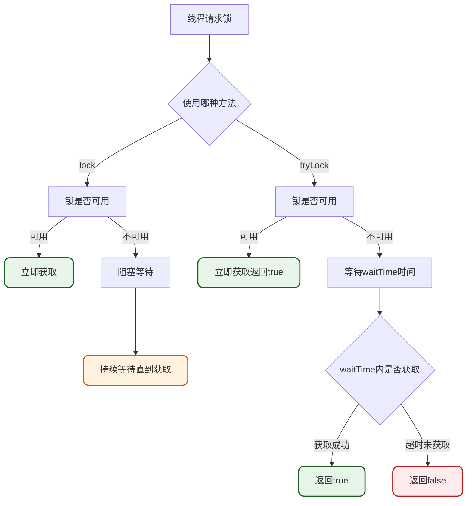
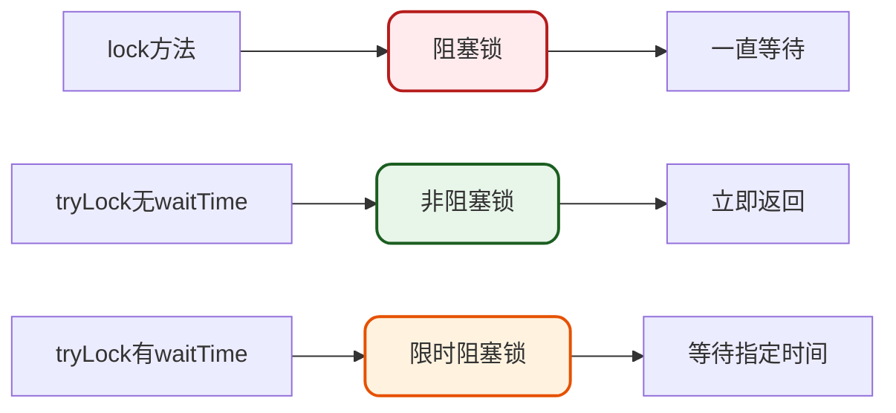
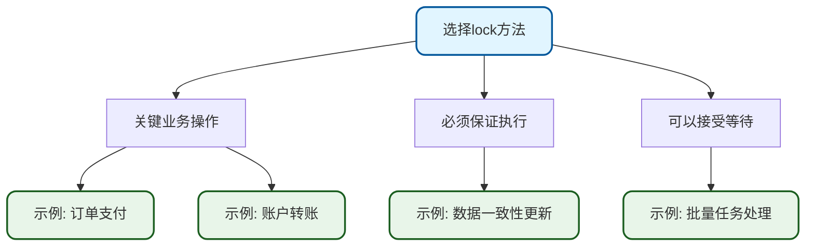
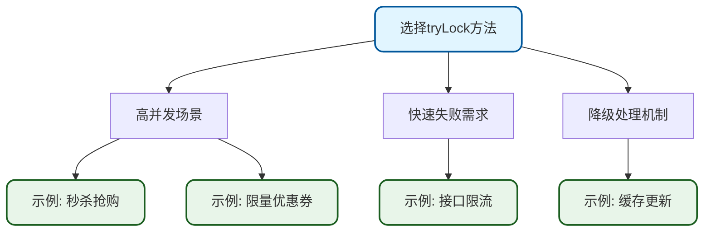
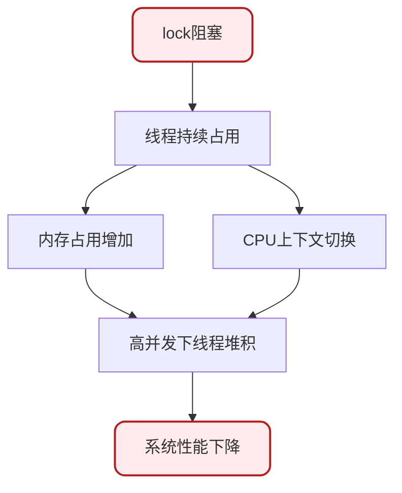
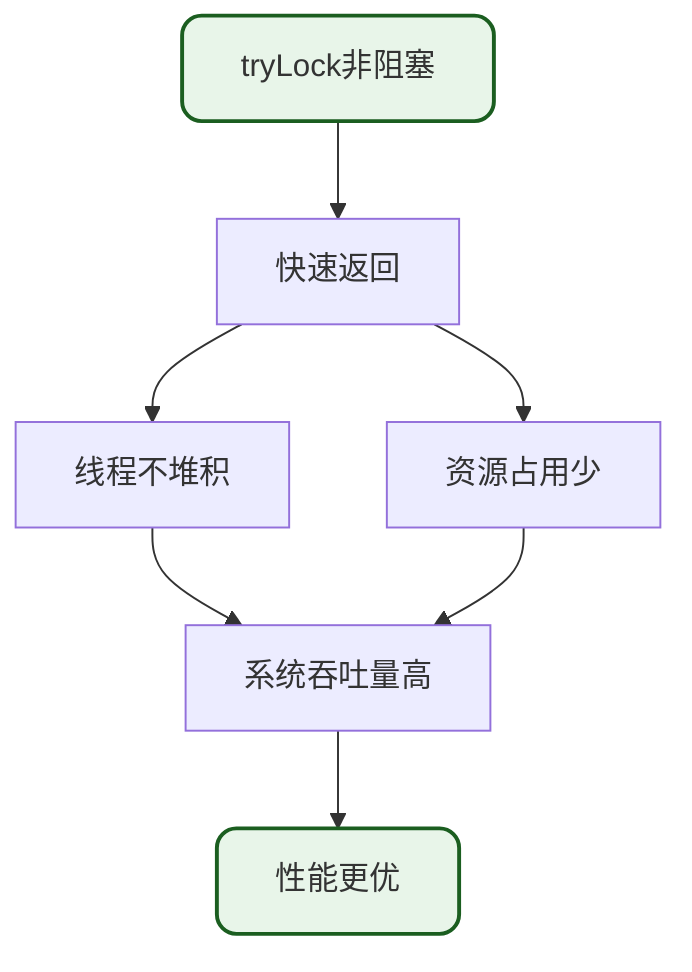

# Redisson lock与tryLock使用对比

## 方法概述

在使用Redisson实现分布式锁时,经常会用到`lock`和`tryLock`两个方法。这两个方法虽然都能实现加锁功能,但在阻塞行为、返回值、使用场景等方面存在重要差异。

## 方法定义对比

### tryLock方法

```java
/**
 * Tries to acquire the lock with defined leaseTime.
 * Waits up to defined waitTime if necessary until the lock became available.
 *
 * Lock will be released automatically after defined leaseTime interval.
 *
 * @param waitTime the maximum time to acquire the lock
 * @param leaseTime lease time
 * @param unit time unit
 * @return true if lock is successfully acquired,
 *          otherwise false if lock is already set.
 * @throws InterruptedException - if the thread is interrupted
 */
boolean tryLock(long waitTime, long leaseTime, TimeUnit unit) throws InterruptedException;
```

### lock方法

```java
/**
 * Acquires the lock with defined leaseTime.
 * Waits if necessary until lock became available.
 *
 * Lock will be released automatically after defined leaseTime interval.
 *
 * @param leaseTime the maximum time to hold the lock after it's acquisition,
 *        if it hasn't already been released by invoking unlock.
 *        If leaseTime is -1, hold the lock until explicitly unlocked.
 * @param unit the time unit
 *
 */
void lock(long leaseTime, TimeUnit unit);
```

## 核心区别分析

### 区别一: 阻塞策略

| 特性 | lock | tryLock |
| --- | --- | --- |
| 获取方式 | Acquires(获取锁) | Tries to acquire(尝试获取锁) |
| 阻塞行为 | 一直等待直到获取成功 | 等待指定时间后返回 |
| 等待参数 | 无waitTime参数 | 有waitTime参数控制等待时长 |



### 区别二: 返回值类型

**lock方法**: 返回值为`void`,不提供获取结果反馈

```java
RLock orderLock = redissonClient.getLock("order:lock");
orderLock.lock(); // 无返回值,阻塞直到成功
try {
    // 执行业务逻辑
} finally {
    orderLock.unlock();
}
```

**tryLock方法**: 返回值为`boolean`,明确告知是否获取成功

```java
RLock orderLock = redissonClient.getLock("order:lock");
boolean isLocked = orderLock.tryLock(); // 返回获取结果
if (isLocked) {
    try {
        // 执行业务逻辑
    } finally {
        orderLock.unlock();
    }
} else {
    // 获取锁失败的处理逻辑
    log.warn("无法获取锁,订单处理失败");
}
```

### 区别三: 阻塞与非阻塞



## 使用示例对比

### lock方法使用示例

#### 基础阻塞锁

```java
@Service
public class OrderService {
    @Autowired
    private RedissonClient redissonClient;
    
    public void processOrder(String orderId) {
        RLock orderLock = redissonClient.getLock("order:" + orderId);
        // 阻塞等待,直到获取锁
        orderLock.lock();
        try {
            // 处理订单业务
            updateOrderStatus(orderId);
            reduceInventory(orderId);
            createShipment(orderId);
        } finally {
            orderLock.unlock();
        }
    }
}
```

#### 带超时时间的锁

```java
public void processPayment(String paymentId) {
    RLock paymentLock = redissonClient.getLock("payment:" + paymentId);
    // 阻塞等待,60秒后自动释放
    paymentLock.lock(60, TimeUnit.SECONDS);
    try {
        // 处理支付业务
        validatePayment(paymentId);
        executePayment(paymentId);
    } finally {
        paymentLock.unlock();
    }
}
```

### tryLock方法使用示例

#### 非阻塞立即返回

```java
@Service
public class InventoryService {
    @Autowired
    private RedissonClient redissonClient;
    
    public boolean updateInventory(String productId, int quantity) {
        RLock inventoryLock = redissonClient.getLock("inventory:" + productId);
        // 非阻塞,立即返回结果
        boolean isLocked = inventoryLock.tryLock();
        if (isLocked) {
            try {
                // 更新库存
                int current = getInventory(productId);
                setInventory(productId, current - quantity);
                return true;
            } finally {
                inventoryLock.unlock();
            }
        } else {
            // 获取锁失败,可以选择降级处理
            log.warn("库存锁获取失败,productId: {}", productId);
            return false;
        }
    }
}
```

#### 限时等待返回

```java
public boolean processRefund(String refundId) throws InterruptedException {
    RLock refundLock = redissonClient.getLock("refund:" + refundId);
    // 等待最多5秒,30秒后锁自动释放
    boolean isLocked = refundLock.tryLock(5, 30, TimeUnit.SECONDS);
    if (isLocked) {
        try {
            // 处理退款业务
            validateRefund(refundId);
            executeRefund(refundId);
            return true;
        } finally {
            refundLock.unlock();
        }
    } else {
        log.warn("退款锁获取超时,refundId: {}", refundId);
        return false;
    }
}
```

#### 快速失败场景

```java
@RestController
public class CouponController {
    @Autowired
    private RedissonClient redissonClient;
    
    @PostMapping("/coupon/claim")
    public Result claimCoupon(String couponId, String userId) {
        RLock couponLock = redissonClient.getLock("coupon:" + couponId);
        // 秒杀场景,快速失败
        boolean isLocked = couponLock.tryLock();
        if (!isLocked) {
            return Result.fail("优惠券已被抢光");
        }
        
        try {
            // 检查库存
            if (getCouponStock(couponId) <= 0) {
                return Result.fail("优惠券库存不足");
            }
            // 发放优惠券
            issueCoupon(couponId, userId);
            return Result.success("领取成功");
        } finally {
            couponLock.unlock();
        }
    }
}
```

## 使用场景选择

### lock适用场景



**使用条件**:
1. 业务必须执行,不能因为锁冲突而放弃
2. 可以接受较长的等待时间
3. 对用户体验要求不是特别高
4. 系统资源充足,可以支持线程阻塞

**典型场景**:
- 订单支付流程
- 账户余额变更
- 关键数据更新
- 后台批量任务

### tryLock适用场景



**使用条件**:
1. 需要快速响应,不能长时间阻塞
2. 获取失败可以有降级方案
3. 高并发场景,避免线程堆积
4. 对用户体验要求高

**典型场景**:
- 秒杀抢购活动
- 限量优惠券发放
- 接口调用限流
- 缓存更新冲突
- 定时任务防重

## 性能与资源影响

### lock方法的资源占用



**资源消耗**:
- 阻塞线程占用内存
- 线程切换消耗CPU
- 大量阻塞可能导致线程池耗尽

### tryLock方法的优势



**性能优势**:
- 不阻塞线程,快速失败
- 避免线程池耗尽
- 提升系统整体吞吐量

## 最佳实践建议

### 实践一: 根据业务特性选择

```java
// 关键业务使用lock
public void criticalOperation() {
    RLock lock = redissonClient.getLock("critical:lock");
    lock.lock();
    try {
        // 必须执行的关键操作
    } finally {
        lock.unlock();
    }
}

// 高并发场景使用tryLock
public boolean highConcurrencyOperation() {
    RLock lock = redissonClient.getLock("concurrent:lock");
    if (lock.tryLock()) {
        try {
            // 高并发操作
            return true;
        } finally {
            lock.unlock();
        }
    }
    return false;
}
```

### 实践二: 设置合理的超时时间

```java
// tryLock设置waitTime避免瞬时失败
public boolean processWithTimeout() throws InterruptedException {
    RLock lock = redissonClient.getLock("timeout:lock");
    // 等待3秒,持有锁30秒
    boolean isLocked = lock.tryLock(3, 30, TimeUnit.SECONDS);
    if (isLocked) {
        try {
            // 业务处理
            return true;
        } finally {
            lock.unlock();
        }
    }
    return false;
}
```

### 实践三: 实现降级策略

```java
public Result processWithFallback(String resourceId) {
    RLock lock = redissonClient.getLock("resource:" + resourceId);
    boolean isLocked = lock.tryLock();
    
    if (isLocked) {
        try {
            // 主流程处理
            return primaryProcess(resourceId);
        } finally {
            lock.unlock();
        }
    } else {
        // 降级处理
        return fallbackProcess(resourceId);
    }
}

private Result fallbackProcess(String resourceId) {
    // 返回缓存数据
    // 或返回默认值
    // 或提示用户稍后重试
    return Result.fail("系统繁忙,请稍后重试");
}
```

### 实践四: 异常处理

```java
public void safeOperation() {
    RLock lock = redissonClient.getLock("safe:lock");
    boolean isLocked = false;
    try {
        isLocked = lock.tryLock(5, 30, TimeUnit.SECONDS);
        if (isLocked) {
            // 业务逻辑
            executeBusinessLogic();
        } else {
            log.warn("获取锁超时");
        }
    } catch (InterruptedException e) {
        Thread.currentThread().interrupt();
        log.error("获取锁被中断", e);
    } catch (Exception e) {
        log.error("业务执行异常", e);
    } finally {
        if (isLocked) {
            try {
                lock.unlock();
            } catch (Exception e) {
                log.error("释放锁异常", e);
            }
        }
    }
}
```

## 核心要点总结

1. **阻塞行为**: lock阻塞等待直到成功,tryLock可设置等待时间后返回

2. **返回值**: lock无返回值,tryLock返回boolean明确告知获取结果

3. **阻塞类型**: lock是阻塞锁,tryLock无参时是非阻塞锁,带waitTime参数时是限时阻塞锁

4. **场景选择**: 关键业务用lock保证执行,高并发场景用tryLock快速失败

5. **性能影响**: lock可能导致线程堆积,tryLock避免阻塞提升吞吐量

6. **最佳实践**: 设置合理超时时间,实现降级策略,做好异常处理
