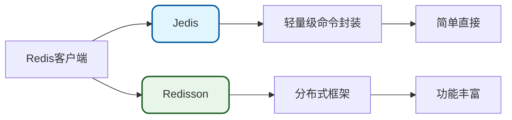
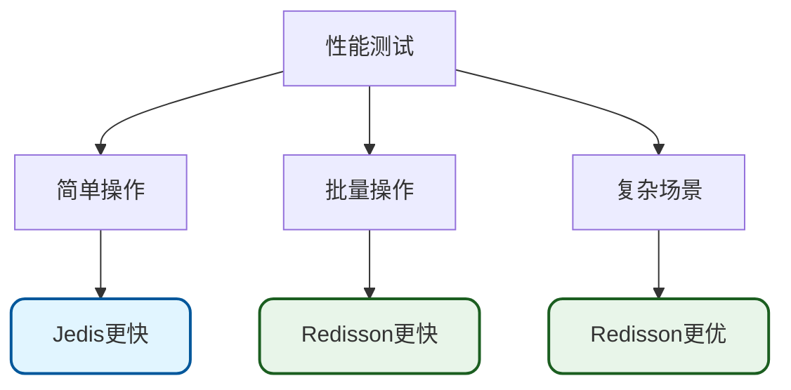
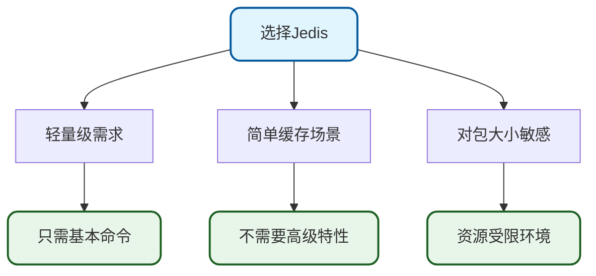
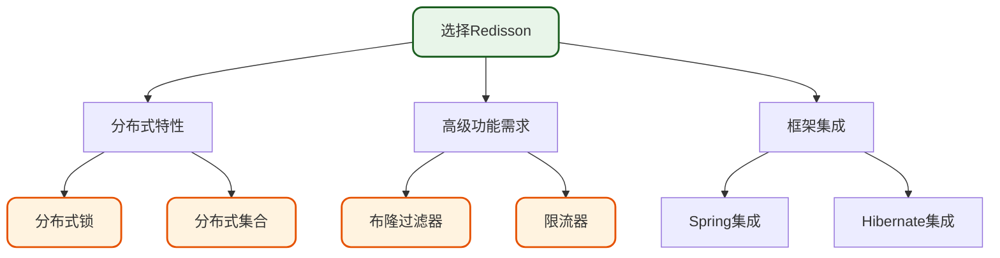
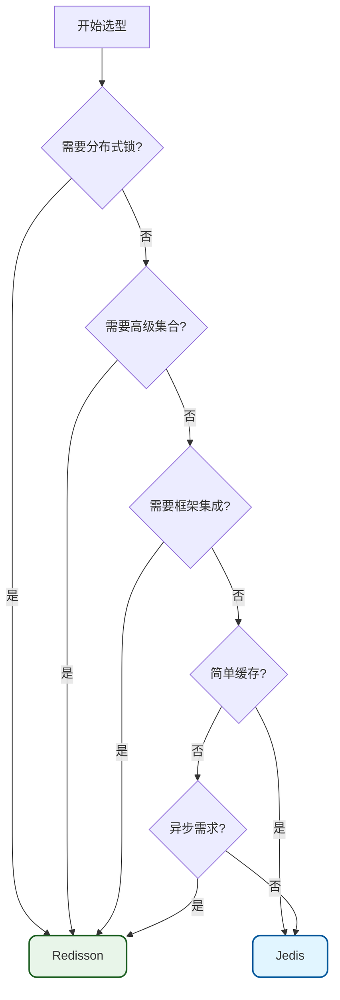

# Redisson与Jedis客户端选型对比

## 客户端概述

Redisson和Jedis是Java生态中两个流行的Redis客户端库,用于与Redis进行交互。两者在设计理念、功能特性、使用复杂度等方面存在显著差异。

Redisson官方对比文档: [https://redisson.org/feature-comparison-redisson-vs-jedis.html](https://redisson.org/feature-comparison-redisson-vs-jedis.html)

### 定位差异



**Jedis**: 极其轻量级,可以看作是对Redis命令的直接封装,一对一映射Redis原生命令。

**Redisson**: 提供丰富的高级特性和分布式组件,是一个功能完善的分布式Java框架。

## 功能特性对比

### 分布式集合

| 集合类型 | Jedis | Redisson |
| --- | --- | --- |
| Map | 基本命令 | RMap, RMapCache, RLocalCachedMap |
| Set | 基本命令 | RSet, RSetCache, RSortedSet |
| List | 基本命令 | RList, RQueue, RDeque |
| Queue | 不支持 | RPriorityQueue, RDelayedQueue, RBlockingQueue |
| Multimap | 不支持 | RSetMultimap, RListMultimap |

**Jedis示例**:

```java
@Service
public class JedisMapService {
    @Autowired
    private JedisPool jedisPool;
    
    public void useMap(String key, String field, String value) {
        try (Jedis jedis = jedisPool.getResource()) {
            // 只能使用原生命令
            jedis.hset(key, field, value);
            String result = jedis.hget(key, field);
            Map<String, String> all = jedis.hgetAll(key);
        }
    }
}
```

**Redisson示例**:

```java
@Service
public class RedissonMapService {
    @Autowired
    private RedissonClient redissonClient;
    
    public void useMap(String key) {
        // 像使用本地Map一样操作
        RMap<String, User> userMap = redissonClient.getMap("users");
        
        User user = new User("001", "张三");
        userMap.put(user.getId(), user);
        
        User retrieved = userMap.get("001");
        
        // 支持Java集合框架的所有方法
        userMap.forEach((k, v) -> {
            System.out.println(k + ": " + v);
        });
        
        // 支持批量操作
        Map<String, User> batch = new HashMap<>();
        batch.put("002", new User("002", "李四"));
        batch.put("003", new User("003", "王五"));
        userMap.putAll(batch);
    }
}
```

### 分布式锁和同步器

| 功能 | Jedis | Redisson |
| --- | --- | --- |
| 可重入锁 | 需要自己实现 | ✓ RLock |
| 公平锁 | 需要自己实现 | ✓ RFairLock |
| 联锁 | 不支持 | ✓ RMultiLock |
| 红锁 | 不支持 | ✓ RedLock(已废弃) |
| 读写锁 | 需要自己实现 | ✓ RReadWriteLock |
| 信号量 | 需要自己实现 | ✓ RSemaphore |
| 闭锁 | 需要自己实现 | ✓ RCountDownLatch |

**Jedis手动实现锁**:

```java
@Service
public class JedisLockService {
    @Autowired
    private JedisPool jedisPool;
    
    public boolean tryLock(String lockKey, String requestId, int expireTime) {
        try (Jedis jedis = jedisPool.getResource()) {
            // 手动实现锁逻辑
            String result = jedis.set(lockKey, requestId, 
                SetParams.setParams().nx().ex(expireTime));
            return "OK".equals(result);
        }
    }
    
    public boolean unlock(String lockKey, String requestId) {
        try (Jedis jedis = jedisPool.getResource()) {
            // 使用Lua脚本保证原子性
            String script = 
                "if redis.call('get', KEYS[1]) == ARGV[1] then " +
                "    return redis.call('del', KEYS[1]) " +
                "else " +
                "    return 0 " +
                "end";
            Object result = jedis.eval(script, 
                Collections.singletonList(lockKey), 
                Collections.singletonList(requestId));
            return "1".equals(result.toString());
        }
    }
    
    // 无法实现自动续期
    // 无法实现可重入
    // 需要自己处理各种边界情况
}
```

**Redisson开箱即用**:

```java
@Service
public class RedissonLockService {
    @Autowired
    private RedissonClient redissonClient;
    
    public void processWithLock(String resourceId) {
        RLock lock = redissonClient.getLock("resource:" + resourceId);
        
        // 自动续期
        // 可重入
        // 防误删
        lock.lock();
        try {
            // 业务逻辑
            handleBusiness(resourceId);
        } finally {
            lock.unlock();
        }
    }
    
    // 支持读写锁
    public void useReadWriteLock(String configKey) {
        RReadWriteLock rwLock = redissonClient.getReadWriteLock(configKey);
        
        // 读锁
        rwLock.readLock().lock();
        try {
            readConfig(configKey);
        } finally {
            rwLock.readLock().unlock();
        }
        
        // 写锁
        rwLock.writeLock().lock();
        try {
            writeConfig(configKey);
        } finally {
            rwLock.writeLock().unlock();
        }
    }
}
```

### 分布式对象

| 对象类型 | Jedis | Redisson |
| --- | --- | --- |
| AtomicLong | 基本命令 | ✓ RAtomicLong |
| AtomicDouble | 基本命令 | ✓ RAtomicDouble |
| BitSet | 基本命令 | ✓ RBitSet |
| BloomFilter | 不支持 | ✓ RBloomFilter |
| HyperLogLog | 基本命令 | ✓ RHyperLogLog |
| RateLimiter | 不支持 | ✓ RRateLimiter |
| IdGenerator | 不支持 | ✓ RIdGenerator |

**Redisson布隆过滤器示例**:

```java
@Service
public class UserBloomFilterService {
    @Autowired
    private RedissonClient redissonClient;
    
    @PostConstruct
    public void init() {
        RBloomFilter<String> bloomFilter = redissonClient.getBloomFilter("userIds");
        // 预期元素数量100万,误判率1%
        bloomFilter.tryInit(1000000L, 0.01);
    }
    
    public void addUser(String userId) {
        RBloomFilter<String> bloomFilter = redissonClient.getBloomFilter("userIds");
        bloomFilter.add(userId);
    }
    
    public boolean userExists(String userId) {
        RBloomFilter<String> bloomFilter = redissonClient.getBloomFilter("userIds");
        return bloomFilter.contains(userId);
    }
}
```

**Redisson限流器示例**:

```java
@Service
public class ApiRateLimiterService {
    @Autowired
    private RedissonClient redissonClient;
    
    public boolean checkRateLimit(String apiKey) {
        RRateLimiter rateLimiter = redissonClient.getRateLimiter("api:" + apiKey);
        // 每秒最多10个请求
        rateLimiter.trySetRate(RateType.OVERALL, 10, 1, RateIntervalUnit.SECONDS);
        
        // 尝试获取许可
        return rateLimiter.tryAcquire();
    }
}
```

### 高级缓存支持

| 功能 | Jedis | Redisson |
| --- | --- | --- |
| Read-through | 不支持 | ✓ 支持 |
| Write-through | 不支持 | ✓ 支持 |
| Write-behind | 不支持 | ✓ 支持 |
| 本地缓存 | 不支持 | ✓ RLocalCachedMap |
| 过期策略 | 需手动实现 | ✓ 多种策略 |

**Redisson本地缓存示例**:

```java
@Service
public class ProductCacheService {
    @Autowired
    private RedissonClient redissonClient;
    
    public RMap<String, Product> getProductCache() {
        LocalCachedMapOptions<String, Product> options = 
            LocalCachedMapOptions.<String, Product>defaults()
                // 缓存淘汰策略:LRU
                .evictionPolicy(EvictionPolicy.LRU)
                // 本地缓存最大数量
                .cacheSize(1000)
                // 本地缓存TTL
                .timeToLive(10, TimeUnit.MINUTES)
                // 本地缓存空闲时间
                .maxIdle(5, TimeUnit.MINUTES)
                // 同步策略
                .syncStrategy(SyncStrategy.UPDATE);
        
        return redissonClient.getLocalCachedMap("products", options);
    }
    
    public Product getProduct(String productId) {
        RMap<String, Product> cache = getProductCache();
        // 先查本地缓存,未命中再查Redis
        return cache.get(productId);
    }
}
```

### API架构对比

| 特性 | Jedis | Redisson |
| --- | --- | --- |
| 线程安全 | Jedis实例非线程安全 | RedissonClient线程安全 |
| 连接池 | 需要JedisPool管理 | 内置连接池管理 |
| 异步API | 不支持 | ✓ 完整支持 |
| 响应式API | 不支持 | ✓ Reactive Streams |
| RxJava | 不支持 | ✓ RxJava3接口 |

**Jedis连接池管理**:

```java
@Configuration
public class JedisConfiguration {
    
    @Bean
    public JedisPool jedisPool() {
        JedisPoolConfig poolConfig = new JedisPoolConfig();
        poolConfig.setMaxTotal(100);
        poolConfig.setMaxIdle(50);
        poolConfig.setMinIdle(10);
        poolConfig.setTestOnBorrow(true);
        
        return new JedisPool(poolConfig, "192.168.1.100", 6379);
    }
}

@Service
public class JedisService {
    @Autowired
    private JedisPool jedisPool;
    
    public void execute() {
        // 每次使用都要从池中获取连接
        try (Jedis jedis = jedisPool.getResource()) {
            jedis.set("key", "value");
        } // 自动归还连接
    }
}
```

**Redisson异步API**:

```java
@Service
public class RedissonAsyncService {
    @Autowired
    private RedissonClient redissonClient;
    
    public CompletableFuture<Void> asyncOperation() {
        RBucket<String> bucket = redissonClient.getBucket("asyncKey");
        
        // 异步设置值
        return bucket.setAsync("asyncValue")
            .thenCompose(v -> {
                // 异步获取值
                return bucket.getAsync();
            })
            .thenAccept(value -> {
                System.out.println("Value: " + value);
            })
            .toCompletableFuture();
    }
}
```

### 分布式服务

| 服务类型 | Jedis | Redisson |
| --- | --- | --- |
| ExecutorService | 不支持 | ✓ RExecutorService |
| ScheduledExecutorService | 不支持 | ✓ RScheduledExecutorService |
| MapReduce | 不支持 | ✓ RMapReduce |
| RemoteService | 不支持 | ✓ RRemoteService |

**Redisson分布式执行器示例**:

```java
@Service
public class DistributedTaskService {
    @Autowired
    private RedissonClient redissonClient;
    
    public void executeDistributedTask() throws Exception {
        RExecutorService executor = redissonClient.getExecutorService("taskExecutor");
        
        // 提交任务到分布式执行器
        Future<String> future = executor.submit(() -> {
            // 这个任务会在集群中的某个节点执行
            return "Task executed on: " + InetAddress.getLocalHost().getHostName();
        });
        
        String result = future.get();
        System.out.println(result);
    }
}
```

### 框架集成

| 框架 | Jedis | Redisson |
| --- | --- | --- |
| Spring Cache | ✓ 支持 | ✓ 支持 |
| Spring Session | ✓ 支持 | ✓ 支持 |
| Hibernate Cache | 不支持 | ✓ 支持 |
| MyBatis Cache | 不支持 | ✓ 支持 |
| Spring Boot Starter | ✓ 支持 | ✓ 支持 |

**Redisson集成Spring Cache**:

```java
@Configuration
@EnableCaching
public class CacheConfiguration {
    
    @Bean
    public CacheManager cacheManager(RedissonClient redissonClient) {
        Map<String, CacheConfig> config = new HashMap<>();
        
        // 用户缓存配置
        config.put("users", new CacheConfig(
            TimeUnit.MINUTES.toMillis(10),  // TTL
            TimeUnit.MINUTES.toMillis(5)    // maxIdleTime
        ));
        
        // 产品缓存配置
        config.put("products", new CacheConfig(
            TimeUnit.HOURS.toMillis(1),
            TimeUnit.MINUTES.toMillis(30)
        ));
        
        return new RedissonSpringCacheManager(redissonClient, config);
    }
}

@Service
public class UserCacheService {
    
    @Cacheable(value = "users", key = "#userId")
    public User getUser(String userId) {
        // 查询数据库
        return userRepository.findById(userId);
    }
    
    @CacheEvict(value = "users", key = "#user.id")
    public void updateUser(User user) {
        userRepository.save(user);
    }
}
```

## 性能对比

### 基准测试场景



**简单GET/SET操作**: Jedis性能略优,因为没有额外封装

**批量操作**: Redisson通过pipeline和批量命令优化,性能更优

**分布式锁等复杂场景**: Redisson的优化实现性能更好

### 资源消耗对比

| 资源类型 | Jedis | Redisson |
| --- | --- | --- |
| Jar包大小 | 约500KB | 约3MB |
| 内存占用 | 低 | 中等 |
| CPU消耗 | 低 | 中等 |
| 网络连接数 | 需要连接池管理 | 内置管理 |

## 选型决策指南

### 选择Jedis的场景



**适用条件**:
1. 只需要基础的Redis命令操作
2. 对包大小和资源消耗敏感
3. 团队对Redis命令非常熟悉
4. 简单的缓存应用场景

**示例场景**:
- 简单的KV缓存
- Session存储
- 计数器
- 排行榜

### 选择Redisson的场景



**适用条件**:
1. 需要分布式锁、分布式集合等高级特性
2. 需要与Spring等框架深度集成
3. 需要异步、响应式API
4. 复杂的分布式协调场景

**示例场景**:
- 分布式任务调度
- 订单处理防重
- 秒杀限流
- 分布式Session管理
- 实时数据统计

### 决策流程图



## 最佳实践建议

### 实践一: 新项目优先Redisson

对于新项目,建议优先选择Redisson:

```java
// 配置简单
@Configuration
public class RedissonConfig {
    @Bean
    public RedissonClient redissonClient() {
        Config config = new Config();
        config.useSingleServer()
              .setAddress("redis://192.168.1.100:6379");
        return Redisson.create(config);
    }
}

// 使用方便
@Service
public class ModernService {
    @Autowired
    private RedissonClient redissonClient;
    
    public void doSomething() {
        // 分布式锁
        RLock lock = redissonClient.getLock("myLock");
        lock.lock();
        try {
            // ...
        } finally {
            lock.unlock();
        }
        
        // 分布式Map
        RMap<String, User> map = redissonClient.getMap("users");
        map.put("001", new User());
        
        // 限流器
        RRateLimiter limiter = redissonClient.getRateLimiter("api");
        if (limiter.tryAcquire()) {
            // 处理请求
        }
    }
}
```

### 实践二: 简单场景可用Jedis

对于简单的缓存场景,Jedis足够使用:

```java
@Service
public class SimpleCacheService {
    @Autowired
    private JedisPool jedisPool;
    
    public void cacheData(String key, String value) {
        try (Jedis jedis = jedisPool.getResource()) {
            jedis.setex(key, 3600, value);
        }
    }
    
    public String getData(String key) {
        try (Jedis jedis = jedisPool.getResource()) {
            return jedis.get(key);
        }
    }
}
```

### 实践三: 根据团队经验选择

如果团队已经在使用某个客户端并且积累了经验,可以继续使用,避免学习成本。

### 实践四: 性能关键场景测试

对于性能要求极高的场景,建议进行实际压测后再决定:

```java
@Test
public void performanceTest() {
    // Jedis测试
    long jedisStart = System.currentTimeMillis();
    for (int i = 0; i < 10000; i++) {
        try (Jedis jedis = jedisPool.getResource()) {
            jedis.set("key" + i, "value" + i);
        }
    }
    long jedisTime = System.currentTimeMillis() - jedisStart;
    
    // Redisson测试
    long redissonStart = System.currentTimeMillis();
    for (int i = 0; i < 10000; i++) {
        RBucket<String> bucket = redissonClient.getBucket("key" + i);
        bucket.set("value" + i);
    }
    long redissonTime = System.currentTimeMillis() - redissonStart;
    
    System.out.println("Jedis: " + jedisTime + "ms");
    System.out.println("Redisson: " + redissonTime + "ms");
}
```

## 核心要点总结

1. **定位差异**: Jedis是轻量级命令封装,Redisson是功能完善的分布式框架

2. **功能对比**: Redisson提供丰富的分布式组件、高级集合、分布式锁等特性,Jedis仅提供基本命令

3. **API架构**: Redisson支持异步、响应式API,Jedis仅支持同步阻塞式

4. **框架集成**: Redisson对Spring、Hibernate等框架有更好的集成支持

5. **性能表现**: 简单操作Jedis略快,批量和复杂操作Redisson更优

6. **选型原则**: 
   - 需要高级特性选Redisson
   - 简单缓存场景可用Jedis
   - 新项目优先选择Redisson
   - 根据实际需求和团队经验决策
