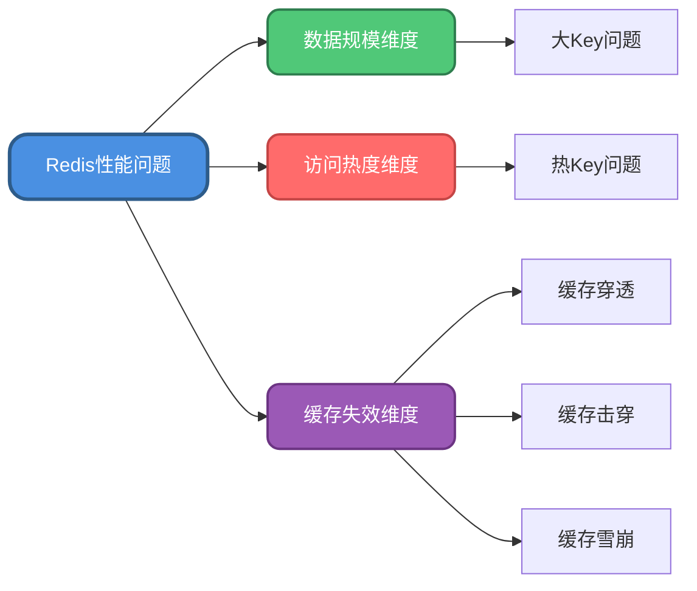
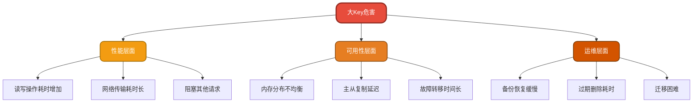
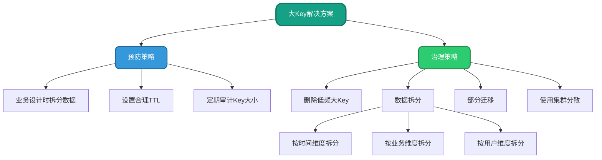
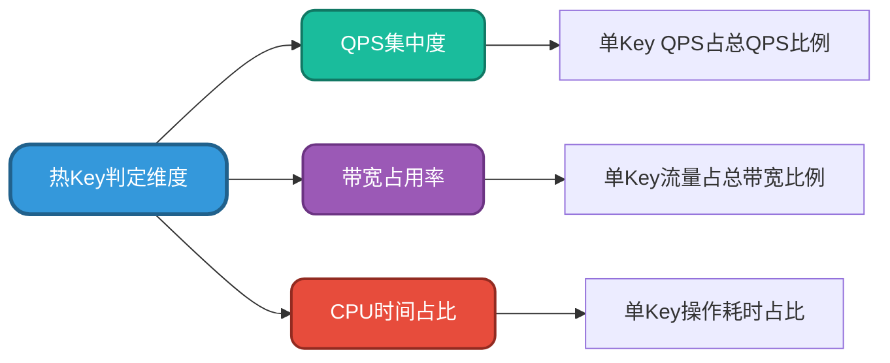
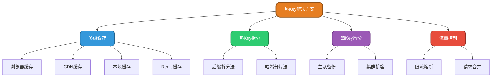
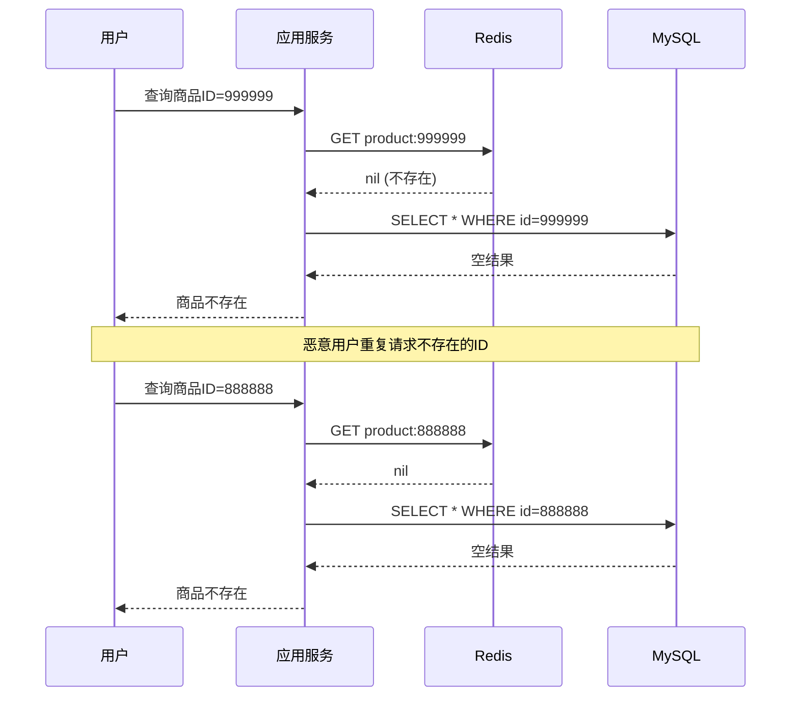
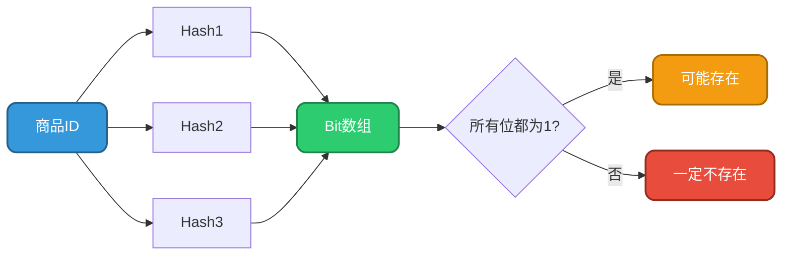
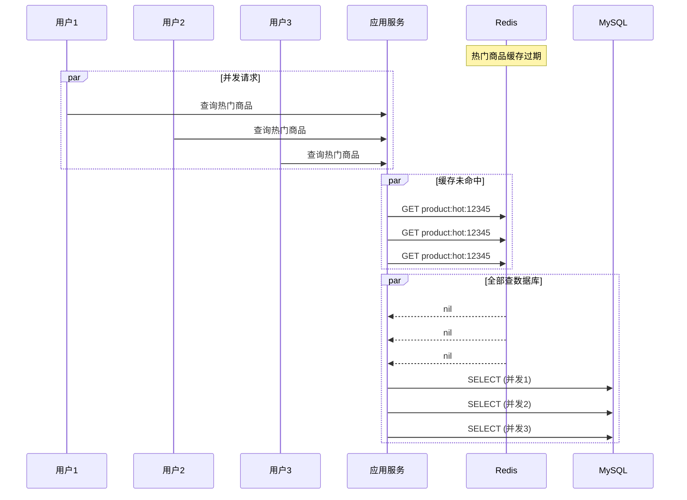
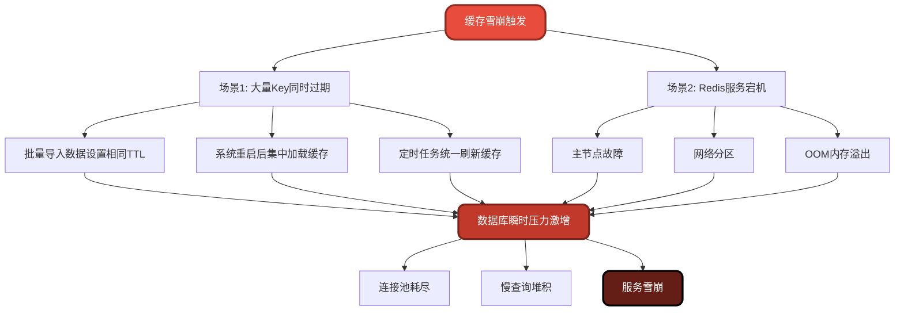
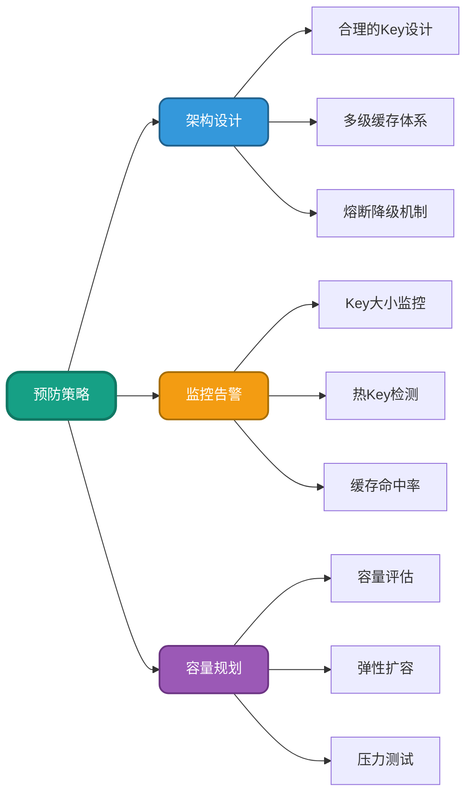

# Redis性能问题诊断与优化实战

## 性能问题概述

在高并发场景下，Redis作为缓存中间件可能会遇到各种性能瓶颈。这些问题主要集中在三个维度：**数据规模问题（大Key）**、**访问热度问题（热Key）**、**缓存失效问题（穿透/击穿/雪崩）**。合理诊断和解决这些问题，对保障系统稳定性至关重要。



## 大Key问题深度解析

### 什么是大Key

大Key是指在Redis中存储了超量数据的键值对。这里的"大"包含两层含义：
- **String类型**：单个value值体积过大
- **集合类型**（List/Set/Hash/ZSet）：元素数量过多或总体积庞大

### 业界标准参考

虽然没有绝对标准，但根据主流云厂商和实践经验，建议遵循以下阈值：

| 数据类型 | 判定标准 | 说明 |
|---------|---------|------|
| String | value > 5MB | 阿里云标准，腾讯云为10MB |
| List/Set | 成员数 > 10000 | 元素数量过多 |
| Hash | 成员数 > 1000 且总大小 > 100MB | 综合考量 |
| ZSet | 成员数 > 10000 | 有序集合元素过多 |

**注意**：这些是经验值，需根据实际业务和硬件资源调整。

### 危害分析



**具体影响**：
1. **性能下降**：大Key的读写操作需要更多CPU和内存资源，会显著拖慢响应速度
2. **内存占用**：大量大Key会快速消耗Redis内存，导致频繁的内存淘汰
3. **集群不均**：在Redis Cluster中，某些节点可能因存储大Key而内存吃紧
4. **备份风险**：RDB恢复时，大Key会显著延长加载时间
5. **检索困难**：查询大Key内部数据时，扫描和过滤效率低下
6. **迁移负担**：在扩缩容场景下，大Key的迁移和同步压力巨大
7. **删除阻塞**：大Key过期或主动删除时，会阻塞Redis主线程（Redis 6.0前）

### 识别大Key

**官方工具**：使用redis-cli自带的扫描功能

```bash
# 扫描整个数据库，输出每种类型最大的Key
redis-cli --bigkeys -i 0.1

# 输出示例
# Scanning the entire keyspace to find biggest keys as well as
# average sizes per key type. You can use -i 0.1 to sleep 0.1 sec
# per 100 SCAN commands (not usually needed).

Biggest string found 'inventory:warehouse:batch_20231201' with 8120450 bytes
Biggest list found 'order:pending:queue' with 35600 items
Biggest set found 'user:active:daily' with 28900 members
Biggest zset found 'product:ranking:sales' with 45200 members
Biggest hash found 'session:user:metadata' with 1850 fields
```

**其他识别方式**：
- 监控系统集成：通过Prometheus + Redis Exporter监控Key大小
- 慢查询日志：分析慢查询中涉及的Key
- 客户端埋点：在应用层统计Key访问的数据量

### 解决方案



#### 方案1：选择性删除

对于访问频率低、业务价值小的大Key，可直接删除释放内存。删除前需注意：

```java
// 商品库存批次管理示例
public class InventoryManager {
    
    @Autowired
    private RedisTemplate<String, Object> redisTemplate;
    
    /**
     * 删除过期批次的库存数据
     */
    public void cleanExpiredBatchInventory() {
        String pattern = "inventory:warehouse:batch_*";
        Set<String> keys = redisTemplate.keys(pattern);
        
        for (String key : keys) {
            // 检查访问频率
            Long idleTime = redisTemplate.execute(
                (RedisCallback<Long>) connection -> 
                    connection.objectIdletime(key.getBytes())
            );
            
            // 超过7天未访问的批次数据删除
            if (idleTime != null && idleTime > 604800) {
                redisTemplate.delete(key);
                System.out.println("清理大Key: " + key);
            }
        }
    }
}
```

#### 方案2：设置合理TTL

避免数据永久存储，设置过期时间让Redis自动清理：

```java
// 用户会话数据管理
public class SessionManager {
    
    @Autowired
    private RedisTemplate<String, Object> redisTemplate;
    
    /**
     * 存储用户会话信息，设置过期时间
     */
    public void saveUserSession(String userId, Map<String, Object> sessionData) {
        String key = "session:user:" + userId;
        
        // 设置7天过期
        redisTemplate.opsForHash().putAll(key, sessionData);
        redisTemplate.expire(key, 7, TimeUnit.DAYS);
    }
    
    /**
     * 延长活跃用户的会话时间
     */
    public void refreshSession(String userId) {
        String key = "session:user:" + userId;
        if (Boolean.TRUE.equals(redisTemplate.hasKey(key))) {
            // 重置过期时间为7天
            redisTemplate.expire(key, 7, TimeUnit.DAYS);
        }
    }
}
```

#### 方案3：数据拆分

将大Key按一定规则拆分成多个小Key，是最根本的解决方案：

**按时间维度拆分**：

```java
// 订单队列按小时拆分
public class OrderQueueService {
    
    @Autowired
    private RedisTemplate<String, Object> redisTemplate;
    
    /**
     * 添加待处理订单到队列
     */
    public void addPendingOrder(String orderId) {
        // 按小时拆分队列
        String hour = LocalDateTime.now().format(
            DateTimeFormatter.ofPattern("yyyyMMddHH")
        );
        String queueKey = "order:pending:queue:" + hour;
        
        redisTemplate.opsForList().rightPush(queueKey, orderId);
        // 设置25小时过期（留1小时buffer）
        redisTemplate.expire(queueKey, 25, TimeUnit.HOURS);
    }
    
    /**
     * 获取当前待处理订单
     */
    public List<Object> getPendingOrders() {
        String hour = LocalDateTime.now().format(
            DateTimeFormatter.ofPattern("yyyyMMddHH")
        );
        String queueKey = "order:pending:queue:" + hour;
        
        return redisTemplate.opsForList().range(queueKey, 0, -1);
    }
}
```

**按用户尾号拆分**：

```java
// 活跃用户集合按尾号拆分
public class ActiveUserService {
    
    @Autowired
    private RedisTemplate<String, Object> redisTemplate;
    
    /**
     * 记录今日活跃用户
     */
    public void markUserActive(Long userId) {
        // 按用户ID尾号拆分（0-9共10个bucket）
        int bucket = (int) (userId % 10);
        String date = LocalDate.now().format(
            DateTimeFormatter.ofPattern("yyyyMMdd")
        );
        String key = "user:active:daily:" + date + ":bucket" + bucket;
        
        redisTemplate.opsForSet().add(key, userId);
        redisTemplate.expire(key, 7, TimeUnit.DAYS);
    }
    
    /**
     * 统计今日活跃用户总数
     */
    public long countDailyActiveUsers() {
        String date = LocalDate.now().format(
            DateTimeFormatter.ofPattern("yyyyMMdd")
        );
        long total = 0;
        
        // 汇总10个bucket的数据
        for (int i = 0; i < 10; i++) {
            String key = "user:active:daily:" + date + ":bucket" + i;
            Long size = redisTemplate.opsForSet().size(key);
            total += (size != null ? size : 0);
        }
        
        return total;
    }
}
```

#### 方案4：使用集群分散

在Redis Cluster模式下，利用哈希槽分片机制将大Key分散存储：

```java
// 商品销售排行榜拆分
public class ProductRankingService {
    
    @Autowired
    private RedisTemplate<String, Object> redisTemplate;
    
    /**
     * 记录商品销量（拆分到多个分片）
     */
    public void recordSales(Long productId, double salesAmount) {
        // 按商品ID分片（假设分16个分片）
        int shard = (int) (productId % 16);
        String key = "product:ranking:sales:shard" + shard;
        
        redisTemplate.opsForZSet().incrementScore(
            key, 
            productId.toString(), 
            salesAmount
        );
    }
    
    /**
     * 获取全局TOP100销量商品
     */
    public List<String> getTopProducts(int limit) {
        Map<String, Double> globalScores = new HashMap<>();
        
        // 从所有分片收集数据
        for (int i = 0; i < 16; i++) {
            String key = "product:ranking:sales:shard" + i;
            Set<ZSetOperations.TypedTuple<Object>> shardTop = 
                redisTemplate.opsForZSet()
                    .reverseRangeWithScores(key, 0, limit - 1);
            
            if (shardTop != null) {
                for (ZSetOperations.TypedTuple<Object> tuple : shardTop) {
                    String productId = tuple.getValue().toString();
                    Double score = tuple.getScore();
                    globalScores.merge(productId, score, Double::sum);
                }
            }
        }
        
        // 排序并返回TOP N
        return globalScores.entrySet().stream()
            .sorted(Map.Entry.<String, Double>comparingByValue().reversed())
            .limit(limit)
            .map(Map.Entry::getKey)
            .collect(Collectors.toList());
    }
}
```

#### 方案5：部分迁移

将大Key迁移到专门的存储系统（如MongoDB、HBase），Redis仅缓存热点数据：

```java
// 会话元数据分层存储
public class SessionStorageService {
    
    @Autowired
    private RedisTemplate<String, Object> redisTemplate;
    
    @Autowired
    private MongoTemplate mongoTemplate;
    
    /**
     * 存储会话数据：热数据放Redis，全量数据放MongoDB
     */
    public void saveSession(String userId, Map<String, Object> fullSession) {
        // 提取热点字段存入Redis
        Map<String, Object> hotData = new HashMap<>();
        hotData.put("userId", fullSession.get("userId"));
        hotData.put("username", fullSession.get("username"));
        hotData.put("lastActive", fullSession.get("lastActive"));
        
        String redisKey = "session:hot:" + userId;
        redisTemplate.opsForHash().putAll(redisKey, hotData);
        redisTemplate.expire(redisKey, 30, TimeUnit.MINUTES);
        
        // 完整数据存入MongoDB
        mongoTemplate.save(fullSession, "user_sessions");
    }
}
```

## 热Key问题深度解析

### 什么是热Key

热Key是指在短时间内被高频访问的键。当某个Key的访问量远超其他Key，并集中了大量流量时，就会引发热Key问题。典型场景包括：
- **突发热点事件**：明星官宣、热搜话题
- **大促活动**：双十一秒杀商品
- **体育赛事**：世界杯实时比分
- **限量资源**：演唱会抢票

### 热度判定标准

热Key的判定需要结合业务实际，通常从以下维度考量：



**参考阈值**：
- QPS集中：Redis实例总QPS 10000，某Key占7000 → 热Key
- 带宽集中：1MB的Hash数据每秒被HGETALL请求100次
- CPU集中：10000个成员的ZSet频繁执行ZRANGE操作

### 识别热Key

#### 方法1：业务预判

根据业务特征提前识别潜在热Key：

```java
// 秒杀活动热Key预判
@Service
public class SeckillHotKeyPredictor {
    
    @Autowired
    private RedisTemplate<String, Object> redisTemplate;
    
    /**
     * 秒杀活动开始前预热热Key
     */
    public void preheatSeckillProduct(Long productId) {
        String stockKey = "seckill:stock:product:" + productId;
        
        // 标记为热Key
        String hotKeyMarker = "hotkey:seckill:" + productId;
        redisTemplate.opsForValue().set(
            hotKeyMarker, 
            "predicted", 
            2, 
            TimeUnit.HOURS
        );
        
        System.out.println("预热秒杀商品热Key: " + stockKey);
    }
}
```

#### 方法2：实时监控

在代理层或客户端进行实时统计：

```java
// 客户端侧热Key统计
@Component
public class HotKeyDetector {
    
    private final ConcurrentHashMap<String, AtomicLong> keyAccessCount = 
        new ConcurrentHashMap<>();
    
    private final ScheduledExecutorService scheduler = 
        Executors.newSingleThreadScheduledExecutor();
    
    @PostConstruct
    public void init() {
        // 每10秒统计一次
        scheduler.scheduleAtFixedRate(this::detectHotKeys, 10, 10, TimeUnit.SECONDS);
    }
    
    /**
     * 记录Key访问
     */
    public void recordAccess(String key) {
        keyAccessCount.computeIfAbsent(key, k -> new AtomicLong())
                     .incrementAndGet();
    }
    
    /**
     * 检测热Key
     */
    private void detectHotKeys() {
        long threshold = 1000; // QPS > 100 视为热Key
        
        keyAccessCount.forEach((key, count) -> {
            long qps = count.get() / 10; // 10秒周期
            if (qps > threshold) {
                System.out.println("检测到热Key: " + key + ", QPS: " + qps);
                // 触发热Key处理逻辑
                handleHotKey(key);
            }
        });
        
        // 清空计数器
        keyAccessCount.clear();
    }
    
    private void handleHotKey(String key) {
        // 触发缓存分片、本地缓存等策略
    }
}
```

#### 方法3：Redis自带工具

使用Redis 4.0.3+的hotkeys功能：

```bash
# 扫描热Key（需开启maxmemory-policy为LFU）
redis-cli --hotkeys

# 输出示例
[00.00%] Sampled 1000 keys so far
[00.05%] Hot key 'seckill:stock:product:88888' found with counter 125000
[00.12%] Hot key 'topic:trending:20231201' found with counter 98000
```

### 解决方案



#### 方案1：多级缓存

构建浏览器 → CDN → 本地缓存 → Redis的多级缓存体系：

```java
// 热门话题多级缓存
@Service
public class TrendingTopicService {
    
    @Autowired
    private RedisTemplate<String, Object> redisTemplate;
    
    // 本地缓存（Caffeine）
    private final Cache<String, Object> localCache = Caffeine.newBuilder()
        .maximumSize(1000)
        .expireAfterWrite(10, TimeUnit.SECONDS)
        .build();
    
    /**
     * 获取热门话题详情
     */
    public Object getTopicDetail(String topicId) {
        String cacheKey = "topic:trending:" + topicId;
        
        // L1: 本地缓存
        Object local = localCache.getIfPresent(cacheKey);
        if (local != null) {
            System.out.println("命中本地缓存");
            return local;
        }
        
        // L2: Redis缓存
        Object redis = redisTemplate.opsForValue().get(cacheKey);
        if (redis != null) {
            System.out.println("命中Redis缓存");
            localCache.put(cacheKey, redis);
            return redis;
        }
        
        // L3: 数据库查询
        Object dbData = queryFromDatabase(topicId);
        
        // 回写缓存
        redisTemplate.opsForValue().set(cacheKey, dbData, 5, TimeUnit.MINUTES);
        localCache.put(cacheKey, dbData);
        
        return dbData;
    }
    
    private Object queryFromDatabase(String topicId) {
        // 模拟数据库查询
        return "话题详情数据";
    }
}
```

#### 方案2：热Key拆分

将单个热Key拆分为多个副本，分散流量：

```java
// 秒杀库存热Key拆分
@Service
public class SeckillStockService {
    
    @Autowired
    private RedisTemplate<String, Object> redisTemplate;
    
    private static final int SHARD_COUNT = 10;
    
    /**
     * 初始化秒杀库存（拆分为10份）
     */
    public void initStock(Long productId, int totalStock) {
        int stockPerShard = totalStock / SHARD_COUNT;
        
        for (int i = 0; i < SHARD_COUNT; i++) {
            String shardKey = "seckill:stock:product:" + productId + ":shard" + i;
            redisTemplate.opsForValue().set(shardKey, stockPerShard);
        }
    }
    
    /**
     * 扣减库存（根据用户ID选择分片）
     */
    public boolean deductStock(Long productId, Long userId) {
        // 根据用户ID哈希到某个分片
        int shard = (int) (userId % SHARD_COUNT);
        String shardKey = "seckill:stock:product:" + productId + ":shard" + shard;
        
        // 执行扣减
        Long remaining = redisTemplate.opsForValue().decrement(shardKey);
        
        if (remaining != null && remaining >= 0) {
            System.out.println("用户 " + userId + " 秒杀成功，剩余库存: " + remaining);
            return true;
        } else {
            // 库存不足，回滚
            redisTemplate.opsForValue().increment(shardKey);
            return false;
        }
    }
    
    /**
     * 查询剩余总库存
     */
    public int getTotalStock(Long productId) {
        int total = 0;
        for (int i = 0; i < SHARD_COUNT; i++) {
            String shardKey = "seckill:stock:product:" + productId + ":shard" + i;
            Integer stock = (Integer) redisTemplate.opsForValue().get(shardKey);
            total += (stock != null ? stock : 0);
        }
        return total;
    }
}
```

#### 方案3：热Key备份

在Redis集群中创建热Key的多个副本节点：

```java
// 热门商品信息备份
@Service
public class ProductCacheService {
    
    @Autowired
    private RedisTemplate<String, Object> redisTemplate;
    
    private static final int BACKUP_COUNT = 3;
    
    /**
     * 备份热门商品信息到多个节点
     */
    public void backupHotProduct(Long productId, Object productInfo) {
        for (int i = 0; i < BACKUP_COUNT; i++) {
            String backupKey = "product:hot:" + productId + ":backup" + i;
            redisTemplate.opsForValue().set(
                backupKey, 
                productInfo, 
                10, 
                TimeUnit.MINUTES
            );
        }
    }
    
    /**
     * 轮询读取备份节点
     */
    public Object getHotProduct(Long productId, Long userId) {
        // 根据用户ID轮询选择备份节点
        int backup = (int) (userId % BACKUP_COUNT);
        String backupKey = "product:hot:" + productId + ":backup" + backup;
        
        Object product = redisTemplate.opsForValue().get(backupKey);
        
        if (product == null) {
            // 降级到主Key
            String mainKey = "product:info:" + productId;
            product = redisTemplate.opsForValue().get(mainKey);
        }
        
        return product;
    }
}
```

#### 方案4：限流熔断

对热Key访问进行限流保护：

```java
// 基于Guava RateLimiter的热Key限流
@Service
public class HotKeyRateLimiter {
    
    private final ConcurrentHashMap<String, RateLimiter> limiters = 
        new ConcurrentHashMap<>();
    
    /**
     * 获取热Key数据（带限流）
     */
    public Object getWithRateLimit(String key, int permitsPerSecond) {
        // 为每个热Key创建独立限流器
        RateLimiter limiter = limiters.computeIfAbsent(
            key, 
            k -> RateLimiter.create(permitsPerSecond)
        );
        
        if (limiter.tryAcquire(100, TimeUnit.MILLISECONDS)) {
            // 允许访问
            return redisTemplate.opsForValue().get(key);
        } else {
            // 触发限流，返回降级数据
            System.out.println("热Key限流触发: " + key);
            return getFallbackData(key);
        }
    }
    
    private Object getFallbackData(String key) {
        return "系统繁忙，请稍后再试";
    }
    
    @Autowired
    private RedisTemplate<String, Object> redisTemplate;
}
```

## 缓存失效问题深度解析

缓存失效问题是指缓存在特定情况下无法发挥作用，导致请求直接打到数据库。主要包括三种类型：**穿透**、**击穿**、**雪崩**。

### 记忆口诀

- **穿透**：缓存和数据库都被"穿透"查询，两层都没数据
- **击穿**：单个热点Key过期，瞬间被"击穿"
- **雪崩**："雪崩时没有一个Key是无辜的"，大量Key同时失效

### 问题一：缓存穿透

#### 场景描述

查询的数据在缓存和数据库中都不存在，导致每次请求都会穿透缓存层直达数据库。

**真实案例**：



**危害**：
- 数据库连接池耗尽
- 响应时间激增
- 可能被恶意攻击利用

#### 解决方案1：缓存空值

对不存在的数据也进行缓存：

```java
// 商品查询服务（缓存空值）
@Service
public class ProductQueryService {
    
    @Autowired
    private RedisTemplate<String, Object> redisTemplate;
    
    @Autowired
    private ProductMapper productMapper;
    
    private static final String NULL_VALUE = "NULL";
    
    /**
     * 查询商品信息（防穿透）
     */
    public Product getProduct(Long productId) {
        String cacheKey = "product:info:" + productId;
        
        // 查询缓存
        Object cached = redisTemplate.opsForValue().get(cacheKey);
        
        if (NULL_VALUE.equals(cached)) {
            // 命中空值缓存
            System.out.println("命中空值缓存，商品不存在");
            return null;
        }
        
        if (cached != null) {
            return (Product) cached;
        }
        
        // 查询数据库
        Product product = productMapper.selectById(productId);
        
        if (product != null) {
            // 正常数据缓存30分钟
            redisTemplate.opsForValue().set(
                cacheKey, 
                product, 
                30, 
                TimeUnit.MINUTES
            );
        } else {
            // 空值缓存5分钟（防止误杀正常数据）
            redisTemplate.opsForValue().set(
                cacheKey, 
                NULL_VALUE, 
                5, 
                TimeUnit.MINUTES
            );
        }
        
        return product;
    }
}
```

#### 解决方案2：布隆过滤器

使用布隆过滤器在查询缓存前进行过滤：

```java
// 基于Redisson的布隆过滤器
@Service
public class ProductBloomFilterService {
    
    @Autowired
    private RedissonClient redissonClient;
    
    @Autowired
    private ProductMapper productMapper;
    
    private RBloomFilter<Long> productIdFilter;
    
    @PostConstruct
    public void init() {
        // 初始化布隆过滤器
        productIdFilter = redissonClient.getBloomFilter("product:id:bloom");
        
        // 预期元素数量100万，误判率0.01
        productIdFilter.tryInit(1000000L, 0.01);
        
        // 加载所有商品ID到布隆过滤器
        List<Long> existingIds = productMapper.selectAllIds();
        existingIds.forEach(productIdFilter::add);
        
        System.out.println("布隆过滤器初始化完成，已加载" + existingIds.size() + "个商品ID");
    }
    
    /**
     * 查询商品（布隆过滤器防穿透）
     */
    public Product getProduct(Long productId) {
        // 布隆过滤器判断
        if (!productIdFilter.contains(productId)) {
            System.out.println("布隆过滤器拦截：商品ID不存在");
            return null;
        }
        
        // 后续查询缓存和数据库
        String cacheKey = "product:info:" + productId;
        Object cached = redisTemplate.opsForValue().get(cacheKey);
        
        if (cached != null) {
            return (Product) cached;
        }
        
        Product product = productMapper.selectById(productId);
        if (product != null) {
            redisTemplate.opsForValue().set(
                cacheKey, 
                product, 
                30, 
                TimeUnit.MINUTES
            );
        }
        
        return product;
    }
    
    /**
     * 新增商品时更新布隆过滤器
     */
    public void addProduct(Product product) {
        productMapper.insert(product);
        productIdFilter.add(product.getId());
    }
    
    @Autowired
    private RedisTemplate<String, Object> redisTemplate;
}
```

**布隆过滤器原理**：



### 问题二：缓存击穿

#### 场景描述

某个热点Key过期瞬间，大量并发请求同时访问，击穿缓存层直达数据库。

**真实案例**：



#### 解决方案1：互斥锁

使用分布式锁保证只有一个线程查询数据库：

```java
// 基于Redis分布式锁的缓存击穿防护
@Service
public class ProductCacheProtectService {
    
    @Autowired
    private RedisTemplate<String, Object> redisTemplate;
    
    @Autowired
    private RedissonClient redissonClient;
    
    @Autowired
    private ProductMapper productMapper;
    
    /**
     * 查询商品（互斥锁防击穿）
     */
    public Product getProduct(Long productId) {
        String cacheKey = "product:info:" + productId;
        
        // 查询缓存
        Object cached = redisTemplate.opsForValue().get(cacheKey);
        if (cached != null) {
            return (Product) cached;
        }
        
        // 缓存未命中，获取分布式锁
        String lockKey = "lock:product:" + productId;
        RLock lock = redissonClient.getLock(lockKey);
        
        try {
            // 尝试获取锁，最多等待5秒，锁持有10秒
            if (lock.tryLock(5, 10, TimeUnit.SECONDS)) {
                try {
                    // 双重检查缓存（可能其他线程已加载）
                    cached = redisTemplate.opsForValue().get(cacheKey);
                    if (cached != null) {
                        return (Product) cached;
                    }
                    
                    // 查询数据库
                    System.out.println("获取锁成功，查询数据库: " + productId);
                    Product product = productMapper.selectById(productId);
                    
                    if (product != null) {
                        // 写入缓存
                        redisTemplate.opsForValue().set(
                            cacheKey, 
                            product, 
                            30, 
                            TimeUnit.MINUTES
                        );
                    }
                    
                    return product;
                } finally {
                    lock.unlock();
                }
            } else {
                // 获取锁失败，休眠后重试或返回默认值
                Thread.sleep(200);
                return getProduct(productId);
            }
        } catch (InterruptedException e) {
            Thread.currentThread().interrupt();
            throw new RuntimeException("获取商品信息被中断", e);
        }
    }
}
```

#### 解决方案2：异步定时更新

对于热点数据，不等过期主动刷新：

```java
// 热点数据定时刷新
@Service
public class HotDataRefreshService {
    
    @Autowired
    private RedisTemplate<String, Object> redisTemplate;
    
    @Autowired
    private ProductMapper productMapper;
    
    private final ScheduledExecutorService scheduler = 
        Executors.newScheduledThreadPool(5);
    
    /**
     * 启动热点商品定时刷新任务
     */
    public void startRefreshTask(Long productId) {
        scheduler.scheduleAtFixedRate(
            () -> refreshProductCache(productId),
            0,      // 初始延迟
            25,     // 每25分钟刷新一次（缓存30分钟）
            TimeUnit.MINUTES
        );
    }
    
    /**
     * 刷新商品缓存
     */
    private void refreshProductCache(Long productId) {
        try {
            String cacheKey = "product:info:" + productId;
            Product product = productMapper.selectById(productId);
            
            if (product != null) {
                redisTemplate.opsForValue().set(
                    cacheKey, 
                    product, 
                    30, 
                    TimeUnit.MINUTES
                );
                System.out.println("定时刷新商品缓存: " + productId);
            }
        } catch (Exception e) {
            System.err.println("刷新缓存失败: " + e.getMessage());
        }
    }
}
```

### 问题三：缓存雪崩

#### 场景描述

大量缓存Key在同一时间过期，或Redis服务宕机，导致所有请求涌向数据库。

**真实案例**：



#### 解决方案1：差异化过期时间

为不同Key设置随机的过期时间：

```java
// 批量导入商品时设置差异化TTL
@Service
public class ProductBatchImportService {
    
    @Autowired
    private RedisTemplate<String, Object> redisTemplate;
    
    private final Random random = new Random();
    
    /**
     * 批量导入商品缓存（防雪崩）
     */
    public void batchImportProducts(List<Product> products) {
        for (Product product : products) {
            String cacheKey = "product:info:" + product.getId();
            
            // 基础过期时间30分钟 + 随机偏移0-10分钟
            int baseSeconds = 30 * 60;
            int randomOffset = random.nextInt(10 * 60);
            int ttl = baseSeconds + randomOffset;
            
            redisTemplate.opsForValue().set(
                cacheKey, 
                product, 
                ttl, 
                TimeUnit.SECONDS
            );
        }
        
        System.out.println("批量导入" + products.size() + "个商品，TTL已随机化");
    }
}
```

#### 解决方案2：Redis集群高可用

部署主从+哨兵或Redis Cluster集群：

```yaml
# Redis Sentinel配置示例
spring:
  redis:
    sentinel:
      master: mymaster
      nodes:
        - 192.168.1.10:26379
        - 192.168.1.11:26379
        - 192.168.1.12:26379
    database: 0
    password: yourpassword
    lettuce:
      pool:
        max-active: 100
        max-idle: 20
        min-idle: 5
        max-wait: 2000ms
```

```java
// 集群配置
@Configuration
public class RedisClusterConfig {
    
    @Bean
    public RedisConnectionFactory redisConnectionFactory() {
        RedisSentinelConfiguration sentinelConfig = 
            new RedisSentinelConfiguration()
                .master("mymaster")
                .sentinel("192.168.1.10", 26379)
                .sentinel("192.168.1.11", 26379)
                .sentinel("192.168.1.12", 26379);
        
        LettuceConnectionFactory factory = 
            new LettuceConnectionFactory(sentinelConfig);
        
        return factory;
    }
}
```

#### 解决方案3：多级降级策略

构建缓存降级体系：

```java
// 多级降级查询
@Service
public class ProductQueryWithFallbackService {
    
    @Autowired
    private RedisTemplate<String, Object> redisTemplate;
    
    @Autowired
    private ProductMapper productMapper;
    
    // 本地缓存作为二级防护
    private final Cache<Long, Product> localCache = Caffeine.newBuilder()
        .maximumSize(5000)
        .expireAfterWrite(5, TimeUnit.MINUTES)
        .build();
    
    /**
     * 带降级策略的商品查询
     */
    public Product getProduct(Long productId) {
        // L1: Redis缓存
        try {
            String cacheKey = "product:info:" + productId;
            Object cached = redisTemplate.opsForValue().get(cacheKey);
            if (cached != null) {
                return (Product) cached;
            }
        } catch (Exception e) {
            System.err.println("Redis查询失败，降级到本地缓存: " + e.getMessage());
        }
        
        // L2: 本地缓存（Redis故障时的降级）
        Product local = localCache.getIfPresent(productId);
        if (local != null) {
            System.out.println("命中本地降级缓存");
            return local;
        }
        
        // L3: 数据库查询（限流保护）
        try {
            Product product = queryDatabaseWithLimit(productId);
            
            // 回写本地缓存
            if (product != null) {
                localCache.put(productId, product);
            }
            
            return product;
        } catch (Exception e) {
            System.err.println("数据库查询失败: " + e.getMessage());
            // L4: 返回兜底数据
            return getDefaultProduct(productId);
        }
    }
    
    /**
     * 带限流的数据库查询
     */
    private Product queryDatabaseWithLimit(Long productId) {
        // 简化示例，实际应使用Sentinel/Hystrix等限流组件
        return productMapper.selectById(productId);
    }
    
    /**
     * 兜底数据
     */
    private Product getDefaultProduct(Long productId) {
        Product fallback = new Product();
        fallback.setId(productId);
        fallback.setName("商品信息加载中...");
        return fallback;
    }
}
```

## 最佳实践总结

### 预防为主原则



### 问题诊断流程

1. **性能异常发现** → 监控系统告警
2. **问题定位** → 分析慢查询、热Key统计、bigkeys扫描
3. **影响评估** → 确定影响范围和严重程度
4. **应急处理** → 限流、降级、扩容
5. **根因分析** → 代码审查、架构优化
6. **长效机制** → 规范制定、自动化巡检

### 关键指标监控

| 指标类别 | 监控项 | 告警阈值参考 |
|---------|-------|-------------|
| 性能指标 | 平均响应时间 | > 10ms |
| 性能指标 | P99响应时间 | > 50ms |
| 流量指标 | QPS | 根据容量规划 |
| 流量指标 | 单Key QPS | > 总QPS的30% |
| 资源指标 | 内存使用率 | > 80% |
| 资源指标 | 连接数 | > 最大连接数的70% |
| 缓存指标 | 命中率 | < 95% |
| 缓存指标 | 过期Key数量 | 异常增长 |

## 总结

Redis性能问题的本质是**资源竞争**和**流量分配不均**。解决这些问题需要：

1. **事前预防**：合理的架构设计、容量规划、监控体系
2. **事中发现**：实时监控、热Key检测、异常告警
3. **事后优化**：问题复盘、长效机制、自动化运维

掌握大Key、热Key、缓存三击问题的诊断和解决方案，是保障高并发系统稳定性的核心能力。在实际应用中，需要根据业务特点选择合适的优化策略，并持续迭代改进。
