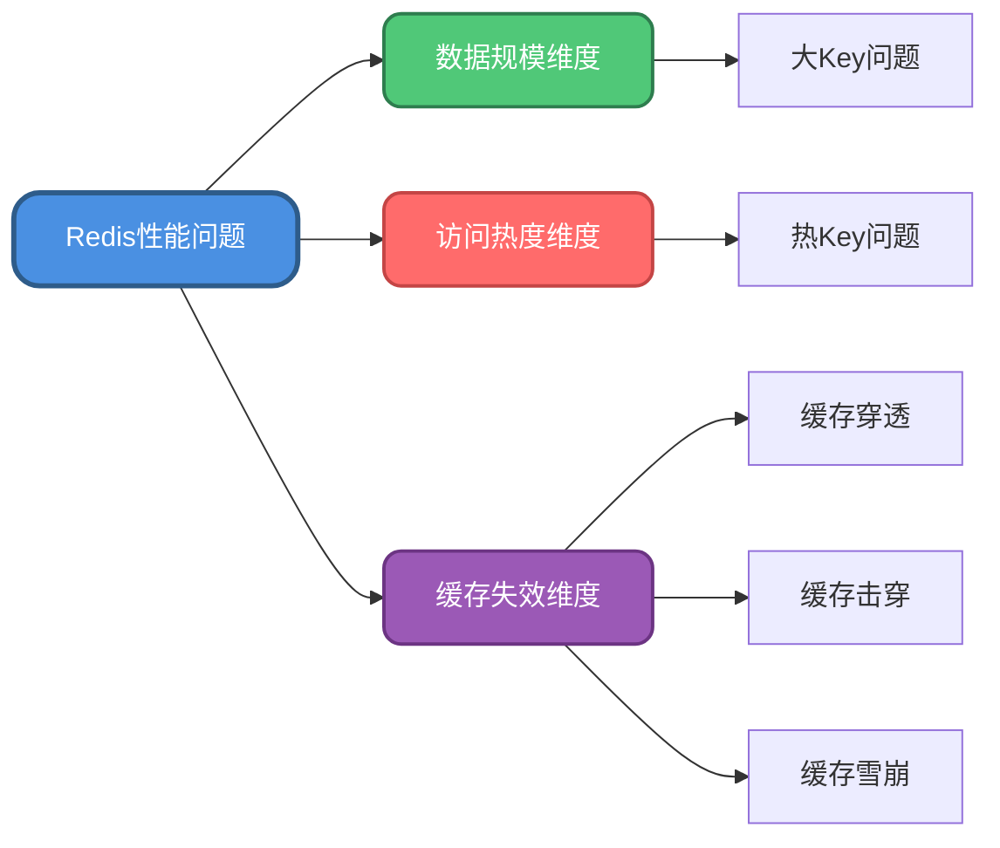
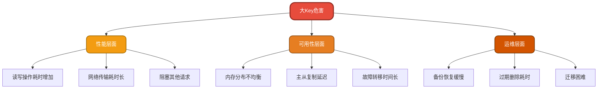
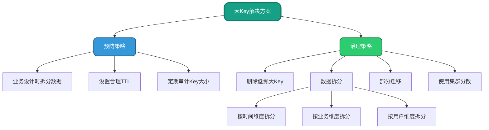

import PaidCTA from '@site/src/components/PaidCTA';

# Redis性能问题诊断与优化实战

## 性能问题概述

在高并发场景下，Redis作为缓存中间件可能会遇到各种性能瓶颈。这些问题主要集中在三个维度：**数据规模问题（大Key）**、**访问热度问题（热Key）**、**缓存失效问题（穿透/击穿/雪崩）**。合理诊断和解决这些问题，对保障系统稳定性至关重要。



## 大Key问题深度解析

### 什么是大Key

大Key是指在Redis中存储了超量数据的键值对。这里的"大"包含两层含义：
- **String类型**：单个value值体积过大
- **集合类型**（List/Set/Hash/ZSet）：元素数量过多或总体积庞大

### 业界标准参考

虽然没有绝对标准，但根据主流云厂商和实践经验，建议遵循以下阈值：

| 数据类型 | 判定标准 | 说明 |
|---------|---------|------|
| String | value > 5MB | 阿里云标准，腾讯云为10MB |
| List/Set | 成员数 > 10000 | 元素数量过多 |
| Hash | 成员数 > 1000 且总大小 > 100MB | 综合考量 |
| ZSet | 成员数 > 10000 | 有序集合元素过多 |

**注意**：这些是经验值，需根据实际业务和硬件资源调整。

### 危害分析



**具体影响**：
1. **性能下降**：大Key的读写操作需要更多CPU和内存资源，会显著拖慢响应速度
2. **内存占用**：大量大Key会快速消耗Redis内存，导致频繁的内存淘汰
3. **集群不均**：在Redis Cluster中，某些节点可能因存储大Key而内存吃紧
4. **备份风险**：RDB恢复时，大Key会显著延长加载时间
5. **检索困难**：查询大Key内部数据时，扫描和过滤效率低下
6. **迁移负担**：在扩缩容场景下，大Key的迁移和同步压力巨大
7. **删除阻塞**：大Key过期或主动删除时，会阻塞Redis主线程（Redis 6.0前）

### 识别大Key

**官方工具**：使用redis-cli自带的扫描功能

```bash
# 扫描整个数据库，输出每种类型最大的Key
redis-cli --bigkeys -i 0.1

# 输出示例
# Scanning the entire keyspace to find biggest keys as well as
# average sizes per key type. You can use -i 0.1 to sleep 0.1 sec
# per 100 SCAN commands (not usually needed).

Biggest string found 'inventory:warehouse:batch_20231201' with 8120450 bytes
Biggest list found 'order:pending:queue' with 35600 items
Biggest set found 'user:active:daily' with 28900 members
Biggest zset found 'product:ranking:sales' with 45200 members
Biggest hash found 'session:user:metadata' with 1850 fields
```

**其他识别方式**：
- 监控系统集成：通过Prometheus + Redis Exporter监控Key大小
- 慢查询日志：分析慢查询中涉及的Key
- 客户端埋点：在应用层统计Key访问的数据量

### 解决方案



#### 方案1：选择性删除

<PaidCTA />