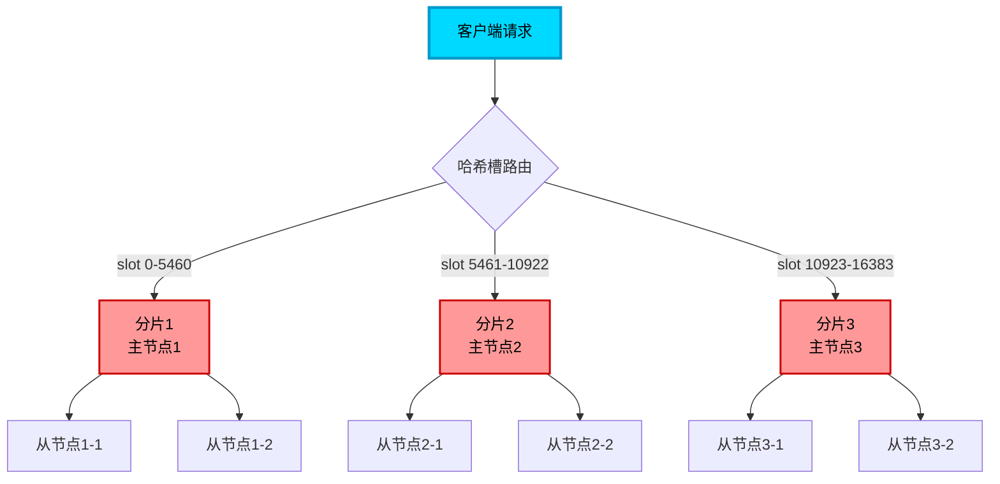
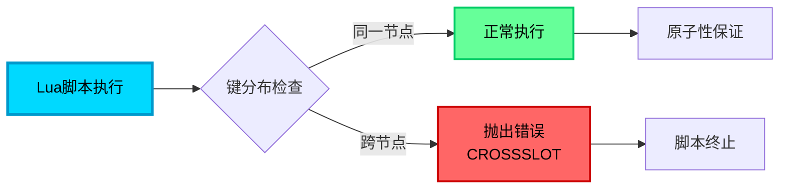
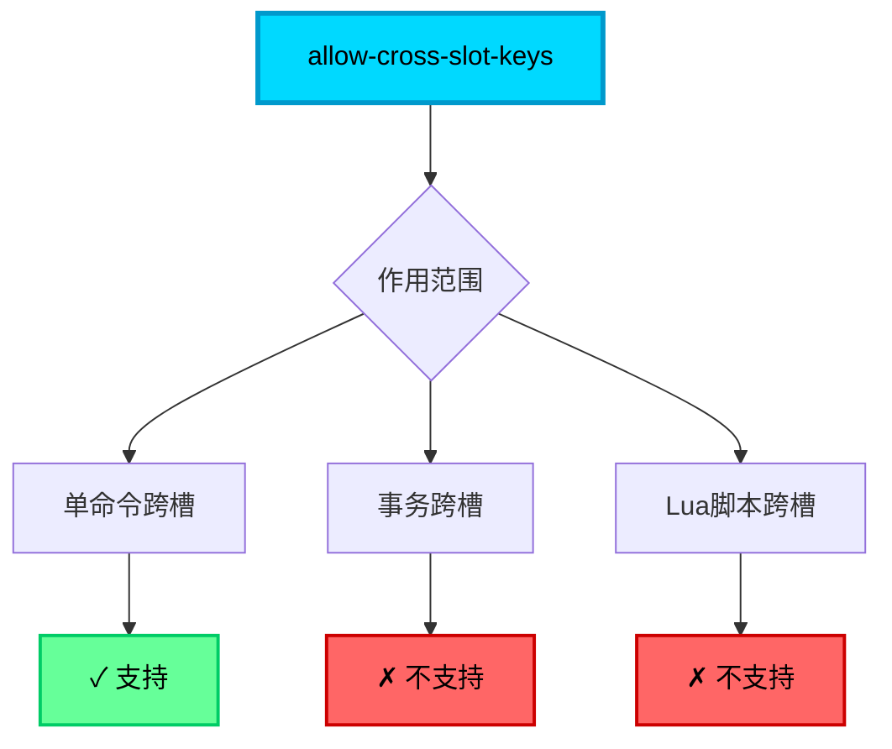

## Redis Cluster 的数据分片机制

Redis Cluster 采用主从复制和数据分片相结合的架构模式来实现高可用和水平扩展。在这种架构下，整个数据集被分散存储到多个节点上，每个分片（Shard）由一个主节点和若干从节点组成。主节点负责处理写操作和部分读操作，从节点则复制主节点数据并承担读请求。

这种设计思想与 MySQL 的分库分表非常相似，都是通过特定的分片算法将数据分布到不同的存储节点上，从而突破单节点的性能和容量瓶颈。



## 集群模式下的事务限制

### 跨节点事务无法执行

与 MySQL 跨库事务面临的限制相同，**Redis Cluster 中的事务操作不能跨越多个节点执行**。事务中涉及的所有键必须位于同一个哈希槽（Slot），进而保证它们存储在同一个节点上。如果尝试在单个事务中操作分布在不同分片的键，Redis 将直接拒绝执行该事务。

```java
// 订单支付场景 - 错误示例（跨节点事务失败）
Jedis jedis = new Jedis("127.0.0.1", 7000);

Transaction tx = jedis.multi();
// 假设 order:1001 和 account:user123 分布在不同节点
tx.decrBy("order:1001:stock", 1);        // 在节点A
tx.incrBy("account:user123:balance", -299);  // 在节点B
// 执行时会报错：CROSSSLOT Keys in request don't hash to the same slot
tx.exec();
```

### WATCH 命令的同样限制

Redis 的 `WATCH` 命令用于实现乐观锁机制，它同样要求被监视的键必须位于同一个哈希槽。跨节点的 WATCH 操作会导致命令执行失败。

```java
// 库存扣减乐观锁 - 错误示例
jedis.watch("product:phone:stock", "order:1001:status");  // 可能在不同节点
Transaction tx = jedis.multi();
// ... 业务逻辑
tx.exec();  // 如果键在不同节点，WATCH 将失败
```

## 集群模式下的 Lua 脚本限制

### 脚本执行的原子性要求

Lua 脚本在 Redis 中以原子方式执行，这是其核心价值之一。然而在 Redis Cluster 环境下，**Lua 脚本访问的所有键同样必须位于同一个节点**。Redis 不会为了执行脚本而在节点之间迁移数据或进行分布式协调。

当脚本尝试访问分布在不同节点的键时，会立即抛出错误并终止执行，这可能会影响数据的一致性状态。

```lua
-- 库存和订单状态更新 - 错误示例
-- 假设 stock:phone 和 order:1001 在不同节点
local stock = redis.call('GET', 'stock:phone')
if tonumber(stock) > 0 then
    redis.call('DECR', 'stock:phone')
    redis.call('SET', 'order:1001', 'paid')  -- 跨节点访问失败
    return 1
end
return 0
```

执行时会收到错误提示：**command keys must in same slot**

官方文档参考：[https://redis.io/docs/latest/operate/oss_and_stack/reference/cluster-spec/](https://redis.io/docs/latest/operate/oss_and_stack/reference/cluster-spec/)



## 解决方案一：Hash Tag 键名设计

### Hash Tag 的工作原理

Redis 官方提供了一种名为 **Hash Tag** 的机制来解决跨节点操作问题。通过在键名中使用大括号 `{}` 包裹特定部分，可以干预 Redis 的哈希槽分配算法。

**关键规则：**
- Redis 仅对大括号内的字符串计算哈希值
- 如果大括号为空或不含内容，则使用完整键名计算哈希
- 具有相同 Hash Tag 的键会被分配到同一个哈希槽

这与 MySQL 分库分表中的"分片键基因法"概念非常相似。

```java
// Hash Tag 应用示例 - 用户维度的数据聚合
String userId = "12345";

// 以下键都使用 {12345} 作为 Hash Tag，会被分配到同一节点
jedis.set("user:{12345}:profile", "{\"name\":\"张三\",\"age\":28}");
jedis.set("user:{12345}:orders", "[\"order001\",\"order002\"]");
jedis.hset("user:{12345}:settings", "theme", "dark");

// 现在可以在事务中安全操作这些键
Transaction tx = jedis.multi();
tx.get("user:{12345}:profile");
tx.lrange("user:{12345}:orders", 0, -1);
tx.hget("user:{12345}:settings", "theme");
tx.exec();  // 成功执行
```

### Hash Tag 在实际业务中的应用

**电商订单处理场景：**

```java
// 订单支付流程 - 使用 Hash Tag 保证原子性
public class OrderPaymentService {
    
    public boolean processPayment(String orderId, String userId) {
        // 设计键名时将 userId 作为 Hash Tag
        String orderKey = "order:{" + userId + "}:" + orderId;
        String accountKey = "account:{" + userId + "}:balance";
        String stockKey = "stock:{" + userId + "}:reserved";
        
        Jedis jedis = jedisCluster.getConnectionFromSlot(
            JedisClusterCRC16.getSlot(userId)
        );
        
        // 所有键都在同一节点，可安全使用事务
        Transaction tx = jedis.multi();
        tx.set(orderKey + ":status", "paid");
        tx.decrBy(accountKey, 29900);
        tx.decr(stockKey);
        List<Object> result = tx.exec();
        
        return result != null;
    }
}
```

**Lua 脚本与 Hash Tag 结合：**

```java
// 秒杀场景 - 库存扣减和订单创建
public boolean seckillProduct(String productId, String userId) {
    // 使用 productId 作为 Hash Tag
    String stockKey = "seckill:{" + productId + "}:stock";
    String ordersKey = "seckill:{" + productId + "}:orders";
    
    String luaScript = 
        "local stock = redis.call('GET', KEYS[1]) " +
        "if tonumber(stock) > 0 then " +
        "    redis.call('DECR', KEYS[1]) " +
        "    redis.call('SADD', KEYS[2], ARGV[1]) " +
        "    return 1 " +
        "else " +
        "    return 0 " +
        "end";
    
    Object result = jedis.eval(
        luaScript, 
        Arrays.asList(stockKey, ordersKey),
        Arrays.asList(userId)
    );
    
    return "1".equals(result.toString());
}
```

```mermaid
graph TB
    A[键名设计] --> B{是否包含Hash Tag}
    B -->|是| C[提取{xxx}内容]
    B -->|否| D[使用完整键名]
    
    C --> E[计算哈希槽]
    D --> E
    
    E --> F[相同Tag<br/>→同一槽位]
    
    F --> G[支持事务]
    F --> H[支持Lua脚本]
    
    style A fill:#00D9FF,stroke:#0099CC,stroke-width:3px,color:#000
    style C fill:#66FF99,stroke:#00CC66,stroke-width:2px,color:#000
    style F fill:#FF99CC,stroke:#CC0066,stroke-width:2px,color:#000
```

### Hash Tag 设计最佳实践

1. **选择合适的分片键**：根据业务访问模式选择合理的 Hash Tag，常见选择包括用户ID、订单ID、商品ID等。

2. **避免数据倾斜**：如果某个 Hash Tag 下的数据量过大，可能导致单节点热点问题。

```java
// 不好的设计 - 可能导致热点
"product:{all}:item1"
"product:{all}:item2"  // 所有商品都聚集在一个节点

// 好的设计 - 按类目分散
"product:{category1}:item1"
"product:{category2}:item2"
```

3. **业务逻辑拆分**：尽量将需要原子性保证的操作限制在同一个业务维度内。

## 解决方案二：应用层分布式事务

对于无法通过 Hash Tag 解决的跨节点强一致性需求，可以在应用层实现分布式事务管理：

### 两阶段提交（2PC）模式

```java
// 分布式订单处理示例
public class DistributedOrderService {
    
    public boolean createOrder(Order order) {
        String phase1Key = "tx:prepare:" + order.getId();
        
        try {
            // 阶段1：准备阶段
            boolean node1Ready = prepareNode1(order);
            boolean node2Ready = prepareNode2(order);
            
            if (node1Ready && node2Ready) {
                // 阶段2：提交阶段
                commitNode1(order);
                commitNode2(order);
                return true;
            } else {
                // 回滚
                rollbackNode1(order);
                rollbackNode2(order);
                return false;
            }
        } finally {
            // 清理临时状态
            jedis.del(phase1Key);
        }
    }
}
```

### TCC 补偿型事务

```java
// Try-Confirm-Cancel 模式
public class TCCOrderService {
    
    // Try: 资源预留
    public boolean tryReserve(String orderId, String userId) {
        jedis.set("reserve:order:" + orderId, "trying", "EX", 300);
        jedis.decrBy("reserve:stock:product123", 1);
        return true;
    }
    
    // Confirm: 确认提交
    public void confirm(String orderId) {
        jedis.set("order:" + orderId + ":status", "confirmed");
        jedis.del("reserve:order:" + orderId);
    }
    
    // Cancel: 取消回滚
    public void cancel(String orderId) {
        jedis.incrBy("reserve:stock:product123", 1);
        jedis.del("reserve:order:" + orderId);
    }
}
```

## 解决方案三：操作逻辑拆分

将需要事务保护的复杂逻辑拆分成多个独立的、可在单节点执行的小操作，通过业务流程编排来保证最终一致性。

```java
// 订单创建流程拆分
public class OrderCreationFlow {
    
    // 步骤1：创建订单记录（单节点操作）
    public String createOrderRecord(OrderInfo info) {
        String orderId = generateOrderId();
        jedis.hset("order:" + orderId, "status", "created");
        jedis.hset("order:" + orderId, "userId", info.getUserId());
        return orderId;
    }
    
    // 步骤2：扣减库存（单节点操作）
    public boolean deductStock(String productId, int quantity) {
        Long stock = jedis.decrBy("stock:" + productId, quantity);
        return stock >= 0;
    }
    
    // 步骤3：扣减余额（单节点操作）
    public boolean deductBalance(String userId, long amount) {
        Long balance = jedis.decrBy("balance:" + userId, amount);
        return balance >= 0;
    }
    
    // 业务编排层处理异常回滚
    public boolean processOrder(OrderInfo info) {
        String orderId = createOrderRecord(info);
        
        if (!deductStock(info.getProductId(), info.getQuantity())) {
            compensateOrder(orderId);  // 补偿
            return false;
        }
        
        if (!deductBalance(info.getUserId(), info.getAmount())) {
            compensateStock(info.getProductId(), info.getQuantity());  // 补偿
            compensateOrder(orderId);
            return false;
        }
        
        return true;
    }
}
```

## allow-cross-slot-keys 配置解析

### 功能说明

Redis 7.0.11 版本引入了 `allow-cross-slot-keys` 配置参数，但其作用常常被误解。

GitHub PR：[https://github.com/redis/redis-doc/pull/1893/files](https://github.com/redis/redis-doc/pull/1893/files)

**实际功能：**
- 允许在**单个命令**中使用分布在不同槽位的键
- 例如：`MSET key1 value1 key2 value2` 中 key1 和 key2 可以在不同节点

**重要限制：**
- **不支持跨节点事务**：即使开启此选项，事务中的键仍必须在同一槽位
- **不支持跨节点 Lua 脚本**：Lua 脚本的原子性要求未改变

```bash
# redis.conf 配置
cluster-allow-cross-slot-keys yes
```

```java
// 开启 allow-cross-slot-keys 后可执行
jedis.mset("user:1001", "Alice", "product:2001", "Phone");  // 键可在不同节点

// 但以下事务仍然失败
Transaction tx = jedis.multi();
tx.set("user:1001", "Alice");    // 节点A
tx.set("product:2001", "Phone");  // 节点B
tx.exec();  // 依然报错：CROSSSLOT
```

### 性能影响

启用 `allow-cross-slot-keys` 的命令因涉及多节点网络通信，性能会有所下降，但这**不会让操作变成原子的**。它只是放宽了单命令的限制，并未改变事务和 Lua 的原子性保障机制。



**常见误解澄清：**

网络上部分文章声称"使用 allow-cross-slot-keys 就能实现跨节点事务或 Lua 脚本"，这是**完全错误**的理解。该配置仅针对特定的单命令场景，无法突破 Redis Cluster 的核心架构限制。

## 方案对比与选型建议

| 方案 | 适用场景 | 优点 | 缺点 |
|------|---------|------|------|
| **Hash Tag** | 业务数据天然有聚合维度 | 实现简单，性能好 | 可能导致数据倾斜 |
| **应用层事务** | 跨节点强一致性需求 | 灵活性高 | 开发复杂度高，性能开销大 |
| **操作拆分** | 可接受最终一致性 | 性能最优 | 需要补偿机制，业务逻辑复杂 |

**推荐策略：**
1. **优先使用 Hash Tag**：80% 的场景可通过合理的键名设计解决
2. **少量跨节点操作**：考虑操作拆分 + 最终一致性
3. **强一致性要求**：评估是否真的需要 Redis Cluster，或考虑单实例 + 主从方案

## 总结

Redis Cluster 的数据分片架构在提供高可用和水平扩展能力的同时，也引入了跨节点操作的限制。理解这些限制的本质原因，并选择合适的解决方案，是充分发挥 Redis Cluster 能力的关键：

- **Hash Tag** 是最推荐的解决方案，通过键名设计将相关数据聚合到同一节点
- 应用层分布式事务和操作拆分是更复杂场景的补充方案
- `allow-cross-slot-keys` 仅适用于特定单命令场景，无法解决事务和 Lua 的跨节点问题

在架构设计时，应根据业务特点和一致性要求，选择最适合的技术方案。
