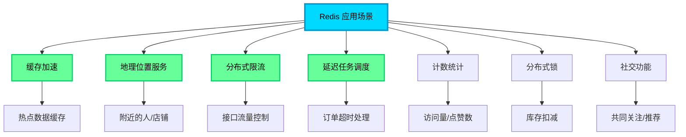
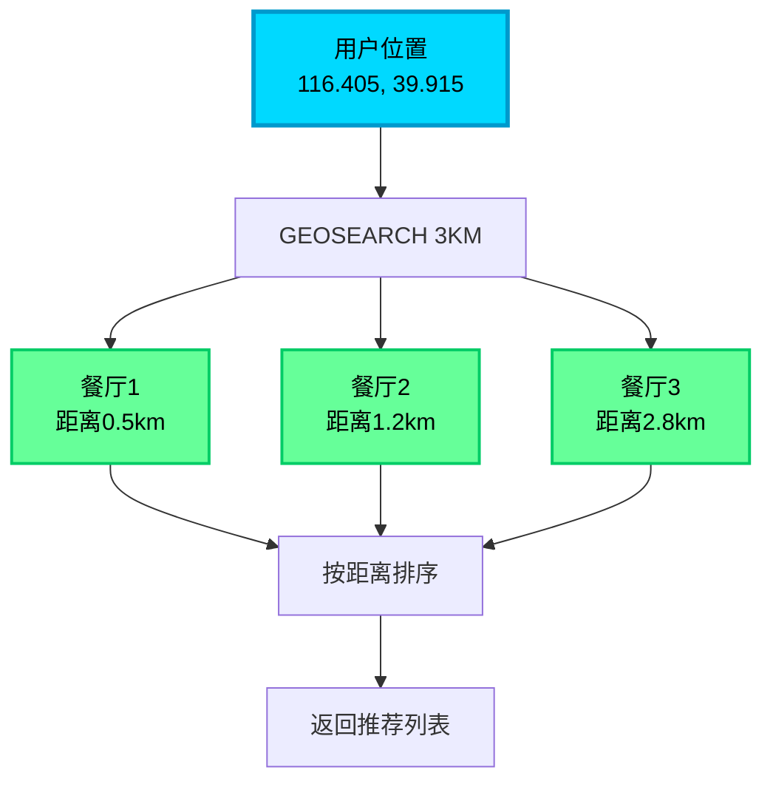
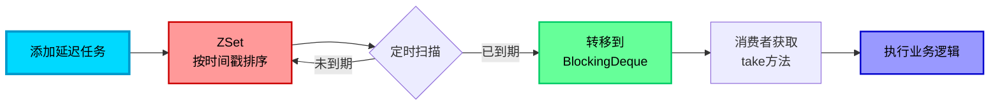
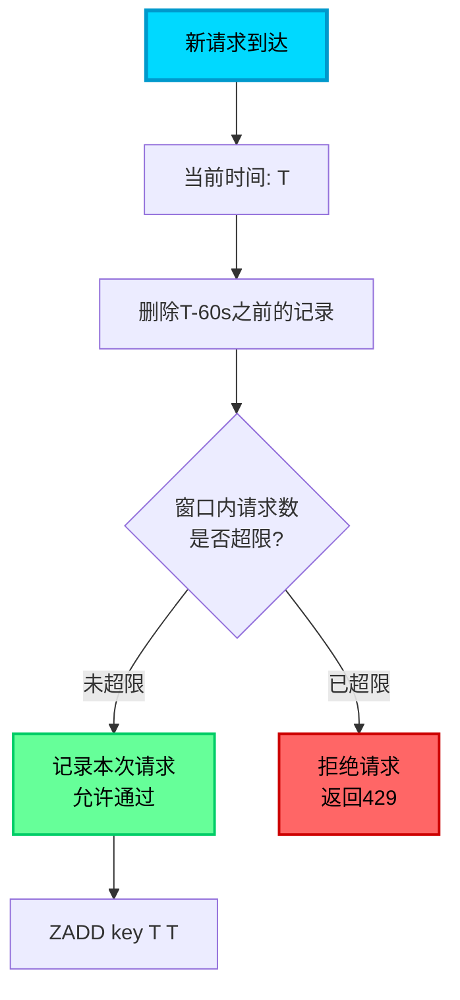

## Redis 的多样化应用场景

虽然 Redis 最广为人知的应用是作为高性能缓存，但其丰富的数据结构和强大的原子操作能力，使其在众多场景下都能发挥独特价值。本文将深入探讨 Redis 在实际业务中的多种应用模式。



## 地理位置服务：GEO 数据类型

### GEO 的核心能力

Redis GEO 是 Geolocation（地理坐标）的缩写，专门用于存储和检索地理位置信息。它基于 Sorted Set（有序集合）实现，将经纬度坐标编码为 Geohash 后作为 score 存储，从而实现高效的空间范围查询。

### GEO 核心命令

| 命令 | 功能描述 | 应用场景 |
|------|---------|---------|
| `GEOADD` | 添加地理位置（经度、纬度、名称） | 添加门店、用户位置 |
| `GEODIST` | 计算两点之间的距离 | 配送距离计算 |
| `GEOHASH` | 获取位置的 Geohash 字符串 | 位置编码存储 |
| `GEOPOS` | 获取指定成员的坐标 | 查询用户/门店位置 |
| `GEORADIUS` | 圆形范围搜索（已废弃，建议用 GEOSEARCH） | 附近的人/店铺 |
| `GEOSEARCH` | 灵活的范围搜索（支持圆形/矩形） | 推荐附近商户 |
| `GEOSEARCHSTORE` | 搜索结果存储到新 Key | 缓存搜索结果 |

### 实战案例：外卖平台附近商家推荐

```java
/**
 * 外卖平台商家地理位置服务
 */
public class RestaurantGeoService {
    
    private JedisCluster jedis;
    private static final String RESTAURANT_GEO_KEY = "geo:restaurants:city:";
    
    /**
     * 商家入驻：添加门店位置
     */
    public void addRestaurant(String cityCode, String restaurantId, 
                              double longitude, double latitude) {
        String geoKey = RESTAURANT_GEO_KEY + cityCode;
        
        // 添加门店地理位置
        // 参数：key, 经度, 纬度, 成员名称
        jedis.geoadd(geoKey, longitude, latitude, restaurantId);
        
        // 示例：添加北京的几家餐厅
        // 经度在前，纬度在后（注意顺序）
        jedis.geoadd("geo:restaurants:city:beijing", 
            116.404269, 39.913164, "rest:001");  // 某火锅店
        jedis.geoadd("geo:restaurants:city:beijing",
            116.407123, 39.916345, "rest:002");  // 某烤肉店
    }
    
    /**
     * 查询附近的餐厅（3公里内）
     */
    public List<RestaurantVO> findNearbyRestaurants(
            String cityCode, double userLng, double userLat, double radiusKm) {
        
        String geoKey = RESTAURANT_GEO_KEY + cityCode;
        
        // 使用 GEOSEARCH 查询附近餐厅
        GeoSearchParam param = new GeoSearchParam()
            .fromLonLat(userLng, userLat)        // 用户当前位置
            .byRadius(radiusKm, GeoUnit.KM)      // 搜索半径
            .withCoord()                          // 返回坐标
            .withDist()                           // 返回距离
            .count(20)                            // 最多返回20家
            .asc();                               // 按距离升序
        
        List<GeoRadiusResponse> responses = jedis.geosearch(geoKey, param);
        
        // 转换为业务对象
        return responses.stream()
            .map(resp -> {
                RestaurantVO vo = new RestaurantVO();
                vo.setId(resp.getMemberByString());
                vo.setDistance(resp.getDistance());
                vo.setLongitude(resp.getCoordinate().getLongitude());
                vo.setLatitude(resp.getCoordinate().getLatitude());
                return vo;
            })
            .collect(Collectors.toList());
    }
    
    /**
     * 计算配送距离
     */
    public double calculateDeliveryDistance(String cityCode, 
                                           String restaurantId, 
                                           String userId) {
        String geoKey = RESTAURANT_GEO_KEY + cityCode;
        
        // 计算两点距离，返回单位为米
        Double distance = jedis.geodist(geoKey, restaurantId, userId, GeoUnit.M);
        return distance != null ? distance : -1;
    }
    
    /**
     * 矩形范围搜索：查询某个区域内的所有餐厅
     */
    public List<String> findRestaurantsInArea(String cityCode,
                                              double centerLng, double centerLat,
                                              double widthKm, double heightKm) {
        String geoKey = RESTAURANT_GEO_KEY + cityCode;
        
        GeoSearchParam param = new GeoSearchParam()
            .fromLonLat(centerLng, centerLat)
            .byBox(widthKm, heightKm, GeoUnit.KM)  // 矩形范围
            .withDist();
        
        List<GeoRadiusResponse> responses = jedis.geosearch(geoKey, param);
        
        return responses.stream()
            .map(GeoRadiusResponse::getMemberByString)
            .collect(Collectors.toList());
    }
}
```

### GEO 使用示例与参数说明

```bash
# 添加门店位置
GEOADD geo:restaurants:beijing 116.404269 39.913164 "restaurant:001"

# 查询3公里内的餐厅，返回距离和坐标
GEOSEARCH geo:restaurants:beijing FROMLONLAT 116.405 39.915 BYRADIUS 3 KM WITHDIST WITHCOORD

# 计算两家餐厅之间的距离
GEODIST geo:restaurants:beijing "restaurant:001" "restaurant:002" KM
```

**返回参数说明：**
- `WITHDIST`：返回目标点到中心点的距离
- `WITHCOORD`：返回目标点的经纬度坐标
- `WITHHASH`：返回 Geohash 编码值（调试用，业务较少使用）



### 社交应用：查找附近的人

```java
/**
 * 社交应用位置服务
 */
public class UserLocationService {
    
    private JedisCluster jedis;
    private static final String USER_LOCATION_KEY = "geo:users:location";
    
    /**
     * 用户上报位置
     */
    public void updateUserLocation(String userId, double lng, double lat) {
        jedis.geoadd(USER_LOCATION_KEY, lng, lat, userId);
        
        // 设置过期时间，避免离线用户占用存储
        jedis.expire(USER_LOCATION_KEY, 3600);  // 1小时后过期
    }
    
    /**
     * 查找附近的人（5公里内）
     */
    public List<NearbyUser> findNearbyUsers(String currentUserId, 
                                           double lng, double lat) {
        GeoSearchParam param = new GeoSearchParam()
            .fromLonLat(lng, lat)
            .byRadius(5, GeoUnit.KM)
            .withDist()
            .count(50);
        
        List<GeoRadiusResponse> responses = jedis.geosearch(USER_LOCATION_KEY, param);
        
        return responses.stream()
            .filter(resp -> !resp.getMemberByString().equals(currentUserId))  // 排除自己
            .map(resp -> {
                NearbyUser user = new NearbyUser();
                user.setUserId(resp.getMemberByString());
                user.setDistance(resp.getDistance());
                return user;
            })
            .collect(Collectors.toList());
    }
}
```

## 延迟任务调度：基于 Redisson 的延迟队列

### 延迟队列的业务价值

延迟队列允许我们在指定的延迟时间后执行任务，常见应用场景包括：
- 订单超时自动取消
- 优惠券过期提醒
- 定时消息推送
- 任务重试机制

### Redisson RDelayedQueue 实现原理

Redisson 的 `RDelayedQueue` 基于 Redis 的 Sorted Set（ZSet）实现，核心思想是：
1. 将任务数据和过期时间戳存入 ZSet，时间戳作为 score
2. 启动后台线程定期扫描已到期的任务（score ≤ 当前时间）
3. 将到期任务从 ZSet 转移到目标队列（RBlockingDeque）
4. 消费者从目标队列获取任务执行



### 实战案例：订单超时自动取消

```java
/**
 * 订单延迟处理服务
 */
@Service
public class OrderDelayQueueService {
    
    @Autowired
    private RedissonClient redissonClient;
    
    private static final String ORDER_QUEUE_NAME = "queue:order:timeout";
    
    /**
     * 创建订单后，添加超时取消任务
     */
    public void addOrderTimeoutTask(String orderId, int timeoutMinutes) {
        // 获取阻塞队列（实际存储任务的队列）
        RBlockingDeque<String> blockingDeque = 
            redissonClient.getBlockingDeque(ORDER_QUEUE_NAME);
        
        // 获取延迟队列（管理延迟逻辑的队列）
        RDelayedQueue<String> delayedQueue = 
            redissonClient.getDelayedQueue(blockingDeque);
        
        // 添加延迟任务
        // 参数：任务数据，延迟时间，时间单位
        delayedQueue.offer(orderId, timeoutMinutes, TimeUnit.MINUTES);
        
        log.info("订单延迟取消任务已添加: orderId={}, timeout={}分钟", 
                 orderId, timeoutMinutes);
    }
    
    /**
     * 批量添加不同延迟时间的任务
     */
    public void addMultipleTimeoutTasks(String orderId) {
        RBlockingDeque<String> blockingDeque = 
            redissonClient.getBlockingDeque(ORDER_QUEUE_NAME);
        RDelayedQueue<String> delayedQueue = 
            redissonClient.getDelayedQueue(blockingDeque);
        
        LocalDateTime now = LocalDateTime.now();
        DateTimeFormatter formatter = DateTimeFormatter.ofPattern("HH:mm:ss");
        
        System.out.println(now.format(formatter) + " - 添加订单超时任务");
        
        // 15分钟后发送支付提醒
        delayedQueue.offer(orderId + ":remind", 15, TimeUnit.MINUTES);
        
        // 30分钟后自动取消订单
        delayedQueue.offer(orderId + ":cancel", 30, TimeUnit.MINUTES);
        
        // 24小时后清理订单数据
        delayedQueue.offer(orderId + ":cleanup", 24, TimeUnit.HOURS);
    }
    
    /**
     * 消费延迟任务（需要单独线程运行）
     */
    @PostConstruct
    public void startOrderTimeoutConsumer() {
        new Thread(() -> {
            RBlockingDeque<String> blockingDeque = 
                redissonClient.getBlockingDeque(ORDER_QUEUE_NAME);
            
            while (true) {
                try {
                    // 阻塞获取到期任务（如果队列为空会一直等待）
                    String orderId = blockingDeque.take();
                    
                    LocalDateTime now = LocalDateTime.now();
                    DateTimeFormatter formatter = DateTimeFormatter.ofPattern("HH:mm:ss");
                    
                    System.out.println(now.format(formatter) + " - 处理订单: " + orderId);
                    
                    // 处理订单超时逻辑
                    handleOrderTimeout(orderId);
                    
                } catch (InterruptedException e) {
                    Thread.currentThread().interrupt();
                    log.error("延迟队列消费被中断", e);
                    break;
                }
            }
        }, "order-timeout-consumer").start();
    }
    
    /**
     * 订单超时处理逻辑
     */
    private void handleOrderTimeout(String taskData) {
        if (taskData.contains(":remind")) {
            // 发送支付提醒
            String orderId = taskData.split(":")[0];
            sendPaymentReminder(orderId);
            
        } else if (taskData.contains(":cancel")) {
            // 取消订单
            String orderId = taskData.split(":")[0];
            cancelUnpaidOrder(orderId);
            
        } else if (taskData.contains(":cleanup")) {
            // 清理数据
            String orderId = taskData.split(":")[0];
            cleanupOrderData(orderId);
        }
    }
    
    private void sendPaymentReminder(String orderId) {
        log.info("发送支付提醒: {}", orderId);
        // 调用消息推送服务
    }
    
    private void cancelUnpaidOrder(String orderId) {
        // 检查订单状态
        String status = redissonClient.getBucket("order:" + orderId + ":status").get();
        
        if ("unpaid".equals(status)) {
            // 更新订单状态为已取消
            redissonClient.getBucket("order:" + orderId + ":status").set("cancelled");
            
            // 释放库存
            releaseStock(orderId);
            
            log.info("订单已自动取消: {}", orderId);
        }
    }
    
    private void cleanupOrderData(String orderId) {
        log.info("清理订单数据: {}", orderId);
        // 归档或删除过期数据
    }
    
    private void releaseStock(String orderId) {
        // 恢复库存逻辑
    }
}
```

### 依赖配置

```xml
<dependency>
    <groupId>org.redisson</groupId>
    <artifactId>redisson-spring-boot-starter</artifactId>
    <version>3.23.5</version>
</dependency>
```

### Redisson 客户端配置

```java
@Configuration
public class RedissonConfig {
    
    @Bean(destroyMethod = "shutdown")
    public RedissonClient redissonClient() {
        Config config = new Config();
        
        // 单机模式
        config.useSingleServer()
            .setAddress("redis://127.0.0.1:6379")
            .setPassword("your_password")
            .setDatabase(0)
            .setConnectionPoolSize(50)
            .setConnectionMinimumIdleSize(10);
        
        // 集群模式
        // config.useClusterServers()
        //     .addNodeAddress("redis://127.0.0.1:7000", "redis://127.0.0.1:7001");
        
        return Redisson.create(config);
    }
}
```

### 延迟队列的关键要点

1. **RDelayedQueue 与 RBlockingDeque 的关系**
   - `RDelayedQueue`：负责管理延迟逻辑，将到期任务转移到目标队列
   - `RBlockingDeque`：实际存储任务数据的队列，消费者从这里获取任务

2. **take() 方法的阻塞特性**
   - `blockingDeque.take()` 会阻塞等待，直到有任务可用
   - 这避免了轮询带来的性能消耗

3. **任务数据建议**
   - 延迟队列中只存储任务标识（如订单ID），不存储完整业务对象
   - 消费时根据标识查询最新的业务数据，避免数据不一致

## 滑动窗口限流：高效流量控制方案

### 滑动窗口限流的原理

滑动窗口限流相比固定窗口限流更加平滑和精确，它的核心思想是：
- 维护一个时间窗口（如最近60秒）
- 记录窗口内的所有请求时间戳
- 每次新请求到来时，移除窗口外的过期记录
- 判断窗口内请求数是否超过限制



### 基于 ZSET 的滑动窗口实现

Redis 的 Sorted Set 天然适合实现滑动窗口：
- **score**：请求的时间戳
- **member**：请求的唯一标识（时间戳 + 随机数，避免并发冲突）

```java
/**
 * 滑动窗口限流器
 */
public class SlidingWindowRateLimiter {
    
    private JedisCluster jedis;
    
    /**
     * 检查请求是否允许通过
     * 
     * @param resourceKey 资源标识（如 "api:/user/login"）
     * @param limit 窗口内最大请求数
     * @param windowSeconds 窗口大小（秒）
     * @return true=允许，false=拒绝
     */
    public boolean allowRequest(String resourceKey, int limit, int windowSeconds) {
        String key = "rate_limit:" + resourceKey;
        long currentTime = System.currentTimeMillis();
        long windowStart = currentTime - windowSeconds * 1000L;
        
        // 1. 删除窗口外的过期数据
        jedis.zremrangeByScore(key, "-inf", String.valueOf(windowStart));
        
        // 2. 统计窗口内的请求数
        Long currentRequests = jedis.zcard(key);
        
        // 3. 判断是否超限
        if (currentRequests < limit) {
            // 4. 记录本次请求（使用时间戳+随机数避免并发时score重复）
            String member = currentTime + ":" + ThreadLocalRandom.current().nextInt(100000);
            jedis.zadd(key, currentTime, member);
            
            // 5. 设置 key 过期时间（窗口大小的2倍，确保数据自动清理）
            jedis.expire(key, windowSeconds * 2);
            
            return true;  // 允许请求
        }
        
        return false;  // 拒绝请求
    }
}
```

### 基于 Lua 脚本保证原子性

上述实现存在并发竞态问题（检查和写入之间非原子），高并发下可能导致限流不准确。使用 Lua 脚本可保证原子性：

```java
/**
 * 原子化的滑动窗口限流器
 */
public class AtomicSlidingWindowRateLimiter {
    
    private JedisCluster jedis;
    
    // Lua 脚本确保原子性
    private static final String LUA_SCRIPT = 
        "local key = KEYS[1] " +
        "local now = tonumber(ARGV[1]) " +
        "local window = tonumber(ARGV[2]) " +
        "local limit = tonumber(ARGV[3]) " +
        "local member = ARGV[4] " +
        
        "local windowStart = now - window * 1000 " +
        
        // 删除窗口外的数据
        "redis.call('ZREMRANGEBYSCORE', key, '-inf', windowStart) " +
        
        // 统计窗口内请求数
        "local currentCount = redis.call('ZCARD', key) " +
        
        // 判断是否超限
        "if currentCount < limit then " +
        "    redis.call('ZADD', key, now, member) " +
        "    redis.call('EXPIRE', key, window * 2) " +
        "    return 1 " +  // 允许
        "else " +
        "    return 0 " +  // 拒绝
        "end";
    
    /**
     * 限流检查
     */
    public boolean allowRequest(String resourceKey, int limit, int windowSeconds) {
        String key = "rate_limit:" + resourceKey;
        long currentTime = System.currentTimeMillis();
        String member = currentTime + ":" + UUID.randomUUID().toString().substring(0, 8);
        
        Object result = jedis.eval(
            LUA_SCRIPT,
            Collections.singletonList(key),
            Arrays.asList(
                String.valueOf(currentTime),
                String.valueOf(windowSeconds),
                String.valueOf(limit),
                member
            )
        );
        
        return "1".equals(result.toString());
    }
}
```

### 实战案例：接口限流注解

```java
/**
 * 限流注解
 */
@Target(ElementType.METHOD)
@Retention(RetentionPolicy.RUNTIME)
public @interface RateLimit {
    
    /**
     * 限流资源标识（默认使用方法全路径）
     */
    String key() default "";
    
    /**
     * 时间窗口内最大请求数
     */
    int limit() default 100;
    
    /**
     * 时间窗口大小（秒）
     */
    int window() default 60;
}

/**
 * 限流切面
 */
@Aspect
@Component
public class RateLimitAspect {
    
    @Autowired
    private AtomicSlidingWindowRateLimiter rateLimiter;
    
    @Around("@annotation(rateLimit)")
    public Object around(ProceedingJoinPoint pjp, RateLimit rateLimit) throws Throwable {
        // 构建限流 key
        String key = rateLimit.key();
        if (StringUtils.isBlank(key)) {
            key = pjp.getSignature().toLongString();
        }
        
        // 限流检查
        boolean allowed = rateLimiter.allowRequest(
            key,
            rateLimit.limit(),
            rateLimit.window()
        );
        
        if (!allowed) {
            throw new RateLimitException("请求过于频繁，请稍后重试");
        }
        
        return pjp.proceed();
    }
}

/**
 * 使用示例
 */
@RestController
public class UserController {
    
    /**
     * 登录接口：每分钟最多5次请求
     */
    @PostMapping("/login")
    @RateLimit(key = "api:login", limit = 5, window = 60)
    public Result login(@RequestBody LoginRequest request) {
        // 登录逻辑
        return Result.success();
    }
    
    /**
     * 短信验证码：每小时最多10次
     */
    @PostMapping("/sms/send")
    @RateLimit(key = "api:sms", limit = 10, window = 3600)
    public Result sendSms(@RequestParam String mobile) {
        // 发送短信
        return Result.success();
    }
}
```

### ZREMRANGEBYSCORE 命令详解

```bash
# 语法
ZREMRANGEBYSCORE key min max

# 示例：删除 score 在 0 到 1640000000 之间的所有成员
ZREMRANGEBYSCORE rate_limit:api:login 0 1640000000

# 使用无穷大符号
# -inf：负无穷（最小值）
# +inf：正无穷（最大值）
ZREMRANGEBYSCORE rate_limit:api:login -inf 1640000000
```

### Redisson 的 RRateLimiter（令牌桶算法）

Redisson 内置了基于令牌桶算法的限流器，虽然实现原理不同，但也是很好的选择：

```java
/**
 * Redisson 令牌桶限流示例
 */
public class RedissonRateLimitExample {
    
    @Autowired
    private RedissonClient redissonClient;
    
    public boolean tryAcquire(String resourceKey, int limit, int windowSeconds) {
        RRateLimiter rateLimiter = redissonClient.getRateLimiter("limiter:" + resourceKey);
        
        // 首次使用需要初始化（设置速率）
        if (!rateLimiter.isExists()) {
            // 参数：速率类型，令牌数，时间窗口，时间单位
            rateLimiter.trySetRate(
                RateType.OVERALL,           // 全局限流
                limit,                       // 令牌数
                windowSeconds,               // 时间窗口
                RateIntervalUnit.SECONDS     // 单位
            );
        }
        
        // 尝试获取1个令牌
        return rateLimiter.tryAcquire(1);
    }
}
```

**令牌桶 vs 滑动窗口：**
- 令牌桶：允许短时突发流量，适合应对流量波动
- 滑动窗口：严格限制请求数，适合精确流量控制

## Redis 的其他典型应用场景

### 计数器（强烈推荐）

```java
// 文章浏览量统计
jedis.incr("article:100001:views");

// 视频点赞数
jedis.incrBy("video:200001:likes", 1);

// 获取统计值
Long views = jedis.get("article:100001:views");
```

### 分布式 ID 生成（可以）

```java
// 基于 Redis 自增生成全局唯一 ID
public Long generateOrderId() {
    String datePrefix = LocalDate.now().format(DateTimeFormatter.ofPattern("yyyyMMdd"));
    String key = "order:id:" + datePrefix;
    
    Long seq = jedis.incr(key);
    jedis.expire(key, 86400);  // 当天过期
    
    // 拼接：日期 + 序号
    return Long.parseLong(datePrefix + String.format("%08d", seq));
}
```

### 分布式 Session（强烈推荐）

```java
// Spring Session 集成 Redis
// application.yml
spring:
  session:
    store-type: redis
    redis:
      namespace: "session:"
      
// 无需代码改动，HttpSession 自动存储到 Redis
@GetMapping("/user/info")
public UserInfo getUserInfo(HttpSession session) {
    return (UserInfo) session.getAttribute("user");
}
```

### 共同关注 / 共同好友（强烈推荐）

```java
// 用户关注列表（Set 类型）
jedis.sadd("user:1001:following", "2001", "2002", "2003");
jedis.sadd("user:1002:following", "2001", "2004", "2005");

// 查询共同关注
Set<String> commonFollowing = jedis.sinter("user:1001:following", "user:1002:following");
// 结果：["2001"]
```

### 推荐关注（可以）

```java
// 用户A关注的人
jedis.sadd("user:1001:following", "2001", "2002");

// 用户B关注的人
jedis.sadd("user:1002:following", "2001", "2003", "2004");

// 推荐给用户A：用户B关注但A未关注的人
Set<String> recommended = jedis.sdiff("user:1002:following", "user:1001:following");
// 结果：["2003", "2004"]
```

### 实时排行榜（强烈推荐）

```java
// 游戏得分榜（ZSet 自动排序）
jedis.zadd("game:leaderboard", 9850, "player001");
jedis.zadd("game:leaderboard", 12300, "player002");
jedis.zadd("game:leaderboard", 8900, "player003");

// 查询 Top 10
Set<String> top10 = jedis.zrevrange("game:leaderboard", 0, 9);

// 查询某玩家排名（从1开始）
Long rank = jedis.zrevrank("game:leaderboard", "player002") + 1;
```

### 状态统计：Bitmap（数据量大时推荐）

```java
// 用户签到统计（每个用户一个 bit）
// 2025年1月1日的签到记录
String key = "checkin:20250101";

// 用户ID 10001 签到
jedis.setbit(key, 10001, true);

// 统计当天签到人数
Long checkinCount = jedis.bitcount(key);

// 检查用户是否签到
Boolean hasCheckedIn = jedis.getbit(key, 10001);
```

### 消息队列（不建议）

虽然 Redis 支持 List、Pub/Sub、Stream 等消息队列能力，但在生产环境中**不建议**用作主要消息队列，原因：
- 缺乏完善的消息确认机制
- 持久化能力有限，存在数据丢失风险
- 不支持复杂的消息路由

**推荐方案**：RabbitMQ、Kafka、RocketMQ 等专业消息中间件

## 应用场景选型建议

| 场景 | 推荐指数 | Redis 数据结构 | 备选方案 |
|------|---------|--------------|---------|
| 缓存加速 | ⭐⭐⭐⭐⭐ | String / Hash | Guava Cache（本地） |
| 分布式锁 | ⭐⭐⭐⭐⭐ | String + Lua | Redisson / Zookeeper |
| 地理位置 | ⭐⭐⭐⭐⭐ | GEO | MongoDB Geospatial |
| 计数统计 | ⭐⭐⭐⭐⭐ | String（INCR） | MySQL / ClickHouse |
| 排行榜 | ⭐⭐⭐⭐⭐ | ZSet | 数据库 + 定时任务 |
| 社交功能 | ⭐⭐⭐⭐⭐ | Set | 图数据库（Neo4j） |
| 分布式限流 | ⭐⭐⭐⭐ | ZSet + Lua | Sentinel / Hystrix |
| 延迟队列 | ⭐⭐⭐ | ZSet（Redisson） | RabbitMQ延迟插件 |
| 消息队列 | ⭐⭐ | Stream / List | Kafka / RabbitMQ |

## 总结

Redis 凭借其丰富的数据结构和卓越的性能，在缓存之外拥有广阔的应用空间。选择合适的应用场景和数据结构，能够极大地简化系统设计并提升性能：

- **GEO**：地理位置服务的最佳选择
- **Redisson RDelayedQueue**：轻量级延迟任务调度
- **滑动窗口限流**：精确的流量控制方案
- **多样化应用**：计数、排行榜、分布式锁、Session 管理等

合理评估业务需求和技术特点，在合适的场景使用 Redis，才能发挥其最大价值。
