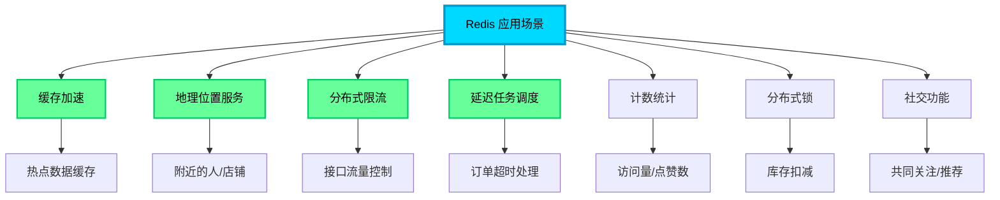

import PaidCTA from '@site/src/components/PaidCTA';

# Redis实战应用场景详解

## Redis 的多样化应用场景

虽然 Redis 最广为人知的应用是作为高性能缓存，但其丰富的数据结构和强大的原子操作能力，使其在众多场景下都能发挥独特价值。本文将深入探讨 Redis 在实际业务中的多种应用模式。

## 地理位置服务：GEO 数据类型

### GEO 的核心能力

Redis GEO 是 Geolocation（地理坐标）的缩写，专门用于存储和检索地理位置信息。它基于 Sorted Set（有序集合）实现，将经纬度坐标编码为 Geohash 后作为 score 存储，从而实现高效的空间范围查询。

### GEO 核心命令

| 命令 | 功能描述 | 应用场景 |
|------|---------|---------|
| `GEOADD` | 添加地理位置（经度、纬度、名称） | 添加门店、用户位置 |
| `GEODIST` | 计算两点之间的距离 | 配送距离计算 |
| `GEOHASH` | 获取位置的 Geohash 字符串 | 位置编码存储 |
| `GEOPOS` | 获取指定成员的坐标 | 查询用户/门店位置 |
| `GEORADIUS` | 圆形范围搜索（已废弃，建议用 GEOSEARCH） | 附近的人/店铺 |
| `GEOSEARCH` | 灵活的范围搜索（支持圆形/矩形） | 推荐附近商户 |
| `GEOSEARCHSTORE` | 搜索结果存储到新 Key | 缓存搜索结果 |

<PaidCTA />