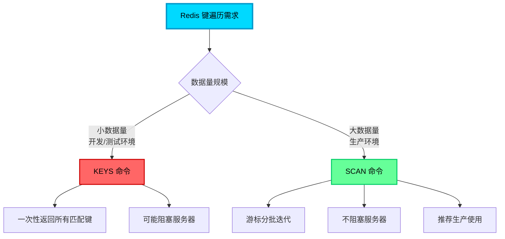

import PaidCTA from '@site/src/components/PaidCTA';

# Redis操作最佳实践与遍历技巧

## Redis 键遍历的两种方式

在 Redis 使用过程中，我们经常需要查找或遍历符合特定模式的键。Redis 提供了两种主要的遍历方式：`KEYS` 命令和 `SCAN` 命令，它们在性能和使用场景上有着显著差异。



## KEYS 命令：简单但危险

### 基本使用

`KEYS` 命令用于查找所有匹配给定模式（pattern）的键，语法简洁直观：

```bash
# 查找所有键
KEYS *

# 查找所有用户相关的键
KEYS user:*

# 查找所有订单键（前缀 order:）
KEYS order:*

# 使用通配符：? 代表单个字符
KEYS user:100?

# 使用通配符：[] 代表字符集
KEYS user:100[1-5]
```

### Java 实现示例

<PaidCTA />