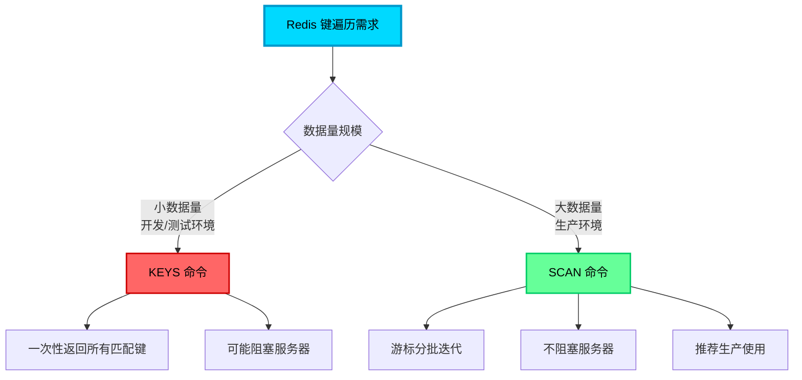
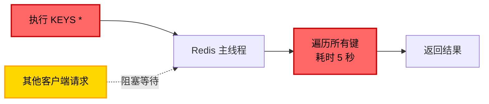
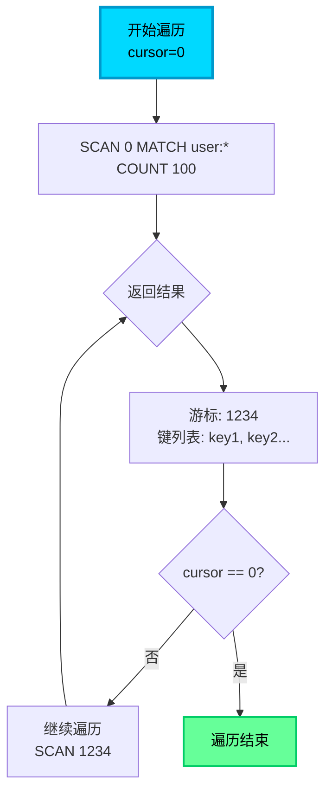

## Redis 键遍历的两种方式

在 Redis 使用过程中，我们经常需要查找或遍历符合特定模式的键。Redis 提供了两种主要的遍历方式：`KEYS` 命令和 `SCAN` 命令，它们在性能和使用场景上有着显著差异。



## KEYS 命令：简单但危险

### 基本使用

`KEYS` 命令用于查找所有匹配给定模式（pattern）的键，语法简洁直观：

```bash
# 查找所有键
KEYS *

# 查找所有用户相关的键
KEYS user:*

# 查找所有订单键（前缀 order:）
KEYS order:*

# 使用通配符：? 代表单个字符
KEYS user:100?

# 使用通配符：[] 代表字符集
KEYS user:100[1-5]
```

### Java 实现示例

```java
/**
 * 使用 KEYS 命令遍历键
 */
public class RedisKeysExample {
    
    private JedisCluster jedis;
    
    /**
     * 查找所有匹配的键（仅适用于开发环境）
     */
    public Set<String> findKeysByPattern(String pattern) {
        // 获取所有匹配的键
        Set<String> keys = jedis.keys(pattern);
        
        System.out.println("找到 " + keys.size() + " 个匹配的键");
        
        for (String key : keys) {
            System.out.println(key);
        }
        
        return keys;
    }
    
    /**
     * 批量删除缓存（危险操作，生产环境禁用）
     */
    @Deprecated
    public void deleteKeysByPattern(String pattern) {
        Set<String> keys = jedis.keys(pattern);
        
        if (!keys.isEmpty()) {
            // 批量删除
            jedis.del(keys.toArray(new String[0]));
            System.out.println("已删除 " + keys.size() + " 个键");
        }
    }
}
```

### KEYS 命令的致命缺陷

**阻塞风险：**`KEYS` 命令会一次性遍历 Redis 的所有键，在包含大量键的数据库中，这个操作可能耗时数秒甚至数十秒，期间会**完全阻塞 Redis 服务器**，导致所有其他请求无法响应。



**场景示例：**
- 数据库包含 1000 万个键
- 执行 `KEYS user:*` 需要扫描全部键，耗时约 5-10 秒
- 期间所有读写请求全部阻塞，系统瞬间不可用

**适用场景（仅限）：**
- 开发和测试环境调试
- 数据量极小（< 1000 个键）的场景
- 必须确保不会影响业务的临时操作

## SCAN 命令：生产环境的正确选择

### 核心特性

`SCAN` 命令采用游标（cursor）机制，以增量迭代的方式分批次返回匹配的键，具有以下关键特性：

1. **渐进式遍历**：每次只返回少量键，不会阻塞服务器
2. **游标状态**：通过游标记录遍历位置，支持断点续传
3. **遍历保证**：确保在遍历过程中一直存在的键一定会被返回（但可能重复）
4. **性能友好**：对服务器性能影响极小，适合生产环境

### 命令语法

```bash
SCAN cursor [MATCH pattern] [COUNT count]

# cursor: 游标位置（首次为 0，后续使用上次返回的游标）
# MATCH: 可选的模式匹配
# COUNT: 建议每次返回的键数量（实际可能不同）
```

### 工作流程



### Java 实现示例

```java
/**
 * 使用 SCAN 命令安全遍历键
 */
public class RedisScanExample {
    
    private JedisCluster jedis;
    
    /**
     * 扫描所有匹配的键（生产环境推荐）
     */
    public Set<String> scanKeys(String pattern) {
        Set<String> allKeys = new HashSet<>();
        
        // 游标初始值为 "0"
        String cursor = ScanParams.SCAN_POINTER_START;
        
        // 设置扫描参数
        ScanParams scanParams = new ScanParams()
            .match(pattern)     // 匹配模式
            .count(100);        // 每次建议返回的数量
        
        do {
            // 执行 SCAN 命令
            ScanResult<String> scanResult = jedis.scan(cursor, scanParams);
            
            // 获取本次返回的键
            List<String> keys = scanResult.getResult();
            allKeys.addAll(keys);
            
            // 更新游标
            cursor = scanResult.getCursor();
            
            System.out.println("本次扫描返回 " + keys.size() + " 个键，游标: " + cursor);
            
        } while (!"0".equals(cursor));  // 游标为 0 表示遍历结束
        
        System.out.println("总共找到 " + allKeys.size() + " 个匹配的键");
        return allKeys;
    }
    
    /**
     * 流式处理键（边扫描边处理，节省内存）
     */
    public void scanAndProcess(String pattern, Consumer<String> processor) {
        String cursor = ScanParams.SCAN_POINTER_START;
        ScanParams scanParams = new ScanParams().match(pattern).count(100);
        
        int totalProcessed = 0;
        
        do {
            ScanResult<String> scanResult = jedis.scan(cursor, scanParams);
            List<String> keys = scanResult.getResult();
            
            // 立即处理每个键（不存储到内存）
            for (String key : keys) {
                processor.accept(key);
                totalProcessed++;
            }
            
            cursor = scanResult.getCursor();
            
        } while (!"0".equals(cursor));
        
        System.out.println("总共处理 " + totalProcessed + " 个键");
    }
    
    /**
     * 批量删除键（安全版本）
     */
    public long deleteKeysByPattern(String pattern) {
        AtomicLong deletedCount = new AtomicLong(0);
        
        scanAndProcess(pattern, key -> {
            jedis.del(key);
            deletedCount.incrementAndGet();
            
            // 每删除 100 个键输出一次进度
            if (deletedCount.get() % 100 == 0) {
                System.out.println("已删除 " + deletedCount.get() + " 个键");
            }
        });
        
        return deletedCount.get();
    }
}
```

### 实战应用场景

**1. 清理过期缓存**

```java
/**
 * 清理所有用户缓存
 */
public void cleanUserCache() {
    RedisScanExample scanner = new RedisScanExample();
    
    // 扫描并删除所有用户缓存键
    long deletedCount = scanner.deleteKeysByPattern("cache:user:*");
    
    System.out.println("清理完成，共删除 " + deletedCount + " 个用户缓存");
}
```

**2. 统计键的分布情况**

```java
/**
 * 统计不同前缀的键数量
 */
public Map<String, Long> analyzeKeyDistribution() {
    Map<String, Long> distribution = new HashMap<>();
    
    scanAndProcess("*", key -> {
        // 提取键的前缀（以 : 分隔）
        String prefix = key.contains(":") ? key.split(":")[0] : "no-prefix";
        distribution.merge(prefix, 1L, Long::sum);
    });
    
    // 输出统计结果
    distribution.forEach((prefix, count) -> 
        System.out.println(prefix + ": " + count + " 个键")
    );
    
    return distribution;
}
```

**3. 检查键的 TTL 分布**

```java
/**
 * 分析键的过期时间分布
 */
public void analyzeTTLDistribution(String pattern) {
    Map<String, AtomicInteger> ttlRanges = new HashMap<>();
    ttlRanges.put("永久", new AtomicInteger(0));
    ttlRanges.put("< 1小时", new AtomicInteger(0));
    ttlRanges.put("1-24小时", new AtomicInteger(0));
    ttlRanges.put("> 24小时", new AtomicInteger(0));
    
    scanAndProcess(pattern, key -> {
        Long ttl = jedis.ttl(key);
        
        if (ttl == -1) {
            ttlRanges.get("永久").incrementAndGet();
        } else if (ttl < 3600) {
            ttlRanges.get("< 1小时").incrementAndGet();
        } else if (ttl < 86400) {
            ttlRanges.get("1-24小时").incrementAndGet();
        } else {
            ttlRanges.get("> 24小时").incrementAndGet();
        }
    });
    
    ttlRanges.forEach((range, count) -> 
        System.out.println(range + ": " + count.get() + " 个键")
    );
}
```

### SCAN 命令的注意事项

1. **COUNT 参数是建议值**
   - 实际返回数量可能多于或少于 COUNT 值
   - 仅用于控制每次扫描的工作量，不是精确值

2. **可能返回重复键**
   - 在遍历期间如果发生了 rehash，某些键可能被多次返回
   - 应用层需要去重处理

3. **遍历顺序不确定**
   - 不保证按字典序或插入顺序返回
   - 不要依赖返回的顺序

4. **遍历期间的一致性**
   - SCAN 不保证快照一致性
   - 遍历中新增或删除的键可能出现或不出现在结果中

## KEYS vs SCAN 对比

| 特性 | KEYS | SCAN |
|------|------|------|
| **性能影响** | 阻塞主线程，生产环境禁用 | 渐进式，不阻塞 |
| **遍历保证** | 一次性返回所有匹配键 | 分批返回，保证遍历完整性 |
| **内存占用** | 大量键时占用内存高 | 分批返回，内存友好 |
| **复杂度** | O(N) 一次性执行完 | O(N) 分多次执行 |
| **适用场景** | 开发/测试环境 | 生产环境 |
| **重复问题** | 无重复 | 可能重复，需去重 |

## Redis 操作最佳实践

### 键命名规范

**推荐命名方式：**
```
业务模块:对象类型:对象ID:属性
```

```java
// 好的命名示例
"user:profile:10001"              // 用户资料
"order:detail:202501010001"       // 订单详情
"product:stock:50001"             // 商品库存
"cache:api:getUserInfo:10001"    // 接口缓存

// 不好的命名示例
"u10001"                          // 语义不明
"userprofile10001"                // 难以解析
"user_profile_10001"              // 不推荐下划线
```

**命名最佳实践：**
1. 使用冒号 `:` 作为分隔符（便于 SCAN 匹配）
2. 保持命名层次清晰，便于管理和统计
3. 避免使用特殊字符和空格
4. 长度适中，避免过长的键名占用内存

### 避免使用危险命令

```java
/**
 * 生产环境禁用的命令
 */
public class DangerousCommands {
    
    // ❌ 禁止：清空所有数据库
    // jedis.flushAll();
    
    // ❌ 禁止：清空当前数据库
    // jedis.flushDB();
    
    // ❌ 禁止：遍历所有键（大数据量时）
    // Set<String> keys = jedis.keys("*");
    
    // ✅ 推荐：使用 SCAN 代替 KEYS
    public void safeKeyTraversal() {
        String cursor = "0";
        ScanParams params = new ScanParams().count(100);
        
        do {
            ScanResult<String> result = jedis.scan(cursor, params);
            cursor = result.getCursor();
            // 处理返回的键
        } while (!"0".equals(cursor));
    }
}
```

### 合理设置过期时间

```java
/**
 * 过期时间最佳实践
 */
public class TTLBestPractices {
    
    private JedisCluster jedis;
    
    /**
     * ✅ 推荐：始终设置过期时间，避免内存泄漏
     */
    public void cacheWithExpire(String key, String value) {
        // 缓存1小时
        jedis.setex(key, 3600, value);
    }
    
    /**
     * ✅ 推荐：添加随机时间，避免缓存雪崩
     */
    public void cacheWithRandomExpire(String key, String value) {
        // 基础过期时间 + 随机偏移（0-300秒）
        int baseExpire = 3600;
        int randomOffset = ThreadLocalRandom.current().nextInt(300);
        
        jedis.setex(key, baseExpire + randomOffset, value);
    }
    
    /**
     * ✅ 推荐：业务数据设置合理的过期时间
     */
    public void setReasonableTTL() {
        // 用户会话：2小时
        jedis.setex("session:10001", 7200, "session-data");
        
        // 短信验证码：5分钟
        jedis.setex("sms:code:13800138000", 300, "123456");
        
        // 热点数据：24小时
        jedis.setex("hot:product:50001", 86400, "product-info");
    }
    
    /**
     * ❌ 避免：过期时间过短导致频繁查询数据库
     */
    public void tooShortTTL() {
        // 不推荐：10秒过期，缓存命中率低
        jedis.setex("cache:user:10001", 10, "user-data");
    }
    
    /**
     * ❌ 避免：过期时间过长占用内存
     */
    public void tooLongTTL() {
        // 不推荐：临时数据设置30天过期
        jedis.setex("temp:data:xxx", 2592000, "temp-data");
    }
}
```

### 避免大 Key 问题

```java
/**
 * 大 Key 处理最佳实践
 */
public class BigKeyPractices {
    
    private JedisCluster jedis;
    
    /**
     * ❌ 避免：单个 String 存储大量数据
     */
    public void badLargeString() {
        // 不推荐：存储 10MB 的 JSON 字符串
        String largeJson = generateLargeJson();  // 10MB
        jedis.set("user:10001:all-data", largeJson);
    }
    
    /**
     * ✅ 推荐：使用 Hash 拆分存储
     */
    public void goodHashStorage() {
        // 推荐：按字段拆分存储
        Map<String, String> userData = new HashMap<>();
        userData.put("name", "张三");
        userData.put("age", "28");
        userData.put("email", "zhangsan@example.com");
        userData.put("phone", "13800138000");
        
        jedis.hmset("user:10001:profile", userData);
        
        // 按需获取部分字段（节省带宽）
        String name = jedis.hget("user:10001:profile", "name");
    }
    
    /**
     * ❌ 避免：List/Set 包含大量元素
     */
    public void badLargeCollection() {
        // 不推荐：单个 List 存储100万条数据
        for (int i = 0; i < 1000000; i++) {
            jedis.lpush("user:orders", "order-" + i);
        }
    }
    
    /**
     * ✅ 推荐：分桶存储
     */
    public void goodBucketStorage() {
        // 推荐：按时间或范围分桶
        int bucketSize = 1000;
        for (int i = 0; i < 1000000; i++) {
            int bucketId = i / bucketSize;
            jedis.lpush("user:orders:bucket:" + bucketId, "order-" + i);
        }
    }
}
```

### Lua 脚本使用规范

```java
/**
 * Lua 脚本最佳实践
 */
public class LuaScriptPractices {
    
    private JedisCluster jedis;
    
    /**
     * ✅ 推荐：保证原子性的操作使用 Lua
     */
    public boolean atomicStockDeduction(String productId, int quantity) {
        String luaScript = 
            "local stock = redis.call('GET', KEYS[1]) " +
            "if tonumber(stock) >= tonumber(ARGV[1]) then " +
            "    redis.call('DECRBY', KEYS[1], ARGV[1]) " +
            "    return 1 " +
            "else " +
            "    return 0 " +
            "end";
        
        Object result = jedis.eval(
            luaScript,
            Collections.singletonList("stock:" + productId),
            Collections.singletonList(String.valueOf(quantity))
        );
        
        return "1".equals(result.toString());
    }
    
    /**
     * ❌ 避免：Lua 脚本中的无限循环
     */
    public void dangerousInfiniteLoop() {
        String badScript = 
            "while true do " +
            "    redis.call('GET', 'some-key') " +  // 死循环！
            "end";
        
        // 这会阻塞 Redis 主线程，导致服务不可用
        // jedis.eval(badScript);
    }
    
    /**
     * ✅ 推荐：控制 Lua 脚本的复杂度
     */
    public void simpleLuaScript() {
        // Lua 脚本应保持简单，避免复杂计算
        String goodScript = 
            "local value = redis.call('GET', KEYS[1]) " +
            "if value then " +
            "    return redis.call('INCR', KEYS[1]) " +
            "else " +
            "    redis.call('SET', KEYS[1], '1') " +
            "    return 1 " +
            "end";
        
        jedis.eval(goodScript, Collections.singletonList("counter:api"));
    }
}
```

### 使用 Hash 减少内存和网络开销

```java
/**
 * Hash 数据结构最佳实践
 */
public class HashBestPractices {
    
    private JedisCluster jedis;
    
    /**
     * ❌ 不推荐：多个 String 存储对象属性
     */
    public void badMultipleStrings() {
        jedis.set("user:10001:name", "张三");
        jedis.set("user:10001:age", "28");
        jedis.set("user:10001:email", "zhangsan@example.com");
        
        // 缺点：
        // 1. 占用更多内存（每个键都有独立的元数据）
        // 2. 无法原子更新多个字段
        // 3. 获取完整对象需要多次网络请求
    }
    
    /**
     * ✅ 推荐：使用 Hash 存储对象
     */
    public void goodHashStorage() {
        Map<String, String> user = new HashMap<>();
        user.put("name", "张三");
        user.put("age", "28");
        user.put("email", "zhangsan@example.com");
        
        jedis.hmset("user:10001", user);
        
        // 优点：
        // 1. 内存占用更少（共享一个键的元数据）
        // 2. 支持部分字段更新（HSET）
        // 3. 一次网络请求获取多个字段（HMGET）
    }
    
    /**
     * ✅ Hash 支持部分更新，减少网络传输
     */
    public void partialUpdate() {
        // 只更新邮箱字段
        jedis.hset("user:10001", "email", "newemail@example.com");
        
        // 如果用 String 存储整个对象，需要：
        // 1. GET 完整对象
        // 2. 反序列化
        // 3. 修改邮箱
        // 4. 序列化
        // 5. SET 完整对象
    }
}
```

### 持久化策略选择

```bash
# redis.conf 配置建议

# 对数据可靠性要求高的场景
appendonly yes
appendfsync everysec  # 每秒同步一次（性能与可靠性平衡）

# 对性能要求极高，可接受少量数据丢失
save 900 1
save 300 10
save 60 10000
```

### 高可用架构选择

```java
/**
 * 高可用方案选择
 */
public class HighAvailabilityChoice {
    
    /**
     * 场景1：小规模，读多写少
     * 推荐：主从 + Sentinel
     */
    public void masterSlaveWithSentinel() {
        // 1 主 + 2 从 + 3 Sentinel
        // 优点：配置简单，故障自动切换
        // 适用：QPS < 10万，数据量 < 50GB
    }
    
    /**
     * 场景2：大规模，高并发
     * 推荐：Redis Cluster
     */
    public void redisCluster() {
        // 3主3从集群
        // 优点：水平扩展，支持海量数据
        // 适用：QPS > 10万，数据量 > 50GB
    }
    
    /**
     * 场景3：超大规模
     * 推荐：Redis Cluster + 读写分离
     */
    public void clusterWithReadWriteSplit() {
        // 集群 + 从节点分担读流量
        // 优点：最大化吞吐量
        // 适用：QPS > 100万
    }
}
```

## Redis 操作规范总结

### 禁止清单（生产环境）

1. ❌ **KEYS** 命令（大数据量时）
2. ❌ **FLUSHALL / FLUSHDB** 命令
3. ❌ 不设置过期时间的缓存数据
4. ❌ 单个键存储超大数据（> 10MB）
5. ❌ Lua 脚本中的无限循环或复杂计算
6. ❌ 在 Redis 中执行重计算逻辑

### 推荐清单

1. ✅ 使用 **SCAN** 代替 KEYS
2. ✅ 始终设置合理的过期时间
3. ✅ 使用 **Hash** 存储对象，减少内存开销
4. ✅ 大 Key 拆分存储（分桶或分字段）
5. ✅ 使用 **Lua 脚本**保证原子性操作
6. ✅ 合理配置持久化策略（RDB + AOF）
7. ✅ 根据规模选择高可用方案（Sentinel / Cluster）
8. ✅ 使用连接池管理连接（JedisPool / Lettuce）
9. ✅ 监控关键指标（内存、QPS、慢查询）
10. ✅ 定期清理过期和无用数据

## 总结

Redis 的高效使用依赖于对命令特性的深刻理解和规范操作：

- **键遍历**：生产环境必须使用 `SCAN`，避免 `KEYS` 导致的阻塞风险
- **命名规范**：清晰的命名层次便于管理和统计
- **过期策略**：合理的 TTL 设置避免内存泄漏和缓存雪崩
- **数据结构选择**：使用 Hash 减少内存和网络开销
- **原子操作**：善用 Lua 脚本保证业务一致性
- **架构选型**：根据业务规模选择合适的高可用方案

遵循这些最佳实践，能够最大程度发挥 Redis 的性能优势，同时保障系统的稳定性和可维护性。
