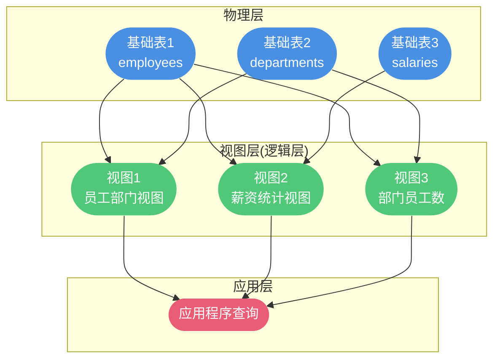
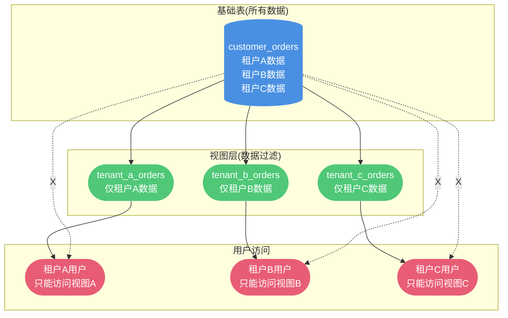
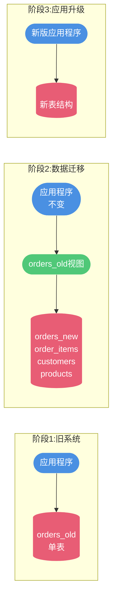

# Oracle视图与数据安全

## 视图技术概述

视图(View)是Oracle数据库中的一个重要特性,它提供了一种虚拟表的机制,基于一个或多个实际表的查询结果构建而成。理解视图的本质和应用场景,对于构建安全、灵活的数据库应用至关重要。

### 视图的本质

视图并非物理存储的实体表,而是一个**存储在数据库中的查询语句**,每次访问视图时,Oracle会动态执行这个查询并返回结果。



**视图的核心特征:**

1. **逻辑存储**:只存储定义(SQL语句),不存储数据
2. **动态计算**:每次查询时实时执行
3. **依赖基表**:基于一个或多个实际表构建
4. **透明访问**:应用层可以像查询普通表一样查询视图

### 视图与表的区别

| 特性 | 物理表(Table) | 视图(View) |
|-----|-------------|-----------|
| 数据存储 | 物理存储在磁盘 | 不存储数据,只存储定义 |
| 空间占用 | 占用存储空间 | 仅占用少量元数据空间 |
| 查询性能 | 直接读取数据 | 需要执行查询语句 |
| 数据更新 | 直接更新 | 有条件限制 |
| 使用场景 | 存储实际数据 | 简化查询、权限控制 |

## 视图的核心价值

### 数据安全与权限控制

视图的首要价值在于实现**细粒度的数据访问控制**,让不同用户只能看到授权范围内的数据。

**业务场景1:多租户系统的数据隔离**

假设有一个SaaS平台,为多个企业客户提供服务,所有数据存储在同一个数据库中,通过租户ID进行逻辑隔离。

**基础表结构:**

```sql
-- 客户订单表(包含所有租户的数据)
CREATE TABLE customer_orders (
  order_id NUMBER PRIMARY KEY,
  tenant_id NUMBER NOT NULL,      -- 租户ID
  customer_name VARCHAR2(100),
  order_amount NUMBER(10,2),
  order_date DATE,
  order_status VARCHAR2(20),
  payment_method VARCHAR2(50),
  shipping_address VARCHAR2(500)
);
```

**为不同租户创建专属视图:**

```sql
-- 为租户A(tenant_id=1001)创建视图
CREATE OR REPLACE VIEW tenant_a_orders AS
SELECT 
  order_id,
  customer_name,
  order_amount,
  order_date,
  order_status
FROM customer_orders
WHERE tenant_id = 1001;

-- 为租户B(tenant_id=1002)创建视图
CREATE OR REPLACE VIEW tenant_b_orders AS
SELECT 
  order_id,
  customer_name,
  order_amount,
  order_date,
  order_status
FROM customer_orders
WHERE tenant_id = 1002;
```

**权限分配:**

```sql
-- 为租户A的用户授权
GRANT SELECT ON tenant_a_orders TO user_tenant_a;

-- 为租户B的用户授权
GRANT SELECT ON tenant_b_orders TO user_tenant_b;

-- 不授予基表权限,确保租户无法访问其他租户数据
REVOKE ALL ON customer_orders FROM user_tenant_a;
REVOKE ALL ON customer_orders FROM user_tenant_b;
```

**数据隔离效果可视化:**



**业务场景2:敏感信息脱敏**

在实际应用中,某些字段包含敏感信息(如身份证号、手机号、银行卡号),需要对不同角色的用户进行脱敏展示。

```sql
-- 员工信息表(包含敏感数据)
CREATE TABLE employees (
  employee_id NUMBER PRIMARY KEY,
  employee_name VARCHAR2(100),
  id_card VARCHAR2(18),           -- 身份证号
  mobile_phone VARCHAR2(11),      -- 手机号
  bank_account VARCHAR2(20),      -- 银行账号
  salary NUMBER(10,2),            -- 薪资
  department_id NUMBER
);

-- 为普通HR创建脱敏视图
CREATE OR REPLACE VIEW hr_employee_view AS
SELECT 
  employee_id,
  employee_name,
  -- 身份证号脱敏:保留前6位和后4位
  SUBSTR(id_card, 1, 6) || '********' || SUBSTR(id_card, -4) AS id_card,
  -- 手机号脱敏:保留前3位和后4位
  SUBSTR(mobile_phone, 1, 3) || '****' || SUBSTR(mobile_phone, -4) AS mobile_phone,
  -- 银行卡号脱敏:只显示后4位
  '****************' || SUBSTR(bank_account, -4) AS bank_account,
  -- 薪资不显示
  NULL AS salary,
  department_id
FROM employees;

-- 为财务部门创建完整视图(包含薪资)
CREATE OR REPLACE VIEW finance_employee_view AS
SELECT 
  employee_id,
  employee_name,
  SUBSTR(id_card, 1, 6) || '********' || SUBSTR(id_card, -4) AS id_card,
  SUBSTR(mobile_phone, 1, 3) || '****' || SUBSTR(mobile_phone, -4) AS mobile_phone,
  bank_account,  -- 财务可见完整银行账号
  salary,        -- 财务可见薪资
  department_id
FROM employees;
```

**脱敏效果对比:**

| 原始数据 | 普通HR视图 | 财务视图 |
|---------|-----------|---------|
| 身份证:110101199001011234 | 110101********1234 | 110101********1234 |
| 手机号:13812345678 | 138****5678 | 138****5678 |
| 银行卡:6222021234567890 | ****************7890 | 6222021234567890 |
| 薪资:15000 | NULL | 15000 |

### 数据独立性

视图提供了应用层与数据存储层之间的**抽象隔离层**,当底层表结构发生变化时,只需调整视图定义,无需修改应用程序代码。

**业务场景:系统重构中的平滑过渡**

假设在系统升级过程中,需要将原来的单表拆分为多表,以提高性能和扩展性。

**原有表结构:**

```sql
-- 原有的订单表(包含所有信息)
CREATE TABLE orders_old (
  order_id NUMBER PRIMARY KEY,
  customer_id NUMBER,
  customer_name VARCHAR2(100),
  customer_phone VARCHAR2(20),
  product_id NUMBER,
  product_name VARCHAR2(200),
  unit_price NUMBER(10,2),
  quantity NUMBER,
  total_amount NUMBER(10,2),
  order_date DATE,
  order_status VARCHAR2(20)
);
```

**重构后的表结构:**

```sql
-- 订单主表
CREATE TABLE orders_new (
  order_id NUMBER PRIMARY KEY,
  customer_id NUMBER,
  order_date DATE,
  order_status VARCHAR2(20),
  total_amount NUMBER(10,2)
);

-- 订单明细表
CREATE TABLE order_items (
  item_id NUMBER PRIMARY KEY,
  order_id NUMBER,
  product_id NUMBER,
  unit_price NUMBER(10,2),
  quantity NUMBER
);

-- 客户信息表
CREATE TABLE customers (
  customer_id NUMBER PRIMARY KEY,
  customer_name VARCHAR2(100),
  customer_phone VARCHAR2(20)
);

-- 商品信息表
CREATE TABLE products (
  product_id NUMBER PRIMARY KEY,
  product_name VARCHAR2(200)
);
```

**创建兼容性视图:**

```sql
-- 创建与旧表结构完全兼容的视图
CREATE OR REPLACE VIEW orders_old AS
SELECT 
  o.order_id,
  o.customer_id,
  c.customer_name,
  c.customer_phone,
  oi.product_id,
  p.product_name,
  oi.unit_price,
  oi.quantity,
  o.total_amount,
  o.order_date,
  o.order_status
FROM orders_new o
INNER JOIN order_items oi ON o.order_id = oi.order_id
INNER JOIN customers c ON o.customer_id = c.customer_id
INNER JOIN products p ON oi.product_id = p.product_id;
```

**平滑过渡流程:**



**优势:**
- 应用代码无需立即修改
- 数据迁移和应用升级可以分阶段进行
- 降低系统重构风险
- 支持新老系统共存

### 简化复杂查询

视图可以将复杂的多表关联查询封装成简单的单表查询,提高开发效率和代码可读性。

**业务场景:销售数据分析视图**

```sql
-- 创建综合销售分析视图
CREATE OR REPLACE VIEW sales_analysis_view AS
SELECT 
  o.order_id,
  o.order_date,
  c.customer_id,
  c.customer_name,
  c.customer_level,        -- 客户等级
  r.region_name,           -- 销售区域
  p.product_name,
  p.category_name,         -- 产品类别
  oi.quantity,
  oi.unit_price,
  oi.quantity * oi.unit_price AS item_amount,
  o.total_amount AS order_total,
  -- 计算字段
  CASE 
    WHEN c.customer_level = 'VIP' THEN oi.quantity * oi.unit_price * 0.8
    WHEN c.customer_level = 'GOLD' THEN oi.quantity * oi.unit_price * 0.9
    ELSE oi.quantity * oi.unit_price
  END AS discounted_amount,
  -- 时间维度
  TO_CHAR(o.order_date, 'YYYY') AS order_year,
  TO_CHAR(o.order_date, 'Q') AS order_quarter,
  TO_CHAR(o.order_date, 'MM') AS order_month
FROM orders o
INNER JOIN order_items oi ON o.order_id = oi.order_id
INNER JOIN customers c ON o.customer_id = c.customer_id
INNER JOIN regions r ON c.region_id = r.region_id
INNER JOIN products p ON oi.product_id = p.product_id
WHERE o.order_status = 'COMPLETED';
```

**使用视图简化查询:**

```sql
-- 原本需要多表关联的复杂查询,现在变得简单
-- 查询1:按月统计各区域销售额
SELECT 
  order_year,
  order_month,
  region_name,
  SUM(discounted_amount) AS monthly_sales
FROM sales_analysis_view
GROUP BY order_year, order_month, region_name
ORDER BY order_year, order_month, monthly_sales DESC;

-- 查询2:分析VIP客户的购买偏好
SELECT 
  category_name,
  COUNT(DISTINCT customer_id) AS customer_count,
  SUM(quantity) AS total_quantity,
  SUM(discounted_amount) AS total_amount
FROM sales_analysis_view
WHERE customer_level = 'VIP'
GROUP BY category_name
ORDER BY total_amount DESC;

-- 查询3:按季度对比销售业绩
SELECT 
  order_year,
  order_quarter,
  SUM(discounted_amount) AS quarterly_sales
FROM sales_analysis_view
GROUP BY order_year, order_quarter
ORDER BY order_year, order_quarter;
```

## 视图的使用方法

### 创建视图

**基础语法:**

```sql
CREATE [OR REPLACE] [FORCE|NOFORCE] VIEW view_name AS
SELECT statement
[WITH CHECK OPTION]
[WITH READ ONLY];
```

**参数说明:**
- `OR REPLACE`:如果视图已存在,则替换
- `FORCE`:强制创建(即使基表不存在)
- `NOFORCE`:基表必须存在(默认)
- `WITH CHECK OPTION`:限制DML操作必须满足视图的WHERE条件
- `WITH READ ONLY`:只读视图,不允许DML操作

**示例1:创建简单视图**

```sql
-- 创建员工部门视图
CREATE OR REPLACE VIEW emp_dept_view AS
SELECT 
  e.employee_id,
  e.employee_name,
  e.job_title,
  e.hire_date,
  d.department_name,
  d.department_location
FROM employees e
INNER JOIN departments d ON e.department_id = d.department_id;
```

**示例2:创建带条件的视图**

```sql
-- 创建高薪员工视图(薪资>10000)
CREATE OR REPLACE VIEW high_salary_emp_view AS
SELECT 
  employee_id,
  employee_name,
  salary,
  department_id
FROM employees
WHERE salary > 10000
WITH CHECK OPTION;  -- 确保通过视图插入/更新的数据也满足salary>10000
```

**示例3:创建只读视图**

```sql
-- 创建销售统计只读视图
CREATE OR REPLACE VIEW sales_summary_view AS
SELECT 
  product_id,
  product_name,
  COUNT(*) AS order_count,
  SUM(quantity) AS total_quantity,
  SUM(amount) AS total_amount
FROM order_items
GROUP BY product_id, product_name
WITH READ ONLY;  -- 禁止通过视图修改数据
```

### 查询视图

查询视图与查询普通表完全相同:

```sql
-- 查询员工部门视图
SELECT * FROM emp_dept_view
WHERE department_name = '技术部';

-- 带排序的查询
SELECT employee_name, salary
FROM high_salary_emp_view
ORDER BY salary DESC;

-- 分组统计
SELECT department_name, COUNT(*) AS emp_count
FROM emp_dept_view
GROUP BY department_name;
```

### 更新视图

并非所有视图都可以更新,只有满足以下条件的视图才支持DML操作:

**可更新视图的条件:**
1. 视图基于单个基表
2. 不包含聚合函数(SUM、COUNT等)
3. 不包含GROUP BY、DISTINCT
4. 不包含集合运算符(UNION、INTERSECT等)

**可更新视图示例:**

```sql
-- 创建可更新视图
CREATE OR REPLACE VIEW active_employees AS
SELECT employee_id, employee_name, salary, department_id
FROM employees
WHERE status = 'ACTIVE';

-- 通过视图插入数据
INSERT INTO active_employees (employee_id, employee_name, salary, department_id)
VALUES (10001, '张伟', 12000, 101);

-- 通过视图更新数据
UPDATE active_employees
SET salary = 13000
WHERE employee_id = 10001;

-- 通过视图删除数据
DELETE FROM active_employees
WHERE employee_id = 10001;
```

### 删除视图

```sql
-- 删除视图
DROP VIEW emp_dept_view;

-- 删除视图(如果存在)
DROP VIEW IF EXISTS sales_summary_view;
```

## 视图的性能考量

### 性能优势

**1. 执行计划优化**

Oracle优化器会将视图定义与外部查询合并,生成最优的执行计划。

```sql
-- 查询视图
SELECT * FROM emp_dept_view
WHERE department_name = '技术部';

-- Oracle实际执行的优化后SQL
SELECT 
  e.employee_id,
  e.employee_name,
  d.department_name
FROM employees e
INNER JOIN departments d ON e.department_id = d.department_id
WHERE d.department_name = '技术部';  -- 条件下推
```

**2. 索引利用**

视图查询可以利用基表上的索引,性能不会因为使用视图而下降。

### 性能问题

**1. 复杂视图的性能开销**

包含多表关联、子查询、聚合函数的视图,每次查询都需要执行完整的计算。

**问题示例:**

```sql
-- 复杂的统计视图
CREATE VIEW complex_stats_view AS
SELECT 
  d.department_name,
  COUNT(DISTINCT e.employee_id) AS emp_count,
  AVG(e.salary) AS avg_salary,
  SUM(s.sales_amount) AS total_sales,
  (SELECT COUNT(*) FROM projects p WHERE p.dept_id = d.dept_id) AS project_count
FROM departments d
LEFT JOIN employees e ON d.dept_id = e.dept_id
LEFT JOIN sales s ON e.employee_id = s.employee_id
GROUP BY d.department_name, d.dept_id;

-- 每次查询都要执行完整的关联和聚合
SELECT * FROM complex_stats_view;
```

**解决方案:物化视图(Materialized View)**

```sql
-- 创建物化视图(实际存储查询结果)
CREATE MATERIALIZED VIEW complex_stats_mv
BUILD IMMEDIATE          -- 立即构建
REFRESH FAST ON COMMIT   -- 基表提交时快速刷新
AS
SELECT 
  d.department_name,
  COUNT(DISTINCT e.employee_id) AS emp_count,
  AVG(e.salary) AS avg_salary,
  SUM(s.sales_amount) AS total_sales
FROM departments d
LEFT JOIN employees e ON d.dept_id = e.dept_id
LEFT JOIN sales s ON e.employee_id = s.employee_id
GROUP BY d.department_name;

-- 查询物化视图(直接读取预计算结果,性能极高)
SELECT * FROM complex_stats_mv;
```

**2. 视图嵌套问题**

视图基于视图创建,形成多层嵌套,可能导致性能下降。

```sql
-- 不推荐:多层视图嵌套
CREATE VIEW level1_view AS SELECT * FROM base_table WHERE condition1;
CREATE VIEW level2_view AS SELECT * FROM level1_view WHERE condition2;
CREATE VIEW level3_view AS SELECT * FROM level2_view WHERE condition3;

-- 推荐:直接在一个视图中定义完整逻辑
CREATE VIEW optimized_view AS 
SELECT * FROM base_table 
WHERE condition1 AND condition2 AND condition3;
```

### 性能优化建议

1. **避免在视图中使用SELECT**:明确指定需要的列
2. **合理使用索引**:在基表的常用过滤字段上建立索引
3. **考虑物化视图**:对于复杂的统计查询,使用物化视图
4. **监控视图性能**:定期检查视图的执行计划
5. **避免过度嵌套**:尽量减少视图的嵌套层级

## 视图的使用限制

### 更新限制

以下类型的视图无法进行DML操作:

1. **包含聚合函数的视图**
2. **包含GROUP BY的视图**
3. **包含DISTINCT的视图**
4. **基于多表关联的视图**(部分情况)
5. **包含集合运算的视图**

### 调试和维护复杂性

**问题:**
- 视图定义复杂时,调试困难
- 性能问题排查需要分析底层SQL
- 多层嵌套视图的维护成本高

**建议:**
- 为视图添加清晰的注释
- 定期审查和优化视图定义
- 建立视图依赖关系文档

## 最佳实践总结

**1. 命名规范**
- 使用`_view`或`_v`作为视图名称后缀
- 体现视图的业务含义
- 例如:`emp_dept_view`、`sales_summary_v`

**2. 权限管理**
- 最小权限原则:只授予必要的权限
- 定期审计视图权限
- 使用角色管理视图访问权限

**3. 文档维护**
- 记录视图的创建目的
- 标注视图的依赖关系
- 更新视图时同步更新文档

**4. 性能监控**
- 定期检查视图查询性能
- 使用EXPLAIN PLAN分析执行计划
- 对于性能瓶颈,考虑改为物化视图

通过合理使用视图,可以在保证数据安全的同时,简化应用开发,提高系统的可维护性和灵活性。
