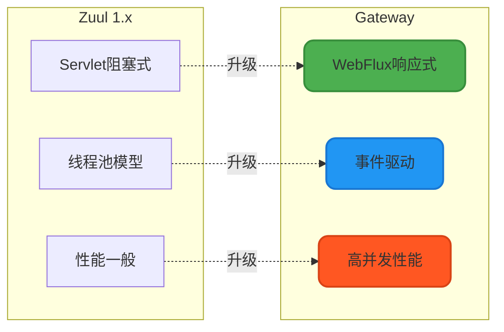
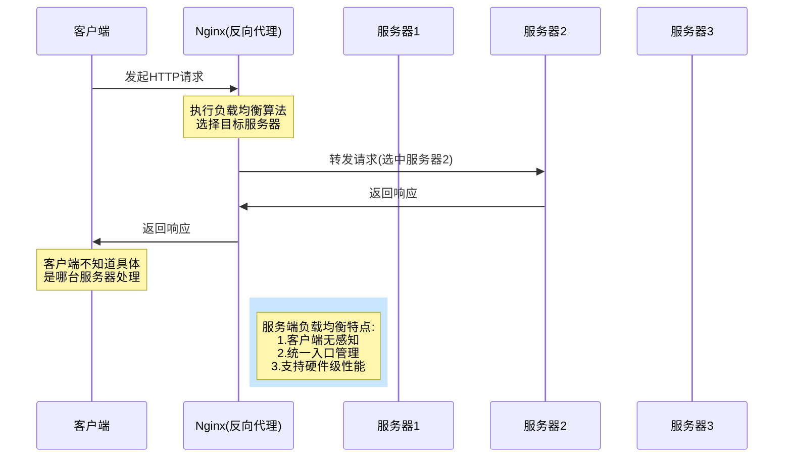
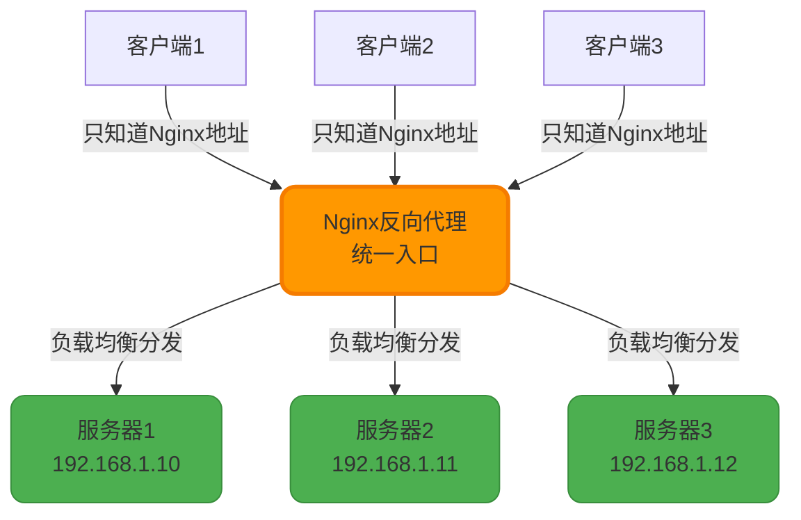
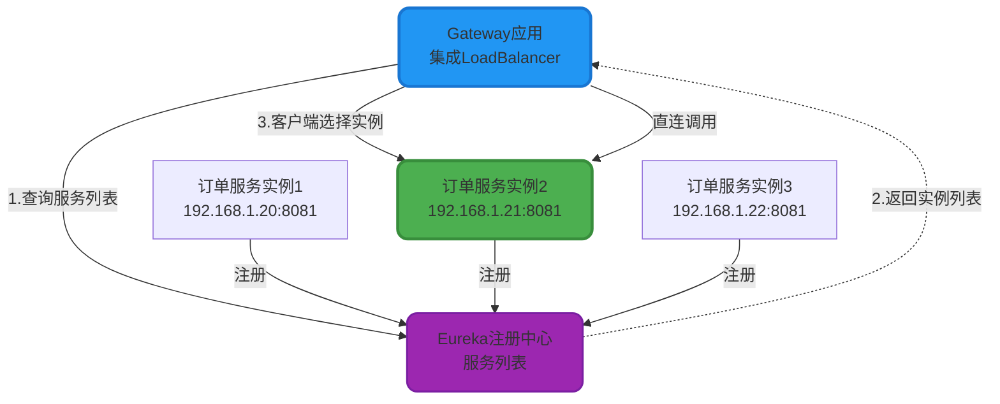
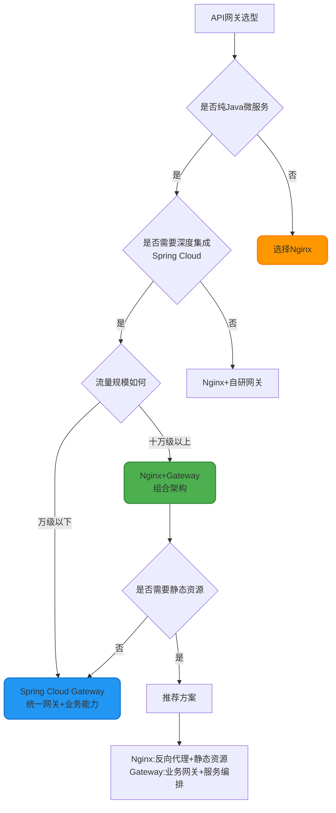
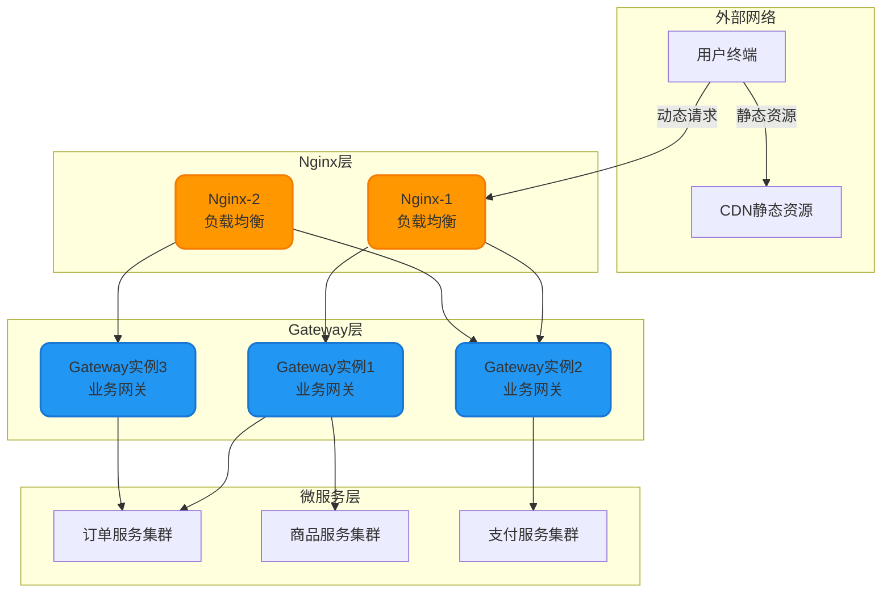

# API网关技术选型与对比

## 网关技术概述

在微服务架构中,API网关扮演着流量统一入口的关键角色。Zuul、Spring Cloud Gateway和Nginx是业界最常见的三种网关技术,它们各有特色,适用于不同的应用场景。理解它们的本质区别,对于技术选型至关重要。

**核心区别**: Zuul和Gateway属于**应用层API网关**,而Nginx是**基础设施层的反向代理服务器**。

## 三大网关技术对比矩阵

下表从多个维度详细对比三种技术的差异点:

| **对比维度** | **Nginx** | **Spring Cloud Gateway/Zuul** |
|------------|-----------|------------------------------|
| **技术定位** | 高性能Web服务器、反向代理、负载均衡器 | 微服务生态中的API网关 |
| **核心职责** | 反向代理、负载均衡、静态资源托管 | 服务路由、统一鉴权、流控熔断 |
| **微服务集成** | 通用型工具,可集成但非专为微服务设计 | 与Spring Cloud生态深度集成,开箱即用 |
| **安全能力** | SSL终端、基础限流、IP访问控制 | OAuth2/JWT认证、细粒度权限控制、API级限流 |
| **适用场景** | 静态资源CDN、负载均衡、反向代理 | 动态路由、请求转换、服务编排、统一网关 |
| **负载均衡** | 服务端负载均衡(硬件级性能) | 客户端负载均衡(需配合LoadBalancer) |
| **技术生态** | 语言无关,C语言编写 | 仅支持Java/JVM生态 |
| **性能特点** | 极高性能,单机可承载数万并发 | 性能较好,Gateway基于Reactor响应式 |
| **运维复杂度** | 配置文件管理,需独立部署 | 集成在应用中,配合配置中心动态管理 |

## Zuul与Gateway - 微服务API网关

### 技术定位与核心能力

Zuul(第一代)和Spring Cloud Gateway(第二代)都是Spring Cloud生态的官方网关解决方案,专为微服务架构设计。它们提供的核心能力包括:

**1. 智能路由**

根据请求的URL路径、请求头、参数等特征,动态将流量路由到不同的后端微服务。

```java
// Gateway路由配置示例
@Configuration
public class GatewayRouteConfig {
    
    @Bean
    public RouteLocator customRoutes(RouteLocatorBuilder builder) {
        return builder.routes()
            // 订单服务路由
            .route("order_route", r -> r
                .path("/api/orders/**")
                .and()
                .header("X-Request-Source", "mobile")
                .filters(f -> f
                    .stripPrefix(1)
                    .addRequestHeader("X-Gateway-Timestamp", 
                        String.valueOf(System.currentTimeMillis()))
                )
                .uri("lb://order-service")
            )
            // 商品服务路由 - 支持断言条件
            .route("product_route", r -> r
                .path("/api/products/**")
                .and()
                .method(HttpMethod.GET)
                .filters(f -> f
                    .rewritePath("/api/products/(?<segment>.*)", 
                        "/products/${segment}")
                )
                .uri("lb://product-service")
            )
            .build();
    }
}
```

**2. 统一鉴权**

在网关层实现认证和授权,避免每个微服务重复处理权限逻辑。

```java
/**
 * 全局JWT鉴权过滤器
 */
@Component
public class JwtAuthenticationFilter implements GlobalFilter, Ordered {
    
    @Autowired
    private JwtTokenValidator tokenValidator;
    
    private static final List<String> WHITE_LIST = Arrays.asList(
        "/api/auth/login",
        "/api/auth/register"
    );
    
    @Override
    public Mono<Void> filter(ServerWebExchange exchange, GatewayFilterChain chain) {
        String path = exchange.getRequest().getURI().getPath();
        
        // 白名单路径直接放行
        if (WHITE_LIST.stream().anyMatch(path::startsWith)) {
            return chain.filter(exchange);
        }
        
        // 提取并验证JWT令牌
        String token = extractToken(exchange.getRequest());
        if (token == null || !tokenValidator.validate(token)) {
            exchange.getResponse().setStatusCode(HttpStatus.UNAUTHORIZED);
            return exchange.getResponse().setComplete();
        }
        
        // 将用户信息传递到下游服务
        Claims claims = tokenValidator.parseToken(token);
        ServerHttpRequest mutatedRequest = exchange.getRequest()
            .mutate()
            .header("X-User-Id", claims.getSubject())
            .header("X-User-Roles", claims.get("roles", String.class))
            .build();
        
        return chain.filter(exchange.mutate().request(mutatedRequest).build());
    }
    
    private String extractToken(ServerHttpRequest request) {
        String authHeader = request.getHeaders().getFirst("Authorization");
        if (authHeader != null && authHeader.startsWith("Bearer ")) {
            return authHeader.substring(7);
        }
        return null;
    }
    
    @Override
    public int getOrder() {
        return -100; // 优先级最高
    }
}
```

**3. 流量控制**

实现限流、熔断、重试等流量治理策略。

```yaml
spring:
  cloud:
    gateway:
      routes:
        - id: payment_route
          uri: lb://payment-service
          predicates:
            - Path=/api/payment/**
          filters:
            # 限流配置 - 基于令牌桶算法
            - name: RequestRateLimiter
              args:
                redis-rate-limiter.replenishRate: 100  # 每秒生成100个令牌
                redis-rate-limiter.burstCapacity: 200   # 令牌桶容量
                key-resolver: "#{@userKeyResolver}"    # 按用户ID限流
            
            # 熔断配置
            - name: CircuitBreaker
              args:
                name: paymentCircuitBreaker
                fallbackUri: forward:/fallback/payment
                
            # 重试配置
            - name: Retry
              args:
                retries: 3
                statuses: BAD_GATEWAY,GATEWAY_TIMEOUT
                methods: GET
                backoff:
                  firstBackoff: 100ms
                  maxBackoff: 500ms
```

**4. 请求/响应转换**

修改请求头、请求体、响应内容,实现协议转换或数据脱敏。

```java
/**
 * 全局响应脱敏过滤器
 */
@Component
public class SensitiveDataMaskFilter implements GlobalFilter, Ordered {
    
    @Override
    public Mono<Void> filter(ServerWebExchange exchange, GatewayFilterChain chain) {
        ServerHttpResponse originalResponse = exchange.getResponse();
        DataBufferFactory bufferFactory = originalResponse.bufferFactory();
        
        ServerHttpResponseDecorator decoratedResponse = new ServerHttpResponseDecorator(originalResponse) {
            @Override
            public Mono<Void> writeWith(Publisher<? extends DataBuffer> body) {
                if (body instanceof Flux) {
                    Flux<? extends DataBuffer> fluxBody = (Flux<? extends DataBuffer>) body;
                    return super.writeWith(fluxBody.map(dataBuffer -> {
                        byte[] content = new byte[dataBuffer.readableByteCount()];
                        dataBuffer.read(content);
                        DataBufferUtils.release(dataBuffer);
                        
                        // 脱敏处理
                        String responseBody = new String(content, StandardCharsets.UTF_8);
                        String maskedBody = maskSensitiveData(responseBody);
                        
                        return bufferFactory.wrap(maskedBody.getBytes(StandardCharsets.UTF_8));
                    }));
                }
                return super.writeWith(body);
            }
        };
        
        return chain.filter(exchange.mutate().response(decoratedResponse).build());
    }
    
    private String maskSensitiveData(String body) {
        // 手机号脱敏: 138****5678
        body = body.replaceAll("(\\d{3})\\d{4}(\\d{4})", "$1****$2");
        // 身份证脱敏: 320102****1234
        body = body.replaceAll("(\\d{6})\\d{8}(\\d{4})", "$1********$2");
        return body;
    }
    
    @Override
    public int getOrder() {
        return -10;
    }
}
```

### Gateway与Zuul的代际差异



**Zuul 1.x**:
- 基于Servlet阻塞式API
- 一个请求占用一个线程
- 性能瓶颈在高并发场景

**Spring Cloud Gateway**:
- 基于Spring WebFlux响应式编程
- 非阻塞I/O,事件驱动模型
- 性能提升显著,官方推荐方案
- Zuul已停止维护,生产环境应使用Gateway

## Nginx - 基础设施层反向代理

### 核心能力与独特价值

Nginx是C语言编写的高性能Web服务器,具备以下独特能力:

#### 1. 反向代理

Nginx充当客户端和后端服务器之间的中间层,客户端不直接感知真实服务器的存在。

```nginx
# 反向代理配置示例
http {
    upstream backend_servers {
        # 后端服务器集群
        server 192.168.1.101:8080 weight=3;  # 权重3
        server 192.168.1.102:8080 weight=2;  # 权重2
        server 192.168.1.103:8080 weight=1;  # 权重1
        server 192.168.1.104:8080 backup;    # 备用服务器
        
        # 健康检查
        keepalive 32;
    }
    
    server {
        listen 80;
        server_name api.example.com;
        
        location /api/ {
            # 反向代理到后端集群
            proxy_pass http://backend_servers;
            
            # 传递真实客户端信息
            proxy_set_header Host $host;
            proxy_set_header X-Real-IP $remote_addr;
            proxy_set_header X-Forwarded-For $proxy_add_x_forwarded_for;
            proxy_set_header X-Forwarded-Proto $scheme;
            
            # 超时配置
            proxy_connect_timeout 5s;
            proxy_read_timeout 30s;
            proxy_send_timeout 30s;
        }
    }
}
```

**反向代理的价值**:
- 隐藏真实服务器IP,增强安全性
- 实现服务器的平滑上下线
- 统一SSL证书管理
- 缓存静态内容,减轻后端压力

#### 2. 静态资源托管

Nginx可以直接托管静态文件(HTML、CSS、JS、图片、视频等),无需经过应用服务器,极大提升访问速度。

```nginx
server {
    listen 80;
    server_name static.example.com;
    
    # 静态资源根目录
    root /var/www/static;
    
    # 图片资源
    location ~* \.(jpg|jpeg|png|gif|ico|svg)$ {
        expires 30d;                      # 浏览器缓存30天
        add_header Cache-Control "public, immutable";
        access_log off;                   # 关闭访问日志
    }
    
    # CSS和JS资源
    location ~* \.(css|js)$ {
        expires 7d;
        add_header Cache-Control "public";
        gzip on;                          # 开启压缩
        gzip_types text/css application/javascript;
    }
    
    # 视频资源 - 支持断点续传
    location ~* \.(mp4|avi|mov)$ {
        expires 365d;
        sendfile on;                      # 零拷贝技术
        tcp_nopush on;
        tcp_nodelay on;
    }
    
    # 前端单页应用
    location / {
        try_files $uri $uri/ /index.html;  # SPA路由兜底
    }
}
```

**性能优势**:
- 直接从内存或磁盘返回文件,响应速度微秒级
- 支持零拷贝(sendfile),CPU消耗极低
- 节省应用服务器资源,专注业务逻辑

#### 3. 服务端负载均衡

Nginx实现的是服务端负载均衡,支持多种算法:

```nginx
# 负载均衡算法配置
upstream app_cluster {
    # 算法1: 轮询(默认)
    # 每个请求按顺序分配到不同服务器
    
    # 算法2: 加权轮询
    server 192.168.1.10:8080 weight=5;
    server 192.168.1.11:8080 weight=3;
    server 192.168.1.12:8080 weight=2;
    
    # 算法3: IP Hash - 同一客户端固定访问同一服务器
    # ip_hash;
    
    # 算法4: 最少连接
    # least_conn;
    
    # 健康检查配置
    server 192.168.1.10:8080 max_fails=3 fail_timeout=30s;
}
```

**工作流程图**:



#### 4. 高级功能

```nginx
server {
    listen 443 ssl http2;
    server_name api.example.com;
    
    # SSL证书配置
    ssl_certificate /etc/nginx/ssl/cert.pem;
    ssl_certificate_key /etc/nginx/ssl/key.pem;
    ssl_protocols TLSv1.2 TLSv1.3;
    
    # 限流配置
    limit_req_zone $binary_remote_addr zone=api_limit:10m rate=100r/s;
    
    location /api/ {
        # 应用限流规则
        limit_req zone=api_limit burst=200 nodelay;
        
        # IP白名单
        allow 192.168.1.0/24;
        deny all;
        
        proxy_pass http://backend;
    }
    
    # 接口缓存
    location ~* ^/api/config {
        proxy_cache api_cache;
        proxy_cache_valid 200 10m;    # 成功响应缓存10分钟
        proxy_cache_key "$request_uri";
        
        proxy_pass http://backend;
    }
}
```

## Gateway与Nginx的本质区别

### 负载均衡模式差异

这是两者最核心的区别:

**Nginx - 服务端负载均衡**:



**特点**:
- 客户端只知道Nginx地址,不知道后端真实服务器
- 负载均衡逻辑在Nginx服务端执行
- 真正的反向代理能力

**LoadBalancer - 客户端负载均衡**:



**特点**:
- Gateway明确知道每个服务实例的IP地址
- 负载均衡逻辑在客户端(Gateway)执行
- 无法实现真正的反向代理

### 技术生态适配

**Gateway的局限性**:
- 仅支持Java/JVM生态
- 必须配合Spring Cloud组件使用
- 依赖注册中心(Eureka/Nacos)

**Nginx的通用性**:
- 语言无关,任何后端语言都可接入
- 独立部署,不侵入应用代码
- 无需额外的注册中心

## 技术选型决策树



### 组合使用架构

在大规模生产环境中,Nginx和Gateway常组合使用,充分发挥各自优势:



**分层职责**:

1. **CDN层**: 托管图片、CSS、JS等静态资源
2. **Nginx层**: 
   - 处理SSL卸载
   - 实现服务端负载均衡
   - 防御DDoS攻击
   - 全局限流
3. **Gateway层**:
   - 服务路由与编排
   - 业务鉴权与授权
   - API限流与熔断
   - 请求日志与监控
4. **微服务层**: 专注业务逻辑实现

### 选型建议总结

| **场景** | **推荐方案** | **理由** |
|---------|------------|---------|
| 小型Java项目 | Gateway | 配置简单,学习成本低 |
| 中型微服务 | Gateway + Nacos | 完整Spring Cloud生态 |
| 大型互联网 | Nginx + Gateway | 分层架构,性能与功能兼顾 |
| 多语言混合 | Nginx + Kong/Apisix | 支持跨语言服务 |
| 有大量静态资源 | Nginx必选 | 无可替代的静态托管能力 |
| API开放平台 | Gateway + Sentinel | 强大的流控和安全能力 |

## 实践要点

### Gateway最佳实践

```java
/**
 * Gateway生产级配置
 */
@Configuration
public class GatewayProductionConfig {
    
    /**
     * 全局过滤器执行顺序
     */
    @Bean
    public GlobalFilter customGlobalFilter() {
        return (exchange, chain) -> {
            // 1. 请求日志记录(order = -200)
            // 2. JWT鉴权(order = -100)
            // 3. 限流检查(order = -50)
            // 4. 业务过滤器(order = 0)
            // 5. 响应日志(order = 100)
            return chain.filter(exchange);
        };
    }
    
    /**
     * 优雅关闭配置
     */
    @Bean
    public GracefulShutdown gracefulShutdown() {
        return new GracefulShutdown(30); // 30秒超时
    }
    
    /**
     * 连接池配置
     */
    @Bean
    public HttpClient httpClient() {
        ConnectionProvider provider = ConnectionProvider.builder("custom")
            .maxConnections(500)              // 最大连接数
            .maxIdleTime(Duration.ofSeconds(20))
            .maxLifeTime(Duration.ofSeconds(60))
            .pendingAcquireTimeout(Duration.ofSeconds(60))
            .evictInBackground(Duration.ofSeconds(120))
            .build();
        
        return HttpClient.create(provider)
            .option(ChannelOption.CONNECT_TIMEOUT_MILLIS, 10000)
            .responseTimeout(Duration.ofSeconds(30));
    }
}
```

### Nginx性能调优

```nginx
# 主配置 - nginx.conf
user nginx;
worker_processes auto;              # 自动匹配CPU核心数
worker_rlimit_nofile 65535;         # 单进程最大文件描述符

events {
    use epoll;                      # Linux高性能事件模型
    worker_connections 10240;       # 单worker最大连接数
    multi_accept on;                # 一次接受多个连接
}

http {
    # 日志优化
    access_log /var/log/nginx/access.log main buffer=32k flush=5s;
    error_log /var/log/nginx/error.log warn;
    
    # 性能优化
    sendfile on;                    # 零拷贝
    tcp_nopush on;                  # 减少网络包数量
    tcp_nodelay on;                 # 禁用Nagle算法
    keepalive_timeout 65;           # 长连接超时
    
    # Gzip压缩
    gzip on;
    gzip_vary on;
    gzip_comp_level 6;
    gzip_types text/plain text/css application/json application/javascript;
    
    # 缓存配置
    proxy_cache_path /var/cache/nginx levels=1:2 keys_zone=api_cache:100m 
                     max_size=10g inactive=60m use_temp_path=off;
}
```

## 总结

- **Nginx**: 高性能基础设施组件,擅长静态资源、反向代理、负载均衡
- **Gateway**: Java微服务专属网关,深度集成Spring Cloud,业务能力强
- **Zuul**: 已被Gateway取代,新项目不建议使用

**生产环境推荐架构**: Nginx(入口层) + Gateway(业务网关) + 微服务,既保证了性能,又提供了丰富的业务治理能力。
