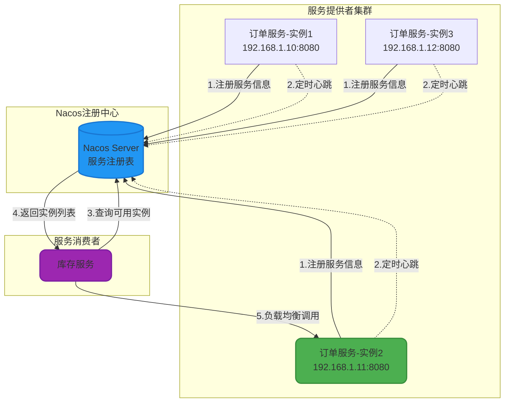
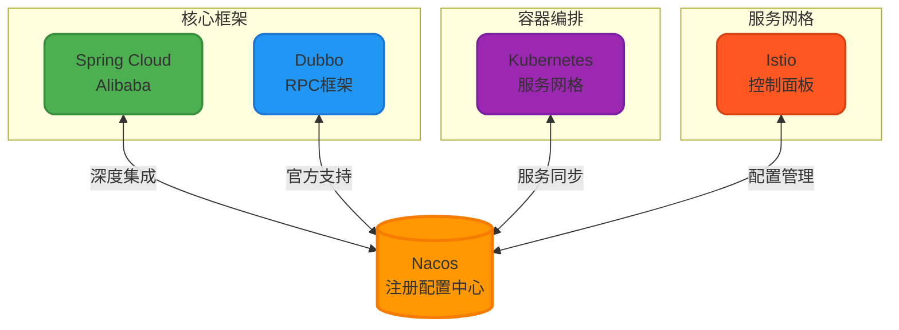
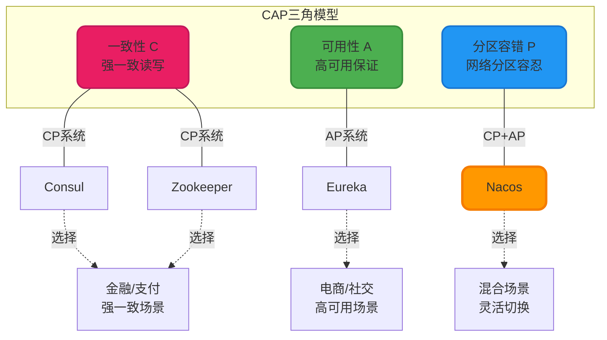

# Nacos架构与核心功能详解

## Nacos概述

Nacos（Dynamic Naming and Configuration Service）是阿里巴巴开源的云原生动态服务治理平台,专注于提供**服务发现**、**配置管理**和**服务治理**的一站式解决方案。作为Spring Cloud Alibaba生态的核心组件,Nacos已经成为国内微服务架构的主流选择。

相比传统的注册中心和配置中心需要分别部署多套组件,Nacos实现了注册中心和配置中心的二合一,大幅降低了系统的运维复杂度和资源开销。它天然支持多种编程语言和主流微服务框架,能够无缝集成到现有的技术栈中。

## Nacos四大核心能力

### 动态配置管理

在传统的开发模式中,应用的配置信息散落在各个服务的配置文件中,修改配置需要重新打包部署。Nacos配置中心将所有配置信息集中存储和管理,实现了以下关键能力:

**集中式配置存储**: 通过Nacos控制台统一管理所有环境(开发、测试、生产)的配置,支持命名空间隔离和配置分组。

**动态配置推送**: 配置变更后,Nacos会实时推送到订阅的客户端,应用无需重启即可生效,极大提升了系统的灵活性。

**配置灰度发布**: 支持配置的灰度发布策略,可以先在少量实例上验证配置的正确性,降低配置错误的影响范围。

**配置版本管理**: 每次配置变更都会记录历史版本,支持快速回滚到任意历史版本,保障系统稳定性。

### 服务注册与发现

Nacos充当微服务系统的"服务注册表",服务实例启动时向Nacos注册自己的网络位置信息,其他服务通过Nacos获取目标服务的可用实例列表并进行负载均衡调用。

**核心优势**:
- 支持临时实例(心跳检测)和持久化实例(主动探测)两种模式
- 实例健康检查机制,自动剔除不健康的实例
- 秒级的服务上下线感知能力
- 支持元数据管理和服务分组

### 服务治理能力

Nacos不仅提供基础的注册发现功能,还提供了丰富的服务治理特性:

**健康检查**: Nacos Server定期对服务实例进行健康检查,支持TCP、HTTP、MySQL等多种检查协议。对于临时实例,采用客户端心跳上报方式;对于持久化实例,采用服务端主动探测方式。

**流量管理**: 支持基于权重的负载均衡,可以动态调整实例的流量权重,实现灰度发布和流量调度。通过设置实例的元数据信息,可以实现更精细化的路由策略。

**服务保护**: 当某个服务的健康实例数低于阈值时,Nacos会触发服务保护机制,返回包括不健康实例在内的所有实例,防止雪崩效应。这种设计理念体现了"高可用优于强一致"的思想。

**故障隔离**: 支持服务分组和命名空间隔离,可以将不同环境、不同租户的服务进行逻辑隔离,避免相互影响。

### 事件监听与推送

Nacos提供了强大的事件监听机制,应用可以订阅以下事件:

- **配置变更事件**: 当配置项发生变化时,Nacos会实时通知订阅的客户端
- **服务变更事件**: 服务实例的注册、注销、健康状态变化等事件会被推送给订阅者
- **集群变更事件**: Nacos集群节点的上下线事件

这些事件机制为实现应用的自动化运维和智能化管理提供了基础能力。

## Nacos生态集成

Nacos作为服务治理平台,已经与主流的微服务框架和基础设施深度集成:

**Spring Cloud Alibaba**: Nacos是Spring Cloud Alibaba的核心组件,提供了`spring-cloud-starter-alibaba-nacos-discovery`和`spring-cloud-starter-alibaba-nacos-config`两个Starter,实现了与Spring Cloud生态的无缝集成。开发者只需引入依赖并配置Nacos地址,即可使用服务发现和配置管理功能。

**Apache Dubbo**: 从Dubbo 2.7.x版本开始,官方推荐使用Nacos作为注册中心和配置中心。相比传统的Zookeeper,Nacos在Dubbo场景下提供了更好的性能表现和运维体验。

**Kubernetes**: Nacos可以与Kubernetes进行双向服务同步,将K8s中的Service自动注册到Nacos,也可以将Nacos中的服务暴露给K8s集群,实现混合云场景下的服务互通。

**Service Mesh**: 在服务网格架构中,Nacos可以作为控制平面的配置数据源,为Istio等网格组件提供动态配置和路由策略管理能力。

## 主流注册中心技术选型

在微服务架构中,注册中心是基础设施的核心组件。目前业界主流的注册中心有Nacos、Eureka、Consul、Zookeeper等,它们各有优劣,适用于不同场景。

### 技术对比分析

| 对比维度 | Nacos | Eureka | Consul | Zookeeper |
| --- | --- | --- | --- | --- |
| CAP模型 | CP+AP可切换 | AP | CP | CP |
| 健康检查 | TCP/HTTP/MySQL/心跳 | 客户端心跳 | TCP/HTTP/gRPC/脚本 | TCP长连接 |
| 负载均衡 | 权重/元数据/选择器 | Ribbon | Fabio | 不支持 |
| 一致性算法 | Raft/Distro | Gossip | Raft | ZAB |
| 自我保护 | 支持 | 支持 | 不支持 | 不支持 |
| 访问协议 | HTTP/gRPC/DNS | HTTP | HTTP/DNS | TCP |
| 多数据中心 | 支持 | 不支持 | 支持 | 不支持 |
| Spring Cloud | 原生支持 | 原生支持 | 支持 | 社区支持 |
| Dubbo集成 | 官方推荐 | 不支持 | 支持 | 传统方案 |
| Kubernetes | 支持双向同步 | 不支持 | 支持 | 支持 |
| 配置中心 | 内置 | 需额外部署 | 简单KV存储 | 需二次开发 |
| 运维复杂度 | 低 | 中 | 高 | 高 |
| 社区活跃度 | 极高 | 停止维护 | 中 | 中 |

### CAP理论与注册中心选型

在分布式系统中,CAP定理指出一个系统最多只能同时满足一致性(Consistency)、可用性(Availability)、分区容错性(Partition Tolerance)中的两项。

**CP系统(Consul/Zookeeper)**: 优先保证数据一致性和分区容错性。当网络分区发生时,只有持有多数派的分区可以继续提供服务,少数派分区会拒绝写操作。这种设计适合对数据一致性要求极高的场景,如金融交易系统、支付系统等。

**AP系统(Eureka)**: 优先保证可用性和分区容错性。即使发生网络分区,所有分区都能继续提供服务,但可能出现数据不一致。对于服务注册场景,短暂的数据不一致(如仍然返回已下线的实例)是可以接受的,因为客户端会有重试和熔断机制。

**CP+AP混合(Nacos)**: Nacos同时支持CP和AP两种模式,可以根据业务场景灵活切换。对于临时实例(如Spring Cloud服务),默认使用AP模式保证高可用;对于持久化实例(如Dubbo服务)和配置中心,使用CP模式保证数据一致性。

### 选型决策建议

#### 场景一:Spring Cloud微服务架构

**推荐方案**: Nacos

**理由**:
- Spring Cloud Alibaba官方主推,集成最为简单
- 同时提供注册中心和配置中心,无需部署多套组件
- 控制台界面友好,运维体验优秀
- 社区活跃,版本迭代快,问题修复及时

**注意**: Eureka已于2019年停止维护,Spring Boot 3.0后不再官方支持,不建议新项目使用。

#### 场景二:Dubbo RPC框架

**推荐方案**: Nacos

**理由**:
- Dubbo 2.7.x+官方推荐的注册中心
- 支持接口级服务注册,元数据管理更灵活
- 性能优于Zookeeper,大规模集群下表现更好
- 提供配置中心能力,可统一管理Dubbo配置

**备选**: Zookeeper(传统方案,适合已有ZK基础设施的团队)

#### 场景三:强一致性需求(金融/支付)

**推荐方案**: Nacos(CP模式) 或 Consul

**理由**:
- 金融、支付等场景对配置的一致性要求极高,不允许不同节点读取到不同的配置
- Nacos在CP模式下基于Raft协议保证强一致性
- Consul提供了更丰富的健康检查策略(支持脚本检查)
- 两者都支持多数据中心部署,满足异地多活需求

#### 场景四:高可用优先(社交/电商)

**推荐方案**: Nacos(AP模式)

**理由**:
- 互联网应用对可用性要求极高,短暂的数据不一致可以接受
- AP模式下即使发生网络分区,服务注册和发现功能仍然可用
- 配合客户端的重试和熔断机制,可以有效应对实例信息延迟更新的问题

#### 场景五:混合云/多环境部署

**推荐方案**: Nacos

**理由**:
- 支持命名空间隔离,可以在一套Nacos集群中管理多个环境(开发、测试、生产)
- 支持服务分组,可以按业务线或部门进行逻辑隔离
- 支持与Kubernetes的双向服务同步,适合混合云场景
- 支持跨注册中心的服务同步,可以实现多活架构

### 迁移成本考量

从现有注册中心迁移到Nacos时,需要评估迁移成本:

**从Eureka迁移**: 成本较低,主要是修改依赖和配置,业务代码基本无需改动。Spring Cloud提供了统一的服务发现抽象接口,切换注册中心实现比较平滑。

**从Zookeeper迁移**: 如果使用Dubbo框架,只需修改注册中心配置即可。如果直接使用Curator等ZK客户端,则需要改造代码。

**从Consul迁移**: 需要重新适配服务注册和健康检查逻辑,成本相对较高。

## 实践建议

基于多年的生产实践经验,以下是使用Nacos的一些最佳实践:

**生产环境集群部署**: Nacos集群建议至少3个节点,保证高可用。推荐使用外置MySQL存储(生产环境必须),避免使用内嵌Derby数据库。

**命名空间隔离**: 通过命名空间实现环境隔离(dev/test/prod),避免误操作影响生产环境。不同业务线也可以使用独立的命名空间。

**配置分组管理**: 合理使用配置分组(Group),将公共配置、业务配置、中间件配置等分类管理,提升可维护性。

**监控告警**: 接入Prometheus监控Nacos集群的健康状态,配置服务实例数量异常告警,及时发现服务注册异常。

**灰度发布**: 利用Nacos的元数据和权重功能,实现配置和服务的灰度发布,降低变更风险。

**权限控制**: 在生产环境开启Nacos的权限认证功能,防止未授权的配置修改和服务注册。
