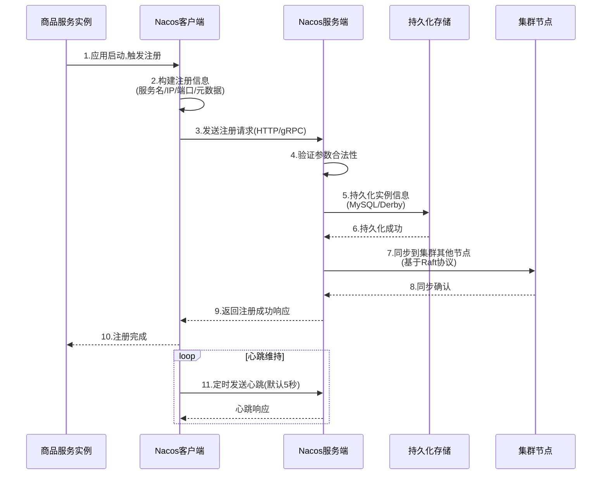
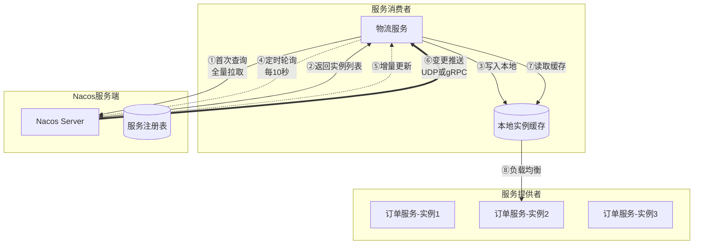
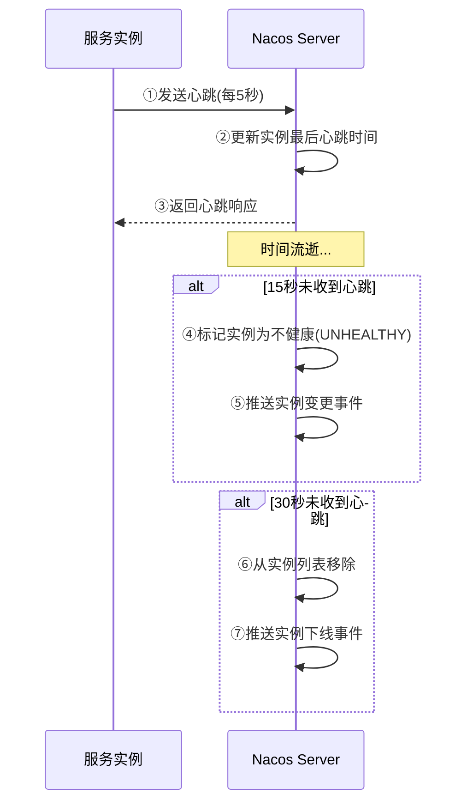

# Nacos架构与核心功能详解

## 服务注册机制解析

服务注册是微服务治理的第一步,服务提供者需要将自己的网络位置信息告知注册中心,才能被其他服务发现和调用。Nacos的服务注册机制设计精巧,既保证了数据的可靠性,又兼顾了性能和可用性。

### 注册流程详解

当一个微服务实例(例如商品服务)启动时,会执行以下注册流程:



**第1-3步:构建并发送注册信息**

Nacos客户端在应用启动时,会自动收集实例信息并发起注册请求。注册信息包括:
- **服务名称**(serviceName): 如`product-service`,用于服务分组
- **IP地址**: 实例的网络地址,支持自动识别或手动指定
- **端口号**(port): 服务监听的端口
- **集群名称**(clusterName): 默认为DEFAULT,可自定义实现集群隔离
- **权重**(weight): 默认1.0,用于负载均衡流量分配
- **元数据**(metadata): 自定义键值对,可用于灰度发布、版本路由等扩展场景

**第4-6步:服务端持久化处理**

Nacos Server接收到注册请求后,会执行以下操作:
- 校验服务名、IP、端口等必填字段的合法性
- 判断实例类型(临时实例/持久化实例),临时实例数据存储在内存,持久化实例写入数据库
- 更新服务的实例列表,并标记实例状态为健康(UP)

**第7-8步:集群数据同步**

为了保证Nacos集群数据一致性,注册信息会通过Raft协议同步到集群的所有节点。只有当多数派节点写入成功后,才会向客户端返回注册成功的响应。这种设计牺牲了少量性能,但保证了数据的强一致性。

**第11步:心跳机制**

对于临时实例,Nacos采用客户端主动上报心跳的方式维持实例的健康状态。默认情况下:
- 客户端每隔**5秒**发送一次心跳包
- 如果**15秒**内未收到心跳,实例被标记为不健康(但仍保留在实例列表)
- 如果**30秒**内未收到心跳,实例被彻底移除

### 实例类型对比

Nacos支持两种实例类型,适用于不同的业务场景:

| 对比维度 | 临时实例(Ephemeral) | 持久化实例(Persistent) |
| --- | --- | --- |
| 默认类型 | 是 | 否 |
| 数据存储 | 仅内存 | 内存+数据库 |
| 健康检查 | 客户端心跳上报 | 服务端主动探测(TCP/HTTP) |
| 网络分区表现 | 心跳超时后自动注销 | 标记为不健康但不删除 |
| 数据一致性 | AP模式(最终一致性) | CP模式(强一致性) |
| 适用场景 | Spring Cloud微服务 | Dubbo服务、DNS服务 |

**临时实例**适合云原生场景下的微服务,实例生命周期短暂,需要快速上下线。客户端心跳的设计避免了服务端对海量实例的主动检测,降低了系统开销。

**持久化实例**适合需要长期稳定运行的服务,即使实例暂时不可用,注册信息也不会丢失。服务端主动健康检查可以及时发现实例故障,但会增加服务端的资源消耗。

### Spring Cloud集成示例

在Spring Cloud应用中集成Nacos服务注册非常简单,只需三步:

**第一步:引入依赖**

```xml
<dependency>
    <groupId>com.alibaba.cloud</groupId>
    <artifactId>spring-cloud-starter-alibaba-nacos-discovery</artifactId>
    <version>2022.0.0.0</version>
</dependency>
```

**第二步:配置Nacos地址**

```yaml
spring:
  application:
    name: payment-service  # 服务名称
  cloud:
    nacos:
      discovery:
        server-addr: 192.168.1.100:8848  # Nacos服务器地址
        namespace: dev  # 命名空间(环境隔离)
        cluster-name: guangzhou  # 集群名称
        weight: 1.0  # 实例权重
        metadata:
          version: 1.0.0  # 自定义元数据
          region: south-china
```

**第三步:启用服务发现**

```java
@SpringBootApplication
@EnableDiscoveryClient  // 开启服务发现功能
public class PaymentServiceApplication {
    
    public static void main(String[] args) {
        SpringApplication.run(PaymentServiceApplication.class, args);
    }
}
```

启动应用后,可以在Nacos控制台的"服务管理"->"服务列表"中看到注册的实例信息。

## 服务发现机制解析

服务发现是服务注册的逆向过程,服务消费者需要从注册中心获取目标服务的实例列表,然后根据负载均衡策略选择一个实例发起调用。

### 服务发现的两种模式

Nacos的服务发现机制结合了**主动拉取**和**被动推送**两种模式,既保证了数据的实时性,又避免了对服务端的过度压力。



### 初始化拉取流程

当服务消费者首次调用某个服务时,会执行以下步骤:

**①首次全量查询**: 消费者向Nacos Server发起查询请求,获取目标服务的全量实例列表。请求中会携带服务名、集群名等过滤条件。

**②返回实例列表**: Nacos Server从服务注册表中查询符合条件的所有健康实例,返回包含IP、端口、权重、元数据等完整信息的实例列表。

**③本地缓存**: 消费者将实例列表缓存到本地内存,并订阅该服务的变更事件。后续的服务调用将直接从本地缓存读取,无需每次都请求Nacos Server,大幅降低了网络开销和延迟。

### 定时轮询更新

为了保证本地缓存的实时性,Nacos客户端会定时向服务端拉取最新的实例列表:

**④定时轮询**: 客户端默认每隔**10秒**(可通过`nacos.client.naming.pull.interval=10000`配置)主动向Nacos Server发起一次查询请求。

**⑤增量更新**: 服务端对比客户端的版本号,如果实例列表发生了变化(实例上下线、健康状态变更等),则返回最新的实例列表;否则返回空响应,减少网络传输量。

这种定时轮询机制是一种兜底保障,即使推送机制失败,最多也只会延迟10秒感知到实例变化。

### 实时变更推送

除了定时轮询,Nacos还提供了实时推送机制,当服务实例发生变化时主动通知订阅者:

**⑥变更推送**: 当Nacos Server检测到以下事件时,会主动推送变更通知给订阅的客户端:
- 服务实例新增(新实例上线)
- 服务实例删除(实例下线或心跳超时)
- 实例健康状态变化(从健康变为不健康,或反之)
- 实例元数据变更(权重、版本等信息修改)

在Nacos 1.x版本中,推送通道使用UDP协议;在Nacos 2.x版本中,升级为gRPC长连接,推送的可靠性和性能都有显著提升。

客户端收到推送通知后,会立即更新本地缓存,实现**秒级**的服务变更感知,无需等待下一次定时轮询。

### 负载均衡调用

**⑦-⑧读取缓存并调用**: 当业务代码需要调用目标服务时,Nacos客户端会从本地缓存读取实例列表,并根据负载均衡策略选择一个实例发起调用。

Nacos支持以下负载均衡策略:

**随机策略(Random)**: 从健康实例列表中随机选择一个实例,简单高效,适合实例性能差异不大的场景。

**轮询策略(RoundRobin)**: 按顺序依次选择实例,保证流量均匀分配。

**加权随机/加权轮询**: 根据实例的权重值分配流量,权重越高的实例获得的流量越多。适合实例性能存在差异的场景,可以将更多流量导向高性能实例。

**基于元数据的路由**: 通过实例的元数据实现更复杂的路由策略,例如:
- 版本路由: 根据请求参数路由到不同版本的服务实例
- 灰度路由: 将特定用户的流量路由到灰度版本实例
- 地域路由: 优先调用同一地域的服务实例,降低跨地域延迟

### Spring Cloud Ribbon集成示例

在Spring Cloud应用中,服务调用通常使用`RestTemplate`或`OpenFeign`,它们都集成了Ribbon负载均衡器:

**使用RestTemplate调用**

```java
@Configuration
public class RestTemplateConfig {
    
    @Bean
    @LoadBalanced  // 开启负载均衡功能
    public RestTemplate restTemplate() {
        return new RestTemplate();
    }
}

@Service
public class NotificationService {
    
    @Autowired
    private RestTemplate restTemplate;
    
    /**
     * 调用短信服务发送通知
     * @param phone 手机号
     * @param content 短信内容
     */
    public void sendSms(String phone, String content) {
        String url = "http://sms-service/api/sms/send";  // 使用服务名而非IP地址
        
        SmsRequest request = new SmsRequest();
        request.setPhone(phone);
        request.setContent(content);
        request.setTemplateCode("SMS_001");
        
        // RestTemplate会自动从Nacos获取sms-service的实例列表并负载均衡
        SmsResponse response = restTemplate.postForObject(url, request, SmsResponse.class);
        
        if (response != null && response.isSuccess()) {
            log.info("短信发送成功: {}", phone);
        } else {
            log.error("短信发送失败: {}", phone);
        }
    }
    
    /**
     * 查询短信发送记录
     */
    public List<SmsRecord> querySmsHistory(String phone) {
        String url = "http://sms-service/api/sms/history?phone=" + phone;
        
        // GET请求也支持负载均衡
        SmsRecord[] records = restTemplate.getForObject(url, SmsRecord[].class);
        return records != null ? Arrays.asList(records) : Collections.emptyList();
    }
}
```

**使用OpenFeign声明式调用**

```java
@FeignClient(name = "sms-service")  // 指定服务名
public interface SmsServiceClient {
    
    /**
     * 发送短信
     */
    @PostMapping("/api/sms/send")
    SmsResponse sendSms(@RequestBody SmsRequest request);
    
    /**
     * 查询短信记录
     */
    @GetMapping("/api/sms/history")
    List<SmsRecord> querySmsHistory(@RequestParam("phone") String phone);
}

@Service
public class NotificationServiceV2 {
    
    @Autowired
    private SmsServiceClient smsServiceClient;
    
    public void sendSms(String phone, String content) {
        SmsRequest request = new SmsRequest();
        request.setPhone(phone);
        request.setContent(content);
        request.setTemplateCode("SMS_001");
        
        // Feign会自动完成服务发现和负载均衡
        SmsResponse response = smsServiceClient.sendSms(request);
        
        if (response.isSuccess()) {
            log.info("短信发送成功: {}", phone);
        }
    }
}
```

在上述代码中,无论是`RestTemplate`还是`FeignClient`,都无需硬编码服务的IP地址和端口,只需使用服务名即可。框架会自动从Nacos获取实例列表并进行负载均衡,实现了服务间的松耦合。

## 健康检查机制

健康检查是保证服务高可用的关键机制,Nacos通过多种方式确保只有健康的实例才能接收流量。

### 客户端心跳检测

对于临时实例,Nacos采用客户端主动上报心跳的方式:



这种设计有以下优势:
- **降低服务端压力**: 服务端无需主动探测海量实例,只需被动接收心跳
- **网络友好**: 心跳包非常小,对网络带宽消耗极低
- **快速感知**: 最多30秒即可感知实例下线(相比TCP连接超时的几分钟)

### 服务端主动探测

对于持久化实例,Nacos Server会主动发起健康检查探测:

**TCP检查**: 尝试建立TCP连接到实例的指定端口,连接成功则认为健康。适合不提供HTTP接口的服务(如RPC服务)。

**HTTP检查**: 向实例发送HTTP GET请求到指定路径(如`/health`),根据HTTP状态码判断健康状态。返回2xx表示健康,其他状态码表示不健康。

**MySQL检查**: 尝试建立MySQL连接,适合数据库服务的健康检查。

### 保护阈值机制

Nacos提供了服务保护阈值(Protect Threshold)功能,防止因大量实例同时故障导致的雪崩效应:

当某个服务的健康实例数占比低于保护阈值(默认0,即不启用)时,Nacos会触发保护模式,返回包括不健康实例在内的所有实例。这种设计基于以下考虑:

- 大量实例同时不健康,可能是Nacos Server的网络问题或健康检查逻辑异常,而非实例真的故障
- 返回不健康实例虽然会有部分调用失败,但总比完全没有实例可用要好
- 配合客户端的超时和重试机制,可以在一定程度上保持系统可用性

这体现了Nacos"高可用优先"的设计理念,在极端情况下牺牲部分一致性以保证可用性。
