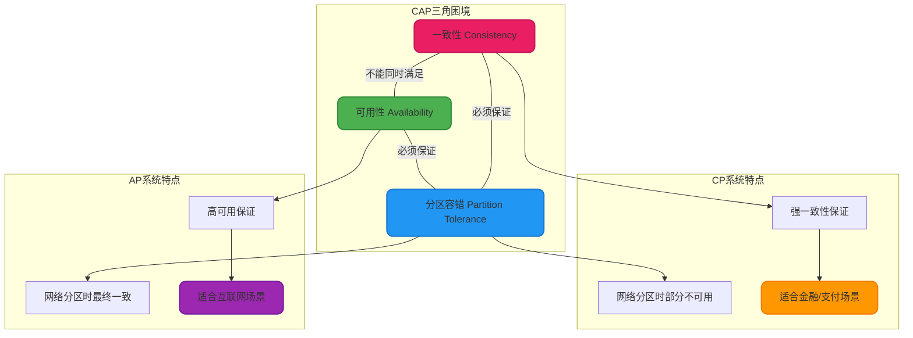
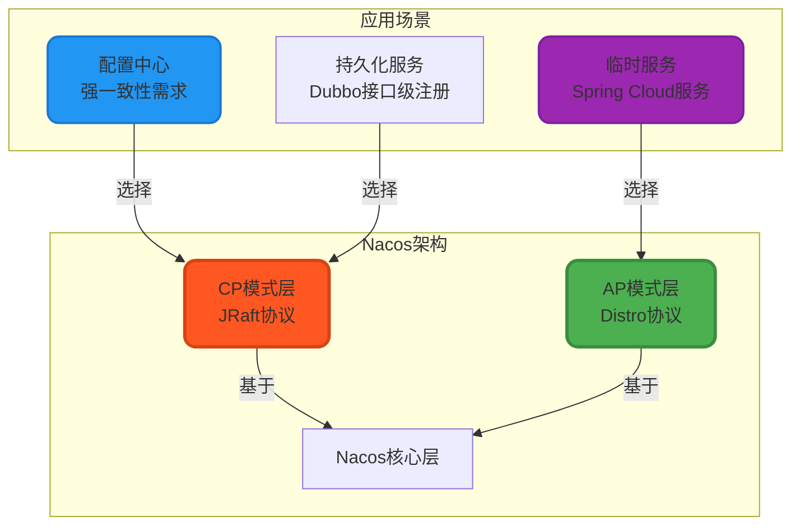
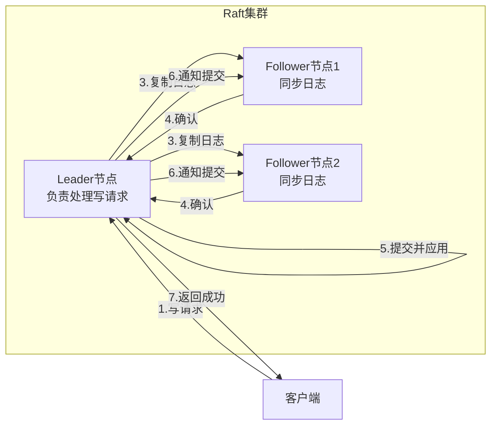
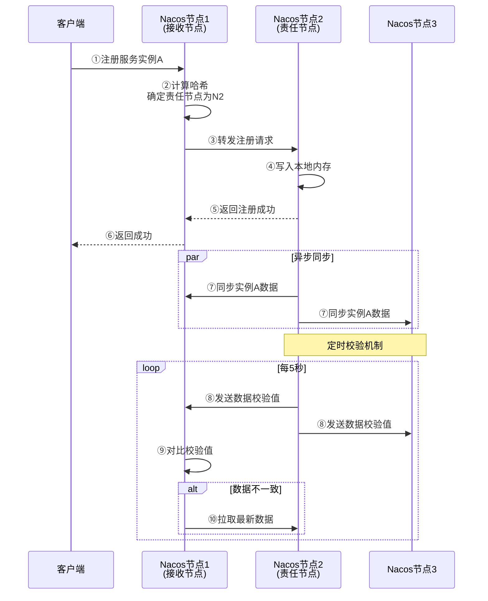

# Nacos一致性协议与高可用设计

## CAP理论与Nacos的选择

在分布式系统设计中,CAP定理是绕不开的基础理论。CAP分别代表:

- **C(Consistency)一致性**: 所有节点在同一时刻看到的数据是一致的
- **A(Availability)可用性**: 系统在任何时候都能响应客户端请求
- **P(Partition Tolerance)分区容错性**: 系统在网络分区的情况下仍能继续运行

CAP定理指出,在分布式系统中,这三个特性最多只能同时满足两个。一旦发生网络分区(P是必须保证的),系统必须在一致性(C)和可用性(A)之间做出选择。



### CP系统的权衡

选择CP模式的系统(如Zookeeper、Consul、Nacos的CP模式)优先保证数据一致性:

**网络分区时的表现**: 当集群因网络故障分裂为多个分区时,只有持有多数派节点的分区可以继续提供写服务,少数派分区会拒绝写请求并返回错误。这保证了不会出现数据冲突,但牺牲了部分可用性。

**适用场景**: 适合对数据一致性要求极高的场景,如:
- **配置中心**: 不同实例读取到不同的配置会导致系统行为不一致,必须保证强一致性
- **金融交易**: 账户余额等关键数据不允许出现不一致
- **分布式锁**: 必须保证同一时刻只有一个客户端持有锁

### AP系统的权衡

选择AP模式的系统(如Eureka、Nacos的AP模式)优先保证高可用性:

**网络分区时的表现**: 即使发生网络分区,所有分区都能继续提供读写服务,但可能导致不同分区的数据不一致。当网络恢复后,通过冲突解决机制实现最终一致性。

**适用场景**: 适合对可用性要求极高,能容忍短暂数据不一致的场景,如:
- **服务注册中心**: 短暂的实例信息不一致(如返回已下线的实例)可以通过客户端重试和熔断机制容错
- **电商商品浏览**: 短时间内看到稍旧的商品信息是可接受的
- **社交动态**: 动态列表的短暂不一致不影响核心体验

## Nacos的双模式架构设计

Nacos在设计时面临一个核心挑战:作为同时支持**服务注册中心**和**配置中心**的平台,这两个场景对CAP的要求截然不同。

### 注册中心的AP需求

对于服务注册中心,可用性是第一优先级:

**可用性优于一致性**: 注册中心一旦不可用,所有微服务之间的调用都会受影响,系统会完全瘫痪。相比之下,短暂的实例信息不一致影响相对较小。例如,某个服务实例已下线,但注册中心仍返回该实例信息,消费者调用时会失败,但通过重试机制可以调用到其他健康实例,业务影响有限。

**弱一致性可接受**: 服务实例的上下线本身就是一个动态的过程,客户端的本地缓存与注册中心的数据存在一定延迟(如10秒的轮询间隔)是正常的。因此,注册中心的数据无需保证强一致性,最终一致性即可满足需求。

### 配置中心的CP需求

对于配置中心,一致性是核心要求:

**一致性优于可用性**: 配置信息是系统行为的"基因",如果不同实例读取到不同的配置,会导致系统出现不可预期的行为。例如,数据库连接配置不一致,部分实例连接到旧库,部分连接到新库,会导致数据错乱。因此,配置中心必须保证所有实例读取到相同的配置,即使牺牲一定的可用性(如配置推送稍有延迟)也是可接受的。

**变更需要强一致**: 配置变更是低频操作(相比服务调用),但每次变更都至关重要。配置推送的延迟(如晚几秒推送)是可接受的,但不同实例接收到不同版本的配置是绝对不能容忍的。

### 双协议混合架构

基于上述分析,Nacos采用了创新的双协议架构,同时支持CP和AP两种模式:



**CP模式**: 通过JRaft协议实现强一致性,用于配置中心和持久化服务实例
**AP模式**: 通过Distro协议实现高可用性,用于临时服务实例

这种双模式设计让Nacos能够灵活应对不同场景的需求,开发者可以根据业务特点选择合适的模式。

## JRaft协议详解

JRaft是Nacos在CP模式下使用的一致性协议,它是Raft算法的纯Java实现。

### Raft算法核心思想

Raft是一种易于理解的分布式一致性算法,它通过**选举领导者**和**日志复制**机制保证集群数据的强一致性。



**核心流程**:

**①客户端发起写请求**: 所有的写请求都必须由Leader节点处理,如果客户端连接到Follower,Follower会将请求转发给Leader。

**②Leader追加日志**: Leader将写操作封装为一条日志条目(Log Entry),追加到自己的日志中,此时该日志处于"未提交"状态。

**③日志复制**: Leader并行地将日志条目发送给所有Follower节点,要求它们复制该日志。

**④Follower确认**: Follower接收到日志后,将其追加到本地日志,并向Leader返回确认(ACK)。

**⑤Leader提交**: 当Leader收到**多数派**(超过半数)Follower的确认后,将该日志标记为"已提交",并应用到状态机(实际执行写操作)。

**⑥通知Follower提交**: Leader在后续的心跳或日志复制消息中,通知Follower哪些日志已提交,Follower也将这些日志应用到状态机。

**⑦返回客户端**: Leader向客户端返回写入成功响应。

### JRaft在Nacos中的应用

Nacos通过JRaft实现了配置中心和持久化服务的强一致性保证:

**配置写入流程**: 当用户在Nacos控制台修改配置时,写请求发送到Leader节点,Leader将配置变更写入Raft日志并复制到多数派节点,只有在多数派确认后,配置才会生效并推送给客户端。这保证了所有客户端读取到的配置都是一致的。

**集群脑裂保护**: 在网络分区场景下,只有持有多数派节点的分区能选举出Leader并继续服务,少数派分区无法选举Leader,会拒绝写请求。这避免了脑裂导致的数据不一致。

**数据持久化**: Raft日志会持久化到磁盘(通常使用RocksDB),即使节点重启,也能从日志中恢复数据,保证了数据的可靠性。

### JRaft的优势

**纯Java实现**: 相比C++实现的braft,JRaft更容易与Java应用集成,减少了跨语言调用的复杂性。

**高性能**: JRaft在设计时充分考虑了性能优化,支持批量日志复制、Pipeline复制等高级特性,吞吐量可达数万TPS。

**易于运维**: 提供了丰富的监控指标和管理接口,支持动态添加/移除节点,运维友好。

## Distro协议详解

Distro是Nacos自研的AP分布式协议,专为临时服务实例设计,在保证高可用性的同时尽可能提升一致性。

### Distro协议的设计理念

Distro协议基于以下核心设计思想:

**①节点平等**: 集群中的所有节点都是平等的,每个节点都可以处理读写请求,没有Leader/Follower的区分。这避免了Leader单点瓶颈,提升了系统的并发处理能力。

**②数据分片**: 每个节点只负责一部分服务实例的数据,根据服务实例的ID哈希分配责任节点(Responsible Node)。例如,3个节点的集群,每个节点负责约1/3的实例数据。

**③写操作本地化**: 当客户端向任意节点注册服务时,该节点会计算该实例的责任节点:
- 如果自己是责任节点,直接写入本地并异步同步给其他节点
- 如果不是责任节点,将请求转发给责任节点处理

**④读操作本地化**: 任何节点都可以处理读请求,直接从本地内存返回数据,无需跨节点查询,保证了极低的读延迟。

**⑤定时校验**: 每个节点定时发送自己负责数据的校验值(如MD5)给其他节点,其他节点对比后发现不一致,则主动拉取最新数据,保证最终一致性。



### Distro协议的容错机制

**节点故障处理**: 当某个节点宕机时,其负责的服务实例数据已经同步到了其他所有节点,因此不会丢失数据。客户端的请求会被路由到其他健康节点,继续提供服务。

**网络分区处理**: 在网络分区场景下,每个分区都能独立处理读写请求(AP特性)。由于每个节点都存储了全量数据,分区不会影响服务的可用性。当网络恢复后,通过定时校验机制同步数据,实现最终一致性。

**数据冲突解决**: 如果网络分区期间,不同分区对同一个实例进行了修改,恢复后会以**时间戳最新**的数据为准,覆盖旧数据。这种冲突解决策略简单高效,适合服务注册场景(同一个实例同时被多个分区修改的概率极低)。

### Distro vs Raft对比

| 对比维度 | Distro协议 | Raft协议 |
| --- | --- | --- |
| CAP选择 | AP(高可用) | CP(强一致) |
| 节点角色 | 所有节点平等 | Leader/Follower分层 |
| 写操作 | 写入责任节点,异步同步 | 写入Leader,同步复制多数派 |
| 读操作 | 本地读,延迟极低 | 读Leader或Follower |
| 一致性 | 最终一致性 | 强一致性 |
| 性能 | 高吞吐、低延迟 | 中等吞吐、中等延迟 |
| 数据持久化 | 内存存储(临时实例) | 磁盘持久化 |
| 适用场景 | 服务注册(临时实例) | 配置中心、持久化实例 |

## 模式切换与配置

Nacos支持在运行时动态切换实例的AP/CP模式,满足不同业务场景的需求。

### 默认模式

**临时实例(Ephemeral=true)**: 默认使用AP模式,数据存储在内存,通过Distro协议同步,适合Spring Cloud等微服务场景。

**持久化实例(Ephemeral=false)**: 默认使用CP模式,数据持久化到数据库,通过JRaft协议同步,适合Dubbo等需要持久化注册信息的场景。

### 切换方式

**在注册时指定实例类型**:

Spring Cloud应用可以通过配置指定实例类型:

```yaml
spring:
  cloud:
    nacos:
      discovery:
        ephemeral: false  # 设置为持久化实例(CP模式)
```

Dubbo应用默认注册为持久化实例,也可以通过配置调整。

### 选型建议

**使用AP模式(临时实例)的场景**:
- Spring Cloud微服务架构
- 对可用性要求极高的互联网应用
- 实例频繁上下线的场景(如弹性伸缩)
- 能容忍秒级的数据不一致

**使用CP模式(持久化实例)的场景**:
- Dubbo RPC服务
- 需要长期保留注册信息的场景
- 对数据一致性要求高的场景(如金融、支付)
- 实例生命周期较长且稳定

## 高可用集群部署

生产环境下,Nacos必须以集群模式部署,保证系统的高可用性。

### 集群规模建议

**最小集群**: 3个节点,这是Raft协议能够容忍1个节点故障的最小配置(3节点集群可以容忍1个节点故障,仍有2个节点形成多数派)。

**推荐集群**: 5个节点,可以容忍2个节点故障,在节点滚动升级或机房断电等场景下仍能保持可用。

**节点数量选择**: Raft协议要求节点数为奇数,偶数节点无法提升容错能力(如4节点和5节点都只能容忍2个节点故障),反而增加了成本。

### 数据持久化

生产环境必须使用外置MySQL数据库,避免使用内嵌Derby数据库:

**配置MySQL数据源**:

```properties
### 数据库连接配置
spring.datasource.platform=mysql
db.num=1
db.url.0=jdbc:mysql://192.168.1.200:3306/nacos?characterEncoding=utf8&connectTimeout=10000&socketTimeout=30000
db.user.0=nacos
db.password.0=nacos123
```

**MySQL高可用**: 建议MySQL也采用主从复制或集群部署,避免数据库成为单点故障。

### 监控告警

生产环境应接入Prometheus等监控系统,监控以下关键指标:

- **集群健康状态**: 节点存活数量、Leader选举状态
- **服务实例数量**: 各服务的实例数量异常波动告警
- **请求性能**: 请求QPS、延迟、错误率
- **资源使用**: CPU、内存、磁盘、网络流量

### 容灾演练

定期进行容灾演练,验证集群的容错能力:

- **单节点故障**: 停止1个节点,验证集群是否正常服务
- **网络分区**: 模拟网络分区,验证CP/AP模式的表现
- **全量重启**: 验证集群重启后的数据恢复能力

通过这些实践,可以确保Nacos集群在生产环境下稳定可靠地运行,为微服务架构提供坚实的基础支撑。
