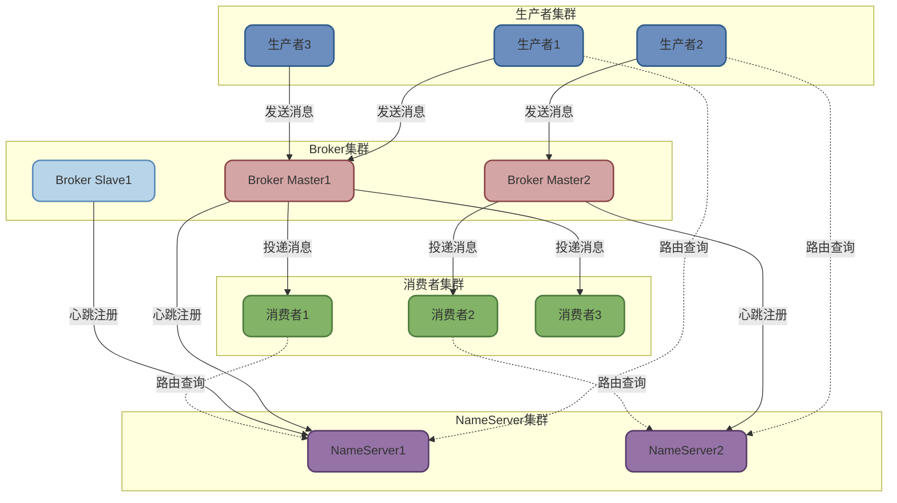
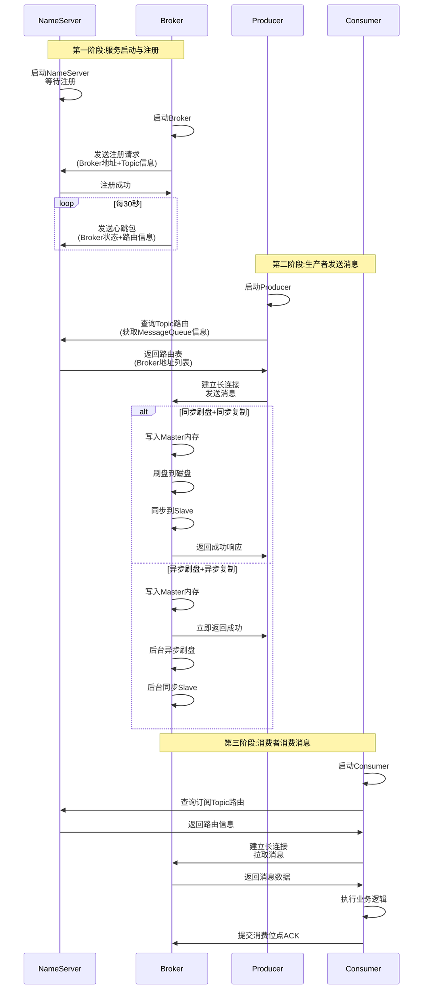
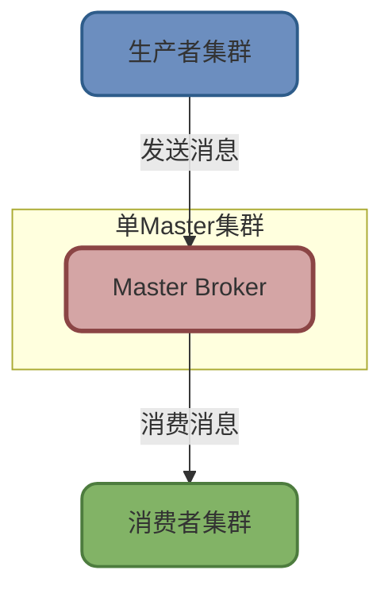
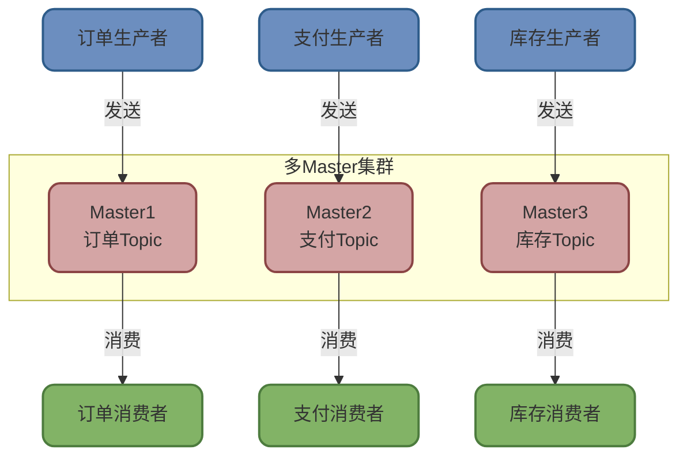
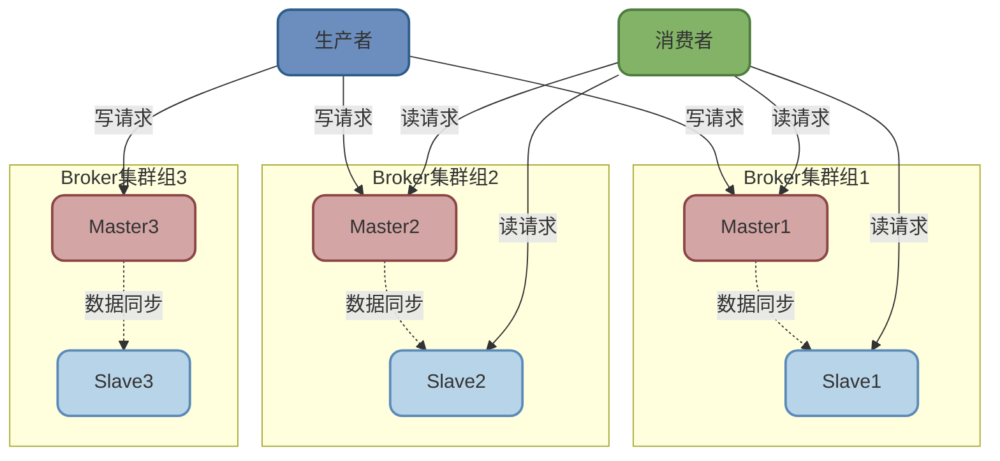

# RocketMQ架构设计与工作流程

## RocketMQ核心架构组件

RocketMQ作为一款高性能的分布式消息中间件,采用了清晰的模块化架构设计。整个系统由四个核心角色协同工作,共同构建起稳定可靠的消息传输通道。

### Producer(生产者)

生产者是消息的生产方,负责将业务数据封装成消息并发送到Broker服务器。生产者在发送消息前,会先向NameServer获取Topic的路由信息,包括该Topic对应的所有MessageQueue(消息队列)的地址。

生产者通常采用轮询或哈希等策略选择目标队列,然后与该队列所在的Broker建立长连接进行消息传输。为了保证高可用性,生产者会与多个NameServer和Broker保持连接。

### Broker(消息服务器)

Broker是RocketMQ的核心组件,承担着消息存储、转发和管理的重任。每个Broker节点都维护着独立的存储空间和消息队列,主要职责包括:

- **消息接收与存储**: 接收生产者发送的消息,并将其持久化到本地磁盘
- **消息投递**: 根据消费者的订阅关系,将消息推送或由消费者拉取
- **心跳维护**: 定期向所有NameServer发送心跳包,上报自身状态和Topic路由信息
- **数据复制**: 在主从架构下,Master节点需要将数据同步到Slave节点

:::tip Broker集群部署
在生产环境中,Broker通常采用多Master多Slave的集群部署方式。每个Master都有对应的Slave进行数据备份,当Master故障时,Slave可以快速接管读请求,保证服务的高可用性。
:::

### NameServer(名称服务)

NameServer充当整个系统的路由注册中心,维护着Broker和Topic的元数据信息。它的核心功能包括:

- **路由注册**: 接收Broker的注册请求,记录Broker的地址、Topic信息以及MessageQueue的映射关系
- **路由发现**: 为生产者和消费者提供Topic的路由查询服务,帮助它们找到正确的Broker地址
- **健康检查**: 定期检测Broker的存活状态,及时剔除失效节点

NameServer采用无状态设计,节点之间相互独立,不进行数据同步。客户端可以连接任意一个NameServer节点获取路由信息,这种设计极大地简化了系统架构,提升了可用性。

### Consumer(消费者)

消费者订阅感兴趣的Topic,从Broker拉取消息并进行业务处理。消费者在启动时,会先随机选择一个NameServer建立连接,获取订阅Topic的路由信息,然后与相应的Broker建立长连接进行消息消费。

RocketMQ支持两种消费模式:
- **集群消费**: 同一个消费者组内的多个消费者共同消费Topic,每条消息只会被组内一个消费者处理
- **广播消费**: 每个消费者都会接收到Topic的所有消息

### Topic与MessageQueue

**Topic(主题)** 是消息的逻辑分类单位,用于区分不同的业务场景。例如电商系统中可以定义订单Topic、库存Topic、支付Topic等,实现业务消息的隔离。

**MessageQueue(消息队列)** 是Topic的物理实现单元。一个Topic可以包含多个MessageQueue,每个Queue都是一个独立的FIFO队列,存储着有序的消息序列。通过Queue的分散存储,实现了消息的并行处理和负载均衡。

## RocketMQ完整工作流程

理解RocketMQ的工作流程,对于排查问题和性能优化至关重要。下面详细解析从消息产生到消费的完整链路。

### 启动阶段

**步骤1: NameServer启动**

NameServer作为整个系统的路由中心,需要最先启动。它监听指定端口,等待Broker和客户端的连接请求。

**步骤2: Broker注册**

Broker启动后,会立即与配置的所有NameServer建立连接,发送注册请求。注册信息包括:
- Broker的IP地址和端口号
- 当前Broker上配置的所有Topic列表
- 每个Topic对应的MessageQueue数量和分布情况
- Broker角色(Master或Slave)

注册成功后,Broker会启动定时任务,默认每30秒向NameServer发送一次心跳包,持续更新自身状态。

:::info 心跳超时机制
NameServer会监控Broker的心跳状态。如果超过120秒未收到某个Broker的心跳,NameServer会认为该Broker已失效,将其从路由表中移除,避免客户端连接到故障节点。
:::

### 消息发送阶段

**步骤3: Producer启动与路由获取**

生产者启动时,会随机选择一个NameServer建立长连接。然后向NameServer查询要发送的Topic的路由信息,获取该Topic的所有MessageQueue及其所在Broker的地址。

生产者会在本地缓存这份路由信息,避免每次发送消息都要查询NameServer。同时启动定时任务,每30秒更新一次路由缓存,确保感知到Broker的变化。

**步骤4: 消息发送与持久化**

生产者根据负载均衡策略(如轮询)从路由表中选择一个MessageQueue,然后与该Queue所在的Broker建立TCP长连接,发送消息。

Broker收到消息后的处理流程取决于配置策略:

**同步刷盘模式**: Broker会先将消息写入内存的PageCache,然后立即调用fsync强制刷新到磁盘,确保消息持久化后才返回成功响应给生产者。这种模式保证了消息不丢失,但性能相对较低。

**异步刷盘模式(默认)**: Broker将消息写入PageCache后立即返回成功,然后由后台线程异步将数据批量刷写到磁盘。这种模式性能更高,但存在机器宕机时少量消息丢失的风险。

**主从同步策略**: 
- **同步复制**: Master在将消息同步到Slave后才返回成功,保证数据强一致性
- **异步复制(默认)**: Master写入成功后立即返回,后台异步复制到Slave

### 消息消费阶段

**步骤5: Consumer启动与订阅**

消费者启动流程与生产者类似,先连接NameServer获取订阅Topic的路由信息,然后与对应的Broker建立长连接。

消费者需要注册消息监听器(MessageListener),用于处理接收到的消息。RocketMQ会根据监听器类型决定消费模式:
- `MessageListenerConcurrently`: 并发消费,多线程处理消息
- `MessageListenerOrderly`: 顺序消费,单线程串行处理

**步骤6: 消息拉取与处理**

RocketMQ采用长轮询机制实现消息的实时推送。消费者主动向Broker发起Pull请求,如果当前没有新消息,Broker不会立即返回,而是Hold住请求,等待新消息到达或超时。一旦有新消息,Broker会立即返回数据,消费者处理完毕后再次发起Pull请求,形成循环。

消费者处理消息后,需要向Broker提交消费进度(Offset),告知当前已消费到的位置。Broker会将这些进度信息持久化,确保消费者重启后能从正确的位置继续消费,避免消息丢失或重复。

## Broker集群部署模式

RocketMQ提供了多种集群部署方式,可以根据业务对可用性和性能的要求灵活选择。

### 单Master模式

这是最简单的部署方式,整个集群只有一个Master Broker节点。所有的读写操作都由这个Master处理,配置和维护都非常简单。

**适用场景**: 仅适合开发测试环境或对可用性要求不高的场景。

**优点**: 
- 部署配置简单,运维成本低
- 无需考虑数据同步问题

**缺点**: 
- 存在单点故障风险,Master宕机会导致服务完全不可用
- 磁盘故障可能导致消息永久丢失
- 性能瓶颈明显,无法水平扩展

### 多Master模式

集群中部署多个Master节点,不配置Slave。每个Master独立工作,负责不同Topic或不同分区的消息存储和转发。

**适用场景**: 对消息可靠性要求不是极高,但需要高吞吐量的场景。

**优点**: 
- 配置简单,无需主从同步
- 单个Master宕机或重启不影响其他Master,应用可以继续使用其他节点
- 性能最高,无同步开销
- 配合RAID10磁盘阵列,即使机器宕机也很少丢失消息

**缺点**: 
- 某个Master宕机期间,该节点上未消费的消息在恢复前无法订阅,影响消息实时性
- 异步刷盘模式下,机器故障可能丢失少量内存中的消息

### 多Master多Slave模式(推荐)

这是生产环境的标准部署方式。每个Master都配置至少一个Slave,Master负责处理写请求和部分读请求,Slave通过数据同步机制备份Master的数据,并提供读服务。

**适用场景**: 对消息可靠性和服务可用性要求都很高的生产环境。

**优点**: 
- 数据和服务都无单点故障,高可用性
- Master宕机时,消费者可以从Slave继续消费,消息无延迟
- 采用同步复制模式时,即使Master磁盘损坏,Slave上也有完整数据备份

**缺点**: 
- 同步复制模式下,Master需要等待Slave确认,性能会降低约10%
- 发送单条消息的RT(响应时间)会略有增加
- 目前Master宕机后,Slave无法自动切换为新Master,需要手动切换

:::warning 集群配置建议
- **同步刷盘+同步复制**: 金融、支付等对消息零丢失要求极高的场景
- **异步刷盘+同步复制**: 平衡性能与可靠性的常用配置
- **异步刷盘+异步复制**: 追求极致性能,可容忍极少量消息丢失的场景
:::
