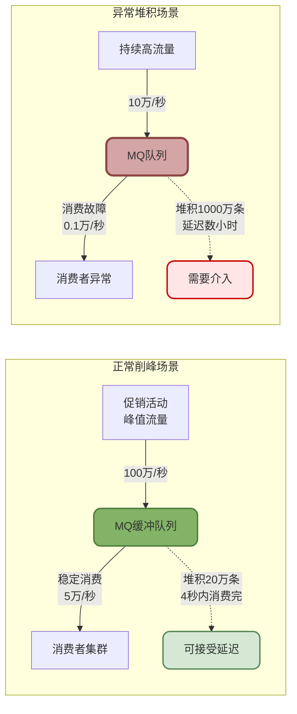
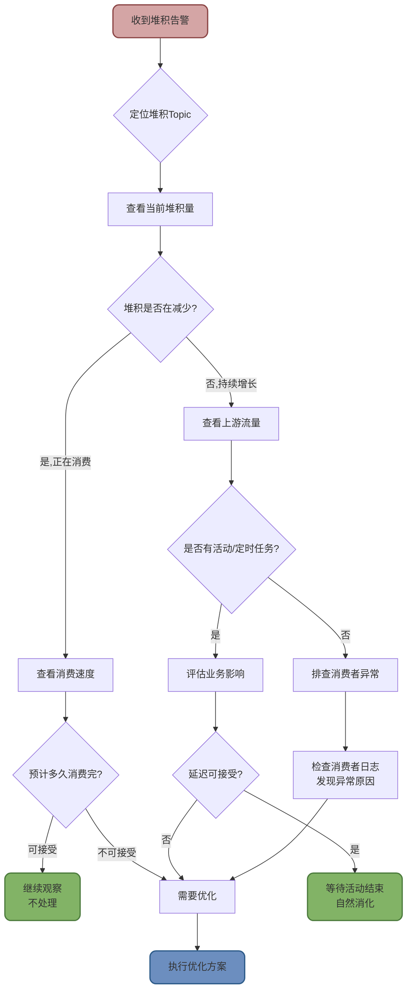
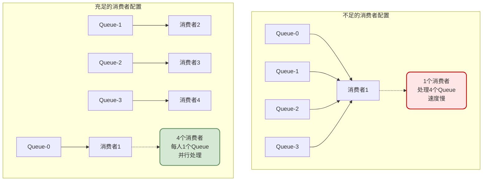
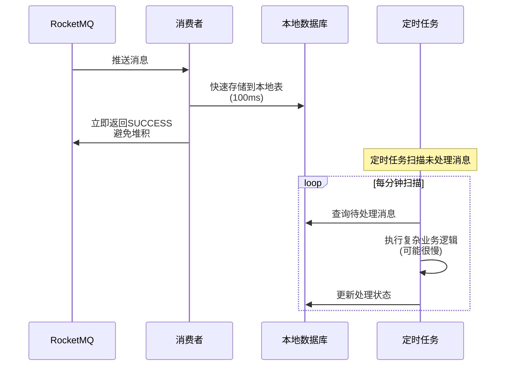
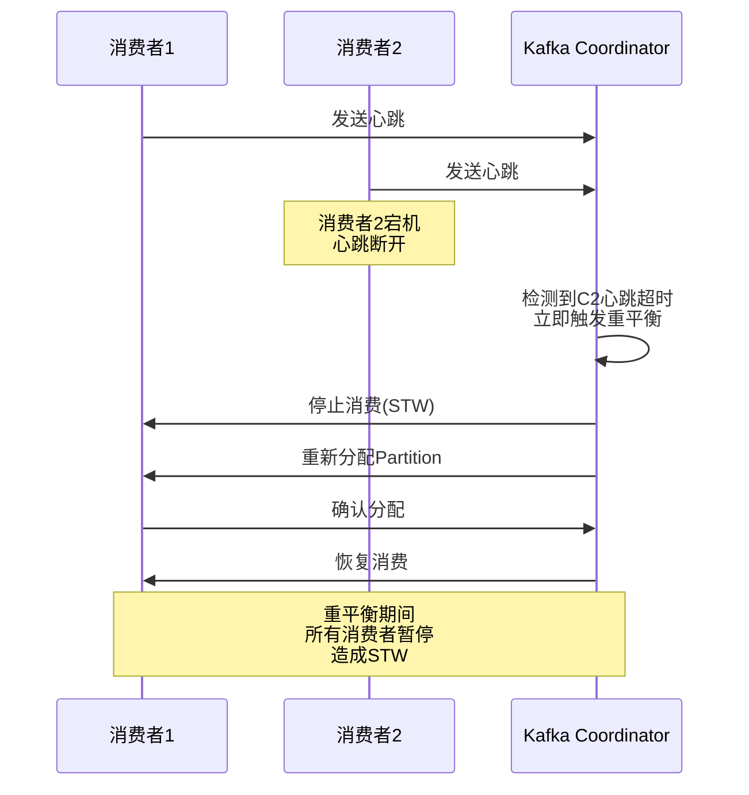
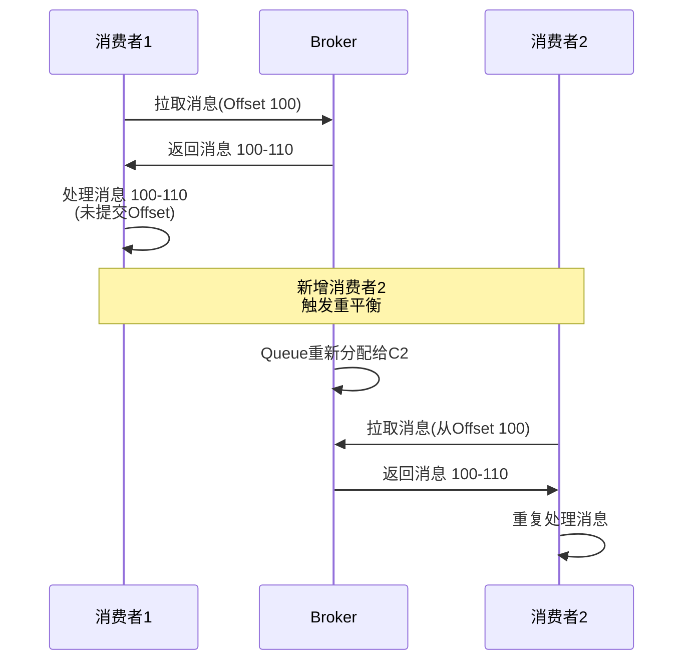
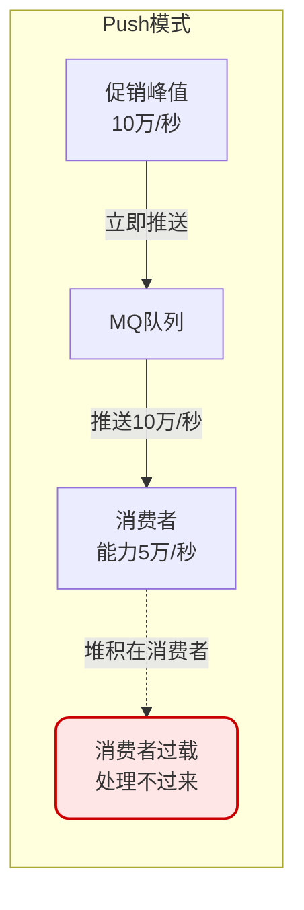
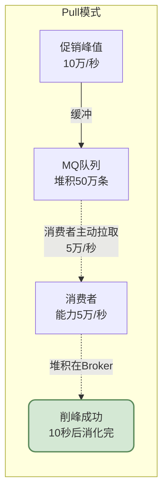

# RocketMQ性能优化与故障处理

## 消息堆积问题分析与解决

消息堆积是生产环境中最常见的MQ问题之一。虽然消息队列的核心价值就是"削峰填谷",但过度堆积会导致消息延迟、磁盘占用等问题,需要及时排查处理。

### 消息堆积的正确认知

首先需要明确:**MQ堆积是正常现象,不一定需要立即解决**。



MQ的作用就是在峰值流量时接收消息,然后让消费者按照自己的节奏慢慢消费。短时间的堆积是正常的,只要消费速度跟得上,堆积量会逐渐减少。

### 消息堆积的排查流程

当收到堆积告警时,应该按照以下步骤进行排查:



#### 排查步骤详解

**步骤1: 定位具体Topic和堆积量**

通过RocketMQ Console或监控系统查看:
- 哪个Topic堆积了?
- 当前堆积多少条消息?
- 堆积的消费者组是哪个?

```bash
# 使用mqadmin命令查看消费者组堆积情况
sh mqadmin consumerProgress -n 192.168.1.100:9876 -g order_consumer_group

# 输出示例:
# Topic: ORDER_TOPIC
# Queue: 0  Broker Offset: 1000000  Consumer Offset: 800000  Diff: 200000
# Queue: 1  Broker Offset: 1050000  Consumer Offset: 850000  Diff: 200000
# Total Diff: 400000  (总堆积40万条)
```

**步骤2: 判断堆积趋势**

观察5-10分钟,看堆积量是在增加还是减少:
- **减少**: 说明消费者正在消费,只是速度慢,可能不需要处理
- **增加或持平**: 说明消费速度跟不上生产速度,或者消费者故障

**步骤3: 分析上游流量**

查看生产者的发送速率:
- 是否有营销活动导致流量激增?
- 是否有定时任务在集中发送消息?
- 是否有异常流量(如重复发送、死循环)?

**步骤4: 评估业务影响**

根据业务特性,评估延迟的可接受程度:
- **订单消息**: 分钟级延迟一般可接受
- **支付回调**: 需要秒级处理
- **日志上报**: 小时级延迟也无妨

**步骤5: 决定是否介入**

综合以上信息,判断是否需要优化:
- 堆积在减少 + 延迟可接受 → 不处理
- 活动流量 + 临时堆积 → 等待自然消化
- 消费者故障 + 延迟不可接受 → 需要优化

### 消息堆积的根本原因

堆积的本质是**消费速度 < 生产速度**,常见原因包括:

#### 原因1: 消费逻辑中存在慢操作

```java
// 问题代码:消费过程中执行慢SQL
public ConsumeConcurrentlyStatus consumeMessage(List<MessageExt> msgs, ...) {
    for (MessageExt msg : msgs) {
        String orderId = new String(msg.getBody());
        
        // 慢SQL:未建索引的条件查询,耗时500ms
        List<OrderItem> items = orderItemDao.selectByCondition(
            "SELECT * FROM order_item WHERE order_id = ? AND status = ?", 
            orderId, "PENDING"
        );
        
        // 如果每条消息处理500ms,消费速度只有2条/秒
        // 远远跟不上生产速度
    }
    return ConsumeConcurrentlyStatus.CONSUME_SUCCESS;
}
```

**影响**: 随着数据量增长,SQL越来越慢,消费速度持续下降。

#### 原因2: 调用外部服务RT过长

```java
// 问题代码:调用超慢的外部接口
public ConsumeConcurrentlyStatus consumeMessage(List<MessageExt> msgs, ...) {
    for (MessageExt msg : msgs) {
        String userId = new String(msg.getBody());
        
        // 调用第三方接口,平均耗时2秒
        UserInfo userInfo = externalService.getUserInfo(userId);
        
        // 如果外部服务RT是2秒,消费速度只有0.5条/秒
        // 严重堆积
    }
    return ConsumeConcurrentlyStatus.CONSUME_SUCCESS;
}
```

**影响**: 外部服务性能波动直接影响消费速度,且不可控。

#### 原因3: 消息批量处理不当

```java
// 问题代码:单条拉取消息
consumer.setConsumeMessageBatchMaxSize(1);  // 每次只拉1条

// 导致频繁网络交互,吞吐量低
```

**影响**: 每次只拉取1条消息,网络开销占比大,整体吞吐量低。

#### 原因4: 消费线程池配置过小

```java
// 问题代码:线程池太小
consumer.setConsumeThreadMin(1);   // 最小1个线程
consumer.setConsumeThreadMax(5);   // 最大5个线程

// 大量消息只有5个线程在处理,并发度不足
```

**影响**: 并发处理能力不足,无法充分利用硬件资源。

#### 原因5: 消费者实例数不足



### 消息堆积的解决方案

#### 临时方案: 紧急扩容

当堆积严重且业务无法接受延迟时,最快的方案是增加消费者实例。

```bash
# 1. 水平扩容:增加消费者实例数
# 假设原来只有2个消费者实例,扩容到8个

# 2. 触发重平衡,Queue重新分配
# 原来:2个消费者,每人负责2个Queue
# 扩容后:8个消费者,部分消费者负责1个Queue,部分空闲

# 3. 消费速度提升
# 2个实例消费速度: 2万条/秒
# 8个实例消费速度: 8万条/秒 (理想情况)
```

**注意事项**:
- 消费者数量不要超过Queue数量,否则多余的消费者空闲
- 扩容前确认下游服务能承受更高的并发
- 扩容后密切观察堆积趋势和下游服务指标

#### 长期方案1: 优化慢SQL

针对慢SQL问题,可以采取以下优化:

```java
// 优化前:全表扫描
List<OrderItem> items = orderItemDao.selectByCondition(
    "SELECT * FROM order_item WHERE order_id = ? AND status = ?", 
    orderId, "PENDING"
);

// 优化方案1:添加索引
// ALTER TABLE order_item ADD INDEX idx_order_status (order_id, status);

// 优化方案2:只查询必要字段
List<OrderItem> items = orderItemDao.selectFields(
    "SELECT id, product_id, quantity FROM order_item WHERE order_id = ? AND status = ?", 
    orderId, "PENDING"
);

// 优化方案3:数据归档,减少表数据量
// 将历史数据迁移到归档表,保持主表数据量在可控范围

// 优化方案4:分库分表
// 按order_id进行分库分表,单表数据量降低,查询速度提升
```

#### 长期方案2: 批量消费+批量处理

提升消息拉取和处理的批量度。

```java
// 优化配置
consumer.setConsumeMessageBatchMaxSize(32);  // 每次拉取32条消息
consumer.setPullBatchSize(64);  // 一次Pull请求拉取64条

consumer.registerMessageListener(new MessageListenerConcurrently() {
    public ConsumeConcurrentlyStatus consumeMessage(
            List<MessageExt> msgs,  // msgs可能包含多条消息
            ConsumeConcurrentlyContext context) {
        
        // 批量解析
        List<String> orderIds = msgs.stream()
            .map(msg -> new String(msg.getBody()))
            .collect(Collectors.toList());
        
        // 批量查询数据库,减少SQL执行次数
        List<Order> orders = orderDao.selectBatchByIds(orderIds);
        
        // 批量更新
        orderDao.updateBatch(orders);
        
        return ConsumeConcurrentlyStatus.CONSUME_SUCCESS;
    }
});
```

**性能对比**:
- 单条处理: 1条消息1次DB交互,32条消息需要32次,总耗时 = 32 * 10ms = 320ms
- 批量处理: 32条消息1次DB交互,总耗时 = 1 * 50ms = 50ms

吞吐量提升 6倍以上。

#### 长期方案3: 引入线程池并发消费

对于单条消息处理耗时长的场景,可以在消费者内部引入线程池进行并发处理。

```java
// 创建线程池
private ExecutorService executor = new ThreadPoolExecutor(
    20, 50, 60, TimeUnit.SECONDS,
    new LinkedBlockingQueue<>(1000),
    new ThreadFactoryBuilder().setNameFormat("msg-process-%d").build()
);

consumer.registerMessageListener((msgs, context) -> {
    // 使用CountDownLatch等待所有任务完成
    CountDownLatch latch = new CountDownLatch(msgs.size());
    
    for (MessageExt msg : msgs) {
        executor.submit(() -> {
            try {
                // 并发处理消息
                processMessage(msg);
            } finally {
                latch.countDown();
            }
        });
    }
    
    try {
        // 等待所有消息处理完成
        latch.await(5, TimeUnit.MINUTES);
        return ConsumeConcurrentlyStatus.CONSUME_SUCCESS;
    } catch (InterruptedException e) {
        return ConsumeConcurrentlyStatus.RECONSUME_LATER;
    }
});
```

**注意事项**:
- 需要处理部分消息成功、部分失败的情况
- 控制线程池大小,避免OOM
- 适合IO密集型任务,CPU密集型任务效果有限

#### 长期方案4: 先收单,后异步处理

对于处理逻辑复杂、耗时长的场景,可以采用"快速确认+异步处理"模式。



**代码实现**:

```java
// 消费者:快速落库
public ConsumeConcurrentlyStatus consumeMessage(List<MessageExt> msgs, ...) {
    for (MessageExt msg : msgs) {
        // 构造本地消息记录
        LocalMessage localMsg = new LocalMessage();
        localMsg.setMsgId(msg.getMsgId());
        localMsg.setTopic(msg.getTopic());
        localMsg.setBody(new String(msg.getBody()));
        localMsg.setStatus("PENDING");  // 待处理
        localMsg.setCreateTime(new Date());
        
        // 插入本地数据库,耗时很短
        localMessageDao.insert(localMsg);
    }
    
    // 立即返回成功,消息不在MQ堆积
    return ConsumeConcurrentlyStatus.CONSUME_SUCCESS;
}

// 定时任务:异步处理
@Scheduled(cron = "0 */1 * * * ?")  // 每分钟执行一次
public void processLocalMessages() {
    // 查询待处理消息,限制数量避免过载
    List<LocalMessage> messages = localMessageDao.selectPending(100);
    
    for (LocalMessage msg : messages) {
        try {
            // 执行复杂业务逻辑,可能很慢
            processComplexBusiness(msg.getBody());
            
            // 处理成功,更新状态
            localMessageDao.updateStatus(msg.getId(), "SUCCESS");
        } catch (Exception e) {
            // 处理失败,记录错误,后续重试
            localMessageDao.updateStatus(msg.getId(), "FAILED");
            localMessageDao.updateErrorMsg(msg.getId(), e.getMessage());
        }
    }
}
```

**优势**:
- MQ消费速度快,不会堆积
- 即使业务处理失败,消息也在数据库中,可以通过定时任务重试
- 解耦了消息接收和业务处理,降低了系统复杂度

#### 长期方案5: 降低生产速度(慎用)

如果生产者可控,可以考虑降低发送速率。

```java
// 在生产者端限流
private RateLimiter rateLimiter = RateLimiter.create(1000);  // 每秒最多1000条

public void sendMessage(Message msg) {
    // 获取令牌,超过限流则阻塞
    rateLimiter.acquire();
    
    producer.send(msg);
}
```

**适用场景**: 非核心业务,对实时性要求不高的场景。

#### 长期方案6: 清理过期消息(慎用)

对于某些过期消息,经过业务评估后,可以直接清理。

```bash
# 删除指定Topic的所有消息(危险操作!)
sh mqadmin deleteTopic -n 192.168.1.100:9876 -c DefaultCluster -t OLD_TOPIC

# 仅删除超过保留时间的消息(RocketMQ会自动删除,也可手动触发)
sh mqadmin cleanExpiredCQ -n 192.168.1.100:9876 -c DefaultCluster
```

**注意**: 删除消息前必须经过业务方确认,避免误删重要数据。

## RocketMQ重平衡机制

重平衡(Rebalance)是指当消费者组内的消费者数量发生变化时,重新分配Topic的MessageQueue给各个消费者的过程。

### RocketMQ与Kafka重平衡的对比

#### Kafka的重平衡问题

Kafka采用**心跳检测+实时重平衡**机制:



**Kafka重平衡的问题**:
- **STW(Stop The World)**: 重平衡期间,所有消费者停止消费,导致消息堆积
- **频繁触发**: 网络抖动、消费超时等都会触发重平衡
- **影响面大**: 一个消费者的问题,导致整个消费者组都受影响

#### RocketMQ的重平衡优化

RocketMQ采用**定时检测+局部调整**机制:

```java
// RocketMQ源码:定时重平衡
private static long waitInterval = 20000;  // 默认20秒

@Override
public void run() {
    while (!this.isStopped()) {
        // 等待20秒
        this.waitForRunning(waitInterval);
        
        // 执行重平衡
        this.mqClientFactory.doRebalance();
    }
}
```

**RocketMQ重平衡的优势**:

**1. 定时触发,避免频繁重平衡**

每20秒检测一次,而不是实时检测。即使网络短暂抖动,也不会立即触发重平衡,避免了Kafka的频繁重平衡问题。

**缺点**: 消费者宕机后,最多需要20秒才能触发重平衡,这段时间内消息会堆积。

**2. 局部调整,减少STW影响**

RocketMQ默认采用**局部重平衡**策略。当消费者变化时,只有受影响的消费者会重新分配Queue,其他消费者不受影响。

```mermaid
graph TB
    subgraph 消费者组(4个Queue)
        Q1[Queue-0] --> C1[消费者1]
        Q2[Queue-1] --> C2[消费者2<br/>宕机]
        Q3[Queue-2] --> C3[消费者3]
        Q4[Queue-3] --> C4[消费者4]
    end
    
    subgraph 重平衡后
        Q5[Queue-0] --> C5[消费者1<br/>不变]
        Q6[Queue-1] --> C6[消费者3<br/>接管Queue-1]
        Q7[Queue-2] --> C7[消费者3<br/>继续Queue-2]
        Q8[Queue-3] --> C8[消费者4<br/>不变]
    end
    
    style C2 fill:#FFE6E6,stroke:#CC0000,stroke-width:2px,rx:10,ry:10
    style C5 fill:#82B366,stroke:#4D7C3E,stroke-width:2px,rx:10,ry:10
    style C6 fill:#6C8EBF,stroke:#2E5C8A,stroke-width:2px,rx:10,ry:10
    style C7 fill:#6C8EBF,stroke:#2E5C8A,stroke-width:2px,rx:10,ry:10
    style C8 fill:#82B366,stroke:#4D7C3E,stroke-width:2px,rx:10,ry:10
```

消费者1和消费者4不受影响,继续消费;只有消费者3需要接管Queue-1,进行局部调整。

**3. 异步拉取+本地队列,降低STW**

RocketMQ的消费者采用**异步拉取**机制,消息先拉取到本地的ProcessQueue,然后由消费线程从本地队列中取消息处理。

即使发生重平衡,只要重平衡时间足够短,消费线程仍然可以继续处理本地队列中的消息,几乎感知不到停顿。

```java
// RocketMQ的消费流程
1. PullMessageService不断从Broker拉取消息
2. 拉取到的消息放入本地ProcessQueue
3. 消费线程从ProcessQueue中取消息处理

// 重平衡发生时
1. 暂停拉取新消息
2. 消费线程继续处理ProcessQueue中的存量消息
3. 重平衡完成,恢复拉取

// 如果重平衡耗时 < ProcessQueue中的消息处理时间
// 则消费线程不会感知到停顿,实现了零STW
```

### 重平衡可能导致的问题

#### 问题1: 消息重复消费



**解决方案**: 通过幂等性设计避免重复消费的影响。

#### 问题2: 消费延迟

重平衡期间,部分Queue可能暂停消费,导致消息堆积和延迟增加。

**解决方案**: 
- 避免频繁增删消费者
- 增加Queue数量,降低单个Queue的影响
- 监控重平衡频率,及时发现异常

## MQ削峰填谷的正确使用

很多人认为"用了MQ就能削峰",但实际上,**MQ削峰的效果取决于消费模式**。

### Push模式的削峰局限



Push模式下,Broker会立即将消息推送给消费者。如果消费者处理能力不足,消息会堆积在消费者端,甚至导致消费者OOM或处理失败。

处理失败的消息会重新投递,进一步加剧消费者压力,形成恶性循环。

### Pull模式的削峰效果



Pull模式下,消费者根据自己的处理能力主动拉取消息。消息堆积在Broker端,消费者按照自己的节奏慢慢消费,真正起到了削峰的作用。

### 削峰的最佳实践

```java
// 使用Pull模式消费者
DefaultLitePullConsumer consumer = new DefaultLitePullConsumer("pull_consumer");
consumer.setNamesrvAddr("192.168.1.100:9876");
consumer.subscribe("ORDER_TOPIC", "*");

// 控制每次拉取的数量,避免一次性拉取过多
consumer.setPullBatchSize(50);

consumer.start();

while (true) {
    // 主动拉取消息
    List<MessageExt> messages = consumer.poll(5000);
    
    if (messages.isEmpty()) {
        continue;
    }
    
    // 根据当前负载动态调整处理速度
    int currentLoad = getCurrentSystemLoad();
    
    if (currentLoad > 80) {
        // 系统负载高,减缓处理速度
        Thread.sleep(5000);
    } else if (currentLoad < 50) {
        // 系统负载低,加快处理速度
        Thread.sleep(100);
    }
    
    // 批量处理消息
    processBatch(messages);
    
    // 手动提交Offset
    consumer.commitSync();
}
```

:::tip 削峰填谷的关键
- **使用Pull模式**: 消费者主动控制拉取速度
- **根据负载调整**: 动态调整消息拉取和处理速度
- **批量处理**: 提升单次处理的效率
- **监控堆积**: 及时发现和处理异常堆积
:::

## 性能优化最佳实践总结

### Broker端优化

```properties
# broker.conf性能优化配置

# 刷盘策略:异步刷盘,提升性能
flushDiskType=ASYNC_FLUSH

# 主从同步:异步复制,降低延迟
brokerRole=ASYNC_MASTER

# 消息存储:使用SSD磁盘,提升IO性能
storePathRootDir=/data/rocketmq/store

# 发送线程池:增加线程数,提升并发
sendMessageThreadPoolNums=16

# 拉取线程池:增加线程数
pullMessageThreadPoolNums=16

# 刷盘线程数:增加批量刷盘能力
flushConsumeQueueThoroughInterval=1000
```

### 生产者端优化

```java
DefaultMQProducer producer = new DefaultMQProducer("producer_group");

// 发送超时时间
producer.setSendMsgTimeout(3000);

// 失败重试次数
producer.setRetryTimesWhenSendFailed(2);

// 压缩消息,减少网络传输
producer.setCompressMsgBodyOverHowmuch(4096);  // 超过4KB压缩

// 批量发送,提升吞吐量
List<Message> messages = new ArrayList<>();
for (int i = 0; i < 100; i++) {
    messages.add(new Message("TOPIC", "TAG", ("msg-" + i).getBytes()));
}
producer.send(messages);  // 批量发送
```

### 消费者端优化

```java
DefaultMQPushConsumer consumer = new DefaultMQPushConsumer("consumer_group");

// 批量拉取
consumer.setConsumeMessageBatchMaxSize(32);
consumer.setPullBatchSize(64);

// 增加消费线程池
consumer.setConsumeThreadMin(20);
consumer.setConsumeThreadMax(50);

// 拉取间隔
consumer.setPullInterval(0);  // 立即拉取,提升实时性

// 拉取阈值
consumer.setPullThresholdForQueue(1000);  // 本地队列最多缓存1000条
```

### 监控与告警

建立完善的监控体系:

```yaml
监控指标:
  生产端:
    - 发送TPS
    - 发送失败率
    - 发送RT(响应时间)
  
  Broker端:
    - 磁盘使用率
    - CPU使用率
    - 内存使用率
    - 消息堆积量
  
  消费端:
    - 消费TPS
    - 消费延迟
    - 消费失败率
    - 重平衡次数

告警策略:
  - 消息堆积 > 10万条
  - 消费延迟 > 5分钟
  - 消费失败率 > 1%
  - Broker磁盘使用率 > 80%
```

通过持续监控和优化,确保RocketMQ集群稳定高效运行。
