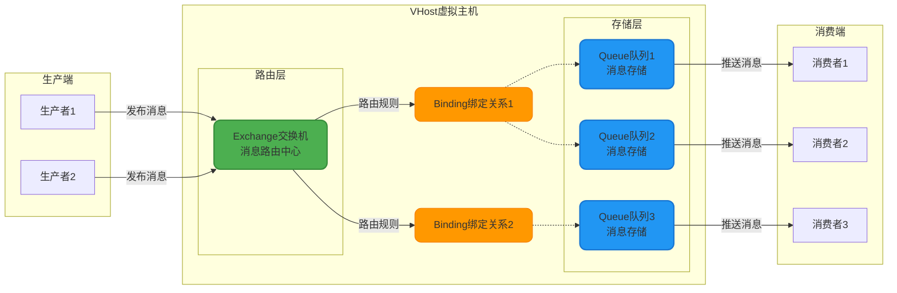
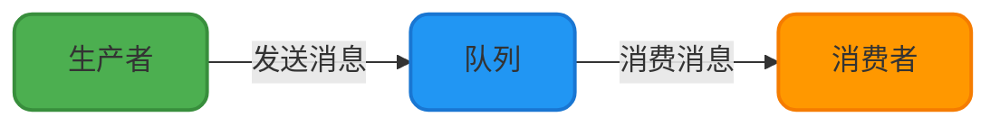
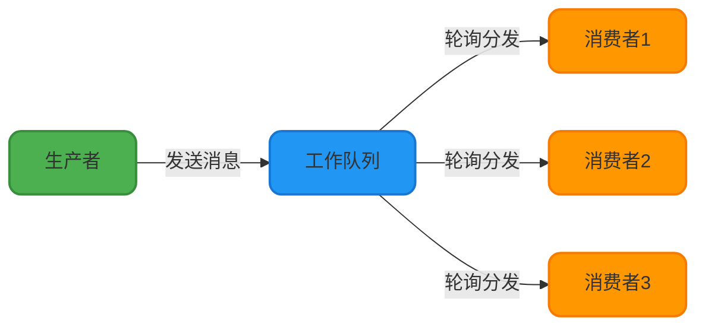
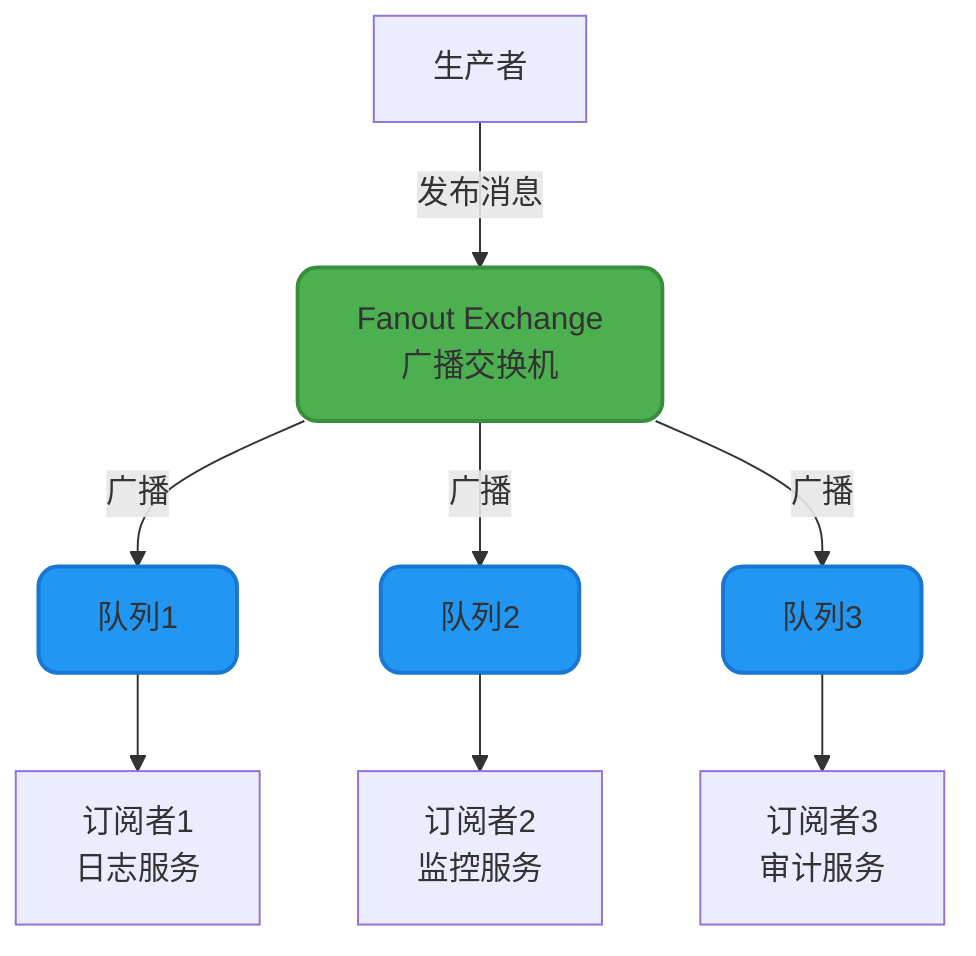
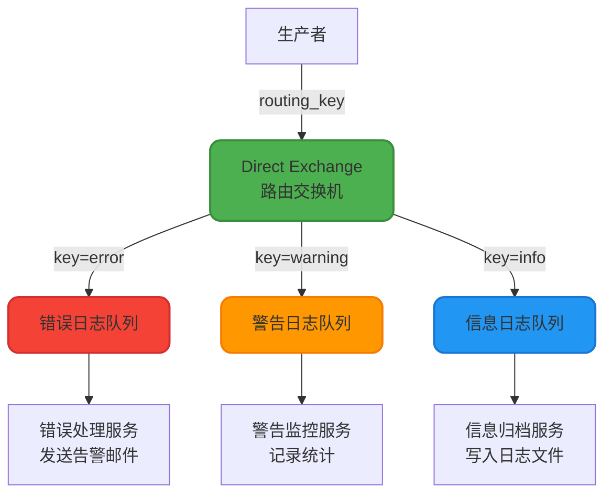
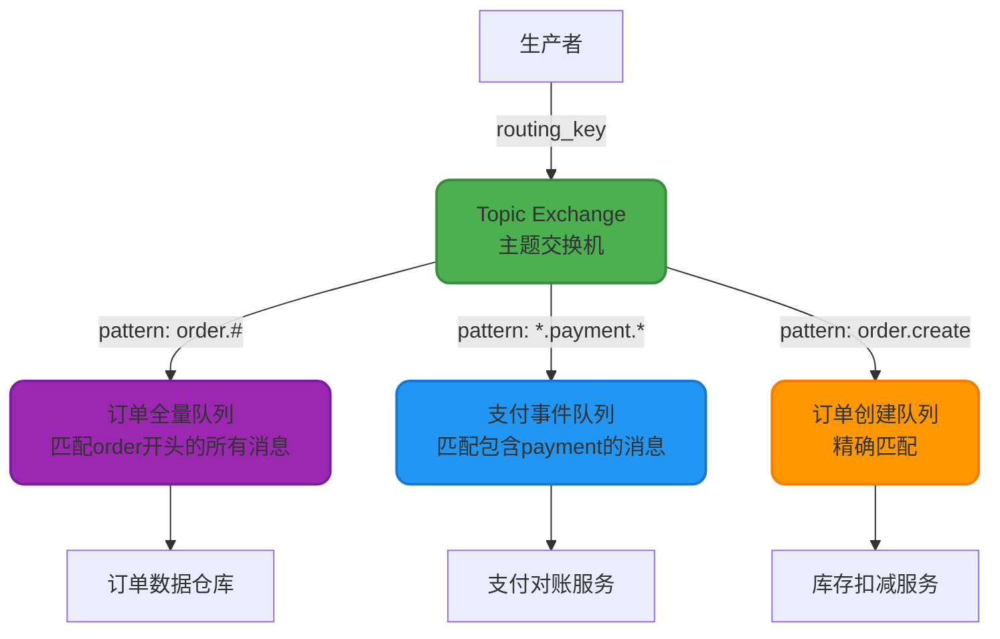
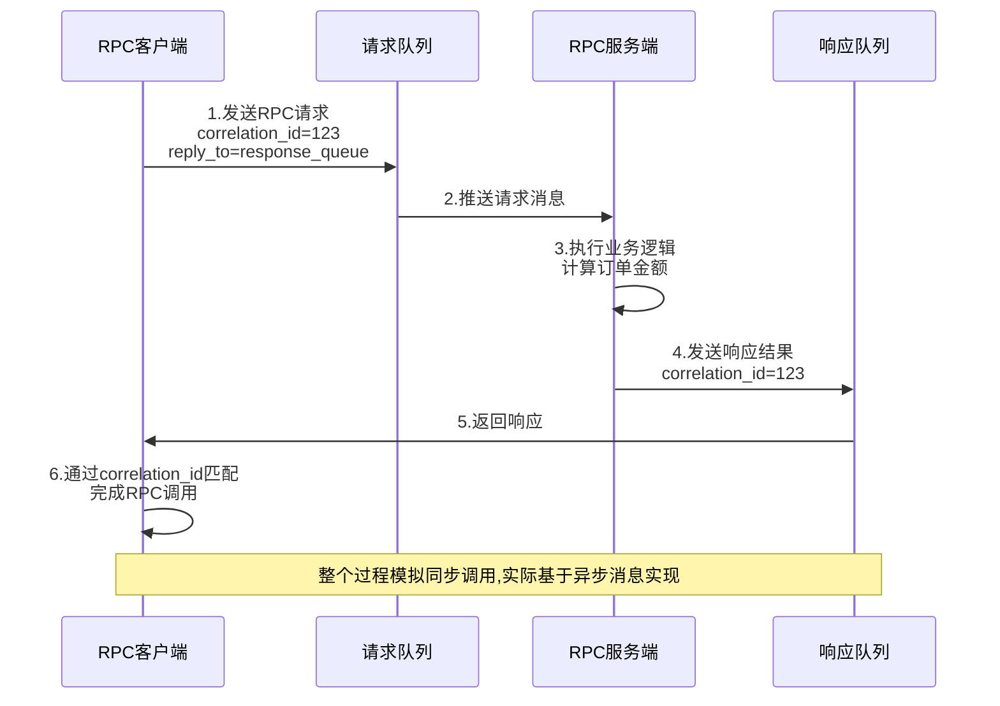

## RabbitMQ核心架构解析

RabbitMQ是一款基于AMQP(高级消息队列协议)的开源消息中间件,广泛应用于微服务架构中的异步通信场景。它同时支持STOMP(简单文本定向消息协议)和MQTT(物联网协议)等多种消息传递标准,为分布式系统提供了可靠的消息传递能力。

### 整体架构设计

RabbitMQ采用经典的生产者-消费者模式,通过Exchange(交换机)和Queue(队列)的解耦设计,实现了灵活的消息路由机制。下图展示了RabbitMQ的核心组件及其交互关系:

### 核心组件详解

#### Producer(生产者)

生产者是消息的发送端,负责创建消息并发布到Exchange。生产者在发送消息时需要指定:
- 目标Exchange的名称
- Routing Key(路由键)用于消息路由
- 消息内容和属性(如持久化标记、优先级等)

#### VHost(虚拟主机)

VHost是RabbitMQ中的资源隔离单元,类似于操作系统的命名空间机制。每个VHost拥有独立的:
- Exchange交换机集合
- Queue队列集合
- Binding绑定关系
- 权限控制策略

不同VHost之间的资源完全隔离,适合多租户场景或区分不同业务模块,避免消息冲突和资源竞争。

#### Exchange(交换机)

交换机是消息路由的核心组件,接收生产者发送的消息并根据路由规则分发到对应的队列。Exchange本身不存储消息,仅负责消息的转发逻辑。

#### Queue(队列)

队列是消息的实际存储单元,采用FIFO(先进先出)方式管理消息。队列持有未被消费的消息,等待消费者拉取或由服务器主动推送。队列支持持久化、排他性、自动删除等多种配置选项。

#### Binding(绑定关系)

Binding定义了Exchange与Queue之间的关联规则,通过Binding Key来匹配消息的Routing Key。一个Exchange可以绑定多个Queue,一个Queue也可以被多个Exchange绑定,构成灵活的消息路由网络。

#### Consumer(消费者)

消费者从队列中获取消息并处理业务逻辑。RabbitMQ支持两种消费模式:
- **推模式(Push)**: 服务器主动推送消息到消费者
- **拉模式(Pull)**: 消费者主动从队列拉取消息

## 六大工作模式详解

RabbitMQ提供了6种消息分发模式,分别适用于不同的业务场景。掌握这些模式是构建高效消息系统的基础。

### 简单模式(Simple Mode)

最基础的点对点通信模式,一个生产者发送消息到队列,一个消费者从队列获取并处理消息。消息处理是同步串行的,适用于简单的异步任务场景。

**典型应用**: 邮件发送、短信通知等单一任务处理。

### 工作队列模式(Work Queue Mode)

也称为竞争消费者模式,多个消费者并发处理同一队列的消息,每条消息仅被一个消费者处理。这种模式实现了任务的负载均衡,显著提升系统吞吐量。

**典型应用**: 图片压缩、视频转码、批量数据处理等计算密集型任务。

**关键配置**: 通过`prefetch`设置消费者预取数量,避免能力强的消费者闲置,能力弱的消费者过载。

### 发布/订阅模式(Publish/Subscribe Mode)

使用Fanout类型的Exchange实现消息广播,一条消息被复制到所有绑定的队列,每个订阅者都能收到完整的消息副本。这是典型的一对多通信模式。

**典型应用**: 
- 系统日志分发(同时写入文件、数据库、监控平台)
- 订单状态变更通知(库存、积分、消息推送等多个子系统)
- 事件驱动架构中的领域事件广播

### 路由模式(Routing Mode)

采用Direct类型的Exchange,根据消息的Routing Key精确匹配到对应的队列。只有Routing Key与Binding Key完全一致时,消息才会路由到目标队列。

**典型应用**: 
- 日志分级处理(按ERROR、WARN、INFO路由到不同处理器)
- 订单类型路由(普通订单、秒杀订单、预售订单分别处理)

### 主题模式(Topic Mode)

Topic类型的Exchange支持通配符匹配,提供了比路由模式更灵活的消息筛选能力。Routing Key采用点号(.)分隔的多段格式,支持以下通配符:
- `*`: 匹配一个单词
- `#`: 匹配零个或多个单词

**典型应用**:
- 微服务事件总线(按业务域和事件类型灵活订阅)
- IoT设备消息路由(按设备类型、地域、状态组合筛选)

**示例路由规则**:
- `order.create` → 匹配订单创建事件
- `order.*` → 匹配order.create、order.update、order.cancel
- `*.payment.success` → 匹配user.payment.success、order.payment.success
- `order.#` → 匹配order.create、order.payment.success、order.shipping.notify等所有以order开头的消息

### RPC模式(Remote Procedure Call)

基于RabbitMQ实现同步远程调用能力,客户端发送请求消息到请求队列,服务端处理后将结果发送到回复队列,客户端通过关联ID(Correlation ID)匹配请求和响应。

**实现要点**:
- 客户端为每个请求生成唯一的`correlation_id`
- 在请求消息中设置`reply_to`属性指定响应队列
- 服务端处理完成后,将`correlation_id`原样返回
- 客户端通过`correlation_id`关联请求和响应

**典型应用**: 微服务间需要同步等待结果的场景,如计价服务、风控审核等。

**注意**: RPC模式增加了系统复杂度,通常不建议使用。在微服务架构中,更推荐使用HTTP/gRPC进行同步调用,或采用异步事件驱动模式解耦服务依赖。

## 模式选型指南

| 工作模式 | 适用场景 | 消息特点 | 性能特征 |
|---------|---------|---------|----------|
| 简单模式 | 单一任务异步处理 | 点对点,一对一 | 简单高效 |
| 工作队列 | 任务负载均衡 | 点对点,一对多(竞争) | 高吞吐 |
| 发布订阅 | 消息广播,多系统联动 | 一对多(复制) | 消息放大 |
| 路由模式 | 消息分类处理 | 基于key精确匹配 | 灵活路由 |
| 主题模式 | 复杂规则过滤 | 支持通配符 | 最灵活 |
| RPC模式 | 远程同步调用 | 请求-响应模式 | 复杂度高 |

更多实现细节和代码示例可参考RabbitMQ官方文档: [https://www.rabbitmq.com/getstarted.html](https://www.rabbitmq.com/getstarted.html)
