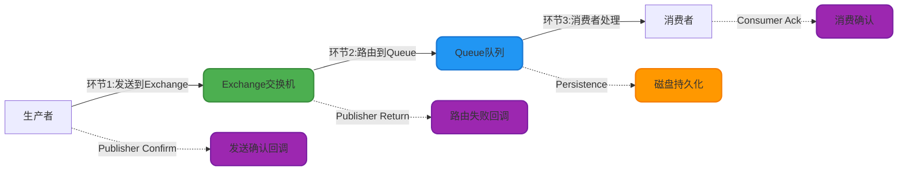
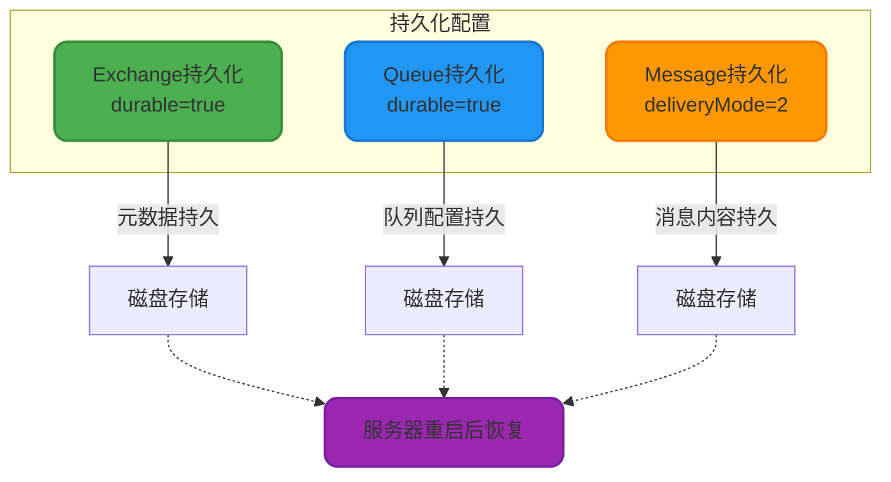
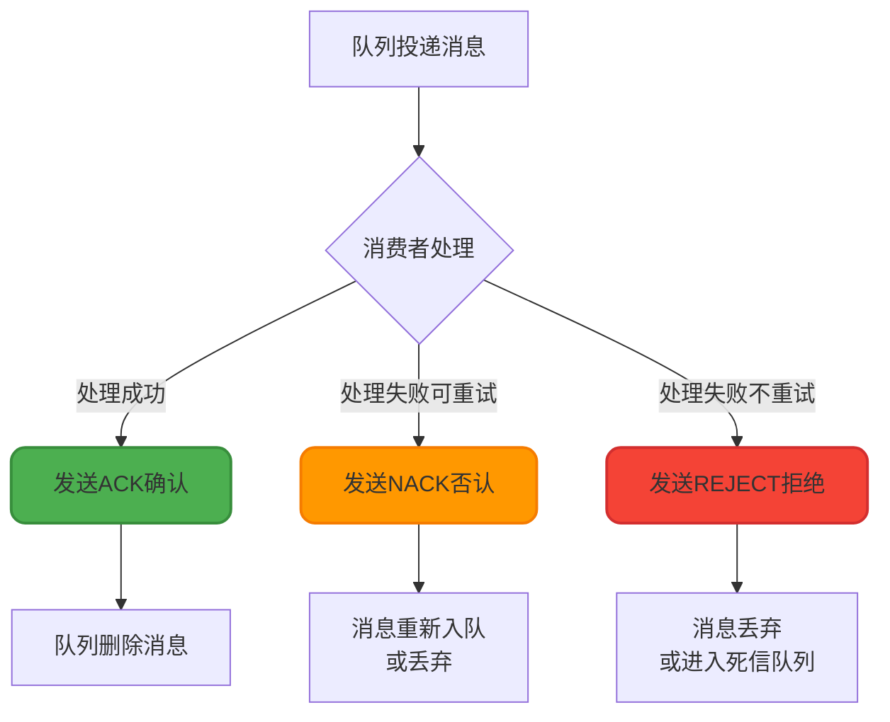
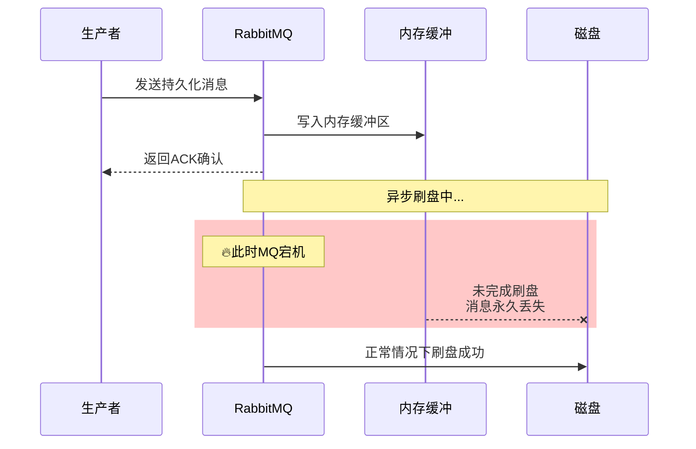
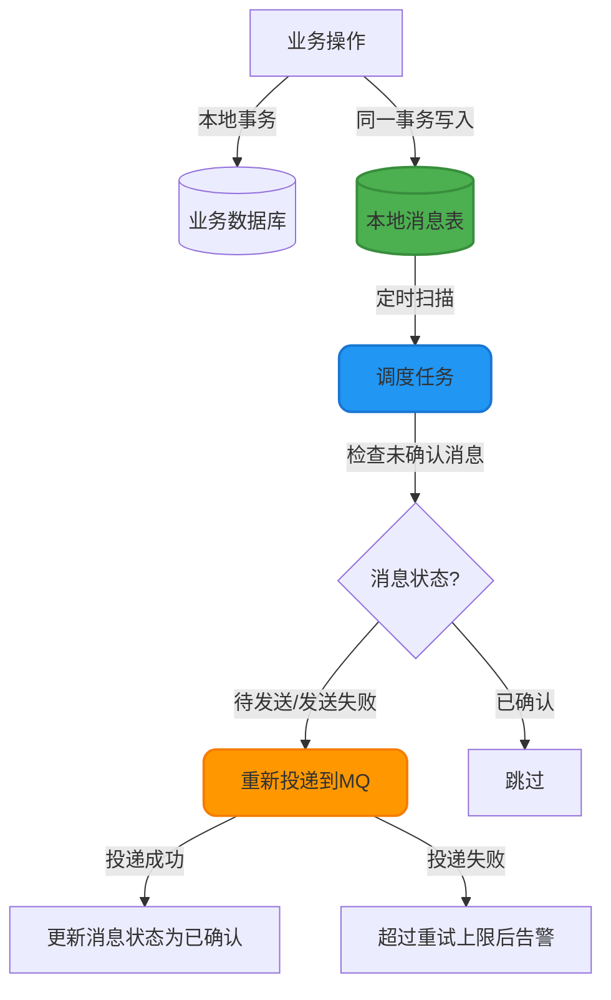

# 消息可靠性保障机制

## 消息可靠性的三个关键环节

在分布式系统中,消息丢失会导致数据不一致、业务逻辑中断等严重问题。RabbitMQ的消息投递链路包括三个关键环节,每个环节都需要相应的机制来保障可靠性:



## 生产端可靠性保障

生产者需要确保消息成功投递到RabbitMQ服务器,主要通过Confirm机制实现。RabbitMQ提供了两种确认机制来覆盖不同的失败场景。

### Publisher Confirm - 投递到Exchange确认

Publisher Confirm机制确保消息成功到达Exchange并被处理。一旦Exchange接收并处理消息,RabbitMQ会向生产者发送ACK确认信号;如果Exchange不存在或消息处理失败,则发送NACK否认信号。

**核心实现步骤**:

```java
import com.rabbitmq.client.*;

public class ReliableProducer {
    
    public void sendWithConfirm() throws Exception {
        ConnectionFactory factory = new ConnectionFactory();
        factory.setHost("localhost");
        
        try (Connection connection = factory.newConnection();
             Channel channel = connection.createChannel()) {
            
            // 1. 启用Publisher Confirms机制
            channel.confirmSelect();
            
            // 2. 注册确认回调监听器
            channel.addConfirmListener(new ConfirmListener() {
                @Override
                public void handleAck(long deliveryTag, boolean multiple) {
                    System.out.println("消息投递成功,deliveryTag: " + deliveryTag);
                    // 在这里可以记录成功日志,清理本地缓存等
                }
                
                @Override
                public void handleNack(long deliveryTag, boolean multiple) {
                    System.err.println("消息投递失败,deliveryTag: " + deliveryTag);
                    // 在这里进行重试逻辑或报警通知
                    retryOrAlert(deliveryTag);
                }
            });
            
            // 3. 发送消息
            String exchangeName = "product_exchange";
            String routingKey = "product.create";
            String message = "{\"productId\":10086,\"name\":\"智能手表\"}";
            
            channel.basicPublish(exchangeName, routingKey, null, message.getBytes());
            
            // 4. 等待确认(同步方式)
            if (!channel.waitForConfirms()) {
                System.err.println("消息确认超时或失败!");
            }
        }
    }
    
    private void retryOrAlert(long deliveryTag) {
        // 实现重试策略(如指数退避)或发送告警
    }
}
```

### Publisher Return - 路由到Queue失败通知

Publisher Return机制处理消息无法路由到任何队列的情况。当Exchange找不到匹配的队列时,会将消息返回给生产者,但如果路由成功则不触发回调。

**关键配置**: 发送消息时必须设置`mandatory=true`,否则路由失败的消息会被直接丢弃。

```java
// 1. 注册Return回调监听器
channel.addReturnListener(new ReturnListener() {
    @Override
    public void handleReturn(int replyCode, String replyText, 
                            String exchange, String routingKey,
                            AMQP.BasicProperties properties, byte[] body) {
        System.err.println("消息路由失败 - " +
            "Exchange: " + exchange + 
            ", RoutingKey: " + routingKey +
            ", 原因: " + replyText);
        
        // 处理路由失败的消息,如记录到数据库或重新发送
        handleRoutingFailure(exchange, routingKey, body);
    }
});

// 2. 发送消息时启用mandatory标志
String message = "{\"orderId\":20001,\"amount\":299.00}";
channel.basicPublish("order_exchange", "order.payment", 
                     true,  // mandatory=true,路由失败会触发Return回调
                     null, 
                     message.getBytes());
```

### 完整的可靠发送示例

```java
import com.rabbitmq.client.*;
import java.io.IOException;

public class FullReliableProducer {
    
    public static void main(String[] args) throws Exception {
        ConnectionFactory factory = new ConnectionFactory();
        factory.setHost("localhost");
        
        try (Connection connection = factory.newConnection();
             Channel channel = connection.createChannel()) {
            
            // 启用发送确认
            channel.confirmSelect();
            
            // 注册Confirm回调
            channel.addConfirmListener(new ConfirmListener() {
                @Override
                public void handleAck(long deliveryTag, boolean multiple) {
                    System.out.println("✓ Exchange接收成功: " + deliveryTag);
                }
                
                @Override
                public void handleNack(long deliveryTag, boolean multiple) {
                    System.err.println("✗ Exchange接收失败: " + deliveryTag);
                    // 执行重试或报警
                }
            });
            
            // 注册Return回调
            channel.addReturnListener((replyCode, replyText, exchange, 
                                      routingKey, properties, body) -> {
                System.err.println("✗ 路由失败 - RoutingKey: " + routingKey);
                // 处理路由失败逻辑
            });
            
            // 发送消息
            String exchangeName = "warehouse_exchange";
            String routingKey = "inventory.deduct";
            String message = "{\"skuId\":12345,\"quantity\":10}";
            
            channel.basicPublish(exchangeName, routingKey, true, 
                               null, message.getBytes());
            
            // 同步等待确认
            if (!channel.waitForConfirms()) {
                System.err.println("消息投递异常!");
            }
        }
    }
}
```

**最佳实践**:
- 生产环境建议使用异步Confirm回调,避免阻塞发送线程
- 在回调中实现失败重试时,需要设置最大重试次数防止无限循环
- 对于关键业务,可结合本地消息表实现最终一致性

## 服务端持久化保障

即使消息成功到达RabbitMQ,默认情况下消息仅暂存在内存中,服务器宕机会导致消息丢失。通过持久化机制可以将消息、队列、交换机的数据写入磁盘,实现故障恢复。

### 持久化三要素

要确保消息完整持久化,需要同时配置以下三个层面:



### 1. Exchange持久化

```java
@Bean
public DirectExchange persistentExchange() {
    // 第二个参数durable设置为true启用持久化
    return new DirectExchange("payment_exchange", true, false);
}
```

### 2. Queue持久化

```java
@Bean
public Queue persistentQueue() {
    // durable=true: 队列持久化
    // exclusive=false: 非排他队列,允许多个连接访问
    // autoDelete=false: 不自动删除
    return new Queue("payment_queue", true, false, false);
}
```

### 3. Binding持久化

绑定关系的持久化随队列和交换机自动继承:

```java
@Bean
public Binding persistentBinding() {
    return BindingBuilder.bind(persistentQueue())
                        .to(persistentExchange())
                        .with("payment.notify");
}
```

### 4. Message持久化

消息持久化需要在发送时设置`deliveryMode`属性:

```java
import org.springframework.amqp.core.*;

@Service
public class MessageProducer {
    
    @Autowired
    private RabbitTemplate rabbitTemplate;
    
    public void sendPersistentMessage(String content) {
        // 构建持久化消息
        Message message = MessageBuilder
            .withBody(content.getBytes(StandardCharsets.UTF_8))
            .setDeliveryMode(MessageDeliveryMode.PERSISTENT)  // 设置为持久化
            .build();
        
        rabbitTemplate.convertAndSend("payment_queue", message);
    }
}
```

**deliveryMode详解**:
- `1 (NON_PERSISTENT)`: 非持久化(默认),消息仅存内存,性能高但有丢失风险
- `2 (PERSISTENT)`: 持久化,消息写入磁盘,重启后可恢复,但增加磁盘I/O开销

### 持久化的性能影响

持久化消息需要执行磁盘写入操作,会显著降低吞吐量。在高并发场景下需要权衡可靠性和性能:

| 场景 | 建议配置 | 原因 |
|------|---------|------|
| 金融交易、订单支付 | 全持久化 | 数据绝对不能丢失 |
| 系统日志、监控数据 | 非持久化或选择性持久化 | 允许少量丢失,优先保证性能 |
| 用户通知、消息推送 | 非持久化 | 可通过重试补偿,无需持久化 |

## 消费端可靠性保障

消费者需要确保消息被正确处理后才从队列中删除,通过手动ACK机制实现。

### 消费确认机制

RabbitMQ支持三种消息确认模式:



### 手动ACK配置

**1. 禁用自动确认**:

```java
// 第二个参数autoAck=false,禁用自动确认
channel.basicConsume(queueName, false, consumer);
```

**2. 处理成功后手动发送ACK**:

```java
import com.rabbitmq.client.*;
import java.io.IOException;

public class ReliableConsumer {
    
    public static void main(String[] args) throws Exception {
        ConnectionFactory factory = new ConnectionFactory();
        factory.setHost("localhost");
        
        try (Connection connection = factory.newConnection();
             Channel channel = connection.createChannel()) {
            
            String queueName = "order_queue";
            
            // 创建消费者
            DefaultConsumer consumer = new DefaultConsumer(channel) {
                @Override
                public void handleDelivery(String consumerTag, 
                                          Envelope envelope,
                                          AMQP.BasicProperties properties, 
                                          byte[] body) throws IOException {
                    String message = new String(body, "UTF-8");
                    long deliveryTag = envelope.getDeliveryTag();
                    
                    try {
                        // 处理业务逻辑
                        processOrder(message);
                        
                        // 处理成功,发送ACK确认
                        // 第二个参数multiple=false表示仅确认当前消息
                        channel.basicAck(deliveryTag, false);
                        
                        System.out.println("✓ 订单处理成功: " + message);
                        
                    } catch (BusinessException e) {
                        // 业务异常,消息有问题不应重试
                        // requeue=false,不重新入队,消息会被丢弃或进入死信队列
                        channel.basicReject(deliveryTag, false);
                        System.err.println("✗ 订单数据异常,拒绝消息: " + e.getMessage());
                        
                    } catch (Exception e) {
                        // 系统异常(如数据库连接失败),消息没问题可以重试
                        // requeue=true,消息重新入队等待下次投递
                        channel.basicNack(deliveryTag, false, true);
                        System.err.println("✗ 系统异常,消息重新入队: " + e.getMessage());
                    }
                }
            };
            
            // 关闭自动确认
            channel.basicConsume(queueName, false, consumer);
            
            // 保持连接
            Thread.sleep(Long.MAX_VALUE);
        }
    }
    
    private static void processOrder(String message) throws BusinessException {
        // 实际业务处理逻辑
    }
}
```

### ACK、NACK、REJECT的区别

| 方法 | 作用 | 是否重新入队 | 批量操作 | 适用场景 |
|------|------|------------|---------|---------|
| basicAck | 确认消息处理成功 | 否,直接删除 | 支持(multiple) | 正常处理完成 |
| basicNack | 否认消息,声明处理失败 | 可选(requeue参数) | 支持(multiple) | 临时故障可重试 |
| basicReject | 拒绝消息 | 可选(requeue参数) | 不支持 | 消息格式错误等不可重试情况 |

**最佳实践**:
- 数据库操作成功后再发送ACK,避免数据不一致
- 区分业务异常(数据非法)和系统异常(网络超时),分别使用REJECT和NACK
- 设置消息TTL和死信队列,防止无限重试

## 消息丢失的极端情况

即使配置了完整的持久化和确认机制,仍然无法做到100%不丢失,因为RabbitMQ的持久化过程是**异步执行**的:



**时间窗口风险**: 消息在内存暂存成功并返回ACK后,到异步刷盘完成前,如果服务器突然宕机,消息会丢失。

### 终极解决方案 - 本地消息表

要实现100%不丢失,需要在应用层引入本地消息表,通过轮询重投实现最终一致性:



**实现步骤**:
1. 业务操作和消息记录在同一个本地事务中完成,保证原子性
2. 消息发送成功后更新消息表状态为"已确认"
3. 定时任务扫描超时未确认的消息,执行重试投递
4. 设置最大重试次数,超限后人工介入处理

通过本地消息表,即使RabbitMQ异步持久化失败导致消息丢失,应用层也能通过重试机制保证消息最终投递成功,实现分布式事务的最终一致性。

更多分布式事务方案参考: [如何基于本地消息表实现分布式事务](https://www.yuque.com/hollis666/zhgwla/xm675quxo1bc5qm8)
