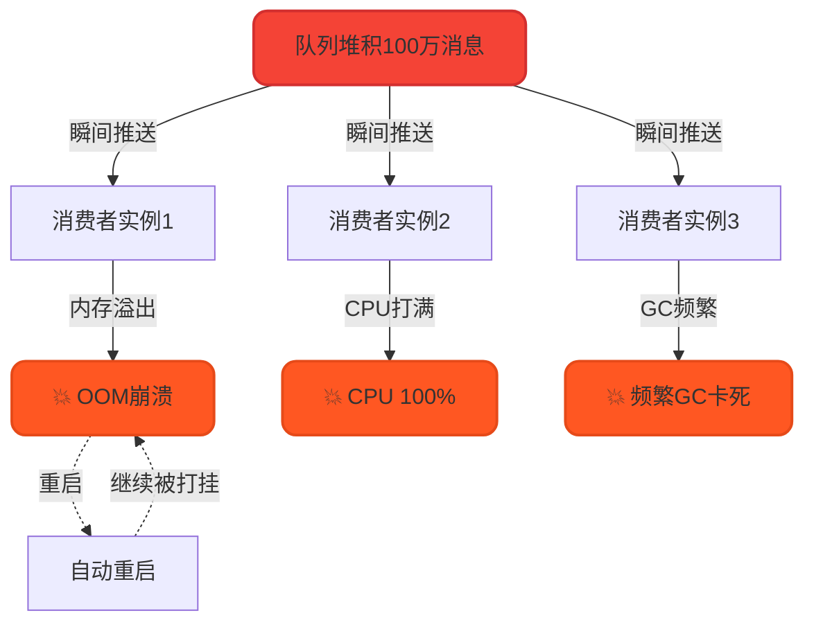
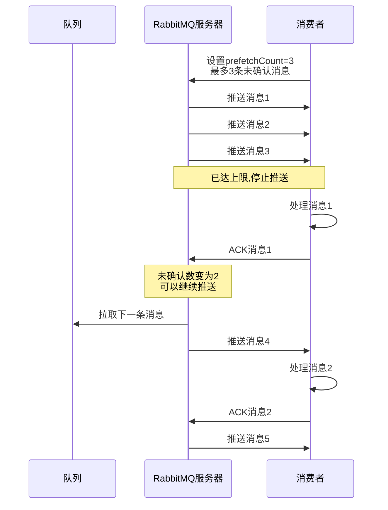
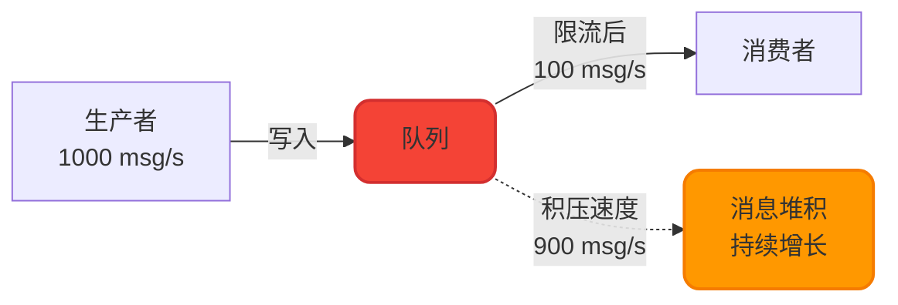
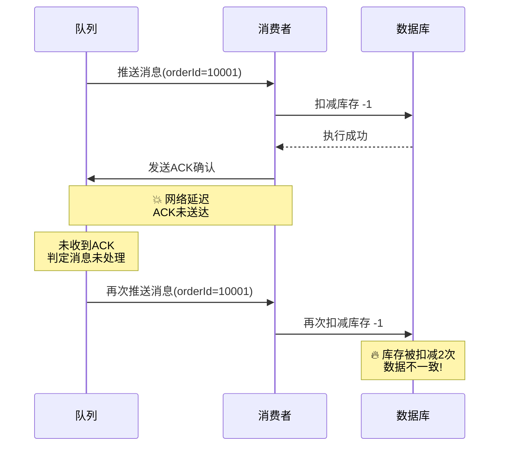
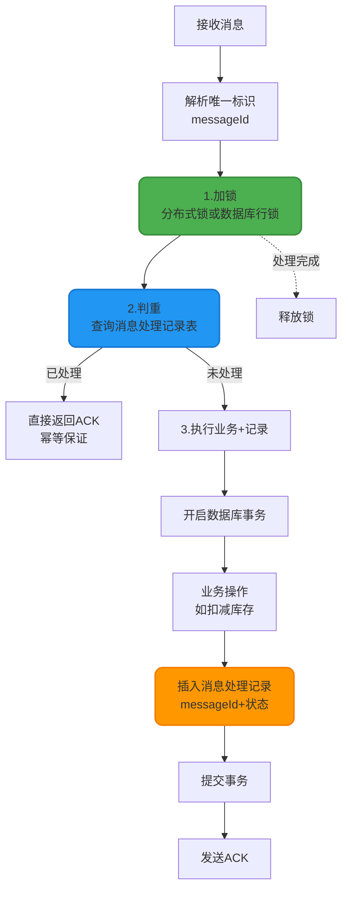

## 消费端限流机制

在高并发场景下,消息的突发性增长可能导致消费者过载甚至崩溃。消费端限流(Flow Control)是一种保护性措施,通过控制消息推送速率,避免消费者被大量消息压垮。

### 限流的必要性

**典型问题场景**:
- 业务高峰期消息大量积压,消费者处理不过来
- 消费者服务频繁OOM或CPU打满,不断重启
- 重启后瞬间涌入大量消息,再次被打挂,形成恶性循环



### QoS(Quality of Service)限流原理

RabbitMQ通过`basicQos`方法实现消费端限流,核心思想是**控制未确认消息数量**:



**工作流程**:
1. 消费者设置`prefetchCount=N`,表示最多同时处理N条消息
2. RabbitMQ推送N条消息后停止,等待消费者确认
3. 每当消费者发送1个ACK,RabbitMQ就再推送1条新消息
4. 始终保持未确认消息数≤N,实现流量控制

### 限流配置实现

#### 1. 关闭自动确认

限流机制依赖手动ACK,必须先禁用自动确认:

```java
// autoAck=false,关闭自动确认
channel.basicConsume(queueName, false, consumer);
```

#### 2. 设置QoS参数

```java
/**
 * basicQos参数说明:
 * @param prefetchSize  单条消息大小限制(字节),0表示不限制
 * @param prefetchCount 未确认消息数量上限,核心参数
 * @param global        作用范围: false=Channel级别, true=Consumer级别
 */
channel.basicQos(0, 10, false);
```

**参数详解**:
- `prefetchSize`: 通常设为0,不限制单条消息大小
- `prefetchCount`: **关键参数**,建议根据消费者处理能力设置(如10-50)
- `global`: 
  - `false`: 限制当前Channel,一个Channel可能有多个Consumer
  - `true`: 限制单个Consumer

#### 3. 手动发送ACK

```java
// 处理完一条消息后,手动确认
channel.basicAck(deliveryTag, false);
```

### 完整限流示例

```java
import com.rabbitmq.client.*;
import java.io.IOException;

public class FlowControlConsumer {
    
    private static final String QUEUE_NAME = "order_queue";
    private static final String HOST = "localhost";
    
    public static void main(String[] args) throws Exception {
        ConnectionFactory factory = new ConnectionFactory();
        factory.setHost(HOST);
        
        Connection connection = factory.newConnection();
        Channel channel = connection.createChannel();
        
        // 声明队列
        channel.queueDeclare(QUEUE_NAME, true, false, false, null);
        
        // ========== 核心配置:设置消费端限流 ==========
        // 每次最多拉取5条消息,处理完才继续拉取
        int prefetchCount = 5;
        channel.basicQos(prefetchCount);
        
        // 创建消费者
        DefaultConsumer consumer = new DefaultConsumer(channel) {
            @Override
            public void handleDelivery(String consumerTag, 
                                      Envelope envelope,
                                      AMQP.BasicProperties properties, 
                                      byte[] body) throws IOException {
                String message = new String(body, "UTF-8");
                long deliveryTag = envelope.getDeliveryTag();
                
                try {
                    // 模拟业务处理耗时(如数据库操作)
                    System.out.println("[" + Thread.currentThread().getName() + "] " +
                                     "开始处理订单: " + message);
                    Thread.sleep(2000);  // 模拟2秒处理时间
                    System.out.println("✓ 订单处理完成: " + message);
                    
                    // 处理成功,手动确认
                    channel.basicAck(deliveryTag, false);
                    
                } catch (InterruptedException e) {
                    System.err.println("✗ 订单处理异常: " + message);
                    // 处理失败,拒绝消息并重新入队
                    channel.basicNack(deliveryTag, false, true);
                }
            }
        };
        
        // 关闭自动确认,启用手动ACK
        channel.basicConsume(QUEUE_NAME, false, consumer);
        
        System.out.println("消费者启动,限流配置: prefetchCount=" + prefetchCount);
    }
}
```

### 限流参数调优策略

| 消费者性能 | 建议prefetchCount | 适用场景 |
|-----------|------------------|---------|
| 高性能(纯内存计算) | 50-100 | 日志分析、数据统计 |
| 中等(含数据库操作) | 10-30 | 订单处理、用户注册 |
| 低性能(耗时任务) | 1-5 | 视频转码、文件上传 |
| 极低性能(外部API调用) | 1 | 第三方支付回调、邮件发送 |

**调优原则**:
- prefetchCount过大: 可能导致消费者过载,内存溢出
- prefetchCount过小: 网络往返次数增加,吞吐量下降
- 建议通过压测找到最优值,兼顾吞吐量和稳定性

### 限流的局限性

虽然限流可以保护消费者,但**无法根本解决消息积压问题**,治标不治本:



**根本解决方案**:
1. **水平扩展**: 增加消费者实例数量,提升整体消费能力
2. **性能优化**: 优化消费者业务逻辑,如批量处理、异步化
3. **削峰填谷**: 生产端实现限流,控制消息发送速率

## 消息幂等性保障

### 重复消费的根本原因

RabbitMQ的消费确认机制虽然保证了消息不丢失,但**无法保证消息不重复**。网络延迟或故障可能导致同一消息被投递多次:



**常见触发场景**:
1. 消费者处理成功,但ACK在网络中丢失
2. 消费者处理超时,RabbitMQ触发消息重投
3. 消费者宕机重启,未确认消息被重新投递

### 幂等性保障方案

消费者端必须自行实现幂等控制,核心思想是**通过唯一标识符去重**,采用经典的"一锁、二判、三更新"模式。

#### 方案设计



#### 实现步骤详解

**1. 生产者生成唯一标识**

在发送消息时,为每条消息分配全局唯一ID:

```java
import java.util.UUID;

@Service
public class IdempotentProducer {
    
    @Autowired
    private RabbitTemplate rabbitTemplate;
    
    public void sendOrderMessage(Long orderId, Integer quantity) {
        // 生成唯一消息ID
        String messageId = UUID.randomUUID().toString();
        
        // 构建消息体
        OrderMessage message = new OrderMessage();
        message.setMessageId(messageId);
        message.setOrderId(orderId);
        message.setQuantity(quantity);
        
        // 发送消息
        rabbitTemplate.convertAndSend("order_exchange", 
                                     "order.create", 
                                     message);
        
        System.out.println("发送订单消息, messageId: " + messageId);
    }
}
```

**2. 消费者幂等处理**

```java
import org.springframework.amqp.rabbit.annotation.RabbitListener;
import org.springframework.beans.factory.annotation.Autowired;
import org.springframework.stereotype.Component;
import org.springframework.transaction.annotation.Transactional;

@Component
public class IdempotentConsumer {
    
    @Autowired
    private MessageRecordMapper messageRecordMapper;
    
    @Autowired
    private InventoryService inventoryService;
    
    @Autowired
    private RedissonClient redissonClient;
    
    @RabbitListener(queues = "order_queue")
    @Transactional(rollbackFor = Exception.class)
    public void handleOrderMessage(OrderMessage message) {
        String messageId = message.getMessageId();
        
        // 1️⃣ 加锁 - 防止并发重复处理
        RLock lock = redissonClient.getLock("msg_lock:" + messageId);
        
        try {
            // 尝试加锁,最多等待5秒,锁超时时间30秒
            if (!lock.tryLock(5, 30, TimeUnit.SECONDS)) {
                System.err.println("获取锁失败,放弃处理: " + messageId);
                return;
            }
            
            // 2️⃣ 判重 - 检查消息是否已处理
            MessageRecord record = messageRecordMapper.selectByMessageId(messageId);
            if (record != null && "SUCCESS".equals(record.getStatus())) {
                System.out.println("⚠ 消息已处理过,幂等跳过: " + messageId);
                return;  // 幂等保证:重复消息直接返回
            }
            
            // 3️⃣ 更新 - 执行业务并记录
            try {
                // 执行业务逻辑(如扣减库存)
                inventoryService.deductStock(
                    message.getOrderId(), 
                    message.getQuantity()
                );
                
                // 插入消息处理记录(与业务操作在同一事务)
                MessageRecord newRecord = new MessageRecord();
                newRecord.setMessageId(messageId);
                newRecord.setStatus("SUCCESS");
                newRecord.setProcessTime(new Date());
                messageRecordMapper.insert(newRecord);
                
                System.out.println("✓ 订单处理成功: " + messageId);
                
            } catch (Exception e) {
                // 业务失败,记录失败状态
                MessageRecord failRecord = new MessageRecord();
                failRecord.setMessageId(messageId);
                failRecord.setStatus("FAILED");
                failRecord.setErrorMsg(e.getMessage());
                messageRecordMapper.insert(failRecord);
                
                throw e;  // 抛出异常,触发消息重试
            }
            
        } catch (InterruptedException e) {
            Thread.currentThread().interrupt();
        } finally {
            // 释放锁
            if (lock.isHeldByCurrentThread()) {
                lock.unlock();
            }
        }
    }
}
```

**3. 数据库表设计**

```sql
CREATE TABLE message_record (
    id BIGINT PRIMARY KEY AUTO_INCREMENT,
    message_id VARCHAR(64) NOT NULL UNIQUE COMMENT '消息唯一标识',
    status VARCHAR(20) NOT NULL COMMENT '处理状态:SUCCESS/FAILED',
    error_msg VARCHAR(500) COMMENT '失败原因',
    process_time DATETIME COMMENT '处理时间',
    INDEX idx_message_id (message_id)
) COMMENT '消息处理记录表';
```

### 幂等性方案对比

| 方案 | 优点 | 缺点 | 适用场景 |
|------|------|------|---------|
| 数据库唯一索引 | 简单,依赖DB保证 | 性能一般,强依赖数据库 | 中小规模系统 |
| Redis Set去重 | 性能高,响应快 | 需要处理缓存失效问题 | 高并发场景 |
| 分布式锁+状态表 | 可靠性高,可审计 | 实现复杂,需要锁管理 | 金融、电商等关键业务 |
| 业务主键去重 | 天然幂等,无额外开销 | 需要业务支持,不通用 | 订单号、交易流水号等 |

### 最佳实践建议

1. **优先使用业务主键去重**: 如订单ID、用户ID+时间戳组合,避免额外存储
2. **消息ID生成规则**: 建议使用雪花算法或UUID,保证全局唯一性
3. **状态表定期清理**: 设置TTL或定时任务清理历史数据,避免表膨胀
4. **锁超时设置**: 锁超时时间应大于业务处理时间,避免锁提前释放导致重复处理
5. **监控告警**: 对重复消息比例进行监控,异常时及时告警

## 综合案例:高可用订单处理系统

结合限流和幂等性,构建一个健壮的订单消费者:

```java
@Component
public class RobustOrderConsumer {
    
    @Autowired
    private OrderService orderService;
    
    @Autowired
    private RedisTemplate<String, String> redisTemplate;
    
    /**
     * 高可靠订单处理消费者
     * - 启用限流保护
     * - 实现幂等性保障
     * - 异常重试策略
     */
    @RabbitListener(
        queues = "order_queue",
        concurrency = "5-10",  // 动态扩容:5-10个并发消费者
        ackMode = "MANUAL"     // 手动确认
    )
    public void processOrder(OrderMessage message, 
                            Channel channel,
                            @Header(AmqpHeaders.DELIVERY_TAG) long deliveryTag) {
        
        String messageId = message.getMessageId();
        String idempotentKey = "order:processed:" + messageId;
        
        try {
            // 幂等性检查:Redis分布式去重
            Boolean isProcessed = redisTemplate.opsForValue()
                .setIfAbsent(idempotentKey, "1", 24, TimeUnit.HOURS);
            
            if (Boolean.FALSE.equals(isProcessed)) {
                System.out.println("⚠ 订单重复,幂等跳过: " + messageId);
                channel.basicAck(deliveryTag, false);
                return;
            }
            
            // 执行订单业务处理
            orderService.createOrder(message);
            
            // 处理成功,手动ACK
            channel.basicAck(deliveryTag, false);
            System.out.println("✓ 订单处理成功: " + message.getOrderId());
            
        } catch (BusinessException e) {
            // 业务异常(如库存不足),拒绝消息不重试
            try {
                channel.basicReject(deliveryTag, false);
                // 清理幂等标记,允许后续修复数据后重新处理
                redisTemplate.delete(idempotentKey);
            } catch (IOException ioException) {
                ioException.printStackTrace();
            }
            System.err.println("✗ 订单业务异常: " + e.getMessage());
            
        } catch (Exception e) {
            // 系统异常(如网络超时),NACK并重新入队
            try {
                channel.basicNack(deliveryTag, false, true);
                // 保留幂等标记,防止重试时重复执行
            } catch (IOException ioException) {
                ioException.printStackTrace();
            }
            System.err.println("✗ 订单系统异常,消息重试: " + e.getMessage());
        }
    }
}
```

**配置文件(application.yml)**:

```yaml
spring:
  rabbitmq:
    listener:
      simple:
        # 消费端限流配置
        prefetch: 10  # 每个消费者最多10条未确认消息
        # 手动ACK模式
        acknowledge-mode: manual
        # 并发消费者数量
        concurrency: 5
        max-concurrency: 20
```

通过限流和幂等性的双重保障,系统能够在高并发、网络不稳定等恶劣环境下稳定运行,避免消息重复处理和消费者过载问题。
