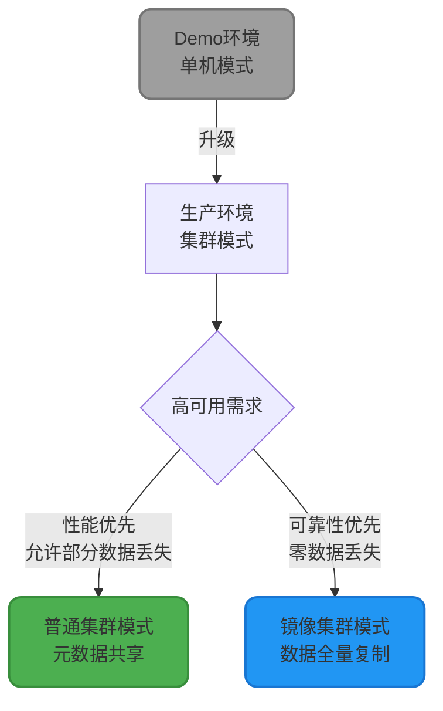
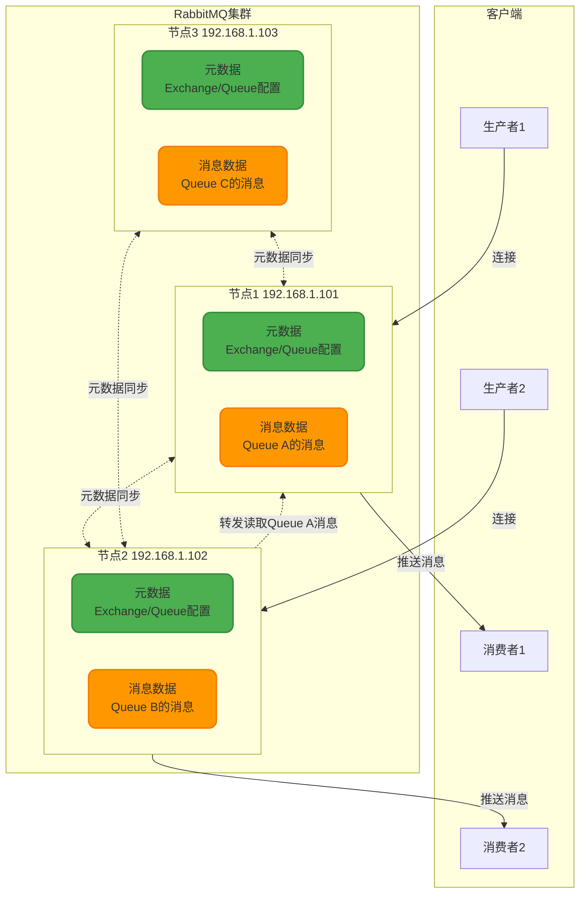
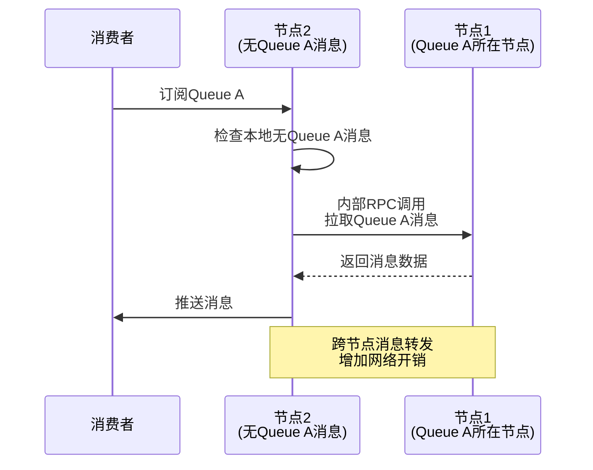
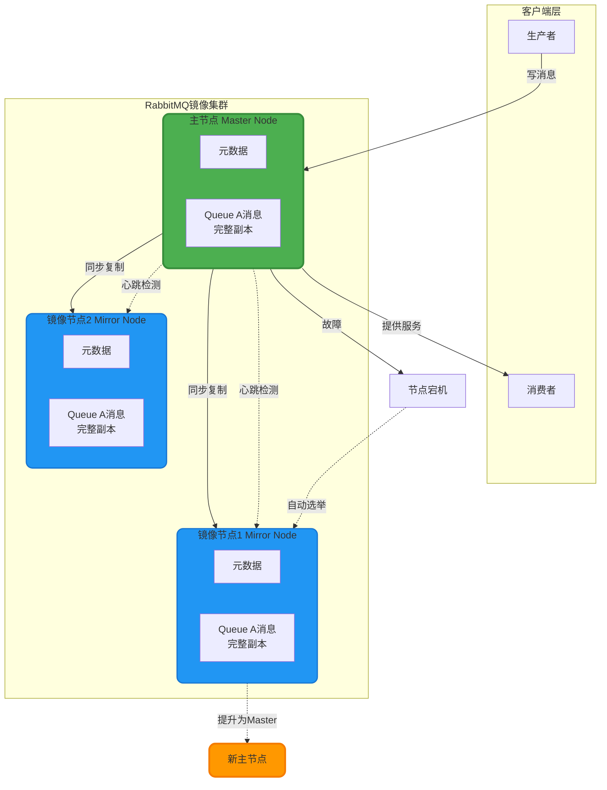
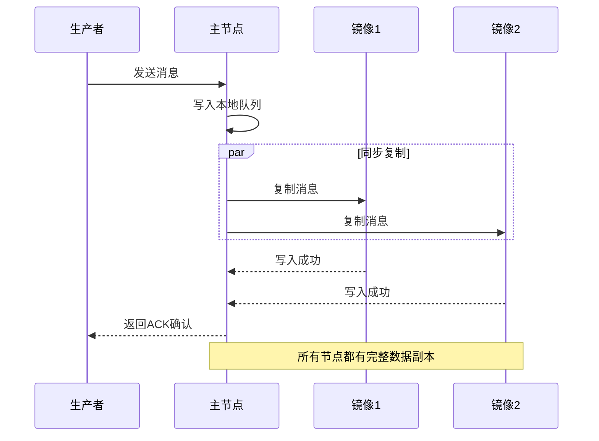
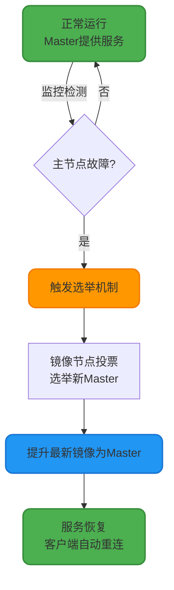
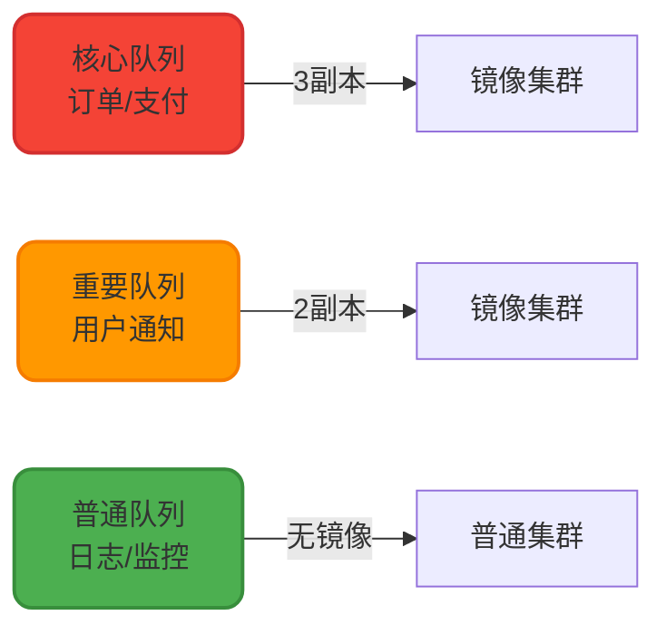
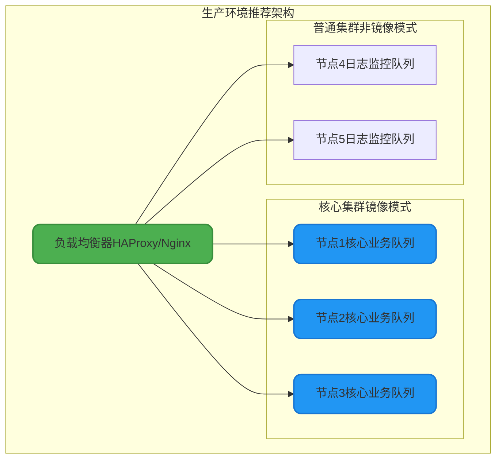
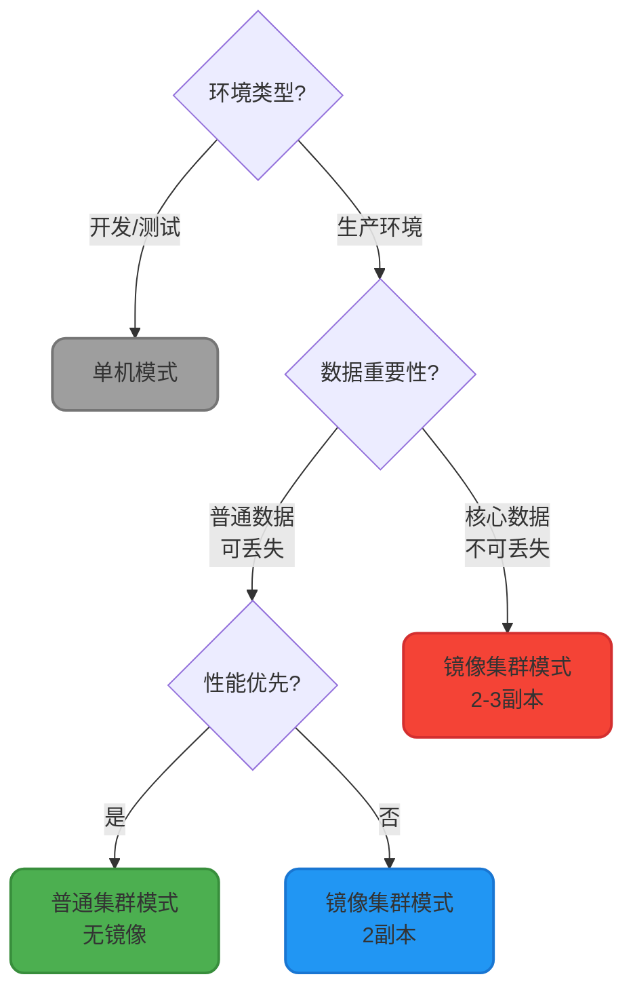

## RabbitMQ高可用架构概述

在生产环境中,单机部署的RabbitMQ存在单点故障风险。一旦服务器宕机,整个消息系统将不可用,导致业务中断。RabbitMQ提供了三种部署模式来应对不同的高可用需求,从简单到复杂依次为:单机模式、普通集群模式、镜像集群模式。



## 单机模式(Single Node)

单节点部署,所有元数据和消息数据存储在一台服务器上。这是最简单的部署方式,仅适合开发测试环境。

**特点**:
- ✅ 配置简单,快速搭建
- ✅ 资源消耗低
- ❌ 无容错能力,节点故障导致服务不可用
- ❌ 性能受限于单机硬件

**适用场景**: Demo演示、本地开发调试

## 普通集群模式(Classic Cluster)

普通集群模式通过将多个RabbitMQ实例组成集群,实现元数据共享和负载分担,提供了基础的高可用能力。

### 架构设计



### 核心特性

#### 1. 元数据共享

所有节点之间同步Exchange、Queue、Binding等元数据配置,确保每个节点都拥有完整的拓扑结构信息。

**元数据包括**:
- Exchange的类型、名称、持久化属性
- Queue的名称、持久化、排他性、自动删除等配置
- Binding关系(Exchange与Queue的路由规则)
- 用户权限、Virtual Host配置

#### 2. 消息数据分片

队列中的消息**仅存储在其创建的节点**上,不会复制到其他节点。这种设计提升了存储效率和写入性能,但也带来了单点风险。

**消息分布示例**:
- Queue A的消息 → 仅存储在Node1
- Queue B的消息 → 仅存储在Node2
- Queue C的消息 → 仅存储在Node3

#### 3. 消息路由与转发

当消费者连接到不包含目标队列消息的节点时,该节点会通过内部通信从实际存储消息的节点拉取数据:



**性能影响**: 跨节点转发会增加网络延迟和CPU消耗,在高并发场景下可能成为瓶颈。

### 优势与局限

**优势**:
- ✅ 提升整体吞吐量:多节点分担消息存储和处理压力
- ✅ 水平扩展能力:增加节点即可提升集群容量
- ✅ 部分容错:单个节点故障不影响其他节点上的队列

**局限**:
- ❌ 单点故障风险:节点宕机后,该节点上的队列和消息不可用,直到节点恢复
- ❌ 跨节点性能损耗:消费者连接到非数据节点时,需要额外的网络转发
- ❌ 无法保证零数据丢失:节点故障前未持久化的消息会丢失

**适用场景**: 
- 对可用性要求不高,可接受短时间服务降级
- 追求性能和存储容量,消息丢失可通过业务补偿
- 预算有限,无法承担镜像模式的资源开销

## 镜像集群模式(Mirrored Cluster)

镜像模式通过将队列的完整数据(元数据+消息)复制到多个节点,实现了真正的高可用性,即使节点故障也能保证服务连续性。

### 架构设计



### 核心机制

#### 1. 数据全量镜像

队列的所有数据(消息内容、消息元数据、队列配置)在集群的多个节点上保存完整副本:

**同步流程**:
1. 生产者发送消息到主节点(Master)
2. 主节点写入本地队列
3. **同步复制**消息到所有镜像节点(Mirrors)
4. 所有镜像节点写入成功后,返回ACK给生产者



#### 2. 主从角色

- **Master节点**: 负责处理所有读写请求,协调镜像同步
- **Mirror节点**: 被动接收主节点的数据同步,不处理客户端请求(仅作为备份)

#### 3. 自动故障转移

当主节点发生故障时,集群自动从镜像节点中选举新的Master,实现无缝切换:



**故障恢复时间**: 通常在数秒内完成,对客户端几乎无感知(依赖客户端自动重连机制)。

### 镜像策略配置

RabbitMQ支持灵活的镜像策略,可针对不同队列设置不同的镜像数量:

#### 策略类型

| 策略 | 说明 | 配置示例 | 适用场景 |
|------|------|---------|---------|
| all | 所有节点都镜像 | `ha-mode: all` | 最高可用性,节点数≤5 |
| exactly | 指定固定镜像数量 | `ha-mode: exactly`<br/>`ha-params: 2` | 平衡性能和可靠性 |
| nodes | 指定镜像到特定节点 | `ha-mode: nodes`<br/>`ha-params: [node1, node2]` | 异地多活 |

#### 配置示例(通过管理界面或命令行)

**命令行配置**:
```bash
# 为所有以"order"开头的队列配置镜像策略
rabbitmqctl set_policy ha-order "^order\." \
  '{"ha-mode":"exactly","ha-params":2,"ha-sync-mode":"automatic"}' \
  --priority 0 \
  --apply-to queues
```

**策略参数详解**:
- `ha-mode`: 镜像模式(all/exactly/nodes)
- `ha-params`: 镜像参数(镜像数量或节点列表)
- `ha-sync-mode`: 同步模式
  - `automatic`: 自动同步(新镜像加入时自动同步历史消息)
  - `manual`: 手动同步(需手动触发)
- `apply-to`: 应用对象(queues/exchanges/all)

### 性能与权衡

#### 性能开销

镜像模式因同步复制机制,会显著降低写入性能:

| 对比维度 | 普通集群 | 镜像集群(2副本) | 镜像集群(3副本) |
|---------|---------|---------------|---------------|
| 写入吞吐量 | 10000 msg/s | 5000 msg/s | 3000 msg/s |
| 写入延迟 | 5ms | 15ms | 25ms |
| 网络流量 | 1x | 2x | 3x |
| 存储空间 | 1x | 2x | 3x |

**性能下降原因**:
- 主节点需要等待所有镜像节点确认后才返回ACK
- 网络带宽消耗成倍增加(每条消息需发送N份)
- 磁盘I/O压力增大(所有节点都需写入)

#### 权衡建议

**镜像数量选择**:
- **2副本**: 推荐配置,兼顾可用性和性能,允许1个节点故障
- **3副本**: 金融、交易等核心业务,允许2个节点同时故障
- **全镜像(all)**: 仅在节点数≤5且对性能无严格要求时使用

**队列分级**:


**优化策略**:
1. 仅对关键业务队列启用镜像
2. 使用批量发送减少网络往返
3. 合理设置持久化策略(非关键消息不持久化)
4. 部署SSD磁盘提升I/O性能

### 优势与局限

**优势**:
- ✅ 真正的高可用:节点故障不影响服务,自动故障转移
- ✅ 零数据丢失:所有节点都有完整数据副本
- ✅ 读写分离潜力:可配置从镜像节点读取(需客户端支持)

**局限**:
- ❌ 性能下降:写入吞吐量降低50%-70%
- ❌ 资源消耗高:存储和网络带宽成倍增加
- ❌ 运维复杂度:需要监控同步状态、处理脑裂等问题

**适用场景**:
- 金融交易、电商支付等核心业务
- 数据绝对不能丢失的场景
- 7x24小时服务可用性要求

## 集群部署最佳实践

### 1. 节点规划



**配置建议**:
- 节点数量:3-5个(奇数便于选举)
- 硬件配置:16核32G内存,SSD磁盘
- 网络:万兆内网,低延迟(小于1ms)
- 跨机房部署:避免单机房故障

### 2. 客户端连接策略

```java
// Spring Boot配置多节点地址
spring:
  rabbitmq:
    addresses: 192.168.1.101:5672,192.168.1.102:5672,192.168.1.103:5672
    username: admin
    password: admin123
    # 自动重连配置
    connection-timeout: 15000
    template:
      retry:
        enabled: true
        initial-interval: 1000
        max-attempts: 3
        multiplier: 2
```

**关键配置**:
- 配置多个节点地址,客户端自动选择
- 启用自动重连,主节点故障时自动切换
- 设置合理的超时和重试策略

### 3. 监控告警

**关键监控指标**:
- 节点状态:运行/停止/网络分区
- 队列深度:积压消息数量
- 镜像同步状态:镜像延迟时间
- 内存/磁盘使用率
- 消息吞吐量和延迟

**告警阈值建议**:
- 队列深度大于10000: 消费能力不足
- 内存使用率大于80%: 触发流控或扩容
- 镜像同步延迟大于5秒: 网络或性能问题
- 节点故障: 立即告警,人工介入

## 模式选型决策树



通过合理选择集群模式和配置策略,可以在成本、性能、可靠性之间找到最佳平衡点,构建稳定高效的消息中间件系统。
