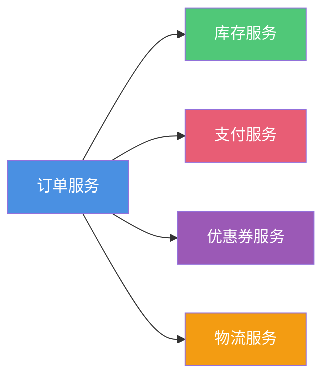
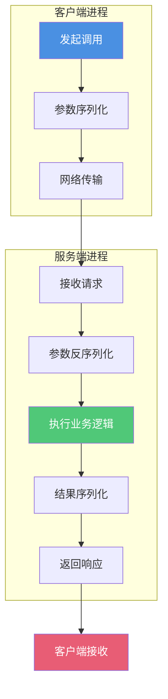
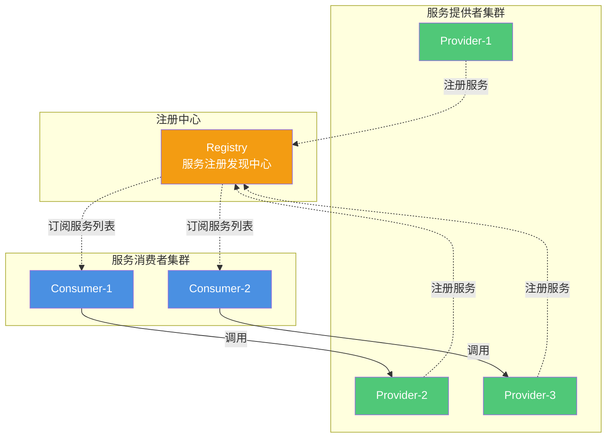
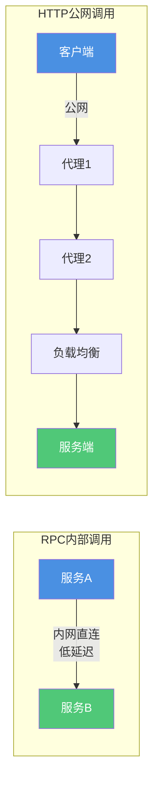

# RPC与Dubbo基础概念

## RPC远程过程调用详解

### 远程调用的必要性

在现代微服务架构中,系统通常被拆分为多个独立的服务模块,分别部署在不同的服务器上。以电商订单系统为例,完成一次订单可能需要:

这些服务分别由不同的团队维护,部署在不同的机器上,因此需要通过远程调用来实现服务间的协作。

### RPC核心概念

RPC(Remote Procedure Call)即远程过程调用,它允许程序调用另一台计算机上的程序,就像调用本地方法一样简单。调用方进程会被挂起,等待远程服务执行完毕并返回结果后继续执行。整个网络通信细节对开发者透明。

比如调用 `inventoryService.deduct("商品A", 1)` 时,实际上可能是在调用远程服务器上的库存扣减方法,但对开发者来说,就像调用本地方法一样自然。

### RPC框架的三大角色

一个完整的RPC框架通常包含三个核心角色:

**Provider(服务提供方)**: 暴露服务的提供者,负责实现具体的业务逻辑。

**Consumer(服务消费方)**: 调用远程服务的消费者,通过RPC框架调用Provider提供的服务。

**Registry(注册中心)**: 服务注册与发现的协调者。Provider启动时向注册中心注册服务信息(IP、端口、服务列表等),Consumer启动时从注册中心订阅所需服务的提供者列表。注册中心还能根据Provider的健康状态动态更新服务列表,实现负载均衡。

### RPC核心技术组件

实现一个成熟的RPC框架需要以下核心技术:

**动态代理技术**

RPC框架使用JDK动态代理、Javassist或CGLib等技术生成代理对象,让远程调用看起来像本地调用。开发者只需要面向接口编程,代理对象会自动处理网络通信等底层细节。

**序列化与反序列化**

为了在网络上传输Java对象,需要将对象转换为字节流(序列化),接收方再将字节流还原为对象(反序列化)。常用的序列化框架包括:
- Protobuf: Google出品,高性能跨语言序列化
- Hessian: 跨语言的二进制序列化
- Kryo: 高性能的Java序列化框架
- Msgpack: 轻量级的二进制序列化

**高性能网络通信**

现代RPC框架通常采用NIO或Netty等高性能通信框架。Netty提供了异步事件驱动的网络应用框架,能够支持高并发场景。主流RPC框架如Dubbo、HSF、gRPC等都基于Netty实现。

**服务注册中心**

常见的注册中心技术包括:
- ZooKeeper: 分布式协调服务
- Redis: 高性能键值存储
- Consul: 服务网格解决方案
- Etcd: 分布式配置中心
- Nacos: 阿里云的服务注册与配置中心

### 主流RPC框架对比

**Dubbo**

阿里巴巴开源的Java高性能RPC框架,已进入Apache基金会。提供完善的服务治理能力,与Spring框架无缝集成,在国内企业中应用广泛。

**gRPC**

Google开源的高性能通用RPC框架,基于HTTP/2协议和ProtoBuf序列化。支持多种编程语言,适合构建跨语言的微服务系统。

**Motan**

新浪微博开源的Java RPC框架,在微博平台中每天处理近千亿次调用,性能稳定可靠。

**Thrift**

Apache的跨语言服务框架,支持多种编程语言,提供完整的RPC解决方案。

## RPC与HTTP的对比

### 概念层面的区别

RPC是一种远程过程调用的设计理念,需要包含传输协议和序列化协议的具体实现。而HTTP是一种超文本传输协议,本身就是一种传输协议。因此,**RPC和HTTP并非同一维度的概念**。

实际上,RPC的实现既可以基于TCP协议,也可以直接基于HTTP协议。两者的应用场景有明显差异:

- **RPC**: 主要用于企业内部服务间调用,性能消耗低,传输效率高,服务治理能力强
- **HTTP**: 主要用于对外的异构环境,如浏览器调用、APP接口、第三方系统对接等

### RPC性能优势分析

RPC框架在性能上通常优于HTTP,主要体现在以下几个方面:

**轻量级序列化**

RPC通常使用高效的二进制序列化格式(如Protobuf、Hessian),相比HTTP常用的文本格式(JSON、XML)更紧凑,解析速度更快,网络传输开销更小。

**优化的网络协议**

RPC的通信协议更加轻量,不需要像HTTP那样携带复杂的Header信息,减少了数据传输量。很多RPC框架基于Netty等高性能网络框架实现,通信效率更高。

**长连接复用**

RPC框架通常使用长连接,并支持连接池管理和多路复用。虽然HTTP/1.1也有keep-alive机制,HTTP/2也支持多路复用,但RPC仅在企业内部使用,可以更激进地采用新技术,而HTTP受限于广泛的客户端兼容性要求。

gRPC基于HTTP/2实现,可以在一个连接上高效复用多个请求,显著降低了连接建立的开销。

**定制化优化**

RPC框架允许深度定制底层传输细节、序列化方式、错误处理机制等。而HTTP作为标准化的Web协议,在面向性能的场景中定制能力有限。

**网络链路优势**

RPC通常应用于企业内网,网络链路更短,延迟更低。而HTTP往往在公网上通信,需要经过多个中间节点转发,增加了网络延迟。

### HTTP的应用场景

尽管RPC性能更优,但以下场景仍然需要使用HTTP:

**异构系统集成**

HTTP是通用协议,几乎所有编程语言和操作系统都原生支持。在跨语言、跨平台的场景下,HTTP具有更好的兼容性。虽然gRPC等RPC框架也支持多语言,但HTTP的生态更加成熟完善。

**跨组织通信**

RPC适合企业内部使用统一注册中心进行服务治理。如果需要跨组织、跨公司调用,由于各方技术栈不同,无法共享同一套服务治理体系,这时只能使用更通用的HTTP协议。

**浏览器直接访问**

浏览器原生支持HTTP协议,Web应用必须使用HTTP/HTTPS与后端通信。虽然gRPC-Web可以让浏览器使用gRPC,但需要额外的代理转换。

**RESTful API设计**

对于需要向外部开发者提供的公开API,RESTful风格的HTTP接口更加友好,文档清晰,易于理解和调试。

### RPC的优势总结

**高性能**

RPC在传输效率上通常比HTTP更高,采用更紧凑的数据格式(如Protobuf、Thrift),能更有效利用网络带宽和存储空间。

**安全性**

RPC框架主要应用于企业内部系统间调用,内网环境安全性更有保障。企业可以统一控制服务访问权限,降低安全风险。

**调用简便**

RPC让开发者像调用本地方法一样调用远程代码,无需关心HTTP请求的Body、Header等细节,开发效率更高,代码更简洁。

**完善的服务治理**

成熟的RPC框架(如Dubbo)提供了服务注册发现、负载均衡、服务降级、流量控制、链路追踪等丰富的服务治理功能,这些能力是单纯使用HTTP难以实现的。
