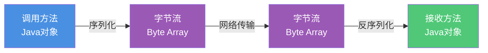
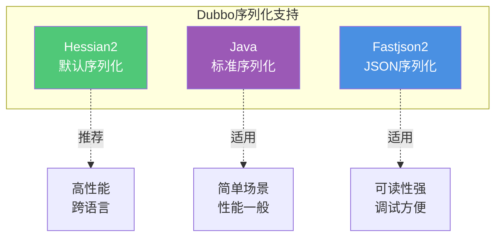
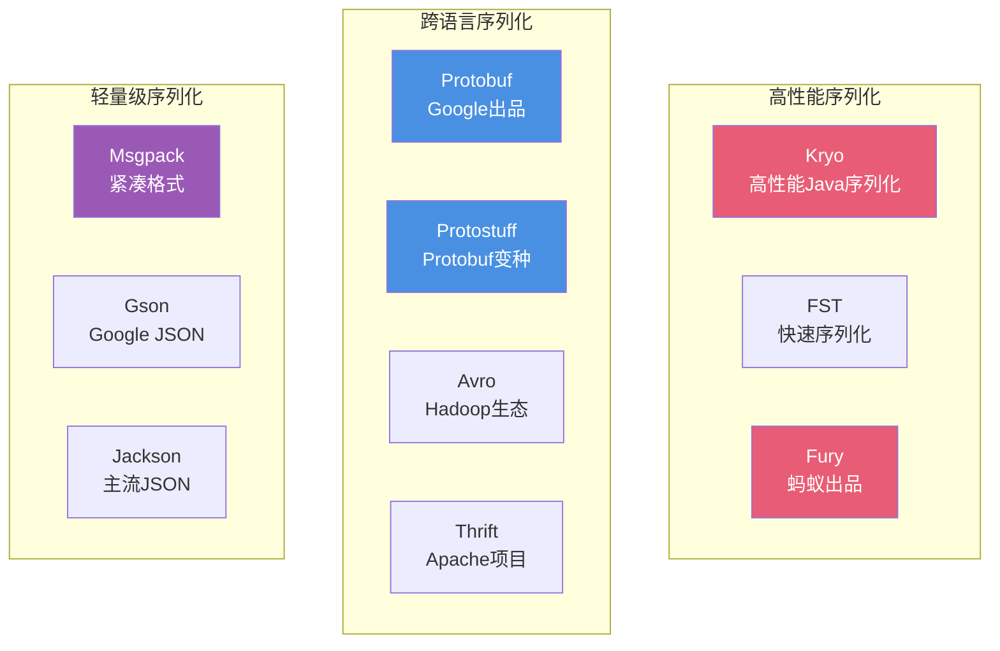
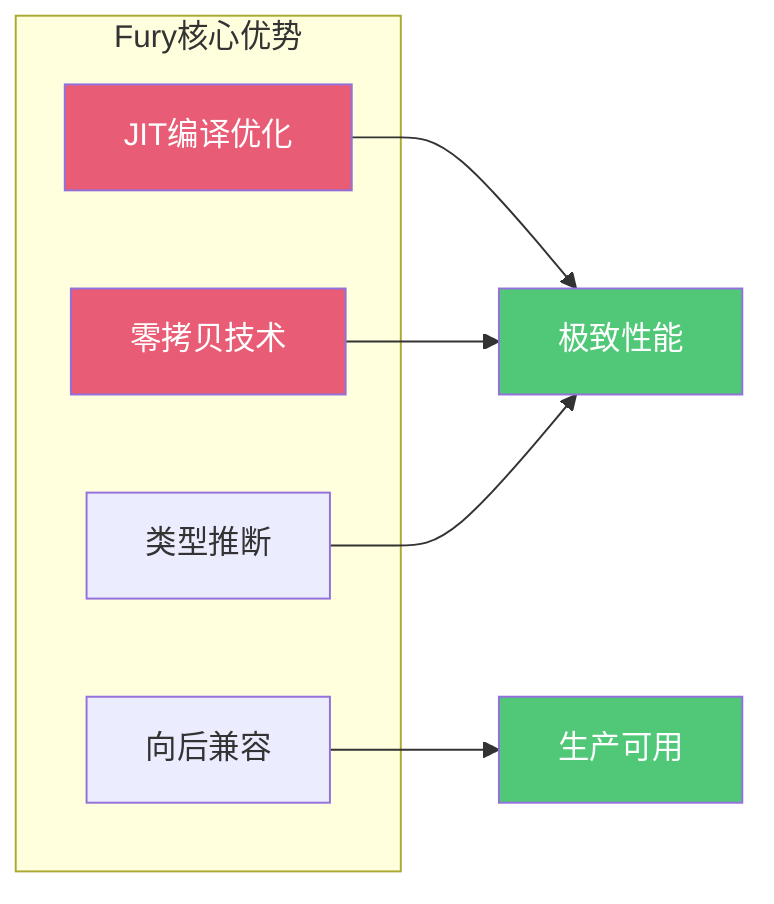
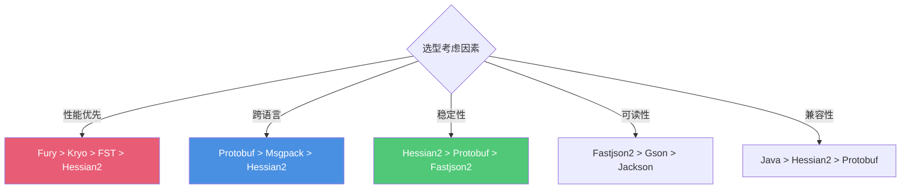
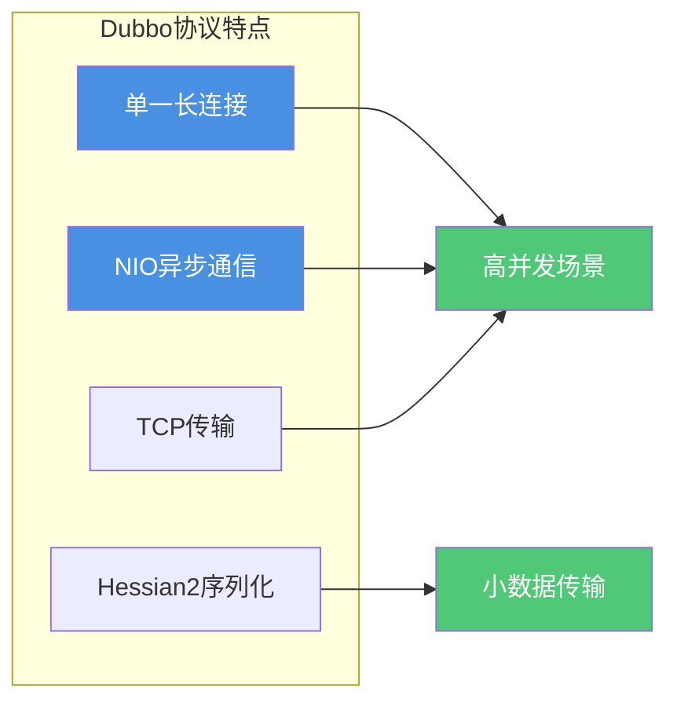
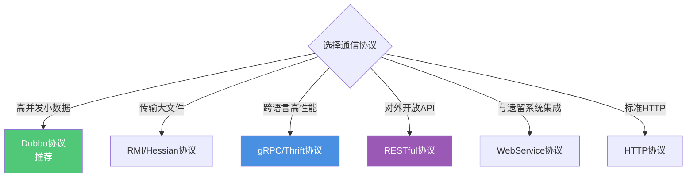

# Dubbo序列化与通信协议

## Dubbo序列化机制

### 序列化的必要性

RPC框架需要进行远程调用,必须将请求参数和响应结果在网络上传输。Java对象无法直接在网络上传输,需要先转换为字节流(序列化),接收方再将字节流还原为对象(反序列化)。



序列化协议的选择直接影响RPC框架的性能、跨语言能力和兼容性。

### Dubbo 3.0内置序列化协议

在Dubbo 3.0版本中,默认内置了3种主流序列化协议:



**Hessian2序列化**

Hessian是一种跨语言的高效二进制序列化协议。Dubbo中实际使用的是阿里修改优化后的Hessian Lite版本,作为Dubbo RPC的默认序列化方式。

优势:
- 高性能的二进制序列化
- 跨语言支持(Java、C++、Python等)
- 序列化后的数据体积小
- 阿里优化版本性能更佳

适用场景: 企业内部高性能微服务调用,需要跨语言互操作的场景。

**Java标准序列化**

使用JDK内置的序列化机制,实现Serializable接口即可。

优势:
- 使用简单,无需额外依赖
- 与Java生态无缝集成

劣势:
- 性能相对较低
- 序列化后数据体积较大
- 仅支持Java语言

适用场景: 简单的数据结构,对性能要求不高的场景。

**Fastjson2序列化**

基于阿里开源的Fastjson2框架,使用JSON格式进行序列化。

优势:
- 数据格式可读,便于调试
- 跨语言支持广泛
- 性能相比JSON-lib等老框架有显著提升

劣势:
- 文本格式体积比二进制大
- 性能不如Hessian2等二进制协议

适用场景: 需要数据可视化、跨语言调用、对外开放API的场景。

### Dubbo扩展序列化协议

除了内置的序列化协议,Dubbo还通过SPI扩展机制支持多种第三方序列化框架:



### 新兴序列化框架对比

近年来涌现了许多高性能序列化框架,在某些场景下性能已经超越了Hessian2:

**Kryo序列化**

专为Java设计的高性能序列化框架。

特点:
- 序列化速度极快
- 序列化后数据体积小
- 支持循环引用检测
- 需要预先注册类信息

性能: 比Hessian2快约2-3倍

局限: 仅支持Java,跨版本兼容性需要注意

**FST序列化**

Fast-Serialization的缩写,兼容JDK序列化。

特点:
- 完全兼容JDK序列化
- 性能比JDK序列化提升10倍以上
- 无需实现Serializable接口
- 支持堆外内存序列化

性能: 比Hessian2快约1.5-2倍

**Fury序列化**

蚂蚁集团开源的新一代序列化框架,号称比Hessian快100倍。



Fury的性能优势:
- 动态代码生成,避免反射开销
- 零拷贝设计,减少内存分配
- 智能类型推断,减少元数据传输
- 原生支持多语言(Java、Python、C++等)

适用场景: 对性能要求极高的内部微服务调用。

**Protobuf序列化**

Google开源的跨语言序列化协议。

特点:
- 需要预先定义schema(.proto文件)
- 强类型约束,数据安全性高
- 跨语言支持广泛
- 向后兼容性好

适用场景: 需要强类型约束、跨语言互操作的场景。

**Msgpack序列化**

类似JSON但更紧凑的二进制格式。

特点:
- 比JSON体积小
- 跨语言支持广泛
- 数据格式相对简单

适用场景: 需要轻量级跨语言通信的场景。

### 序列化协议选型建议



**推荐方案**:
- 内部高性能调用: Fury(新项目) 或 Hessian2(稳定项目)
- 跨语言场景: Protobuf 或 Avro
- 对外开放API: Fastjson2 或 Jackson
- 简单场景: Java标准序列化

## Dubbo通信协议

Dubbo支持多种通信协议,每种协议都有其适用场景和特点。

### Dubbo协议(默认推荐)

Dubbo协议是Dubbo框架的默认协议,专为高并发小数据量场景优化。



**核心特性**:
- 单一长连接,节省连接资源
- 基于TCP协议传输
- 默认使用Hessian2序列化
- NIO异步通信,高并发处理能力强
- 适合传输小数据包(每次请求100KB以内)
- 适合Consumer数量远大于Provider的场景

**配置示例**:
```java
// Provider端配置
@DubboService(protocol = "dubbo")
public class OrderServiceImpl implements OrderService {
    public Order createOrder(Long userId, Long productId) {
        // 业务逻辑
        return new Order();
    }
}
```

**适用场景**: 常规的内部微服务调用,请求响应数据量不大,并发量高。

### RMI协议

采用JDK标准的RMI协议实现。

**核心特性**:
- 使用Java标准序列化机制
- 阻塞式短连接
- 支持传输大数据包
- Consumer和Provider数量相当
- 可以传输文件
- 基于TCP协议

**配置示例**:
```java
<dubbo:protocol name="rmi" port="1099" />
```

**适用场景**: 与已有RMI服务集成,需要传输文件等大数据包的场景。

### Hessian协议

集成Hessian服务,基于HTTP通讯。

**核心特性**:
- 基于HTTP协议
- 采用Servlet暴露服务
- Dubbo内嵌Jetty作为服务器
- Hessian序列化协议
- 多个短连接
- 同步HTTP传输

**配置示例**:
```java
<dubbo:protocol name="hessian" port="8080" />
```

**适用场景**: 
- 需要与Hessian服务互操作
- 传输较大数据包
- Provider压力较大的场景

### HTTP协议

基于HTTP表单提交的远程调用协议。

**核心特性**:
- 使用Spring的HttpInvoker实现
- 基于HTTP协议
- 表单序列化方式

**配置示例**:
```java
<dubbo:protocol name="http" port="8080" />
```

**适用场景**: 需要HTTP协议访问,与Web应用集成的场景。

### WebService协议

基于WebService的远程调用协议。

**核心特性**:
- 集成CXF实现
- 基于SOAP协议
- 与原生WebService互操作

**配置示例**:
```java
<dubbo:protocol name="webservice" port="8080" />
```

**适用场景**: 与传统WebService系统集成,跨平台互操作。

### Thrift协议

Dubbo对Thrift原生协议的扩展。

**核心特性**:
- 基于Thrift协议
- 添加了额外的头信息(service name、magic number等)
- 高性能跨语言支持

**配置示例**:
```java
<dubbo:protocol name="thrift" port="3030" />
```

**适用场景**: 需要使用Thrift协议,跨语言互操作的场景。

### gRPC协议

基于HTTP/2和Protobuf的高性能协议。

**核心特性**:
- 基于HTTP/2协议
- 使用Protobuf序列化
- 支持流式调用
- 跨语言支持

**适用场景**: 需要HTTP/2特性,流式处理,跨语言高性能调用。

### Redis/Memcached协议

基于缓存中间件的RPC协议。

**核心特性**:
- 将RPC调用转换为缓存操作
- 适合特定场景的优化

**适用场景**: 特殊的缓存场景,不常用。

### RESTful协议

基于标准的JAX-RS 2.0实现。

**核心特性**:
- 标准的REST API
- HTTP协议
- JSON等文本格式
- 易于调试和对接

**配置示例**:
```java
@DubboService(protocol = "rest")
@Path("/orders")
public class OrderServiceImpl implements OrderService {
    
    @POST
    @Path("/create")
    @Consumes(MediaType.APPLICATION_JSON)
    @Produces(MediaType.APPLICATION_JSON)
    public Order createOrder(OrderRequest request) {
        // 业务逻辑
        return new Order();
    }
}
```

**适用场景**: 对外开放API,需要RESTful风格接口,跨语言调用。

### 协议选型对比



### 协议性能对比

| 协议 | 传输方式 | 序列化 | 并发支持 | 数据量 | 跨语言 |
|------|----------|--------|----------|--------|--------|
| Dubbo | TCP长连接 | Hessian2 | 高 | 小 | 有限 |
| gRPC | HTTP/2 | Protobuf | 高 | 中 | 强 |
| RMI | TCP短连接 | Java | 中 | 大 | 无 |
| Hessian | HTTP短连接 | Hessian | 中 | 大 | 有 |
| RESTful | HTTP | JSON | 中 | 中 | 强 |
| Thrift | TCP | Thrift | 高 | 中 | 强 |

### 最佳实践建议

**内部微服务通信**:
- 首选Dubbo协议 + Hessian2序列化
- 高性能要求可选Dubbo协议 + Fury序列化
- 需要流式处理可选gRPC协议

**跨语言场景**:
- 推荐gRPC协议 + Protobuf序列化
- 或Thrift协议 + Thrift序列化

**对外开放API**:
- 推荐RESTful协议 + JSON序列化
- 便于第三方集成和调试

**传输大文件**:
- 考虑RMI协议或Hessian协议
- 或者使用OSS等对象存储服务

通过合理选择序列化协议和通信协议,可以在性能、兼容性、可维护性之间找到最佳平衡点,满足不同业务场景的需求。
