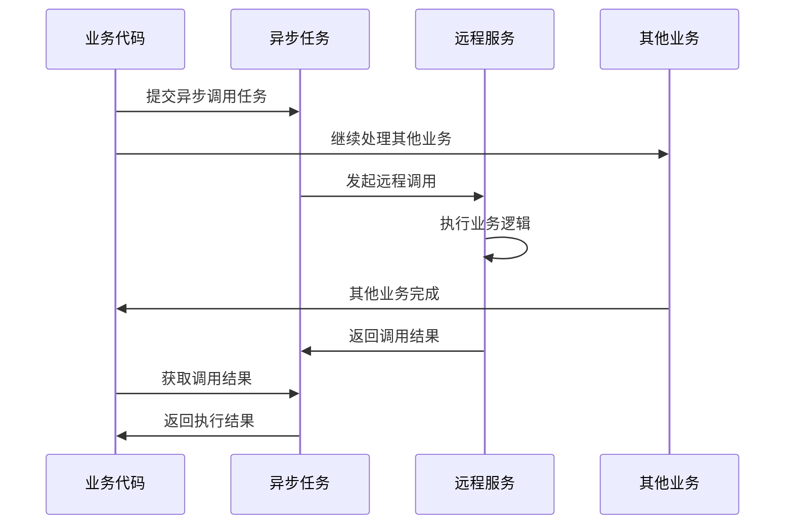
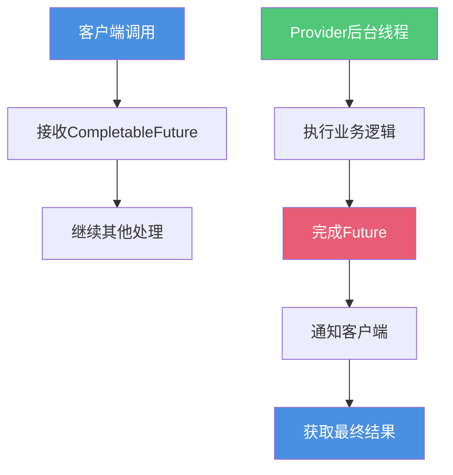
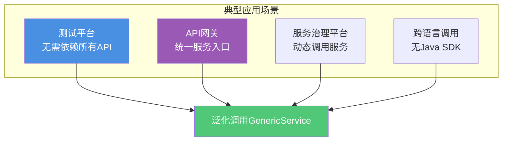
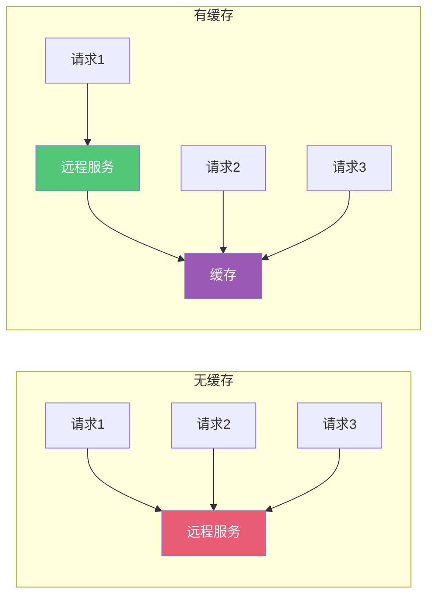
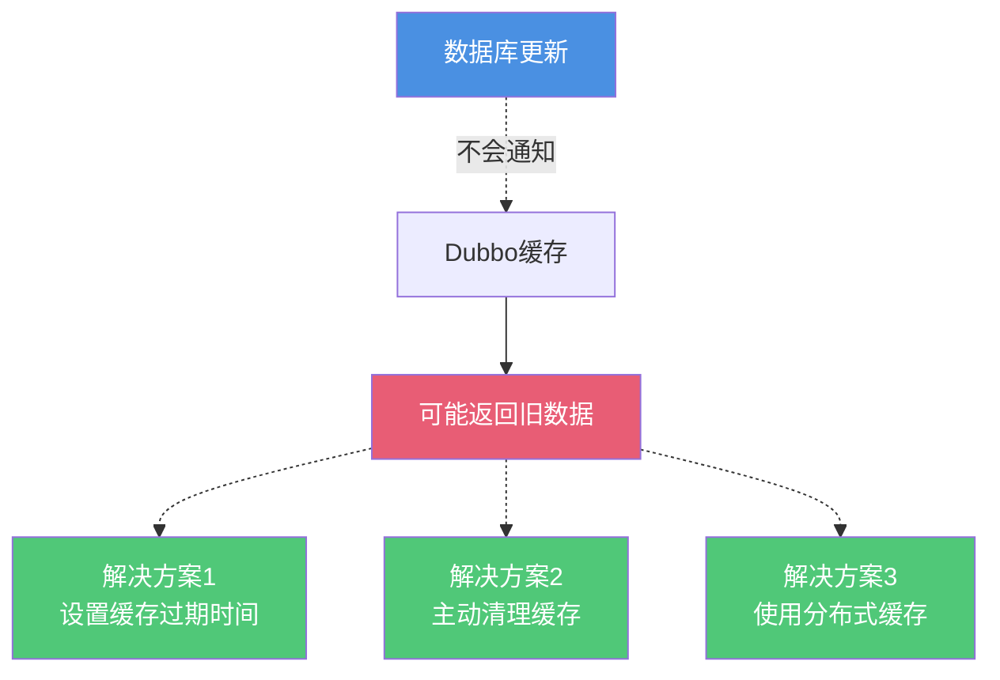
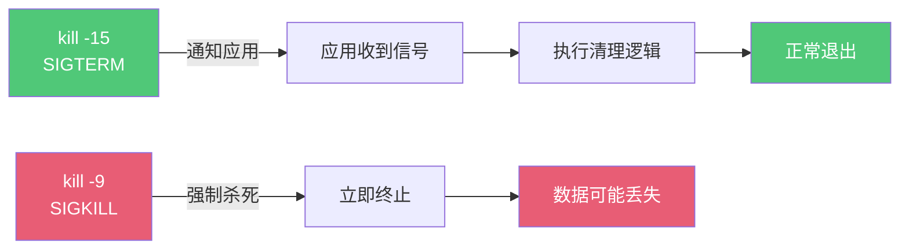
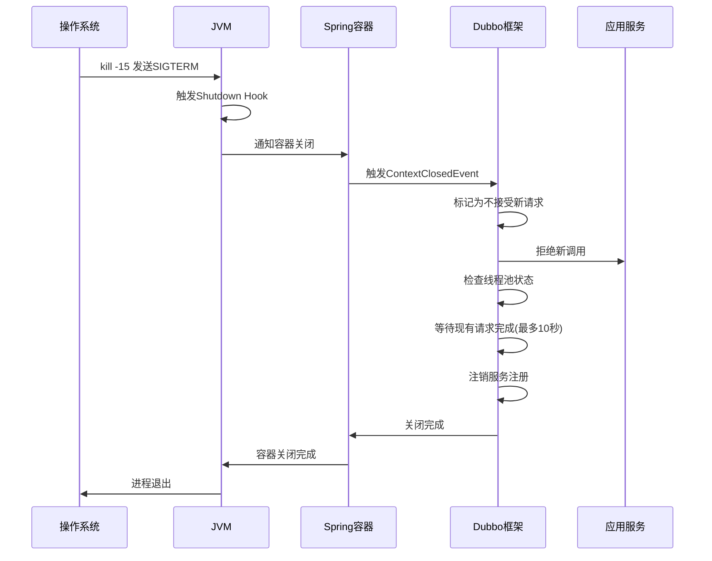

# Dubbo高级特性与应用

## Dubbo异步调用

### Consumer端异步调用

Consumer端异步调用是指消费者在调用远程服务时不同步等待结果,可以先去处理其他业务逻辑,在需要结果时再获取。



**实现方式 - CompletableFuture**:

服务接口保持同步定义:
```java
public interface InventoryService {
    boolean deductStock(String productId, int quantity);
}
```

Consumer端使用CompletableFuture实现异步:
```java
@RestController
public class OrderController {
    
    @DubboReference
    private InventoryService inventoryService;
    
    @PostMapping("/createOrder")
    public String createOrder(OrderRequest request) {
        // 异步调用库存服务
        CompletableFuture<Boolean> stockFuture = 
            CompletableFuture.supplyAsync(() -> {
                return inventoryService.deductStock(
                    request.getProductId(), 
                    request.getQuantity()
                );
            });
        
        // 可以继续处理其他业务
        System.out.println("继续处理其他业务逻辑...");
        
        // 需要结果时再获取
        stockFuture.whenComplete((result, ex) -> {
            if (ex != null) {
                System.err.println("库存扣减失败: " + ex.getMessage());
            } else {
                System.out.println("库存扣减结果: " + result);
            }
        });
        
        return "订单创建中";
    }
}
```

**优势**:
- 提高系统响应速度
- 充分利用CPU资源
- 支持并发调用多个服务
- 业务逻辑不被阻塞

### Provider端异步调用

Provider端异步调用是指服务提供方本身就提供异步接口,接口返回CompletableFuture类型。



**服务提供方定义异步接口**:
```java
@DubboService
public class NotificationServiceImpl implements NotificationService {
    
    @Override
    public CompletableFuture<String> sendNotification(String userId, String message) {
        // 建议使用自定义线程池
        return CompletableFuture.supplyAsync(() -> {
            try {
                // 模拟发送通知的耗时操作
                Thread.sleep(ThreadLocalRandom.current().nextInt(1000));
                
                // 发送短信、邮件等
                String result = "通知发送成功: 用户" + userId 
                              + ", 消息: " + message;
                return result;
                
            } catch (InterruptedException e) {
                Thread.currentThread().interrupt();
                throw new RuntimeException("通知发送失败", e);
            }
        });
    }
}
```

**服务消费方调用**:
```java
@RestController
public class UserController {
    
    @DubboReference
    private NotificationService notificationService;
    
    @PostMapping("/notify")
    public String notifyUser(String userId, String message) {
        // 调用异步接口,立即返回Future
        CompletableFuture<String> future = 
            notificationService.sendNotification(userId, message);
        
        // 注册回调处理结果
        future.whenComplete((result, throwable) -> {
            if (throwable != null) {
                System.err.println("通知失败: " + throwable.getMessage());
            } else {
                System.out.println("通知结果: " + result);
            }
        });
        
        return "通知发送中";
    }
}
```

### AsyncContext异步上下文

除了CompletableFuture,Dubbo还提供了类似Servlet 3.0的AsyncContext机制。

**使用AsyncContext实现异步**:
```java
@DubboService
public class ReportServiceImpl implements ReportService {
    
    @Override
    public String generateReport(String reportType) {
        // 开启异步上下文
        final AsyncContext asyncContext = RpcContext.startAsync();
        
        new Thread(() -> {
            // 必须在第一句执行,切换上下文
            asyncContext.signalContextSwitch();
            
            try {
                // 模拟耗时的报表生成
                Thread.sleep(3000);
                
                String report = "报表生成完成: " + reportType;
                
                // 写回响应
                asyncContext.write(report);
                
            } catch (InterruptedException e) {
                Thread.currentThread().interrupt();
                asyncContext.write("报表生成失败");
            }
        }).start();
        
        // 立即返回null,实际结果通过AsyncContext异步返回
        return null;
    }
}
```

**版本差异**:
- Dubbo 2.6.x及之前: 使用Future
- Dubbo 2.7及之后: 推荐使用CompletableFuture

## Dubbo泛化调用

### 泛化调用的应用场景

泛化调用允许在**没有服务提供方API的情况下**调用远程服务。这在以下场景特别有用:



**核心价值**:
- 无需依赖服务提供方的API jar包
- 只需要知道服务接口的全限定名
- 通过泛化接口调用任意服务
- 降低系统间的耦合度

### 泛化调用实现

**配置泛化引用**:
```xml
<dubbo:reference id="userService" 
                 interface="com.example.UserService" 
                 generic="true" />
```

或使用注解:
```java
@Configuration
public class GenericConfig {
    
    @Bean
    public ReferenceConfig<GenericService> userService() {
        ReferenceConfig<GenericService> reference = 
            new ReferenceConfig<>();
        reference.setInterface("com.example.UserService");
        reference.setGeneric("true");
        return reference;
    }
}
```

**执行泛化调用**:
```java
@Service
public class GenericInvokeService {
    
    @Autowired
    private ApplicationContext applicationContext;
    
    public Object invokeService() {
        // 获取泛化服务
        GenericService userService = 
            (GenericService) applicationContext.getBean("userService");
        
        // 方法名
        String methodName = "getUserInfo";
        
        // 参数类型数组
        String[] parameterTypes = new String[] { 
            "java.lang.Long" 
        };
        
        // 参数值数组
        Object[] args = new Object[] { 
            12345L 
        };
        
        // 执行泛化调用
        Object result = userService.$invoke(
            methodName, 
            parameterTypes, 
            args
        );
        
        return result;
    }
}
```

**复杂对象调用**:
```java
// 调用带对象参数的方法
String methodName = "createOrder";
String[] parameterTypes = new String[] { 
    "com.example.dto.OrderDTO" 
};

// 使用Map表示复杂对象
Map<String, Object> orderMap = new HashMap<>();
orderMap.put("userId", 12345L);
orderMap.put("productId", 67890L);
orderMap.put("quantity", 2);
orderMap.put("totalAmount", 199.99);

Object[] args = new Object[] { orderMap };

Object result = orderService.$invoke(
    methodName, 
    parameterTypes, 
    args
);
```

### 泛化调用的返回值

泛化调用的返回值会被反序列化为Map、List等基本类型:

```java
Object result = userService.$invoke("getUserInfo", 
    new String[]{"java.lang.Long"}, 
    new Object[]{12345L});

if (result instanceof Map) {
    Map<String, Object> userMap = (Map<String, Object>) result;
    System.out.println("用户ID: " + userMap.get("userId"));
    System.out.println("用户名: " + userMap.get("username"));
    System.out.println("邮箱: " + userMap.get("email"));
}
```

## Dubbo缓存机制

### 缓存的作用

Dubbo提供了结果缓存机制,主要用于:
- 减少重复调用服务的次数
- 提高接口响应速度
- 降低Provider压力
- 提升系统整体吞吐量



### 服务端缓存

服务端缓存将方法返回结果缓存到Provider端的内存中。

**LRU Cache(最近最少使用)**:
```java
@DubboService(cache = "lru")
public class ProductServiceImpl implements ProductService {
    
    @Override
    public Product getProductById(Long productId) {
        // 查询数据库
        return productRepository.findById(productId);
    }
}
```

工作原理:
- 缓存满时,淘汰最久未使用的数据
- 适合热点数据访问场景
- 缓存命中率高

**Thread Local Cache(线程本地缓存)**:
```java
@DubboService(cache = "threadlocal")
public class ConfigServiceImpl implements ConfigService {
    
    @Override
    public Config getConfig(String key) {
        // 每个线程独立缓存
        return configRepository.get(key);
    }
}
```

特点:
- 每个线程拥有独立缓存
- 线程隔离,避免并发问题
- 适合线程内重复调用场景

**Concurrent Map Cache(并发Map缓存)**:
```java
@DubboService(cache = "jcache")
public class UserServiceImpl implements UserService {
    
    @Override
    public User getUserInfo(Long userId) {
        return userRepository.findById(userId);
    }
}
```

特点:
- 基于ConcurrentHashMap实现
- 支持高并发读写
- 缓存效率最高

### 客户端缓存

客户端缓存将远程调用结果缓存到Consumer端。

**接口级别缓存**:
```java
@DubboReference(cache = "lru")
private ProductService productService;
```

**方法级别缓存**:
```xml
<dubbo:reference interface="com.example.ProductService">
    <dubbo:method name="getProductById" cache="lru" />
    <dubbo:method name="searchProducts" cache="threadlocal" />
</dubbo:reference>
```

或使用注解:
```java
@DubboReference(methods = {
    @Method(name = "getProductById", cache = "lru"),
    @Method(name = "searchProducts", cache = "threadlocal")
})
private ProductService productService;
```

### 缓存使用注意事项

**适用场景**:
- 数据更新频率低
- 读多写少的场景
- 对实时性要求不高
- 查询操作占比大

**不适用场景**:
- 实时性要求高的数据
- 频繁更新的数据
- 需要强一致性的场景
- 写操作为主的场景

**数据一致性问题**:


**最佳实践**:
- 为缓存设置合理的过期时间
- 数据更新时主动清理缓存
- 对于关键数据不使用缓存
- 监控缓存命中率和内存使用

## Dubbo优雅停机

### 优雅停机的必要性

应用停机时如果处理不当,会导致:
- 正在处理的请求被中断
- 客户端调用失败
- 数据不一致
- 监控告警

优雅停机确保:
- 完成正在处理的请求
- 拒绝新的请求
- 通知客户端服务下线
- 平滑释放资源

### 操作系统级别的支持



**优雅停机命令**:
- `kill -15 <PID>`: 发送SIGTERM信号,应用可以处理清理逻辑
- `kill -9 <PID>`: 发送SIGKILL信号,强制终止(不推荐)

**Docker容器**:
- `docker stop`: 等同于kill -15,等待10秒后强制杀死
- `docker kill`: 等同于kill -9,立即杀死

### JVM的Shutdown Hook

Java应用通过Shutdown Hook实现优雅停机:

```java
public class ShutdownHookDemo {
    
    public static void main(String[] args) {
        // 注册JVM关闭钩子
        Runtime.getRuntime().addShutdownHook(new Thread(() -> {
            System.out.println("收到停机信号,开始清理资源...");
            
            // 停止接收新请求
            // 等待现有请求处理完成
            // 关闭数据库连接
            // 释放其他资源
            
            System.out.println("资源清理完成,准备退出");
        }));
        
        // 应用运行
        while (true) {
            // 业务逻辑
        }
    }
}
```

### Spring的优雅停机

Spring通过事件机制支持优雅停机:

```java
@Component
public class GracefulShutdownListener 
        implements ApplicationListener<ContextClosedEvent> {
    
    @Override
    public void onApplicationEvent(ContextClosedEvent event) {
        System.out.println("Spring容器正在关闭...");
        
        // 执行清理逻辑
        // 关闭线程池
        // 释放资源
        
        System.out.println("清理完成");
    }
}
```

### Dubbo的优雅停机实现

Dubbo基于Spring的事件机制实现优雅停机:



**Provider端停机流程**:
1. 收到停机信号
2. 标记为不接受新请求
3. 新请求直接返回错误,让Consumer重试其他Provider
4. 检查线程池中是否有正在执行的请求
5. 等待正在执行的请求完成(默认10秒)
6. 从注册中心注销服务
7. 关闭网络连接
8. 释放资源

**Consumer端停机流程**:
1. 收到停机信号
2. 不再发起新的远程调用
3. 新调用在客户端直接报错
4. 检查是否有未返回的远程请求
5. 等待远程请求返回结果
6. 关闭网络连接
7. 释放资源

**核心源码**:
```java
public class SpringExtensionFactory implements ExtensionFactory {
    
    public static void addApplicationContext(ApplicationContext context) {
        CONTEXTS.add(context);
        
        if (context instanceof ConfigurableApplicationContext) {
            // 注册Spring的Shutdown Hook
            ((ConfigurableApplicationContext) context).registerShutdownHook();
            
            // 注销Dubbo自己的Shutdown Hook,使用Spring的
            DubboShutdownHook.getDubboShutdownHook().unregister();
        }
        
        // 添加容器关闭监听器
        BeanFactoryUtils.addApplicationListener(
            context, 
            SHUTDOWN_HOOK_LISTENER
        );
    }
}
```

### 优雅停机配置

**配置等待时间**:
```properties
# 配置优雅停机等待时间(毫秒)
dubbo.service.shutdown.wait=15000
```

**超时后强制关闭**:
- 如果等待超时,Dubbo会强制关闭
- 避免长时间卡住无法停机
- 需要合理设置超时时间

通过完善的优雅停机机制,Dubbo确保应用在发布、升级、下线等场景下平滑过渡,避免服务中断和数据丢失。

## 总结

Dubbo作为成熟的RPC框架,提供了丰富的高级特性:

- **异步调用**: 提升系统响应速度和资源利用率
- **泛化调用**: 降低系统耦合,支持动态调用
- **结果缓存**: 优化性能,减少重复调用
- **优雅停机**: 保证服务平滑下线,避免请求中断

合理使用这些特性,可以构建高性能、高可用、易维护的微服务系统。
