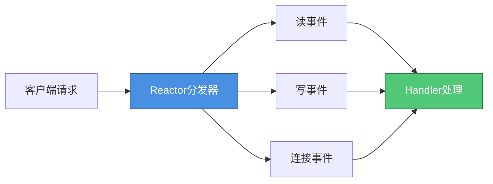
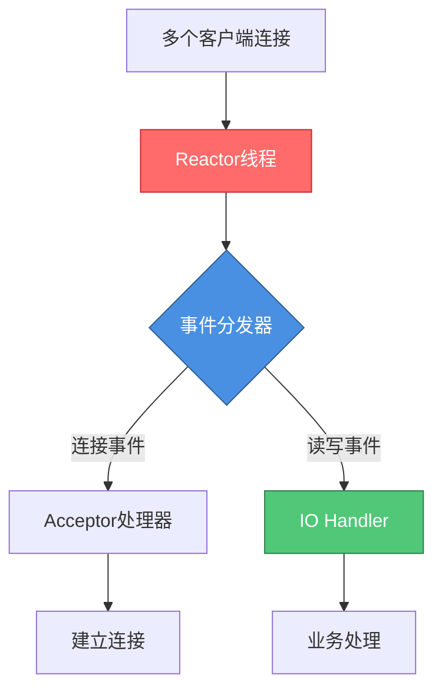
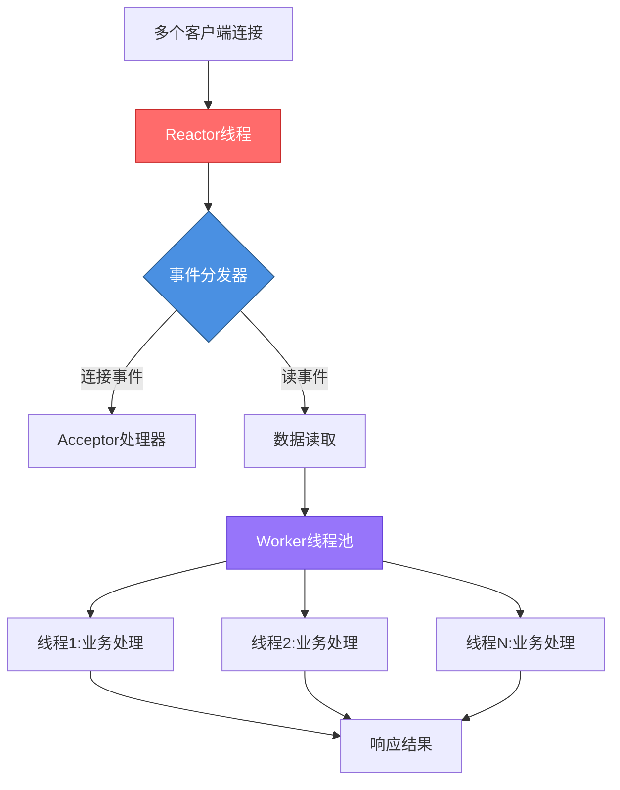
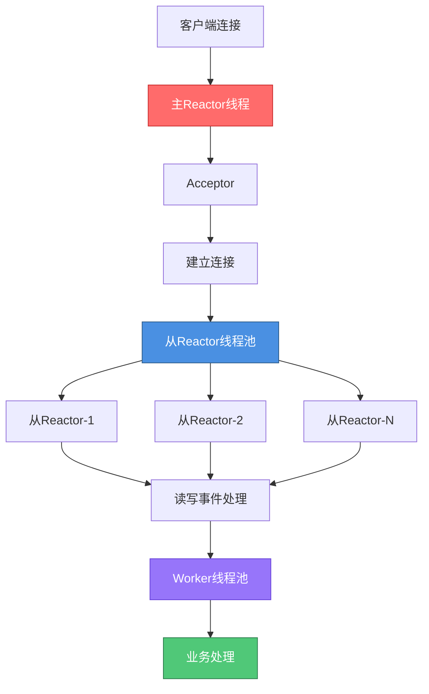

# Netty核心架构与线程模型

## Netty框架概述

Netty是由JBOSS团队研发的高性能异步事件驱动的网络通信框架。它对Java原生NIO进行了深度封装,提供了更加优雅和强大的API,主要应用于RPC通信框架、即时通讯系统、实时消息推送系统等场景。

与传统的Java NIO相比,Netty具有以下核心优势:

**API简洁易用**:Netty对Java原生NIO复杂的API进行了高度封装,大幅降低了开发难度,开发者可以更专注于业务逻辑实现。

**功能丰富强大**:内置多种编解码器,支持HTTP、WebSocket、MQTT等主流协议。通过ChannelHandler机制提供了灵活的扩展能力,可以轻松实现自定义协议。

**卓越的性能表现**:相比其他NIO框架,Netty在吞吐量、延迟、资源消耗等方面都表现出色,能够最大限度减少不必要的内存拷贝。

**活跃的社区支持**:Netty版本更新迭代快,问题响应及时,开发者可以将更多精力投入到核心业务开发中。

## Reactor线程模型基础

Netty基于Reactor模式实现高并发请求处理。Reactor模式的核心思想是通过IO多路复用技术,让单个线程能够同时监听多个连接的IO事件,从而高效应对大规模并发场景。



IO多路复用允许系统以非阻塞方式查询内核数据是否就绪,一旦数据准备完成,再发起实际的数据拷贝操作。主流的实现包括select、poll和epoll等机制。

## Netty支持的三种线程模型

Netty的线程模型并非固定不变,而是通过启动参数配置灵活切换。根据业务场景的性能需求,Netty支持三种主流Reactor模型。

### 单Reactor单线程模型

这是最基础的Reactor实现方案。服务器启动后,单个Reactor线程同时负责连接建立、事件分发和IO处理。



Reactor线程内部包含事件分发器Dispatcher,负责将不同类型的事件路由到对应的Handler。连接请求通常能快速完成,但IO读写操作涉及数据拷贝,耗时相对较长。

**模型特点**:
- Reactor线程在处理IO读写时,其他请求只能等待
- 单线程只能利用单核CPU,无法发挥多核优势
- 适用于连接数少、请求处理简单的轻量级场景

### 单Reactor多线程模型

为充分利用多核CPU性能,同时避免Reactor线程在IO处理时阻塞,引入Worker线程池来处理业务逻辑。



**工作流程**:
1. Reactor线程监听多路连接的各类事件
2. 检测到连接事件后,由Acceptor建立连接
3. 检测到读事件后,Reactor发起系统调用将数据读入内存
4. 将读取的数据分发给Worker线程池进行业务处理

此模型实现了业务处理的多线程化,但Reactor线程仍需同时处理连接和读写事件。当系统调用阻塞在数据拷贝阶段时,大量新连接可能因Reactor无法及时响应而被拒绝。

### 主从Reactor多线程模型

这是Netty推荐的高性能线程模型。通过引入Reactor线程池,将连接处理和IO处理职责分离,彻底解决了高并发场景下的连接阻塞问题。



**架构优势**:
- 主Reactor专注于连接建立,不处理读写事件
- 从Reactor线程池负责所有IO操作和数据准备
- 即使从Reactor阻塞在数据拷贝阶段,主Reactor仍可接受新连接
- 多个从Reactor可充分利用多核CPU性能

## Netty线程模型配置示例

在实际开发中,通过配置EventLoopGroup的线程数量来选择不同的线程模型:

```java
// 主从Reactor模型配置
EventLoopGroup bossGroup = new NioEventLoopGroup(1);     // 主Reactor组
EventLoopGroup workerGroup = new NioEventLoopGroup(8);   // 从Reactor组

try {
    ServerBootstrap bootstrap = new ServerBootstrap();
    bootstrap.group(bossGroup, workerGroup)
        .channel(NioServerSocketChannel.class)
        .childHandler(new ChannelInitializer<SocketChannel>() {
            @Override
            protected void initChannel(SocketChannel channel) {
                ChannelPipeline pipeline = channel.pipeline();
                // 添加订单处理器
                pipeline.addLast(new OrderDecoder());
                pipeline.addLast(new OrderEncoder());
                pipeline.addLast(new OrderServerHandler());
            }
        });
    
    ChannelFuture future = bootstrap.bind(9090).sync();
    future.channel().closeFuture().sync();
} finally {
    bossGroup.shutdownGracefully();
    workerGroup.shutdownGracefully();
}
```

```java
// 单Reactor单线程模型配置
EventLoopGroup group = new NioEventLoopGroup(1);

try {
    ServerBootstrap bootstrap = new ServerBootstrap();
    bootstrap.group(group)  // 使用同一个EventLoopGroup
        .channel(NioServerSocketChannel.class)
        .childHandler(new ProductChannelInitializer());
    
    ChannelFuture future = bootstrap.bind(8080).sync();
    future.channel().closeFuture().sync();
} finally {
    group.shutdownGracefully();
}
```

通过灵活配置线程组,Netty能够适配从简单应用到超高并发场景的各种业务需求,这也是其被广泛采用的重要原因之一。
