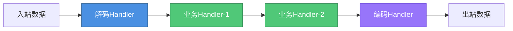
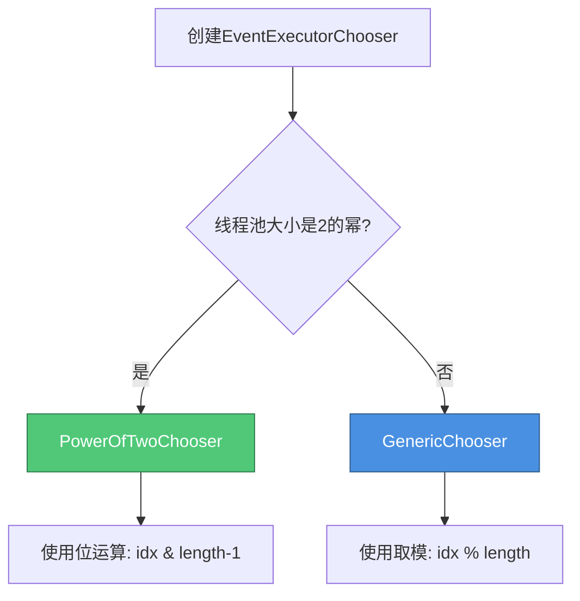

# Netty设计模式深度剖析

## 设计模式在Netty中的应用

Netty作为业界广泛使用的高性能网络框架,其代码质量和架构设计极具学习价值。框架内部巧妙运用了多种经典设计模式,既提升了代码的可维护性,又保证了系统的高性能和可扩展性。

本文将深入剖析Netty中常见的六种核心设计模式及其实现细节。

## 单例模式

单例模式确保类在整个应用生命周期中只存在唯一实例,避免重复创建对象带来的资源消耗。Netty在多个核心组件中都采用了这一模式。

### 选择策略单例

NioEventLoop通过select()方法持续轮询注册的IO事件。Netty提供了SelectStrategy对象来决定选择策略,该对象采用单例实现:

```java
final class DefaultSelectStrategy implements SelectStrategy {
    
    // 单例实例
    static final SelectStrategy INSTANCE = new DefaultSelectStrategy();
    
    // 私有构造器防止外部实例化
    private DefaultSelectStrategy() { }
    
    @Override
    public int calculateStrategy(IntSupplier selectSupplier, boolean hasTasks) throws Exception {
        // 如果有待处理任务则立即返回,否则执行select阻塞等待
        return hasTasks ? selectSupplier.get() : SelectStrategy.SELECT;
    }
}
```

### 异常对象单例

为避免频繁创建异常对象带来的性能开销,Netty将常用异常定义为单例:

```java
public final class ReadTimeoutException extends TimeoutException {
    
    private static final long serialVersionUID = 169287984113283421L;
    
    // 预创建的单例异常
    public static final ReadTimeoutException INSTANCE = new ReadTimeoutException();
    
    private ReadTimeoutException() { }
}
```

## 工厂模式

工厂模式将对象的创建逻辑封装起来,客户端无需关心具体实例化过程。Netty中大量使用了工厂模式来创建各类核心组件。

通过在代码库中搜索"Factory"关键字,可以发现几乎所有相关类都与工厂模式相关。

### 选择策略工厂

SelectStrategy对象本身也是通过工厂创建的:

```java
public final class DefaultSelectStrategyFactory implements SelectStrategyFactory {
    
    public static final SelectStrategyFactory INSTANCE = new DefaultSelectStrategyFactory();
    
    private DefaultSelectStrategyFactory() { }
    
    @Override
    public SelectStrategy newSelectStrategy() {
        // 返回选择策略单例
        return DefaultSelectStrategy.INSTANCE;
    }
}
```

这种"工厂返回单例"的组合模式在框架设计中非常常见,既保证了对象唯一性,又提供了统一的创建入口。

## 装饰器模式

装饰器模式允许在不修改原对象的前提下,动态为对象添加新功能。Netty中的WrappedByteBuf就是典型的装饰器实现。

```java
class WrappedByteBuf extends ByteBuf {
    
    // 被装饰的原始ByteBuf对象
    protected final ByteBuf buf;
    
    protected WrappedByteBuf(ByteBuf buf) {
        if (buf == null) {
            throw new NullPointerException("buf");
        }
        this.buf = buf;
    }
    
    @Override
    public final boolean hasMemoryAddress() {
        // 委托给被装饰对象
        return buf.hasMemoryAddress();
    }
    
    @Override
    public final long memoryAddress() {
        return buf.memoryAddress();
    }
    
    // 可以重写方法增强功能
    @Override
    public ByteBuf writeInt(int value) {
        // 在写入前进行校验或日志记录
        buf.writeInt(value);
        return this;
    }
}
```

通过包装原始ByteBuf,WrappedByteBuf可以添加额外的功能,如权限校验、日志记录、性能监控等,而不影响原有代码逻辑。

## 责任链模式

责任链模式将请求的发送者和接收者解耦,多个处理器形成链条依次处理请求。这是Netty中最核心的设计模式之一。

### ChannelPipeline责任链

Netty的ChannelPipeline就是典型的责任链实现。每个Channel都拥有一个Pipeline,其中包含多个ChannelHandler形成处理链。



**应用示例**:

```java
ChannelPipeline pipeline = channel.pipeline();

// 添加消息解码器
pipeline.addLast("decoder", new MessageDecoder());

// 添加身份验证处理器
pipeline.addLast("auth", new AuthenticationHandler());

// 添加业务逻辑处理器
pipeline.addLast("business", new PaymentBusinessHandler());

// 添加响应编码器
pipeline.addLast("encoder", new MessageEncoder());
```

数据在Pipeline中按添加顺序流转,每个Handler可以选择继续传递或终止处理,实现了极高的灵活性和可扩展性。

## 策略模式

策略模式定义一系列算法,将每个算法封装起来并使它们可以互相替换。Netty在多处使用策略模式来提供可配置的行为。

### EventExecutor选择策略

Netty通过EventExecutorChooser提供不同的策略来选择NioEventLoop。newChooser()方法会根据线程池大小动态选择最优的取模算法:

```java
public final class DefaultEventExecutorChooserFactory implements EventExecutorChooserFactory {
    
    public static final DefaultEventExecutorChooserFactory INSTANCE = 
        new DefaultEventExecutorChooserFactory();
    
    private DefaultEventExecutorChooserFactory() { }
    
    @Override
    public EventExecutorChooser newChooser(EventExecutor[] executors) {
        // 根据线程池大小选择不同的策略
        if (isPowerOfTwo(executors.length)) {
            return new PowerOfTwoEventExecutorChooser(executors);
        } else {
            return new GenericEventExecutorChooser(executors);
        }
    }
    
    private static boolean isPowerOfTwo(int val) {
        return (val & -val) == val;
    }
}
```

### 两种具体策略实现

**2的幂次方优化策略**:

```java
private static final class PowerOfTwoEventExecutorChooser implements EventExecutorChooser {
    private final AtomicInteger idx = new AtomicInteger();
    private final EventExecutor[] executors;
    
    PowerOfTwoEventExecutorChooser(EventExecutor[] executors) {
        this.executors = executors;
    }
    
    @Override
    public EventExecutor next() {
        // 使用位运算代替取模,性能更优
        return executors[idx.getAndIncrement() & executors.length - 1];
    }
}
```

**通用取模策略**:

```java
private static final class GenericEventExecutorChooser implements EventExecutorChooser {
    // 使用long避免32位边界的非轮询问题
    private final AtomicLong idx = new AtomicLong();
    private final EventExecutor[] executors;
    
    GenericEventExecutorChooser(EventExecutor[] executors) {
        this.executors = executors;
    }
    
    @Override
    public EventExecutor next() {
        // 标准取模运算
        return executors[(int) Math.abs(idx.getAndIncrement() % executors.length)];
    }
}
```



当线程池大小是2的幂次方时,使用位运算进行取模,性能远超传统取模运算;否则使用标准取模算法保证正确性。这种自适应的策略选择充分体现了Netty对性能的极致追求。

## 观察者模式

Netty的Future-Listener机制是观察者模式的典型应用,允许在异步操作完成时自动触发回调。

```java
ChannelFuture future = bootstrap.connect("api.payment.com", 8080);

// 添加监听器观察连接结果
future.addListener(new ChannelFutureListener() {
    @Override
    public void operationComplete(ChannelFuture f) {
        if (f.isSuccess()) {
            System.out.println("支付服务连接成功");
            // 发送支付请求
        } else {
            System.err.println("连接失败: " + f.cause().getMessage());
            // 触发重试逻辑
        }
    }
});
```

## 设计模式协同工作

这些设计模式在Netty中并非孤立存在,而是相互配合共同构建了一个高内聚低耦合的系统架构:

- **单例+工厂**: 通过工厂创建单例对象,统一管理实例生命周期
- **责任链+策略**: Pipeline中的Handler可以采用不同的处理策略
- **装饰器+责任链**: WrappedByteBuf可以作为Handler链中的一环进行功能增强
- **观察者+责任链**: 在Pipeline处理完成后触发Future监听器

正是这些经典模式的巧妙组合,成就了Netty优雅的架构设计和卓越的性能表现。深入理解这些模式的应用,对提升系统设计能力大有裨益。
