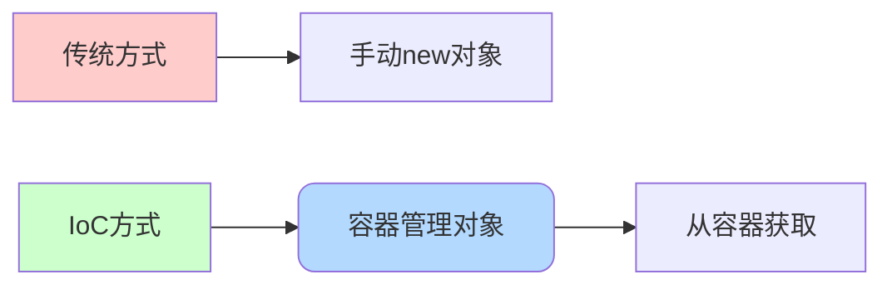
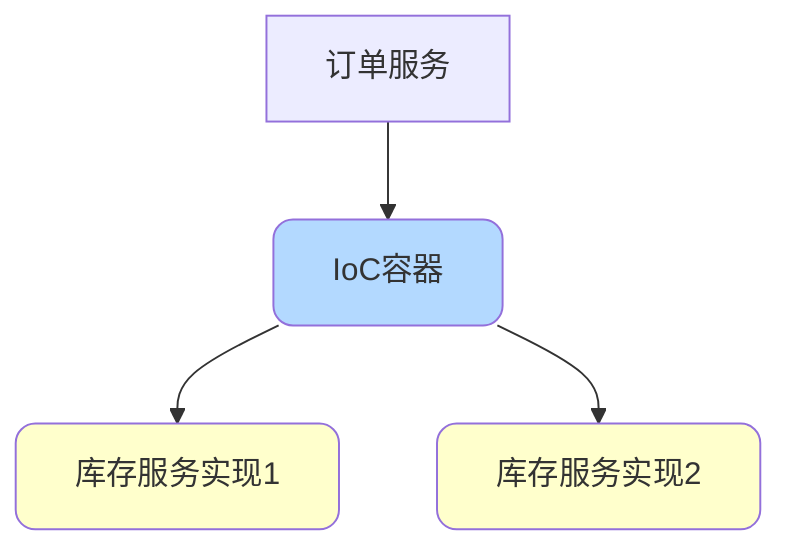
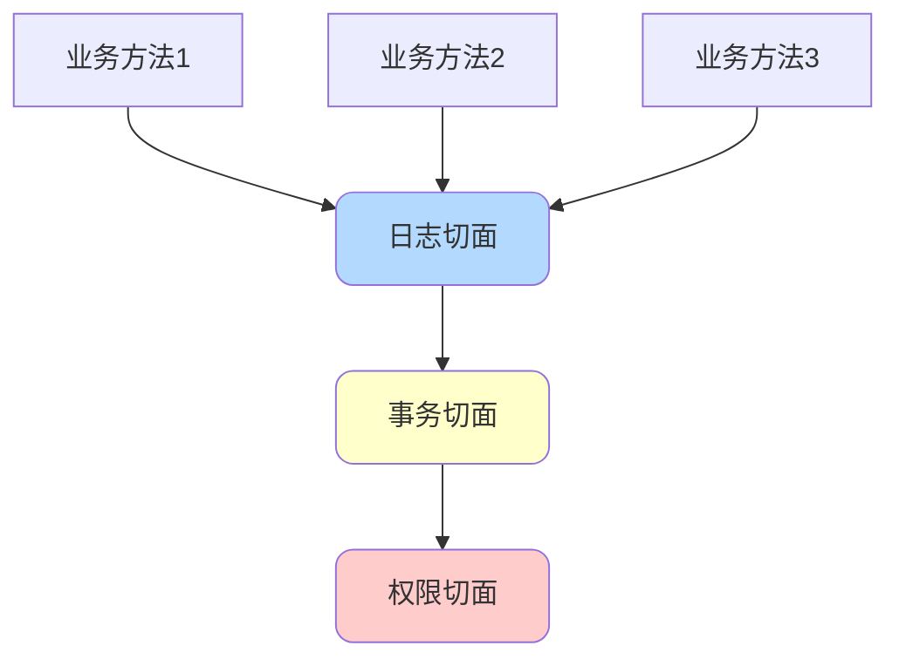
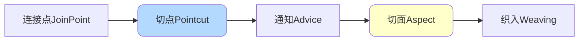
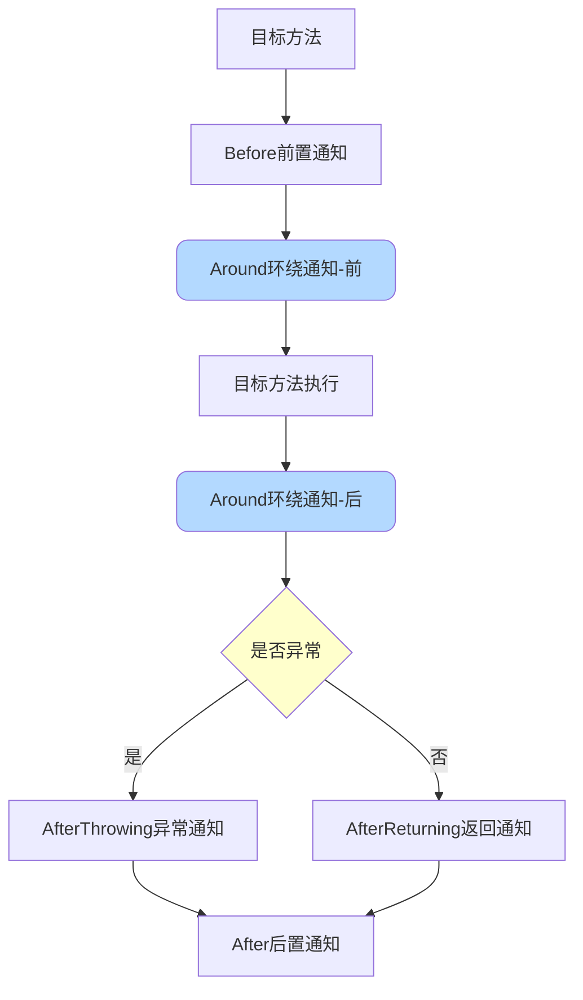
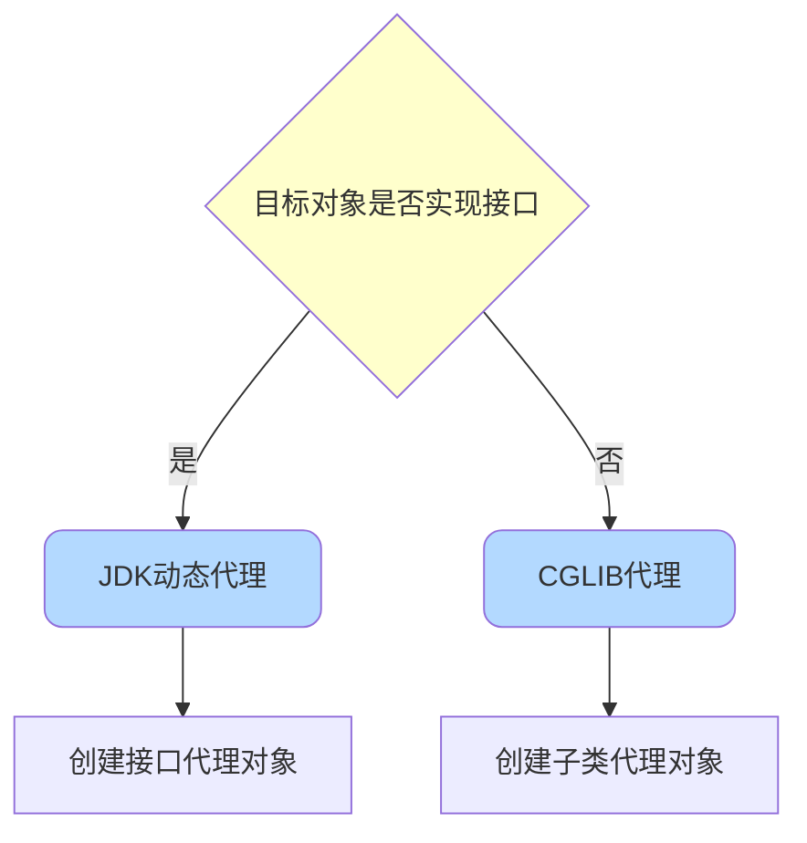
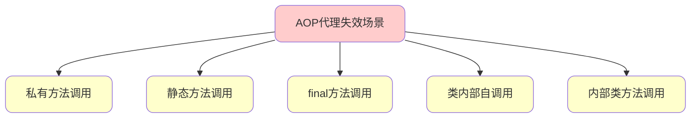
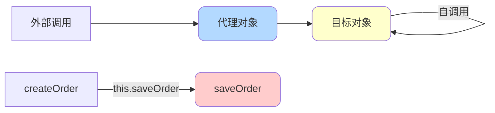
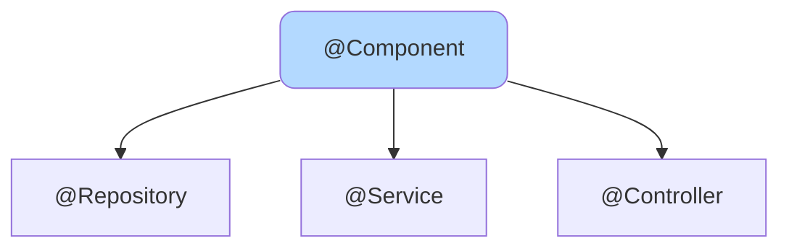
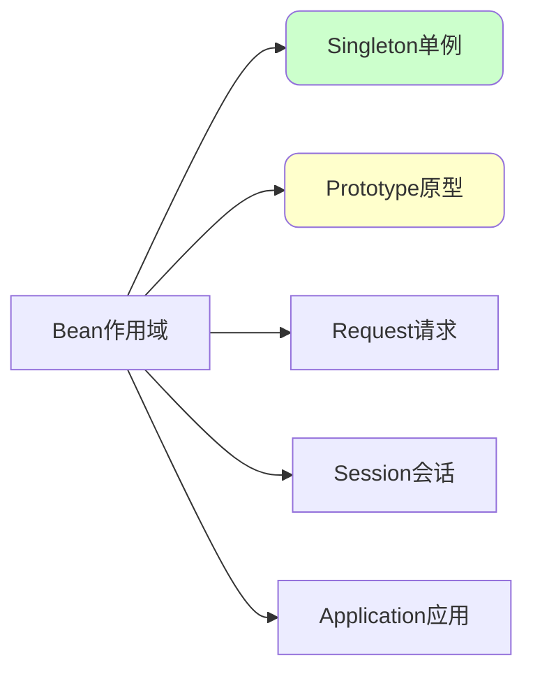

# Spring核心概念详解

## IoC控制反转

### 什么是IoC

IoC(Inversion of Control,控制反转)是一种设计思想,描述的是Java开发中对象创建和管理的问题。

传统开发方式和IoC方式的对比:

- **传统方式**:在类中手动通过new关键字创建依赖对象
- **IoC方式**:由IoC容器负责对象的实例化,我们直接从容器中获取



**控制反转的含义**:

- **控制**:对象创建和管理的权力
- **反转**:权力交给外部环境(IoC容器)

### IoC解决了什么问题

IoC让两方之间不互相依赖,由第三方容器来管理资源,带来以下好处:

1. **降低耦合度**:对象之间的依赖程度降低
2. **易于管理**:资源管理更加便捷,如轻松实现单例模式

举例说明:假设订单服务需要调用库存服务

```java
// 传统方式 - 强耦合
public class OrderService {
    // 直接创建依赖对象
    private InventoryService inventoryService = new InventoryServiceImpl();
}
```

当需求变更,要切换库存服务的实现时,必须修改所有引用的地方。

```java
// IoC方式 - 松耦合
@Service
public class OrderService {
    @Autowired
    private InventoryService inventoryService;
}
```

使用IoC后,只需要更换容器中的Bean配置,无需修改业务代码。



### IoC和DI的区别

IoC(控制反转)是一种设计思想,而DI(Dependency Injection,依赖注入)是IoC最常见的实现方式。

Martin Fowler提出将IoC改名为DI,因为DI更能精确表达这个模式的含义。

**两者关系**:

- IoC是设计理念,强调"控制权的转移"
- DI是具体实现,强调"依赖关系的注入方式"

## AOP面向切面编程

### 什么是AOP

AOP(Aspect Oriented Programming,面向切面编程)是OOP的延续,二者互补并不对立。

**AOP的目的**:将横切关注点(如日志、事务、权限等)从核心业务逻辑中分离出来,通过动态代理等技术实现代码复用和解耦。



### AOP核心术语



- **横切关注点**:多个类或对象中的公共行为(日志、事务、权限等)
- **切面(Aspect)**:对横切关注点进行封装的类
- **连接点(JoinPoint)**:方法调用或执行时的某个特定时刻
- **通知(Advice)**:切面在某个连接点要执行的操作
- **切点(Pointcut)**:匹配哪些连接点需要被增强的表达式
- **织入(Weaving)**:将切面和目标对象连接起来的过程

### AOP通知类型



- **Before(前置通知)**:目标方法调用之前触发
- **After(后置通知)**:目标方法调用之后触发
- **AfterReturning(返回通知)**:方法正常返回后触发
- **AfterThrowing(异常通知)**:方法抛出异常后触发
- **Around(环绕通知)**:可控制目标方法调用的全过程

### AOP应用场景

以日志记录为例:

**不使用AOP**:

```java
public OrderResponse createOrder(OrderRequest request) {
    // 记录日志
    logger.info("开始创建订单,参数:{}", request);
    
    // 业务逻辑
    OrderResponse response = orderService.create(request);
    
    // 记录日志
    logger.info("订单创建完成,结果:{}", response);
    return response;
}
```

**使用AOP**:

```java
// 定义日志注解
@Target(ElementType.METHOD)
@Retention(RetentionPolicy.RUNTIME)
public @interface BusinessLog {
    String description() default "";
}

// 日志切面
@Aspect
@Component
public class LogAspect {
    @Around("@annotation(businessLog)")
    public Object doAround(ProceedingJoinPoint joinPoint, BusinessLog businessLog) throws Throwable {
        logger.info("开始执行:{}", businessLog.description());
        Object result = joinPoint.proceed();
        logger.info("执行完成,结果:{}", result);
        return result;
    }
}

// 使用
@BusinessLog(description = "创建订单")
public OrderResponse createOrder(OrderRequest request) {
    return orderService.create(request);
}
```

### AOP实现方式

Spring AOP基于动态代理实现:



- **JDK Proxy**:目标对象实现了接口,创建接口的代理对象
- **CGLIB**:目标对象没有实现接口,创建目标类的子类作为代理

**Spring Boot的代理策略变化**:

- Spring Boot 2.0之前:默认使用JDK动态代理
- Spring Boot 2.0及之后:默认使用CGLIB动态代理

### AOP代理失效场景

Spring AOP是基于动态代理实现的,只有通过代理对象调用方法时,AOP才会生效。以下几种情况会导致代理失效:



#### 1. 私有方法调用

私有方法无法被代理对象拦截:

```java
@Service
public class OrderService {
    
    @Transactional
    public void processOrder(Order order) {
        validateOrder(order);  // 调用私有方法,事务不生效
    }
    
    // AOP无法拦截private方法
    @Transactional
    private void validateOrder(Order order) {
        // 验证逻辑
    }
}
```

#### 2. 静态方法调用

static方法属于类而非对象,无法通过代理拦截:

```java
@Service
public class OrderService {
    
    // AOP无法拦截static方法
    @Transactional
    public static void calculateDiscount(Order order) {
        // 计算折扣
    }
}
```

#### 3. final方法调用

final方法无法被子类覆盖,CGLIB代理无法拦截:

```java
@Service
public class OrderService {
    
    // AOP无法拦截final方法
    @Transactional
    public final void processPayment(Order order) {
        // 支付处理
    }
}
```

#### 4. 类内部自调用

在类内部直接调用本类方法,不会经过代理对象:

```java
@Service
public class OrderService {
    
    public void createOrder(Order order) {
        // 直接调用本类方法,不走代理
        saveOrder(order);  // 事务不生效!
    }
    
    @Transactional
    public void saveOrder(Order order) {
        // 保存订单
    }
}
```

**原因分析**:



在自调用时使用的是`this`,指向的是原始对象而非代理对象。

**解决方案**:

```java
@Service
public class OrderService {
    
    @Autowired
    private ApplicationContext context;
    
    public void createOrder(Order order) {
        // 方案1:通过ApplicationContext获取代理对象
        OrderService proxy = context.getBean(OrderService.class);
        proxy.saveOrder(order);  // 通过代理调用,事务生效
    }
    
    @Transactional
    public void saveOrder(Order order) {
        // 保存订单
    }
}

// 方案2:使用AopContext
@Service
@EnableAspectJAutoProxy(exposeProxy = true)
public class OrderService {
    
    public void createOrder(Order order) {
        // 获取当前代理对象
        OrderService proxy = (OrderService) AopContext.currentProxy();
        proxy.saveOrder(order);  // 通过代理调用
    }
    
    @Transactional
    public void saveOrder(Order order) {
        // 保存订单
    }
}

// 方案3:拆分成两个Service(推荐)
@Service
public class OrderService {
    
    @Autowired
    private OrderRepository orderRepository;
    
    public void createOrder(Order order) {
        orderRepository.saveOrder(order);  // 调用其他Bean,走代理
    }
}

@Service
public class OrderRepository {
    
    @Transactional
    public void saveOrder(Order order) {
        // 保存订单
    }
}
```

#### 5. 内部类方法调用

直接调用内部类方法,不经过Spring容器管理:

```java
@Service
public class OrderService {
    
    // 内部类不受Spring管理
    private class OrderValidator {
        @Transactional  // 无效
        public void validate(Order order) {
            // 验证逻辑
        }
    }
    
    public void processOrder(Order order) {
        OrderValidator validator = new OrderValidator();
        validator.validate(order);  // AOP不生效
    }
}
```

**最佳实践**:

1. **避免在同一个类中自调用**:将需要AOP增强的方法拆分到不同的Bean中
2. **不要在private/static/final方法上使用AOP注解**:这些方法无法被代理
3. **优先使用public方法**:确保方法可以被代理拦截
4. **合理设计类结构**:遵循单一职责原则,避免复杂的内部调用

## Spring Bean详解

### 什么是Spring Bean

Bean代指被IoC容器所管理的对象。我们需要通过配置元数据告诉IoC容器管理哪些对象。

配置元数据可以是:

- XML文件
- 注解
- Java配置类

```java
// 通过注解定义Bean
@Component
public class UserService {
    // ...
}
```

### Bean的声明注解

- `@Component`:通用注解,可标注任意类为Spring组件
- `@Repository`:对应持久层,主要用于数据库相关操作
- `@Service`:对应服务层,主要涉及业务逻辑
- `@Controller`:对应控制层,主要用于接收请求并调用服务层

这些注解在功能上几乎没有差异,主要是语义上的区分。



### Bean的作用域



1. **Singleton(单例)**:默认作用域,IoC容器中只有一个实例
2. **Prototype(原型)**:每次获取都创建新实例
3. **Request(请求)**:每个HTTP请求创建一个实例(仅Web应用)
4. **Session(会话)**:每个HTTP会话创建一个实例(仅Web应用)
5. **Application(应用)**:ServletContext生命周期内只有一个实例(仅Web应用)

```java
@Service
@Scope("prototype")
public class ShoppingCart {
    // 每个用户获取自己的购物车实例
}
```

### Bean的线程安全

Bean是否线程安全,取决于其作用域和状态:

- **Prototype作用域**:每次创建新实例,不存在线程安全问题
- **无状态的Singleton**:线程安全
- **有状态的Singleton**:非线程安全,需要特殊处理

```java
// 非线程安全 - 有状态
@Service
public class CounterService {
    private int count = 0;  // 共享变量
    
    public int increment() {
        return ++count;  // 存在线程安全问题
    }
}

// 线程安全 - 无状态
@Service
public class CalculatorService {
    public int add(int a, int b) {
        return a + b;  // 无共享变量,线程安全
    }
}
```

**解决方案**:

1. 修改作用域为Prototype
2. 使用并发工具类(如AtomicInteger)
3. 添加同步机制(不推荐,影响性能)

```java
// 推荐方案:使用并发工具类
@Service
public class CounterService {
    private AtomicInteger count = new AtomicInteger(0);
    
    public int increment() {
        return count.incrementAndGet();
    }
}
```
